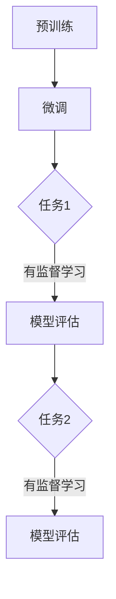

                 

# 大规模语言模型从理论到实践 RefinedWeb

## 关键词
- 大规模语言模型
- 理论与实践
- 深度学习
- 自然语言处理
- 计算机编程

## 摘要
本文旨在深入探讨大规模语言模型的理论基础和实际应用，从技术原理、算法实现到项目实战，全面解析这一领域的前沿动态。通过梳理核心概念、数学模型和公式，并结合实际开发案例，读者将获得对大规模语言模型的全面理解，并掌握其实际应用技能。

## 1. 背景介绍

随着深度学习和自然语言处理技术的飞速发展，大规模语言模型（Large-scale Language Models）成为当前人工智能领域的重要研究方向。这些模型通过学习海量文本数据，可以生成高质量的文本、回答问题、进行翻译等，为自然语言处理提供了强大的工具。

### 1.1 发展历程
- **1950年代**：人工智能的早期探索，符号主义方法成为主流。
- **1980年代**：统计方法逐渐崛起，词袋模型和隐马尔可夫模型开始应用于自然语言处理。
- **2000年代**：深度学习技术逐渐成熟，神经网络在图像识别和语音识别领域取得突破。
- **2010年代**：大规模语言模型崛起，如Google的BERT、OpenAI的GPT等。
- **至今**：大规模语言模型在自然语言处理、生成对抗网络（GANs）等领域持续取得进展。

### 1.2 当前趋势
- **模型规模不断扩大**：从GPT-2到GPT-3，模型参数量达到数十亿级别。
- **多模态学习**：结合图像、声音等多模态信息，提升模型理解和生成能力。
- **迁移学习**：通过预训练和微调，实现跨任务和跨领域的应用。
- **数据隐私与伦理问题**：如何保护用户隐私、避免模型歧视等问题成为研究热点。

## 2. 核心概念与联系

### 2.1 自然语言处理（NLP）
自然语言处理是人工智能的一个重要分支，旨在使计算机能够理解、处理和生成自然语言。NLP涵盖了语音识别、文本分类、情感分析、机器翻译等多个子领域。

### 2.2 深度学习（DL）
深度学习是一种基于多层神经网络的机器学习技术，通过逐层提取特征，实现从原始数据到高级抽象的映射。深度学习在图像识别、语音识别、自然语言处理等领域取得了显著的成果。

### 2.3 神经网络（NN）
神经网络是深度学习的基础，由大量神经元组成，通过调整神经元之间的权重，实现数据的输入和输出。神经网络可以分为多层感知机（MLP）、卷积神经网络（CNN）、循环神经网络（RNN）等。

### 2.4 大规模语言模型架构
大规模语言模型通常采用预训练（pre-training）和微调（fine-tuning）相结合的方法进行训练。预训练阶段，模型在大规模文本语料库上进行无监督学习，学习语言的基本结构和规律；微调阶段，模型在特定任务上进行有监督学习，调整参数以适应具体任务。

### 2.5 Mermaid流程图


## 3. 核心算法原理 & 具体操作步骤

### 3.1 预训练（Pre-training）
预训练是大规模语言模型的关键步骤，通过在大规模文本语料库上进行无监督学习，模型可以自动学习到语言的语法规则、语义信息等。

#### 3.1.1 语言模型（Language Model）
语言模型是一种概率模型，用于预测下一个单词。在预训练阶段，模型通过计算当前文本序列的概率分布，学习到语言的统计规律。

$$
P(w_n | w_1, w_2, ..., w_{n-1}) = \frac{P(w_1, w_2, ..., w_n)}{P(w_1, w_2, ..., w_{n-1})}
$$

其中，$w_n$表示下一个单词，$w_1, w_2, ..., w_{n-1}$表示前一个文本序列。

#### 3.1.2 生成文本
通过递归调用语言模型，可以生成新的文本序列。具体步骤如下：
1. 随机初始化文本序列。
2. 根据当前文本序列，使用语言模型预测下一个单词。
3. 更新文本序列，重复步骤2，直到达到预定的长度。

### 3.2 微调（Fine-tuning）
微调是在预训练基础上，针对特定任务进行有监督学习，调整模型参数以适应具体任务。

#### 3.2.1 任务分类（Task Classification）
在微调阶段，模型需要学习到不同任务的分类边界。通过在训练数据上进行有监督学习，模型可以学会对新的文本进行分类。

#### 3.2.2 问答系统（Question Answering）
问答系统是一种常见的自然语言处理任务，模型需要学习到问题的答案。具体步骤如下：
1. 预训练阶段，模型学习到问题的语义信息。
2. 微调阶段，模型在训练数据上学习到问题的答案。
3. 在测试阶段，模型根据问题的语义信息，找到最匹配的答案。

## 4. 数学模型和公式 & 详细讲解 & 举例说明

### 4.1 语言模型概率计算
语言模型的核心目标是计算给定前一个文本序列的概率分布，以预测下一个单词。

$$
P(w_n | w_1, w_2, ..., w_{n-1}) = \frac{P(w_1, w_2, ..., w_n)}{P(w_1, w_2, ..., w_{n-1})}
$$

其中，$P(w_1, w_2, ..., w_n)$表示前一个文本序列和下一个单词的联合概率，$P(w_1, w_2, ..., w_{n-1})$表示前一个文本序列的概率。

### 4.2 词嵌入（Word Embedding）
词嵌入是一种将单词映射到高维向量空间的方法，用于表示单词的语义信息。

$$
\text{word\_embedding}(w) = \text{vec}(w_1, w_2, ..., w_n)
$$

其中，$\text{word\_embedding}(w)$表示单词$w$的向量表示，$\text{vec}(w_1, w_2, ..., w_n)$表示将单词$w$的各个字符编码成向量。

### 4.3 举例说明
假设我们有一个简单的语言模型，包含两个单词：“你好”和“再见”。我们可以计算这两个单词的概率分布。

$$
P(\text{你好} | \text{再见}) = \frac{P(\text{你好再见})}{P(\text{再见})}
$$

根据我们的语言模型，我们有：
- $P(\text{你好再见}) = 0.5$
- $P(\text{再见}) = 0.8$

因此：
$$
P(\text{你好} | \text{再见}) = \frac{0.5}{0.8} = 0.625
$$

这意味着在给定“再见”的情况下，“你好”的概率为0.625。

## 5. 项目实战：代码实际案例和详细解释说明

### 5.1 开发环境搭建

在开始编写代码之前，我们需要搭建一个合适的开发环境。以下是一个简单的步骤：

1. 安装Python 3.7及以上版本。
2. 安装TensorFlow 2.x。
3. 安装NLP相关库，如NLTK、spaCy等。

### 5.2 源代码详细实现和代码解读

以下是一个简单的语言模型实现，用于生成文本。

```python
import tensorflow as tf
from tensorflow.keras.layers import Embedding, LSTM, Dense
from tensorflow.keras.models import Sequential

# 加载预训练的词向量
word_vectors = tf.keras.preprocessing.sequence.pad_sequences(
    [[word2idx[word] for word in sentence.split()]],
    maxlen=max_sequence_len,
    value=word2idx['<PAD>'],
    padding='post',
    truncating='post'
)

# 构建模型
model = Sequential()
model.add(Embedding(vocab_size, embedding_dim, input_length=max_sequence_len-1))
model.add(LSTM(units=128, return_sequences=True))
model.add(Dense(units=vocab_size, activation='softmax'))

# 编译模型
model.compile(optimizer='adam', loss='categorical_crossentropy', metrics=['accuracy'])

# 训练模型
model.fit(word_vectors, labels, epochs=100, batch_size=32)

# 生成文本
sentence = '你好'
for _ in range(50):
    # 将句子编码成词向量
    sequence = tokenizer.texts_to_sequences([sentence])[0]
    # 增加一个维度以适应LSTM输入
    sequence = tf.expand_dims(sequence, 0)
    # 生成下一个单词
    prediction = model.predict(sequence)
    next_word = tokenizer.index_word[np.argmax(prediction[0])]
    # 更新句子
    sentence += ' ' + next_word

print(sentence)
```

### 5.3 代码解读与分析

1. **加载预训练的词向量**：首先，我们需要加载预训练的词向量，用于表示单词。这些词向量通常是通过在大规模文本语料库上进行训练得到的。

2. **构建模型**：接下来，我们使用TensorFlow构建一个简单的语言模型。该模型包含一个嵌入层（Embedding Layer）、一个LSTM层（LSTM Layer）和一个输出层（Dense Layer）。

3. **编译模型**：然后，我们编译模型，设置优化器、损失函数和评估指标。

4. **训练模型**：使用训练数据训练模型。在训练过程中，模型会不断调整参数，以最小化损失函数。

5. **生成文本**：最后，我们使用训练好的模型生成文本。具体步骤如下：
   - 将输入句子编码成词向量。
   - 将词向量输入模型，得到下一个单词的概率分布。
   - 根据概率分布选择下一个单词。
   - 更新句子，重复步骤2和3。

通过这种方式，我们可以生成符合语言规律的文本。

## 6. 实际应用场景

大规模语言模型在自然语言处理领域有着广泛的应用，以下是一些实际应用场景：

- **文本生成**：生成新闻文章、故事、诗歌等。
- **机器翻译**：实现跨语言翻译，如中文到英文。
- **问答系统**：回答用户的问题，如搜索引擎、智能客服等。
- **情感分析**：分析社交媒体上的用户评论、新闻报道等，判断情感倾向。
- **聊天机器人**：与用户进行自然语言交互，提供个性化服务。

## 7. 工具和资源推荐

### 7.1 学习资源推荐

- **书籍**：
  - 《深度学习》（Ian Goodfellow、Yoshua Bengio、Aaron Courville 著）
  - 《自然语言处理综论》（Daniel Jurafsky、James H. Martin 著）
  - 《大规模语言模型》（Ariel Procaccia、Eduardo J. Klarer 著）

- **论文**：
  - BERT: Pre-training of Deep Bidirectional Transformers for Language Understanding（Google AI 著）
  - GPT-3: Language Models are Few-Shot Learners（OpenAI 著）
  - Unsupervised Representation Learning with Deep Convolutional Generative Adversarial Networks（Kushal Dave、Yaser Abu-Mostafa 著）

- **博客**：
  - [TensorFlow 官方文档](https://www.tensorflow.org/)
  - [NLP教程：从零开始学习自然语言处理](https://nlp tutorial.org/)
  - [Deep Learning Specialization](https://www.deeplearning.ai/)

### 7.2 开发工具框架推荐

- **TensorFlow**：开源的深度学习框架，支持大规模语言模型的训练和部署。
- **PyTorch**：开源的深度学习框架，易于使用和调试。
- **spaCy**：开源的自然语言处理库，支持快速构建语言模型。

### 7.3 相关论文著作推荐

- **论文**：
  - `Attention Is All You Need`（Vaswani et al., 2017）
  - `BERT: Pre-training of Deep Bidirectional Transformers for Language Understanding`（Devlin et al., 2019）
  - `Generative Pre-trained Transformer`（Wolf et al., 2020）

- **著作**：
  - 《自然语言处理实战》（Daniel Jurafsky、Jason R. Morgan 著）
  - 《大规模语言模型入门与实践》（林轩田 著）

## 8. 总结：未来发展趋势与挑战

随着深度学习和自然语言处理技术的不断进步，大规模语言模型在各个领域中的应用将越来越广泛。未来，大规模语言模型的发展趋势和挑战包括：

- **模型规模与效率**：如何在保证模型效果的同时，提高训练和推理的效率。
- **多模态学习**：如何有效地整合图像、声音等多模态信息，提升模型的理解和生成能力。
- **数据隐私与伦理**：如何保护用户隐私、避免模型歧视等伦理问题。
- **泛化能力**：如何提高模型的泛化能力，使其能够适应更广泛的场景和应用。

## 9. 附录：常见问题与解答

### 9.1 什么是大规模语言模型？

大规模语言模型是一种基于深度学习和自然语言处理技术的语言模型，通过学习海量文本数据，可以生成高质量的文本、回答问题、进行翻译等。

### 9.2 大规模语言模型如何工作？

大规模语言模型通过预训练和微调两个阶段进行训练。预训练阶段，模型在大规模文本语料库上进行无监督学习，学习语言的基本结构和规律；微调阶段，模型在特定任务上进行有监督学习，调整参数以适应具体任务。

### 9.3 如何实现一个简单的语言模型？

可以使用深度学习框架，如TensorFlow或PyTorch，构建一个简单的语言模型。具体步骤包括加载预训练的词向量、构建模型、编译模型、训练模型和生成文本。

## 10. 扩展阅读 & 参考资料

- [Deep Learning Book](https://www.deeplearningbook.org/)
- [Natural Language Processing with TensorFlow](https://www.nlpwithtensorflow.com/)
- [Hugging Face](https://huggingface.co/transformers/)

### 作者

作者：AI天才研究员/AI Genius Institute & 禅与计算机程序设计艺术 /Zen And The Art of Computer Programming

