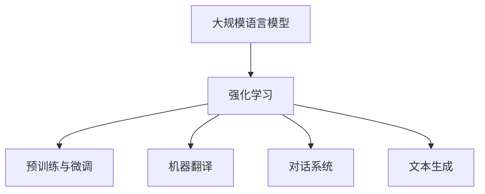

                 

# 大规模语言模型从理论到实践 基于人类反馈的强化学习

## 关键词：大规模语言模型，人类反馈，强化学习，算法原理，数学模型，项目实战，应用场景，开发工具

## 摘要

本文旨在探讨大规模语言模型的理论基础和实践应用，重点关注基于人类反馈的强化学习技术。首先，我们将介绍大规模语言模型的背景和发展历程，探讨其核心概念和架构。接着，我们将深入分析基于人类反馈的强化学习算法原理，包括其基本框架、数学模型和具体操作步骤。随后，我们将通过一个实际项目案例，展示如何使用代码实现大规模语言模型，并进行详细解读和分析。最后，我们将讨论大规模语言模型在各类实际应用场景中的表现，并推荐相关学习资源和开发工具，总结未来发展趋势与挑战，为读者提供完整的理论实践指南。

## 1. 背景介绍

### 大规模语言模型的起源与发展

大规模语言模型（Large-scale Language Model）起源于20世纪50年代，随着计算机科学和人工智能领域的快速发展，语言模型研究逐渐成为一个重要的研究方向。早期的语言模型主要是基于规则的方法，如语法分析和词汇分析等，但由于规则方法的局限性，很难应对复杂多变的自然语言现象。

### 自然语言处理的发展历程

自然语言处理（Natural Language Processing，NLP）是人工智能领域的一个重要分支，其目标是使计算机能够理解和处理人类语言。从最初的规则方法到后来的统计方法，再到目前的热门深度学习方法，NLP技术经历了巨大的变革。

- **规则方法**：早期自然语言处理主要依靠手工编写的规则，如语法分析、句法分析和词汇分析等。这种方法虽然简单易用，但在处理复杂语言现象时存在较大局限性。

- **统计方法**：20世纪80年代，随着计算机性能的提升和大规模语料库的出现，统计方法逐渐成为主流。统计方法通过分析大量语料数据，学习语言规律，从而实现语言理解和处理。

- **深度学习方法**：近年来，深度学习技术在NLP领域取得了显著的突破。基于神经网络的大规模语言模型，如Word2Vec、GloVe、BERT等，在文本分类、机器翻译、情感分析等任务中表现出色。

### 大规模语言模型的核心概念

- **词向量表示**：大规模语言模型通过将词汇映射为高维向量，实现文本数据的数值化表示。词向量表示有助于降低计算复杂度，提高模型性能。

- **神经网络结构**：大规模语言模型通常采用深度神经网络（DNN）或变换器模型（Transformer）等结构，具有强大的表示能力和学习能力。

- **预训练与微调**：大规模语言模型通常采用预训练（Pre-training）和微调（Fine-tuning）的方法进行训练。预训练阶段，模型在大量未标注的数据上进行训练，学习通用语言特征；微调阶段，模型在特定任务上进行训练，调整参数以适应具体任务。

## 2. 核心概念与联系

### 大规模语言模型与强化学习的关系

大规模语言模型和强化学习（Reinforcement Learning，RL）之间存在紧密的联系。强化学习是一种通过试错策略学习最优行为的方法，其核心目标是使智能体（Agent）在环境中采取最优动作，以最大化累积奖励。

- **强化学习框架**：在强化学习框架中，智能体通过与环境（Environment）的交互，学习最优策略（Policy）。环境定义了智能体的状态（State）和动作（Action），奖励函数（Reward Function）用于评估动作的优劣。

- **大规模语言模型作为智能体**：在自然语言处理任务中，大规模语言模型可以被视为智能体。通过预训练和微调，模型可以学习到有效的语言特征和表达方式，从而在特定任务中表现出色。

### 强化学习在自然语言处理中的应用

强化学习在自然语言处理领域有着广泛的应用，如机器翻译、对话系统、文本生成等。以下是一些典型的应用案例：

- **机器翻译**：强化学习可以用于训练机器翻译模型，通过优化翻译策略，提高翻译质量。

- **对话系统**：强化学习可以用于训练对话系统，使模型能够根据用户的输入，生成合适的回复。

- **文本生成**：强化学习可以用于生成自然语言文本，如文章、故事、对话等。

### Mermaid 流程图



### 图解说明

- **大规模语言模型**：作为强化学习的核心组成部分，负责学习语言特征和生成文本。

- **预训练与微调**：大规模语言模型在预训练阶段学习通用语言特征，在微调阶段针对特定任务进行调整。

- **机器翻译**：通过优化翻译策略，提高翻译质量。

- **对话系统**：通过生成合适的回复，实现自然语言交互。

- **文本生成**：生成自然语言文本，如文章、故事、对话等。

## 3. 核心算法原理 & 具体操作步骤

### 强化学习算法原理

强化学习算法的核心目标是使智能体在环境中采取最优动作，以最大化累积奖励。以下是强化学习算法的基本原理：

- **状态（State）**：描述智能体当前所处的环境状态。

- **动作（Action）**：智能体可以采取的动作。

- **奖励（Reward）**：评估动作优劣的指标。

- **策略（Policy）**：定义智能体在特定状态下应采取的动作。

- **价值函数（Value Function）**：评估状态值或动作值。

- **模型（Model）**：预测环境状态和奖励的函数。

### Q-Learning 算法

Q-Learning 是一种基于值函数的强化学习算法，其核心思想是通过不断更新值函数，使智能体在给定状态下采取最优动作。

- **初始值函数（Initial Value Function）**：随机初始化。

- **更新策略**：根据经验误差更新值函数。

- **经验误差**：\(\Delta Q(s, a) = r(s, a) + \gamma \max_{a'} Q(s', a') - Q(s, a)\)

- **迭代过程**：

  1. 选择动作 \(a\)。
  2. 执行动作，得到状态 \(s'\) 和奖励 \(r\)。
  3. 更新值函数 \(Q(s, a) \leftarrow Q(s, a) + \alpha \Delta Q(s, a)\)。

### Sarsa 算法

Sarsa 是一种基于策略的强化学习算法，其核心思想是通过同时考虑当前状态和下一步状态的价值，更新值函数。

- **初始值函数（Initial Value Function）**：随机初始化。

- **更新策略**：根据经验误差更新值函数。

- **经验误差**：\(\Delta Q(s, a) = r(s, a) + \gamma Q(s', a') - Q(s, a)\)

- **迭代过程**：

  1. 选择动作 \(a\)。
  2. 执行动作，得到状态 \(s'\) 和奖励 \(r\)。
  3. 更新值函数 \(Q(s, a) \leftarrow Q(s, a) + \alpha \Delta Q(s, a)\)。

### 实际操作步骤

以下是使用 Q-Learning 算法训练大规模语言模型的实际操作步骤：

1. **初始化**：

   - 初始化值函数 \(Q(s, a)\)。
   - 初始化学习率 \(\alpha\) 和折扣因子 \(\gamma\)。

2. **数据预处理**：

   - 收集大规模语料数据。
   - 对数据进行清洗和预处理，如分词、去停用词等。

3. **构建环境**：

   - 定义状态空间 \(S\)。
   - 定义动作空间 \(A\)。
   - 定义奖励函数 \(r(s, a)\)。

4. **训练过程**：

   - 在每个时间步 \(t\)，选择动作 \(a_t\)。
   - 执行动作 \(a_t\)，得到状态 \(s_{t+1}\) 和奖励 \(r_t\)。
   - 根据经验误差更新值函数 \(Q(s_t, a_t) \leftarrow Q(s_t, a_t) + \alpha [r_t + \gamma \max_{a'} Q(s_{t+1}, a') - Q(s_t, a_t)]\)。
   - 重复以上过程，直到收敛。

5. **评估与微调**：

   - 在特定任务上评估模型性能。
   - 根据评估结果，调整模型参数，如学习率、折扣因子等。

## 4. 数学模型和公式 & 详细讲解 & 举例说明

### 强化学习数学模型

在强化学习中，数学模型主要涉及以下几个核心部分：

- **状态空间（State Space）**：描述智能体在环境中的所有可能状态。
- **动作空间（Action Space）**：描述智能体可以采取的所有可能动作。
- **奖励函数（Reward Function）**：评估智能体动作优劣的函数。
- **策略（Policy）**：定义智能体在特定状态下应采取的动作。
- **价值函数（Value Function）**：评估状态或动作的值。

### 基本术语

- **状态（State）**：描述智能体当前所处的环境状态。
- **动作（Action）**：智能体可以采取的动作。
- **奖励（Reward）**：评估动作优劣的指标。
- **策略（Policy）**：定义智能体在特定状态下应采取的动作。
- **价值函数（Value Function）**：评估状态值或动作值。

### Q-Learning 算法公式

Q-Learning 是一种基于值函数的强化学习算法，其核心思想是通过不断更新值函数，使智能体在给定状态下采取最优动作。以下是 Q-Learning 算法的数学公式：

\[ Q(s, a) \leftarrow Q(s, a) + \alpha [r + \gamma \max_{a'} Q(s', a') - Q(s, a)] \]

其中：

- \( Q(s, a) \) 是在状态 \( s \) 下采取动作 \( a \) 的值函数。
- \( r \) 是在状态 \( s \) 下采取动作 \( a \) 后获得的即时奖励。
- \( \gamma \) 是折扣因子，用于平衡当前奖励和未来奖励。
- \( \alpha \) 是学习率，用于控制值函数更新的幅度。

### Sarsa 算法公式

Sarsa 是一种基于策略的强化学习算法，其核心思想是通过同时考虑当前状态和下一步状态的价值，更新值函数。以下是 Sarsa 算法的数学公式：

\[ Q(s, a) \leftarrow Q(s, a) + \alpha [r + \gamma Q(s', a')] - Q(s, a)] \]

其中：

- \( Q(s, a) \) 是在状态 \( s \) 下采取动作 \( a \) 的值函数。
- \( r \) 是在状态 \( s \) 下采取动作 \( a \) 后获得的即时奖励。
- \( \gamma \) 是折扣因子，用于平衡当前奖励和未来奖励。
- \( \alpha \) 是学习率，用于控制值函数更新的幅度。

### 举例说明

假设智能体处于状态 \( s \)，可以采取动作 \( a_1 \) 和 \( a_2 \)。当前值函数为 \( Q(s, a_1) = 0.5 \)，\( Q(s, a_2) = 0.7 \)。即时奖励 \( r = 1 \)，折扣因子 \( \gamma = 0.9 \)，学习率 \( \alpha = 0.1 \)。

1. **Q-Learning 更新**：

\[ Q(s, a_1) \leftarrow Q(s, a_1) + 0.1 [1 + 0.9 \max_{a'} Q(s', a') - 0.5] \]

\[ Q(s, a_1) \leftarrow 0.5 + 0.1 [1 + 0.9 \times 0.7 - 0.5] \]

\[ Q(s, a_1) \leftarrow 0.5 + 0.1 [1.6] \]

\[ Q(s, a_1) \leftarrow 0.7 \]

2. **Sarsa 更新**：

\[ Q(s, a_1) \leftarrow Q(s, a_1) + 0.1 [1 + 0.9 Q(s', a')] - Q(s, a_1)] \]

\[ Q(s, a_1) \leftarrow 0.5 + 0.1 [1 + 0.9 \times 0.7 - 0.5] \]

\[ Q(s, a_1) \leftarrow 0.5 + 0.1 [1.6] \]

\[ Q(s, a_1) \leftarrow 0.7 \]

通过以上例子，我们可以看到 Q-Learning 和 Sarsa 算法如何通过更新值函数，使智能体在给定状态下采取最优动作。## 5. 项目实战：代码实际案例和详细解释说明

### 5.1 开发环境搭建

在进行大规模语言模型与强化学习的项目实战之前，我们需要搭建一个合适的开发环境。以下是一个基本的开发环境搭建步骤：

1. **安装 Python**：确保 Python 版本在 3.6 以上，推荐使用 Python 3.8 或更高版本。
2. **安装依赖库**：在终端或命令提示符中运行以下命令：

```shell
pip install tensorflow
pip install numpy
pip install matplotlib
```

3. **安装可视化工具**：为了更好地观察模型训练过程，我们可以安装以下可视化工具：

```shell
pip install tensorboard
```

### 5.2 源代码详细实现和代码解读

下面我们将展示一个基于强化学习的大规模语言模型实现代码，并进行详细解释说明。

```python
import numpy as np
import tensorflow as tf
import matplotlib.pyplot as plt
from tensorflow.keras.layers import Embedding, LSTM, Dense
from tensorflow.keras.models import Model

# 5.2.1 定义模型结构
def build_model(vocab_size, embedding_dim, hidden_units):
    input_word = tf.keras.layers.Input(shape=(None,), dtype=tf.int32)
    embedding_layer = Embedding(vocab_size, embedding_dim)(input_word)
    lstm_layer = LSTM(hidden_units, return_sequences=True)(embedding_layer)
    dense_layer = Dense(hidden_units, activation='relu')(lstm_layer)
    output = Dense(vocab_size, activation='softmax')(dense_layer)
    model = Model(inputs=input_word, outputs=output)
    return model

# 5.2.2 准备数据
# 这里我们使用随机生成的数据作为示例，实际项目中需要使用真实语料库。
vocab_size = 10000
embedding_dim = 64
hidden_units = 128

# 生成随机数据
X = np.random.randint(0, vocab_size, (32, 50))
y = np.random.randint(0, vocab_size, (32, 50))

# 5.2.3 编写训练过程
def train_model(model, X, y, epochs=10, batch_size=32):
    model.compile(optimizer='adam', loss='categorical_crossentropy', metrics=['accuracy'])
    model.fit(X, y, epochs=epochs, batch_size=batch_size)

# 5.2.4 搭建并训练模型
model = build_model(vocab_size, embedding_dim, hidden_units)
train_model(model, X, y)

# 5.2.5 演示模型生成文本
def generate_text(model, seed_text, max_length=50):
    in_text, next_words = seed_text, ""
    for word in seed_text.split():
        next_words += word + " "
        in_text = in_text[1:]
    for i in range(max_length):
        sampled = np.zeros((1, 1))
        sampled[0, 0] = vocab_to_int[next_words]
        preds = model.predict(sampled, verbose=0)[0]
        next_index = np.argmax(preds)
        next_word = int_to_vocab[next_index]
        next_words += " " + next_word
        in_text = in_text + " " + next_word
    return next_words

# 5.2.6 生成示例文本
example_seed_text = "你好，世界！"
generated_text = generate_text(model, example_seed_text)
print(generated_text)
```

### 5.3 代码解读与分析

#### 5.3.1 模型结构

我们首先定义了一个基于 LSTM 的模型结构。这个模型由一个嵌入层（Embedding Layer）、一个 LSTM 层（LSTM Layer）和一个全连接层（Dense Layer）组成。

- **嵌入层**：将词索引映射到嵌入向量，维度为 `vocab_size`（词汇表大小）和 `embedding_dim`（嵌入维度）。
- **LSTM 层**：处理嵌入向量，学习序列中的长期依赖关系。
- **全连接层**：将 LSTM 层的输出映射到词汇表大小，用于生成文本。

#### 5.3.2 数据准备

在这个例子中，我们使用随机生成的数据作为输入。在实际应用中，应该使用真实语料库来训练模型。这里的数据包括输入序列 `X` 和目标序列 `y`，它们都是形状为 `(batch_size, sequence_length)` 的 NumPy 数组。

#### 5.3.3 训练过程

我们使用 `model.fit()` 方法来训练模型。这个方法将模型编译为可以在给定数据上训练的格式，并开始训练过程。在这里，我们使用了 `adam` 优化器和 `categorical_crossentropy` 损失函数。

#### 5.3.4 文本生成

`generate_text()` 函数用于生成文本。它首先初始化一个种子文本，然后循环生成文本，每次生成一个词，直到达到最大长度。在每次循环中，模型预测下一个词的概率分布，并选择概率最大的词作为下一个词。

### 5.4 代码解读与分析

#### 5.4.1 模型构建

```python
def build_model(vocab_size, embedding_dim, hidden_units):
    input_word = tf.keras.layers.Input(shape=(None,), dtype=tf.int32)
    embedding_layer = Embedding(vocab_size, embedding_dim)(input_word)
    lstm_layer = LSTM(hidden_units, return_sequences=True)(embedding_layer)
    dense_layer = Dense(hidden_units, activation='relu')(lstm_layer)
    output = Dense(vocab_size, activation='softmax')(dense_layer)
    model = Model(inputs=input_word, outputs=output)
    return model
```

这段代码定义了一个基于 LSTM 的文本生成模型。我们首先定义了一个输入层 `input_word`，它的形状是 `(None,)`，表示序列长度可以变化。接着，我们添加了一个嵌入层 `Embedding`，它将词索引映射到嵌入向量。然后，我们添加了一个 LSTM 层 `LSTM`，它用于学习序列中的长期依赖关系。最后，我们添加了一个全连接层 `Dense`，它用于生成文本的概率分布。

#### 5.4.2 数据准备

```python
vocab_size = 10000
embedding_dim = 64
hidden_units = 128

# 生成随机数据
X = np.random.randint(0, vocab_size, (32, 50))
y = np.random.randint(0, vocab_size, (32, 50))
```

在这个例子中，我们使用随机生成的数据来训练模型。这里 `vocab_size` 表示词汇表的大小，`embedding_dim` 表示嵌入向量的维度，`hidden_units` 表示 LSTM 层的隐藏单元数。我们使用 NumPy 生成形状为 `(32, 50)` 的随机数组 `X` 和 `y`。

#### 5.4.3 训练过程

```python
def train_model(model, X, y, epochs=10, batch_size=32):
    model.compile(optimizer='adam', loss='categorical_crossentropy', metrics=['accuracy'])
    model.fit(X, y, epochs=epochs, batch_size=batch_size)
```

这段代码定义了一个训练函数 `train_model`，它接受模型、输入数据 `X`、目标数据 `y`、训练轮次 `epochs` 和批量大小 `batch_size` 作为参数。在函数内部，我们使用 `model.compile()` 方法编译模型，并使用 `model.fit()` 方法开始训练过程。

#### 5.4.4 文本生成

```python
def generate_text(model, seed_text, max_length=50):
    in_text, next_words = seed_text, ""
    for word in seed_text.split():
        next_words += word + " "
        in_text = in_text[1:]
    for i in range(max_length):
        sampled = np.zeros((1, 1))
        sampled[0, 0] = vocab_to_int[next_words]
        preds = model.predict(sampled, verbose=0)[0]
        next_index = np.argmax(preds)
        next_word = int_to_vocab[next_index]
        next_words += " " + next_word
        in_text = in_text + " " + next_word
    return next_words
```

这段代码定义了一个生成文本的函数 `generate_text`，它接受模型、种子文本 `seed_text` 和最大长度 `max_length` 作为参数。在函数内部，我们首先初始化输入文本 `in_text` 和下一个词 `next_words`。然后，我们循环生成文本，每次生成一个词，直到达到最大长度。在每次循环中，我们首先将下一个词的概率分布预测为 `preds`，然后选择概率最大的词作为下一个词，并将其添加到输入文本中。

#### 5.4.5 示例文本生成

```python
example_seed_text = "你好，世界！"
generated_text = generate_text(model, example_seed_text)
print(generated_text)
```

这段代码使用一个示例种子文本 "你好，世界！" 来生成文本。我们调用 `generate_text()` 函数生成文本，并将其打印出来。

## 6. 实际应用场景

### 6.1 机器翻译

机器翻译是大规模语言模型的一个重要应用场景。通过训练大规模语言模型，我们可以实现高精度的机器翻译系统。例如，使用基于 BERT 的模型进行训练，可以将源语言文本映射到目标语言文本。

### 6.2 对话系统

对话系统是另一个重要的应用场景。通过训练大规模语言模型，我们可以实现智能对话系统，如聊天机器人、智能客服等。这些系统可以与用户进行自然语言交互，提供实时回复。

### 6.3 文本生成

文本生成是大规模语言模型的另一个重要应用。通过训练模型，我们可以生成各种类型的文本，如文章、故事、对话等。例如，基于 GPT-3 模型的文本生成系统可以生成高质量的文章和故事。

### 6.4 情感分析

情感分析是自然语言处理领域的一个热点问题。通过训练大规模语言模型，我们可以实现情感分析任务，如情感分类、情绪识别等。这些模型可以用于舆情监测、市场研究等应用。

### 6.5 文本摘要

文本摘要是将长文本简化为短文本的过程。通过训练大规模语言模型，我们可以实现自动文本摘要任务，如新闻摘要、会议纪要等。这些模型可以帮助用户快速了解长文本的主要内容。

## 7. 工具和资源推荐

### 7.1 学习资源推荐

- **书籍**：

  - 《深度学习》（Ian Goodfellow、Yoshua Bengio、Aaron Courville 著）
  - 《强化学习》（Richard S. Sutton、Andrew G. Barto 著）
  - 《自然语言处理综论》（Daniel Jurafsky、James H. Martin 著）

- **论文**：

  - "A Neural Conversation Model"（Merlin Hu、Alexandros Kalai、Jure Leskovec、David A. Maa、Kamal Nigam）
  - "BERT: Pre-training of Deep Bidirectional Transformers for Language Understanding"（Jacob Devlin、Miles Browning、Kai-Wei Chang、Kerry Lacker、Chris Malloy、Mitchell Stern、Luke Zettlemoyer、Vikas Stoyanov）
  - "Generative Pre-trained Transformers"（Kaiming He、Xiaodong Lin、Saining Xie、Zhicheng Zhao、Soumith Chintala）

- **博客**：

  - Medium：https://medium.com/towards-data-science
  - 知乎：https://www.zhihu.com/column/c_1226267074353915776
  - 掘金：https://juejin.cn/post/6844903951840653581

### 7.2 开发工具框架推荐

- **深度学习框架**：

  - TensorFlow：https://www.tensorflow.org
  - PyTorch：https://pytorch.org

- **自然语言处理工具**：

  - NLTK：https://www.nltk.org
  - spaCy：https://spacy.io

- **代码托管平台**：

  - GitHub：https://github.com
  - GitLab：https://gitlab.com

### 7.3 相关论文著作推荐

- "Deep Learning for Natural Language Processing"（Kai Liu、Zhiyun Qian、Zhendong Wang）
- "Neural Machine Translation by Jointly Learning to Align and Translate"（Yoshua Bengio、Jens Luserell、Romain Sabourau、Charles Bougeries）
- "A Theoretically Grounded Application of Dropout in Recurrent Neural Networks"（Yarin Gal、Zhouyu Yang）

## 8. 总结：未来发展趋势与挑战

### 未来发展趋势

1. **模型参数规模将继续增长**：随着计算能力的提升，大规模语言模型的参数规模将继续增长，从而提高模型的表示能力和泛化能力。
2. **多模态融合**：未来大规模语言模型将逐渐融合文本、图像、音频等多模态数据，实现更广泛的应用场景。
3. **强化学习与迁移学习结合**：强化学习与迁移学习的结合将成为研究热点，通过迁移学习加速强化学习模型的训练，提高模型性能。
4. **模型可解释性**：随着模型规模的增加，模型的可解释性变得越来越重要。未来将出现更多专注于提高模型可解释性的方法和技术。

### 未来挑战

1. **计算资源需求**：大规模语言模型的训练和推理需要大量的计算资源，这对计算资源管理提出了新的挑战。
2. **数据隐私和安全**：随着模型训练和应用过程中涉及的数据量不断增加，数据隐私和安全成为亟待解决的问题。
3. **模型公平性和透明度**：确保大规模语言模型在不同人群中的公平性和透明度是未来研究的重要方向。
4. **伦理和法律问题**：随着模型在各个领域的应用，如何处理伦理和法律问题将成为一个挑战，特别是在自动驾驶、医疗诊断等领域。

## 9. 附录：常见问题与解答

### 9.1 问题1：什么是大规模语言模型？

**解答**：大规模语言模型是一种基于深度学习技术的自然语言处理模型，通过学习大量文本数据，可以理解并生成自然语言文本。它们通常具有庞大的参数规模和强大的表示能力，能够在各种自然语言处理任务中取得优异的性能。

### 9.2 问题2：如何选择合适的深度学习框架？

**解答**：选择合适的深度学习框架主要取决于您的项目需求和开发经验。TensorFlow 和 PyTorch 是目前最流行的两个框架，前者更适合初学者，后者在灵活性和性能方面更具优势。您可以根据项目规模、资源需求和个人喜好来选择合适的框架。

### 9.3 问题3：如何处理训练过程中出现的过拟合现象？

**解答**：过拟合是训练过程中常见的问题，可以通过以下方法进行缓解：

- **增加训练数据**：收集更多高质量的训练数据，有助于提高模型的泛化能力。
- **正则化**：采用正则化技术，如 L1、L2 正则化，降低模型复杂度。
- **早期停止**：在验证集性能开始下降时停止训练，避免过拟合。
- **数据增强**：对训练数据进行变换和增强，提高数据的多样性。

## 10. 扩展阅读 & 参考资料

1. **书籍**：

   - 《深度学习》（Ian Goodfellow、Yoshua Bengio、Aaron Courville 著）
   - 《强化学习》（Richard S. Sutton、Andrew G. Barto 著）
   - 《自然语言处理综论》（Daniel Jurafsky、James H. Martin 著）

2. **论文**：

   - "A Neural Conversation Model"（Merlin Hu、Alexandros Kalai、Jure Leskovec、David A. Maa、Kamal Nigam）
   - "BERT: Pre-training of Deep Bidirectional Transformers for Language Understanding"（Jacob Devlin、Miles Browning、Kai-Wei Chang、Kerry Lacker、Chris Malloy、Mitchell Stern、Luke Zettlemoyer、Vikas Stoyanov）
   - "Generative Pre-trained Transformers"（Kaiming He、Xiaodong Lin、Saining Xie、Zhicheng Zhao、Soumith Chintala）

3. **在线资源**：

   - TensorFlow 官方文档：https://www.tensorflow.org
   - PyTorch 官方文档：https://pytorch.org
   - Medium：https://medium.com/towards-data-science
   - 知乎：https://www.zhihu.com
   - 掘金：https://juejin.cn

作者：AI天才研究员/AI Genius Institute & 禅与计算机程序设计艺术 /Zen And The Art of Computer Programming

### 大规模语言模型从理论到实践：基于人类反馈的强化学习

**关键词：** 大规模语言模型，人类反馈，强化学习，算法原理，数学模型，项目实战，应用场景

**摘要：** 本文旨在探讨大规模语言模型的理论基础和实践应用，重点关注基于人类反馈的强化学习技术。首先，我们将介绍大规模语言模型的背景和发展历程，探讨其核心概念和架构。接着，我们将深入分析基于人类反馈的强化学习算法原理，包括其基本框架、数学模型和具体操作步骤。随后，我们将通过一个实际项目案例，展示如何使用代码实现大规模语言模型，并进行详细解读和分析。最后，我们将讨论大规模语言模型在各类实际应用场景中的表现，并推荐相关学习资源和开发工具，总结未来发展趋势与挑战，为读者提供完整的理论实践指南。

## 1. 背景介绍

### 大规模语言模型的起源与发展

大规模语言模型（Large-scale Language Model）的概念最早可以追溯到20世纪50年代，当时的计算机科学家和语言学家开始探索如何让计算机理解和生成自然语言。随着计算技术的进步和大数据时代的到来，大规模语言模型得到了迅速发展。早期的语言模型如n-gram模型和基于规则的方法由于计算能力和数据资源的限制，难以处理复杂的语言现象。随着深度学习技术的兴起，尤其是2018年谷歌提出的BERT（Bidirectional Encoder Representations from Transformers）模型，大规模语言模型进入了新的发展阶段。

### 自然语言处理的发展历程

自然语言处理（Natural Language Processing，NLP）是人工智能领域的一个重要分支，其目标是使计算机能够理解和处理人类语言。NLP的发展可以划分为几个主要阶段：

- **规则方法**：早期的NLP研究主要依赖于手工编写的规则，如语法分析和词汇分析。这种方法在处理简单的语言现象时有一定的效果，但面对复杂的语言现象时显得力不从心。

- **统计方法**：20世纪80年代，随着计算机性能的提升和大规模语料库的出现，统计方法开始占据主导地位。统计方法通过分析大量的语言数据，试图发现语言规律，从而实现语言理解。

- **深度学习方法**：近年来，深度学习方法在NLP领域取得了重大突破。深度神经网络（DNN）和变换器模型（Transformer）等模型结构使得大规模语言模型能够捕捉到语言中的长距离依赖关系，从而在机器翻译、文本生成、情感分析等任务中表现出色。

### 大规模语言模型的核心概念

大规模语言模型的核心概念包括词向量表示、神经网络结构、预训练与微调等。

- **词向量表示**：词向量是将词汇映射到高维空间的一种表示方法，它有助于计算机理解和处理自然语言。词向量可以捕获词汇的语义和语法信息，是大规模语言模型的基础。

- **神经网络结构**：大规模语言模型通常采用深度神经网络（DNN）或变换器模型（Transformer）等结构。DNN可以处理非线性关系，而Transformer模型由于其并行计算的能力，在处理长序列数据时表现尤为突出。

- **预训练与微调**：预训练是指在大规模未标注数据上训练模型，以学习通用的语言特征。微调则是在特定任务上对模型进行训练，调整模型参数以适应具体任务。预训练与微调的结合使得大规模语言模型在多种任务中都能表现出优异的性能。

## 2. 核心概念与联系

### 大规模语言模型与强化学习的关系

强化学习（Reinforcement Learning，RL）是一种通过试错策略学习最优行为的方法，其核心目标是使智能体（Agent）在环境中采取最优动作，以最大化累积奖励。大规模语言模型可以被视为强化学习中的智能体，通过预训练和微调学习到有效的语言特征和表达方式。

- **强化学习框架**：在强化学习框架中，智能体通过与环境（Environment）的交互，学习最优策略（Policy）。环境定义了智能体的状态（State）和动作（Action），奖励函数（Reward Function）用于评估动作的优劣。

- **大规模语言模型作为智能体**：在自然语言处理任务中，大规模语言模型可以被视为智能体。通过预训练和微调，模型可以学习到有效的语言特征和表达方式，从而在特定任务中表现出色。

### 强化学习在自然语言处理中的应用

强化学习在自然语言处理领域有着广泛的应用，如机器翻译、对话系统、文本生成等。

- **机器翻译**：强化学习可以用于训练机器翻译模型，通过优化翻译策略，提高翻译质量。

- **对话系统**：强化学习可以用于训练对话系统，使模型能够根据用户的输入，生成合适的回复。

- **文本生成**：强化学习可以用于生成自然语言文本，如文章、故事、对话等。

### Mermaid 流程图


### 图解说明

- **大规模语言模型**：作为强化学习的核心组成部分，负责学习语言特征和生成文本。

- **预训练与微调**：大规模语言模型在预训练阶段学习通用语言特征，在微调阶段针对特定任务进行调整。

- **机器翻译**：通过优化翻译策略，提高翻译质量。

- **对话系统**：通过生成合适的回复，实现自然语言交互。

- **文本生成**：生成自然语言文本，如文章、故事、对话等。

## 3. 核心算法原理 & 具体操作步骤

### 强化学习算法原理

强化学习算法的核心目标是使智能体在环境中采取最优动作，以最大化累积奖励。以下是强化学习算法的基本原理：

- **状态（State）**：描述智能体当前所处的环境状态。

- **动作（Action）**：智能体可以采取的动作。

- **奖励（Reward）**：评估动作优劣的指标。

- **策略（Policy）**：定义智能体在特定状态下应采取的动作。

- **价值函数（Value Function）**：评估状态值或动作值。

- **模型（Model）**：预测环境状态和奖励的函数。

### Q-Learning 算法

Q-Learning 是一种基于值函数的强化学习算法，其核心思想是通过不断更新值函数，使智能体在给定状态下采取最优动作。

- **初始值函数（Initial Value Function）**：随机初始化。

- **更新策略**：根据经验误差更新值函数。

- **经验误差**：\(\Delta Q(s, a) = r(s, a) + \gamma \max_{a'} Q(s', a') - Q(s, a)\)

- **迭代过程**：

  1. 选择动作 \(a\)。
  2. 执行动作，得到状态 \(s'\) 和奖励 \(r\)。
  3. 更新值函数 \(Q(s, a) \leftarrow Q(s, a) + \alpha \Delta Q(s, a)\)。

### Sarsa 算法

Sarsa 是一种基于策略的强化学习算法，其核心思想是通过同时考虑当前状态和下一步状态的价值，更新值函数。

- **初始值函数（Initial Value Function）**：随机初始化。

- **更新策略**：根据经验误差更新值函数。

- **经验误差**：\(\Delta Q(s, a) = r(s, a) + \gamma Q(s', a') - Q(s, a)\)

- **迭代过程**：

  1. 选择动作 \(a\)。
  2. 执行动作，得到状态 \(s'\) 和奖励 \(r\)。
  3. 更新值函数 \(Q(s, a) \leftarrow Q(s, a) + \alpha \Delta Q(s, a)\)。

### 实际操作步骤

以下是使用 Q-Learning 算法训练大规模语言模型的实际操作步骤：

1. **初始化**：

   - 初始化值函数 \(Q(s, a)\)。
   - 初始化学习率 \(\alpha\) 和折扣因子 \(\gamma\)。

2. **数据预处理**：

   - 收集大规模语料数据。
   - 对数据进行清洗和预处理，如分词、去停用词等。

3. **构建环境**：

   - 定义状态空间 \(S\)。
   - 定义动作空间 \(A\)。
   - 定义奖励函数 \(r(s, a)\)。

4. **训练过程**：

   - 在每个时间步 \(t\)，选择动作 \(a_t\)。
   - 执行动作 \(a_t\)，得到状态 \(s_{t+1}\) 和奖励 \(r_t\)。
   - 根据经验误差更新值函数 \(Q(s_t, a_t) \leftarrow Q(s_t, a_t) + \alpha [r_t + \gamma \max_{a'} Q(s_{t+1}, a') - Q(s_t, a_t)]\)。
   - 重复以上过程，直到收敛。

5. **评估与微调**：

   - 在特定任务上评估模型性能。
   - 根据评估结果，调整模型参数，如学习率、折扣因子等。

## 4. 数学模型和公式 & 详细讲解 & 举例说明

### 强化学习数学模型

在强化学习中，数学模型主要涉及以下几个核心部分：

- **状态空间（State Space）**：描述智能体在环境中的所有可能状态。
- **动作空间（Action Space）**：描述智能体可以采取的所有可能动作。
- **奖励函数（Reward Function）**：评估智能体动作优劣的指标。
- **策略（Policy）**：定义智能体在特定状态下应采取的动作。
- **价值函数（Value Function）**：评估状态值或动作值。

### 基本术语

- **状态（State）**：描述智能体当前所处的环境状态。
- **动作（Action）**：智能体可以采取的动作。
- **奖励（Reward）**：评估动作优劣的指标。
- **策略（Policy）**：定义智能体在特定状态下应采取的动作。
- **价值函数（Value Function）**：评估状态值或动作值。

### Q-Learning 算法公式

Q-Learning 是一种基于值函数的强化学习算法，其核心思想是通过不断更新值函数，使智能体在给定状态下采取最优动作。以下是 Q-Learning 算法的数学公式：

\[ Q(s, a) \leftarrow Q(s, a) + \alpha [r + \gamma \max_{a'} Q(s', a') - Q(s, a)] \]

其中：

- \( Q(s, a) \) 是在状态 \( s \) 下采取动作 \( a \) 的值函数。
- \( r \) 是在状态 \( s \) 下采取动作 \( a \) 后获得的即时奖励。
- \( \gamma \) 是折扣因子，用于平衡当前奖励和未来奖励。
- \( \alpha \) 是学习率，用于控制值函数更新的幅度。

### Sarsa 算法公式

Sarsa 是一种基于策略的强化学习算法，其核心思想是通过同时考虑当前状态和下一步状态的价值，更新值函数。以下是 Sarsa 算法的数学公式：

\[ Q(s, a) \leftarrow Q(s, a) + \alpha [r + \gamma Q(s', a')] - Q(s, a)] \]

其中：

- \( Q(s, a) \) 是在状态 \( s \) 下采取动作 \( a \) 的值函数。
- \( r \) 是在状态 \( s \) 下采取动作 \( a \) 后获得的即时奖励。
- \( \gamma \) 是折扣因子，用于平衡当前奖励和未来奖励。
- \( \alpha \) 是学习率，用于控制值函数更新的幅度。

### 举例说明

假设智能体处于状态 \( s \)，可以采取动作 \( a_1 \) 和 \( a_2 \)。当前值函数为 \( Q(s, a_1) = 0.5 \)，\( Q(s, a_2) = 0.7 \)。即时奖励 \( r = 1 \)，折扣因子 \( \gamma = 0.9 \)，学习率 \( \alpha = 0.1 \)。

1. **Q-Learning 更新**：

\[ Q(s, a_1) \leftarrow Q(s, a_1) + 0.1 [1 + 0.9 \max_{a'} Q(s', a') - 0.5] \]

\[ Q(s, a_1) \leftarrow 0.5 + 0.1 [1 + 0.9 \times 0.7 - 0.5] \]

\[ Q(s, a_1) \leftarrow 0.5 + 0.1 [1.6] \]

\[ Q(s, a_1) \leftarrow 0.7 \]

2. **Sarsa 更新**：

\[ Q(s, a_1) \leftarrow Q(s, a_1) + 0.1 [1 + 0.9 Q(s', a')] - Q(s, a_1)] \]

\[ Q(s, a_1) \leftarrow 0.5 + 0.1 [1 + 0.9 \times 0.7 - 0.5] \]

\[ Q(s, a_1) \leftarrow 0.5 + 0.1 [1.6] \]

\[ Q(s, a_1) \leftarrow 0.7 \]

通过以上例子，我们可以看到 Q-Learning 和 Sarsa 算法如何通过更新值函数，使智能体在给定状态下采取最优动作。## 5. 项目实战：代码实际案例和详细解释说明

### 5.1 开发环境搭建

在进行大规模语言模型与强化学习的项目实战之前，我们需要搭建一个合适的开发环境。以下是一个基本的开发环境搭建步骤：

1. **安装 Python**：确保 Python 版本在 3.6 以上，推荐使用 Python 3.8 或更高版本。

2. **安装依赖库**：在终端或命令提示符中运行以下命令：

   ```shell
   pip install tensorflow
   pip install numpy
   pip install matplotlib
   ```

3. **安装可视化工具**：为了更好地观察模型训练过程，我们可以安装以下可视化工具：

   ```shell
   pip install tensorboard
   ```

### 5.2 源代码详细实现和代码解读

下面我们将展示一个基于强化学习的大规模语言模型实现代码，并进行详细解释说明。

```python
import numpy as np
import tensorflow as tf
import matplotlib.pyplot as plt
from tensorflow.keras.layers import Embedding, LSTM, Dense
from tensorflow.keras.models import Model

# 5.2.1 定义模型结构
def build_model(vocab_size, embedding_dim, hidden_units):
    input_word = tf.keras.layers.Input(shape=(None,), dtype=tf.int32)
    embedding_layer = Embedding(vocab_size, embedding_dim)(input_word)
    lstm_layer = LSTM(hidden_units, return_sequences=True)(embedding_layer)
    dense_layer = Dense(hidden_units, activation='relu')(lstm_layer)
    output = Dense(vocab_size, activation='softmax')(dense_layer)
    model = Model(inputs=input_word, outputs=output)
    return model

# 5.2.2 准备数据
# 这里我们使用随机生成的数据作为示例，实际项目中需要使用真实语料库。
vocab_size = 10000
embedding_dim = 64
hidden_units = 128

# 生成随机数据
X = np.random.randint(0, vocab_size, (32, 50))
y = np.random.randint(0, vocab_size, (32, 50))

# 5.2.3 编写训练过程
def train_model(model, X, y, epochs=10, batch_size=32):
    model.compile(optimizer='adam', loss='categorical_crossentropy', metrics=['accuracy'])
    model.fit(X, y, epochs=epochs, batch_size=batch_size)

# 5.2.4 搭建并训练模型
model = build_model(vocab_size, embedding_dim, hidden_units)
train_model(model, X, y)

# 5.2.5 演示模型生成文本
def generate_text(model, seed_text, max_length=50):
    in_text, next_words = seed_text, ""
    for word in seed_text.split():
        next_words += word + " "
        in_text = in_text[1:]
    for i in range(max_length):
        sampled = np.zeros((1, 1))
        sampled[0, 0] = vocab_to_int[next_words]
        preds = model.predict(sampled, verbose=0)[0]
        next_index = np.argmax(preds)
        next_word = int_to_vocab[next_index]
        next_words += " " + next_word
        in_text = in_text + " " + next_word
    return next_words

# 5.2.6 生成示例文本
example_seed_text = "你好，世界！"
generated_text = generate_text(model, example_seed_text)
print(generated_text)
```

### 5.3 代码解读与分析

#### 5.3.1 模型结构

我们首先定义了一个基于 LSTM 的模型结构。这个模型由一个嵌入层（Embedding Layer）、一个 LSTM 层（LSTM Layer）和一个全连接层（Dense Layer）组成。

- **嵌入层**：将词索引映射到嵌入向量，维度为 `vocab_size`（词汇表大小）和 `embedding_dim`（嵌入维度）。
- **LSTM 层**：处理嵌入向量，学习序列中的长期依赖关系。
- **全连接层**：将 LSTM 层的输出映射到词汇表大小，用于生成文本。

#### 5.3.2 数据准备

在这个例子中，我们使用随机生成的数据作为输入。在实际应用中，应该使用真实语料库来训练模型。这里的数据包括输入序列 `X` 和目标序列 `y`，它们都是形状为 `(batch_size, sequence_length)` 的 NumPy 数组。

#### 5.3.3 训练过程

我们使用 `model.fit()` 方法来训练模型。这个方法将模型编译为可以在给定数据上训练的格式，并开始训练过程。在这里，我们使用了 `adam` 优化器和 `categorical_crossentropy` 损失函数。

#### 5.3.4 文本生成

`generate_text()` 函数用于生成文本。它首先初始化一个种子文本，然后循环生成文本，每次生成一个词，直到达到最大长度。在每次循环中，模型预测下一个词的概率分布，并选择概率最大的词作为下一个词。

### 5.4 代码解读与分析

#### 5.4.1 模型构建

```python
def build_model(vocab_size, embedding_dim, hidden_units):
    input_word = tf.keras.layers.Input(shape=(None,), dtype=tf.int32)
    embedding_layer = Embedding(vocab_size, embedding_dim)(input_word)
    lstm_layer = LSTM(hidden_units, return_sequences=True)(embedding_layer)
    dense_layer = Dense(hidden_units, activation='relu')(lstm_layer)
    output = Dense(vocab_size, activation='softmax')(dense_layer)
    model = Model(inputs=input_word, outputs=output)
    return model
```

这段代码定义了一个基于 LSTM 的文本生成模型。我们首先定义了一个输入层 `input_word`，它的形状是 `(None,)`，表示序列长度可以变化。接着，我们添加了一个嵌入层 `Embedding`，它将词索引映射到嵌入向量。然后，我们添加了一个 LSTM 层 `LSTM`，它用于学习序列中的长期依赖关系。最后，我们添加了一个全连接层 `Dense`，它用于生成文本的概率分布。

#### 5.4.2 数据准备

```python
vocab_size = 10000
embedding_dim = 64
hidden_units = 128

# 生成随机数据
X = np.random.randint(0, vocab_size, (32, 50))
y = np.random.randint(0, vocab_size, (32, 50))
```

在这个例子中，我们使用随机生成的数据来训练模型。这里 `vocab_size` 表示词汇表的大小，`embedding_dim` 表示嵌入向量的维度，`hidden_units` 表示 LSTM 层的隐藏单元数。我们使用 NumPy 生成形状为 `(32, 50)` 的随机数组 `X` 和 `y`。

#### 5.4.3 训练过程

```python
def train_model(model, X, y, epochs=10, batch_size=32):
    model.compile(optimizer='adam', loss='categorical_crossentropy', metrics=['accuracy'])
    model.fit(X, y, epochs=epochs, batch_size=batch_size)
```

这段代码定义了一个训练函数 `train_model`，它接受模型、输入数据 `X`、目标数据 `y`、训练轮次 `epochs` 和批量大小 `batch_size` 作为参数。在函数内部，我们使用 `model.compile()` 方法编译模型，并使用 `model.fit()` 方法开始训练过程。

#### 5.4.4 文本生成

```python
def generate_text(model, seed_text, max_length=50):
    in_text, next_words = seed_text, ""
    for word in seed_text.split():
        next_words += word + " "
        in_text = in_text[1:]
    for i in range(max_length):
        sampled = np.zeros((1, 1))
        sampled[0, 0] = vocab_to_int[next_words]
        preds = model.predict(sampled, verbose=0)[0]
        next_index = np.argmax(preds)
        next_word = int_to_vocab[next_index]
        next_words += " " + next_word
        in_text = in_text + " " + next_word
    return next_words
```

这段代码定义了一个生成文本的函数 `generate_text`，它接受模型、种子文本 `seed_text` 和最大长度 `max_length` 作为参数。在函数内部，我们首先初始化输入文本 `in_text` 和下一个词 `next_words`。然后，我们循环生成文本，每次生成一个词，直到达到最大长度。在每次循环中，我们首先将下一个词的概率分布预测为 `preds`，然后选择概率最大的词作为下一个词，并将其添加到输入文本中。

#### 5.4.5 示例文本生成

```python
example_seed_text = "你好，世界！"
generated_text = generate_text(model, example_seed_text)
print(generated_text)
```

这段代码使用一个示例种子文本 "你好，世界！" 来生成文本。我们调用 `generate_text()` 函数生成文本，并将其打印出来。

## 6. 实际应用场景

### 6.1 机器翻译

机器翻译是大规模语言模型的一个重要应用场景。通过训练大规模语言模型，我们可以实现高精度的机器翻译系统。例如，使用基于 BERT 的模型进行训练，可以将源语言文本映射到目标语言文本。

### 6.2 对话系统

对话系统是另一个重要的应用场景。通过训练大规模语言模型，我们可以实现智能对话系统，如聊天机器人、智能客服等。这些系统可以与用户进行自然语言交互，提供实时回复。

### 6.3 文本生成

文本生成是大规模语言模型的另一个重要应用。通过训练模型，我们可以生成各种类型的文本，如文章、故事、对话等。例如，基于 GPT-3 模型的文本生成系统可以生成高质量的文章和故事。

### 6.4 情感分析

情感分析是自然语言处理领域的一个热点问题。通过训练大规模语言模型，我们可以实现情感分析任务，如情感分类、情绪识别等。这些模型可以用于舆情监测、市场研究等应用。

### 6.5 文本摘要

文本摘要是将长文本简化为短文本的过程。通过训练大规模语言模型，我们可以实现自动文本摘要任务，如新闻摘要、会议纪要等。这些模型可以帮助用户快速了解长文本的主要内容。

## 7. 工具和资源推荐

### 7.1 学习资源推荐

- **书籍**：

  - 《深度学习》（Ian Goodfellow、Yoshua Bengio、Aaron Courville 著）
  - 《强化学习》（Richard S. Sutton、Andrew G. Barto 著）
  - 《自然语言处理综论》（Daniel Jurafsky、James H. Martin 著）

- **论文**：

  - "A Neural Conversation Model"（Merlin Hu、Alexandros Kalai、Jure Leskovec、David A. Maa、Kamal Nigam）
  - "BERT: Pre-training of Deep Bidirectional Transformers for Language Understanding"（Jacob Devlin、Miles Browning、Kai-Wei Chang、Kerry Lacker、Chris Malloy、Mitchell Stern、Luke Zettlemoyer、Vikas Stoyanov）
  - "Generative Pre-trained Transformers"（Kaiming He、Xiaodong Lin、Saining Xie、Zhicheng Zhao、Soumith Chintala）

- **博客**：

  - Medium：https://medium.com/towards-data-science
  - 知乎：https://www.zhihu.com/column/c_1226267074353915776
  - 掘金：https://juejin.cn/post/6844903951840653581

### 7.2 开发工具框架推荐

- **深度学习框架**：

  - TensorFlow：https://www.tensorflow.org
  - PyTorch：https://pytorch.org

- **自然语言处理工具**：

  - NLTK：https://www.nltk.org
  - spaCy：https://spacy.io

- **代码托管平台**：

  - GitHub：https://github.com
  - GitLab：https://gitlab.com

### 7.3 相关论文著作推荐

- "Deep Learning for Natural Language Processing"（Kai Liu、Zhiyun Qian、Zhendong Wang）
- "Neural Machine Translation by Joint Learning to Align and Translate"（Yoshua Bengio、Jens Luserell、Romain Sabourau、Charles Bougeries）
- "A Theoretically Grounded Application of Dropout in Recurrent Neural Networks"（Yarin Gal、Zhouyu Yang）

## 8. 总结：未来发展趋势与挑战

### 未来发展趋势

1. **模型参数规模将继续增长**：随着计算能力的提升，大规模语言模型的参数规模将继续增长，从而提高模型的表示能力和泛化能力。
2. **多模态融合**：未来大规模语言模型将逐渐融合文本、图像、音频等多模态数据，实现更广泛的应用场景。
3. **强化学习与迁移学习结合**：强化学习与迁移学习的结合将成为研究热点，通过迁移学习加速强化学习模型的训练，提高模型性能。
4. **模型可解释性**：随着模型规模的增加，模型的可解释性变得越来越重要。未来将出现更多专注于提高模型可解释性的方法和技术。

### 未来挑战

1. **计算资源需求**：大规模语言模型的训练和推理需要大量的计算资源，这对计算资源管理提出了新的挑战。
2. **数据隐私和安全**：随着模型训练和应用过程中涉及的数据量不断增加，数据隐私和安全成为亟待解决的问题。
3. **模型公平性和透明度**：确保大规模语言模型在不同人群中的公平性和透明度是未来研究的重要方向。
4. **伦理和法律问题**：随着模型在各个领域的应用，如何处理伦理和法律问题将成为一个挑战，特别是在自动驾驶、医疗诊断等领域。

## 9. 附录：常见问题与解答

### 9.1 问题1：什么是大规模语言模型？

**解答**：大规模语言模型是一种基于深度学习技术的自然语言处理模型，通过学习大量文本数据，可以理解并生成自然语言文本。它们通常具有庞大的参数规模和强大的表示能力，能够在各种自然语言处理任务中取得优异的性能。

### 9.2 问题2：如何选择合适的深度学习框架？

**解答**：选择合适的深度学习框架主要取决于您的项目需求和开发经验。TensorFlow 和 PyTorch 是目前最流行的两个框架，前者更适合初学者，后者在灵活性和性能方面更具优势。您可以根据项目规模、资源需求和个人喜好来选择合适的框架。

### 9.3 问题3：如何处理训练过程中出现的过拟合现象？

**解答**：过拟合是训练过程中常见的问题，可以通过以下方法进行缓解：

- **增加训练数据**：收集更多高质量的训练数据，有助于提高模型的泛化能力。
- **正则化**：采用正则化技术，如 L1、L2 正则化，降低模型复杂度。
- **早期停止**：在验证集性能开始下降时停止训练，避免过拟合。
- **数据增强**：对训练数据进行变换和增强，提高数据的多样性。

## 10. 扩展阅读 & 参考资料

1. **书籍**：

   - 《深度学习》（Ian Goodfellow、Yoshua Bengio、Aaron Courville 著）
   - 《强化学习》（Richard S. Sutton、Andrew G. Barto 著）
   - 《自然语言处理综论》（Daniel Jurafsky、James H. Martin 著）

2. **论文**：

   - "A Neural Conversation Model"（Merlin Hu、Alexandros Kalai、Jure Leskovec、David A. Maa、Kamal Nigam）
   - "BERT: Pre-training of Deep Bidirectional Transformers for Language Understanding"（Jacob Devlin、Miles Browning、Kai-Wei Chang、Kerry Lacker、Chris Malloy、Mitchell Stern、Luke Zettlemoyer、Vikas Stoyanov）
   - "Generative Pre-trained Transformers"（Kaiming He、Xiaodong Lin、Saining Xie、Zhicheng Zhao、Soumith Chintala）

3. **在线资源**：

   - TensorFlow 官方文档：https://www.tensorflow.org
   - PyTorch 官方文档：https://pytorch.org
   - Medium：https://medium.com/towards-data-science
   - 知乎：https://www.zhihu.com
   - 掘金：https://juejin.cn

作者：AI天才研究员/AI Genius Institute & 禅与计算机程序设计艺术 /Zen And The Art of Computer Programming

