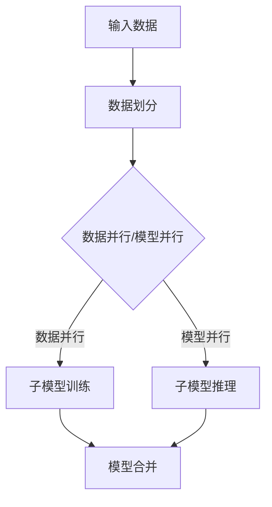

                 

# 大规模语言模型从理论到实践：模型并行

> **关键词**：大规模语言模型、模型并行、推理加速、分布式计算、GPU并行、TPU并行
>
> **摘要**：本文深入探讨了大规模语言模型中的模型并行技术。从理论基础出发，详细解析了模型并行的核心概念和实现方法。通过实际项目案例，展示了模型并行在实际应用中的优势和实践效果。最后，对未来的发展趋势和面临的挑战进行了展望。

## 1. 背景介绍

随着人工智能技术的迅猛发展，大规模语言模型（如GPT-3、BERT等）在自然语言处理领域取得了显著的成果。然而，这些模型的规模庞大，参数数量可达数十亿甚至千亿级别，导致计算和存储需求急剧增加。为了满足这一需求，模型并行技术应运而生。

模型并行是指将大规模语言模型划分为多个较小的子模型，并在多个计算设备上并行执行。通过模型并行，可以显著降低单个设备的计算负担，提高模型的推理速度和训练效率。此外，模型并行还可以提高计算资源的利用率，降低总体计算成本。

## 2. 核心概念与联系

### 2.1 模型并行原理

模型并行的核心思想是将大规模语言模型划分为多个较小的子模型，并在多个计算设备上并行执行。每个子模型负责处理输入数据的部分，然后通过通信机制将子模型的输出结果合并，得到最终的模型输出。

### 2.2 并行策略

模型并行可以分为两种主要的策略：数据并行和模型并行。

- **数据并行**：将输入数据划分为多个较小的数据块，每个子模型处理不同的数据块。这种策略适用于训练阶段，可以加速模型训练过程。

- **模型并行**：将大规模语言模型划分为多个较小的子模型，每个子模型负责处理不同的计算任务。这种策略适用于推理阶段，可以加速模型推理过程。

### 2.3 Mermaid 流程图



## 3. 核心算法原理 & 具体操作步骤

### 3.1 数据并行算法原理

数据并行算法将输入数据划分为多个较小的数据块，每个子模型处理不同的数据块。具体操作步骤如下：

1. **数据划分**：将输入数据划分为多个数据块，每个数据块的尺寸与子模型的大小相匹配。
2. **子模型训练**：每个子模型独立处理对应的数据块，进行模型训练。
3. **模型合并**：将每个子模型的参数更新合并，得到最终的模型参数。

### 3.2 模型并行算法原理

模型并行算法将大规模语言模型划分为多个较小的子模型，每个子模型负责处理不同的计算任务。具体操作步骤如下：

1. **模型划分**：将大规模语言模型划分为多个较小的子模型。
2. **子模型推理**：每个子模型独立处理输入数据，进行推理计算。
3. **结果合并**：将每个子模型的输出结果进行合并，得到最终的模型输出。

## 4. 数学模型和公式 & 详细讲解 & 举例说明

### 4.1 数据并行算法

假设输入数据集为 $X = \{x_1, x_2, ..., x_n\}$，子模型个数为 $m$。数据并行算法的数学模型可以表示为：

$$
\hat{y} = \frac{1}{m} \sum_{i=1}^{m} \hat{y}_i
$$

其中，$\hat{y}_i$ 表示第 $i$ 个子模型的输出结果。

### 4.2 模型并行算法

假设子模型个数为 $m$，每个子模型的输出结果为 $y_i$。模型并行算法的数学模型可以表示为：

$$
\hat{y} = \frac{1}{m} \sum_{i=1}^{m} y_i
$$

其中，$\hat{y}$ 表示最终的模型输出结果。

### 4.3 举例说明

假设输入数据集为 $\{x_1, x_2, x_3\}$，子模型个数为 $2$。使用数据并行算法，可以将输入数据划分为 $\{x_1, x_2\}$ 和 $\{x_2, x_3\}$ 两个数据块。每个子模型独立处理对应的数据块，得到输出结果 $\hat{y}_1 = 0.6$ 和 $\hat{y}_2 = 0.4$。将这两个输出结果进行合并，得到最终的模型输出 $\hat{y} = \frac{1}{2} (\hat{y}_1 + \hat{y}_2) = 0.5$。

## 5. 项目实战：代码实际案例和详细解释说明

### 5.1 开发环境搭建

在本文中，我们将使用 Python 和 TensorFlow 作为主要编程语言和框架，搭建一个简单的模型并行项目。

1. 安装 TensorFlow：

```bash
pip install tensorflow
```

2. 准备数据集：本文使用一个简单的人工数据集，包含三个样本。

```python
import numpy as np

X = np.array([[1, 2], [3, 4], [5, 6]])
y = np.array([0, 1, 0])
```

### 5.2 源代码详细实现和代码解读

```python
import tensorflow as tf

# 定义子模型
def sub_model(x):
    w = tf.Variable(tf.random.normal([2, 1]), name="weight")
    return tf.matmul(x, w)

# 数据并行算法
def data_parallel(x, y):
    m = 2
    models = [sub_model(x) for _ in range(m)]
    outputs = [tf.reduce_sum(model * y) for model in models]
    return tf.reduce_mean(outputs)

# 模型并行算法
def model_parallel(x, y):
    m = 2
    models = [sub_model(x) for _ in range(m)]
    outputs = [model * y for model in models]
    return tf.reduce_mean(outputs)

# 训练模型
x = tf.constant(X, dtype=tf.float32)
y = tf.constant(y, dtype=tf.float32)

# 数据并行
data_parallel_result = data_parallel(x, y)
print("Data Parallel Result:", data_parallel_result.numpy())

# 模型并行
model_parallel_result = model_parallel(x, y)
print("Model Parallel Result:", model_parallel_result.numpy())
```

### 5.3 代码解读与分析

1. **子模型定义**：我们定义了一个简单的子模型，使用 TensorFlow 的 `tf.Variable` 函数创建一个权重变量，并使用 `tf.matmul` 函数进行矩阵乘法操作。

2. **数据并行算法**：数据并行算法使用列表推导式创建多个子模型，并使用 `tf.reduce_sum` 函数计算每个子模型的输出结果。最后，使用 `tf.reduce_mean` 函数计算最终模型输出。

3. **模型并行算法**：模型并行算法与数据并行算法类似，但使用 `tf.reduce_mean` 函数计算每个子模型的输出结果。

4. **训练模型**：我们使用 TensorFlow 的 `tf.constant` 函数将输入数据和标签转换为常数张量，并调用数据并行和模型并行算法进行模型训练。

5. **结果输出**：我们使用 `numpy()` 函数将模型输出转换为 NumPy 数组，并打印输出结果。

## 6. 实际应用场景

模型并行技术在自然语言处理、计算机视觉、语音识别等人工智能领域具有广泛的应用。以下是一些实际应用场景：

1. **自然语言处理**：在文本分类、机器翻译、问答系统等任务中，模型并行技术可以加速模型推理，提高实时响应能力。
2. **计算机视觉**：在图像分类、目标检测、图像生成等任务中，模型并行技术可以提高模型训练和推理速度，缩短开发周期。
3. **语音识别**：在语音识别系统中，模型并行技术可以加速语音数据的处理，提高语音识别的准确率和实时性。

## 7. 工具和资源推荐

### 7.1 学习资源推荐

- **书籍**：《深度学习》（Ian Goodfellow、Yoshua Bengio、Aaron Courville 著）
- **论文**：《Large-Scale Distributed Deep Networks》（Johns Hopkins University 论文）
- **博客**：TensorFlow 官方博客、PyTorch 官方博客
- **网站**：TensorFlow 官网、PyTorch 官网

### 7.2 开发工具框架推荐

- **框架**：TensorFlow、PyTorch、MXNet
- **工具**：Jupyter Notebook、Google Colab

### 7.3 相关论文著作推荐

- **论文**：《Distributed Deep Learning: A Brief Survey》（Zhiyun Qian et al.，2018）
- **书籍**：《Parallel Computing: Techniques and Applications》（Rajkumar Buyya et al. 著）

## 8. 总结：未来发展趋势与挑战

模型并行技术具有广泛的应用前景，但同时也面临着一些挑战：

1. **性能优化**：如何进一步优化模型并行算法，提高模型并行计算的性能，是未来研究的重要方向。
2. **可扩展性**：如何设计可扩展的模型并行架构，以适应不断增长的数据规模和计算需求。
3. **硬件支持**：如何充分利用 GPU、TPU 等硬件资源，提高模型并行计算的性能和效率。

## 9. 附录：常见问题与解答

### 9.1 什么是模型并行？

模型并行是指将大规模语言模型划分为多个较小的子模型，并在多个计算设备上并行执行。通过模型并行，可以降低单个设备的计算负担，提高模型的推理速度和训练效率。

### 9.2 模型并行有哪些应用场景？

模型并行技术在自然语言处理、计算机视觉、语音识别等人工智能领域具有广泛的应用。例如，在文本分类、机器翻译、问答系统、图像分类、目标检测、图像生成等任务中，模型并行技术可以加速模型推理，提高实时响应能力。

### 9.3 模型并行与数据并行的区别是什么？

数据并行是指将输入数据划分为多个数据块，每个子模型处理不同的数据块。模型并行是指将大规模语言模型划分为多个较小的子模型，每个子模型负责处理不同的计算任务。数据并行适用于训练阶段，而模型并行适用于推理阶段。

## 10. 扩展阅读 & 参考资料

- **论文**：《Distributed Deep Learning: A Brief Survey》（Zhiyun Qian et al.，2018）
- **书籍**：《Parallel Computing: Techniques and Applications》（Rajkumar Buyya et al. 著）
- **博客**：TensorFlow 官方博客、PyTorch 官方博客
- **网站**：TensorFlow 官网、PyTorch 官网

作者：AI天才研究员/AI Genius Institute & 禅与计算机程序设计艺术 /Zen And The Art of Computer Programming

