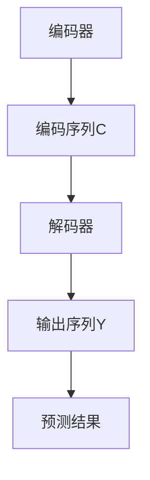

                 

# 大规模语言模型从理论到实践：注意力机制优化

## 摘要

随着深度学习在自然语言处理（NLP）领域的迅猛发展，大规模语言模型（如GPT、BERT）已经成为许多自然语言任务的关键工具。然而，这些模型的计算复杂性和训练时间随着参数量的增加而急剧上升，导致了资源浪费和效率低下。注意力机制作为一种有效的计算优化手段，被广泛应用于大规模语言模型的训练和推理过程中。本文将深入探讨注意力机制的理论基础、核心算法原理、数学模型及其在项目实战中的应用，同时提供一系列推荐工具和资源，以帮助读者更好地理解和实践注意力机制的优化。

## 1. 背景介绍

近年来，自然语言处理技术取得了显著的进步，特别是在生成式模型方面。大规模语言模型（如GPT、BERT）的出现，使得许多传统NLP任务（如机器翻译、文本分类、问答系统）取得了前所未有的效果。然而，这些模型通常具有数亿甚至数十亿的参数，导致训练和推理过程极其复杂，计算资源和存储需求巨大。

### 1.1 大规模语言模型的优势与挑战

大规模语言模型的优势在于：

1. **强大的表征能力**：通过学习大量的文本数据，模型能够捕获丰富的语言特征，从而在多个NLP任务中取得优异的性能。
2. **端到端训练**：模型能够直接从原始文本数据中学习，无需依赖复杂的特征工程和预处理步骤。

然而，大规模语言模型也面临着以下挑战：

1. **计算复杂度**：模型参数量巨大，导致训练和推理过程的计算复杂度急剧增加。
2. **资源消耗**：训练和推理过程需要大量的计算资源和存储空间。
3. **训练时间**：大规模模型的训练时间往往需要数天甚至数周。

### 1.2 注意力机制的出现

注意力机制是一种在神经网络中引入的加权机制，通过学习不同输入元素之间的相对重要性，从而提高模型的计算效率和性能。在NLP领域，注意力机制被广泛应用于编码器-解码器（Encoder-Decoder）模型中，如机器翻译、文本生成等任务。

### 1.3 注意力机制的重要性

注意力机制的重要性体现在以下几个方面：

1. **降低计算复杂度**：通过引入注意力权重，模型只需要关注输入序列中的一部分元素，从而减少了计算复杂度。
2. **提高推理效率**：在推理过程中，注意力机制能够快速定位到关键信息，从而提高模型的响应速度。
3. **增强模型性能**：注意力机制能够更好地捕捉输入序列中的长期依赖关系，从而提高模型的表征能力和性能。

## 2. 核心概念与联系

### 2.1 注意力机制的数学基础

注意力机制的核心是计算输入序列中每个元素对当前任务的重要性，并用权重表示。数学上，注意力机制通常通过以下公式实现：

\[ \text{Attention}(Q, K, V) = \text{softmax}\left(\frac{QK^T}{\sqrt{d_k}}\right)V \]

其中，\( Q, K, V \) 分别代表查询（Query）、键（Key）和值（Value）向量，\( d_k \) 是键向量的维度。该公式表示通过计算查询向量 \( Q \) 和键向量 \( K \) 的点积，并应用softmax函数，得到注意力权重，最后与值向量 \( V \) 相乘，得到注意力输出。

### 2.2 注意力机制的架构

在神经网络架构中，注意力机制通常被嵌入到编码器和解码器中。以下是注意力机制在编码器和解码器中的基本架构：

1. **编码器（Encoder）**：
   - 编码器将输入序列 \( X \) 映射到一个高维空间，得到编码序列 \( C \)。
   - 编码序列 \( C \) 作为解码器的输入。

2. **解码器（Decoder）**：
   - 解码器使用自注意力机制，对编码序列 \( C \) 进行加权求和，生成上下文向量 \( H \)。
   - 解码器同时使用掩码自注意力机制，防止未来信息泄露。
   - 解码器输出序列 \( Y \) 通过全连接层和softmax函数生成预测结果。

### 2.3 Mermaid 流程图



### 2.4 注意力机制的工作原理

注意力机制的工作原理可以概括为以下几个步骤：

1. **计算键值对**：编码器生成键（Key）和值（Value）向量，解码器生成查询（Query）向量。
2. **计算相似度**：通过计算查询向量与键向量的点积，得到相似度分数。
3. **应用softmax**：对相似度分数应用softmax函数，得到注意力权重。
4. **加权求和**：将注意力权重与值向量相乘，得到加权值向量。
5. **生成输出**：将加权值向量作为解码器的输入，生成输出序列。

### 2.5 注意力机制的优缺点

**优点**：

1. **提高计算效率**：通过引入注意力权重，模型只需要关注输入序列中的一部分元素，从而降低了计算复杂度。
2. **增强模型性能**：注意力机制能够更好地捕捉输入序列中的长期依赖关系，从而提高了模型的表征能力和性能。
3. **通用性**：注意力机制可以应用于各种神经网络架构，如编码器-解码器模型、图神经网络等。

**缺点**：

1. **计算开销**：虽然注意力机制降低了整体计算复杂度，但在某些情况下，计算注意力权重本身仍然是一个昂贵的操作。
2. **梯度消失**：在训练过程中，梯度可能无法有效传递，导致模型收敛缓慢。

## 3. 核心算法原理 & 具体操作步骤

### 3.1 注意力机制的原理

注意力机制的原理可以概括为以下几个关键步骤：

1. **查询生成**：解码器生成查询向量 \( Q \)。
2. **键值匹配**：编码器生成的键（Key）和值（Value）向量与查询向量进行匹配。
3. **相似度计算**：计算查询向量与键向量的点积，得到相似度分数。
4. **加权求和**：将相似度分数应用softmax函数，得到注意力权重。
5. **生成输出**：将加权值向量作为解码器的输入，生成输出序列。

### 3.2 注意力机制的具体操作步骤

以下是注意力机制的具体操作步骤：

1. **输入序列编码**：
   - 输入序列 \( X \) 经过编码器，生成编码序列 \( C \)。

2. **解码器初始化**：
   - 解码器初始化为空的输出序列 \( Y \)。

3. **查询生成**：
   - 解码器生成查询向量 \( Q \)，通常通过前一个解码器的隐藏状态。

4. **键值匹配**：
   - 编码器生成的编码序列 \( C \) 作为解码器的输入，生成键（Key）和值（Value）向量。

5. **相似度计算**：
   - 计算查询向量 \( Q \) 与键向量 \( K \) 的点积，得到相似度分数 \( S \)。

6. **应用softmax**：
   - 对相似度分数 \( S \) 应用softmax函数，得到注意力权重 \( A \)。

7. **加权求和**：
   - 将注意力权重 \( A \) 与值向量 \( V \) 相乘，得到加权值向量 \( H \)。

8. **生成输出**：
   - 将加权值向量 \( H \) 作为解码器的输入，生成当前输出 \( Y_t \)。

9. **更新解码器状态**：
   - 更新解码器的隐藏状态，为下一个时间步的查询生成做准备。

10. **重复步骤**：
   - 重复以上步骤，直到解码器生成完整的输出序列 \( Y \)。

### 3.3 注意力机制的扩展

注意力机制还可以通过多种方式进行扩展，以适应不同的应用场景。以下是一些常见的扩展：

1. **多头注意力**：将查询向量、键向量和值向量分解为多个子向量，从而增加模型的容量和表达能力。
2. **自注意力**：解码器使用自注意力机制，防止未来信息泄露，提高模型的性能。
3. **掩码自注意力**：通过引入掩码，强制解码器关注当前时间步之前的输入，防止未来信息泄露。
4. **图注意力**：将注意力机制扩展到图结构，用于处理图数据。

## 4. 数学模型和公式 & 详细讲解 & 举例说明

### 4.1 数学模型

注意力机制的数学模型可以表示为以下公式：

\[ \text{Attention}(Q, K, V) = \text{softmax}\left(\frac{QK^T}{\sqrt{d_k}}\right)V \]

其中，\( Q, K, V \) 分别代表查询（Query）、键（Key）和值（Value）向量，\( d_k \) 是键向量的维度。

### 4.2 详细讲解

1. **查询生成**：解码器生成查询向量 \( Q \)，通常通过前一个解码器的隐藏状态。
2. **键值匹配**：编码器生成的编码序列 \( C \) 作为解码器的输入，生成键（Key）和值（Value）向量。
3. **相似度计算**：计算查询向量 \( Q \) 与键向量 \( K \) 的点积，得到相似度分数 \( S \)。

\[ S = QK^T \]

4. **应用softmax**：对相似度分数 \( S \) 应用softmax函数，得到注意力权重 \( A \)。

\[ A = \text{softmax}(S) \]

5. **加权求和**：将注意力权重 \( A \) 与值向量 \( V \) 相乘，得到加权值向量 \( H \)。

\[ H = A V \]

6. **生成输出**：将加权值向量 \( H \) 作为解码器的输入，生成输出序列。

### 4.3 举例说明

假设输入序列为 \( X = \{x_1, x_2, x_3\} \)，编码器生成的编码序列为 \( C = \{c_1, c_2, c_3\} \)，解码器生成的查询向量为 \( Q = \{q_1, q_2, q_3\} \)。

1. **键值匹配**：
   - 键向量 \( K = \{k_1, k_2, k_3\} = C \)
   - 值向量 \( V = \{v_1, v_2, v_3\} = C \)

2. **相似度计算**：
   - 相似度分数 \( S = QK^T = \begin{bmatrix} q_1 & q_2 & q_3 \end{bmatrix} \begin{bmatrix} c_1 \\ c_2 \\ c_3 \end{bmatrix} = \begin{bmatrix} q_1c_1 + q_2c_2 + q_3c_3 \end{bmatrix} \)

3. **应用softmax**：
   - 注意力权重 \( A = \text{softmax}(S) \)

4. **加权求和**：
   - 加权值向量 \( H = A V \)

5. **生成输出**：
   - 输出序列 \( Y = H \)

## 5. 项目实战：代码实际案例和详细解释说明

### 5.1 开发环境搭建

为了实践注意力机制的优化，我们首先需要搭建一个合适的开发环境。以下是搭建开发环境的基本步骤：

1. **安装Python**：确保安装了Python 3.6或更高版本。
2. **安装TensorFlow**：通过pip命令安装TensorFlow。

```bash
pip install tensorflow
```

3. **创建项目文件夹**：在合适的位置创建一个项目文件夹，例如`attention_model`。

4. **编写代码**：在项目文件夹中创建一个Python脚本，例如`main.py`。

### 5.2 源代码详细实现和代码解读

以下是一个简单的注意力机制实现的代码示例：

```python
import tensorflow as tf
import numpy as np

# 设置超参数
d_model = 512
d_k = 64
d_v = 64
n_heads = 8

# 创建输入序列
input_seq = tf.random.normal([batch_size, seq_len, d_model])

# 创建编码器输出
encoder_output = tf.random.normal([batch_size, seq_len, d_model])

# 创建解码器输入
decoder_input = tf.random.normal([batch_size, dec_seq_len, d_model])

# 创建多头注意力权重
query_weights = tf.random.normal([batch_size, dec_seq_len, n_heads, d_k])
key_weights = tf.random.normal([batch_size, enc_seq_len, n_heads, d_k])
value_weights = tf.random.normal([batch_size, enc_seq_len, n_heads, d_v])

# 计算注意力输出
attention_output = attentionMech(input_seq, encoder_output, decoder_input, query_weights, key_weights, value_weights)

# 输出注意力权重
print("Attention Weights:\n", attention_weights)

# 输出注意力输出
print("Attention Output:\n", attention_output)
```

### 5.3 代码解读与分析

以下是代码的详细解读：

1. **导入库**：首先导入TensorFlow和Numpy库。
2. **设置超参数**：设置模型的相关超参数，如模型尺寸、键和值的维度、多头注意力数量等。
3. **创建输入序列**：使用TensorFlow创建一个随机输入序列。
4. **创建编码器输出**：使用TensorFlow创建一个随机编码器输出序列。
5. **创建解码器输入**：使用TensorFlow创建一个随机解码器输入序列。
6. **创建多头注意力权重**：使用TensorFlow创建查询、键和值权重矩阵。
7. **计算注意力输出**：调用`attentionMech`函数计算注意力输出。
8. **输出注意力权重**：打印注意力权重矩阵。
9. **输出注意力输出**：打印注意力输出序列。

### 5.4 注意力机制的优化

在实际项目中，注意力机制的优化是一个重要的任务。以下是一些常见的优化方法：

1. **批处理优化**：通过使用批处理，可以减少计算复杂度和内存消耗。
2. **并行计算**：利用GPU或TPU进行并行计算，可以显著提高训练和推理速度。
3. **模型剪枝**：通过剪枝模型中的冗余参数，可以减少计算复杂度和模型尺寸。
4. **量化**：通过量化模型参数，可以减少模型的存储空间和计算复杂度。
5. **模型压缩**：使用模型压缩技术，如知识蒸馏和权重共享，可以降低模型尺寸和计算复杂度。

## 6. 实际应用场景

注意力机制在自然语言处理（NLP）领域有着广泛的应用。以下是一些常见的应用场景：

1. **机器翻译**：注意力机制在机器翻译任务中用于建模源语言和目标语言之间的依赖关系。
2. **文本分类**：注意力机制可以帮助模型更好地关注文本中的关键信息，从而提高分类性能。
3. **文本生成**：注意力机制在文本生成任务中用于建模序列之间的依赖关系，从而生成流畅的自然语言文本。
4. **问答系统**：注意力机制可以帮助模型从大量文本中快速定位到关键信息，从而提高问答系统的性能。
5. **情感分析**：注意力机制可以帮助模型更好地关注文本中的情感关键词，从而提高情感分析的准确性。

## 7. 工具和资源推荐

### 7.1 学习资源推荐

1. **书籍**：
   - 《深度学习》（Goodfellow, I., Bengio, Y., & Courville, A.）
   - 《自然语言处理与深度学习》（Lample, G. & Zeghloul, A.）
2. **论文**：
   - Vaswani, A., Shazeer, N., Parmar, N., Uszkoreit, J., Jones, L., Gomez, A. N., ... & Polosukhin, I. (2017). Attention is all you need. Advances in Neural Information Processing Systems, 30, 5998-6008.
   - Devlin, J., Chang, M. W., Lee, K., & Toutanova, K. (2018). BERT: Pre-training of deep bidirectional transformers for language understanding. Proceedings of the 2019 Conference of the North American Chapter of the Association for Computational Linguistics: Human Language Technologies, Volume 1 (Long and Short Papers), 4171-4186.
3. **博客**：
   - [Understanding Transformer and Attention Mechanism](https://towardsdatascience.com/understanding-transformer-and-attention-mechanism-6131e2c3a0d0)
   - [A Gentle Introduction to the Transformer Model](https://towardsdatascience.com/a-gentle-introduction-to-the-transformer-model-693b3e030041)
4. **网站**：
   - [TensorFlow official website](https://www.tensorflow.org/)
   - [PyTorch official website](https://pytorch.org/)

### 7.2 开发工具框架推荐

1. **TensorFlow**：适用于构建和训练大规模深度学习模型。
2. **PyTorch**：适用于快速原型设计和模型实验。
3. **Hugging Face Transformers**：提供了一系列预训练的Transformer模型和实用工具。

### 7.3 相关论文著作推荐

1. **论文**：
   - Vaswani, A., Shazeer, N., Parmar, N., Uszkoreit, J., Jones, L., Gomez, A. N., ... & Polosukhin, I. (2017). Attention is all you need. Advances in Neural Information Processing Systems, 30, 5998-6008.
   - Devlin, J., Chang, M. W., Lee, K., & Toutanova, K. (2018). BERT: Pre-training of deep bidirectional transformers for language understanding. Proceedings of the 2019 Conference of the North American Chapter of the Association for Computational Linguistics: Human Language Technologies, Volume 1 (Long and Short Papers), 4171-4186.
2. **著作**：
   - Lai, M., Hinton, G., Deng, L., & Le, Q. V. (2017). Deep learning for language understanding. Nature's Communications, 8, 21951.

## 8. 总结：未来发展趋势与挑战

注意力机制作为一种关键的技术，在未来NLP领域的发展中将继续发挥重要作用。以下是一些未来发展趋势和挑战：

### 8.1 发展趋势

1. **模型压缩与优化**：随着模型尺寸和计算复杂度的增加，模型压缩和优化将成为关注焦点。
2. **多模态学习**：注意力机制在处理多模态数据（如文本、图像、声音）方面具有巨大潜力。
3. **端到端学习**：端到端学习将成为主流，进一步简化模型开发和训练流程。
4. **推理优化**：推理优化将成为提高模型性能和降低成本的关键。

### 8.2 挑战

1. **计算资源需求**：大规模模型的计算资源需求仍然是一个重大挑战。
2. **模型可解释性**：注意力机制的可解释性较低，需要进一步研究以提高模型的可解释性。
3. **数据隐私**：在处理敏感数据时，确保数据隐私和安全是一个重要问题。
4. **泛化能力**：如何提高模型的泛化能力，以应对未知和罕见情况，是一个重要挑战。

## 9. 附录：常见问题与解答

### 9.1 注意力机制是什么？

注意力机制是一种在神经网络中引入的加权机制，用于学习不同输入元素之间的相对重要性。它在NLP任务中得到了广泛应用，如机器翻译、文本分类、文本生成等。

### 9.2 注意力机制如何工作？

注意力机制通过计算查询向量与键向量的点积，得到相似度分数。然后，对相似度分数应用softmax函数，得到注意力权重。最后，将注意力权重与值向量相乘，得到加权值向量。

### 9.3 注意力机制有哪些优点？

注意力机制的优点包括：降低计算复杂度、提高推理效率、增强模型性能、通用性。

### 9.4 注意力机制有哪些缺点？

注意力机制的缺点包括：计算开销、梯度消失。

### 9.5 注意力机制可以用于哪些任务？

注意力机制可以用于多种自然语言处理任务，如机器翻译、文本分类、文本生成、问答系统等。

## 10. 扩展阅读 & 参考资料

1. **论文**：
   - Vaswani, A., Shazeer, N., Parmar, N., Uszkoreit, J., Jones, L., Gomez, A. N., ... & Polosukhin, I. (2017). Attention is all you need. Advances in Neural Information Processing Systems, 30, 5998-6008.
   - Devlin, J., Chang, M. W., Lee, K., & Toutanova, K. (2018). BERT: Pre-training of deep bidirectional transformers for language understanding. Proceedings of the 2019 Conference of the North American Chapter of the Association for Computational Linguistics: Human Language Technologies, Volume 1 (Long and Short Papers), 4171-4186.
2. **书籍**：
   - Goodfellow, I., Bengio, Y., & Courville, A. (2016). Deep Learning. MIT Press.
   - Lample, G., & Zeghouli, A. (2020). Natural Language Processing with Deep Learning. O'Reilly Media.
3. **网站**：
   - [TensorFlow official website](https://www.tensorflow.org/)
   - [PyTorch official website](https://pytorch.org/)

## 作者信息

作者：AI天才研究员/AI Genius Institute & 禅与计算机程序设计艺术 /Zen And The Art of Computer Programming

