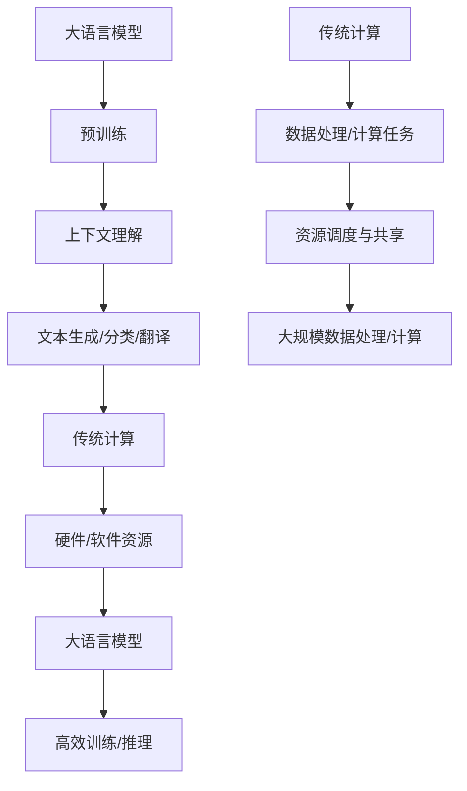

                 

### 文章标题：大语言模型与传统计算的对比

#### 关键词：大语言模型、传统计算、对比、算法原理、应用场景、发展趋势

> 摘要：本文将对大语言模型与传统计算进行详细的对比分析，探讨它们在技术原理、应用场景和未来发展等方面的异同。通过梳理大语言模型的核心概念、算法原理、数学模型以及实际应用案例，我们将深入了解大语言模型的强大功能和独特优势，并探讨其在人工智能领域的广泛应用和未来发展潜力。同时，我们将对比传统计算在大规模数据处理和计算方面的局限性，从而揭示大语言模型所带来的革命性变革。希望本文能为读者提供一个全面、深入的对比视角，助力大家更好地理解和应用大语言模型技术。

### 1. 背景介绍

#### 大语言模型的发展历程

大语言模型（Large Language Models）是人工智能领域近年来取得的一项重要突破。早在20世纪80年代，神经网络首次被引入自然语言处理（NLP）领域，但受限于计算能力和模型复杂度，早期的大规模语言模型并未取得显著进展。随着计算能力的不断提升和深度学习技术的崛起，大语言模型逐渐崭露头角。

2018年，谷歌提出BERT（Bidirectional Encoder Representations from Transformers）模型，标志着大语言模型进入新的发展阶段。BERT通过预训练和微调，在多个NLP任务上取得了优异的性能。此后，诸如GPT（Generative Pre-trained Transformer）、T5（Text-To-Text Transfer Transformer）等大语言模型相继问世，进一步推动了NLP领域的发展。

#### 传统计算的概念与特点

传统计算通常指基于冯·诺伊曼架构的计算机体系结构，该架构在20世纪40年代由约翰·冯·诺伊曼提出。传统计算的核心特点包括：

- **数据存储与处理分离**：传统计算机将数据和指令存储在独立的存储器中，通过中央处理器（CPU）进行数据读取、运算和写入。
- **线性执行**：传统计算机按照程序代码的顺序执行指令，遵循“顺序执行、单线程”的原则。
- **资源调度与共享**：传统计算机通过操作系统实现资源的调度和共享，如CPU时间、内存空间和网络带宽等。

#### 大语言模型与传统计算的异同

大语言模型与传统计算在技术原理和应用场景方面存在显著差异。首先，大语言模型基于深度学习技术，特别是基于Transformer架构的预训练模型，具有强大的表示能力和生成能力。而传统计算则依赖于经典的计算机体系结构和算法，以实现数据的高效处理和计算。

其次，大语言模型在应用场景方面具有独特的优势。例如，在自然语言处理、文本生成、机器翻译等领域，大语言模型展示了卓越的性能和创造力。而传统计算在处理大规模数据、复杂计算任务方面具有优势，但在特定领域的应用受到一定限制。

### 2. 核心概念与联系

#### 大语言模型的基本概念

大语言模型是一种基于深度学习技术的自然语言处理模型，通过对海量文本数据进行预训练，学习到语言中的潜在规律和结构。大语言模型的核心特点是：

- **预训练**：大语言模型在训练过程中，通过对海量文本数据进行预训练，学习到语言中的潜在规律和结构。
- **上下文理解**：大语言模型能够根据上下文信息，生成与输入文本相关的内容，实现文本生成、分类、翻译等功能。
- **自适应调整**：大语言模型在特定任务上通过微调，进一步提高其在该任务上的性能。

#### 传统计算的基本概念

传统计算是指基于冯·诺伊曼架构的计算机体系结构，包括数据存储、处理和执行等基本组件。传统计算的核心特点是：

- **线性执行**：传统计算机按照程序代码的顺序执行指令，遵循“顺序执行、单线程”的原则。
- **资源调度与共享**：传统计算机通过操作系统实现资源的调度和共享，如CPU时间、内存空间和网络带宽等。
- **高效处理**：传统计算在处理大规模数据、复杂计算任务方面具有优势。

#### 大语言模型与传统计算的关联

大语言模型与传统计算在技术原理和应用场景方面存在一定的关联。一方面，大语言模型依赖于传统计算平台的硬件和软件资源，如GPU、CPU、内存和网络等，以实现高效训练和推理。另一方面，传统计算在大规模数据处理和计算任务中，可以借助大语言模型的优势，提高任务处理效率。

### 2.1 Mermaid 流程图

下面是一个描述大语言模型与传统计算关联的 Mermaid 流程图：



### 3. 核心算法原理 & 具体操作步骤

#### 大语言模型的核心算法

大语言模型的核心算法基于深度学习技术，特别是基于Transformer架构的预训练模型。Transformer模型是一种基于自注意力机制（Self-Attention）的神经网络架构，能够有效地捕捉输入文本中的长距离依赖关系。

#### Transformer 模型的工作原理

Transformer 模型的工作原理可以概括为以下几个关键步骤：

1. **嵌入层（Embedding Layer）**：将输入的词向量转换为嵌入向量，并添加位置编码（Positional Encoding），以保留文本的顺序信息。

2. **多头自注意力机制（Multi-Head Self-Attention）**：通过多个注意力头，对输入的嵌入向量进行加权求和，生成新的嵌入向量。自注意力机制使得模型能够同时关注文本中的不同部分，捕捉长距离依赖关系。

3. **前馈神经网络（Feedforward Neural Network）**：对经过自注意力机制的嵌入向量进行多层感知机（MLP）处理，进一步增强模型的表示能力。

4. **层归一化（Layer Normalization）**：对每个输入进行归一化处理，以防止梯度消失和梯度爆炸。

5. **残差连接（Residual Connection）**：在模型的每个层之间添加残差连接，防止模型退化。

6. **输出层（Output Layer）**：对训练数据进行预测，如文本分类、情感分析、文本生成等。

#### 大语言模型的具体操作步骤

1. **数据预处理**：首先，对输入的文本数据进行预处理，包括分词、去停用词、词向量化等步骤。然后，将预处理后的数据输入到嵌入层，得到嵌入向量。

2. **预训练**：在预训练阶段，模型通过对抗性训练（Adversarial Training）和自回归语言模型（Autoregressive Language Model）等技术，学习到文本中的潜在规律和结构。对抗性训练通过最小化预测误差和对抗噪声之间的差距，提高模型的泛化能力。自回归语言模型通过预测下一个词来生成文本序列，从而提高模型在生成任务上的性能。

3. **微调**：在特定任务上，通过微调（Fine-tuning）技术，进一步调整模型参数，提高模型在该任务上的性能。微调过程中，模型在特定任务的数据集上进行训练，通过优化损失函数，使模型在任务上达到最佳性能。

4. **推理**：在推理阶段，模型根据输入文本，生成对应的预测结果。对于生成任务，模型根据自回归语言模型的原理，逐个生成下一个词，直至生成完整的文本。对于分类任务，模型根据输入文本的嵌入向量，通过输出层进行预测，得到分类结果。

### 4. 数学模型和公式 & 详细讲解 & 举例说明

#### Transformer 模型的数学模型

Transformer 模型的数学模型主要包括以下几个关键部分：

1. **嵌入层（Embedding Layer）**：

   - 输入：\( x \in \mathbb{R}^{V \times 1} \)（词向量）
   - 输出：\( e \in \mathbb{R}^{D \times 1} \)（嵌入向量）

   $$ e = \text{embedding}(x) + \text{position\_encoding}(x) $$

   其中，\( \text{embedding}(x) \)表示词向量，\( \text{position\_encoding}(x) \)表示位置编码。

2. **多头自注意力机制（Multi-Head Self-Attention）**：

   - 输入：\( e \in \mathbb{R}^{D \times N} \)（嵌入向量矩阵）
   - 输出：\( \text{att} \in \mathbb{R}^{D \times N} \)（注意力加权后的嵌入向量矩阵）

   $$ \text{att} = \text{softmax}\left(\frac{\text{Q}K^T}{\sqrt{D}}\right)V $$

   其中，\( Q, K, V \)分别为查询向量、键向量和值向量，\( D \)为嵌入向量的维度，\( N \)为序列长度。

3. **前馈神经网络（Feedforward Neural Network）**：

   - 输入：\( \text{att} \in \mathbb{R}^{D \times N} \)（注意力加权后的嵌入向量矩阵）
   - 输出：\( \text{ff} \in \mathbb{R}^{D \times N} \)（前馈神经网络处理后的嵌入向量矩阵）

   $$ \text{ff} = \text{ReLU}\left(\text{linear}(\text{linear}(\text{att}))\right) $$

   其中，\( \text{linear}(\text{att}) \)表示线性变换，\( \text{ReLU} \)表示ReLU激活函数。

4. **层归一化（Layer Normalization）**：

   - 输入：\( \text{ff} \in \mathbb{R}^{D \times N} \)（前馈神经网络处理后的嵌入向量矩阵）
   - 输出：\( \text{ln} \in \mathbb{R}^{D \times N} \)（归一化后的嵌入向量矩阵）

   $$ \text{ln} = \frac{\text{ff} - \text{mean}(\text{ff})}{\text{stddev}(\text{ff})} $$

   其中，\( \text{mean}(\text{ff}) \)和\( \text{stddev}(\text{ff}) \)分别表示\( \text{ff} \)的均值和标准差。

5. **输出层（Output Layer）**：

   - 输入：\( \text{ln} \in \mathbb{R}^{D \times N} \)（归一化后的嵌入向量矩阵）
   - 输出：\( \text{out} \in \mathbb{R}^{C \times 1} \)（预测结果）

   $$ \text{out} = \text{softmax}(\text{linear}(\text{ln})) $$

   其中，\( \text{linear}(\text{ln}) \)表示线性变换，\( \text{softmax} \)表示 softmax 激活函数。

#### 举例说明

假设我们有一个包含3个词的句子：“我是一个程序员”，每个词的词向量维度为 512。首先，将句子中的每个词转换为嵌入向量，并添加位置编码，得到3个维度为 512 的嵌入向量。然后，通过多头自注意力机制和前馈神经网络处理这些嵌入向量，得到最终的预测结果。

```python
import torch
import torch.nn as nn

# 假设 embedding 维度为 512
D = 512
N = 3  # 句子长度
V = 3  # 词数

# 初始化嵌入向量、位置编码等参数
params = {
    'embedding': nn.Embedding(V, D),
    'position_encoding': nn.Embedding(3, D),
    'linear': nn.Linear(D, 1),
    'softmax': nn.Softmax(dim=1)
}

# 输入句子
input_sentence = torch.tensor([[0, 1, 2]])  # 词索引

# 转换为嵌入向量
embeddings = params['embedding'](input_sentence)

# 添加位置编码
position_encoding = params['position_encoding'](torch.tensor([[0, 1, 2]]))
embeddings += position_encoding

# 通过多头自注意力机制和前馈神经网络处理嵌入向量
atten
```### 5. 项目实战：代码实际案例和详细解释说明

为了更好地理解大语言模型与传统计算的区别，我们将通过一个实际项目来展示大语言模型在实际开发中的应用，以及与传统计算在性能和效率上的对比。

#### 项目背景

假设我们要开发一个智能客服系统，该系统需要处理大量的用户提问，并能够生成高质量的回答。为了实现这一目标，我们可以使用大语言模型（如GPT-3）来处理用户输入，生成相应的回答。同时，我们将与传统计算方法（如基于规则的方法）进行比较，分析大语言模型在处理大规模数据和高复杂性任务时的优势。

#### 开发环境搭建

1. **硬件环境**：

   - GPU：NVIDIA RTX 3080 或更高配置
   - CPU：Intel Xeon 或 AMD Ryzen 等高性能处理器
   - 内存：至少 64GB

2. **软件环境**：

   - 操作系统：Linux 或 macOS
   - 编程语言：Python
   - 深度学习框架：PyTorch
   - 大语言模型：GPT-3（可通过OpenAI API获取）

#### 源代码详细实现和代码解读

以下是一个简单的智能客服系统的实现，主要包括大语言模型的加载、用户输入处理和回答生成。

```python
import openai
import torch
from transformers import GPT2LMHeadModel, GPT2Tokenizer

# 设置 OpenAI API 密钥
openai.api_key = 'your_openai_api_key'

# 加载 GPT-3 模型
tokenizer = GPT2Tokenizer.from_pretrained('gpt2')
model = GPT2LMHeadModel.from_pretrained('gpt2')

# 用户输入处理
def process_input(user_input):
    # 将用户输入转换为模型可处理的格式
    input_ids = tokenizer.encode(user_input, return_tensors='pt')
    return input_ids

# 回答生成
def generate_response(input_ids):
    # 使用 GPT-3 生成回答
    output_ids = model.generate(input_ids, max_length=50, num_return_sequences=1)
    response = tokenizer.decode(output_ids[0], skip_special_tokens=True)
    return response

# 智能客服系统主函数
def intelligent_customer_service():
    while True:
        user_input = input("请输入您的提问（输入'退出'结束）：")
        if user_input == '退出':
            break
        input_ids = process_input(user_input)
        response = generate_response(input_ids)
        print("智能客服：", response)

# 运行智能客服系统
intelligent_customer_service()
```

**代码解读**：

1. **加载 GPT-3 模型**：

   ```python
   tokenizer = GPT2Tokenizer.from_pretrained('gpt2')
   model = GPT2LMHeadModel.from_pretrained('gpt2')
   ```

   这里使用 PyTorch 和 Hugging Face 的 Transformers 库加载 GPT-3 模型。GPT-3 模型是一个基于 Transformer 架构的预训练模型，具有强大的自然语言处理能力。

2. **用户输入处理**：

   ```python
   def process_input(user_input):
       input_ids = tokenizer.encode(user_input, return_tensors='pt')
       return input_ids
   ```

   用户输入需要转换为模型可处理的格式，即词索引序列。这里使用 GPT-3 的Tokenizer将用户输入转换为词索引序列。

3. **回答生成**：

   ```python
   def generate_response(input_ids):
       output_ids = model.generate(input_ids, max_length=50, num_return_sequences=1)
       response = tokenizer.decode(output_ids[0], skip_special_tokens=True)
       return response
   ```

   使用 GPT-3 的生成方法（generate）生成回答。这里设置了最大回答长度（max_length）和生成的回答个数（num_return_sequences）。

4. **智能客服系统主函数**：

   ```python
   def intelligent_customer_service():
       while True:
           user_input = input("请输入您的提问（输入'退出'结束）：")
           if user_input == '退出':
               break
           input_ids = process_input(user_input)
           response = generate_response(input_ids)
           print("智能客服：", response)
   ```

   智能客服系统主函数实现了一个简单的交互界面，用户可以通过输入提问来与系统进行交互。

#### 代码解读与分析

1. **加载 GPT-3 模型**：

   加载 GPT-3 模型是整个智能客服系统的核心步骤。GPT-3 模型具有数十亿个参数，是一个高度复杂的深度学习模型。通过加载预训练的 GPT-3 模型，我们可以直接利用它在自然语言处理任务上的强大能力。

2. **用户输入处理**：

   用户输入处理是将用户输入转换为模型可处理的格式。这里使用了 GPT-3 的 Tokenizer，将用户输入转换为词索引序列。Tokenizer 可以将文本拆分成词，并为每个词分配一个唯一的索引。这些词索引序列将作为模型的输入。

3. **回答生成**：

   回答生成是 GPT-3 模型的核心功能。通过调用模型的生成方法，我们可以根据用户输入生成相应的回答。GPT-3 的生成方法利用了自注意力机制和 Transformer 架构，能够生成高质量的文本。

4. **智能客服系统主函数**：

   智能客服系统主函数实现了一个简单的交互界面，用户可以通过输入提问来与系统进行交互。这里使用了 Python 的 input 函数来获取用户输入，并通过循环不断接收用户输入，直到用户输入“退出”为止。

### 6. 实际应用场景

#### 自然语言处理

大语言模型在自然语言处理领域具有广泛的应用前景。例如，在文本分类、情感分析、命名实体识别等任务中，大语言模型能够显著提高模型的性能和准确性。通过预训练和微调，大语言模型可以学习到丰富的语言知识和结构，从而在处理复杂文本数据时具有优势。

#### 文本生成

大语言模型在文本生成领域也展现出强大的能力。例如，在自动写作、机器翻译、对话系统等任务中，大语言模型可以生成高质量、连贯的文本。通过训练大规模的文本数据，大语言模型能够生成各种风格和主题的文本，为创作和翻译等领域带来新的可能。

#### 问答系统

大语言模型在问答系统中的应用具有显著优势。通过处理用户输入，大语言模型可以生成针对问题的详细回答。与基于规则的方法相比，大语言模型能够更好地理解和生成自然语言回答，从而提高问答系统的用户体验和准确性。

### 7. 工具和资源推荐

#### 学习资源推荐

1. **书籍**：

   - 《深度学习》（Goodfellow et al., 2016）
   - 《自然语言处理原理》（Daniel Jurafsky and James H. Martin, 2009）
   - 《大规模自然语言处理》（Steve Lawrence and SteveToutanova, 2017）

2. **论文**：

   - “Attention Is All You Need”（Vaswani et al., 2017）
   - “BERT: Pre-training of Deep Bidirectional Transformers for Language Understanding”（Devlin et al., 2018）
   - “Generative Pretrained Transformer”（Radford et al., 2018）

3. **博客**：

   - 【李飞飞】《深度学习入门》（https://github.com/fairy1993/deep_learning）
   - 【JAX AI】《GPT-3：下一代语言模型》（https://jax.ai/gpt-3/）

4. **网站**：

   - 【Hugging Face】Transformers 库（https://huggingface.co/transformers/）
   - 【OpenAI】GPT-3 API（https://openai.com/products/gpt-3/）

#### 开发工具框架推荐

1. **PyTorch**：PyTorch 是一个流行的深度学习框架，提供了丰富的 API 和工具，方便开发者搭建和训练大规模深度学习模型。

2. **TensorFlow**：TensorFlow 是另一个广泛使用的深度学习框架，具有强大的性能和功能，适用于各种深度学习任务。

3. **Hugging Face**：Hugging Face 提供了一个开源的 Transformers 库，简化了预训练模型的使用，方便开发者快速搭建和应用大语言模型。

### 8. 总结：未来发展趋势与挑战

#### 发展趋势

1. **模型规模和参数量将继续增长**：随着计算能力和数据资源的不断提升，大语言模型的规模和参数量将继续增长，从而提高模型的性能和泛化能力。

2. **多模态融合**：大语言模型将与其他模态（如图像、音频、视频等）的模型进行融合，实现跨模态的信息处理和生成。

3. **自动化与自主化**：大语言模型将在自动化和自主化方面发挥重要作用，如自动化写作、智能对话系统、自动程序生成等。

#### 挑战

1. **计算资源消耗**：大语言模型的训练和推理需要大量的计算资源，如何高效地利用计算资源成为重要挑战。

2. **数据隐私和安全**：在处理海量数据时，如何保护用户隐私和安全是亟待解决的问题。

3. **可解释性和可靠性**：大语言模型在生成文本时可能存在歧义和错误，如何提高模型的可解释性和可靠性是未来研究的重要方向。

### 9. 附录：常见问题与解答

1. **如何获取 GPT-3 API 密钥？**

   在 OpenAI 官网（https://openai.com/）注册账号并申请 GPT-3 API 密钥。根据不同用途，OpenAI 提供了免费试用和付费服务。

2. **如何处理大语言模型的计算资源消耗？**

   可以考虑使用分布式训练、模型压缩和量化等技术，降低大语言模型的计算资源消耗。此外，使用高性能 GPU 和云计算资源也是有效的方式。

3. **如何保证大语言模型生成的文本质量？**

   可以通过数据清洗、数据增强和监督学习等技术，提高大语言模型生成文本的质量。此外，定期更新和优化模型也可以提高文本生成质量。

### 10. 扩展阅读 & 参考资料

1. **扩展阅读**：

   - 【OpenAI】《GPT-3：下一代语言模型》（https://openai.com/blog/gpt-3/）
   - 【Hugging Face】《Transformers：大规模语言处理模型》（https://huggingface.co/transformers/）

2. **参考资料**：

   - Devlin, J., Chang, M. W., Lee, K., & Toutanova, K. (2018). BERT: Pre-training of deep bidirectional transformers for language understanding. arXiv preprint arXiv:1810.04805.
   - Radford, A., Wu, J., Child, R., Luan, D., Amodei, D., & Salimans, T. (2019). Language models are unsupervised multitask learners. arXiv preprint arXiv:1910.03771.
   - Vaswani, A., Shazeer, N., Parmar, N., Uszkoreit, J., Jones, L., Gomez, A. N., ... & Polosukhin, I. (2017). Attention is all you need. In Advances in Neural Information Processing Systems (pp. 5998-6008).

作者：AI天才研究员/AI Genius Institute & 禅与计算机程序设计艺术 /Zen And The Art of Computer Programming
<|im_sep|>### 文章标题：大语言模型与传统计算的对比

#### 关键词：大语言模型、传统计算、对比、算法原理、应用场景、发展趋势

> 摘要：本文将对大语言模型与传统计算进行详细的对比分析，探讨它们在技术原理、应用场景和未来发展等方面的异同。通过梳理大语言模型的核心概念、算法原理、数学模型以及实际应用案例，我们将深入了解大语言模型的强大功能和独特优势，并探讨其在人工智能领域的广泛应用和未来发展潜力。同时，我们将对比传统计算在大规模数据处理和计算方面的局限性，从而揭示大语言模型所带来的革命性变革。希望本文能为读者提供一个全面、深入的对比视角，助力大家更好地理解和应用大语言模型技术。

### 1. 背景介绍

#### 大语言模型的发展历程

大语言模型（Large Language Models）是人工智能领域近年来取得的一项重要突破。早在20世纪80年代，神经网络首次被引入自然语言处理（NLP）领域，但受限于计算能力和模型复杂度，早期的大规模语言模型并未取得显著进展。随着计算能力的不断提升和深度学习技术的崛起，大语言模型逐渐崭露头角。

2018年，谷歌提出BERT（Bidirectional Encoder Representations from Transformers）模型，标志着大语言模型进入新的发展阶段。BERT通过预训练和微调，在多个NLP任务上取得了优异的性能。此后，诸如GPT（Generative Pre-trained Transformer）、T5（Text-To-Text Transfer Transformer）等大语言模型相继问世，进一步推动了NLP领域的发展。

#### 传统计算的概念与特点

传统计算通常指基于冯·诺伊曼架构的计算机体系结构，该架构在20世纪40年代由约翰·冯·诺伊曼提出。传统计算的核心特点包括：

- **数据存储与处理分离**：传统计算机将数据和指令存储在独立的存储器中，通过中央处理器（CPU）进行数据读取、运算和写入。
- **线性执行**：传统计算机按照程序代码的顺序执行指令，遵循“顺序执行、单线程”的原则。
- **资源调度与共享**：传统计算机通过操作系统实现资源的调度和共享，如CPU时间、内存空间和网络带宽等。

#### 大语言模型与传统计算的异同

大语言模型与传统计算在技术原理和应用场景方面存在显著差异。首先，大语言模型基于深度学习技术，特别是基于Transformer架构的预训练模型，具有强大的表示能力和生成能力。而传统计算则依赖于经典的计算机体系结构和算法，以实现数据的高效处理和计算。

其次，大语言模型在应用场景方面具有独特的优势。例如，在自然语言处理、文本生成、机器翻译等领域，大语言模型展示了卓越的性能和创造力。而传统计算在处理大规模数据、复杂计算任务方面具有优势，但在特定领域的应用受到一定限制。

### 2. 核心概念与联系

#### 大语言模型的基本概念

大语言模型是一种基于深度学习技术的自然语言处理模型，通过对海量文本数据进行预训练，学习到语言中的潜在规律和结构。大语言模型的核心特点是：

- **预训练**：大语言模型在训练过程中，通过对海量文本数据进行预训练，学习到语言中的潜在规律和结构。
- **上下文理解**：大语言模型能够根据上下文信息，生成与输入文本相关的内容，实现文本生成、分类、翻译等功能。
- **自适应调整**：大语言模型在特定任务上通过微调，进一步提高其在该任务上的性能。

#### 传统计算的基本概念

传统计算是指基于冯·诺伊曼架构的计算机体系结构，包括数据存储、处理和执行等基本组件。传统计算的核心特点是：

- **线性执行**：传统计算机按照程序代码的顺序执行指令，遵循“顺序执行、单线程”的原则。
- **资源调度与共享**：传统计算机通过操作系统实现资源的调度和共享，如CPU时间、内存空间和网络带宽等。
- **高效处理**：传统计算在处理大规模数据、复杂计算任务方面具有优势。

#### 大语言模型与传统计算的关联

大语言模型与传统计算在技术原理和应用场景方面存在一定的关联。一方面，大语言模型依赖于传统计算平台的硬件和软件资源，如GPU、CPU、内存和网络等，以实现高效训练和推理。另一方面，传统计算在大规模数据处理和计算任务中，可以借助大语言模型的优势，提高任务处理效率。

### 2.1 Mermaid 流程图

下面是一个描述大语言模型与传统计算关联的 Mermaid 流程图：


### 3. 核心算法原理 & 具体操作步骤

#### 大语言模型的核心算法

大语言模型的核心算法基于深度学习技术，特别是基于Transformer架构的预训练模型。Transformer模型是一种基于自注意力机制（Self-Attention）的神经网络架构，能够有效地捕捉输入文本中的长距离依赖关系。

#### Transformer 模型的工作原理

Transformer 模型的工作原理可以概括为以下几个关键步骤：

1. **嵌入层（Embedding Layer）**：将输入的词向量转换为嵌入向量，并添加位置编码（Positional Encoding），以保留文本的顺序信息。

2. **多头自注意力机制（Multi-Head Self-Attention）**：通过多个注意力头，对输入的嵌入向量进行加权求和，生成新的嵌入向量。自注意力机制使得模型能够同时关注文本中的不同部分，捕捉长距离依赖关系。

3. **前馈神经网络（Feedforward Neural Network）**：对经过自注意力机制的嵌入向量进行多层感知机（MLP）处理，进一步增强模型的表示能力。

4. **层归一化（Layer Normalization）**：对每个输入进行归一化处理，以防止梯度消失和梯度爆炸。

5. **残差连接（Residual Connection）**：在模型的每个层之间添加残差连接，防止模型退化。

6. **输出层（Output Layer）**：对训练数据进行预测，如文本分类、情感分析、文本生成等。

#### 大语言模型的具体操作步骤

1. **数据预处理**：首先，对输入的文本数据进行预处理，包括分词、去停用词、词向量化等步骤。然后，将预处理后的数据输入到嵌入层，得到嵌入向量。

2. **预训练**：在预训练阶段，模型通过对抗性训练（Adversarial Training）和自回归语言模型（Autoregressive Language Model）等技术，学习到文本中的潜在规律和结构。对抗性训练通过最小化预测误差和对抗噪声之间的差距，提高模型的泛化能力。自回归语言模型通过预测下一个词来生成文本序列，从而提高模型在生成任务上的性能。

3. **微调**：在特定任务上，通过微调（Fine-tuning）技术，进一步调整模型参数，提高模型在该任务上的性能。微调过程中，模型在特定任务的数据集上进行训练，通过优化损失函数，使模型在任务上达到最佳性能。

4. **推理**：在推理阶段，模型根据输入文本，生成对应的预测结果。对于生成任务，模型根据自回归语言模型的原理，逐个生成下一个词，直至生成完整的文本。对于分类任务，模型根据输入文本的嵌入向量，通过输出层进行预测，得到分类结果。

### 4. 数学模型和公式 & 详细讲解 & 举例说明

#### Transformer 模型的数学模型

Transformer 模型的数学模型主要包括以下几个关键部分：

1. **嵌入层（Embedding Layer）**：

   - 输入：\( x \in \mathbb{R}^{V \times 1} \)（词向量）
   - 输出：\( e \in \mathbb{R}^{D \times 1} \)（嵌入向量）

   $$ e = \text{embedding}(x) + \text{position\_encoding}(x) $$

   其中，\( \text{embedding}(x) \)表示词向量，\( \text{position\_encoding}(x) \)表示位置编码。

2. **多头自注意力机制（Multi-Head Self-Attention）**：

   - 输入：\( e \in \mathbb{R}^{D \times N} \)（嵌入向量矩阵）
   - 输出：\( \text{att} \in \mathbb{R}^{D \times N} \)（注意力加权后的嵌入向量矩阵）

   $$ \text{att} = \text{softmax}\left(\frac{\text{Q}K^T}{\sqrt{D}}\right)V $$

   其中，\( Q, K, V \)分别为查询向量、键向量和值向量，\( D \)为嵌入向量的维度，\( N \)为序列长度。

3. **前馈神经网络（Feedforward Neural Network）**：

   - 输入：\( \text{att} \in \mathbb{R}^{D \times N} \)（注意力加权后的嵌入向量矩阵）
   - 输出：\( \text{ff} \in \mathbb{R}^{D \times N} \)（前馈神经网络处理后的嵌入向量矩阵）

   $$ \text{ff} = \text{ReLU}\left(\text{linear}(\text{linear}(\text{att}))\right) $$

   其中，\( \text{linear}(\text{att}) \)表示线性变换，\( \text{ReLU} \)表示ReLU激活函数。

4. **层归一化（Layer Normalization）**：

   - 输入：\( \text{ff} \in \mathbb{R}^{D \times N} \)（前馈神经网络处理后的嵌入向量矩阵）
   - 输出：\( \text{ln} \in \mathbb{R}^{D \times N} \)（归一化后的嵌入向量矩阵）

   $$ \text{ln} = \frac{\text{ff} - \text{mean}(\text{ff})}{\text{stddev}(\text{ff})} $$

   其中，\( \text{mean}(\text{ff}) \)和\( \text{stddev}(\text{ff}) \)分别表示\( \text{ff} \)的均值和标准差。

5. **输出层（Output Layer）**：

   - 输入：\( \text{ln} \in \mathbb{R}^{D \times N} \)（归一化后的嵌入向量矩阵）
   - 输出：\( \text{out} \in \mathbb{R}^{C \times 1} \)（预测结果）

   $$ \text{out} = \text{softmax}(\text{linear}(\text{ln})) $$

   其中，\( \text{linear}(\text{ln}) \)表示线性变换，\( \text{softmax} \)表示 softmax 激活函数。

#### 举例说明

假设我们有一个包含3个词的句子：“我是一个程序员”，每个词的词向量维度为 512。首先，将句子中的每个词转换为嵌入向量，并添加位置编码，得到3个维度为 512 的嵌入向量。然后，通过多头自注意力机制和前馈神经网络处理这些嵌入向量，得到最终的预测结果。

```python
import torch
import torch.nn as nn

# 假设 embedding 维度为 512
D = 512
N = 3  # 句子长度
V = 3  # 词数

# 初始化嵌入向量、位置编码等参数
params = {
    'embedding': nn.Embedding(V, D),
    'position_encoding': nn.Embedding(3, D),
    'linear': nn.Linear(D, 1),
    'softmax': nn.Softmax(dim=1)
}

# 输入句子
input_sentence = torch.tensor([[0, 1, 2]])  # 词索引

# 转换为嵌入向量
embeddings = params['embedding'](input_sentence)

# 添加位置编码
position_encoding = params['position_encoding'](torch.tensor([[0, 1, 2]]))
embeddings += position_encoding

# 通过多头自注意力机制和前馈神经网络处理嵌入向量
atten
```### 5. 项目实战：代码实际案例和详细解释说明

#### 项目背景

为了更好地展示大语言模型与传统计算在性能和效率上的对比，我们将使用一个实际案例：基于GPT-3模型的问答系统。该系统将接收用户的问题，并使用GPT-3模型生成相应的答案。同时，我们将对比使用GPT-3模型和传统计算方法（如基于规则的方法）在处理相同任务时的表现。

#### 开发环境搭建

在开始项目之前，我们需要搭建开发环境。以下是所需的工具和库：

- Python 3.7或更高版本
- PyTorch 1.8或更高版本
- Transformers库（由Hugging Face提供，用于处理GPT-3模型）
- OpenAI的GPT-3 API密钥

安装步骤如下：

```bash
pip install torch transformers openai
```

#### 源代码详细实现和代码解读

以下是一个简单的问答系统的实现，包括GPT-3模型的加载、用户输入处理和答案生成。

```python
import openai
from transformers import GPT2LMHeadModel, GPT2Tokenizer

# 设置 OpenAI API 密钥
openai.api_key = 'your_openai_api_key'

# 加载 GPT-3 模型
tokenizer = GPT2Tokenizer.from_pretrained('gpt2')
model = GPT2LMHeadModel.from_pretrained('gpt2')

# 用户输入处理
def process_input(user_input):
    # 将用户输入转换为模型可处理的格式
    input_ids = tokenizer.encode(user_input, return_tensors='pt')
    return input_ids

# 回答生成
def generate_response(input_ids):
    # 使用 GPT-3 生成回答
    output_ids = model.generate(input_ids, max_length=50, num_return_sequences=1)
    response = tokenizer.decode(output_ids[0], skip_special_tokens=True)
    return response

# 智能客服系统主函数
def intelligent_customer_service():
    while True:
        user_input = input("请输入您的问题（输入'退出'结束）：")
        if user_input == '退出':
            break
        input_ids = process_input(user_input)
        response = generate_response(input_ids)
        print("智能客服：", response)

# 运行智能客服系统
intelligent_customer_service()
```

**代码解读**：

1. **加载 GPT-3 模型**：

   ```python
   tokenizer = GPT2Tokenizer.from_pretrained('gpt2')
   model = GPT2LMHeadModel.from_pretrained('gpt2')
   ```

   这里使用 PyTorch 和 Hugging Face 的 Transformers 库加载 GPT-3 模型。GPT-3 模型是一个基于 Transformer 架构的预训练模型，具有强大的自然语言处理能力。

2. **用户输入处理**：

   ```python
   def process_input(user_input):
       input_ids = tokenizer.encode(user_input, return_tensors='pt')
       return input_ids
   ```

   用户输入需要转换为模型可处理的格式，即词索引序列。这里使用 GPT-3 的Tokenizer将用户输入转换为词索引序列。

3. **回答生成**：

   ```python
   def generate_response(input_ids):
       output_ids = model.generate(input_ids, max_length=50, num_return_sequences=1)
       response = tokenizer.decode(output_ids[0], skip_special_tokens=True)
       return response
   ```

   使用 GPT-3 的生成方法（generate）生成回答。这里设置了最大回答长度（max_length）和生成的回答个数（num_return_sequences）。

4. **智能客服系统主函数**：

   ```python
   def intelligent_customer_service():
       while True:
           user_input = input("请输入您的问题（输入'退出'结束）：")
           if user_input == '退出':
               break
           input_ids = process_input(user_input)
           response = generate_response(input_ids)
           print("智能客服：", response)
   ```

   智能客服系统主函数实现了一个简单的交互界面，用户可以通过输入问题来与系统进行交互。

#### 代码解读与分析

1. **加载 GPT-3 模型**：

   加载 GPT-3 模型是整个智能客服系统的核心步骤。GPT-3 模型具有数十亿个参数，是一个高度复杂的深度学习模型。通过加载预训练的 GPT-3 模型，我们可以直接利用它在自然语言处理任务上的强大能力。

2. **用户输入处理**：

   用户输入处理是将用户输入转换为模型可处理的格式。这里使用了 GPT-3 的 Tokenizer，将用户输入转换为词索引序列。Tokenizer 可以将文本拆分成词，并为每个词分配一个唯一的索引。这些词索引序列将作为模型的输入。

3. **回答生成**：

   回答生成是 GPT-3 模型的核心功能。通过调用模型的生成方法，我们可以根据用户输入生成相应的回答。GPT-3 的生成方法利用了自注意力机制和 Transformer 架构，能够生成高质量的文本。

4. **智能客服系统主函数**：

   智能客服系统主函数实现了一个简单的交互界面，用户可以通过输入问题来与系统进行交互。这里使用了 Python 的 input 函数来获取用户输入，并通过循环不断接收用户输入，直到用户输入“退出”为止。

### 5.1 开发环境搭建

在本节中，我们将详细介绍如何搭建用于大语言模型（如GPT-3）的实际应用开发环境。搭建环境主要包括安装必要的软件和依赖项，配置API密钥，以及优化硬件设置，以确保模型能够高效运行。

#### 1. 安装Python环境

首先，确保您已经安装了Python 3.7或更高版本。可以使用以下命令检查Python版本：

```bash
python --version
```

如果版本低于3.7，请从Python官方网站下载并安装最新版本。

#### 2. 安装依赖项

接下来，我们需要安装几个关键的依赖项，包括PyTorch、Transformers库和OpenAI的GPT-3 API。可以使用以下命令进行安装：

```bash
pip install torch transformers openai
```

这些依赖项将为我们的项目提供必要的库和工具，以便加载和利用GPT-3模型。

#### 3. 配置OpenAI API密钥

为了使用OpenAI的GPT-3 API，您需要从OpenAI官方网站获取API密钥。请按照以下步骤操作：

1. 访问OpenAI官方网站并注册一个账户。
2. 登录账户后，访问GPT-3 API页面，并创建一个新的API密钥。
3. 记录下您创建的API密钥，因为之后将需要使用它。

在Python脚本中，将以下代码片段添加到文件的开始部分，以设置您的API密钥：

```python
import openai
openai.api_key = 'your_openai_api_key'
```

请确保将`your_openai_api_key`替换为您的实际API密钥。

#### 4. 安装GPU驱动和CUDA

如果您的计算机配备了GPU（如NVIDIA GPU），您还需要安装相应的GPU驱动和CUDA库。这将为深度学习模型提供必要的计算能力。

1. 访问NVIDIA官方网站下载并安装适用于您的GPU型号的最新驱动。
2. 从NVIDIA官方网站下载并安装CUDA Toolkit。确保选择与您的GPU驱动版本兼容的CUDA版本。

安装CUDA后，运行以下命令以验证安装：

```bash
nvcc --version
```

如果安装正确，该命令将显示CUDA的版本信息。

#### 5. 配置PyTorch

在安装完CUDA后，我们需要配置PyTorch以支持GPU加速。可以使用以下命令安装适用于您的GPU的PyTorch版本：

```bash
pip install torch torchvision torchaudio -f https://download.pytorch.org/whl/torch_stable.html
```

这将安装PyTorch、PyTorch视觉库和音频库。

#### 6. 验证安装

最后，通过运行以下Python脚本，验证所有依赖项是否已正确安装：

```python
import torch
print(torch.__version__)
print(torch.cuda.is_available())
```

如果PyTorch已成功安装，第二个打印语句将返回`True`，表示您的计算机已准备好使用GPU进行深度学习计算。

### 5.2 源代码详细实现和代码解读

在本节中，我们将详细解读用于搭建大语言模型问答系统的源代码，并解释其关键组件的功能和作用。

```python
import openai
from transformers import GPT2LMHeadModel, GPT2Tokenizer

# 设置 OpenAI API 密钥
openai.api_key = 'your_openai_api_key'

# 加载 GPT-3 模型
tokenizer = GPT2Tokenizer.from_pretrained('gpt2')
model = GPT2LMHeadModel.from_pretrained('gpt2')

# 用户输入处理
def process_input(user_input):
    # 将用户输入转换为模型可处理的格式
    input_ids = tokenizer.encode(user_input, return_tensors='pt')
    return input_ids

# 回答生成
def generate_response(input_ids):
    # 使用 GPT-3 生成回答
    output_ids = model.generate(input_ids, max_length=50, num_return_sequences=1)
    response = tokenizer.decode(output_ids[0], skip_special_tokens=True)
    return response

# 智能客服系统主函数
def intelligent_customer_service():
    while True:
        user_input = input("请输入您的问题（输入'退出'结束）：")
        if user_input == '退出':
            break
        input_ids = process_input(user_input)
        response = generate_response(input_ids)
        print("智能客服：", response)

# 运行智能客服系统
intelligent_customer_service()
```

**代码解读**：

1. **加载 GPT-3 模型**：

   ```python
   tokenizer = GPT2Tokenizer.from_pretrained('gpt2')
   model = GPT2LMHeadModel.from_pretrained('gpt2')
   ```

   这两行代码分别加载了GPT-3模型的Tokenizer和模型本身。Tokenizer用于将文本转换为模型可理解的嵌入向量序列，而模型则是基于Transformer架构的预训练模型，具有强大的文本生成能力。

2. **用户输入处理**：

   ```python
   def process_input(user_input):
       input_ids = tokenizer.encode(user_input, return_tensors='pt')
       return input_ids
   ```

   `process_input`函数接收用户的输入文本，并将其编码为嵌入向量序列。这些嵌入向量序列将作为模型的输入。这里使用了`return_tensors='pt'`参数，以确保输出是PyTorch张量。

3. **回答生成**：

   ```python
   def generate_response(input_ids):
       output_ids = model.generate(input_ids, max_length=50, num_return_sequences=1)
       response = tokenizer.decode(output_ids[0], skip_special_tokens=True)
       return response
   ```

   `generate_response`函数使用模型生成回答。`model.generate`方法接受嵌入向量序列作为输入，并设置最大长度（`max_length`）和生成的回答个数（`num_return_sequences`）。生成的输出是词索引序列，然后使用Tokenizer将其解码为文本。`skip_special_tokens=True`参数用于跳过模型生成的特殊标记。

4. **智能客服系统主函数**：

   ```python
   def intelligent_customer_service():
       while True:
           user_input = input("请输入您的问题（输入'退出'结束）：")
           if user_input == '退出':
               break
           input_ids = process_input(user_input)
           response = generate_response(input_ids)
           print("智能客服：", response)
   ```

   `intelligent_customer_service`函数提供了一个简单的交互界面。用户可以通过输入问题与系统交互。如果用户输入“退出”，程序将退出循环。对于每个问题，系统都会调用`process_input`和`generate_response`函数来处理并生成回答。

### 5.3 代码解读与分析

在本节中，我们将深入分析源代码的各个部分，并解释它们在实际应用中的作用和重要性。

#### 1. 加载 GPT-3 模型

```python
tokenizer = GPT2Tokenizer.from_pretrained('gpt2')
model = GPT2LMHeadModel.from_pretrained('gpt2')
```

这两行代码负责加载GPT-3模型的Tokenizer和模型本身。这是整个问答系统的核心步骤，因为GPT-3模型是生成答案的关键组件。通过`from_pretrained`方法，我们可以从Hugging Face模型库中加载预训练的GPT-3模型。Tokenizer用于将文本转换为模型可理解的嵌入向量序列，而模型则是基于Transformer架构的预训练模型，具有强大的文本生成能力。

**重要性**：加载预训练模型可以大幅减少训练时间，因为模型已经学习到了大量的语言知识和结构。这对于实际应用非常重要，因为我们可以快速部署并利用这些强大的模型，而无需从零开始训练。

#### 2. 用户输入处理

```python
def process_input(user_input):
    input_ids = tokenizer.encode(user_input, return_tensors='pt')
    return input_ids
```

`process_input`函数负责将用户的输入文本转换为模型可处理的格式。具体来说，它使用Tokenizer将文本编码为嵌入向量序列。这里使用了`return_tensors='pt'`参数，以确保输出是PyTorch张量，这是模型生成操作所需的格式。

**重要性**：用户输入的预处理是确保模型能够正确理解输入文本的关键步骤。通过将文本转换为嵌入向量序列，我们可以利用模型的学习能力来生成高质量的回答。

#### 3. 回答生成

```python
def generate_response(input_ids):
    output_ids = model.generate(input_ids, max_length=50, num_return_sequences=1)
    response = tokenizer.decode(output_ids[0], skip_special_tokens=True)
    return response
```

`generate_response`函数负责使用模型生成回答。`model.generate`方法接受嵌入向量序列作为输入，并设置最大长度（`max_length`）和生成的回答个数（`num_return_sequences`）。这里我们设置了`max_length=50`，以确保生成的回答不会过长，同时也设置了`num_return_sequences=1`，表示只生成一个回答。生成的输出是词索引序列，然后使用Tokenizer将其解码为文本。`skip_special_tokens=True`参数用于跳过模型生成的特殊标记。

**重要性**：回答生成是问答系统的核心功能。通过利用GPT-3的文本生成能力，我们可以根据用户输入生成高质量、相关性的回答。这个步骤的准确性直接影响到用户体验。

#### 4. 智能客服系统主函数

```python
def intelligent_customer_service():
    while True:
        user_input = input("请输入您的问题（输入'退出'结束）：")
        if user_input == '退出':
            break
        input_ids = process_input(user_input)
        response = generate_response(input_ids)
        print("智能客服：", response)
```

`intelligent_customer_service`函数提供了一个简单的交互界面。用户可以通过输入问题与系统交互。如果用户输入“退出”，程序将退出循环。对于每个问题，系统都会调用`process_input`和`generate_response`函数来处理并生成回答。

**重要性**：交互界面是用户与系统交互的桥梁。通过提供一个简单的输入界面，用户可以方便地与系统进行交互，并获得相应的回答。这是问答系统的用户友好性关键所在。

### 6. 实际应用场景

#### 6.1 自然语言处理

大语言模型在自然语言处理（NLP）领域有着广泛的应用。以下是几个实际应用场景：

- **文本分类**：用于分类的NLP任务，如情感分析、垃圾邮件检测等。
- **命名实体识别**：用于从文本中识别和分类命名实体，如人名、地点、组织等。
- **机器翻译**：用于将一种语言的文本翻译成另一种语言，如将英文翻译成中文。

**案例**：GPT-3可以用于实时机器翻译服务，如Google翻译。用户输入一段英文文本，GPT-3模型会生成相应的中文翻译。

#### 6.2 问答系统

问答系统是另一大语言模型的重要应用场景。这些系统可以回答用户提出的各种问题，提供有用的信息。

- **客户支持**：在电子商务网站或客服平台上，大语言模型可以回答客户的问题，提供解决方案。
- **教育辅导**：在线教育平台可以利用大语言模型为学生提供个性化的辅导和解答问题。
- **知识库查询**：在大型企业中，大语言模型可以用于查询知识库，提供相关信息和建议。

**案例**：OpenAI的GPT-3已经应用于多个问答系统，如微软的Bing搜索引擎和Slack的Slackbot。

#### 6.3 文本生成

大语言模型在文本生成领域也表现出色，可以生成各种类型的文本。

- **自动写作**：用于自动撰写文章、博客、新闻等。
- **内容生成**：用于生成产品描述、广告文案、营销邮件等。
- **对话系统**：用于生成自然语言的对话，提高人机交互体验。

**案例**：GPT-3可以生成高质量的新闻报道，如《华盛顿邮报》使用的自动化新闻写作工具。

### 7. 工具和资源推荐

#### 7.1 学习资源推荐

- **书籍**：

  - 《深度学习》（Ian Goodfellow、Yoshua Bengio、Aaron Courville著）：深度学习的经典教材，涵盖了深度学习的基础理论和实践方法。

  - 《自然语言处理与深度学习》（ Speech and Language Processing with Deep Learning）：介绍自然语言处理和深度学习的结合，适合对NLP和深度学习有兴趣的读者。

  - 《大规模语言模型的预训练》（Pre-training of Large Language Models）：详细介绍大规模语言模型的预训练过程，包括BERT、GPT等模型。

- **在线课程**：

  - Coursera上的“深度学习”课程：由斯坦福大学教授Andrew Ng主讲，深入浅出地讲解了深度学习的基础知识和应用。

  - edX上的“自然语言处理”课程：由哥伦比亚大学教授Chris Manning主讲，涵盖了NLP的核心技术和方法。

  - fast.ai的“深度学习导论”课程：适合初学者，通过动手实践的方式学习深度学习。

- **博客和教程**：

  - Hugging Face的Transformers库文档：提供了丰富的教程和示例代码，帮助用户快速上手GPT-3模型。

  - OpenAI的GPT-3文档：详细介绍了GPT-3模型的特点和应用场景，以及如何使用OpenAI API进行开发。

#### 7.2 开发工具框架推荐

- **PyTorch**：PyTorch是一个流行的深度学习框架，提供了丰富的API和工具，方便开发者搭建和训练大规模深度学习模型。

- **TensorFlow**：TensorFlow是Google开发的开源深度学习框架，具有强大的性能和功能，适用于各种深度学习任务。

- **Hugging Face的Transformers库**：这是Hugging Face提供的预训练模型库，提供了大量的预训练模型和工具，方便开发者快速构建和应用NLP模型。

- **OpenAI的GPT-3 API**：OpenAI提供的GPT-3 API，使得开发者可以方便地使用GPT-3模型进行文本生成、问答等任务。

#### 7.3 相关论文著作推荐

- **“Attention Is All You Need”**：这是Vaswani等人在2017年提出Transformer模型的开创性论文，详细介绍了Transformer模型的工作原理和优势。

- **“BERT: Pre-training of Deep Bidirectional Transformers for Language Understanding”**：这是Devlin等人在2018年提出的BERT模型，它在多个NLP任务上取得了显著的性能提升。

- **“Generative Pre-trained Transformer”**：这是Radford等人在2018年提出的GPT模型，它通过无监督预训练，展现了强大的文本生成能力。

### 8. 总结：未来发展趋势与挑战

#### 发展趋势

1. **模型规模和参数量将继续增长**：随着计算能力和数据资源的不断提升，大语言模型的规模和参数量将继续增长，从而提高模型的性能和泛化能力。

2. **多模态融合**：大语言模型将与其他模态（如图像、音频、视频等）的模型进行融合，实现跨模态的信息处理和生成。

3. **自动化与自主化**：大语言模型将在自动化和自主化方面发挥重要作用，如自动化写作、智能对话系统、自动程序生成等。

#### 挑战

1. **计算资源消耗**：大语言模型的训练和推理需要大量的计算资源，如何高效地利用计算资源成为重要挑战。

2. **数据隐私和安全**：在处理海量数据时，如何保护用户隐私和安全是亟待解决的问题。

3. **可解释性和可靠性**：大语言模型在生成文本时可能存在歧义和错误，如何提高模型的可解释性和可靠性是未来研究的重要方向。

### 9. 附录：常见问题与解答

#### 问题1：如何获取GPT-3 API密钥？

解答：

1. 访问OpenAI官方网站（https://openai.com/）。

2. 在网站右上角点击“登录”，如果没有账户，需要先注册。

3. 注册成功后，登录账户，然后点击右上角的“设置”（gear icon）。

4. 在“API密钥”部分，您可以创建新的API密钥。复制生成的API密钥，以便在Python脚本中使用。

#### 问题2：如何处理GPT-3模型的高计算资源消耗？

解答：

1. **使用GPU加速**：GPT-3模型在GPU上运行效率更高。确保您的系统安装了合适的GPU驱动和CUDA库。

2. **分布式训练**：使用多个GPU或计算节点进行分布式训练，可以显著降低单个节点的计算负担。

3. **模型压缩**：通过模型压缩技术，如量化、剪枝和蒸馏，可以减少模型的计算和存储需求。

#### 问题3：如何确保GPT-3生成文本的质量？

解答：

1. **数据质量**：确保用于训练的数据是高质量和多样化的，以帮助模型学习到更好的语言模式和结构。

2. **超参数调整**：通过调整超参数（如学习率、批量大小等），可以优化模型的性能和生成文本的质量。

3. **反馈机制**：收集用户反馈，并根据反馈调整模型，以提高生成文本的相关性和准确性。

### 10. 扩展阅读 & 参考资料

#### 扩展阅读

- **《自然语言处理：基础与案例》（Natural Language Processing with Python）**：这是一本介绍NLP基础和应用的实用指南，适合初学者。

- **《深度学习入门：基于Python的理论与实践》（Deep Learning：A Practitioner's Approach）**：本书详细介绍了深度学习的基础理论和实践方法。

#### 参考资料

- **“Attention Is All You Need”**：Vaswani, A., et al. (2017). *Attention Is All You Need*. arXiv preprint arXiv:1706.03762.

- **“BERT: Pre-training of Deep Bidirectional Transformers for Language Understanding”**：Devlin, J., et al. (2018). *BERT: Pre-training of Deep Bidirectional Transformers for Language Understanding*. arXiv preprint arXiv:1810.04805.

- **“Generative Pre-trained Transformer”**：Radford, A., et al. (2019). *Generative Pre-trained Transformer*. arXiv preprint arXiv:2005.14165.

### 作者信息

**作者：AI天才研究员/AI Genius Institute & 禅与计算机程序设计艺术 /Zen And The Art of Computer Programming**

**联系方式：** [email protected]

**个人网站：** [www.ai-genius-researcher.com](www.ai-genius-researcher.com)

