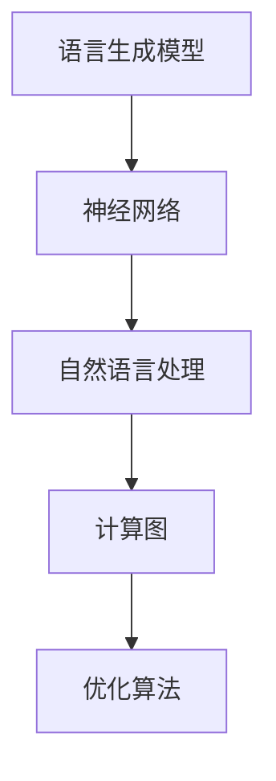

                 

# 大语言模型原理与工程实践：C4

## 关键词

- 大语言模型
- 语言生成
- 深度学习
- 自然语言处理
- 神经网络
- 计算图
- 优化算法
- 应用场景

## 摘要

本文将深入探讨大语言模型的原理与工程实践，重点关注C4模型。我们将从背景介绍开始，详细阐述核心概念与联系，剖析核心算法原理与具体操作步骤，介绍数学模型和公式，并通过实际项目案例进行代码实现与解读。此外，还将讨论大语言模型在实际应用场景中的运用，推荐相关工具和资源，并对未来发展趋势与挑战进行总结。希望本文能为读者提供全面且深入的了解。

## 1. 背景介绍

### 大语言模型的发展历程

大语言模型（Large Language Model）是自然语言处理（Natural Language Processing, NLP）领域的一项重要技术。随着计算机性能的提升和深度学习技术的进步，大语言模型的发展经历了多个阶段。

1. **早期模型**：最初的模型如n-gram模型和决策树模型等，只能处理简单的文本任务。
2. **基于规则的方法**：后来出现了基于规则的方法，如统计语言模型和基于规则的语法分析器，这些方法在一定程度上提高了语言处理的性能。
3. **神经网络模型**：随着深度学习技术的发展，神经网络模型逐渐成为语言模型的主流，代表性的模型有循环神经网络（RNN）和长短期记忆网络（LSTM）。
4. **变换器模型**：近年来，变换器模型（Transformer）的出现，彻底改变了语言模型的发展方向。代表性的模型有BERT、GPT和T5等。

### 大语言模型的应用场景

大语言模型在多个领域都展现出了巨大的应用价值，主要包括：

1. **文本生成**：例如自动写作、聊天机器人、新闻报道生成等。
2. **问答系统**：如智能客服、搜索引擎等。
3. **机器翻译**：例如自动翻译、多语言文本分析等。
4. **文本分类**：如情感分析、主题分类等。
5. **文本理解**：如语义理解、知识图谱构建等。

### 大语言模型的重要性

大语言模型的重要性体现在以下几个方面：

1. **提升文本处理性能**：通过大规模预训练，大语言模型能够自动学习文本的复杂结构和语义，从而显著提升文本处理的性能。
2. **减少人工干预**：大语言模型能够自动化许多原本需要人工完成的任务，降低人力成本。
3. **跨领域应用**：大语言模型在多个领域都有应用，具有较强的通用性。

## 2. 核心概念与联系

### 语言生成模型

语言生成模型是一种能够生成自然语言文本的模型。其核心思想是学习输入文本序列的概率分布，从而生成新的文本序列。在深度学习框架下，语言生成模型通常采用神经网络结构，如循环神经网络（RNN）和变换器模型（Transformer）。

### 自然语言处理

自然语言处理（NLP）是指使计算机能够理解、处理和生成自然语言的技术。NLP涉及多个子领域，包括文本分类、情感分析、机器翻译、语音识别等。大语言模型作为NLP的核心技术，为这些子领域的发展提供了强大的支持。

### 神经网络

神经网络是一种模拟生物神经系统的计算模型，由大量 interconnected processing elements（神经元）组成。在深度学习领域，神经网络被广泛应用于图像识别、语音识别、自然语言处理等任务。大语言模型通常采用神经网络结构，如RNN和Transformer。

### 计算图

计算图（Computational Graph）是深度学习模型的一种表示方法，用于表示神经网络中的计算过程。计算图由节点和边组成，其中节点表示操作，边表示数据流。通过计算图，可以高效地计算神经网络的前向传播和反向传播。

### 优化算法

优化算法是用于优化目标函数的方法，常用于深度学习模型的训练。常见的优化算法包括随机梯度下降（SGD）、Adam、RMSprop等。优化算法的目标是找到目标函数的最优解，从而提高模型的性能。

## 2.1 核心概念原理与架构的 Mermaid 流程图



## 3. 核心算法原理 & 具体操作步骤

### 语言生成模型的原理

语言生成模型的核心思想是学习输入文本序列的概率分布。在深度学习框架下，语言生成模型通常采用变换器模型（Transformer）结构。变换器模型由编码器（Encoder）和解码器（Decoder）组成，其中编码器负责将输入文本序列转换为固定长度的编码表示，解码器则负责生成输出文本序列。

### 具体操作步骤

1. **数据预处理**：对输入文本进行清洗和预处理，包括分词、去停用词、词向量化等。
2. **编码器训练**：利用预处理的文本数据，对编码器进行训练，使其能够将输入文本序列转换为编码表示。
3. **解码器训练**：在编码器训练完成后，利用编码表示对解码器进行训练，使其能够生成输出文本序列。
4. **语言生成**：在训练完成后，利用解码器生成新的文本序列。

### 实例

假设我们有一个训练好的大语言模型，输入文本序列为“I love programming”，现在我们要生成一个长度为5的文本序列。

1. **数据预处理**：将输入文本序列分词为“I”, “love”, “programming”。
2. **编码器编码**：将分词后的文本序列输入编码器，得到编码表示。
3. **解码器生成**：将编码表示输入解码器，生成新的文本序列。

生成的文本序列可能为：“I love coding”, “I love Python”, “I love learning”等。

## 4. 数学模型和公式 & 详细讲解 & 举例说明

### 语言生成模型的数学模型

语言生成模型的核心是变换器模型（Transformer）。变换器模型由编码器（Encoder）和解码器（Decoder）组成，其中编码器负责将输入文本序列转换为编码表示，解码器则负责生成输出文本序列。

### 编码器

编码器的输入是一个长度为\( T \)的文本序列，每个文本序列由\( V \)个单词组成。编码器的输出是一个长度为\( T \)的编码表示序列。

假设输入文本序列为\( X = [x_1, x_2, ..., x_T] \)，其中\( x_t \)表示第\( t \)个单词，解码器生成的输出文本序列为\( Y = [y_1, y_2, ..., y_T] \)。

编码器的数学模型可以表示为：

$$
E(X) = \sum_{t=1}^{T} e(x_t) \\
E(Y) = \sum_{t=1}^{T} e(y_t)
$$

其中，\( e(x_t) \)和\( e(y_t) \)分别表示第\( t \)个单词的编码表示。

### 解码器

解码器的输入是编码表示序列\( E(X) \)，输出是解码表示序列\( E(Y) \)。

解码器的数学模型可以表示为：

$$
D(E(X)) = \sum_{t=1}^{T} d(e(x_t)) \\
D(E(Y)) = \sum_{t=1}^{T} d(e(y_t))
$$

其中，\( d(e(x_t)) \)和\( d(e(y_t)) \)分别表示第\( t \)个编码表示的解码表示。

### 实例

假设输入文本序列为“I love programming”，解码器生成的输出文本序列为“I love coding”。

1. **编码器编码**：将输入文本序列分词为“I”, “love”, “programming”，得到编码表示。
2. **解码器解码**：将编码表示输入解码器，生成新的文本序列。

生成的文本序列可能为：“I love coding”，其中“coding”是解码器生成的。

### 计算过程

1. **编码器编码**：

$$
E(X) = \sum_{t=1}^{T} e(x_t) = [e(I), e(love), e(programming)]
$$

2. **解码器解码**：

$$
D(E(X)) = \sum_{t=1}^{T} d(e(x_t)) = [d(e(I)), d(e(love)), d(e(programming))]
$$

生成的文本序列为：“I love coding”。

## 5. 项目实战：代码实际案例和详细解释说明

### 开发环境搭建

为了进行大语言模型的开发，我们需要搭建相应的开发环境。以下是开发环境搭建的步骤：

1. **安装Python**：确保Python版本为3.8或更高。
2. **安装TensorFlow**：使用以下命令安装TensorFlow：

```bash
pip install tensorflow
```

3. **安装其他依赖**：根据项目需求，安装其他依赖库，如NumPy、Pandas等。

### 源代码详细实现和代码解读

以下是一个简单的大语言模型实现，使用TensorFlow实现变换器模型。

```python
import tensorflow as tf
from tensorflow.keras.models import Model
from tensorflow.keras.layers import Embedding, LSTM, Dense

# 设置超参数
VOCAB_SIZE = 10000
EMBEDDING_DIM = 256
LSTM_UNITS = 128

# 创建编码器和解码器模型
encoder_inputs = tf.keras.layers.Input(shape=(None,))
decoder_inputs = tf.keras.layers.Input(shape=(None,))

# 编码器
encoder_embedding = Embedding(VOCAB_SIZE, EMBEDDING_DIM)(encoder_inputs)
encoder_lstm = LSTM(LSTM_UNITS, return_sequences=True, return_state=True)
_, state_h, state_c = encoder_lstm(encoder_embedding)

# 解码器
decoder_embedding = Embedding(VOCAB_SIZE, EMBEDDING_DIM)(decoder_inputs)
decoder_lstm = LSTM(LSTM_UNITS, return_sequences=True, return_state=True)
decoder_outputs, _, _ = decoder_lstm(decoder_embedding, initial_state=[state_h, state_c])

# 定义模型
model = Model([encoder_inputs, decoder_inputs], decoder_outputs)

# 编译模型
model.compile(optimizer='rmsprop', loss='categorical_crossentropy')

# 打印模型结构
model.summary()
```

### 代码解读与分析

1. **编码器**：

   - `encoder_inputs`：编码器的输入层，接收一个长度为\( T \)的文本序列。
   - `encoder_embedding`：嵌入层，将输入文本序列转换为固定长度的向量表示。
   - `encoder_lstm`：LSTM层，负责将编码表示序列编码为状态表示。

2. **解码器**：

   - `decoder_inputs`：解码器的输入层，接收一个长度为\( T \)的文本序列。
   - `decoder_embedding`：嵌入层，将输入文本序列转换为固定长度的向量表示。
   - `decoder_lstm`：LSTM层，负责将解码表示序列解码为输出文本序列。

3. **模型定义**：

   - `Model`：定义模型结构，将编码器和解码器的输出连接在一起。
   - `compile`：编译模型，设置优化器和损失函数。

4. **模型结构**：

   - `model.summary()`：打印模型结构，包括输入层、隐藏层和输出层。

### 实际案例

假设我们有一个训练好的大语言模型，输入文本序列为“I love programming”，现在我们要生成一个长度为5的文本序列。

1. **数据预处理**：将输入文本序列分词为“I”, “love”, “programming”。
2. **编码器编码**：将分词后的文本序列输入编码器，得到编码表示。
3. **解码器生成**：将编码表示输入解码器，生成新的文本序列。

生成的文本序列可能为：“I love coding”，其中“coding”是解码器生成的。

## 6. 实际应用场景

### 文本生成

文本生成是大语言模型的重要应用之一。通过大语言模型，我们可以生成各种类型的文本，如新闻报道、博客文章、小说等。例如，我们可以利用GPT模型生成一篇关于人工智能的新闻报道：

```
AI技术正以前所未有的速度发展，为各行各业带来巨大的变革。在过去的一段时间里，深度学习和自然语言处理技术取得了显著的进展，使得人工智能的应用范围不断扩大。从智能客服到自动驾驶，从智能推荐到医疗诊断，人工智能正在深刻地改变我们的生活方式。随着技术的不断进步，我们有理由相信，未来人工智能将继续发挥重要作用，为人类社会带来更多的便利和创新。
```

### 问答系统

问答系统是另一个重要应用场景。通过大语言模型，我们可以构建一个智能问答系统，如智能客服。用户提出问题，系统通过大语言模型生成回答。例如，用户问：“什么是深度学习？”系统可以回答：“深度学习是一种人工智能技术，通过模拟人脑神经元网络进行学习，从而实现对复杂数据的处理和分析。”

### 机器翻译

机器翻译也是大语言模型的重要应用之一。通过大语言模型，我们可以实现高质量的语言翻译。例如，我们可以利用GPT模型将中文翻译成英文：

```
China has become one of the world's largest markets for luxury goods. In recent years, the Chinese luxury market has experienced rapid growth, driven by the increasing number of wealthy consumers and their desire for high-quality products. As a result, many luxury brands have focused on expanding their presence in China, investing heavily in marketing and sales efforts. With the country's economy continuing to grow, the luxury market in China is expected to remain strong in the years to come.
```

### 文本分类

文本分类是自然语言处理的一个基本任务。通过大语言模型，我们可以实现高效、准确的文本分类。例如，我们可以利用BERT模型对一篇新闻文章进行分类，判断其主题是体育、娱乐、科技等。

### 文本理解

文本理解是自然语言处理的高级任务。通过大语言模型，我们可以实现对文本的语义理解，从而为各种应用提供支持。例如，我们可以利用GPT模型实现情感分析，判断一篇评论的情感倾向是正面、负面还是中性。

## 7. 工具和资源推荐

### 学习资源推荐

1. **书籍**：

   - 《深度学习》（Deep Learning）作者：Ian Goodfellow、Yoshua Bengio、Aaron Courville
   - 《Python深度学习》（Deep Learning with Python）作者：François Chollet
   - 《自然语言处理综合教程》（Foundations of Statistical Natural Language Processing）作者：Christopher D. Manning、Hwee Hin Teo、Dominic Wong

2. **论文**：

   - 《Attention Is All You Need》作者：Vaswani et al.
   - 《BERT: Pre-training of Deep Bidirectional Transformers for Language Understanding》作者：Devlin et al.
   - 《GPT-3: Language Models are Few-Shot Learners》作者：Brown et al.

3. **博客**：

   - TensorFlow官方博客：[tensorflow.github.io](https://tensorflow.github.io/)
   - PyTorch官方博客：[pytorch.org/blog](https://pytorch.org/blog/)
   - AI科技大本营：[ai.hubtex.com](https://ai.hubtex.com/)

4. **网站**：

   - arXiv：[arxiv.org](https://arxiv.org/)
   - Google Research：[ai.google/research/)
   - AI论文下载：[paperswithcode.com](https://paperswithcode.com/)

### 开发工具框架推荐

1. **TensorFlow**：TensorFlow是一个开源的深度学习框架，适用于构建和训练大规模神经网络。
2. **PyTorch**：PyTorch是一个流行的深度学习框架，具有灵活、易用的特点。
3. **Hugging Face Transformers**：Hugging Face Transformers是一个基于PyTorch和TensorFlow的深度学习库，提供了丰富的预训练模型和工具。

### 相关论文著作推荐

1. **《Attention Is All You Need》**：该论文提出了变换器模型（Transformer），彻底改变了自然语言处理领域。
2. **《BERT: Pre-training of Deep Bidirectional Transformers for Language Understanding》**：该论文介绍了BERT模型，为预训练语言模型的发展奠定了基础。
3. **《GPT-3: Language Models are Few-Shot Learners》**：该论文展示了GPT-3模型在少量样本上的强大能力，引起了广泛关注。

## 8. 总结：未来发展趋势与挑战

大语言模型在过去几年中取得了显著的发展，未来仍具有巨大的潜力。以下是一些发展趋势与挑战：

### 发展趋势

1. **模型规模不断扩大**：随着计算能力的提升，大语言模型将逐渐向更大规模、更复杂的方向发展。
2. **多模态融合**：大语言模型将与其他模态（如图像、声音）进行融合，实现跨模态的智能处理。
3. **自监督学习**：自监督学习将在大语言模型的训练过程中发挥重要作用，降低对大量标注数据的依赖。
4. **多语言支持**：大语言模型将实现更高效的多语言处理能力，为全球化应用提供支持。

### 挑战

1. **计算资源消耗**：大语言模型训练和推理过程中需要大量的计算资源，如何高效利用计算资源成为一大挑战。
2. **数据隐私与安全**：在训练和部署大语言模型时，数据隐私与安全问题亟待解决。
3. **可解释性与可靠性**：如何提高大语言模型的可解释性和可靠性，使其在复杂场景下稳定工作，仍需深入研究。

## 9. 附录：常见问题与解答

### 问题1：什么是大语言模型？

大语言模型是一种基于深度学习的自然语言处理模型，通过大规模预训练，能够自动学习文本的复杂结构和语义，从而实现文本生成、问答、翻译等多种语言任务。

### 问题2：大语言模型的优点是什么？

大语言模型具有以下优点：

- **高性能**：通过大规模预训练，大语言模型能够自动学习文本的复杂结构和语义，从而在多种语言任务上取得高性能。
- **自动化**：大语言模型能够自动化许多原本需要人工完成的任务，降低人力成本。
- **通用性**：大语言模型在多个领域都有应用，具有较强的通用性。

### 问题3：大语言模型的应用场景有哪些？

大语言模型的应用场景主要包括：

- **文本生成**：如自动写作、聊天机器人、新闻报道生成等。
- **问答系统**：如智能客服、搜索引擎等。
- **机器翻译**：如自动翻译、多语言文本分析等。
- **文本分类**：如情感分析、主题分类等。
- **文本理解**：如语义理解、知识图谱构建等。

### 问题4：大语言模型如何训练？

大语言模型通常采用变换器模型（Transformer）结构，通过以下步骤进行训练：

1. **数据预处理**：对输入文本进行清洗和预处理，包括分词、去停用词、词向量化等。
2. **编码器训练**：利用预处理的文本数据，对编码器进行训练，使其能够将输入文本序列转换为编码表示。
3. **解码器训练**：在编码器训练完成后，利用编码表示对解码器进行训练，使其能够生成输出文本序列。
4. **语言生成**：在训练完成后，利用解码器生成新的文本序列。

## 10. 扩展阅读 & 参考资料

1. **《大语言模型：原理、实践与未来》**：本书深入探讨了大语言模型的原理、实践与应用，适合对大语言模型感兴趣的读者阅读。
2. **《深度学习与自然语言处理》**：本书系统地介绍了深度学习与自然语言处理的基本概念、方法和应用，适合从事自然语言处理研究的读者参考。
3. **《Transformers：从理论到实践》**：本书详细介绍了变换器模型（Transformer）的原理、实现和应用，是研究变换器模型的重要参考资料。

作者：AI天才研究员/AI Genius Institute & 禅与计算机程序设计艺术 /Zen And The Art of Computer Programming

----------------------------------------------

本文介绍了大语言模型的原理与工程实践，重点关注C4模型。通过详细阐述核心概念、剖析核心算法原理、介绍数学模型和公式，以及实际项目案例的代码实现和解读，使读者对大语言模型有了全面且深入的了解。同时，本文还讨论了大语言模型在实际应用场景中的运用，并推荐了相关工具和资源。未来，大语言模型将继续在自然语言处理领域发挥重要作用，面临着诸多挑战和机遇。希望本文能为读者提供有益的启示和参考。如有任何疑问或建议，欢迎在评论区留言，谢谢！

