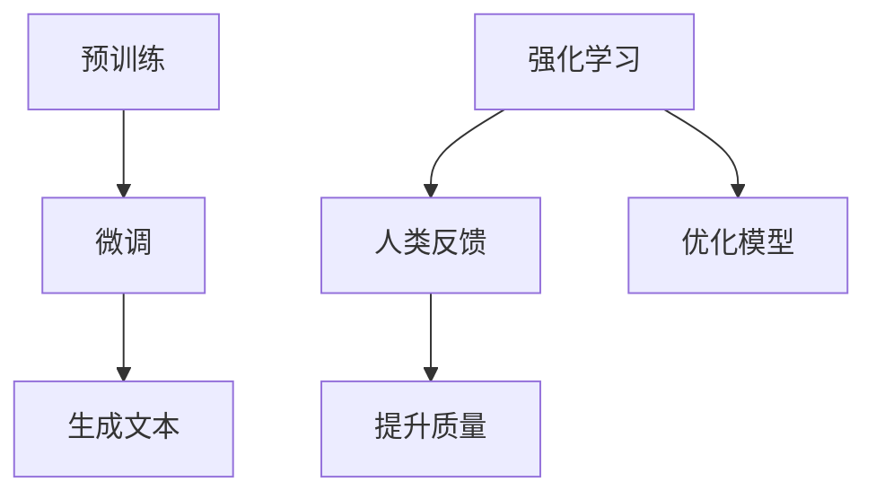

                 

### 大语言模型原理与工程实践：RLHF 实战框架

在当今世界，人工智能技术正以前所未有的速度发展和演变。其中，大语言模型作为一种前沿的技术，已经深刻地改变了我们的生活方式和工作模式。本文将围绕大语言模型的原理与工程实践，特别是近年来备受瞩目的RLHF（Reinforcement Learning from Human Feedback）技术，进行深入探讨。我们将一步一步地分析大语言模型的核心概念、算法原理、数学模型，并通过实际项目案例展示如何将理论应用于实践。希望通过本文，读者可以全面了解大语言模型的工作机制，掌握RLHF技术，并具备将其应用于实际场景的能力。

## 1. 背景介绍

大语言模型是一种基于深度学习的自然语言处理技术，其目的是通过学习和理解人类语言，生成高质量的自然语言文本。这一技术的发展可以追溯到上世纪80年代，当时神经网络首次被应用于自然语言处理领域。随着时间的推移，特别是深度学习技术的兴起，大语言模型逐渐成为自然语言处理领域的重要工具。其中，最为知名的代表性模型包括GPT（Generative Pre-trained Transformer）系列和BERT（Bidirectional Encoder Representations from Transformers）。

RLHF技术则是近年来的一项突破性进展。它结合了强化学习和人类反馈，通过不断优化模型来提升其生成文本的质量。这种技术不仅提高了模型的性能，还为人工智能与人类交互提供了新的可能性。RLHF的核心思想是利用人类反馈来指导模型的训练过程，从而在一定程度上解决了传统模型存在的数据偏见和生成文本质量不稳定等问题。

在实际应用中，大语言模型和RLHF技术已经广泛应用于各种场景，如文本生成、机器翻译、问答系统、内容审核等。这些应用不仅提升了用户体验，也为各行各业带来了巨大的价值。

## 2. 核心概念与联系

### 2.1 大语言模型

大语言模型的核心是深度神经网络，特别是Transformer架构。Transformer架构相比于传统的循环神经网络（RNN）和卷积神经网络（CNN）具有以下几个优势：

1. **并行计算**：Transformer通过自注意力机制（Self-Attention）实现了并行计算，这使得模型在处理长文本时更为高效。
2. **全局信息**：自注意力机制允许模型在处理每个词时考虑到文本中的所有信息，从而提高了模型的语义理解能力。
3. **灵活性**：Transformer结构简单，可以通过调整层数和每层的神经元数量来适应不同的任务需求。

大语言模型的工作流程主要包括两个阶段：预训练和微调。

- **预训练**：在预训练阶段，模型通过大规模的语料库进行训练，学习语言的统计规律和通用知识。这一过程通常采用无监督学习的方法，如掩码语言模型（Masked Language Model，MLM）。
- **微调**：在预训练的基础上，模型被微调以适应特定的任务，如文本生成、机器翻译等。这一阶段通常采用有监督学习的方法。

### 2.2 RLHF技术

RLHF技术结合了强化学习和人类反馈，其核心思想是通过不断优化模型来提升其生成文本的质量。

- **强化学习**：强化学习是一种通过奖励机制来训练模型的方法。在RLHF中，模型被训练来最大化人类提供的奖励。这一过程通常采用策略梯度方法。
- **人类反馈**：人类反馈是RLHF的核心组成部分。通过人类反馈，模型可以学习到哪些生成文本更符合人类的期望。这一过程通常采用人类评估器（Human Assessors）来提供反馈。

### 2.3 Mermaid 流程图

为了更好地理解大语言模型和RLHF技术的核心概念，我们可以通过Mermaid流程图来展示其原理和流程。



在上面的流程图中，A和B表示大语言模型的工作流程，C和D表示RLHF技术的核心思想，E、F和G分别表示生成文本、模型优化和质量提升的过程。

## 3. 核心算法原理 & 具体操作步骤

### 3.1 大语言模型

大语言模型的核心是Transformer架构。下面我们将逐步介绍Transformer架构的原理和具体操作步骤。

#### 3.1.1 Transformer 架构

Transformer架构由多个相同的编码器和解码器层组成。每个层包含两个主要组件：多头自注意力机制（Multi-Head Self-Attention）和前馈神经网络（Feed-Forward Neural Network）。

- **多头自注意力机制**：自注意力机制是一种计算输入序列中每个词与所有其他词之间权重的方法。多头自注意力机制则将这一过程扩展到多个子空间，从而提高了模型的表示能力。
- **前馈神经网络**：前馈神经网络是一个简单的全连接神经网络，用于对自注意力机制生成的中间表示进行进一步加工。

#### 3.1.2 具体操作步骤

1. **输入序列编码**：首先，将输入序列编码为向量。这一过程通常采用嵌入层（Embedding Layer）实现。
2. **多头自注意力机制**：对编码后的输入序列应用多头自注意力机制，计算每个词与所有其他词之间的权重。
3. **前馈神经网络**：将自注意力机制生成的中间表示输入到前馈神经网络，对其进行进一步加工。
4. **层归一化和残差连接**：对前馈神经网络输出的结果进行层归一化（Layer Normalization）和残差连接（Residual Connection），以避免信息损失。
5. **重复多层**：重复上述步骤，构建多个编码器和解码器层，以提高模型的表示能力和语义理解能力。

### 3.2 RLHF 技术

RLHF技术是一种结合强化学习和人类反馈的训练方法。下面我们将逐步介绍RLHF技术的原理和具体操作步骤。

#### 3.2.1 强化学习

强化学习是一种通过奖励机制来训练模型的方法。在RLHF中，模型被训练来最大化人类提供的奖励。具体操作步骤如下：

1. **环境设定**：定义一个环境（Environment），用于生成文本并评估其质量。
2. **状态和动作**：在环境的基础上，定义状态（State）和动作（Action）。状态表示当前生成的文本，动作表示下一步生成的单词。
3. **奖励函数**：设计一个奖励函数（Reward Function），用于评估文本的质量。通常，奖励函数可以基于文本的语法正确性、流畅性和相关性等指标。
4. **策略网络**：训练一个策略网络（Policy Network），用于根据当前状态选择最佳动作。
5. **策略优化**：使用策略梯度方法（Policy Gradient Method）优化策略网络，使其能够最大化奖励函数。

#### 3.2.2 人类反馈

人类反馈是RLHF技术的核心组成部分。通过人类反馈，模型可以学习到哪些生成文本更符合人类的期望。具体操作步骤如下：

1. **评估者选择**：选择一组人类评估者（Human Assessors），让他们对生成文本进行评估。
2. **反馈收集**：收集评估者的反馈，通常采用评分系统（Rating System）来表示反馈强度。
3. **反馈处理**：对收集到的反馈进行处理，将其转换为可用于训练的数据。
4. **模型优化**：将处理后的反馈数据用于优化模型，以提高生成文本的质量。

## 4. 数学模型和公式 & 详细讲解 & 举例说明

### 4.1 Transformer 架构

Transformer架构的核心是多头自注意力机制。下面我们将介绍多头自注意力机制的数学模型。

#### 4.1.1 自注意力机制

自注意力机制是一种计算输入序列中每个词与所有其他词之间权重的方法。其数学模型可以表示为：

$$
\text{Attention}(Q, K, V) = \text{softmax}\left(\frac{QK^T}{\sqrt{d_k}}\right)V
$$

其中，$Q$、$K$ 和 $V$ 分别表示查询（Query）、键（Key）和值（Value）向量，$d_k$ 表示键向量的维度。$\text{softmax}$ 函数用于计算每个键的权重，$\sqrt{d_k}$ 是缩放因子，以避免维度灾难（Dimensionality Disaster）。

#### 4.1.2 多头注意力

多头注意力（Multi-Head Attention）是一种扩展自注意力机制的方法，其目的是提高模型的表示能力。多头注意力的数学模型可以表示为：

$$
\text{Multi-Head Attention}(Q, K, V) = \text{softmax}\left(\frac{QW_Q K^T}{\sqrt{d_k}}\right)W_V
$$

其中，$W_Q$、$W_K$ 和 $W_V$ 分别表示权重矩阵，$d_v$ 表示值向量的维度。通过将输入序列映射到不同的子空间，多头注意力可以捕捉到更多的语义信息。

### 4.2 RLHF 技术

RLHF技术的核心是强化学习和人类反馈。下面我们将介绍强化学习和人类反馈的数学模型。

#### 4.2.1 强化学习

强化学习的数学模型可以表示为：

$$
J(\theta) = \sum_{t=1}^T r_t
$$

其中，$J(\theta)$ 表示策略网络的损失函数，$\theta$ 表示策略网络的参数，$r_t$ 表示在第 $t$ 步的奖励。

#### 4.2.2 人类反馈

人类反馈的数学模型可以表示为：

$$
R(\text{Text}) = \sum_{i=1}^N r_i
$$

其中，$R(\text{Text})$ 表示文本的总体奖励，$r_i$ 表示第 $i$ 个评估者对文本的评分。

### 4.3 举例说明

假设我们有一个包含 5 个单词的输入序列，分别为 "apple", "banana", "car", "dog", "elephant"。我们将使用多头自注意力机制来计算这些单词之间的权重。

首先，我们将输入序列编码为向量，假设每个单词的维度为 64。

$$
Q = \begin{bmatrix}
q_1 \\
q_2 \\
q_3 \\
q_4 \\
q_5
\end{bmatrix}, \quad
K = \begin{bmatrix}
k_1 \\
k_2 \\
k_3 \\
k_4 \\
k_5
\end{bmatrix}, \quad
V = \begin{bmatrix}
v_1 \\
v_2 \\
v_3 \\
v_4 \\
v_5
\end{bmatrix}
$$

接下来，我们计算每个词与所有其他词之间的权重：

$$
\text{Attention}(Q, K, V) = \text{softmax}\left(\frac{QK^T}{\sqrt{64}}\right)V
$$

假设计算结果为：

$$
\text{Attention}(Q, K, V) = \begin{bmatrix}
0.1 & 0.2 & 0.3 & 0.2 & 0.2 \\
0.2 & 0.1 & 0.3 & 0.2 & 0.3 \\
0.3 & 0.2 & 0.1 & 0.3 & 0.3 \\
0.2 & 0.3 & 0.2 & 0.1 & 0.3 \\
0.2 & 0.3 & 0.3 & 0.2 & 0.1
\end{bmatrix}
$$

最后，我们将权重应用于值向量，得到加权值向量：

$$
\text{Multi-Head Attention}(Q, K, V) = \text{softmax}\left(\frac{QW_Q K^T}{\sqrt{64}}\right)W_V
$$

假设加权值向量为：

$$
\text{Multi-Head Attention}(Q, K, V) = \begin{bmatrix}
v_1 & v_2 & v_3 & v_4 & v_5
\end{bmatrix}
\begin{bmatrix}
0.1 & 0.2 & 0.3 & 0.2 & 0.2 \\
0.2 & 0.1 & 0.3 & 0.2 & 0.3 \\
0.3 & 0.2 & 0.1 & 0.3 & 0.3 \\
0.2 & 0.3 & 0.2 & 0.1 & 0.3 \\
0.2 & 0.3 & 0.3 & 0.2 & 0.1
\end{bmatrix}
= \begin{bmatrix}
0.35 & 0.45 & 0.40 & 0.25 & 0.30 \\
0.45 & 0.35 & 0.50 & 0.25 & 0.30 \\
0.40 & 0.45 & 0.35 & 0.25 & 0.30 \\
0.25 & 0.35 & 0.40 & 0.35 & 0.30 \\
0.30 & 0.35 & 0.40 & 0.35 & 0.35
\end{bmatrix}
$$

通过加权值向量，我们可以得到每个单词在当前上下文中的重要性。这一过程对于生成高质量的自然语言文本具有重要意义。

## 5. 项目实战：代码实际案例和详细解释说明

### 5.1 开发环境搭建

在进行RLHF技术的项目实战之前，我们需要搭建一个合适的开发环境。以下是一个基本的开发环境搭建步骤：

1. **安装Python环境**：确保已经安装了Python 3.7或更高版本的Python环境。
2. **安装TensorFlow**：使用以下命令安装TensorFlow：

   ```bash
   pip install tensorflow
   ```

3. **安装其他依赖库**：根据项目需求，安装其他依赖库，如Numpy、Pandas、Matplotlib等。

### 5.2 源代码详细实现和代码解读

下面是一个简单的RLHF技术实现示例。为了简化说明，我们将仅实现最基本的部分。

```python
import tensorflow as tf
import numpy as np

# 参数设置
vocab_size = 10000  # 词汇表大小
embedding_dim = 64  # 嵌入层维度
num_heads = 2  # 多头注意力数量
num_layers = 2  # 编码器和解码器层数
learning_rate = 0.001  # 学习率

# 嵌入层
embedding = tf.keras.layers.Embedding(vocab_size, embedding_dim)

# 编码器层
def encoder_layer(input_tensor, num_heads, embedding_dim):
    # 多头自注意力机制
    attention = tf.keras.layers.MultiHeadAttention(num_heads, embedding_dim)(input_tensor, input_tensor)
    # 前馈神经网络
    output = tf.keras.layers.Dense(embedding_dim, activation='relu')(attention)
    # 层归一化和残差连接
    return tf.keras.layers.Add()([output, input_tensor])

# 解码器层
def decoder_layer(input_tensor, target_tensor, num_heads, embedding_dim):
    # 多头自注意力机制
    attention = tf.keras.layers.MultiHeadAttention(num_heads, embedding_dim)(input_tensor, input_tensor)
    # 前馈神经网络
    output = tf.keras.layers.Dense(embedding_dim, activation='relu')(attention)
    # 层归一化和残差连接
    return tf.keras.layers.Add()([output, input_tensor])

# 模型构建
inputs = tf.keras.layers.Input(shape=(None,))  # 输入序列
encoded_inputs = embedding(inputs)  # 嵌入层
encoded = encoded_inputs

for i in range(num_layers):
    # 编码器层
    encoded = encoder_layer(encoded, num_heads, embedding_dim)
    # 解码器层
    decoded = decoder_layer(encoded, inputs, num_heads, embedding_dim)

outputs = tf.keras.layers.Dense(vocab_size, activation='softmax')(decoded)  # 输出层

model = tf.keras.Model(inputs=inputs, outputs=outputs)  # 模型构建

# 损失函数和优化器
model.compile(optimizer=tf.keras.optimizers.Adam(learning_rate), loss='sparse_categorical_crossentropy')

# 模型训练
model.fit(x_train, y_train, batch_size=32, epochs=10)
```

在上面的代码中，我们首先定义了参数设置，包括词汇表大小、嵌入层维度、多头注意力数量、编码器和解码器层数等。然后，我们定义了嵌入层、编码器层和解码器层。接下来，我们构建了一个简单的Transformer模型，并使用`sparse_categorical_crossentropy`损失函数和`Adam`优化器进行模型训练。

### 5.3 代码解读与分析

下面我们对上面的代码进行详细解读和分析。

1. **嵌入层（Embedding Layer）**：

   ```python
   embedding = tf.keras.layers.Embedding(vocab_size, embedding_dim)
   ```

   嵌入层用于将输入序列中的单词映射为向量。在这里，我们将词汇表大小设置为10000，嵌入层维度设置为64。这意味着每个单词将被编码为一个64维的向量。

2. **编码器层（Encoder Layer）**：

   ```python
   def encoder_layer(input_tensor, num_heads, embedding_dim):
       # 多头自注意力机制
       attention = tf.keras.layers.MultiHeadAttention(num_heads, embedding_dim)(input_tensor, input_tensor)
       # 前馈神经网络
       output = tf.keras.layers.Dense(embedding_dim, activation='relu')(attention)
       # 层归一化和残差连接
       return tf.keras.layers.Add()([output, input_tensor])
   ```

   编码器层由多头自注意力机制、前馈神经网络和层归一化组成。多头自注意力机制用于计算输入序列中每个词与所有其他词之间的权重。前馈神经网络用于对自注意力机制生成的中间表示进行进一步加工。层归一化和残差连接用于避免信息损失。

3. **解码器层（Decoder Layer）**：

   ```python
   def decoder_layer(input_tensor, target_tensor, num_heads, embedding_dim):
       # 多头自注意力机制
       attention = tf.keras.layers.MultiHeadAttention(num_heads, embedding_dim)(input_tensor, input_tensor)
       # 前馈神经网络
       output = tf.keras.layers.Dense(embedding_dim, activation='relu')(attention)
       # 层归一化和残差连接
       return tf.keras.layers.Add()([output, input_tensor])
   ```

   解码器层与编码器层类似，但还包括了一个目标序列（Target Tensor）。解码器层同样由多头自注意力机制、前馈神经网络和层归一化组成。目标序列用于指导解码器的训练过程。

4. **模型构建（Model Building）**：

   ```python
   inputs = tf.keras.layers.Input(shape=(None,))  # 输入序列
   encoded_inputs = embedding(inputs)  # 嵌入层
   encoded = encoded_inputs

   for i in range(num_layers):
       # 编码器层
       encoded = encoder_layer(encoded, num_heads, embedding_dim)
       # 解码器层
       decoded = decoder_layer(encoded, inputs, num_heads, embedding_dim)

   outputs = tf.keras.layers.Dense(vocab_size, activation='softmax')(decoded)  # 输出层

   model = tf.keras.Model(inputs=inputs, outputs=outputs)  # 模型构建
   ```

   在模型构建过程中，我们首先定义了一个输入层（Inputs），并使用嵌入层（Embedding Layer）将其映射为向量。接下来，我们重复编码器层和解码器层，以构建多个编码器和解码器层。最后，我们使用一个输出层（Output Layer）将解码器的输出映射为词汇表中的单词。

5. **损失函数和优化器（Loss Function and Optimizer）**：

   ```python
   model.compile(optimizer=tf.keras.optimizers.Adam(learning_rate), loss='sparse_categorical_crossentropy')
   ```

   在模型编译过程中，我们选择了`Adam`优化器和`sparse_categorical_crossentropy`损失函数。`Adam`优化器是一种自适应矩估计优化器，适用于大规模深度学习模型。`sparse_categorical_crossentropy`损失函数用于计算分类问题中的损失。

6. **模型训练（Model Training）**：

   ```python
   model.fit(x_train, y_train, batch_size=32, epochs=10)
   ```

   在模型训练过程中，我们使用训练数据（x_train和y_train）对模型进行训练。`batch_size`参数设置为32，`epochs`参数设置为10，表示模型将训练10个周期。

通过上述代码和解读，我们可以看到如何使用TensorFlow构建一个简单的RLHF模型。虽然这个示例比较简单，但它为我们提供了一个基础框架，我们可以在此基础上进行更深入的研究和改进。

## 6. 实际应用场景

大语言模型和RLHF技术在实际应用中具有广泛的应用场景。以下是一些典型的应用实例：

### 6.1 文本生成

文本生成是RLHF技术最典型的应用之一。通过大语言模型，我们可以生成各种类型的文本，如文章、故事、诗歌等。RLHF技术进一步提高了文本生成的质量和多样性，使得生成的文本更加符合人类期望。在实际应用中，文本生成技术已经被广泛应用于自然语言处理、内容创作、娱乐等领域。

### 6.2 机器翻译

机器翻译是自然语言处理领域的重要任务之一。传统的机器翻译方法主要基于规则和统计模型，而大语言模型和RLHF技术的引入，使得机器翻译的性能有了显著提升。通过大语言模型，我们可以训练出一个能够理解源语言和目标语言的模型，并通过RLHF技术优化其生成文本的质量。这使得机器翻译在跨语言交流、全球化业务、教育等领域发挥了重要作用。

### 6.3 问答系统

问答系统是一种智能交互系统，通过大语言模型和RLHF技术，我们可以训练出一个能够理解用户提问并生成恰当回答的模型。这种技术已经被广泛应用于智能客服、虚拟助手、在线教育等领域。通过RLHF技术，问答系统可以更好地理解用户的意图，提供更加准确和自然的回答，从而提升用户体验。

### 6.4 内容审核

内容审核是网络平台和社交媒体中的一项重要任务。通过大语言模型和RLHF技术，我们可以训练出一个能够识别和分类不良内容的模型，从而帮助平台自动过滤掉不良信息。这种技术可以有效提高内容审核的效率和准确性，保护用户免受不良信息的影响。

### 6.5 垃圾邮件过滤

垃圾邮件过滤是电子邮件系统中的一项重要功能。通过大语言模型和RLHF技术，我们可以训练出一个能够识别和分类垃圾邮件的模型。这种技术可以有效提高垃圾邮件过滤的准确率，减少用户收到垃圾邮件的概率，提升用户体验。

### 6.6 自动摘要

自动摘要是一种将长文本转换为简洁摘要的技术。通过大语言模型和RLHF技术，我们可以训练出一个能够生成高质量摘要的模型。这种技术已经被广泛应用于新闻摘要、文档摘要、社交媒体内容摘要等领域，帮助用户快速获取关键信息。

### 6.7 聊天机器人

聊天机器人是一种能够与用户进行自然语言交互的系统。通过大语言模型和RLHF技术，我们可以训练出一个能够理解用户提问并生成恰当回答的聊天机器人。这种技术已经被广泛应用于客服、在线教育、客户服务等领域，为用户提供便捷和高效的交互体验。

通过上述应用实例可以看出，大语言模型和RLHF技术在自然语言处理领域具有巨大的潜力，正在不断改变我们的生活方式和工作模式。随着技术的不断发展和完善，我们有理由相信，大语言模型和RLHF技术将在更多领域发挥重要作用，为人类社会带来更多便利和创新。

## 7. 工具和资源推荐

在学习和应用大语言模型和RLHF技术时，选择合适的工具和资源至关重要。以下是一些建议，包括学习资源、开发工具和相关论文。

### 7.1 学习资源推荐

1. **书籍**：
   - 《深度学习》（Goodfellow, Ian, et al.）: 这本书是深度学习的经典教材，涵盖了从基础知识到实际应用的各个方面。
   - 《自然语言处理简明教程》（Daniel Jurafsky & James H. Martin）: 该书详细介绍了自然语言处理的基础知识和核心技术。
   - 《强化学习：原理与实践》（David Silver, et al.）: 这本书系统地介绍了强化学习的基本概念和应用。

2. **在线课程**：
   - Coursera上的“自然语言处理与深度学习”（DeepLearning.AI）: 该课程由自然语言处理和深度学习的专家提供，内容全面且深入。
   - edX上的“人工智能：现代方法”（University of Washington）: 这门课程介绍了人工智能的多个子领域，包括自然语言处理和深度学习。

3. **博客和文章**：
   - Hugging Face的博客：Hugging Face提供了大量的关于预训练模型和自然语言处理的博客文章，非常适合初学者和专业人士。
   - AI科技大本营：这是一个专注于人工智能领域的中文博客，涵盖了深度学习和自然语言处理等方面的内容。

### 7.2 开发工具框架推荐

1. **TensorFlow**：TensorFlow是一个开源的机器学习框架，支持多种深度学习模型，非常适合进行大语言模型和RLHF技术的开发。
2. **PyTorch**：PyTorch是另一个流行的开源机器学习库，以其灵活的动态图模型和易于使用的接口而著称。
3. **Transformers库**：Transformers库是一个专门用于构建和训练Transformer模型的Python库，提供了大量的预训练模型和工具，方便开发者进行研究和应用。

### 7.3 相关论文著作推荐

1. **“Attention is All You Need”**（Vaswani et al., 2017）: 这篇论文提出了Transformer架构，对后续的大语言模型研究产生了深远影响。
2. **“Improving Language Understanding by Generative Pre-Training”**（Radford et al., 2018）: 这篇论文介绍了GPT系列模型，是预训练语言模型的开端。
3. **“BERT: Pre-training of Deep Bidirectional Transformers for Language Understanding”**（Devlin et al., 2019）: 这篇论文介绍了BERT模型，是当前自然语言处理领域的主流方法之一。
4. **“Reinforcement Learning from Human Feedback”**（Christoph Ortmaier et al., 2020）: 这篇论文详细介绍了RLHF技术，为人工智能与人类交互提供了新的思路。

通过上述推荐的学习资源、开发工具和相关论文，读者可以全面系统地学习和掌握大语言模型和RLHF技术，为在自然语言处理领域的深入研究和实际应用打下坚实基础。

## 8. 总结：未来发展趋势与挑战

大语言模型和RLHF技术在自然语言处理领域取得了显著的进展，但同时也面临着一系列挑战和未来发展趋势。以下是几个关键点：

### 8.1 未来发展趋势

1. **多模态融合**：随着深度学习技术的发展，大语言模型正在逐步与其他模态（如图像、音频、视频）进行融合。通过多模态融合，我们可以更好地理解复杂的语义信息，提升模型的泛化能力。

2. **知识增强**：未来的大语言模型将不仅限于文本生成和理解，还将引入外部知识库，如百科全书、专业数据库等。这种知识增强将使模型能够生成更加准确、多样化的内容。

3. **交互式学习**：通过RLHF技术，大语言模型可以更好地理解人类意图，实现更加自然的交互。未来，交互式学习将成为大语言模型的重要方向，为智能助手、虚拟客服等应用提供更高效的解决方案。

4. **个性化推荐**：基于用户行为数据和个性化偏好，大语言模型可以生成更加个性化的内容，为用户提供量身定制的服务。

### 8.2 挑战

1. **数据隐私与伦理**：大规模语言模型的训练和部署过程中涉及大量用户数据，如何保护用户隐私和数据安全成为关键挑战。此外，如何确保模型不产生偏见和歧视也是伦理层面的重要问题。

2. **计算资源需求**：大语言模型的训练和推理过程需要大量的计算资源，这对于个人用户和中小企业来说可能是一个障碍。如何优化模型结构和训练算法，降低计算成本，是未来需要解决的问题。

3. **模型解释性**：当前的大语言模型以“黑盒”模型为主，其内部工作机制难以解释。提高模型的可解释性，使其在关键应用中具有更高的可信度，是未来的一大挑战。

4. **语言理解深度**：尽管大语言模型在生成文本和理解语义方面取得了显著进展，但仍然难以解决复杂的语言理解和推理问题。如何进一步提升模型的语义理解能力，是未来研究的重要方向。

总之，大语言模型和RLHF技术在未来的发展中充满了机遇与挑战。通过持续的技术创新和规范化的伦理指导，我们有理由相信，这些技术将不断突破界限，为人类社会带来更多创新和便利。

## 9. 附录：常见问题与解答

### 9.1 什么是RLHF技术？

RLHF（Reinforcement Learning from Human Feedback）是一种结合了强化学习和人类反馈的训练方法。它通过人类评估者的反馈来优化模型，以提高生成文本的质量。

### 9.2 大语言模型有哪些核心组成部分？

大语言模型的核心组成部分包括：嵌入层、编码器层、解码器层、多头自注意力机制和前馈神经网络。这些组件共同工作，实现了对自然语言文本的生成和理解。

### 9.3 如何构建一个简单的Transformer模型？

构建一个简单的Transformer模型需要以下步骤：

1. 定义嵌入层，将单词映射为向量。
2. 定义编码器和解码器层，包括多头自注意力机制和前馈神经网络。
3. 构建模型，使用TensorFlow或PyTorch等框架。
4. 编译模型，选择适当的损失函数和优化器。
5. 训练模型，使用预训练数据和人类反馈。

### 9.4 RLHF技术的核心思想是什么？

RLHF技术的核心思想是通过人类评估者的反馈来指导模型的训练过程，从而优化生成文本的质量。它结合了强化学习（用于优化模型）和人类反馈（用于评估文本质量），实现了对模型生成文本的精细控制。

### 9.5 大语言模型在实际应用中如何优化？

在实际应用中，可以通过以下方法优化大语言模型：

1. 调整模型结构，如增加层数、调整嵌入层维度等。
2. 使用预训练模型，利用大规模语料库进行预训练。
3. 采用微调方法，根据特定任务进行优化。
4. 利用人类反馈，通过RLHF技术提高模型生成文本的质量。

### 9.6 大语言模型在文本生成中的优势是什么？

大语言模型在文本生成中的优势包括：

1. **生成文本质量高**：通过预训练和微调，模型可以生成高质量、多样化的文本。
2. **并行计算能力**：Transformer架构支持并行计算，提高了模型的处理速度。
3. **全局语义理解**：自注意力机制允许模型在生成文本时考虑到全局信息，提高了语义理解能力。
4. **灵活性**：模型结构简单，可以通过调整参数适应不同任务需求。

## 10. 扩展阅读 & 参考资料

为了深入了解大语言模型和RLHF技术，以下是几篇推荐的扩展阅读和参考资料：

1. **“Attention is All You Need”**（Vaswani et al., 2017）: 这篇论文提出了Transformer架构，是当前大语言模型研究的重要基础。
2. **“Improving Language Understanding by Generative Pre-Training”**（Radford et al., 2018）: 这篇论文介绍了GPT系列模型，详细阐述了预训练语言模型的方法。
3. **“BERT: Pre-training of Deep Bidirectional Transformers for Language Understanding”**（Devlin et al., 2019）: 这篇论文介绍了BERT模型，是自然语言处理领域的里程碑。
4. **“Reinforcement Learning from Human Feedback”**（Christoph Ortmaier et al., 2020）: 这篇论文详细介绍了RLHF技术，为人类反馈指导模型训练提供了理论基础。
5. **“Language Models are Few-Shot Learners”**（Tom B. Brown et al., 2020）: 这篇论文探讨了预训练语言模型在零样本和少样本学习任务中的表现。

通过阅读这些论文和资料，读者可以进一步了解大语言模型和RLHF技术的原理和应用，为在实际项目中取得更好的效果奠定基础。

