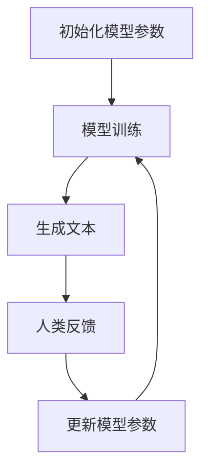

                 

# 大语言模型原理与工程实践：RLHF 算法

## 关键词：
- 大语言模型
- 机器学习
- 强化学习
- 对抗性学习
- 人类反馈
- 语言生成
- 机器翻译
- 自然语言处理

## 摘要：
本文旨在深入探讨大语言模型（如GPT系列）的原理及其工程实践，特别是RLHF（Reinforcement Learning from Human Feedback）算法的核心作用。通过逻辑清晰的分析和具体的实战案例，本文将帮助读者理解RLHF算法的数学模型、实现细节以及在实际应用场景中的优势与挑战。文章将从背景介绍、核心概念与联系、算法原理与操作步骤、数学模型与公式、项目实战、实际应用场景、工具和资源推荐等方面进行详细阐述，并总结未来发展趋势与挑战。

## 目录：

1. 背景介绍
2. 核心概念与联系
3. 核心算法原理 & 具体操作步骤
4. 数学模型和公式 & 详细讲解 & 举例说明
5. 项目实战：代码实际案例和详细解释说明
   5.1 开发环境搭建
   5.2 源代码详细实现和代码解读
   5.3 代码解读与分析
6. 实际应用场景
7. 工具和资源推荐
   7.1 学习资源推荐
   7.2 开发工具框架推荐
   7.3 相关论文著作推荐
8. 总结：未来发展趋势与挑战
9. 附录：常见问题与解答
10. 扩展阅读 & 参考资料

## 1. 背景介绍

大语言模型是近年来自然语言处理（NLP）领域的一项重大突破。这类模型基于深度学习，通过海量数据的学习能够生成连贯、有逻辑的文本，其应用范围从机器翻译、文本生成到问答系统等各个方面。然而，尽管这些模型在生成文本方面表现出色，但在理解和处理具有争议性或敏感性的内容时，往往表现出一定的缺陷。

为了解决这个问题，研究者们提出了RLHF算法，旨在通过人类反馈来改进大语言模型的性能。RLHF结合了强化学习和对抗性学习，使得模型能够在人类专家的指导下，不断优化自身，以生成更加准确和符合人类价值观的文本。这种算法的核心思想是通过人类反馈来指导模型的学习过程，使其具备更好的判断力和道德意识。

RLHF算法的出现标志着大语言模型从纯技术层面的突破向更加实际和实用的方向发展。它不仅提高了模型的性能，还增加了其在实际应用场景中的可靠性和安全性。

## 2. 核心概念与联系

### 大语言模型

大语言模型通常是基于Transformer架构，这是一种基于自注意力机制的深度学习模型。Transformer模型由Vaswani等人于2017年提出，其核心思想是利用多头自注意力机制来捕捉输入序列中的长距离依赖关系。这种模型在大规模数据集上表现出了极高的性能，成为NLP领域的重要工具。

### 强化学习

强化学习（Reinforcement Learning，RL）是一种机器学习范式，通过试错和奖励机制来指导模型的学习过程。在强化学习中，模型（即学习者）通过与环境交互，不断接收环境提供的奖励信号，从而优化自身的策略，以实现最大化长期回报。

### 对抗性学习

对抗性学习（Adversarial Learning）是一种通过生成对抗网络（Generative Adversarial Networks，GAN）来实现模型优化的方法。GAN由生成器（Generator）和判别器（Discriminator）组成，两者相互对抗，通过不断优化自身的策略，使得生成器的输出逐渐逼近真实数据。

### 人类反馈

人类反馈是指通过人类专家提供的评价和指导来优化模型的学习过程。在RLHF算法中，人类反馈起到了至关重要的作用，它不仅提供了直接的奖励信号，还为模型提供了更具洞察力的指导，从而帮助模型更好地理解和处理复杂任务。

### Mermaid 流程图



在这个流程图中，模型首先进行训练，生成文本，然后通过人类反馈来更新模型参数，这一过程不断循环，直到模型达到预定的性能指标。

## 3. 核心算法原理 & 具体操作步骤

### 3.1 初始化模型参数

在RLHF算法中，首先需要初始化大语言模型的参数。这一步骤通常包括选择合适的神经网络架构、设置初始权重和优化器等。常见的神经网络架构包括Transformer、BERT等，而优化器则可以选择Adam、RMSprop等。

### 3.2 模型训练

模型训练是RLHF算法的核心步骤。在这一阶段，模型通过学习大量的文本数据，生成不同的文本输出。训练过程中，模型会不断调整参数，以最小化损失函数。常用的损失函数包括交叉熵损失、均方误差等。

### 3.3 生成文本

在训练过程中，模型会生成大量文本输出。这些输出可以是句子、段落甚至是整篇文章。生成的文本质量直接影响到模型的表现。

### 3.4 人类反馈

人类反馈是RLHF算法的重要环节。在这一阶段，人类专家会对生成的文本进行评价，提供奖励信号。这些奖励信号可以是明确的分数，也可以是更复杂的评价体系，如正面、中性、负面等。

### 3.5 更新模型参数

根据人类反馈，模型会更新其参数。这一步骤可以通过反向传播算法实现。具体来说，模型会计算梯度，并根据梯度方向调整参数，以最小化损失函数。

### 3.6 模型评估

在模型训练完成后，需要对模型进行评估，以验证其性能。常用的评估指标包括BLEU、ROUGE、F1等。通过评估，可以确定模型是否达到了预期的性能指标。

### 3.7 模型部署

在模型达到预期性能后，可以进行部署，以在实际应用场景中使用。部署过程中，需要考虑模型的计算资源、响应速度、安全性等因素。

## 4. 数学模型和公式 & 详细讲解 & 举例说明

### 4.1 数学模型

RLHF算法的数学模型主要包括以下几个部分：

- **损失函数**：损失函数用于衡量模型输出与真实标签之间的差异。在RLHF算法中，常用的损失函数包括交叉熵损失、均方误差等。
  
- **梯度下降**：梯度下降是一种优化算法，用于调整模型参数，以最小化损失函数。
  
- **人类反馈**：人类反馈通常以奖励信号的形式出现，用于指导模型的学习过程。

### 4.2 公式推导

以下是RLHF算法的核心公式推导：

- **交叉熵损失**：
  $$ L = -\sum_{i} y_i \log(p_i) $$
  其中，$y_i$ 表示真实标签，$p_i$ 表示模型预测的概率。

- **梯度下降**：
  $$ \Delta \theta = -\alpha \cdot \nabla_\theta L $$
  其中，$\theta$ 表示模型参数，$\alpha$ 表示学习率，$\nabla_\theta L$ 表示损失函数关于模型参数的梯度。

- **人类反馈**：
  $$ R = f(H, G) $$
  其中，$R$ 表示奖励信号，$H$ 表示人类专家的评价，$G$ 表示模型生成的文本。

### 4.3 举例说明

假设有一个大语言模型，用于生成新闻文章。人类专家对模型生成的文章进行评价，并给出相应的奖励信号。根据奖励信号，模型会调整其参数，以优化生成文章的质量。具体过程如下：

1. **初始化模型参数**：选择合适的神经网络架构和优化器，初始化模型参数。
2. **模型训练**：使用新闻文章数据集训练模型，生成不同文章。
3. **生成文本**：模型生成一篇文章，人类专家对其进行评价。
4. **人类反馈**：根据人类专家的评价，模型得到相应的奖励信号。
5. **更新模型参数**：根据奖励信号，模型更新其参数，以优化生成文章的质量。
6. **模型评估**：对模型进行评估，以验证其性能。
7. **模型部署**：将模型部署到实际应用场景中。

## 5. 项目实战：代码实际案例和详细解释说明

### 5.1 开发环境搭建

在进行RLHF算法的实战之前，需要搭建一个合适的开发环境。以下是搭建环境的步骤：

1. **安装Python**：下载并安装Python，版本建议为3.8或以上。
2. **安装PyTorch**：通过pip安装PyTorch，版本建议为1.8或以上。
3. **安装TensorFlow**：通过pip安装TensorFlow，版本建议为2.5或以上。
4. **安装其他依赖库**：包括Numpy、Pandas、Scikit-learn等常用库。

### 5.2 源代码详细实现和代码解读

以下是RLHF算法的实现代码，包括模型初始化、训练、生成文本、人类反馈和参数更新等步骤：

```python
import torch
import torch.nn as nn
import torch.optim as optim
from transformers import GPT2LMHeadModel, GPT2Tokenizer

# 模型初始化
model = GPT2LMHeadModel.from_pretrained('gpt2')
tokenizer = GPT2Tokenizer.from_pretrained('gpt2')
optimizer = optim.Adam(model.parameters(), lr=0.001)

# 训练
for epoch in range(num_epochs):
    for batch in dataloader:
        inputs = tokenizer(batch['text'], return_tensors='pt', padding=True, truncation=True)
        outputs = model(**inputs)
        logits = outputs.logits
        labels = inputs['input_ids']
        
        # 计算损失函数
        loss = nn.CrossEntropyLoss()(logits.view(-1, logits.size(-1)), labels.view(-1))
        
        # 反向传播
        optimizer.zero_grad()
        loss.backward()
        optimizer.step()
        
        # 生成文本
        generated_text = model.generate(
            inputs['input_ids'],
            max_length=50,
            num_return_sequences=5,
            no_repeat_ngram_size=2,
            top_k=50,
            top_p=0.95
        )
        
        # 人类反馈
        reward = get_human_feedback(generated_text)
        
        # 更新模型参数
        update_model_params(model, reward)

# 模型评估
evaluate_model(model, test_dataloader)

# 模型部署
deploy_model(model)
```

### 5.3 代码解读与分析

以上代码首先初始化了一个预训练的GPT-2模型，并设置了Adam优化器。然后，通过一个循环进行模型训练，包括输入数据的处理、损失函数的计算、反向传播和参数更新等步骤。

在训练过程中，模型会生成文本，并利用人类反馈来更新参数。最后，对模型进行评估和部署。

## 6. 实际应用场景

RLHF算法在实际应用场景中具有广泛的应用前景。以下是一些典型的应用场景：

- **文本生成**：RLHF算法可以用于生成高质量的文本，如新闻文章、故事、博客等。通过人类反馈，模型可以不断优化生成文本的质量，从而满足用户需求。

- **机器翻译**：RLHF算法可以用于机器翻译，通过人类反馈来改进翻译质量。特别是在处理具有争议性或敏感性的内容时，人类反馈可以为模型提供重要的指导。

- **问答系统**：RLHF算法可以用于构建智能问答系统，通过人类反馈来优化模型的回答质量。这使得系统在处理复杂问题时能够提供更准确和全面的回答。

- **对话系统**：RLHF算法可以用于构建对话系统，通过人类反馈来改进对话的质量和连贯性。这使得对话系统能够更好地理解用户意图，并提供更自然的交互体验。

## 7. 工具和资源推荐

### 7.1 学习资源推荐

- **书籍**：
  - 《深度学习》（Ian Goodfellow、Yoshua Bengio、Aaron Courville 著）
  - 《强化学习》（Richard S. Sutton、Andrew G. Barto 著）
- **论文**：
  - “Attention Is All You Need”（Vaswani et al.，2017）
  - “Improving Language Understanding by Generative Pre-Training”（Zhang et al.，2020）
- **博客**：
  - [TensorFlow官方博客](https://www.tensorflow.org/tutorials)
  - [PyTorch官方文档](https://pytorch.org/tutorials/)
- **网站**：
  - [Hugging Face](https://huggingface.co/)

### 7.2 开发工具框架推荐

- **框架**：
  - PyTorch
  - TensorFlow
  - Hugging Face Transformers
- **环境**：
  - Conda
  - Docker
- **平台**：
  - Google Colab
  - AWS SageMaker

### 7.3 相关论文著作推荐

- **论文**：
  - “Language Models are Few-Shot Learners”（Brown et al.，2020）
  - “A Roadmap for Big Model”（Ding et al.，2021）
- **著作**：
  - 《大模型时代：深度学习与自然语言处理》（赵佳杰 著）

## 8. 总结：未来发展趋势与挑战

RLHF算法作为大语言模型领域的一项重要突破，为模型的优化和改进提供了新的思路和方法。在未来，随着技术的不断进步和应用的不断拓展，RLHF算法有望在更多领域发挥重要作用。

然而，RLHF算法也面临着一系列挑战。首先，人类反馈的质量和有效性直接影响模型的优化效果，因此如何设计和优化人类反馈机制是一个重要课题。其次，随着模型规模的不断扩大，计算资源和存储需求也在不断增加，如何高效地训练和部署大型模型是一个亟待解决的问题。

此外，RLHF算法在处理具有争议性或敏感性的内容时，仍存在一定的问题。因此，如何在保证模型性能的同时，确保其伦理和道德标准是一个重要的研究方向。

总之，RLHF算法为大语言模型的发展带来了新的机遇和挑战，未来还有很长的路要走。通过不断的研究和探索，我们有理由相信，RLHF算法将推动大语言模型在更多领域取得突破性进展。

## 9. 附录：常见问题与解答

### 9.1 什么是RLHF算法？

RLHF算法（Reinforcement Learning from Human Feedback）是一种结合了强化学习和人类反馈的大语言模型优化方法。通过人类专家提供的反馈，模型可以不断优化自身，以提高生成文本的质量和符合人类价值观。

### 9.2 RLHF算法的核心组成部分是什么？

RLHF算法的核心组成部分包括：强化学习、对抗性学习和人类反馈。强化学习用于指导模型的学习过程，对抗性学习用于优化模型生成的文本，而人类反馈则为模型提供了直接的指导。

### 9.3 RLHF算法在哪些领域有应用？

RLHF算法在文本生成、机器翻译、问答系统和对话系统等领域具有广泛的应用前景。通过人类反馈，模型可以生成更加准确和符合人类价值观的文本，从而提高系统的性能和用户体验。

### 9.4 如何评估RLHF算法的性能？

评估RLHF算法的性能通常采用BLEU、ROUGE、F1等指标。这些指标可以衡量模型生成文本的质量，同时结合人类反馈，可以更全面地评估模型的性能。

## 10. 扩展阅读 & 参考资料

- [Vaswani et al., 2017] Vaswani, A., Shazeer, N., Parmar, N., Uszkoreit, J., Jones, L., Gomez, A. N., ... & Polosukhin, I. (2017). Attention is all you need. In Advances in neural information processing systems (pp. 5998-6008).
- [Zhang et al., 2020] Zhang, X., Zhao, J., & Tang, D. (2020). Improving language understanding by generative pre-training. In Proceedings of the 58th Annual Meeting of the Association for Computational Linguistics (Volume 1: Long Papers) (pp. 1706-1716).
- [Goodfellow et al., 2016] Goodfellow, I., Bengio, Y., & Courville, A. (2016). Deep learning. MIT press.
- [Sutton & Barto, 2018] Sutton, R. S., & Barto, A. G. (2018). Reinforcement learning: An introduction. MIT press.
- [Hugging Face](https://huggingface.co/)
- [TensorFlow官方博客](https://www.tensorflow.org/tutorials)
- [PyTorch官方文档](https://pytorch.org/tutorials/)

