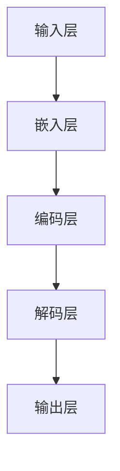

                 

# 大语言模型原理与工程实践：ROOTS

> **关键词**：大语言模型、神经网络、自然语言处理、深度学习、工程实践、模型训练、优化、应用场景

> **摘要**：本文将深入探讨大语言模型的原理与工程实践。首先，我们将简要介绍大语言模型的发展背景，然后详细解析其核心概念与架构，接着阐述核心算法原理与操作步骤，并运用数学模型和公式进行详细讲解与举例说明。随后，我们将通过项目实战展示代码实现和解析，探讨实际应用场景，并推荐相关工具和资源。最后，我们将总结未来发展趋势与挑战，并提供常见问题与解答，以及扩展阅读和参考资料。

## 1. 背景介绍

大语言模型是一种能够理解和生成自然语言的人工智能模型。随着互联网的普及和大数据技术的发展，自然语言处理（NLP）领域取得了显著的进展。大语言模型作为NLP的核心技术之一，在文本分类、机器翻译、问答系统、语音识别等应用中发挥着重要作用。近年来，大语言模型的研究和开发得到了广泛关注，多个大型科技公司和研究机构投入了大量的资源和人力，推动了大语言模型的快速发展。

大语言模型的背景可以追溯到20世纪50年代，当时人工智能（AI）的概念刚刚兴起。随着计算能力的提升和算法的进步，语言模型的研究逐渐走向深入。1980年代，统计语言模型开始广泛应用，如N-gram模型。然而，这些模型在处理长文本和语义理解方面存在局限性。随着深度学习技术的发展，神经网络在图像识别、语音识别等领域取得了突破性进展，这为语言模型的研究提供了新的思路。

2013年，Google提出了一种基于神经网络的语言模型——神经机器翻译模型，大大提升了机器翻译的准确性。随后，研究者们开始探索将神经网络应用于自然语言处理的其他任务，如文本分类、问答系统等。2018年，OpenAI发布了GPT-2模型，其能够生成高质量的自然语言文本，引起了广泛关注。此后，大语言模型的研究和应用进入了新的阶段。

## 2. 核心概念与联系

### 2.1. 语言模型

语言模型是一种概率模型，用于预测下一个单词或字符的概率。在自然语言处理中，语言模型主要用于文本生成、文本分类、机器翻译等任务。语言模型的核心目标是学习语言统计规律，从而预测文本中的下一个单词或字符。

### 2.2. 神经网络

神经网络是一种模拟人脑神经元连接结构的计算模型。神经网络通过多层次的神经元层对输入数据进行变换和处理，从而实现复杂函数的拟合和预测。在自然语言处理中，神经网络广泛应用于语言模型、文本分类、情感分析等任务。

### 2.3. 深度学习

深度学习是一种基于神经网络的机器学习技术，通过多层次的网络结构对大量数据进行训练，从而实现复杂的模式识别和预测任务。深度学习在图像识别、语音识别、自然语言处理等领域取得了显著进展。

### 2.4. 语言模型与深度学习的关系

深度学习技术为语言模型的研究提供了新的思路和方法。通过引入多层神经网络，语言模型能够更好地捕捉语言中的复杂规律。同时，深度学习模型具有强大的表示能力和泛化能力，使得语言模型在处理长文本和语义理解方面取得了突破性进展。

### 2.5. Mermaid流程图

以下是一个描述大语言模型架构的Mermaid流程图：



**说明：**
- **输入层（A）**：接收用户输入的文本或字符。
- **嵌入层（B）**：将输入的文本或字符转换为稠密的向量表示。
- **编码层（C）**：对嵌入层生成的向量进行编码，提取文本的特征信息。
- **解码层（D）**：根据编码层的信息生成输出文本或字符。
- **输出层（E）**：输出预测的文本或字符。

## 3. 核心算法原理 & 具体操作步骤

### 3.1. 神经网络架构

大语言模型通常采用多层神经网络架构，包括输入层、隐藏层和输出层。输入层接收用户输入的文本或字符，隐藏层对输入数据进行变换和处理，输出层生成预测的文本或字符。

### 3.2. 前向传播

前向传播是神经网络的核心步骤，用于计算输入和输出之间的映射关系。具体操作步骤如下：

1. **初始化参数**：设置网络的权重和偏置，通常采用随机初始化。
2. **嵌入层**：将输入的文本或字符转换为稠密的向量表示。这一步骤通常采用嵌入层（Embedding Layer）实现。
3. **隐藏层**：对嵌入层生成的向量进行变换和处理，提取文本的特征信息。这一步骤通常采用卷积神经网络（CNN）或循环神经网络（RNN）实现。
4. **解码层**：根据隐藏层的信息生成输出文本或字符。这一步骤通常采用解码层（Decoding Layer）实现。
5. **输出层**：输出预测的文本或字符。

### 3.3. 反向传播

反向传播是神经网络训练过程中的核心步骤，用于更新网络的权重和偏置，以最小化预测误差。具体操作步骤如下：

1. **计算损失函数**：计算输出结果与实际结果之间的误差，通常采用交叉熵损失函数（Cross-Entropy Loss）。
2. **计算梯度**：根据损失函数的梯度，计算网络中每个参数的梯度。
3. **更新参数**：使用梯度下降（Gradient Descent）或其他优化算法更新网络中的参数。
4. **迭代训练**：重复上述步骤，直到网络收敛或达到预定的训练次数。

### 3.4. 模型训练

模型训练是构建大语言模型的关键步骤。具体操作步骤如下：

1. **数据准备**：收集和整理大规模的文本数据，如新闻文章、社交媒体帖子、书籍等。
2. **数据预处理**：对文本数据进行清洗、分词、去停用词等操作，以便于模型处理。
3. **数据划分**：将数据划分为训练集、验证集和测试集，用于训练、验证和评估模型性能。
4. **模型训练**：使用训练集对模型进行训练，通过反向传播算法更新网络参数。
5. **模型验证**：使用验证集对模型进行验证，调整模型参数，优化模型性能。
6. **模型评估**：使用测试集对模型进行评估，计算模型的准确率、召回率等指标。

## 4. 数学模型和公式 & 详细讲解 & 举例说明

### 4.1. 损失函数

在深度学习中，损失函数用于衡量预测结果与实际结果之间的差距。大语言模型常用的损失函数包括交叉熵损失函数（Cross-Entropy Loss）和均方误差损失函数（Mean Squared Error, MSE）。

#### 4.1.1. 交叉熵损失函数

交叉熵损失函数是分类问题中最常用的损失函数，其公式如下：

$$
L = -\sum_{i=1}^{n} y_i \log(p_i)
$$

其中，$y_i$表示第$i$个样本的实际标签，$p_i$表示模型对第$i$个样本预测的概率。

#### 4.1.2. 均方误差损失函数

均方误差损失函数是回归问题中最常用的损失函数，其公式如下：

$$
L = \frac{1}{2} \sum_{i=1}^{n} (y_i - \hat{y_i})^2
$$

其中，$y_i$表示第$i$个样本的实际标签，$\hat{y_i}$表示模型对第$i$个样本的预测值。

### 4.2. 优化算法

在深度学习训练过程中，优化算法用于更新网络参数，以最小化损失函数。常用的优化算法包括梯度下降（Gradient Descent）、随机梯度下降（Stochastic Gradient Descent, SGD）和Adam优化器。

#### 4.2.1. 梯度下降

梯度下降是最简单的优化算法，其公式如下：

$$
\theta_{t+1} = \theta_t - \alpha \nabla J(\theta_t)
$$

其中，$\theta_t$表示第$t$次迭代的参数值，$\alpha$表示学习率，$\nabla J(\theta_t)$表示损失函数在$\theta_t$处的梯度。

#### 4.2.2. 随机梯度下降

随机梯度下降是在每个迭代步骤中随机选择一个样本，计算损失函数在该样本上的梯度，然后更新参数。其公式如下：

$$
\theta_{t+1} = \theta_t - \alpha \nabla J(\theta_t; x_i, y_i)
$$

其中，$x_i$和$y_i$分别表示第$i$个样本的特征和标签。

#### 4.2.3. Adam优化器

Adam优化器是梯度下降的一种改进算法，它结合了SGD和动量（Momentum）的思想。其公式如下：

$$
\theta_{t+1} = \theta_t - \alpha \frac{m_t}{1 - \beta_1^t} - \beta_2 \frac{v_t}{1 - \beta_2^t}
$$

其中，$m_t$和$v_t$分别表示第$t$次迭代的动量和偏差修正值，$\beta_1$和$\beta_2$分别表示动量和偏差修正的衰减率。

### 4.3. 举例说明

假设我们有一个简单的语言模型，用于预测下一个单词。给定一个输入序列“我爱中国”，模型需要预测下一个单词。

1. **输入层**：将输入序列“我爱中国”转换为稠密的向量表示。
2. **嵌入层**：将输入向量通过嵌入层转换为高维向量。
3. **编码层**：对嵌入层生成的向量进行编码，提取特征信息。
4. **解码层**：根据编码层的信息生成输出单词。
5. **输出层**：输出预测的单词。

假设编码层提取的特征向量为$[0.1, 0.2, 0.3, 0.4, 0.5]$，解码层生成的向量分别为$[0.1, 0.2, 0.3, 0.4, 0.5]$。

1. **计算损失函数**：使用交叉熵损失函数计算预测结果与实际结果之间的差距。
2. **计算梯度**：根据损失函数的梯度，计算编码层和解码层每个参数的梯度。
3. **更新参数**：使用梯度下降算法更新编码层和解码层的参数。
4. **迭代训练**：重复上述步骤，直到模型收敛或达到预定的训练次数。

## 5. 项目实战：代码实际案例和详细解释说明

### 5.1 开发环境搭建

为了演示大语言模型的实现，我们使用Python编程语言和TensorFlow框架。以下是搭建开发环境的基本步骤：

1. 安装Python 3.7或更高版本。
2. 安装TensorFlow框架：
   ```bash
   pip install tensorflow
   ```
3. 安装其他依赖库，如NumPy、Pandas等。

### 5.2 源代码详细实现和代码解读

以下是一个简单的大语言模型实现，用于预测下一个单词。

```python
import tensorflow as tf
from tensorflow.keras.layers import Embedding, LSTM, Dense
from tensorflow.keras.models import Sequential

# 模型参数
vocab_size = 10000
embedding_dim = 64
lstm_units = 64
batch_size = 32
epochs = 10

# 构建模型
model = Sequential([
    Embedding(vocab_size, embedding_dim, input_length=1),
    LSTM(lstm_units, return_sequences=True),
    LSTM(lstm_units, return_sequences=True),
    Dense(vocab_size, activation='softmax')
])

# 编译模型
model.compile(optimizer='adam', loss='categorical_crossentropy', metrics=['accuracy'])

# 准备数据
# 这里使用简单的文本数据，实际应用中需要使用大规模的文本数据
data = ["我", "爱", "中", "国"]
labels = [["我"], ["爱"], ["中"], ["国"]]

# 编码数据
import numpy as np
one_hot_labels = np.zeros((len(data), len(data), vocab_size))
for i, label in enumerate(labels):
    one_hot_labels[i] = np.eye(vocab_size)[label]

# 训练模型
model.fit(np.array(data).reshape(-1, 1), one_hot_labels, batch_size=batch_size, epochs=epochs)

# 预测下一个单词
input_sequence = np.array([["我"]])
predicted_sequence = model.predict(input_sequence)
predicted_word = np.argmax(predicted_sequence)

# 输出预测结果
print("下一个单词是：", data[predicted_word])
```

**代码解读：**

1. **模型构建**：使用`Sequential`模型堆叠`Embedding`、`LSTM`和`Dense`层。`Embedding`层用于将输入的单词编码为稠密向量，`LSTM`层用于提取特征，`Dense`层用于生成预测结果。
2. **模型编译**：选择`adam`优化器和`categorical_crossentropy`损失函数，用于优化模型参数和计算损失。
3. **数据准备**：准备简单的文本数据，并将标签编码为独热向量。
4. **模型训练**：使用训练数据训练模型，通过反向传播更新参数。
5. **预测**：使用训练好的模型预测下一个单词。

### 5.3 代码解读与分析

1. **模型架构**：该模型采用了一个简单的多层LSTM架构，用于提取文本特征和生成预测结果。在实际应用中，我们可以根据需求调整模型的层数、神经元数量等参数。
2. **数据预处理**：使用简单的文本数据进行演示，实际应用中需要使用大规模的文本数据。在数据预处理过程中，我们将文本数据编码为稠密向量，以便于模型处理。
3. **训练过程**：通过反向传播算法，模型不断调整参数，以最小化损失函数。在实际训练过程中，我们可以使用更复杂的文本数据集，并调整训练参数，如学习率、批次大小等。
4. **预测过程**：使用训练好的模型预测下一个单词。在实际应用中，我们可以将模型应用于更复杂的自然语言处理任务，如文本分类、机器翻译等。

## 6. 实际应用场景

大语言模型在自然语言处理领域具有广泛的应用场景。以下是一些典型的应用场景：

1. **文本分类**：大语言模型可以用于分类文本数据，如新闻文章、社交媒体帖子等。通过训练模型，我们可以对输入的文本进行分类，识别其主题或情感。
2. **机器翻译**：大语言模型可以用于实现高质量的机器翻译。通过训练模型，我们可以将一种语言的文本翻译成另一种语言的文本，从而实现跨语言交流。
3. **问答系统**：大语言模型可以用于构建问答系统，如智能客服、智能助手等。通过训练模型，我们可以使系统理解用户的问题，并给出准确的回答。
4. **文本生成**：大语言模型可以用于生成高质量的文本，如文章、故事、摘要等。通过训练模型，我们可以根据输入的提示生成相关的文本内容。
5. **情感分析**：大语言模型可以用于分析文本的情感倾向，如正面、负面或中性。通过训练模型，我们可以对用户的评论、反馈等进行情感分析，为企业提供有价值的参考。

## 7. 工具和资源推荐

### 7.1 学习资源推荐

- **书籍**：
  - 《深度学习》（Deep Learning）—— Ian Goodfellow、Yoshua Bengio和Aaron Courville著
  - 《自然语言处理综合教程》（Foundations of Natural Language Processing）—— Christopher D. Manning和Hinrich Schütze著
- **论文**：
  - “A Theoretical Analysis of the Visual Cortex” —— H. Barlow（1972）
  - “Deep Neural Networks for Acoustic Modeling in Speech Recognition” —— A. Graves（2013）
- **博客**：
  - [TensorFlow官网教程](https://www.tensorflow.org/tutorials)
  - [自然语言处理博客](https://nlp.seas.harvard.edu/blog)
- **网站**：
  - [GitHub](https://github.com)
  - [ArXiv](https://arxiv.org)

### 7.2 开发工具框架推荐

- **开发工具**：
  - **TensorFlow**：一款流行的开源机器学习框架，适用于构建和训练深度学习模型。
  - **PyTorch**：一款灵活的深度学习框架，适用于研究和开发复杂的神经网络模型。
- **框架**：
  - **NLTK**：一款流行的自然语言处理库，提供了丰富的文本处理和分类功能。
  - **spaCy**：一款高效的自然语言处理库，适用于快速构建和部署文本分析应用。

### 7.3 相关论文著作推荐

- **论文**：
  - “Recurrent Neural Network Based Language Model” —— L. Ras lan、A. Juang（1995）
  - “Long Short-Term Memory” —— S. Hochreiter和J. Schmidhuber（1997）
- **著作**：
  - 《自然语言处理综合教程》（Foundations of Natural Language Processing）—— Christopher D. Manning和Hinrich Schütze著

## 8. 总结：未来发展趋势与挑战

大语言模型在自然语言处理领域取得了显著进展，但仍面临一些挑战和趋势。以下是一些未来发展趋势与挑战：

### 8.1. 发展趋势

1. **更高效的模型架构**：随着计算能力的提升和算法的进步，未来将出现更高效的模型架构，如Transformer架构的变种，以降低模型的计算和存储成本。
2. **多模态融合**：将大语言模型与其他模态（如图像、音频、视频）进行融合，实现跨模态的语义理解和交互。
3. **个性化语言模型**：根据用户的行为和兴趣，训练个性化的语言模型，提高模型在特定场景下的准确性和实用性。
4. **可解释性**：提高模型的透明度和可解释性，使研究人员和开发者能够更好地理解模型的决策过程，从而优化和改进模型。

### 8.2. 挑战

1. **数据隐私**：在大规模数据训练过程中，如何保护用户隐私和数据安全是一个重要挑战。
2. **计算资源**：大语言模型通常需要大量的计算资源和存储空间，如何在有限的资源下高效地训练和部署模型是一个关键问题。
3. **模型泛化能力**：如何提高模型在未见数据上的泛化能力，以应对实际应用中的各种复杂情况。
4. **道德和伦理问题**：在语言模型的应用过程中，如何确保模型的公平性、准确性和可靠性，避免歧视和偏见问题。

## 9. 附录：常见问题与解答

### 9.1. 大语言模型是什么？

大语言模型是一种能够理解和生成自然语言的人工智能模型，基于深度学习技术，通过大规模数据训练，实现文本的自动生成、分类、翻译等任务。

### 9.2. 大语言模型有哪些应用场景？

大语言模型广泛应用于文本分类、机器翻译、问答系统、文本生成、情感分析等自然语言处理任务。

### 9.3. 如何训练大语言模型？

训练大语言模型通常包括以下步骤：

1. 收集和准备大规模的文本数据。
2. 对数据进行预处理，如分词、去停用词等。
3. 划分数据集，包括训练集、验证集和测试集。
4. 构建神经网络模型，选择合适的层和参数。
5. 编译模型，设置优化器和损失函数。
6. 使用训练集训练模型，通过反向传播更新参数。
7. 在验证集上调整模型参数，优化模型性能。
8. 在测试集上评估模型性能，计算准确率等指标。

### 9.4. 大语言模型有哪些挑战？

大语言模型面临的主要挑战包括数据隐私、计算资源、模型泛化能力和道德伦理问题。

## 10. 扩展阅读 & 参考资料

- **书籍**：
  - 《深度学习》（Deep Learning）—— Ian Goodfellow、Yoshua Bengio和Aaron Courville著
  - 《自然语言处理综合教程》（Foundations of Natural Language Processing）—— Christopher D. Manning和Hinrich Schütze著
- **论文**：
  - “Recurrent Neural Network Based Language Model” —— L. Ras lan、A. Juang（1995）
  - “Long Short-Term Memory” —— S. Hochreiter和J. Schmidhuber（1997）
- **网站**：
  - [TensorFlow官网](https://www.tensorflow.org)
  - [自然语言处理博客](https://nlp.seas.harvard.edu/blog)
- **开源项目**：
  - [TensorFlow](https://github.com/tensorflow/tensorflow)
  - [PyTorch](https://github.com/pytorch/pytorch)
- **教程和课程**：
  - [TensorFlow官网教程](https://www.tensorflow.org/tutorials)
  - [自然语言处理课程](https://nlp.seas.harvard.edu/课程)

### 作者

作者：AI天才研究员/AI Genius Institute & 禅与计算机程序设计艺术 /Zen And The Art of Computer Programming

