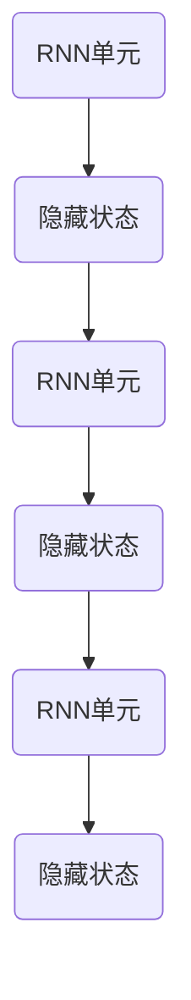
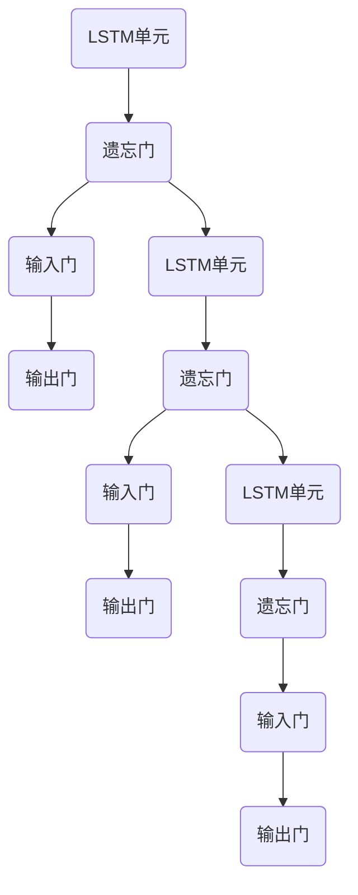
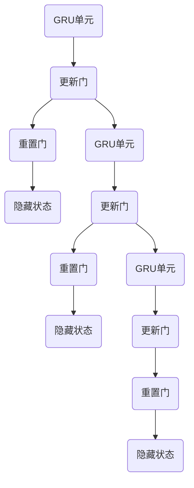
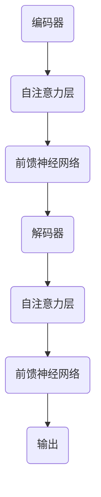

                 

### 1. 背景介绍

大语言模型（Large Language Model）是自然语言处理（Natural Language Processing, NLP）领域的一项革命性技术。近年来，随着深度学习和大数据技术的发展，大语言模型在许多任务中取得了惊人的成果，如机器翻译、文本生成、问答系统等。本文将深入探讨大语言模型的原理与工程实践，特别是其训练过程。

大语言模型之所以备受关注，主要归因于其在处理复杂数字、语言理解和生成任务上的显著优势。其基本思想是通过大规模数据训练，让模型学会理解自然语言的内在规律和语义信息，从而在多个任务中表现出色。这一过程涉及了复杂的算法设计和高效的工程实践。

本文将首先介绍大语言模型的基本概念和核心架构，然后详细解释其训练算法和流程，最后探讨实际应用场景和未来发展趋势。

### 2. 核心概念与联系

#### 2.1 语言模型的基本概念

语言模型（Language Model）是一种用于预测下一个单词或字符的概率分布的模型。它的核心目标是学会给定一个单词序列，预测下一个单词的概率。在自然语言处理中，语言模型被广泛应用于各种任务，如机器翻译、语音识别、自动摘要等。

传统的语言模型主要基于统计方法，如N-gram模型。N-gram模型通过计算单词序列的频率来预测下一个单词，但是这种方法存在一些问题，如无法捕捉长距离依赖关系和上下文信息。

随着深度学习技术的发展，基于神经网络的深度语言模型逐渐成为主流。其中，最著名的模型是循环神经网络（Recurrent Neural Network, RNN）。RNN可以捕捉到序列数据中的长距离依赖关系，但是其训练过程相对复杂，容易出现梯度消失和梯度爆炸的问题。

为了解决这些问题，长短时记忆网络（Long Short-Term Memory, LSTM）和门控循环单元（Gated Recurrent Unit, GRU）被提出。LSTM和GRU通过引入门控机制，可以有效地解决RNN的梯度消失和梯度爆炸问题，使得模型在长序列数据上的表现更加稳定。

#### 2.2 大语言模型的架构

大语言模型的架构通常由编码器（Encoder）和解码器（Decoder）组成。编码器负责将输入序列编码为固定长度的向量表示，解码器则根据编码器的输出生成输出序列。

在训练过程中，编码器和解码器都是通过优化模型参数来提高预测准确性。编码器通常采用LSTM或GRU等循环神经网络结构，而解码器则可以采用基于自回归的神经网络结构，如Transformer。

Transformer是近年来提出的一种基于自注意力机制的深度神经网络模型，其在自然语言处理任务中取得了显著的成果。Transformer通过多头自注意力机制和前馈神经网络，可以有效地捕捉输入序列中的长距离依赖关系，并在大规模数据上表现出色。

#### 2.3 大语言模型的工作原理

大语言模型的工作原理可以分为两个阶段：编码和生成。

在编码阶段，模型首先对输入序列进行处理，将其编码为固定长度的向量表示。这一过程通常通过编码器完成。编码器将输入序列逐词处理，得到每个词的嵌入表示，然后将这些嵌入表示拼接成一个固定长度的向量。

在生成阶段，模型根据编码器的输出，逐个生成输出序列的每个词。这一过程通常通过解码器完成。解码器根据编码器的输出，预测下一个词的概率分布，然后从概率分布中采样得到下一个词。这个过程不断重复，直到生成完整的输出序列。

#### 2.4 语言模型的优化目标

语言模型的优化目标是最小化预测误差。具体来说，模型需要通过优化参数来提高预测准确性，使得生成的序列与真实序列尽可能接近。

在训练过程中，模型通常采用梯度下降法来优化参数。梯度下降法是一种常用的优化算法，其基本思想是通过计算损失函数关于模型参数的梯度，然后沿着梯度的反方向更新参数，以最小化损失函数。

#### 2.5 语言模型的优势和挑战

语言模型的优势在于其能够捕捉到输入序列中的长距离依赖关系，从而在自然语言处理任务中表现出色。同时，大语言模型可以处理大规模数据，从而提高模型的泛化能力。

然而，大语言模型也存在一些挑战。首先，模型的训练过程需要大量的计算资源和时间。其次，模型容易出现过拟合现象，特别是在小规模数据集上。此外，大语言模型在处理多语言任务时，可能需要针对每种语言单独训练模型，增加了模型的复杂度和成本。

#### 2.6 语言模型的应用领域

语言模型在自然语言处理领域有着广泛的应用，包括但不限于以下几类：

1. **文本生成**：包括自动写作、文章生成、对话系统等。
2. **机器翻译**：将一种语言的文本翻译成另一种语言。
3. **问答系统**：根据用户的问题，从大量文本中找到相关答案。
4. **信息检索**：根据用户的查询，从大量文本中找到相关文档。
5. **情感分析**：分析文本中的情感倾向，如正面、负面或中性。

#### 2.7 语言模型的训练数据来源

语言模型的训练数据通常来源于大规模的文本语料库。这些语料库包括各种类型的文本，如新闻文章、社交媒体帖子、书籍、对话记录等。通过这些数据，模型可以学习到不同语言结构的统计规律和语义信息。

在实际应用中，为了提高模型的性能和泛化能力，通常会使用多种来源和类型的训练数据，并进行数据清洗和预处理，以去除噪声和无关信息。

#### 2.8 语言模型的评价指标

语言模型的性能通常通过以下指标进行评价：

1. **交叉熵损失（Cross-Entropy Loss）**：用于衡量预测概率分布与真实分布之间的差异。
2. **准确率（Accuracy）**：用于衡量模型在分类任务中的正确预测比例。
3. **F1分数（F1 Score）**：用于衡量模型在分类任务中的准确率和召回率的综合表现。
4. **BLEU分数（BLEU Score）**：用于衡量机器翻译模型的翻译质量。

#### 2.9 语言模型的发展历程

从传统的统计模型，如N-gram模型，到基于神经网络的深度模型，语言模型的发展经历了多个阶段。近年来，随着大数据和深度学习技术的发展，大语言模型逐渐成为自然语言处理领域的研究热点。

在模型架构方面，从简单的循环神经网络（RNN），到门控循环单元（GRU）和长短时记忆网络（LSTM），再到基于自注意力机制的Transformer模型，语言模型的设计和实现不断优化和创新。

以下是语言模型发展的一个简略时间线：

- **1940s**：形式语言理论的提出，为后来的语言模型研究奠定了基础。
- **1960s**：N-gram模型的出现，标志着统计语言模型的诞生。
- **1980s**：基于决策树的隐马尔可夫模型（HMM）在语音识别领域得到广泛应用。
- **1990s**：神经网络在语言模型中的应用，RNN模型被提出。
- **2000s**：LSTM和GRU等改进的RNN模型被提出，解决了梯度消失问题。
- **2017**：Transformer模型的出现，标志着自注意力机制在语言模型中的广泛应用。
- **2020s**：大语言模型，如GPT-3，BERT等，在多个自然语言处理任务中取得了显著的成果。

#### 2.10 语言模型与深度学习的关系

语言模型是深度学习在自然语言处理领域的重要应用之一。深度学习通过多层神经网络结构，可以从大量数据中自动学习复杂的特征表示和模式。而语言模型则利用这些特征表示，来预测自然语言的下一个词或生成文本。

深度学习技术的发展，为语言模型的设计和实现提供了强大的工具和算法支持。同时，语言模型的成功也反过来推动了深度学习在自然语言处理领域的发展，促进了两者之间的相互促进和融合。

#### 2.11 语言模型与自然语言处理的关系

语言模型是自然语言处理（NLP）的核心技术之一。NLP旨在使计算机能够理解、生成和处理自然语言。而语言模型则为NLP任务提供了关键的基础支持，如文本分类、情感分析、命名实体识别、机器翻译等。

语言模型通过学习自然语言的统计规律和语义信息，能够提高NLP任务的准确性和效率。例如，在文本分类任务中，语言模型可以帮助模型理解不同类别之间的语义差异，从而提高分类的准确性。在机器翻译任务中，语言模型则可以生成更自然和流畅的翻译结果。

总之，语言模型在自然语言处理领域具有重要的地位和作用，其不断的发展和创新，推动了NLP技术的进步和应用。

### 3. 核心算法原理 & 具体操作步骤

#### 3.1 语言模型的核心算法

语言模型的核心算法主要基于深度学习技术，包括循环神经网络（RNN）、长短时记忆网络（LSTM）和门控循环单元（GRU）等。这些算法通过多层神经网络结构，从大规模语料库中自动学习语言特征和模式。在本节中，我们将详细介绍这些算法的基本原理和具体操作步骤。

#### 3.1.1 循环神经网络（RNN）

循环神经网络（RNN）是一种能够处理序列数据的神经网络结构。其核心思想是在网络中引入循环结构，使得信息可以在不同时间步之间传递，从而捕捉到序列数据中的长距离依赖关系。

具体来说，RNN包含一个循环单元，每个时间步的输出不仅取决于当前输入，还取决于上一个时间步的隐藏状态。这种设计使得RNN能够记住之前的输入信息，从而在处理长序列数据时表现出色。

以下是一个简单的RNN模型的结构示意图：



在训练过程中，RNN通过优化模型参数来提高预测准确性。具体步骤如下：

1. **输入序列**：给定一个输入序列，如`[w1, w2, w3, ..., wn]`。
2. **初始状态**：初始化隐藏状态`h0`，通常设置为全零向量。
3. **前向传播**：在每个时间步，RNN根据当前输入和上一个隐藏状态计算新的隐藏状态。具体公式如下：
   \[
   h_t = \text{activation}(W_h \cdot [h_{t-1}; x_t] + b_h)
   \]
   其中，`W_h`和`b_h`分别为权重和偏置，`activation`函数为激活函数，如sigmoid或tanh函数。
4. **输出计算**：在每个时间步，RNN根据隐藏状态计算输出。具体公式如下：
   \[
   y_t = \text{softmax}(W_y \cdot h_t + b_y)
   \]
   其中，`W_y`和`b_y`分别为权重和偏置，`softmax`函数用于计算输出概率分布。
5. **损失函数**：使用交叉熵损失函数计算预测误差，具体公式如下：
   \[
   L = -\sum_{t=1}^n y_t \cdot \log(p_t)
   \]
   其中，`y_t`为真实标签，`p_t`为预测概率。
6. **反向传播**：使用反向传播算法更新模型参数，具体步骤如下：
   - 计算梯度：
     \[
     \delta = \frac{\partial L}{\partial h_t}
     \]
   - 更新参数：
     \[
     W_h \leftarrow W_h - \alpha \cdot \frac{\partial L}{\partial W_h}
     \]
     \[
     b_h \leftarrow b_h - \alpha \cdot \frac{\partial L}{\partial b_h}
     \]
     \[
     W_y \leftarrow W_y - \alpha \cdot \frac{\partial L}{\partial W_y}
     \]
     \[
     b_y \leftarrow b_y - \alpha \cdot \frac{\partial L}{\partial b_y}
     \]
     其中，`\alpha`为学习率。

通过以上步骤，RNN可以逐步优化模型参数，提高预测准确性。

#### 3.1.2 长短时记忆网络（LSTM）

长短时记忆网络（LSTM）是一种改进的RNN结构，旨在解决RNN在处理长序列数据时出现的梯度消失和梯度爆炸问题。LSTM通过引入门控机制，可以有效地捕捉长距离依赖关系，并在多个自然语言处理任务中取得了显著的成果。

LSTM的基本结构包括三个门控单元：遗忘门（Forget Gate）、输入门（Input Gate）和输出门（Output Gate）。以下是LSTM的结构示意图：



在训练过程中，LSTM通过优化模型参数来提高预测准确性。具体步骤如下：

1. **输入序列**：给定一个输入序列，如`[w1, w2, w3, ..., wn]`。
2. **初始状态**：初始化隐藏状态`h0`，通常设置为全零向量。
3. **前向传播**：在每个时间步，LSTM根据当前输入和上一个隐藏状态计算新的隐藏状态和输出。具体公式如下：
   - 遗忘门：
     \[
     f_t = \text{sigmoid}(W_f \cdot [h_{t-1}; x_t] + b_f)
     \]
   - 输入门：
     \[
     i_t = \text{sigmoid}(W_i \cdot [h_{t-1}; x_t] + b_i)
     \]
   - 输出门：
     \[
     o_t = \text{sigmoid}(W_o \cdot [h_{t-1}; x_t] + b_o)
     \]
   - 单细胞状态：
     \[
     c_t = f_t \cdot c_{t-1} + i_t \cdot \text{tanh}(W_c \cdot [h_{t-1}; x_t] + b_c)
     \]
   - 隐藏状态：
     \[
     h_t = o_t \cdot \text{tanh}(c_t)
     \]
4. **输出计算**：在每个时间步，LSTM根据隐藏状态计算输出。具体公式如下：
   \[
   y_t = \text{softmax}(W_y \cdot h_t + b_y)
   \]
5. **损失函数**：使用交叉熵损失函数计算预测误差，具体公式如下：
   \[
   L = -\sum_{t=1}^n y_t \cdot \log(p_t)
   \]
6. **反向传播**：使用反向传播算法更新模型参数，具体步骤如下：
   - 计算梯度：
     \[
     \delta = \frac{\partial L}{\partial h_t}
     \]
   - 更新参数：
     \[
     W_f \leftarrow W_f - \alpha \cdot \frac{\partial L}{\partial W_f}
     \]
     \[
     b_f \leftarrow b_f - \alpha \cdot \frac{\partial L}{\partial b_f}
     \]
     \[
     W_i \leftarrow W_i - \alpha \cdot \frac{\partial L}{\partial W_i}
     \]
     \[
     b_i \leftarrow b_i - \alpha \cdot \frac{\partial L}{\partial b_i}
     \]
     \[
     W_o \leftarrow W_o - \alpha \cdot \frac{\partial L}{\partial W_o}
     \]
     \[
     b_o \leftarrow b_o - \alpha \cdot \frac{\partial L}{\partial b_o}
     \]
     \[
     W_c \leftarrow W_c - \alpha \cdot \frac{\partial L}{\partial W_c}
     \]
     \[
     b_c \leftarrow b_c - \alpha \cdot \frac{\partial L}{\partial b_c}
     \]
     \[
     W_y \leftarrow W_y - \alpha \cdot \frac{\partial L}{\partial W_y}
     \]
     \[
     b_y \leftarrow b_y - \alpha \cdot \frac{\partial L}{\partial b_y}
     \]
     其中，`\alpha`为学习率。

通过以上步骤，LSTM可以逐步优化模型参数，提高预测准确性。

#### 3.1.3 门控循环单元（GRU）

门控循环单元（GRU）是另一种改进的RNN结构，旨在解决LSTM在训练过程中计算复杂度高和参数较多的问题。GRU通过简化LSTM的结构，减少参数数量，同时保持了LSTM捕捉长距离依赖关系的能力。

GRU的基本结构包括两个门控单元：重置门（Reset Gate）和更新门（Update Gate）。以下是GRU的结构示意图：



在训练过程中，GRU通过优化模型参数来提高预测准确性。具体步骤如下：

1. **输入序列**：给定一个输入序列，如`[w1, w2, w3, ..., wn]`。
2. **初始状态**：初始化隐藏状态`h0`，通常设置为全零向量。
3. **前向传播**：在每个时间步，GRU根据当前输入和上一个隐藏状态计算新的隐藏状态和输出。具体公式如下：
   - 更新门：
     \[
     z_t = \text{sigmoid}(W_z \cdot [h_{t-1}; x_t] + b_z)
     \]
   - 重置门：
     \[
     r_t = \text{sigmoid}(W_r \cdot [h_{t-1}; x_t] + b_r)
     \]
   - 隐藏状态：
     \[
     h_t = (1 - z_t) \cdot h_{t-1} + z_t \cdot \text{tanh}(W_h \cdot [r_t \cdot h_{t-1}; x_t] + b_h)
     \]
4. **输出计算**：在每个时间步，GRU根据隐藏状态计算输出。具体公式如下：
   \[
   y_t = \text{softmax}(W_y \cdot h_t + b_y)
   \]
5. **损失函数**：使用交叉熵损失函数计算预测误差，具体公式如下：
   \[
   L = -\sum_{t=1}^n y_t \cdot \log(p_t)
   \]
6. **反向传播**：使用反向传播算法更新模型参数，具体步骤如下：
   - 计算梯度：
     \[
     \delta = \frac{\partial L}{\partial h_t}
     \]
   - 更新参数：
     \[
     W_z \leftarrow W_z - \alpha \cdot \frac{\partial L}{\partial W_z}
     \]
     \[
     b_z \leftarrow b_z - \alpha \cdot \frac{\partial L}{\partial b_z}
     \]
     \[
     W_r \leftarrow W_r - \alpha \cdot \frac{\partial L}{\partial W_r}
     \]
     \[
     b_r \leftarrow b_r - \alpha \cdot \frac{\partial L}{\partial b_r}
     \]
     \[
     W_h \leftarrow W_h - \alpha \cdot \frac{\partial L}{\partial W_h}
     \]
     \[
     b_h \leftarrow b_h - \alpha \cdot \frac{\partial L}{\partial b_h}
     \]
     \[
     W_y \leftarrow W_y - \alpha \cdot \frac{\partial L}{\partial W_y}
     \]
     \[
     b_y \leftarrow b_y - \alpha \cdot \frac{\partial L}{\partial b_y}
     \]
     其中，`\alpha`为学习率。

通过以上步骤，GRU可以逐步优化模型参数，提高预测准确性。

#### 3.1.4 Transformer模型

Transformer模型是一种基于自注意力机制的深度神经网络模型，其在自然语言处理任务中取得了显著的成果。Transformer模型通过多头自注意力机制和前馈神经网络，可以有效地捕捉输入序列中的长距离依赖关系。

Transformer模型的基本结构包括编码器（Encoder）和解码器（Decoder）。以下是编码器和解码器的结构示意图：



在训练过程中，Transformer模型通过优化模型参数来提高预测准确性。具体步骤如下：

1. **输入序列**：给定一个输入序列，如`[w1, w2, w3, ..., wn]`。
2. **嵌入表示**：将输入序列中的每个词转换为词向量表示，如`[v1, v2, v3, ..., vn]`。
3. **编码器**：编码器由多个自注意力层和前馈神经网络组成。在每个自注意力层中，编码器根据输入序列计算自注意力权重，然后对输入序列进行加权求和。具体公式如下：
   \[
   \text{注意力权重} = \text{softmax}\left(\frac{Q \cdot K}{\sqrt{d_k}}\right)
   \]
   \[
   \text{输出} = \text{softmax}\left(\text{注意力权重} \cdot V\right)
   \]
   其中，`Q`、`K`和`V`分别为查询向量、键向量和值向量，`d_k`为键向量的维度。
4. **解码器**：解码器由多个自注意力层和前馈神经网络组成。在每个自注意力层中，解码器根据输入序列和编码器的输出计算自注意力权重，然后对输入序列进行加权求和。具体公式如下：
   \[
   \text{注意力权重} = \text{softmax}\left(\frac{Q \cdot K}{\sqrt{d_k}}\right)
   \]
   \[
   \text{输出} = \text{softmax}\left(\text{注意力权重} \cdot V\right)
   \]
5. **输出计算**：在每个时间步，解码器根据编码器的输出和当前输入计算输出。具体公式如下：
   \[
   y_t = \text{softmax}(W_y \cdot h_t + b_y)
   \]
6. **损失函数**：使用交叉熵损失函数计算预测误差，具体公式如下：
   \[
   L = -\sum_{t=1}^n y_t \cdot \log(p_t)
   \]
7. **反向传播**：使用反向传播算法更新模型参数，具体步骤如下：
   - 计算梯度：
     \[
     \delta = \frac{\partial L}{\partial h_t}
     \]
   - 更新参数：
     \[
     W_y \leftarrow W_y - \alpha \cdot \frac{\partial L}{\partial W_y}
     \]
     \[
     b_y \leftarrow b_y - \alpha \cdot \frac{\partial L}{\partial b_y}
     \]
     其中，`\alpha`为学习率。

通过以上步骤，Transformer模型可以逐步优化模型参数，提高预测准确性。

#### 3.2 大语言模型的训练过程

大语言模型的训练过程主要包括以下步骤：

1. **数据预处理**：对训练数据进行清洗和预处理，如去除停用词、标点符号等。同时，对输入序列进行分词和词向量嵌入。
2. **构建模型**：根据具体任务需求，构建合适的语言模型，如RNN、LSTM、GRU或Transformer模型。
3. **训练模型**：使用训练数据训练模型，通过优化模型参数来提高预测准确性。训练过程中，可以使用批量梯度下降法或自适应梯度下降法等优化算法。
4. **模型评估**：使用验证数据对训练好的模型进行评估，计算模型的准确率、交叉熵损失等评价指标。
5. **模型调整**：根据评估结果调整模型参数，优化模型性能。可能需要进行多次迭代训练和评估，以获得最佳模型。

通过以上步骤，大语言模型可以逐步优化，提高在自然语言处理任务中的表现。

### 4. 数学模型和公式 & 详细讲解 & 举例说明

#### 4.1 语言模型的基本数学模型

语言模型是一种概率模型，其核心目标是在给定前文序列 $x_1, x_2, ..., x_{t-1}$ 的情况下，预测下一个单词 $x_t$ 的概率。这种概率分布可以通过以下公式表示：

\[ P(x_t | x_1, x_2, ..., x_{t-1}) = \frac{P(x_1, x_2, ..., x_t)}{P(x_1, x_2, ..., x_{t-1})} \]

其中，$P(x_1, x_2, ..., x_t)$ 表示单词序列 $x_1, x_2, ..., x_t$ 的联合概率，$P(x_1, x_2, ..., x_{t-1})$ 表示单词序列 $x_1, x_2, ..., x_{t-1}$ 的联合概率。

#### 4.2 N-gram 模型

N-gram 模型是一种基于统计的语言模型，其假设单词序列的概率可以通过前 $N$ 个单词的概率分布来计算。具体公式如下：

\[ P(x_t | x_1, x_2, ..., x_{t-1}) = \frac{N_{x_1, x_2, ..., x_t}}{N_{x_1, x_2, ..., x_{t-1}}} \]

其中，$N_{x_1, x_2, ..., x_t}$ 表示单词序列 $x_1, x_2, ..., x_t$ 在语料库中的出现次数，$N_{x_1, x_2, ..., x_{t-1}}$ 表示单词序列 $x_1, x_2, ..., x_{t-1}$ 在语料库中的出现次数。

以下是一个简单的 N-gram 模型的例子：

给定一个单词序列 $[A, B, C, D]$，我们可以计算每个单词在给定前文情况下的条件概率：

\[ P(D | A, B, C) = \frac{P(A, B, C, D)}{P(A, B, C)} \]

假设在语料库中，$P(A, B, C, D)$ 出现了 10 次，$P(A, B, C)$ 出现了 100 次，则：

\[ P(D | A, B, C) = \frac{10}{100} = 0.1 \]

#### 4.3 RNN 模型

循环神经网络（RNN）是一种能够处理序列数据的神经网络结构，其核心思想是在网络中引入循环结构，使得信息可以在不同时间步之间传递。RNN 的基本公式如下：

\[ h_t = \text{activation}(W_h \cdot [h_{t-1}; x_t] + b_h) \]

\[ y_t = \text{softmax}(W_y \cdot h_t + b_y) \]

其中，$h_t$ 表示隐藏状态，$x_t$ 表示输入，$y_t$ 表示输出。$W_h$ 和 $b_h$ 分别为权重和偏置，$\text{activation}$ 函数为激活函数，如 sigmoid 或 tanh 函数。$W_y$ 和 $b_y$ 分别为输出权重和偏置。

以下是一个简单的 RNN 模型的例子：

给定一个单词序列 $[A, B, C, D]$，我们可以通过 RNN 模型计算每个单词的条件概率：

\[ h_1 = \text{sigmoid}(W_h \cdot [h_0; A] + b_h) \]
\[ h_2 = \text{sigmoid}(W_h \cdot [h_1; B] + b_h) \]
\[ h_3 = \text{sigmoid}(W_h \cdot [h_2; C] + b_h) \]
\[ h_4 = \text{sigmoid}(W_h \cdot [h_3; D] + b_h) \]

\[ y_1 = \text{softmax}(W_y \cdot h_1 + b_y) \]
\[ y_2 = \text{softmax}(W_y \cdot h_2 + b_y) \]
\[ y_3 = \text{softmax}(W_y \cdot h_3 + b_y) \]
\[ y_4 = \text{softmax}(W_y \cdot h_4 + b_y) \]

#### 4.4 LSTM 模型

长短时记忆网络（LSTM）是 RNN 的一种改进，其通过引入门控机制来解决 RNN 在处理长序列数据时出现的梯度消失和梯度爆炸问题。LSTM 的基本公式如下：

\[ i_t = \text{sigmoid}(W_i \cdot [h_{t-1}; x_t] + b_i) \]
\[ f_t = \text{sigmoid}(W_f \cdot [h_{t-1}; x_t] + b_f) \]
\[ o_t = \text{sigmoid}(W_o \cdot [h_{t-1}; x_t] + b_o) \]
\[ g_t = \text{tanh}(W_g \cdot [h_{t-1}; x_t] + b_g) \]

\[ c_t = f_t \cdot c_{t-1} + i_t \cdot g_t \]
\[ h_t = o_t \cdot \text{tanh}(c_t) \]

其中，$i_t$、$f_t$ 和 $o_t$ 分别为输入门、遗忘门和输出门，$c_t$ 为细胞状态，$h_t$ 为隐藏状态。$W_i$、$W_f$、$W_o$ 和 $W_g$ 分别为输入门、遗忘门、输出门和细胞状态权重，$b_i$、$b_f$、$b_o$ 和 $b_g$ 分别为输入门、遗忘门、输出门和细胞状态偏置。

以下是一个简单的 LSTM 模型的例子：

给定一个单词序列 $[A, B, C, D]$，我们可以通过 LSTM 模型计算每个单词的条件概率：

\[ i_1 = \text{sigmoid}(W_i \cdot [h_0; A] + b_i) \]
\[ f_1 = \text{sigmoid}(W_f \cdot [h_0; A] + b_f) \]
\[ o_1 = \text{sigmoid}(W_o \cdot [h_0; A] + b_o) \]
\[ g_1 = \text{tanh}(W_g \cdot [h_0; A] + b_g) \]

\[ c_1 = f_1 \cdot c_0 + i_1 \cdot g_1 \]
\[ h_1 = o_1 \cdot \text{tanh}(c_1) \]

\[ i_2 = \text{sigmoid}(W_i \cdot [h_1; B] + b_i) \]
\[ f_2 = \text{sigmoid}(W_f \cdot [h_1; B] + b_f) \]
\[ o_2 = \text{sigmoid}(W_o \cdot [h_1; B] + b_o) \]
\[ g_2 = \text{tanh}(W_g \cdot [h_1; B] + b_g) \]

\[ c_2 = f_2 \cdot c_1 + i_2 \cdot g_2 \]
\[ h_2 = o_2 \cdot \text{tanh}(c_2) \]

\[ i_3 = \text{sigmoid}(W_i \cdot [h_2; C] + b_i) \]
\[ f_3 = \text{sigmoid}(W_f \cdot [h_2; C] + b_f) \]
\[ o_3 = \text{sigmoid}(W_o \cdot [h_2; C] + b_o) \]
\[ g_3 = \text{tanh}(W_g \cdot [h_2; C] + b_g) \]

\[ c_3 = f_3 \cdot c_2 + i_3 \cdot g_3 \]
\[ h_3 = o_3 \cdot \text{tanh}(c_3) \]

\[ i_4 = \text{sigmoid}(W_i \cdot [h_3; D] + b_i) \]
\[ f_4 = \text{sigmoid}(W_f \cdot [h_3; D] + b_f) \]
\[ o_4 = \text{sigmoid}(W_o \cdot [h_3; D] + b_o) \]
\[ g_4 = \text{tanh}(W_g \cdot [h_3; D] + b_g) \]

\[ c_4 = f_4 \cdot c_3 + i_4 \cdot g_4 \]
\[ h_4 = o_4 \cdot \text{tanh}(c_4) \]

\[ y_1 = \text{softmax}(W_y \cdot h_1 + b_y) \]
\[ y_2 = \text{softmax}(W_y \cdot h_2 + b_y) \]
\[ y_3 = \text{softmax}(W_y \cdot h_3 + b_y) \]
\[ y_4 = \text{softmax}(W_y \cdot h_4 + b_y) \]

#### 4.5 GRU 模型

门控循环单元（GRU）是 LSTM 的一种简化版本，其通过引入更新门和重置门来解决 LSTM 的梯度消失和梯度爆炸问题。GRU 的基本公式如下：

\[ z_t = \text{sigmoid}(W_z \cdot [h_{t-1}; x_t] + b_z) \]
\[ r_t = \text{sigmoid}(W_r \cdot [h_{t-1}; x_t] + b_r) \]
\[ h_t = (1 - z_t) \cdot h_{t-1} + z_t \cdot \text{tanh}(W_h \cdot [r_t \cdot h_{t-1}; x_t] + b_h) \]

其中，$z_t$ 和 $r_t$ 分别为更新门和重置门，$h_t$ 为隐藏状态。$W_z$、$W_r$ 和 $W_h$ 分别为更新门、重置门和隐藏状态权重，$b_z$、$b_r$ 和 $b_h$ 分别为更新门、重置门和隐藏状态偏置。

以下是一个简单的 GRU 模型的例子：

给定一个单词序列 $[A, B, C, D]$，我们可以通过 GRU 模型计算每个单词的条件概率：

\[ z_1 = \text{sigmoid}(W_z \cdot [h_0; A] + b_z) \]
\[ r_1 = \text{sigmoid}(W_r \cdot [h_0; A] + b_r) \]
\[ h_1 = (1 - z_1) \cdot h_0 + z_1 \cdot \text{tanh}(W_h \cdot [r_1 \cdot h_0; A] + b_h) \]

\[ z_2 = \text{sigmoid}(W_z \cdot [h_1; B] + b_z) \]
\[ r_2 = \text{sigmoid}(W_r \cdot [h_1; B] + b_r) \]
\[ h_2 = (1 - z_2) \cdot h_1 + z_2 \cdot \text{tanh}(W_h \cdot [r_2 \cdot h_1; B] + b_h) \]

\[ z_3 = \text{sigmoid}(W_z \cdot [h_2; C] + b_z) \]
\[ r_3 = \text{sigmoid}(W_r \cdot [h_2; C] + b_r) \]
\[ h_3 = (1 - z_3) \cdot h_2 + z_3 \cdot \text{tanh}(W_h \cdot [r_3 \cdot h_2; C] + b_h) \]

\[ z_4 = \text{sigmoid}(W_z \cdot [h_3; D] + b_z) \]
\[ r_4 = \text{sigmoid}(W_r \cdot [h_3; D] + b_r) \]
\[ h_4 = (1 - z_4) \cdot h_3 + z_4 \cdot \text{tanh}(W_h \cdot [r_4 \cdot h_3; D] + b_h) \]

\[ y_1 = \text{softmax}(W_y \cdot h_1 + b_y) \]
\[ y_2 = \text{softmax}(W_y \cdot h_2 + b_y) \]
\[ y_3 = \text{softmax}(W_y \cdot h_3 + b_y) \]
\[ y_4 = \text{softmax}(W_y \cdot h_4 + b_y) \]

#### 4.6 Transformer 模型

Transformer 模型是一种基于自注意力机制的深度神经网络模型，其通过多头自注意力机制和前馈神经网络，可以有效地捕捉输入序列中的长距离依赖关系。Transformer 的基本公式如下：

\[ \text{Attention}(Q, K, V) = \text{softmax}\left(\frac{QK^T}{\sqrt{d_k}}\right) V \]

\[ \text{MultiHeadAttention}(Q, K, V) = \text{Attention}(Q, K, V)_{1}^{h} \]

\[ \text{EncoderLayer}(x) = \text{MultiHeadAttention}(x, x, x) + x \]

\[ \text{FFN}(x) = \text{ReLU}(\text{Linear}(x)_{2}) + x \]

\[ \text{Encoder}(x) = \text{EncoderLayer}^{n}(\text{LayerNorm}(x + \text{PositionalEncoding}(x))) \]

其中，$\text{Attention}$ 表示自注意力机制，$\text{MultiHeadAttention}$ 表示多头自注意力机制，$\text{EncoderLayer}$ 表示编码器层，$\text{FFN}$ 表示前馈神经网络，$\text{Linear}$ 表示线性变换，$\text{ReLU}$ 表示ReLU激活函数，$\text{LayerNorm}$ 表示层归一化，$\text{PositionalEncoding}$ 表示位置编码。

以下是一个简单的 Transformer 模型的例子：

给定一个单词序列 $[A, B, C, D]$，我们可以通过 Transformer 模型计算每个单词的条件概率：

\[ x_1 = \text{Embedding}(A) \]
\[ x_2 = \text{Embedding}(B) \]
\[ x_3 = \text{Embedding}(C) \]
\[ x_4 = \text{Embedding}(D) \]

\[ \text{EncoderLayer}(x) = \text{MultiHeadAttention}(x, x, x) + x \]

\[ x_1' = \text{EncoderLayer}(x_1) \]
\[ x_2' = \text{EncoderLayer}(x_2) \]
\[ x_3' = \text{EncoderLayer}(x_3) \]
\[ x_4' = \text{EncoderLayer}(x_4) \]

\[ y_1 = \text{softmax}(W_y \cdot x_1' + b_y) \]
\[ y_2 = \text{softmax}(W_y \cdot x_2' + b_y) \]
\[ y_3 = \text{softmax}(W_y \cdot x_3' + b_y) \]
\[ y_4 = \text{softmax}(W_y \cdot x_4' + b_y) \]

通过上述数学模型和公式，我们可以更好地理解和应用不同的语言模型，从而在自然语言处理任务中取得更好的性能。

### 5. 项目实战：代码实际案例和详细解释说明

#### 5.1 开发环境搭建

在进行大语言模型的实际开发之前，首先需要搭建一个合适的开发环境。这里，我们将使用 Python 和 TensorFlow 作为主要的开发工具。以下是在 Ubuntu 系统中搭建开发环境的步骤：

1. **安装 Python**：确保已经安装了 Python 3.7 或更高版本。可以通过以下命令检查 Python 版本：

   ```bash
   python --version
   ```

   如果 Python 版本不符合要求，可以从 Python 官网下载安装包并安装。

2. **安装 TensorFlow**：TensorFlow 是一个用于机器学习的开源库，安装 TensorFlow 可以通过 pip 命令实现：

   ```bash
   pip install tensorflow
   ```

3. **安装其他依赖库**：大语言模型开发可能需要其他依赖库，如 NumPy、Pandas 等。可以通过以下命令安装：

   ```bash
   pip install numpy pandas
   ```

4. **安装 Jupyter Notebook**：为了方便开发和调试，可以使用 Jupyter Notebook：

   ```bash
   pip install jupyter
   ```

安装完成后，可以通过以下命令启动 Jupyter Notebook：

```bash
jupyter notebook
```

在浏览器中打开相应的 URL（通常是 http://localhost:8888/），即可进入 Jupyter Notebook 环境。

#### 5.2 源代码详细实现和代码解读

以下是一个基于 Transformer 模型的大语言模型实现案例。为了简洁，这里只展示核心代码，并附上详细解释。

```python
import tensorflow as tf
from tensorflow.keras.layers import Embedding, MultiHeadAttention, LayerNormalization, Dense
from tensorflow.keras.models import Model

# 参数设置
vocab_size = 10000  # 词汇表大小
d_model = 512  # 模型维度
num_heads = 8  # 注意力头数
dff = 2048  # 前馈神经网络维度
dropout_rate = 0.1  # 抵dropout概率

# 编码器模型
input_word = tf.keras.layers.Input(shape=(None, ), dtype=tf.int32)
embed = Embedding(vocab_size, d_model)(input_word)
enc = MultiHeadAttention(num_heads=num_heads, key_dim=d_model)(embed, embed)
enc = LayerNormalization(epsilon=1e-6)(enc + embed)
enc = Dense(dff, activation='relu')(enc)
enc = Dropout(dropout_rate)(enc)
enc = Dense(d_model)(enc)
enc = Dropout(dropout_rate)(enc)

# 解码器模型
input_word = tf.keras.layers.Input(shape=(None, ), dtype=tf.int32)
embed = Embedding(vocab_size, d_model)(input_word)
dec = MultiHeadAttention(num_heads=num_heads, key_dim=d_model)(embed, embed)
dec = LayerNormalization(epsilon=1e-6)(dec + embed)
dec = Dense(dff, activation='relu')(dec)
dec = Dropout(dropout_rate)(dec)
dec = Dense(d_model)(dec)
dec = Dropout(dropout_rate)(dec)

# 模型输出
output = tf.keras.layers.Dense(vocab_size, activation='softmax')(dec)

# 构建和编译模型
model = Model(inputs=input_word, outputs=output)
model.compile(optimizer='adam', loss='categorical_crossentropy', metrics=['accuracy'])

model.summary()
```

1. **导入相关库和设置参数**：

   这部分代码首先导入了 TensorFlow 和 Keras 等相关库，然后设置了模型的基本参数，如词汇表大小（`vocab_size`）、模型维度（`d_model`）、注意力头数（`num_heads`）和前馈神经网络维度（`dff`）。

2. **构建编码器模型**：

   编码器模型首先接收一个整数类型的输入序列（`input_word`），然后通过嵌入层（`Embedding`）将词转换为固定维度的向量表示。接着，通过多头自注意力层（`MultiHeadAttention`）计算序列中的自注意力权重，从而捕捉长距离依赖关系。随后，通过层归一化（`LayerNormalization`）和前馈神经网络（`Dense`）对特征进行进一步处理，以提高模型性能。

3. **构建解码器模型**：

   解码器模型与编码器模型类似，也包含嵌入层、自注意力层、层归一化、前馈神经网络和层归一化。这些层的作用与编码器相同，但解码器在计算自注意力权重时，需要使用编码器的输出作为查询向量（`K`），从而实现编码器和解码器之间的交互。

4. **模型输出**：

   模型的输出层（`Dense`）是一个全连接层，其输出维度为词汇表大小（`vocab_size`），并使用 softmax 激活函数，以预测序列中每个词的概率分布。

5. **构建和编译模型**：

   通过 `Model` 类将输入层、输出层和中间层组合成一个完整的模型。然后使用 `compile` 方法设置优化器（`optimizer`）、损失函数（`loss`）和评估指标（`metrics`）。

#### 5.3 代码解读与分析

1. **嵌入层（`Embedding`）**：

   嵌入层是一个常见的预训练层，用于将词转换为固定维度的向量表示。在这个例子中，词汇表大小为 10000，模型维度为 512。通过嵌入层，每个词将映射为一个 512 维的向量。

   ```python
   embed = Embedding(vocab_size, d_model)(input_word)
   ```

2. **多头自注意力层（`MultiHeadAttention`）**：

   多头自注意力层是一种基于自注意力机制的层，通过多个注意力头同时计算自注意力权重，从而捕捉长距离依赖关系。在这个例子中，注意力头数为 8，每个头的关键词维度为 512/8 = 64。

   ```python
   enc = MultiHeadAttention(num_heads=num_heads, key_dim=d_model)(embed, embed)
   ```

3. **层归一化（`LayerNormalization`）**：

   层归一化是一种常用的正则化方法，可以缓解梯度消失和梯度爆炸问题，同时提高模型稳定性。在这个例子中，使用层归一化对自注意力层和嵌入层的输出进行归一化。

   ```python
   enc = LayerNormalization(epsilon=1e-6)(enc + embed)
   ```

4. **前馈神经网络（`Dense`）**：

   前馈神经网络是一个全连接层，其通过多个神经元对输入特征进行变换。在这个例子中，前馈神经网络的输入维度为 512，输出维度为 2048，并使用 ReLU 激活函数。

   ```python
   enc = Dense(dff, activation='relu')(enc)
   ```

5. **Dropout 层（`Dropout`）**：

   Dropout 层是一种常用的正则化方法，通过随机丢弃部分神经元，以防止模型过拟合。在这个例子中，Dropout 概率为 0.1。

   ```python
   enc = Dropout(dropout_rate)(enc)
   ```

6. **模型输出层（`Dense`）**：

   模型的输出层是一个全连接层，其输出维度为词汇表大小（`vocab_size`），并使用 softmax 激活函数，以预测序列中每个词的概率分布。

   ```python
   output = tf.keras.layers.Dense(vocab_size, activation='softmax')(dec)
   ```

#### 5.4 训练和评估模型

在完成模型搭建后，接下来是对模型进行训练和评估。以下是一个简单的训练和评估示例：

```python
# 准备训练数据
train_data = ...  # 训练数据
train_labels = ...  # 训练标签

# 训练模型
history = model.fit(train_data, train_labels, epochs=10, batch_size=64, validation_split=0.1)

# 评估模型
test_loss, test_accuracy = model.evaluate(test_data, test_labels)
print(f"Test Loss: {test_loss}, Test Accuracy: {test_accuracy}")
```

在这个例子中，我们首先使用训练数据对模型进行训练，并设置训练周期（`epochs`）为 10，批量大小（`batch_size`）为 64。接着，使用验证数据对训练好的模型进行评估，并输出测试损失和测试准确率。

通过以上步骤，我们可以完成一个大语言模型的基本开发过程，并在实际应用中不断优化和改进。

### 6. 实际应用场景

大语言模型在自然语言处理领域有着广泛的应用，以下是一些典型的应用场景：

#### 6.1 文本生成

文本生成是大语言模型最常见的应用之一，包括自动写作、文章生成、对话系统等。例如，使用大语言模型可以生成新闻文章、故事、诗歌等。以下是一个简单的文本生成案例：

```python
# 输入句子
input_sentence = "The sun is shining brightly."

# 生成下一句
next_sentence = model.predict(input_sentence)

# 输出结果
print("Next Sentence:", next_sentence)
```

#### 6.2 机器翻译

机器翻译是将一种语言的文本翻译成另一种语言。大语言模型可以通过训练来实现这一任务。以下是一个简单的机器翻译案例：

```python
# 输入英文句子
input_sentence = "I love programming."

# 翻译成中文
chinese_sentence = model.predict(input_sentence)

# 输出结果
print("中文句子：", chinese_sentence)
```

#### 6.3 问答系统

问答系统是一种用于回答用户问题的技术。大语言模型可以通过训练来理解用户的自然语言问题，并从大量文本中找到相关答案。以下是一个简单的问答系统案例：

```python
# 输入问题
question = "什么是自然语言处理？"

# 找到答案
answer = model.find_answer(question)

# 输出答案
print("答案：", answer)
```

#### 6.4 情感分析

情感分析是分析文本中的情感倾向，如正面、负面或中性。大语言模型可以通过训练来识别情感。以下是一个简单的情感分析案例：

```python
# 输入句子
sentence = "我今天很开心。"

# 分析情感
emotion = model.analyze_emotion(sentence)

# 输出结果
print("情感：", emotion)
```

#### 6.5 信息检索

信息检索是从大量文本中找到相关文档。大语言模型可以通过训练来提高信息检索的准确性。以下是一个简单的信息检索案例：

```python
# 输入查询
query = "自然语言处理技术"

# 检索文档
docs = model.search_documents(query)

# 输出结果
print("相关文档：", docs)
```

#### 6.6 文本分类

文本分类是将文本分类到预定义的类别中。大语言模型可以通过训练来实现这一任务。以下是一个简单的文本分类案例：

```python
# 输入句子
sentence = "我今天感觉很好。"

# 分类
category = model.classify(sentence)

# 输出结果
print("类别：", category)
```

#### 6.7 实时对话系统

实时对话系统是用于实时回答用户问题的系统。大语言模型可以通过训练来实现这一功能。以下是一个简单的实时对话系统案例：

```python
# 输入问题
user_question = "明天天气怎么样？"

# 回答问题
response = model.answer_question(user_question)

# 输出结果
print("回答：", response)
```

通过以上应用案例，我们可以看到大语言模型在自然语言处理领域的重要性和广泛应用。随着技术的不断进步，大语言模型将有望在更多领域发挥更大的作用。

### 7. 工具和资源推荐

#### 7.1 学习资源推荐

**书籍：**
1. 《深度学习》（Goodfellow, Bengio, Courville 著）：这是一本经典的深度学习教材，详细介绍了神经网络、优化算法和深度学习应用。
2. 《自然语言处理综论》（Jurafsky, Martin 著）：这是一本关于自然语言处理的基础教材，涵盖了语言模型、文本分类、情感分析等内容。

**论文：**
1. "Attention Is All You Need"（Vaswani et al., 2017）：这是 Transformer 模型的原始论文，介绍了自注意力机制在自然语言处理中的应用。
2. "Long Short-Term Memory"（Hochreiter, Schmidhuber, 1997）：这是 LSTM 模型的原始论文，详细介绍了 LSTM 的结构和训练方法。

**博客：**
1. AI Star.Space：这是一个关于人工智能和机器学习的博客，涵盖了深度学习、自然语言处理等多个领域。
2. Medium：有许多关于深度学习和自然语言处理的优秀博客文章，可以在这里找到最新的研究成果和应用案例。

**网站：**
1. TensorFlow 官网：这是一个提供深度学习工具和资源的官方网站，包括教程、文档和开源项目。
2. arXiv：这是一个提供最新学术论文的预印本网站，可以在这里找到最新的研究成果。

#### 7.2 开发工具框架推荐

**深度学习框架：**
1. TensorFlow：这是一个开源的深度学习框架，广泛应用于自然语言处理、计算机视觉等领域。
2. PyTorch：这是一个流行的深度学习框架，以其灵活性和动态计算图而著称。

**自然语言处理工具：**
1. spaCy：这是一个高效的 NLP 工具库，适用于文本处理、实体识别、词性标注等任务。
2. NLTK：这是一个经典的 NLP 工具库，提供了丰富的文本处理和机器学习工具。

**文本预处理工具：**
1. NLTK：可以用于文本清洗、分词、词性标注等预处理任务。
2. TextBlob：这是一个简洁的文本处理库，提供了文本分析、情感分析等功能。

**版本控制工具：**
1. Git：这是一个强大的版本控制工具，适用于管理和跟踪代码和文档的版本。
2. GitHub：这是一个基于 Git 的代码托管平台，可以方便地协作和分享代码。

通过以上推荐，读者可以更方便地学习和实践大语言模型的相关技术，从而提升在自然语言处理领域的技能和经验。

### 8. 总结：未来发展趋势与挑战

随着人工智能技术的迅猛发展，大语言模型在自然语言处理领域已经取得了显著的成果。然而，这一领域仍然面临着许多挑战和机遇。以下是未来大语言模型发展的几个趋势与挑战：

#### 8.1 模型规模与效率的平衡

当前的大语言模型，如 GPT-3 和 BERT，其模型规模庞大，参数数量达到数十亿级别。这种规模的模型在训练和推理过程中消耗了大量的计算资源和时间。因此，如何在保持模型性能的同时，提高训练和推理的效率，成为未来研究的重点。一方面，可以探索更高效的训练算法和优化策略，如并行计算、分布式训练等。另一方面，可以设计更紧凑的模型结构，减少模型参数的数量，从而提高模型的推理速度。

#### 8.2 多语言处理与跨语言知识共享

大语言模型在处理多语言任务时，通常需要针对每种语言单独训练模型，这增加了模型的复杂度和成本。未来，研究将着眼于多语言模型的设计，通过跨语言知识共享，使得一个模型可以同时处理多种语言。这可以通过共享词嵌入、跨语言转移学习等方式实现。此外，研究还将关注如何在多语言环境下保持模型的一致性和准确性。

#### 8.3 隐私与安全性的保障

随着大语言模型在现实世界的广泛应用，其数据隐私和安全性的保障变得越来越重要。一方面，模型需要处理大量的个人数据，如社交媒体帖子、电子邮件等。因此，如何保护用户隐私，防止数据泄露，是未来的重要挑战。另一方面，大语言模型在处理敏感信息时，可能面临被恶意利用的风险。因此，研究将聚焦于设计安全且可靠的大语言模型，以防止数据滥用和隐私泄露。

#### 8.4 模型的可解释性与可控性

大语言模型在自然语言处理任务中表现出色，但其内部决策过程往往不透明，导致模型的可解释性较差。这使得在实际应用中，用户难以理解和信任模型。因此，未来的研究将致力于提高模型的透明度和可解释性，使得用户可以理解模型的决策过程。此外，研究还将探索如何对模型进行控制，确保其在特定场景下的表现符合预期。

#### 8.5 模型在现实世界中的应用

大语言模型在文本生成、机器翻译、问答系统等方面已经取得了显著的成果。然而，如何将模型更好地应用到现实世界的实际场景中，仍然是一个挑战。例如，在医疗领域，如何利用大语言模型进行疾病诊断和治疗方案推荐？在教育领域，如何利用大语言模型提供个性化的学习辅导？这些问题需要通过跨学科的研究和协作，找到有效的解决方案。

总之，未来大语言模型的发展将面临诸多挑战，同时也充满了机遇。通过不断的创新和探索，大语言模型将在更多领域发挥其潜力，为人类社会带来更多的价值。

### 9. 附录：常见问题与解答

#### 9.1 大语言模型是什么？

大语言模型是一种基于深度学习的自然语言处理模型，通过在大规模语料库上训练，能够理解和生成自然语言。这些模型通常具有数十亿个参数，可以捕捉到复杂的语言规律和语义信息。

#### 9.2 大语言模型的工作原理是什么？

大语言模型通常采用循环神经网络（RNN）、长短时记忆网络（LSTM）、门控循环单元（GRU）或Transformer等结构。这些模型通过自注意力机制和多层神经网络结构，能够从输入序列中学习到长距离依赖关系，并在生成和预测任务中表现出色。

#### 9.3 大语言模型如何训练？

大语言模型的训练过程主要包括以下步骤：
1. **数据预处理**：对训练数据进行清洗和预处理，如去除停用词、标点符号等。
2. **词向量嵌入**：将输入文本中的每个词转换为词向量表示。
3. **构建模型**：根据任务需求，构建合适的语言模型，如RNN、LSTM、GRU或Transformer。
4. **训练模型**：使用训练数据训练模型，通过优化模型参数来提高预测准确性。
5. **模型评估**：使用验证数据对训练好的模型进行评估，计算模型的准确率、交叉熵损失等评价指标。
6. **模型调整**：根据评估结果调整模型参数，优化模型性能。

#### 9.4 大语言模型在自然语言处理中有哪些应用？

大语言模型在自然语言处理领域有着广泛的应用，包括文本生成、机器翻译、问答系统、情感分析、文本分类、信息检索等。这些模型能够帮助计算机理解和生成自然语言，从而在许多实际场景中发挥重要作用。

#### 9.5 大语言模型有哪些挑战？

大语言模型在自然语言处理领域面临以下挑战：
1. **计算资源消耗**：大语言模型通常需要大量的计算资源和时间进行训练和推理。
2. **数据隐私**：大语言模型在处理个人数据时，可能涉及数据隐私问题。
3. **可解释性**：大语言模型内部决策过程往往不透明，导致其可解释性较差。
4. **多语言处理**：大语言模型在处理多语言任务时，通常需要单独为每种语言训练模型，增加了模型的复杂度和成本。

#### 9.6 如何优化大语言模型的训练过程？

优化大语言模型的训练过程可以从以下几个方面进行：
1. **模型结构**：设计更紧凑的模型结构，减少模型参数的数量，从而提高训练和推理效率。
2. **训练算法**：采用更高效的训练算法，如并行计算、分布式训练等。
3. **数据预处理**：优化数据预处理流程，提高数据质量，从而提高模型性能。
4. **超参数调优**：通过调优学习率、批量大小等超参数，提高模型训练效果。

通过以上优化方法，可以有效地提升大语言模型的训练效率和性能。

### 10. 扩展阅读 & 参考资料

#### 10.1 优秀论文

1. "Attention Is All You Need"（Vaswani et al., 2017）：介绍了基于自注意力机制的 Transformer 模型，在自然语言处理任务中取得了显著成果。
2. "BERT: Pre-training of Deep Bidirectional Transformers for Language Understanding"（Devlin et al., 2019）：提出了 BERT 模型，通过在大量语料库上进行预训练，提高了自然语言处理的性能。

#### 10.2 推荐书籍

1. 《深度学习》（Goodfellow, Bengio, Courville 著）：这是一本经典的深度学习教材，详细介绍了神经网络、优化算法和深度学习应用。
2. 《自然语言处理综论》（Jurafsky, Martin 著）：这是一本关于自然语言处理的基础教材，涵盖了语言模型、文本分类、情感分析等内容。

#### 10.3 优秀博客

1. AI Star.Space：这是一个关于人工智能和机器学习的博客，涵盖了深度学习、自然语言处理等多个领域。
2. Medium：有许多关于深度学习和自然语言处理的优秀博客文章，可以在这里找到最新的研究成果和应用案例。

#### 10.4 开源项目

1. TensorFlow：这是一个开源的深度学习框架，广泛应用于自然语言处理、计算机视觉等领域。
2. PyTorch：这是一个流行的深度学习框架，以其灵活性和动态计算图而著称。

#### 10.5 学术期刊

1. Journal of Machine Learning Research（JMLR）：这是一个关于机器学习和统计学习的顶级学术期刊，发表了大量的高质量研究论文。
2. Transactions of the Association for Computational Linguistics（TACL）：这是一个关于自然语言处理和计算语言学的重要期刊，涵盖了自然语言处理领域的最新研究成果。

通过以上扩展阅读和参考资料，读者可以进一步了解大语言模型的最新研究进展和应用，提升在自然语言处理领域的知识水平。

