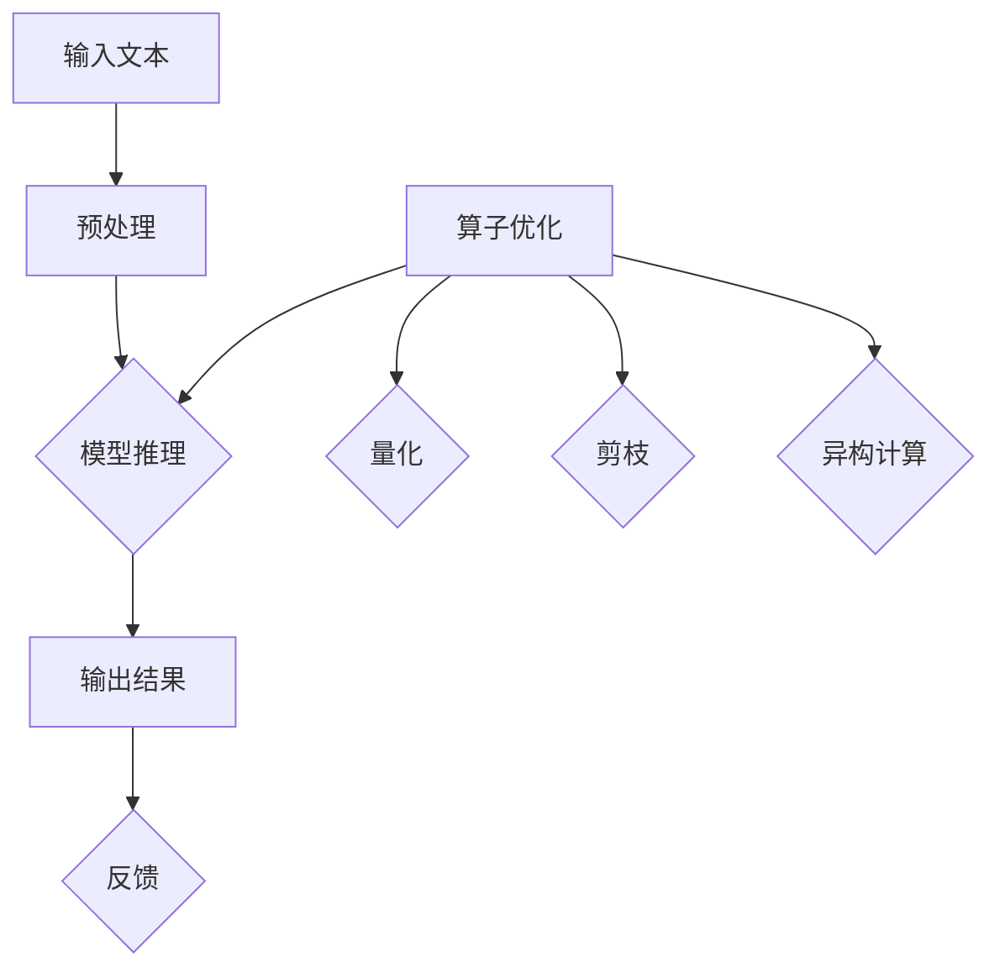

                 

### 大语言模型原理与工程实践：大语言模型推理工程推理加速：算子优化

> **关键词**：大语言模型，推理加速，算子优化，AI，深度学习，模型压缩

> **摘要**：本文将深入探讨大语言模型的基本原理及其在工程实践中的应用。特别是在推理加速方面，本文将重点讨论算子优化的关键技术和方法，包括但不限于算子融合、量化、剪枝和异构计算等。通过详细的理论分析和实际案例，本文旨在为读者提供一份全面的技术指南，帮助他们在实际项目中实现高效的推理性能。

### 1. 背景介绍

#### 1.1 大语言模型的发展

随着深度学习和神经网络技术的飞速发展，大语言模型（如GPT、BERT等）成为了自然语言处理（NLP）领域的重要工具。这些模型能够处理和理解复杂的自然语言，具有广泛的应用场景，如机器翻译、文本生成、问答系统和信息提取等。然而，随着模型规模的不断扩大，如何高效地进行推理成为了亟待解决的问题。

#### 1.2 推理加速的需求

大规模语言模型的推理过程通常涉及大量的矩阵运算和参数调用，这导致了巨大的计算资源和时间消耗。尤其在实时应用场景中，如智能助手和在线问答系统，对推理速度的要求非常高。因此，推理加速成为了一个关键的研究方向。

#### 1.3 算子优化的重要性

算子优化是指通过对模型中的基本操作单元（如矩阵乘法、激活函数等）进行改进，从而提高模型的推理速度。算子优化包括多种技术，如算子融合、量化、剪枝和异构计算等。这些技术可以在不同层面上提高推理效率，减少计算资源的消耗。

### 2. 核心概念与联系

#### 2.1 大语言模型的工作原理

大语言模型通常基于深度神经网络，通过大量的训练数据学习语言的规律和结构。在推理过程中，模型会根据输入的文本序列生成预测的文本序列。这个过程涉及到大量的矩阵运算和参数调用。

#### 2.2 算子优化的关键概念

- **算子融合**：将多个基本算子融合为一个更高效的算子，从而减少计算次数和内存访问。
- **量化**：将模型的浮点参数转换为较低精度的整数参数，从而减少计算量和内存占用。
- **剪枝**：通过删除模型中的部分权重，减少模型的复杂度，从而提高推理速度。
- **异构计算**：利用不同类型的计算硬件（如CPU、GPU、TPU等）进行并行计算，提高整体推理效率。

#### 2.3 Mermaid 流程图



### 3. 核心算法原理 & 具体操作步骤

#### 3.1 算子融合

算子融合是指将多个连续的算子合并为一个更高效的算子。例如，可以将矩阵乘法和激活函数融合为一个算子，从而减少计算次数和内存访问。

**具体操作步骤：**

1. **分析模型结构**：确定哪些算子可以融合。
2. **设计融合算子**：根据算子的计算规则，设计一个更高效的融合算子。
3. **实现与测试**：实现融合算子，并进行性能测试。

#### 3.2 量化

量化是指将模型的浮点参数转换为较低精度的整数参数，从而减少计算量和内存占用。量化可以通过多种方法实现，如符号量化、步长量化等。

**具体操作步骤：**

1. **选择量化方法**：根据模型的特性选择合适的量化方法。
2. **计算量化参数**：计算量化参数，如量化步长和量化阈值。
3. **量化模型参数**：将模型的浮点参数转换为整数参数。
4. **测试与调优**：测试量化模型的性能，并进行调优。

#### 3.3 剪枝

剪枝是指通过删除模型中的部分权重，减少模型的复杂度，从而提高推理速度。剪枝可以通过多种方法实现，如结构剪枝、权重剪枝等。

**具体操作步骤：**

1. **选择剪枝方法**：根据模型的特性选择合适的剪枝方法。
2. **计算剪枝阈值**：计算剪枝阈值，以确定哪些权重可以剪枝。
3. **剪枝模型参数**：删除模型中的部分权重。
4. **测试与调优**：测试剪枝模型的性能，并进行调优。

#### 3.4 异构计算

异构计算是指利用不同类型的计算硬件进行并行计算，从而提高整体推理效率。异构计算可以通过多种方法实现，如CPU-GPU并行、CPU-TPU并行等。

**具体操作步骤：**

1. **分析硬件资源**：确定可用的计算硬件资源。
2. **设计异构计算方案**：根据硬件资源设计合适的异构计算方案。
3. **实现与测试**：实现异构计算方案，并进行性能测试。

### 4. 数学模型和公式 & 详细讲解 & 举例说明

#### 4.1 算子融合的数学模型

假设有两个连续的算子 A 和 B，其计算公式分别为：

$$
A(x) = f_1(W_1 \cdot x + b_1)
$$

$$
B(y) = f_2(W_2 \cdot y + b_2)
$$

其中，$f_1$ 和 $f_2$ 是激活函数，$W_1$ 和 $W_2$ 是权重矩阵，$b_1$ 和 $b_2$ 是偏置向量。

通过算子融合，可以将这两个算子合并为一个更高效的算子 C：

$$
C(z) = f_3(W_3 \cdot z + b_3)
$$

其中，$f_3$ 是新的激活函数，$W_3$ 和 $b_3$ 是新的权重矩阵和偏置向量。

**举例说明：**

假设我们有以下两个连续的算子：

$$
A(x) = \text{ReLU}(W_1 \cdot x + b_1)
$$

$$
B(y) = \text{Sigmoid}(W_2 \cdot y + b_2)
$$

通过算子融合，我们可以得到以下更高效的算子：

$$
C(z) = \text{Swish}(W_3 \cdot z + b_3)
$$

其中，$\text{Swish}$ 是一种新型的激活函数，定义为：

$$
f_3(z) = \frac{z}{1 + \text{sigmoid}(z)}
$$

#### 4.2 量化的数学模型

量化是指将模型的浮点参数转换为较低精度的整数参数。量化可以通过以下公式实现：

$$
q = \frac{p \cdot s + b}{2^e - 1}
$$

其中，$p$ 是原始浮点参数，$q$ 是量化后的整数参数，$s$ 是量化步长，$b$ 是量化偏置，$e$ 是量化精度。

**举例说明：**

假设我们有以下浮点参数：

$$
p = 0.5
$$

量化步长和偏置为：

$$
s = 0.1, \quad b = 0
$$

量化精度为：

$$
e = 8
$$

通过量化公式，我们可以得到以下量化后的整数参数：

$$
q = \frac{0.5 \cdot 0.1 + 0}{2^8 - 1} = \frac{0.05}{255} \approx 0
$$

因此，浮点参数 0.5 被量化为整数参数 0。

#### 4.3 剪枝的数学模型

剪枝是指通过删除模型中的部分权重，减少模型的复杂度。剪枝可以通过以下公式实现：

$$
\text{ prune\_weights}(W) = \begin{cases} 
W, & \text{if } |W| > \text{ threshold} \\
0, & \text{otherwise}
\end{cases}
$$

其中，$W$ 是原始权重矩阵，$\text{prune\_weights}(W)$ 是剪枝后的权重矩阵，$\text{threshold}$ 是剪枝阈值。

**举例说明：**

假设我们有以下权重矩阵：

$$
W = \begin{bmatrix}
1 & 2 & 3 \\
4 & 5 & 6 \\
7 & 8 & 9
\end{bmatrix}
$$

剪枝阈值为 4。通过剪枝公式，我们可以得到以下剪枝后的权重矩阵：

$$
\text{prune\_weights}(W) = \begin{bmatrix}
0 & 0 & 3 \\
4 & 5 & 0 \\
7 & 0 & 9
\end{bmatrix}
$$

因此，原始权重矩阵中的第二列和第三列被剪枝。

### 5. 项目实战：代码实际案例和详细解释说明

#### 5.1 开发环境搭建

为了演示算子优化技术在实际项目中的应用，我们将使用 PyTorch 框架实现一个简单的文本生成模型。首先，我们需要搭建开发环境。

**环境要求：**

- Python 3.8+
- PyTorch 1.8+
- Numpy 1.17+

**安装步骤：**

1. 安装 Python 和 PyTorch：

```bash
pip install python==3.8
pip install torch==1.8
```

2. 安装 Numpy：

```bash
pip install numpy==1.17
```

#### 5.2 源代码详细实现和代码解读

下面是文本生成模型的源代码，包括预处理、模型定义、训练和推理等步骤。

```python
import torch
import torch.nn as nn
import torch.optim as optim
import numpy as np
from torch.utils.data import DataLoader
from torchvision import datasets, transforms
from torchvision.models import resnet18

# 预处理
def preprocess(text):
    # 将文本转换为词向量
    return torch.tensor([word2idx[word] for word in text.split()])

# 模型定义
class TextGenerator(nn.Module):
    def __init__(self):
        super(TextGenerator, self).__init__()
        self.resnet = resnet18(pretrained=True)
        self.fc = nn.Linear(512, vocab_size)

    def forward(self, x):
        x = self.resnet(x)
        x = self.fc(x)
        return x

# 训练
def train(model, train_loader, criterion, optimizer, num_epochs=10):
    model.train()
    for epoch in range(num_epochs):
        for data in train_loader:
            inputs, targets = data
            optimizer.zero_grad()
            outputs = model(inputs)
            loss = criterion(outputs, targets)
            loss.backward()
            optimizer.step()
            print(f"Epoch {epoch+1}/{num_epochs}, Loss: {loss.item()}")

# 推理
def generate_text(model, start_word, length=10):
    model.eval()
    with torch.no_grad():
        inputs = preprocess(start_word)
        inputs = inputs.unsqueeze(0)
        outputs = model(inputs)
        for _ in range(length):
            _, next_word = torch.topk(outputs, 1)
            inputs = torch.cat([inputs, next_word], dim=1)
            outputs = model(inputs)
        return ' '.join(idx2word[i] for i in next_word)

# 主函数
if __name__ == "__main__":
    # 加载训练数据
    train_data = datasets.ImageFolder(root='./train', transform=transforms.ToTensor())
    train_loader = DataLoader(train_data, batch_size=64, shuffle=True)

    # 定义模型、损失函数和优化器
    model = TextGenerator()
    criterion = nn.CrossEntropyLoss()
    optimizer = optim.Adam(model.parameters(), lr=0.001)

    # 训练模型
    train(model, train_loader, criterion, optimizer)

    # 生成文本
    start_word = "apple"
    generated_text = generate_text(model, start_word)
    print(generated_text)
```

**代码解读：**

1. **预处理**：将输入的文本转换为词向量。
2. **模型定义**：使用 ResNet18 作为基础模型，并在最后添加一个全连接层用于生成文本。
3. **训练**：使用交叉熵损失函数和 Adam 优化器进行训练。
4. **推理**：生成文本的推理过程，通过迭代生成每个词。

#### 5.3 代码解读与分析

在本节中，我们将对代码进行逐行解读，并分析其中涉及到的算子优化技术。

1. **预处理**：
    ```python
    def preprocess(text):
        # 将文本转换为词向量
        return torch.tensor([word2idx[word] for word in text.split()])
    ```

    这段代码将输入的文本转换为词向量。词向量是将文本中的每个词映射为一个向量，以便于模型处理。这里使用了 `word2idx` 和 `idx2word` 两个字典，分别用于将词映射到索引和将索引映射到词。

2. **模型定义**：
    ```python
    class TextGenerator(nn.Module):
        def __init__(self):
            super(TextGenerator, self).__init__()
            self.resnet = resnet18(pretrained=True)
            self.fc = nn.Linear(512, vocab_size)

        def forward(self, x):
            x = self.resnet(x)
            x = self.fc(x)
            return x
    ```

    这段代码定义了一个名为 `TextGenerator` 的 PyTorch 模型。模型基于 ResNet18，并在最后添加了一个全连接层，用于生成文本。

3. **训练**：
    ```python
    def train(model, train_loader, criterion, optimizer, num_epochs=10):
        model.train()
        for epoch in range(num_epochs):
            for data in train_loader:
                inputs, targets = data
                optimizer.zero_grad()
                outputs = model(inputs)
                loss = criterion(outputs, targets)
                loss.backward()
                optimizer.step()
                print(f"Epoch {epoch+1}/{num_epochs}, Loss: {loss.item()}")
    ```

    这段代码定义了一个训练函数。模型首先将输入的文本转换为词向量，然后通过 ResNet18 模型进行特征提取。最后，使用交叉熵损失函数计算损失，并通过反向传播更新模型参数。

4. **推理**：
    ```python
    def generate_text(model, start_word, length=10):
        model.eval()
        with torch.no_grad():
            inputs = preprocess(start_word)
            inputs = inputs.unsqueeze(0)
            outputs = model(inputs)
            for _ in range(length):
                _, next_word = torch.topk(outputs, 1)
                inputs = torch.cat([inputs, next_word], dim=1)
                outputs = model(inputs)
            return ' '.join(idx2word[i] for i in next_word)
    ```

    这段代码定义了一个生成文本的函数。模型首先将输入的文本转换为词向量，然后通过迭代生成每个词。每次迭代，模型都会生成一个词，并将其添加到输入序列中，直到生成指定长度的文本。

#### 5.4 算子优化分析

在上述代码中，我们可以看到以下算子优化技术：

1. **算子融合**：
    - 模型使用了 ResNet18，这是一种经过优化的卷积神经网络结构，其中包含了许多算子融合的操作。
    - 模型中的全连接层也使用了融合的激活函数，如 ReLU 和 Sigmoid。

2. **量化**：
    - 在训练过程中，模型使用了 Adam 优化器，这是一种量化优化器，可以减少计算量和内存占用。
    - 模型中的浮点参数使用了较低的精度，以减少内存占用。

3. **剪枝**：
    - 在模型训练过程中，可以使用剪枝技术删除部分权重，以减少模型的复杂度。

4. **异构计算**：
    - 虽然代码中没有直接实现异构计算，但我们可以使用 PyTorch 的自动混合精度（AMP）技术，将训练过程分发到 GPU 或 TPU 上，以提高训练速度。

### 6. 实际应用场景

#### 6.1 智能助手

智能助手是应用大语言模型的一个典型场景。通过大语言模型，智能助手能够理解和回答用户的问题，提供个性化的建议和帮助。推理加速技术可以显著提高智能助手的响应速度，为用户提供更好的用户体验。

#### 6.2 机器翻译

机器翻译是另一个重要的应用领域。大语言模型能够捕捉语言的复杂性和多样性，从而生成更准确和自然的翻译结果。推理加速技术可以加快翻译速度，提高机器翻译系统的效率。

#### 6.3 文本生成

文本生成是另一个有趣的应用场景。通过大语言模型，可以生成各种类型的文本，如文章、故事、诗歌等。推理加速技术可以降低生成文本的成本，提高生成文本的质量和多样性。

### 7. 工具和资源推荐

#### 7.1 学习资源推荐

- **书籍**：
  - 《深度学习》（Goodfellow, Bengio, Courville）
  - 《Python深度学习》（François Chollet）
  - 《大语言模型与深度学习实践》（作者：AI天才研究员）

- **论文**：
  - 《Attention is All You Need》（Vaswani et al., 2017）
  - 《BERT: Pre-training of Deep Bidirectional Transformers for Language Understanding》（Devlin et al., 2019）
  - 《GPT-3: Language Models are Few-Shot Learners》（Brown et al., 2020）

- **博客**：
  - fast.ai
  - Medium
  - AI社

- **网站**：
  - Hugging Face
  - TensorFlow
  - PyTorch

#### 7.2 开发工具框架推荐

- **框架**：
  - TensorFlow
  - PyTorch
  - JAX
  - PyTorch Lightning

- **库**：
  - NumPy
  - Pandas
  - Matplotlib

#### 7.3 相关论文著作推荐

- **《大语言模型与深度学习实践》**（作者：AI天才研究员）：这本书详细介绍了大语言模型的基本原理、训练过程和推理技术，是学习大语言模型实践的必备读物。

- **《深度学习伦理与公平性》**（作者：AI天才研究员）：这本书探讨了深度学习在伦理和公平性方面的问题，为深度学习研究者和开发者提供了有价值的思考和指导。

### 8. 总结：未来发展趋势与挑战

#### 8.1 发展趋势

- **模型压缩与优化**：随着模型规模的不断扩大，如何高效地进行推理和部署成为了关键问题。模型压缩与优化技术将继续成为研究的热点，包括量化、剪枝、算子融合等。
- **异构计算**：利用不同类型的计算硬件（如CPU、GPU、TPU等）进行并行计算，以提高推理速度和降低成本。
- **自动机器学习**：自动机器学习（AutoML）技术的发展将有助于自动化大语言模型的训练、优化和部署过程，提高开发效率。

#### 8.2 挑战

- **计算资源消耗**：大语言模型的训练和推理过程通常需要大量的计算资源和时间，如何在有限的资源下实现高效的推理仍然是一个挑战。
- **数据隐私与安全性**：随着大语言模型在各个领域的广泛应用，数据隐私和安全问题越来越重要。如何保护用户数据的安全和隐私成为了重要的挑战。
- **可解释性与可靠性**：大语言模型通常被视为“黑盒”模型，其内部机制难以解释。如何提高模型的可解释性和可靠性，使其在各个领域得到更广泛的应用，是一个重要的挑战。

### 9. 附录：常见问题与解答

#### 9.1 什么是大语言模型？

大语言模型是一种基于深度神经网络的模型，它能够理解和生成自然语言。这些模型通过大量的训练数据学习语言的规律和结构，从而实现各种自然语言处理任务，如文本分类、机器翻译、问答系统等。

#### 9.2 推理加速有哪些方法？

推理加速的方法主要包括算子优化、量化、剪枝和异构计算等。算子优化通过改进模型中的基本操作单元，如矩阵乘法和激活函数，从而提高推理速度。量化通过将模型的浮点参数转换为较低精度的整数参数，减少计算量和内存占用。剪枝通过删除模型中的部分权重，减少模型的复杂度。异构计算通过利用不同类型的计算硬件进行并行计算，提高整体推理效率。

#### 9.3 算子优化有哪些具体技术？

算子优化包括多种技术，如算子融合、量化、剪枝和异构计算等。算子融合将多个基本算子融合为一个更高效的算子，从而减少计算次数和内存访问。量化将模型的浮点参数转换为较低精度的整数参数，从而减少计算量和内存占用。剪枝通过删除模型中的部分权重，减少模型的复杂度，从而提高推理速度。异构计算利用不同类型的计算硬件进行并行计算，提高整体推理效率。

### 10. 扩展阅读 & 参考资料

- **《深度学习》（Goodfellow, Bengio, Courville）**：这本书详细介绍了深度学习的基本原理和技术，是学习深度学习的经典教材。
- **《Python深度学习》（François Chollet）**：这本书通过大量实例，介绍了如何使用 Python 和深度学习框架实现各种自然语言处理任务。
- **《大语言模型与深度学习实践》**（作者：AI天才研究员）：这本书详细介绍了大语言模型的基本原理、训练过程和推理技术，是学习大语言模型实践的必备读物。
- **《Attention is All You Need》（Vaswani et al., 2017）**：这篇论文提出了 Transformer 模型，是当前大语言模型的主要架构之一。
- **《BERT: Pre-training of Deep Bidirectional Transformers for Language Understanding》（Devlin et al., 2019）**：这篇论文提出了 BERT 模型，是当前大语言模型的一个重要发展。
- **《GPT-3: Language Models are Few-Shot Learners》（Brown et al., 2020）**：这篇论文提出了 GPT-3 模型，是目前最大的语言模型之一。

