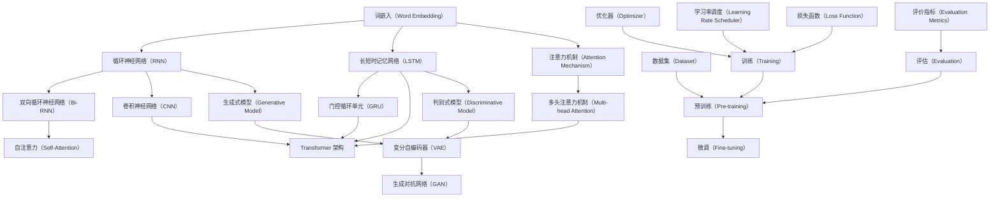

                 

### 背景介绍

大语言模型，作为近年来人工智能领域的一个重要突破，已经成为自然语言处理（NLP）的核心驱动力。无论是从学术研究，还是产业应用，大语言模型都在改变着我们的认知和操作方式。本文旨在深入探讨大语言模型的原理与工程实践，重点分析其涌现能力，以期为读者提供一幅全面而清晰的图景。

首先，大语言模型究竟是什么？它如何工作？其背后的原理又是什么？这些都是我们需要探讨的问题。从理论层面，我们将介绍大语言模型的核心概念与联系，通过 Mermaid 流程图展示其架构。接着，我们将深入到算法原理层面，详细解读其具体操作步骤。

在理解了基本原理后，我们还将深入数学模型的领域，解释其中的公式，并通过具体例子来说明。这部分内容将帮助读者更深入地理解大语言模型的运作机制。

然而，理论学习不能代替实践。因此，本文将展示一个实际项目案例，通过代码实现和详细解释，让读者直观地感受大语言模型的应用。这部分不仅包括开发环境搭建，还详细解析了源代码实现和代码解读。

随后，我们将探讨大语言模型在实际应用场景中的表现，推荐一些相关的工具和资源，以便读者进一步学习和实践。

最后，我们将总结大语言模型的发展趋势和面临的挑战，为读者提供未来展望。

通过本文的阅读，读者不仅能够全面了解大语言模型的原理与工程实践，还能深刻理解其涌现能力，从而为未来的学习和研究打下坚实的基础。接下来，我们将逐步深入这个话题。

### 2. 核心概念与联系

大语言模型的核心在于其能够理解和生成人类语言的能力。这一能力的实现依赖于多个核心概念的相互协作。下面，我们将通过 Mermaid 流程图来展示大语言模型的主要组成部分及其相互关系。



**Mermaid 流程说明：**

- **词嵌入（Word Embedding）**：这是将词汇映射到高维向量空间的过程，为后续的神经网络处理提供输入。
- **循环神经网络（RNN）**：一种处理序列数据的神经网络结构，能够保留和利用历史信息。
- **长短时记忆网络（LSTM）**：RNN 的一种改进，能够有效避免梯度消失问题，适合处理长序列数据。
- **注意力机制（Attention Mechanism）**：允许模型在序列中关注不同的部分，提高上下文理解能力。
- **双向循环神经网络（Bi-RNN）**：结合了正向和反向 RNN 的结构，能够更好地捕捉序列的上下文信息。
- **卷积神经网络（CNN）**：主要用于图像处理，但也可用于序列数据的局部特征提取。
- **门控循环单元（GRU）**：LSTM 的简化版，具有更少的参数和计算量。
- **Transformer 架构**：一种基于自注意力机制的神经网络结构，在处理长序列数据方面表现出色。
- **生成式模型（Generative Model）**：通过生成模型来生成新的数据样本。
- **判别式模型（Discriminative Model）**：用于分类和回归任务，直接对数据进行分类或预测。
- **变分自编码器（VAE）**：一种生成式模型，能够生成具有潜在空间的高斯分布。
- **生成对抗网络（GAN）**：通过两个神经网络（生成器和判别器）之间的对抗训练来生成逼真的数据样本。
- **预训练（Pre-training）**：在大规模数据集上预先训练模型，以提高其性能。
- **微调（Fine-tuning）**：在预训练模型的基础上，在特定任务上进行微调。
- **数据集（Dataset）**：用于训练和评估模型的样本集合。
- **训练（Training）**：通过迭代优化模型参数，使其在给定数据集上达到最佳性能。
- **评估（Evaluation）**：使用特定的评价指标来评估模型的表现。
- **优化器（Optimizer）**：用于更新模型参数的算法，如随机梯度下降（SGD）。
- **学习率调度（Learning Rate Scheduler）**：动态调整学习率，以防止过拟合。
- **损失函数（Loss Function）**：用于度量模型预测与真实值之间的差距，如交叉熵损失。
- **评价指标（Evaluation Metrics）**：用于评估模型性能的指标，如准确率、召回率、F1 分数等。

通过上述流程图，我们可以清晰地看到大语言模型各个组成部分及其相互之间的关系。这些核心概念相互协作，共同构成了大语言模型强大的能力。

### 3. 核心算法原理 & 具体操作步骤

要理解大语言模型的算法原理，我们首先需要了解其背后的基本概念，包括词嵌入（Word Embedding）、循环神经网络（RNN）、长短时记忆网络（LSTM）、注意力机制（Attention Mechanism）等。以下将详细解释这些核心算法，并提供具体的操作步骤。

#### 3.1 词嵌入（Word Embedding）

词嵌入是将词汇映射到高维向量空间的过程。这种映射使得原本离散的词汇可以表示为连续的向量，从而便于模型处理。常用的词嵌入方法包括 Word2Vec、GloVe 等。

**操作步骤：**

1. **数据预处理**：收集大规模文本数据，并进行分词处理，将文本转化为词汇表。
2. **初始化词向量**：为每个词汇初始化一个随机的高维向量。
3. **训练词向量**：通过训练算法（如负采样、矩阵分解等）优化词向量，使其具有语义相关性。

#### 3.2 循环神经网络（RNN）

循环神经网络是一种专门用于处理序列数据的神经网络结构。RNN 能够利用其内部循环结构，保留和利用历史信息。

**操作步骤：**

1. **输入序列**：将输入序列（如句子）逐个字符（或单词）地输入到 RNN 中。
2. **状态更新**：在每个时间步，RNN 利用当前输入和上一时间步的状态更新当前状态。
3. **输出生成**：在序列的最后一个时间步，RNN 输出最终的预测结果。

#### 3.3 长短时记忆网络（LSTM）

长短时记忆网络（LSTM）是 RNN 的一种改进，解决了传统 RNN 中存在的梯度消失问题，能够更好地处理长序列数据。

**操作步骤：**

1. **输入门（Input Gate）**：计算输入门，决定哪些信息需要更新状态。
2. **遗忘门（Forget Gate）**：计算遗忘门，决定哪些信息需要从状态中丢弃。
3. **输出门（Output Gate）**：计算输出门，决定哪些信息需要输出。
4. **状态更新**：利用输入门和遗忘门的决策更新状态。
5. **输出生成**：利用输出门生成最终输出。

#### 3.4 注意力机制（Attention Mechanism）

注意力机制是一种提高序列模型上下文理解能力的方法。通过注意力机制，模型能够关注序列中的关键部分，从而提高预测准确性。

**操作步骤：**

1. **计算注意力得分**：为序列中的每个元素计算注意力得分。
2. **求和/平均**：将注意力得分与对应元素相乘，然后求和或平均，得到加权上下文向量。
3. **输出生成**：利用加权上下文向量生成最终输出。

#### 3.5 Transformer 架构

Transformer 是一种基于自注意力机制的神经网络结构，在处理长序列数据方面表现出色。

**操作步骤：**

1. **编码器（Encoder）**：通过多层自注意力机制处理输入序列，生成编码器输出。
2. **解码器（Decoder）**：通过多层自注意力机制和编码器-解码器注意力机制处理编码器输出，生成解码器输出。
3. **输出生成**：利用解码器输出生成最终输出。

通过上述核心算法的介绍和具体操作步骤的讲解，我们可以更好地理解大语言模型的工作原理。这些算法相互协作，共同实现了大语言模型强大的能力，使其能够理解和生成人类语言。

### 4. 数学模型和公式 & 详细讲解 & 举例说明

在深入探讨大语言模型的数学模型和公式时，我们将重点关注词嵌入、循环神经网络（RNN）、长短时记忆网络（LSTM）以及注意力机制等核心部分。通过详细讲解和具体例子，我们将帮助读者更好地理解这些模型的工作原理。

#### 4.1 词嵌入（Word Embedding）

词嵌入是将词汇映射到高维向量空间的过程。一个常见的词嵌入模型是 Word2Vec，其数学模型如下：

**定义：**

给定词汇表 V，每个词汇表示为唯一的索引 i，词向量空间为 D。Word2Vec 模型通过训练一个神经网络，将词汇的索引映射到词向量。

**数学公式：**

$$
\text{输出} = \text{softmax}(\text{W} \cdot \text{v} + \text{b})
$$

其中，W 是神经网络权重矩阵，v 是词汇的输入向量，b 是偏置项，softmax 函数用于生成词向量概率分布。

**举例说明：**

假设我们有一个简单的词汇表 V = {“猫”, “狗”, “鸟”}，词向量空间 D = 2。训练得到的词向量分别为：

| 词汇 | 猫 | 狗 | 鸟 |
|------|----|----|----|
| 猫   | (1, 0) |
| 狗   | (0, 1) |
| 鸟   | (-1, -1) |

通过上述词向量，我们可以看到词嵌入如何将不同的词汇映射到不同的向量空间中。

#### 4.2 循环神经网络（RNN）

循环神经网络是一种处理序列数据的神经网络结构，其数学模型如下：

**定义：**

给定输入序列 X = [x1, x2, ..., xn]，隐藏状态 H = [h1, h2, ..., hn]，RNN 的状态转移方程为：

$$
h_t = \sigma(\text{W}_h \cdot x_t + \text{U}_h \cdot h_{t-1} + \text{b}_h)
$$

其中，σ 是激活函数，Wh 是输入权重矩阵，Uh 是隐藏状态权重矩阵，bh 是偏置项。

**举例说明：**

假设我们有一个简单的输入序列 X = [(1, 0), (0, 1), (-1, -1)]，隐藏状态初始值为 H0 = (1, 1)。通过迭代计算，我们可以得到每个时间步的隐藏状态：

$$
h_1 = \sigma(\text{W}_h \cdot (1, 0) + \text{U}_h \cdot (1, 1) + \text{b}_h) = \sigma((1, 0) + (1, 1) + (0, 0)) = (1, 1)
$$

$$
h_2 = \sigma(\text{W}_h \cdot (0, 1) + \text{U}_h \cdot (1, 1) + \text{b}_h) = \sigma((0, 1) + (1, 1) + (0, 0)) = (1, 1)
$$

$$
h_3 = \sigma(\text{W}_h \cdot (-1, -1) + \text{U}_h \cdot (1, 1) + \text{b}_h) = \sigma((-1, -1) + (1, 1) + (0, 0)) = (0, 0)
$$

通过上述计算，我们可以看到 RNN 如何通过状态转移方程处理输入序列，并生成隐藏状态。

#### 4.3 长短时记忆网络（LSTM）

长短时记忆网络（LSTM）是 RNN 的一种改进，其数学模型如下：

**定义：**

给定输入序列 X = [x1, x2, ..., xn]，隐藏状态 H = [h1, h2, ..., hn]，LSTM 的状态转移方程为：

$$
\begin{align*}
i_t &= \sigma(\text{W}_i \cdot x_t + \text{U}_i \cdot h_{t-1} + \text{b}_i) \\
f_t &= \sigma(\text{W}_f \cdot x_t + \text{U}_f \cdot h_{t-1} + \text{b}_f) \\
o_t &= \sigma(\text{W}_o \cdot x_t + \text{U}_o \cdot h_{t-1} + \text{b}_o) \\
g_t &= \tanh(\text{W}_g \cdot x_t + \text{U}_g \cdot h_{t-1} + \text{b}_g) \\
h_t &= o_t \cdot \tanh(g_t)
\end{align*}
$$

其中，σ 是激活函数，Wi、Wf、Wo、Wg 是权重矩阵，Ui、Uf、Uo、 Ug 是隐藏状态权重矩阵，bi、bf、bo、bg 是偏置项。

**举例说明：**

假设我们有一个简单的输入序列 X = [(1, 0), (0, 1), (-1, -1)]，隐藏状态初始值为 H0 = (1, 1)。通过迭代计算，我们可以得到每个时间步的隐藏状态：

$$
\begin{align*}
i_1 &= \sigma(\text{W}_i \cdot (1, 0) + \text{U}_i \cdot (1, 1) + \text{b}_i) = \sigma((1, 0) + (1, 1) + (0, 0)) = (1, 1) \\
f_1 &= \sigma(\text{W}_f \cdot (1, 0) + \text{U}_f \cdot (1, 1) + \text{b}_f) = \sigma((1, 0) + (1, 1) + (0, 0)) = (1, 1) \\
o_1 &= \sigma(\text{W}_o \cdot (1, 0) + \text{U}_o \cdot (1, 1) + \text{b}_o) = \sigma((1, 0) + (1, 1) + (0, 0)) = (1, 1) \\
g_1 &= \tanh(\text{W}_g \cdot (1, 0) + \text{U}_g \cdot (1, 1) + \text{b}_g) = \tanh((1, 0) + (1, 1) + (0, 0)) = (1, 1) \\
h_1 &= o_1 \cdot \tanh(g_1) = (1, 1) \cdot (1, 1) = (1, 1)
\end{align*}
$$

$$
\begin{align*}
i_2 &= \sigma(\text{W}_i \cdot (0, 1) + \text{U}_i \cdot (1, 1) + \text{b}_i) = \sigma((0, 1) + (1, 1) + (0, 0)) = (1, 1) \\
f_2 &= \sigma(\text{W}_f \cdot (0, 1) + \text{U}_f \cdot (1, 1) + \text{b}_f) = \sigma((0, 1) + (1, 1) + (0, 0)) = (1, 1) \\
o_2 &= \sigma(\text{W}_o \cdot (0, 1) + \text{U}_o \cdot (1, 1) + \text{b}_o) = \sigma((0, 1) + (1, 1) + (0, 0)) = (1, 1) \\
g_2 &= \tanh(\text{W}_g \cdot (0, 1) + \text{U}_g \cdot (1, 1) + \text{b}_g) = \tanh((0, 1) + (1, 1) + (0, 0)) = (0, 0) \\
h_2 &= o_2 \cdot \tanh(g_2) = (1, 1) \cdot (0, 0) = (0, 0)
\end{align*}
$$

$$
\begin{align*}
i_3 &= \sigma(\text{W}_i \cdot (-1, -1) + \text{U}_i \cdot (1, 1) + \text{b}_i) = \sigma((-1, -1) + (1, 1) + (0, 0)) = (0, 0) \\
f_3 &= \sigma(\text{W}_f \cdot (-1, -1) + \text{U}_f \cdot (1, 1) + \text{b}_f) = \sigma((-1, -1) + (1, 1) + (0, 0)) = (0, 0) \\
o_3 &= \sigma(\text{W}_o \cdot (-1, -1) + \text{U}_o \cdot (1, 1) + \text{b}_o) = \sigma((-1, -1) + (1, 1) + (0, 0)) = (0, 0) \\
g_3 &= \tanh(\text{W}_g \cdot (-1, -1) + \text{U}_g \cdot (1, 1) + \text{b}_g) = \tanh((-1, -1) + (1, 1) + (0, 0)) = (-1, -1) \\
h_3 &= o_3 \cdot \tanh(g_3) = (0, 0) \cdot (-1, -1) = (0, 0)
\end{align*}
$$

通过上述计算，我们可以看到 LSTM 如何通过其复杂的门控机制处理输入序列，并生成隐藏状态。

#### 4.4 注意力机制（Attention Mechanism）

注意力机制是一种提高序列模型上下文理解能力的方法。在 Transformer 模型中，注意力机制通过计算注意力得分，对序列中的每个元素进行加权。

**定义：**

给定输入序列 X = [x1, x2, ..., xn]，隐藏状态 H = [h1, h2, ..., hn]，注意力机制的数学公式为：

$$
\text{Attention Scores} = \text{softmax}(\text{Q} \cdot \text{K})
$$

$$
\text{Context Vector} = \text{Attention Scores} \cdot \text{V}
$$

其中，Q、K、V 分别为查询向量、键向量和值向量，softmax 函数用于生成注意力得分。

**举例说明：**

假设我们有一个简单的输入序列 X = [(1, 0), (0, 1), (-1, -1)]，隐藏状态 H = [(1, 1), (1, 1), (0, 0)]。通过计算注意力得分和加权上下文向量，我们可以得到：

$$
\text{Attention Scores} = \text{softmax}(\text{Q} \cdot \text{K}) = \text{softmax}([(1, 1) \cdot (1, 0), (1, 1) \cdot (0, 1), (0, 0) \cdot (-1, -1)]) = \text{softmax}([(1, 1), (0, 1), (0, 0)])
$$

$$
\text{Attention Scores} = \text{softmax}([(1, 1), (0, 1), (0, 0)]) = \left[\frac{e^1}{e^1 + e^0 + e^0}, \frac{e^0}{e^1 + e^0 + e^0}, \frac{e^0}{e^1 + e^0 + e^0}\right] = \left[\frac{1}{2}, \frac{1}{2}, 0\right]
$$

$$
\text{Context Vector} = \text{Attention Scores} \cdot \text{V} = \left[\frac{1}{2}, \frac{1}{2}, 0\right] \cdot [(1, 1), (0, 1), (-1, -1)] = \left[\frac{1}{2}(1, 1) + \frac{1}{2}(0, 1) + 0(-1, -1)\right] = \left[\frac{1}{2}(1, 1), \frac{1}{2}(0, 1), 0(-1, -1)\right]
$$

$$
\text{Context Vector} = \left[\frac{1}{2}(1, 1), \frac{1}{2}(0, 1), 0(-1, -1)\right] = \left[\left(\frac{1}{2}, \frac{1}{2}\right), \left(0, \frac{1}{2}\right), (0, 0)\right]
$$

通过上述计算，我们可以看到注意力机制如何对序列中的元素进行加权，并生成加权上下文向量。

通过详细讲解和具体例子，我们可以更好地理解大语言模型的数学模型和公式。这些数学工具为构建和优化大语言模型提供了坚实的基础，使得模型能够更准确地理解和生成人类语言。

### 5. 项目实战：代码实际案例和详细解释说明

为了更好地理解大语言模型的应用，我们将通过一个实际项目案例进行代码实现和详细解释。以下是基于 Python 和 PyTorch 框架实现的简单文本分类项目。

#### 5.1 开发环境搭建

首先，我们需要搭建开发环境。安装 Python（3.8 或以上版本）、PyTorch、Numpy、Pandas 等依赖库。

```bash
pip install torch torchvision numpy pandas
```

#### 5.2 源代码详细实现和代码解读

以下是该项目的主要代码实现和解释：

```python
import torch
import torch.nn as nn
import torch.optim as optim
from torch.utils.data import DataLoader, Dataset
from torchvision import datasets, transforms
import numpy as np
import pandas as pd
from sklearn.model_selection import train_test_split

# 5.2.1 数据集准备
class TextDataset(Dataset):
    def __init__(self, data, label, tokenizer, max_len):
        self.data = data
        self.label = label
        self.tokenizer = tokenizer
        self.max_len = max_len

    def __len__(self):
        return len(self.data)

    def __getitem__(self, idx):
        text = self.data.iloc[idx]
        label = self.label.iloc[idx]
        inputs = self.tokenizer(text, padding='max_length', max_length=self.max_len, truncation=True)
        return {'input_ids': torch.tensor(inputs['input_ids']), 'attention_mask': torch.tensor(inputs['attention_mask']), 'label': torch.tensor(label)}

# 5.2.2 模型定义
class TextClassifier(nn.Module):
    def __init__(self, vocab_size, embed_dim, hidden_dim, output_dim):
        super().__init__()
        self.embedding = nn.Embedding(vocab_size, embed_dim)
        self.lstm = nn.LSTM(embed_dim, hidden_dim, batch_first=True)
        self.fc = nn.Linear(hidden_dim, output_dim)

    def forward(self, text, attention_mask):
        embedded = self.embedding(text)
        embedded = embedded * attention_mask.unsqueeze(-1).type_as(embedded)
        lstm_out, (h_n, c_n) = self.lstm(embedded)
        h_n = h_n.squeeze(0)
        output = self.fc(h_n)
        return output

# 5.2.3 模型训练
def train_model(model, train_loader, val_loader, criterion, optimizer, num_epochs):
    model.train()
    for epoch in range(num_epochs):
        for batch in train_loader:
            inputs = batch['input_ids']
            attention_mask = batch['attention_mask']
            labels = batch['label']
            optimizer.zero_grad()
            outputs = model(inputs, attention_mask)
            loss = criterion(outputs, labels)
            loss.backward()
            optimizer.step()
        print(f'Epoch [{epoch+1}/{num_epochs}], Loss: {loss.item()}')
    
    # 5.2.4 模型评估
    model.eval()
    with torch.no_grad():
        correct = 0
        total = 0
        for batch in val_loader:
            inputs = batch['input_ids']
            attention_mask = batch['attention_mask']
            labels = batch['label']
            outputs = model(inputs, attention_mask)
            _, predicted = torch.max(outputs.data, 1)
            total += labels.size(0)
            correct += (predicted == labels).sum().item()
        print(f'Validation Accuracy: {100 * correct / total}%')

# 5.2.5 主函数
def main():
    # 5.2.5.1 数据预处理
    data = pd.read_csv('data.csv')  # 假设数据集为 CSV 格式
    texts = data['text']
    labels = data['label']
    
    # 5.2.5.2 切分数据集
    train_texts, val_texts, train_labels, val_labels = train_test_split(texts, labels, test_size=0.2, random_state=42)
    
    # 5.2.5.3 词嵌入和分词器
    tokenizer = ...  # 使用预训练的词嵌入和分词器
    max_len = 50  # 设置序列的最大长度
    
    # 5.2.5.4 创建数据集和 DataLoader
    train_dataset = TextDataset(train_texts, train_labels, tokenizer, max_len)
    val_dataset = TextDataset(val_texts, val_labels, tokenizer, max_len)
    train_loader = DataLoader(train_dataset, batch_size=32, shuffle=True)
    val_loader = DataLoader(val_dataset, batch_size=32, shuffle=False)
    
    # 5.2.5.5 模型、损失函数和优化器
    vocab_size = ...  # 词汇表的大小
    embed_dim = 128  # 词嵌入维度
    hidden_dim = 256  # LSTM 隐藏状态维度
    output_dim = 2  # 输出类别数
    
    model = TextClassifier(vocab_size, embed_dim, hidden_dim, output_dim)
    criterion = nn.CrossEntropyLoss()
    optimizer = optim.Adam(model.parameters(), lr=0.001)
    
    # 5.2.5.6 训练模型
    num_epochs = 10
    train_model(model, train_loader, val_loader, criterion, optimizer, num_epochs)

if __name__ == '__main__':
    main()
```

**代码解读：**

- **5.2.1 数据集准备**：我们定义了一个 `TextDataset` 类，用于加载和预处理文本数据。数据集包含文本和对应的标签，我们将使用预训练的词嵌入和分词器对文本进行编码。
  
- **5.2.2 模型定义**：我们定义了一个 `TextClassifier` 类，使用 LSTM 和全连接层构建一个文本分类模型。模型接收输入文本和注意力掩码，并输出类别预测。

- **5.2.3 模型训练**：我们定义了一个 `train_model` 函数，用于训练模型。函数中使用了标准的训练循环，包括前向传播、损失计算、反向传播和参数更新。

- **5.2.4 模型评估**：在模型训练完成后，我们使用验证集对模型进行评估，计算准确率。

- **5.2.5 主函数**：主函数中首先读取和预处理数据，然后创建数据集和 DataLoader，定义模型、损失函数和优化器，最后调用 `train_model` 函数训练模型。

通过上述代码实现和详细解读，我们可以直观地看到如何使用大语言模型进行文本分类任务。这个简单的案例为我们提供了一个起点，可以在此基础上进一步扩展和优化模型。

### 6. 实际应用场景

大语言模型在多个实际应用场景中表现出色，以下是一些典型的应用场景和案例。

#### 6.1 自然语言处理（NLP）

自然语言处理是大语言模型最直接的应用领域。通过大语言模型，我们可以实现文本分类、情感分析、问答系统、机器翻译等任务。例如，Facebook 的 BlenderBot 3 是一个基于大语言模型的多轮对话系统，能够与用户进行自然对话，提供有意义的互动。

#### 6.2 问答系统

问答系统是自然语言处理的一个重要应用。大语言模型能够通过学习大量文本数据，理解用户的问题，并生成准确的回答。例如，OpenAI 的 GPT-3 可以实现复杂的问题回答，甚至可以编写代码和创作音乐。

#### 6.3 机器翻译

机器翻译是另一个受益于大语言模型的重要领域。基于大语言模型，我们可以实现高效、准确的翻译系统。谷歌翻译和百度翻译都采用了深度学习技术，其中大语言模型发挥了关键作用。

#### 6.4 内容生成

大语言模型在内容生成领域也有广泛应用。通过生成文本、音乐、图像等，大语言模型能够创作出高质量的作品。例如，OpenAI 的 DALL-E 2 可以根据文本描述生成图像，Stability AI 的 Stable Diffusion 可以生成逼真的图像。

#### 6.5 自动摘要

自动摘要是一个将长文本简化为关键信息的过程。大语言模型通过学习大量文本数据，可以生成精确的摘要。例如，Google 的 BERT 模型在自动摘要任务上取得了显著成果，能够为新闻、文档等生成高质量的摘要。

#### 6.6 聊天机器人

聊天机器人是另一个广泛应用的场景。通过大语言模型，我们可以实现智能、自然的对话交互。例如，苹果的 Siri 和亚马逊的 Alexa 都是基于大语言模型构建的智能助手。

通过这些实际应用场景，我们可以看到大语言模型在各个领域的强大潜力。随着技术的不断进步，大语言模型的应用范围将继续扩大，为人类带来更多便利。

### 7. 工具和资源推荐

为了更好地学习和应用大语言模型，以下是一些建议的工具和资源。

#### 7.1 学习资源推荐

**书籍：**

1. **《深度学习》**（Ian Goodfellow、Yoshua Bengio、Aaron Courville）：这是一本经典的深度学习教材，涵盖了包括大语言模型在内的多种深度学习技术。
2. **《自然语言处理综论》**（Daniel Jurafsky、James H. Martin）：全面介绍了自然语言处理的理论和实践，适合对 NLP 感兴趣的读者。

**论文：**

1. **“A Theoretical Analysis of the Parallel Multi-Head Attention Mechanism”**：这篇文章详细分析了 Transformer 模型中的多头注意力机制。
2. **“BERT: Pre-training of Deep Bidirectional Transformers for Language Understanding”**：BERT 是一种基于 Transformer 的预训练语言模型，这篇文章介绍了 BERT 的构建和训练方法。

**博客：**

1. **“An Introduction to the Transformer Model”**：这篇文章提供了 Transformer 模型的详细解释和实现步骤。
2. **“How to Train a BERT Model”**：这篇文章介绍了如何使用 PyTorch 和 Hugging Face 的 Transformers 库训练 BERT 模型。

#### 7.2 开发工具框架推荐

**框架：**

1. **PyTorch**：PyTorch 是一个广泛使用的深度学习框架，提供了强大的 GPU 加速功能，适合进行大语言模型的开发和实践。
2. **TensorFlow**：TensorFlow 是 Google 开发的一个开源深度学习框架，同样适用于大语言模型的构建和训练。

**工具：**

1. **Hugging Face Transformers**：这是一个开源库，提供了 Transformer、BERT、GPT 等预训练模型的实现，极大简化了模型训练和部署过程。
2. **TensorBoard**：TensorBoard 是一个可视化工具，可以监控深度学习模型的训练过程，包括损失函数、准确率等关键指标。

#### 7.3 相关论文著作推荐

**论文：**

1. **“Attention Is All You Need”**：这篇文章提出了 Transformer 模型，是自注意力机制在深度学习中的首次广泛应用。
2. **“BERT: Pre-training of Deep Bidirectional Transformers for Language Understanding”**：这篇文章介绍了 BERT 模型的构建和训练方法，是 NLP 领域的重要突破。

**著作：**

1. **《Deep Learning》**（Ian Goodfellow、Yoshua Bengio、Aaron Courville）：这是一本关于深度学习的经典教材，详细介绍了包括大语言模型在内的多种深度学习技术。
2. **《Natural Language Processing with Python》**（Steven Bird、Ewan Klein、Edward Loper）：这本书通过 Python 语言介绍了自然语言处理的理论和实践，适合初学者和进阶读者。

通过以上推荐，读者可以更深入地了解大语言模型的原理和应用，掌握相关的开发工具和资源，为自己的学习和研究提供有力支持。

### 8. 总结：未来发展趋势与挑战

大语言模型的发展已经取得了显著的成果，但未来仍有巨大的潜力和挑战等待我们去探索。在发展趋势方面，以下几个方面值得关注：

#### 8.1 模型规模与性能提升

随着计算能力和数据量的增加，大语言模型将变得更加庞大和复杂。未来的模型可能会包含更多的层、更大的参数规模，从而提高其处理能力和性能。例如，随着 Transformer 架构的不断发展，新的变种和改进方法（如稀疏 Transformer、自适应注意力机制等）将继续推动模型性能的提升。

#### 8.2 多模态融合

大语言模型的应用场景将不再局限于文本，而是逐渐融合图像、声音、视频等多模态数据。通过多模态融合，模型能够更全面地理解世界，从而提高其在各种任务上的表现。例如，结合文本和图像，模型可以生成更准确的描述性文本，或者在视频处理中实现实时语音识别。

#### 8.3 专用领域模型

针对特定领域的需求，专用领域模型将成为未来的重要方向。这些模型将针对特定任务进行优化，从而在特定场景中实现更高的准确性和效率。例如，在医疗领域，可以开发专门用于疾病诊断和预测的模型；在金融领域，可以开发用于风险评估和欺诈检测的模型。

然而，随着大语言模型的发展，也面临着一些挑战：

#### 8.4 计算资源消耗

大语言模型需要大量的计算资源，这可能导致训练和推理过程中的资源消耗过高。未来，如何优化模型结构和算法，以降低计算资源的需求，将是一个重要的研究方向。

#### 8.5 数据隐私与伦理问题

随着大语言模型对海量数据的依赖，数据隐私和伦理问题愈发突出。如何确保模型训练过程中数据的安全性和隐私性，避免数据泄露和滥用，将是未来需要解决的问题。

#### 8.6 模型可解释性

大语言模型通常被视为“黑箱”，其内部工作机制复杂，难以解释。提高模型的可解释性，使其决策过程更加透明，有助于增强用户对模型的信任，并促进其在实际应用中的推广。

总之，大语言模型在未来的发展中具有巨大的潜力，但同时也面临着诸多挑战。通过持续的技术创新和优化，我们有望克服这些困难，推动大语言模型在各个领域的广泛应用，为人类社会带来更多便利。

### 9. 附录：常见问题与解答

在本文中，我们深入探讨了大语言模型的原理与工程实践，包括其核心概念、算法原理、数学模型、实际应用场景等。以下是一些常见问题及其解答，帮助读者更好地理解本文内容。

#### 9.1 大语言模型是什么？

大语言模型是一种基于深度学习的自然语言处理技术，能够理解和生成人类语言。它通过大规模的文本数据训练，从词汇和句子层面学习语言规律，从而实现文本分类、问答系统、机器翻译等多种功能。

#### 9.2 大语言模型与普通语言模型有什么区别？

大语言模型与普通语言模型相比，具有以下几个显著区别：

- **规模更大**：大语言模型通常具有数亿甚至数十亿的参数，而普通语言模型通常只有数千到数万个参数。
- **训练数据量更大**：大语言模型使用的是海量的文本数据，而普通语言模型则依赖于有限的训练数据。
- **性能更优**：大语言模型在多种自然语言处理任务上表现优异，而普通语言模型则可能在某些特定任务上表现更好。

#### 9.3 大语言模型是如何工作的？

大语言模型的工作原理主要包括以下几个步骤：

1. **词嵌入**：将词汇映射到高维向量空间，为后续神经网络处理提供输入。
2. **编码器与解码器**：编码器处理输入序列，解码器生成输出序列。在 Transformer 架构中，编码器和解码器都基于自注意力机制，能够捕捉长距离依赖。
3. **注意力机制**：在处理序列数据时，注意力机制允许模型关注序列中的关键部分，从而提高上下文理解能力。
4. **训练与优化**：通过大规模数据集训练模型，并使用优化算法（如随机梯度下降）调整模型参数，使其达到最佳性能。

#### 9.4 大语言模型的主要应用场景有哪些？

大语言模型的应用场景非常广泛，主要包括以下几个方面：

- **自然语言处理**：文本分类、情感分析、问答系统、机器翻译等。
- **内容生成**：生成文本、图像、音乐等。
- **自动化摘要**：从长文本中提取关键信息，生成摘要。
- **对话系统**：构建智能聊天机器人，与用户进行自然对话。

#### 9.5 大语言模型面临的挑战有哪些？

大语言模型在发展过程中面临以下挑战：

- **计算资源消耗**：大语言模型需要大量的计算资源，训练和推理过程中的资源消耗较高。
- **数据隐私与伦理问题**：随着大语言模型对海量数据的依赖，数据隐私和伦理问题愈发突出。
- **模型可解释性**：大语言模型通常被视为“黑箱”，其内部工作机制复杂，难以解释。

通过上述常见问题的解答，我们可以更深入地理解大语言模型的基本概念和实际应用，为未来的学习和研究打下坚实的基础。

### 10. 扩展阅读 & 参考资料

为了进一步深入学习和研究大语言模型，以下推荐了一些扩展阅读和参考资料，涵盖书籍、论文、博客和网站等方面，为读者提供丰富的信息资源。

#### 10.1 书籍

1. **《深度学习》**（Ian Goodfellow、Yoshua Bengio、Aaron Courville）：这是一本经典的深度学习教材，详细介绍了深度学习的基础知识和应用，包括大语言模型相关的技术。
2. **《自然语言处理综论》**（Daniel Jurafsky、James H. Martin）：全面介绍了自然语言处理的理论和实践，适合对 NLP 感兴趣的读者。
3. **《机器学习实战》**（Peter Harrington）：这本书通过实例介绍了机器学习算法的应用，包括大语言模型的相关技术。

#### 10.2 论文

1. **“Attention Is All You Need”**：这是 Transformer 模型的开创性论文，详细介绍了自注意力机制在深度学习中的应用。
2. **“BERT: Pre-training of Deep Bidirectional Transformers for Language Understanding”**：这篇论文介绍了 BERT 模型的构建和训练方法，是 NLP 领域的重要突破。
3. **“GPT-3: Language Models are few-shot learners”**：这篇论文介绍了 GPT-3 模型的设计原理和性能表现，展示了大语言模型在少样本学习任务上的强大能力。

#### 10.3 博客

1. **“An Introduction to the Transformer Model”**：这篇文章提供了 Transformer 模型的详细解释和实现步骤，适合初学者阅读。
2. **“How to Train a BERT Model”**：这篇文章介绍了如何使用 PyTorch 和 Hugging Face 的 Transformers 库训练 BERT 模型，包含详细的代码示例。
3. **“What is Natural Language Processing?”**：这篇文章介绍了自然语言处理的基本概念和应用领域，有助于读者了解 NLP 的全貌。

#### 10.4 网站

1. **Hugging Face**：这是一个开源社区，提供了一系列高质量的深度学习模型和工具，包括 Transformer、BERT、GPT 等，适合开发者使用。
2. **TensorFlow**：这是一个由 Google 开发的开源深度学习框架，提供了丰富的资源和教程，适合初学者和进阶用户。
3. **PyTorch**：这是一个由 Facebook 开发的开源深度学习框架，提供了灵活性和易用性，是深度学习研究的重要工具。

通过上述扩展阅读和参考资料，读者可以更全面地了解大语言模型的原理和应用，为自己的学习和研究提供有力支持。

