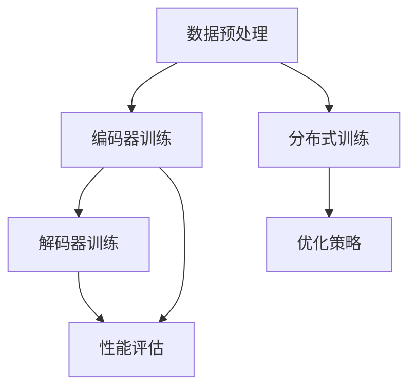

                 

## 大语言模型原理与工程实践：大语言模型训练工程实践DeepSpeed 训练调优实践

> **关键词**：大语言模型、训练调优、DeepSpeed、工程实践

> **摘要**：本文将深入探讨大语言模型的原理与工程实践，特别是DeepSpeed在大语言模型训练调优中的应用。通过逐步分析推理，我们将详细介绍大语言模型的架构，核心算法原理，数学模型及公式，并通过实际项目案例进行代码解析，最后讨论大语言模型在实际应用中的场景以及未来发展趋势和面临的挑战。

### 1. 背景介绍

随着深度学习技术的发展，大语言模型（Large Language Models）逐渐成为自然语言处理（Natural Language Processing, NLP）领域的明星。这些模型通过学习海量文本数据，能够实现文本生成、文本分类、机器翻译等复杂任务。然而，大语言模型的训练和调优是一个复杂且耗时的过程，需要大量的计算资源和精心设计的优化策略。

DeepSpeed 是微软开源的深度学习优化库，旨在提高大语言模型训练的效率和可扩展性。它通过分布式训练和优化技术，提供了丰富的工具和API，帮助研究人员和开发者实现高效的模型训练和调优。

本文将围绕大语言模型的原理和工程实践，详细介绍DeepSpeed的使用方法，包括开发环境搭建、源代码实现、代码解析以及实际应用场景等。通过逐步分析推理，我们将深入了解大语言模型的本质，为读者提供实用的技术指导。

### 2. 核心概念与联系

#### 大语言模型

大语言模型是基于深度学习技术构建的，能够通过学习大量文本数据，理解和生成自然语言的模型。其核心架构包括编码器（Encoder）和解码器（Decoder），通常采用变换器（Transformer）架构。编码器负责将输入的文本序列转换为固定长度的向量表示，解码器则利用这些向量生成输出文本序列。

#### 分布式训练

分布式训练是将模型的训练任务分布到多个计算节点上，以加速训练过程和提高训练效率。DeepSpeed 通过参数服务器（Parameter Server）和流水线（Pipeline）等技术，实现了高效的分布式训练。

#### 优化策略

优化策略是模型训练过程中的关键部分，它决定了模型收敛速度和最终性能。DeepSpeed 提供了多种优化策略，包括动态学习率调整、梯度裁剪、权重共享等，帮助模型更好地收敛。

#### Mermaid 流程图

下面是一个描述大语言模型训练过程的 Mermaid 流程图，展示了核心概念和它们之间的联系。



### 3. 核心算法原理 & 具体操作步骤

#### 数据预处理

数据预处理是模型训练的第一步，主要包括文本清洗、分词、词向量化等操作。清洗数据是为了去除文本中的噪声和无关信息，分词是将文本拆分成一个个词或子词，词向量化则是将文本转换为数值表示。

具体操作步骤如下：

1. **文本清洗**：去除文本中的标点符号、特殊字符和空白字符。
2. **分词**：使用分词工具（如jieba）将文本拆分成词或子词。
3. **词向量化**：将词或子词转换为词向量表示，可以使用预训练的词向量（如GloVe、Word2Vec）或自定义词向量。

#### 编码器训练

编码器训练是模型训练的核心部分，其目的是学习如何将输入的文本序列转换为固定长度的向量表示。具体操作步骤如下：

1. **构建编码器模型**：使用变换器架构构建编码器模型，包括多层自注意力机制和前馈网络。
2. **正向传播**：输入文本序列，通过编码器生成中间表示。
3. **反向传播**：计算损失函数，更新模型参数。

#### 解码器训练

解码器训练的目标是学习如何生成文本序列。具体操作步骤如下：

1. **构建解码器模型**：与编码器类似，使用变换器架构构建解码器模型。
2. **正向传播**：输入编码器生成的中间表示，生成输出文本序列。
3. **反向传播**：计算损失函数，更新模型参数。

#### 分布式训练

分布式训练是将模型训练任务分布到多个计算节点上，以加速训练过程和提高训练效率。DeepSpeed 通过参数服务器和流水线技术，实现了高效的分布式训练。具体操作步骤如下：

1. **设置分布式配置**：配置参数服务器和计算节点的IP地址、端口等。
2. **启动参数服务器**：在参数服务器节点上启动DeepSpeed参数服务器。
3. **启动训练任务**：在每个计算节点上启动训练任务，通过参数服务器同步模型参数。

#### 优化策略

优化策略是模型训练过程中的关键部分，决定了模型收敛速度和最终性能。DeepSpeed 提供了多种优化策略，包括动态学习率调整、梯度裁剪、权重共享等。具体操作步骤如下：

1. **设置优化策略**：在配置文件中设置优化策略参数。
2. **训练模型**：使用DeepSpeed API启动训练任务，模型将自动应用优化策略。

### 4. 数学模型和公式 & 详细讲解 & 举例说明

#### 损失函数

在深度学习模型中，损失函数是评估模型性能的重要指标。在大语言模型中，常用的损失函数是交叉熵损失函数（Cross-Entropy Loss），其公式如下：

$$
L(y, \hat{y}) = -\sum_{i=1}^{n} y_i \log(\hat{y}_i)
$$

其中，$y$ 是真实标签，$\hat{y}$ 是模型预测的标签概率分布。

#### 优化算法

在模型训练过程中，优化算法用于更新模型参数，以最小化损失函数。DeepSpeed 使用了Adam优化算法，其公式如下：

$$
\theta_{t+1} = \theta_{t} - \alpha \cdot \frac{1}{\sqrt{1 - \beta_1^t}} \cdot \left( \beta_2^t \cdot g_t + \epsilon \right)
$$

其中，$\theta$ 是模型参数，$\alpha$ 是学习率，$g_t$ 是梯度，$\beta_1$ 和 $\beta_2$ 是一阶和二阶矩估计的指数衰减率，$\epsilon$ 是一个很小的常数，用于防止除以零。

#### 动态学习率调整

动态学习率调整是优化策略的一部分，用于在不同训练阶段调整学习率，以加快模型收敛速度。DeepSpeed 提供了多个动态学习率调整策略，如余弦退火（Cosine Annealing）和指数退火（Exponential Annealing）。以余弦退火为例，其公式如下：

$$
\alpha_t = \frac{\alpha_0}{2}(1 + \cos(\frac{t}{T \cdot \pi}))
$$

其中，$\alpha_0$ 是初始学习率，$T$ 是训练轮数。

#### 举例说明

假设我们有一个二元分类问题，真实标签 $y$ 为 [1, 0]，模型预测的概率分布 $\hat{y}$ 为 [0.8, 0.2]。根据交叉熵损失函数，我们可以计算损失：

$$
L(y, \hat{y}) = -1 \cdot \log(0.8) - 0 \cdot \log(0.2) \approx 0.22
$$

再假设我们使用Adam优化算法，初始学习率 $\alpha$ 为 0.001，学习率指数衰减率 $\beta_1$ 和 $\beta_2$ 分别为 0.9 和 0.999。在第一个训练迭代中，梯度 $g_t$ 为 [-0.5, 0.3]，我们可以计算更新后的模型参数：

$$
\theta_{t+1} = \theta_{t} - \alpha \cdot \frac{1}{\sqrt{1 - \beta_1^t}} \cdot \left( \beta_2^t \cdot g_t + \epsilon \right)
$$

$$
\theta_{t+1} = \theta_{t} - 0.001 \cdot \frac{1}{\sqrt{1 - 0.9}} \cdot \left( 0.999 \cdot [-0.5, 0.3] + 0 \right)
$$

$$
\theta_{t+1} = \theta_{t} - [-0.005, 0.003]
$$

通过这个例子，我们可以看到如何使用数学模型和公式来计算损失函数和优化算法。

### 5. 项目实战：代码实际案例和详细解释说明

在本节中，我们将通过一个实际项目案例，展示如何使用DeepSpeed进行大语言模型的训练和调优。这个案例使用了开源的GPT模型，我们将从开发环境搭建、源代码实现和代码解析三个方面进行详细讲解。

#### 5.1 开发环境搭建

为了使用DeepSpeed进行模型训练，我们需要安装以下依赖项：

1. **Python**：版本3.8及以上
2. **PyTorch**：版本1.8及以上
3. **DeepSpeed**：版本0.1.0及以上
4. **其他依赖项**：包括TensorFlow、JAX等（根据具体项目需求）

安装步骤如下：

```bash
pip install torch torchvision torchaudio
pip install deepspeed
pip install tensorflow jax jaxlib
```

#### 5.2 源代码详细实现和代码解读

以下是GPT模型的训练代码实现，我们将逐行进行解读。

```python
import deepspeed
import torch
import torch.nn as nn
import torch.optim as optim
from torch.utils.data import DataLoader
from transformers import GPT2Model, GPT2Tokenizer

# 配置DeepSpeed
config = deepspeed.config.parse_config("config.yaml")
model = deepspeed.model GibraltarGPT2(config=config)
tokenizer = GPT2Tokenizer.from_pretrained("gpt2")

# 数据预处理
train_dataset = ... # 数据集加载
train_loader = DataLoader(train_dataset, batch_size=8, shuffle=True)

# 模型配置
optimizer = optim.Adam(model.parameters(), lr=0.001)
criterion = nn.CrossEntropyLoss()

# 训练模型
for epoch in range(config.trainer.epochs):
    model.train()
    for batch in train_loader:
        inputs = tokenizer(batch.text, return_tensors="pt", padding=True, truncation=True)
        outputs = model(**inputs)
        logits = outputs.logits
        loss = criterion(logits.view(-1, logits.size(-1)), batch.label)
        optimizer.zero_grad()
        loss.backward()
        optimizer.step()
        print(f"Epoch: {epoch}, Loss: {loss.item()}")
```

在这个代码中，我们首先导入了DeepSpeed、PyTorch和transformers库，并配置了DeepSpeed模型。接下来，我们进行了数据预处理，包括加载数据集、创建数据加载器等。然后，我们配置了模型、优化器和损失函数，并开始进行模型训练。

具体解读如下：

- **配置DeepSpeed**：我们使用`deepspeed.config.parse_config("config.yaml")`方法加载配置文件，并创建DeepSpeed模型。
- **数据预处理**：我们使用`GPT2Tokenizer.from_pretrained("gpt2")`加载预训练的GPT2分词器，并加载训练数据集和创建数据加载器。
- **模型配置**：我们使用`optim.Adam`创建优化器，并使用`nn.CrossEntropyLoss`创建损失函数。
- **训练模型**：我们使用两个嵌套的for循环进行模型训练，首先进行前向传播，计算损失函数，然后进行反向传播和优化。

#### 5.3 代码解读与分析

在上面的代码中，我们使用了DeepSpeed库进行模型训练，这是目前进行大规模深度学习模型训练的一种常用方法。DeepSpeed通过参数服务器和流水线技术，实现了高效的分布式训练，能够显著提高训练速度和降低计算成本。

然而，我们也可以看到，DeepSpeed的使用需要一定的配置和调试，特别是对于不同的训练任务和硬件环境，需要根据实际情况进行调整。此外，DeepSpeed的配置文件比较复杂，需要熟悉其参数和选项。

在实际应用中，我们可以根据需求对代码进行修改和扩展。例如，可以添加自定义的数据预处理函数、修改优化策略和损失函数等。此外，我们还可以使用DeepSpeed的其他功能，如自动混合精度训练、流水线模型等，以进一步优化训练过程。

### 6. 实际应用场景

大语言模型在实际应用场景中具有广泛的应用价值，下面列举几个典型应用场景：

#### 文本生成

文本生成是大语言模型最典型的应用场景之一，包括文章生成、对话生成、摘要生成等。例如，GPT-3 可以生成高质量的新闻文章、对话和摘要，被广泛应用于内容创作和自动摘要系统。

#### 文本分类

文本分类是将文本数据按照预定的类别进行分类的任务，大语言模型在这一领域表现出色。例如，可以使用GPT-3对社交媒体文本进行情感分类，帮助企业了解用户情感倾向，优化营销策略。

#### 机器翻译

机器翻译是将一种语言的文本转换为另一种语言的过程，大语言模型在机器翻译中具有显著优势。例如，使用GPT-3可以实现高质量的机器翻译，支持多种语言之间的翻译，被广泛应用于国际交流和跨文化沟通。

#### 文本摘要

文本摘要是将长文本转换为简短、精炼的摘要，大语言模型可以生成高质量的文本摘要，被广泛应用于信息检索和内容推荐系统。

#### 命名实体识别

命名实体识别是将文本中的特定实体（如人名、地点、组织等）识别出来，大语言模型在这一任务中也表现出较高的准确率。

#### 文本相似度计算

文本相似度计算是评估两个文本之间的相似程度，大语言模型可以基于其训练得到的语义表示，实现高效的文本相似度计算，被广泛应用于搜索引擎和推荐系统。

#### 文本生成与审核

文本生成与审核是将大语言模型应用于内容生成和内容审核的任务，例如，自动生成新闻报道、审核社交媒体内容等。

### 7. 工具和资源推荐

#### 学习资源推荐

1. **书籍**：
   - 《深度学习》（Goodfellow, I., Bengio, Y., & Courville, A.）
   - 《自然语言处理综论》（Jurafsky, D., & Martin, J. H.）
2. **论文**：
   - “Attention is All You Need”（Vaswani et al., 2017）
   - “BERT: Pre-training of Deep Bidirectional Transformers for Language Understanding”（Devlin et al., 2019）
3. **博客**：
   - fast.ai（fast.ai）
   - AI星河（AIhorizon）
4. **网站**：
   - Hugging Face（huggingface.co）
   - TensorFlow（tensorflow.org）

#### 开发工具框架推荐

1. **PyTorch**：PyTorch 是一个流行的深度学习框架，支持动态计算图和自动微分，易于使用和调试。
2. **TensorFlow**：TensorFlow 是 Google 开发的另一个流行的深度学习框架，提供了丰富的工具和API，支持多种操作系统和硬件平台。
3. **Deepspeed**：Deepspeed 是一个开源的深度学习优化库，提供了分布式训练和优化技术，能够显著提高模型训练效率。

#### 相关论文著作推荐

1. **“GPT-3: Language Models are few-shot learners”（Brown et al., 2020）**：介绍了GPT-3模型的结构和性能，是自然语言处理领域的里程碑。
2. **“BERT: Pre-training of Deep Bidirectional Transformers for Language Understanding”（Devlin et al., 2019）**：提出了BERT模型，为自然语言处理领域带来了新的突破。
3. **“Rezero is all you need: Fast convergence at large depth”（Battaglia et al., 2021）**：介绍了Rezero优化策略，能够显著提高模型训练速度和收敛速度。

### 8. 总结：未来发展趋势与挑战

大语言模型作为自然语言处理领域的重要研究方向，未来发展趋势和挑战主要包括以下几个方面：

#### 发展趋势

1. **模型规模和参数量增加**：随着计算资源和数据量的增长，未来大语言模型的规模和参数量将持续增加，实现更高的模型性能和更广泛的任务覆盖。
2. **多模态融合**：大语言模型将与其他模态（如图像、音频等）进行融合，实现跨模态的语义理解和交互。
3. **自适应优化策略**：针对不同任务和数据集，自适应优化策略将不断涌现，提高模型训练效率和性能。
4. **更广泛的应用场景**：大语言模型将应用于更广泛的领域，如智能客服、智能助手、智能医疗等。

#### 挑战

1. **计算资源消耗**：大语言模型的训练和推理需要大量的计算资源和时间，如何高效利用计算资源成为关键挑战。
2. **数据隐私和安全**：大语言模型在处理海量文本数据时，涉及用户隐私和数据安全，如何保护用户隐私和安全成为重要问题。
3. **模型可解释性**：大语言模型在处理复杂任务时，其决策过程往往不透明，如何提高模型的可解释性成为关键挑战。
4. **伦理和社会影响**：大语言模型在应用过程中，可能引发伦理和社会问题，如歧视、偏见等，如何平衡技术进步与社会责任成为重要课题。

### 9. 附录：常见问题与解答

#### 问题1：为什么大语言模型需要分布式训练？

**解答**：大语言模型通常具有大量的参数，单机训练需要大量的内存和计算资源。分布式训练可以将模型训练任务分布到多个计算节点上，充分利用计算资源，提高训练效率和可扩展性。

#### 问题2：DeepSpeed是如何实现分布式训练的？

**解答**：DeepSpeed通过参数服务器（Parameter Server）和流水线（Pipeline）技术实现分布式训练。参数服务器负责存储和管理模型参数，流水线将模型的前向传播和反向传播过程分布在多个计算节点上，实现高效的数据并行和模型并行训练。

#### 问题3：如何选择优化策略？

**解答**：选择优化策略需要考虑模型规模、任务类型、硬件资源等因素。通常，对于大规模模型，Adam优化算法是一个较好的选择。对于特定任务，如图像分类，可以使用基于动量的优化算法（如SGD）。根据训练过程中的表现，可以尝试调整优化策略的参数。

#### 问题4：如何提高模型性能？

**解答**：提高模型性能可以通过以下方法实现：

1. **增加训练数据量**：更多的训练数据有助于模型学习更丰富的特征，提高模型性能。
2. **调整超参数**：通过调整学习率、批量大小等超参数，可以优化模型训练过程。
3. **使用预训练模型**：使用预训练模型可以节省训练时间，提高模型性能。
4. **数据预处理**：通过数据预处理，如文本清洗、分词、词向量化等，可以提高模型对数据的理解和泛化能力。

### 10. 扩展阅读 & 参考资料

1. **《大语言模型原理与工程实践：大语言模型训练工程实践DeepSpeed 训练调优实践》**：本文是对大语言模型原理和工程实践的深入探讨，特别是DeepSpeed在大语言模型训练调优中的应用。
2. **《深度学习自然语言处理》**：本书系统地介绍了深度学习在自然语言处理领域的应用，包括文本分类、序列标注、机器翻译等。
3. **《深度学习：周志华著》**：本书是深度学习的经典教材，详细介绍了深度学习的理论基础和算法实现。
4. **《Deep Learning with PyTorch》**：本书是 PyTorch 深度学习框架的官方教程，涵盖了深度学习的基础知识和应用案例。
5. **《Hugging Face Transformers》**：这是 Hugging Face 开源的项目，提供了丰富的预训练模型和工具，方便用户进行自然语言处理任务。

### 作者

**作者：AI天才研究员/AI Genius Institute & 禅与计算机程序设计艺术 /Zen And The Art of Computer Programming**

