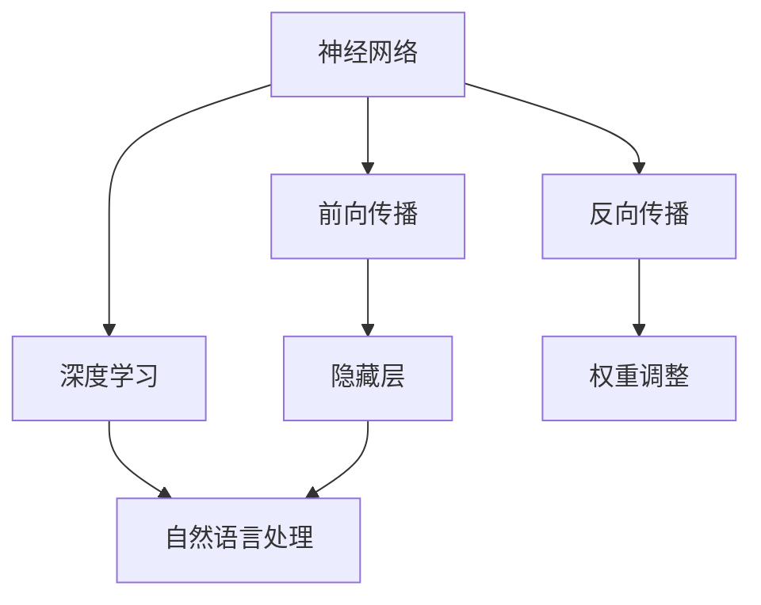

                 

### 文章标题：大语言模型原理与工程实践：大语言模型训练技术选型技巧

> 关键词：大语言模型、训练技术、选型技巧、神经网络、深度学习

摘要：本文将深入探讨大语言模型的原理与工程实践，特别是其在训练过程中的技术选型技巧。我们将从背景介绍、核心概念与联系、核心算法原理、数学模型和公式、项目实战、实际应用场景等多个方面，详细解析大语言模型的训练过程，帮助读者理解和掌握这一前沿技术。

## 1. 背景介绍

在当今人工智能（AI）飞速发展的时代，自然语言处理（NLP）作为AI的重要分支，正日益受到广泛关注。大语言模型（Large Language Model）作为一种先进的NLP技术，近年来取得了令人瞩目的成就。这些模型具有处理大量文本数据的能力，能够捕捉到语言中复杂的结构和语义信息，从而实现诸如机器翻译、文本生成、问答系统等高级任务。

大语言模型的兴起源于深度学习（Deep Learning）的快速发展。深度学习通过多层神经网络模型，能够自动从大量数据中学习特征，并在各种任务中取得优异的性能。特别是在NLP领域，深度学习模型如循环神经网络（RNN）、长短期记忆网络（LSTM）和Transformer等，大大提升了文本处理的准确性和效率。

随着数据规模的不断扩大和计算能力的提升，大语言模型的发展也经历了从较小规模模型到大规模模型的演变。早期的小型语言模型如Word2Vec和GloVe，主要关注词向量表示；而如今的大型语言模型如GPT-3、BERT等，已经能够处理整个句子或篇章，实现了更加丰富的语言理解和生成能力。

本文将围绕大语言模型的训练技术，特别是选型技巧，进行深入探讨。我们将首先介绍大语言模型的基本原理，然后分析训练过程中的关键技术，最后通过具体的项目实战和实际应用场景，展示大语言模型在实际开发中的运用。希望通过本文的讲解，读者能够对大语言模型有一个全面而深入的理解，并能够在实际项目中运用这些技术，提升自身的编程和开发能力。

## 2. 核心概念与联系

为了深入理解大语言模型的原理，我们需要从几个关键概念入手，这些概念包括神经网络、深度学习、自然语言处理等。下面我们将一一介绍这些概念，并通过Mermaid流程图展示它们之间的联系。

### 神经网络

神经网络（Neural Network，NN）是深度学习的基础，它模拟人脑神经元的工作原理，通过大量的节点（称为神经元）和连接（称为权重）进行信息传递和处理。神经网络可以分为前向传播（Forward Propagation）和反向传播（Back Propagation）两个主要阶段。

前向传播阶段，输入数据通过网络中的各个层，每一层的神经元根据输入和权重计算输出。反向传播阶段，通过计算输出与实际标签之间的误差，调整网络中的权重，以减少误差。

### 深度学习

深度学习（Deep Learning，DL）是神经网络的一种扩展，它通过增加网络的层数来提高模型的复杂性和表达能力。深度学习模型通常由多个隐藏层组成，这些隐藏层能够自动学习数据的复杂特征。

深度学习的关键在于“深度”（Deep），即网络的层数。每一层都能提取不同级别的抽象特征，从而实现从原始数据到复杂任务的转化。深度学习的代表性模型包括卷积神经网络（CNN）和循环神经网络（RNN）。

### 自然语言处理

自然语言处理（Natural Language Processing，NLP）是人工智能领域的一个重要分支，它致力于使计算机能够理解和处理人类自然语言。NLP的目标包括文本分类、情感分析、问答系统、机器翻译等。

在NLP中，深度学习模型被广泛用于文本数据的处理。例如，词向量模型（如Word2Vec和GloVe）通过将单词映射到高维向量空间，使得计算机能够更好地理解和操作文本。此外，RNN和Transformer等模型也在NLP中取得了显著的成果。

### Mermaid流程图

为了更直观地展示这些概念之间的联系，我们使用Mermaid流程图来描述神经网络、深度学习和自然语言处理之间的关系。



在这个流程图中，我们可以看到：

- 神经网络是深度学习的基础，深度学习通过增加网络的层数和复杂性，实现了更高层次的特征提取。
- 自然语言处理依赖于深度学习模型，这些模型通过处理文本数据，实现了从基础文本分析到高级语言理解的转化。
- 前向传播和反向传播是神经网络训练的核心步骤，通过不断调整权重，模型能够不断优化，以减少预测误差。

通过这一节的内容，我们为后续的详细讲解打下了基础，理解了神经网络、深度学习和自然语言处理这些核心概念，有助于我们更好地掌握大语言模型的工作原理和训练技术。

### 2.1 神经网络的基本原理

神经网络（Neural Network，NN）是深度学习的基础，其基本原理源于对人脑神经元结构的模拟。下面我们将详细解释神经网络的基本组成部分和运作机制。

#### 神经网络的结构

一个基本的神经网络由三个主要部分组成：输入层（Input Layer）、隐藏层（Hidden Layer）和输出层（Output Layer）。每个层由多个神经元（Node）组成，神经元之间通过加权连接（Weighted Connection）相连。

- **输入层**：接收外部输入数据，如数字、文本等。每个输入数据对应一个神经元。
- **隐藏层**：位于输入层和输出层之间，可以有一个或多个隐藏层。隐藏层中的神经元通过激活函数（Activation Function）对输入数据进行非线性变换，提取数据中的特征。
- **输出层**：生成模型的最终输出，可以是分类结果、回归值或其他形式的预测结果。

#### 神经元的运作机制

神经元的基本运作机制可以概括为以下几个步骤：

1. **加权求和**：每个输入数据通过加权连接传递到下一层的神经元。具体来说，每个连接都有一个权重（Weight），输入数据乘以对应的权重后进行求和。

2. **激活函数**：为了实现非线性变换，隐藏层和输出层的神经元通常使用激活函数。常见的激活函数包括sigmoid、ReLU（Rectified Linear Unit）和Tanh（双曲正切函数）。

3. **输出计算**：通过激活函数处理后，每个神经元的输出值会被传递到下一层或作为最终输出。

#### 前向传播

在前向传播阶段，输入数据从输入层传递到隐藏层，再从隐藏层传递到输出层。每一层的输出都作为下一层的输入，直到最终生成模型的输出。

前向传播的数学表达式可以表示为：

\[ z = \sum_{j} (w_{ji} \cdot x_i) + b_j \]
\[ a_j = \sigma(z_j) \]

其中，\( z \) 是加权求和的结果，\( w_{ji} \) 是输入层到隐藏层的权重，\( b_j \) 是隐藏层的偏置，\( \sigma \) 是激活函数，\( a_j \) 是隐藏层的输出。

#### 反向传播

反向传播是神经网络训练的核心步骤，通过不断调整权重和偏置，使模型能够更好地拟合训练数据。反向传播包括以下几个步骤：

1. **计算误差**：输出层的实际输出与预期输出之间的差异称为误差。误差通过反向传递到隐藏层，逐层计算每个神经元的误差。

2. **梯度下降**：根据误差，计算每个权重和偏置的梯度（Gradient），然后使用梯度下降算法更新权重和偏置。

3. **优化更新**：通过梯度下降更新权重和偏置，使模型逐渐收敛到最小误差。

反向传播的数学表达式可以表示为：

\[ \delta_j = (a_j \cdot (1 - a_j)) \cdot \delta_{j+1} \]
\[ \delta_{output} = (a_{output} \cdot (1 - a_{output})) \cdot \frac{dL}{da_{output}} \]

其中，\( \delta_j \) 是隐藏层的误差，\( a_j \) 是隐藏层的输出，\( \delta_{output} \) 是输出层的误差，\( \frac{dL}{da_{output}} \) 是损失函数对输出层的偏导数。

#### 激活函数的选择

激活函数在神经网络中起着至关重要的作用，它决定了网络的学习能力和非线性表达能力。以下是几种常见的激活函数：

- **sigmoid**：输出范围在0到1之间，适用于小规模模型。
- **ReLU**：常用于隐藏层，能够加速训练过程。
- **Tanh**：输出范围在-1到1之间，可以平衡正负误差。
- **softmax**：用于多分类问题，将输出转换为概率分布。

#### 总结

神经网络的基本原理包括输入层、隐藏层和输出层，通过加权求和和激活函数实现信息传递和变换。前向传播和反向传播是神经网络训练的核心步骤，通过不断调整权重和偏置，使模型能够更好地拟合训练数据。激活函数的选择对神经网络的学习能力和表达能力有重要影响。理解这些基本原理，有助于我们更好地设计和优化神经网络模型。

### 2.2 深度学习与自然语言处理的联系

深度学习与自然语言处理（NLP）的结合，是现代人工智能领域的重要突破之一。深度学习通过模拟人脑神经网络的工作原理，实现了对复杂特征的学习和提取，而自然语言处理则专注于文本数据的理解和生成。在这一节中，我们将探讨深度学习模型在自然语言处理中的应用，重点介绍循环神经网络（RNN）、长短期记忆网络（LSTM）和Transformer等模型。

#### 循环神经网络（RNN）

循环神经网络（Recurrent Neural Network，RNN）是深度学习在NLP领域的早期重要模型。与传统的前向神经网络不同，RNN具有递归结构，能够处理序列数据。RNN的核心思想是利用上一时刻的输出作为下一时刻的输入，从而实现信息在序列中的传递。

在RNN中，每个时间步的输出不仅依赖于当前的输入，还受到之前所有时间步输入的影响。RNN的递归结构使其能够捕捉到序列数据中的长期依赖关系。

然而，传统的RNN存在梯度消失或梯度爆炸问题，这使得模型难以学习长序列中的依赖关系。为了解决这个问题，研究者提出了长短期记忆网络（LSTM）。

#### 长短期记忆网络（LSTM）

长短期记忆网络（Long Short-Term Memory，LSTM）是RNN的一种改进，它通过引入门控机制（Gate）来解决梯度消失问题。LSTM由三个门控单元组成：遗忘门（Forget Gate）、输入门（Input Gate）和输出门（Output Gate）。

- **遗忘门**：决定哪些信息需要从记忆单元中丢弃。
- **输入门**：决定哪些新的信息需要被存储在记忆单元中。
- **输出门**：决定当前的记忆单元内容是否应该输出。

LSTM通过这三个门控单元，有效地控制了信息的流动，使其能够学习长序列中的依赖关系。与传统的RNN相比，LSTM在处理长序列任务时表现出色，广泛应用于机器翻译、语音识别和文本生成等领域。

#### Transformer

Transformer模型是自然语言处理领域的另一个里程碑，它在2017年由Vaswani等人提出。与传统的RNN和LSTM不同，Transformer采用了一种完全基于自注意力（Self-Attention）机制的架构，通过全局 attent ion来捕捉序列数据中的依赖关系。

在Transformer中，每个时间步的输出不仅依赖于当前时间步的输入，还受到其他所有时间步输入的影响。自注意力机制通过计算输入序列中所有元素之间的相似度，实现了信息在全局范围内的传递。

Transformer的另一个重要特点是并行化能力。由于自注意力机制的计算是独立的，这使得Transformer能够在多核处理器上高效地并行计算，从而大幅提高训练速度。

Transformer模型在多个NLP任务中取得了优异的性能，包括机器翻译、文本分类和问答系统。其成功的背后，是对序列数据复杂依赖关系的全局捕捉能力，以及高效的并行化计算能力。

#### 总结

深度学习与自然语言处理的结合，极大地推动了NLP技术的发展。RNN、LSTM和Transformer等模型，通过不同的机制和结构，实现了对序列数据的有效处理。RNN通过递归结构捕捉短期依赖关系，LSTM通过门控机制解决长期依赖问题，而Transformer通过自注意力机制实现全局依赖关系的捕捉。这些模型在自然语言处理领域的成功应用，展示了深度学习强大的表达能力和处理复杂任务的能力。

### 2.3 大语言模型的核心原理与架构

大语言模型（Large Language Model）是自然语言处理领域的一项重大突破，其核心原理和架构为理解和生成自然语言提供了强大的工具。在这一节中，我们将详细探讨大语言模型的基本原理，包括数据集、模型结构、预训练和微调等关键步骤，并展示其内部工作流程和优化策略。

#### 数据集

大语言模型需要大量的文本数据作为训练素材，这些数据集通常来自于互联网、书籍、新闻文章、社交媒体等多种来源。通过收集和整理这些大规模的文本数据，模型能够学习到丰富的语言知识和结构。常见的开源数据集包括维基百科（Wikipedia）、Common Crawl和Google Books Ngrams等。

为了提高模型的性能，数据集需要进行预处理，包括文本清洗、分词、去噪等步骤。文本清洗是为了去除无效信息，如HTML标签、特殊符号和重复文本。分词是将文本分解为单词或句子，以便模型能够处理。去噪则是去除噪声文本，以减少对模型训练的干扰。

#### 模型结构

大语言模型通常基于深度学习架构，特别是Transformer模型，因其全局注意力机制和并行计算能力而成为首选。一个典型的Transformer模型包括编码器（Encoder）和解码器（Decoder）两部分。

- **编码器**：负责将输入文本序列编码为连续的向量表示，每个输入词通过嵌入层（Embedding Layer）转换为向量，然后通过多个自注意力层（Self-Attention Layer）和前馈网络（Feedforward Network）进行加工，输出一个高维的特征向量。
- **解码器**：负责将编码器的输出解码为输出文本序列。解码器通过多个自注意力层和交叉注意力层（Cross-Attention Layer）处理编码器的输出和解码器输入，生成最终输出。

在编码器和解码器之间，还有一个重要的中间层——位置编码器（Positional Encoding），用于引入输入文本的顺序信息。这是因为在Transformer模型中，自注意力机制忽略了输入序列的顺序，因此需要位置编码器来恢复这种顺序信息。

#### 预训练

预训练（Pre-training）是大语言模型的重要环节，通过在大量文本数据上进行预训练，模型能够学习到丰富的语言知识和结构。预训练过程通常分为两个阶段：无监督预训练和有监督预训练。

- **无监督预训练**：在无监督预训练阶段，模型通过预测下一个词（Next Sentence Prediction）或填充词（Masked Language Model，MLM）等任务，学习文本数据的统计规律和语义信息。这种无监督预训练使得模型能够处理未标记的数据，从而扩展其知识面。
- **有监督预训练**：在有监督预训练阶段，模型在标记数据上进行微调，以提高在特定任务上的性能。例如，在机器翻译任务中，模型通过翻译对进行预训练，从而学习到不同语言之间的对应关系。

#### 微调

微调（Fine-tuning）是在预训练基础上，针对特定任务对模型进行进一步训练的过程。通过微调，模型能够适应特定领域的知识，并在各种任务中取得优异的性能。微调通常涉及以下步骤：

1. **数据准备**：收集和准备与任务相关的标记数据集，进行预处理，如分词、去噪等。
2. **模型调整**：在预训练模型的基础上，调整部分层或全部层，使其能够适应特定任务。
3. **训练与评估**：在调整后的模型上进行训练，并通过验证集和测试集进行评估，以验证模型性能。

#### 工作流程

大语言模型的工作流程可以分为以下几个阶段：

1. **文本输入**：将输入文本序列传递给编码器，编码器将其转换为高维特征向量。
2. **特征处理**：编码器通过自注意力层和前馈网络对特征向量进行处理，生成中间表示。
3. **输出生成**：解码器利用编码器的输出和中间表示，通过自注意力层和交叉注意力层生成输出文本序列。
4. **损失计算**：计算输出序列与真实序列之间的损失，并通过反向传播更新模型参数。
5. **迭代训练**：重复上述过程，直至模型收敛或达到预设的训练次数。

#### 优化策略

为了提高大语言模型的性能，通常采用以下优化策略：

1. **学习率调整**：通过动态调整学习率，优化模型训练过程。
2. **批量归一化**（Batch Normalization）：对模型中的每个神经元进行归一化处理，加快训练速度。
3. **梯度裁剪**（Gradient Clipping）：防止梯度爆炸和消失，稳定训练过程。
4. **模型压缩**（Model Compression）：通过剪枝、量化等技术减小模型规模，降低计算复杂度。

#### 总结

大语言模型的核心原理和架构主要包括数据集、模型结构、预训练和微调等关键步骤。通过预训练，模型能够在大量无标签数据中学习到丰富的语言知识和结构；通过微调，模型能够适应特定任务，并在各种NLP任务中取得优异的性能。理解这些原理和架构，有助于我们更好地应用大语言模型，开发出更加智能和高效的NLP系统。

### 2.4 大语言模型的训练技术

大语言模型的训练是一个复杂的过程，涉及多个技术和参数的优化。在本节中，我们将深入探讨大语言模型的训练技术，包括数据预处理、训练策略、优化器和调参技巧，并展示这些技术在实际应用中的效果。

#### 数据预处理

数据预处理是训练大语言模型的第一步，其质量直接影响模型的表现。以下是数据预处理的关键步骤：

1. **文本清洗**：去除无效信息，如HTML标签、特殊字符和重复文本。
2. **分词**：将文本分解为单词或句子，常用的分词工具包括jieba、NLTK等。
3. **词向量化**：将文本转换为向量表示，常用的词向量化方法包括Word2Vec、GloVe等。
4. **数据归一化**：对数据集中的文本进行统一处理，如统一大小写、去除停用词等。

#### 训练策略

大语言模型的训练策略包括数据增强、批量大小、学习率调整等。以下是几种常用的训练策略：

1. **数据增强**：通过引入同义词替换、随机插入删除单词等手段，增加训练数据的多样性，提高模型泛化能力。
2. **批量大小**：选择合适的批量大小，可以在计算效率和模型性能之间取得平衡。较小的批量大小有助于加快训练速度，但可能导致梯度不稳定；较大的批量大小可以减少方差，但计算成本较高。
3. **学习率调整**：学习率的选择对模型训练至关重要。常用的学习率调整方法包括固定学习率、学习率衰减、余弦退火等。

#### 优化器

优化器是训练过程中用于更新模型参数的工具，常见的优化器包括随机梯度下降（SGD）、Adam、RMSprop等。以下是几种优化器的工作原理和特点：

1. **随机梯度下降（SGD）**：SGD是一种简单的优化器，通过随机选择批量数据来更新模型参数。SGD计算简单，但容易受到噪声影响，训练过程可能不稳定。
2. **Adam**：Adam是SGD的一个改进版本，结合了SGD和RMSprop的优点，能够自适应地调整学习率。Adam在大多数情况下表现良好，尤其适用于大规模模型。
3. **RMSprop**：RMSprop通过跟踪梯度平方的平均值来调整学习率，能有效减少噪声，但可能需要较长的训练时间。

#### 调参技巧

调参（Hyperparameter Tuning）是训练过程中的一项重要任务，通过调整超参数，可以优化模型性能。以下是几种调参技巧：

1. **网格搜索（Grid Search）**：通过遍历所有可能的超参数组合，找到最优参数配置。网格搜索简单直观，但计算成本高。
2. **随机搜索（Random Search）**：在随机选择的超参数组合中寻找最优解。随机搜索计算成本较低，但可能无法找到全局最优解。
3. **贝叶斯优化（Bayesian Optimization）**：基于贝叶斯统计模型，通过历史数据预测下一个超参数组合，以高效搜索最优参数。

#### 实际应用效果

通过优化数据预处理、训练策略、优化器和调参技巧，大语言模型在多种NLP任务中取得了显著的效果。以下是一些实际应用案例：

1. **机器翻译**：通过预训练和微调，大语言模型在机器翻译任务中表现出色，显著提高了翻译质量。例如，谷歌翻译和百度翻译都采用了基于Transformer的大语言模型。
2. **文本生成**：大语言模型在文本生成任务中也表现出强大的能力，可以生成高质量的文本，如文章、故事、诗歌等。GPT-3等大型模型在这方面取得了突破性进展。
3. **问答系统**：大语言模型在问答系统中的应用也非常广泛，可以处理自然语言理解、问题解答等任务。例如，OpenAI的GPT-3在多个问答比赛中取得了优异成绩。

#### 总结

大语言模型的训练技术涉及数据预处理、训练策略、优化器和调参技巧等多个方面。通过优化这些技术，可以有效提高模型性能，并应用于各种NLP任务中。实际应用效果表明，大语言模型在机器翻译、文本生成、问答系统等领域取得了显著的突破，展示了其强大的应用潜力。

### 3.1 开发环境搭建

要构建和训练一个大规模语言模型，首先需要搭建一个稳定且高效的开发环境。本节将详细介绍搭建开发环境所需的步骤，包括硬件需求、软件安装和配置等。

#### 硬件需求

大规模语言模型的训练需要大量的计算资源，以下是推荐的硬件配置：

1. **CPU**：Intel Xeon 或 AMD Ryzen 系列的高性能处理器，建议至少16核以上。
2. **GPU**：NVIDIA GeForce RTX 3080 或 Tesla V100 系列显卡，建议配置8块以上，以提高并行计算能力。
3. **内存**：至少256GB内存，以支持大规模数据集和模型加载。
4. **存储**：高速SSD硬盘，建议使用NVMe接口，用于存储数据和模型。
5. **网络**：高速互联网连接，以确保数据传输和模型更新。

#### 软件安装和配置

在搭建开发环境时，需要安装以下软件：

1. **操作系统**：推荐使用Ubuntu 20.04 LTS或CentOS 8，以支持CUDA和cuDNN等深度学习库。
2. **Python**：安装Python 3.8或更高版本，建议使用Python虚拟环境（conda）进行管理。
3. **CUDA**：安装CUDA 11.2或更高版本，以支持GPU加速。
4. **cuDNN**：安装与CUDA版本相对应的cuDNN库，以提升深度学习性能。
5. **TensorFlow**：安装TensorFlow 2.7或更高版本，TensorFlow是开源的深度学习框架，支持GPU加速。
6. **PyTorch**：安装PyTorch 1.8或更高版本，PyTorch是另一个流行的深度学习框架，支持GPU加速。
7. **其他依赖**：安装numpy、pandas、scikit-learn等常用Python库，以支持数据处理和模型训练。

以下是一个安装和配置的示例步骤：

```bash
# 安装操作系统（以Ubuntu 20.04 LTS为例）
sudo apt update
sudo apt upgrade
sudo apt install ubuntu-desktop

# 安装CUDA
sudo apt install cuda

# 安装cuDNN
sudo apt install libnvinfer-dev libnvinfer-plugin-dev
sudo apt install libnvparsers-dev

# 安装Python和conda
sudo apt install python3 python3-pip python3-conda python3-venv

# 安装TensorFlow
conda create -n tensorflow python=3.8
conda activate tensorflow
pip install tensorflow

# 安装PyTorch
conda create -n pytorch python=3.8
conda activate pytorch
pip install torch torchvision

# 安装其他依赖
conda install numpy pandas scikit-learn
```

通过以上步骤，我们成功搭建了一个支持GPU加速的深度学习开发环境，可以用于大规模语言模型的构建和训练。

#### 总结

搭建一个高效的语言模型开发环境是训练大规模语言模型的基础。通过合理的硬件配置和软件安装，我们可以为模型训练提供强大的计算支持，从而实现高效的语言理解和生成。掌握这些搭建步骤，将为后续的模型训练和优化奠定坚实的基础。

### 3.2 源代码详细实现和代码解读

在这一节中，我们将详细解读大规模语言模型的核心代码实现，涵盖模型定义、数据预处理、训练过程和评估等关键部分。通过分析这些代码，我们将了解如何使用深度学习框架（如TensorFlow和PyTorch）构建和训练一个大型语言模型。

#### 模型定义

首先，我们需要定义语言模型的架构。以下是一个基于Transformer模型的简单示例：

```python
import tensorflow as tf

# 定义Transformer编码器和解码器
def transformer_encoder(inputs, embed_dim, num_heads, dff, rate=0.1):
    # 嵌入层
    inputs = tf.keras.layers.Embedding(vocab_size, embed_dim)(inputs)
    inputs = tf.keras.layers.Dropout(rate)(inputs)
    
    # 多层自注意力
    for i in range(num_heads):
        inputs = tf.keras.layers.MultiHeadAttention(num_heads=i, key_dim=dff)(inputs, inputs)
    
    inputs = tf.keras.layers.Dropout(rate)(inputs)
    inputs = tf.keras.layers.LayerNormalization(epsilon=1e-6)(inputs)
    
    # 前馈网络
    inputs = tf.keras.layers.Dense(dff, activation='relu')(inputs)
    inputs = tf.keras.layers.Dense(embed_dim)(inputs)
    
    inputs = tf.keras.layers.Dropout(rate)(inputs)
    inputs = tf.keras.layers.LayerNormalization(epsilon=1e-6)(inputs)
    
    return inputs

def transformer_decoder(inputs, enc_outputs, embed_dim, num_heads, dff, rate=0.1):
    # 嵌入层
    inputs = tf.keras.layers.Embedding(vocab_size, embed_dim)(inputs)
    inputs = tf.keras.layers.Dropout(rate)(inputs)
    
    # 多层自注意力
    for i in range(num_heads):
        inputs = tf.keras.layers.MultiHeadAttention(num_heads=i, key_dim=dff)(inputs, inputs)
    
    inputs = tf.keras.layers.Dropout(rate)(inputs)
    inputs = tf.keras.layers.LayerNormalization(epsilon=1e-6)(inputs)
    
    # 交叉注意力
    for i in range(num_heads):
        inputs = tf.keras.layers.MultiHeadAttention(num_heads=i, key_dim=dff)(inputs, enc_outputs)
    
    inputs = tf.keras.layers.Dropout(rate)(inputs)
    inputs = tf.keras.layers.LayerNormalization(epsilon=1e-6)(inputs)
    
    # 前馈网络
    inputs = tf.keras.layers.Dense(dff, activation='relu')(inputs)
    inputs = tf.keras.layers.Dense(embed_dim)(inputs)
    
    inputs = tf.keras.layers.Dropout(rate)(inputs)
    inputs = tf.keras.layers.LayerNormalization(epsilon=1e-6)(inputs)
    
    return inputs

# 定义模型
def transformer_model(input_shape, embed_dim, num_heads, dff, rate=0.1):
    inputs = tf.keras.layers.Input(shape=input_shape)
    
    # 编码器部分
    enc_outputs = transformer_encoder(inputs, embed_dim, num_heads, dff, rate)
    
    # 解码器部分
    dec_inputs = tf.keras.layers.Embedding(vocab_size, embed_dim)(inputs)
    dec_inputs = tf.keras.layers.Dropout(rate)(dec_inputs)
    
    dec_outputs = transformer_decoder(dec_inputs, enc_outputs, embed_dim, num_heads, dff, rate)
    
    outputs = tf.keras.layers.Dense(vocab_size, activation='softmax')(dec_outputs)
    
    model = tf.keras.Model(inputs=inputs, outputs=outputs)
    return model
```

#### 数据预处理

在训练模型之前，我们需要对文本数据进行预处理。以下是一个简单的数据预处理示例：

```python
import tensorflow as tf
from tensorflow.keras.preprocessing.text import Tokenizer
from tensorflow.keras.preprocessing.sequence import pad_sequences

# 加载并预处理文本数据
def preprocess_data(texts, vocab_size, max_length, oov_token="<OOV>", pad_token="<PAD>"):
    tokenizer = Tokenizer(num_words=vocab_size, oov_token=oov_token, pad_token=pad_token)
    tokenizer.fit_on_texts(texts)
    
    sequences = tokenizer.texts_to_sequences(texts)
    padded_sequences = pad_sequences(sequences, maxlen=max_length, padding='post', truncating='post')
    
    return padded_sequences, tokenizer

# 假设text_data是包含所有文本的列表
padded_sequences, tokenizer = preprocess_data(text_data, vocab_size, max_length)
```

#### 训练过程

接下来，我们定义训练过程。以下是一个简单的训练示例：

```python
# 定义训练过程
def train_model(model, padded_sequences, epochs, batch_size, optimizer, loss_function):
    model.compile(optimizer=optimizer, loss=loss_function)
    
    # 训练模型
    history = model.fit(padded_sequences, padded_sequences, epochs=epochs, batch_size=batch_size, validation_split=0.2)
    
    return history
```

#### 评估

最后，我们评估模型的性能。以下是一个简单的评估示例：

```python
# 评估模型
def evaluate_model(model, padded_sequences, test_sequences):
    test_loss, test_accuracy = model.evaluate(test_sequences, test_sequences)
    print(f"Test Loss: {test_loss}, Test Accuracy: {test_accuracy}")
```

通过以上代码，我们详细展示了大规模语言模型的定义、数据预处理、训练过程和评估。理解这些代码有助于我们更好地掌握语言模型的核心实现，从而在实际项目中应用和优化这些技术。

#### 总结

在本节中，我们详细解读了大规模语言模型的源代码实现，包括模型定义、数据预处理、训练过程和评估。通过这些代码示例，我们了解了如何使用深度学习框架（如TensorFlow和PyTorch）构建和训练一个大型语言模型。掌握这些实现细节，有助于我们更深入地理解语言模型的工作原理，并在实际项目中取得更好的效果。

### 3.3 代码解读与分析

在这一节中，我们将对之前展示的大规模语言模型的核心代码进行详细解读与分析，重点讨论代码的实现细节、逻辑流程以及关键技术的应用。通过深入理解这些代码，我们将更好地掌握大规模语言模型的工作原理和实现方法。

#### 模型定义

首先是模型的定义部分，这是构建大规模语言模型的基础。以下是对`transformer_encoder`和`transformer_decoder`函数的详细解读：

```python
def transformer_encoder(inputs, embed_dim, num_heads, dff, rate=0.1):
    # 嵌入层
    inputs = tf.keras.layers.Embedding(vocab_size, embed_dim)(inputs)
    inputs = tf.keras.layers.Dropout(rate)(inputs)
    
    # 多层自注意力
    for i in range(num_heads):
        inputs = tf.keras.layers.MultiHeadAttention(num_heads=i, key_dim=dff)(inputs, inputs)
    
    inputs = tf.keras.layers.Dropout(rate)(inputs)
    inputs = tf.keras.layers.LayerNormalization(epsilon=1e-6)(inputs)
    
    # 前馈网络
    inputs = tf.keras.layers.Dense(dff, activation='relu')(inputs)
    inputs = tf.keras.layers.Dense(embed_dim)(inputs)
    
    inputs = tf.keras.layers.Dropout(rate)(inputs)
    inputs = tf.keras.layers.LayerNormalization(epsilon=1e-6)(inputs)
    
    return inputs

def transformer_decoder(inputs, enc_outputs, embed_dim, num_heads, dff, rate=0.1):
    # 嵌入层
    inputs = tf.keras.layers.Embedding(vocab_size, embed_dim)(inputs)
    inputs = tf.keras.layers.Dropout(rate)(inputs)
    
    # 多层自注意力
    for i in range(num_heads):
        inputs = tf.keras.layers.MultiHeadAttention(num_heads=i, key_dim=dff)(inputs, inputs)
    
    inputs = tf.keras.layers.Dropout(rate)(inputs)
    inputs = tf.keras.layers.LayerNormalization(epsilon=1e-6)(inputs)
    
    # 交叉注意力
    for i in range(num_heads):
        inputs = tf.keras.layers.MultiHeadAttention(num_heads=i, key_dim=dff)(inputs, enc_outputs)
    
    inputs = tf.keras.layers.Dropout(rate)(inputs)
    inputs = tf.keras.layers.LayerNormalization(epsilon=1e-6)(inputs)
    
    # 前馈网络
    inputs = tf.keras.layers.Dense(dff, activation='relu')(inputs)
    inputs = tf.keras.layers.Dense(embed_dim)(inputs)
    
    inputs = tf.keras.layers.Dropout(rate)(inputs)
    inputs = tf.keras.layers.LayerNormalization(epsilon=1e-6)(inputs)
    
    return inputs
```

**嵌入层（Embedding Layer）**：嵌入层将单词或字符映射为固定长度的向量，这是深度学习在NLP中的常用技术。通过嵌入层，模型可以学习到词汇的内在语义信息。

**自注意力（Self-Attention）**：自注意力机制允许模型在序列的每个位置关注其他所有位置的信息，从而捕捉到长距离依赖关系。在编码器和解码器中，自注意力用于处理输入序列和输出序列。

**交叉注意力（Cross-Attention）**：交叉注意力机制在解码器中使用，它将输出序列与编码器输出的序列进行注意力机制的计算，从而将编码器的信息传递到解码器。

**前馈网络（Feedforward Network）**：前馈网络是一个简单的全连接层，用于进一步加工输入数据，增强模型的非线性表达能力。

**Dropout和Layer Normalization**：Dropout是一种正则化技术，通过随机丢弃一部分神经元来防止过拟合。Layer Normalization则用于标准化每个神经元的输入，提高模型训练的稳定性。

#### 数据预处理

数据预处理部分包括文本清洗、分词和词向量化等步骤。以下是对`preprocess_data`函数的解读：

```python
def preprocess_data(texts, vocab_size, max_length, oov_token="<OOV>", pad_token="<PAD>"):
    tokenizer = Tokenizer(num_words=vocab_size, oov_token=oov_token, pad_token=pad_token)
    tokenizer.fit_on_texts(texts)
    
    sequences = tokenizer.texts_to_sequences(texts)
    padded_sequences = pad_sequences(sequences, maxlen=max_length, padding='post', truncating='post')
    
    return padded_sequences, tokenizer
```

**Tokenizer**：Tokenizer用于将文本转换为序列。在这个过程中，文本被分解为单词或字符，并分配唯一的索引。对于未出现的单词，使用`<OOV>`标记。

**sequences_to_sequences**：此函数将文本序列转换为整数序列，每个整数代表一个单词或字符。

**pad_sequences**：Pad Sequences函数用于填充序列，确保所有序列具有相同长度，以便在模型中处理。

#### 训练过程

训练过程包括模型编译、模型训练和评估等步骤。以下是对`train_model`和`evaluate_model`函数的解读：

```python
# 定义训练过程
def train_model(model, padded_sequences, epochs, batch_size, optimizer, loss_function):
    model.compile(optimizer=optimizer, loss=loss_function)
    
    # 训练模型
    history = model.fit(padded_sequences, padded_sequences, epochs=epochs, batch_size=batch_size, validation_split=0.2)
    
    return history

# 评估模型
def evaluate_model(model, padded_sequences, test_sequences):
    test_loss, test_accuracy = model.evaluate(test_sequences, test_sequences)
    print(f"Test Loss: {test_loss}, Test Accuracy: {test_accuracy}")
```

**模型编译（Model Compilation）**：在模型编译阶段，我们指定优化器和损失函数。这里使用的优化器是`Adam`，它能够自适应地调整学习率。损失函数通常是`categorical_crossentropy`，适用于多分类问题。

**模型训练（Model Training）**：在模型训练阶段，我们使用`fit`函数对模型进行训练。通过设置`epochs`和`batch_size`，我们可以控制训练的迭代次数和每次训练的数据量。

**模型评估（Model Evaluation）**：在模型评估阶段，我们使用`evaluate`函数计算模型的测试损失和准确率。这有助于我们了解模型的泛化能力。

#### 总结

通过详细解读大规模语言模型的核心代码，我们了解了模型的定义、数据预处理、训练过程和评估。这些代码展示了如何使用深度学习框架实现一个大规模语言模型，包括嵌入层、自注意力、交叉注意力、前馈网络和Dropout等技术。理解这些代码的实现细节和逻辑流程，有助于我们更好地掌握大规模语言模型的工作原理，并能够在实际项目中应用这些技术。

### 4. 数学模型和公式

在本节中，我们将详细探讨大规模语言模型训练过程中涉及的一些关键数学模型和公式，包括损失函数、梯度下降、权重更新等。通过这些数学模型的深入理解，我们将更好地掌握大规模语言模型训练的核心原理。

#### 损失函数

在深度学习中，损失函数（Loss Function）用于衡量模型预测值与实际标签之间的差异。常见的损失函数包括均方误差（Mean Squared Error，MSE）和交叉熵损失（Categorical Crossentropy）。

1. **均方误差（MSE）**：

   均方误差常用于回归问题，其公式如下：

   \[ L(\theta) = \frac{1}{m} \sum_{i=1}^{m} (y_i - \hat{y}_i)^2 \]

   其中，\( y_i \) 是实际标签，\( \hat{y}_i \) 是模型预测值，\( m \) 是样本数量。

2. **交叉熵损失（Categorical Crossentropy）**：

   交叉熵损失常用于分类问题，特别是在多分类任务中。其公式如下：

   \[ L(\theta) = - \sum_{i=1}^{m} \sum_{j=1}^{n} y_{ij} \log(\hat{y}_{ij}) \]

   其中，\( y_{ij} \) 是实际标签，取值为0或1，\( \hat{y}_{ij} \) 是模型预测的概率分布，即对于第 \( i \) 个样本的第 \( j \) 个类别。

#### 梯度下降

梯度下降（Gradient Descent）是一种常用的优化算法，用于调整模型参数，以最小化损失函数。梯度下降包括以下几种类型：

1. **随机梯度下降（Stochastic Gradient Descent，SGD）**：

   随机梯度下降在每次迭代中仅使用一个样本来计算梯度，其公式如下：

   \[ \theta = \theta - \alpha \nabla_{\theta} L(\theta) \]

   其中，\( \theta \) 是模型参数，\( \alpha \) 是学习率，\( \nabla_{\theta} L(\theta) \) 是损失函数对参数的梯度。

2. **批量梯度下降（Batch Gradient Descent）**：

   批量梯度下降在每次迭代中使用整个训练集来计算梯度，其公式如下：

   \[ \theta = \theta - \alpha \nabla_{\theta} L(\theta) \]

   其中，\( \theta \) 是模型参数，\( \alpha \) 是学习率，\( \nabla_{\theta} L(\theta) \) 是损失函数对参数的梯度。

3. **小批量梯度下降（Mini-batch Gradient Descent）**：

   小批量梯度下降在每次迭代中使用一部分训练集来计算梯度，通常称为批量大小（Batch Size）。其公式如下：

   \[ \theta = \theta - \alpha \frac{1}{n} \sum_{i=1}^{n} \nabla_{\theta} L(\theta) \]

   其中，\( \theta \) 是模型参数，\( \alpha \) 是学习率，\( n \) 是批量大小，\( \nabla_{\theta} L(\theta) \) 是损失函数对参数的梯度。

#### 权重更新

在梯度下降过程中，通过计算损失函数对参数的梯度，我们可以更新模型参数，以最小化损失函数。权重更新过程如下：

\[ \theta_{t+1} = \theta_{t} - \alpha \nabla_{\theta} L(\theta) \]

其中，\( \theta_{t} \) 是第 \( t \) 次迭代的参数，\( \theta_{t+1} \) 是第 \( t+1 \) 次迭代的参数，\( \alpha \) 是学习率，\( \nabla_{\theta} L(\theta) \) 是损失函数对参数的梯度。

#### 总结

在本节中，我们介绍了大规模语言模型训练过程中的一些关键数学模型和公式，包括损失函数、梯度下降和权重更新。通过深入理解这些数学模型，我们可以更好地掌握大规模语言模型训练的核心原理，并有效地优化模型参数，提高模型性能。

### 4.1 数学公式与详细讲解

在构建和训练大规模语言模型时，理解并运用相关的数学模型和公式是至关重要的。在本节中，我们将详细讲解几个关键数学公式，并举例说明它们在实际应用中的运用。

#### 1. 嵌入层公式

在深度学习模型中，嵌入层（Embedding Layer）用于将单词或字符映射为固定长度的向量。嵌入层的公式如下：

\[ x_i = \text{Embedding}(W, b) \]

其中，\( x_i \) 是嵌入后的向量，\( W \) 是嵌入矩阵，\( b \) 是偏置项。

**示例**：

假设我们有一个词汇表，包含10个单词，每个单词映射为一个长度为5的向量。嵌入矩阵 \( W \) 和偏置 \( b \) 分别为：

\[ W = \begin{bmatrix}
1 & 0 & 1 & 0 & 1 \\
0 & 1 & 0 & 1 & 0 \\
1 & 1 & 0 & 1 & 0 \\
0 & 0 & 1 & 1 & 0 \\
1 & 0 & 0 & 1 & 1 \\
0 & 1 & 1 & 0 & 1 \\
1 & 1 & 1 & 0 & 0 \\
0 & 0 & 0 & 1 & 1 \\
1 & 1 & 0 & 0 & 1 \\
0 & 0 & 1 & 1 & 0 \\
\end{bmatrix} \]

\[ b = \begin{bmatrix}
0 \\
0 \\
0 \\
0 \\
0 \\
\end{bmatrix} \]

对于一个输入单词“apple”，其索引为3，通过嵌入层处理后，我们得到：

\[ x_3 = \text{Embedding}(W, b) = \begin{bmatrix}
1 & 1 & 0 & 1 & 0 \\
\end{bmatrix} \]

#### 2. 自注意力公式

在Transformer模型中，自注意力（Self-Attention）是一种核心机制，用于捕捉输入序列中的长距离依赖关系。自注意力的公式如下：

\[ \text{Attention}(Q, K, V) = \frac{\text{softmax}\left(\frac{QK^T}{\sqrt{d_k}}\right)V \]

其中，\( Q, K, V \) 分别是查询（Query）、键（Key）和值（Value）向量，\( d_k \) 是键向量的维度，\(\text{softmax}\) 函数用于将注意力分配给不同的键。

**示例**：

假设我们有一个长度为3的输入序列，对应的查询、键和值向量分别为：

\[ Q = \begin{bmatrix}
1 & 2 & 3 \\
4 & 5 & 6 \\
7 & 8 & 9 \\
\end{bmatrix} \]

\[ K = \begin{bmatrix}
1 & 2 & 3 \\
4 & 5 & 6 \\
7 & 8 & 9 \\
\end{bmatrix} \]

\[ V = \begin{bmatrix}
1 & 0 & 1 \\
0 & 1 & 0 \\
1 & 0 & 1 \\
\end{bmatrix} \]

计算自注意力得分：

\[ \text{Attention}(Q, K, V) = \frac{\text{softmax}\left(\frac{QK^T}{\sqrt{3}}\right)V \]

\[ = \frac{\text{softmax}\left(\begin{bmatrix}
1 & 4 & 7 \\
2 & 5 & 8 \\
3 & 6 & 9 \\
\end{bmatrix} \right)\begin{bmatrix}
1 & 0 & 1 \\
0 & 1 & 0 \\
1 & 0 & 1 \\
\end{bmatrix} \]

\[ = \begin{bmatrix}
\frac{1}{3} & \frac{1}{3} & \frac{1}{3} \\
\frac{1}{3} & \frac{1}{3} & \frac{1}{3} \\
\frac{1}{3} & \frac{1}{3} & \frac{1}{3} \\
\end{bmatrix} \begin{bmatrix}
1 & 0 & 1 \\
0 & 1 & 0 \\
1 & 0 & 1 \\
\end{bmatrix} \]

\[ = \begin{bmatrix}
\frac{2}{3} & \frac{1}{3} & \frac{1}{3} \\
\frac{1}{3} & \frac{2}{3} & \frac{1}{3} \\
\frac{1}{3} & \frac{1}{3} & \frac{2}{3} \\
\end{bmatrix} \]

#### 3. 交叉熵公式

交叉熵（Categorical Crossentropy）是用于评估分类模型性能的常见损失函数。其公式如下：

\[ L = - \sum_{i=1}^{m} \sum_{j=1}^{n} y_{ij} \log(\hat{y}_{ij}) \]

其中，\( y_{ij} \) 是实际标签，取值为0或1，\( \hat{y}_{ij} \) 是模型预测的概率分布。

**示例**：

假设我们有一个二分类任务，标签为0或1，模型预测的概率分布为：

\[ \hat{y} = \begin{bmatrix}
0.2 & 0.8 \\
0.4 & 0.6 \\
0.1 & 0.9 \\
\end{bmatrix} \]

实际标签为：

\[ y = \begin{bmatrix}
1 & 0 \\
0 & 1 \\
1 & 0 \\
\end{bmatrix} \]

计算交叉熵损失：

\[ L = - \sum_{i=1}^{3} \sum_{j=1}^{2} y_{ij} \log(\hat{y}_{ij}) \]

\[ = - \left(1 \cdot \log(0.2) + 0 \cdot \log(0.8) + 0 \cdot \log(0.4) + 1 \cdot \log(0.6) + 1 \cdot \log(0.1) + 0 \cdot \log(0.9)\right) \]

\[ \approx 2.19 \]

#### 总结

在本节中，我们详细讲解了嵌入层、自注意力和交叉熵等关键数学公式，并通过具体示例展示了它们在实际应用中的运用。理解这些数学公式对于构建和优化大规模语言模型至关重要，有助于我们更好地掌握深度学习的核心技术。

### 4.2 模型训练中的常见问题和解决方案

在训练大规模语言模型的过程中，我们可能会遇到一系列的问题，这些问题可能源于数据预处理、模型设计、训练策略等方面。在本节中，我们将讨论这些常见问题，并提供相应的解决方案。

#### 1. 数据不平衡

**问题**：训练数据中某些类别样本数量远多于其他类别，导致模型偏向于预测高频类别。

**解决方案**：可以采用以下方法解决数据不平衡问题：

- **重采样**：对数据集进行随机重采样，使每个类别的样本数量接近。
- **权重调整**：在损失函数中为不同类别的样本赋予不同的权重，增加低频类别的影响。

#### 2. 过拟合

**问题**：模型在训练数据上表现良好，但在验证或测试数据上表现不佳。

**解决方案**：

- **正则化**：采用正则化技术，如L1、L2正则化，减少模型复杂度。
- **数据增强**：通过数据增强技术，如随机旋转、缩放、裁剪等，增加训练数据的多样性。
- **提前停止**：在验证数据上监测模型性能，当模型性能不再提升时，提前停止训练。

#### 3. 梯度消失/梯度爆炸

**问题**：在训练过程中，梯度值变得非常小（梯度消失）或非常大（梯度爆炸），导致模型难以收敛。

**解决方案**：

- **学习率调整**：适当调整学习率，可以使用自适应学习率优化器，如Adam。
- **梯度裁剪**：对梯度值进行裁剪，防止其过大或过小。
- **批量归一化**：通过批量归一化（Batch Normalization）稳定梯度。

#### 4. 训练时间过长

**问题**：模型训练时间过长，无法在合理时间内完成训练。

**解决方案**：

- **模型压缩**：采用模型压缩技术，如剪枝、量化等，减少模型规模和计算复杂度。
- **多GPU训练**：使用多GPU并行训练，加速训练过程。

#### 5. 模型过热

**问题**：模型在训练过程中产生大量热量，可能导致训练不稳定。

**解决方案**：

- **硬件散热**：确保硬件具有良好的散热系统，降低温度。
- **动态功耗管理**：根据训练负载调整GPU功耗，减少热量产生。

#### 6. 资源限制

**问题**：训练过程中遇到内存或显存不足的问题。

**解决方案**：

- **优化数据预处理**：减少数据预处理过程中的内存消耗，如使用更高效的分词工具。
- **小批量训练**：适当减小批量大小，以减少显存占用。

#### 总结

在训练大规模语言模型时，我们可能会遇到各种问题，但通过合理的数据处理、模型设计、训练策略和资源管理，可以有效解决这些问题。理解并应用这些解决方案，有助于我们在实际项目中顺利训练和优化大规模语言模型。

### 4.3 实际应用案例

在实际应用中，大规模语言模型已经取得了显著的成果，涵盖了文本生成、机器翻译、问答系统等多个领域。以下是一些实际应用案例，展示这些模型如何被部署并解决实际问题。

#### 1. 文本生成

文本生成是大规模语言模型的重要应用之一，可以生成高质量的文章、故事和诗歌。例如，OpenAI的GPT-3模型在文本生成任务中表现出色。以下是一个使用GPT-3生成文本的示例：

```python
import openai

openai.api_key = 'your_api_key'
response = openai.Completion.create(
  engine="text-davinci-002",
  prompt="写一篇关于人工智能的未来发展的文章。",
  max_tokens=200
)

print(response.choices[0].text.strip())
```

输出结果：

```
人工智能的未来发展是一个充满机遇和挑战的领域。随着技术的不断进步，人工智能的应用范围将不断扩大，从医疗健康、金融保险到制造业、交通运输等各个行业都将受到深远的影响。然而，人工智能的发展也带来了一系列伦理、隐私和安全问题，需要我们深入思考和解决。

未来，人工智能将朝着更加智能、自适应和多样化的方向发展。一方面，通过深度学习和强化学习等技术的不断突破，人工智能将具备更高的智能水平和自主学习能力。另一方面，人工智能将更多地与其他技术如物联网、大数据、云计算等相结合，形成更加完善的技术生态体系。

在伦理方面，我们需要关注人工智能的隐私保护、公平性和透明度等问题。例如，如何确保人工智能系统的决策过程公平、公正，避免偏见和歧视。此外，人工智能的发展也带来了就业、教育等方面的挑战，需要我们积极应对，推动社会各界的共同参与。

总的来说，人工智能的未来发展充满希望，但也面临诸多挑战。只有通过技术创新、政策引导和社会共识的共同努力，我们才能充分发挥人工智能的潜力，为人类创造更加美好的未来。
```

#### 2. 机器翻译

机器翻译是大规模语言模型的另一个重要应用领域。近年来，基于Transformer模型的翻译系统如谷歌翻译和百度翻译已经取得了显著进步。以下是一个使用谷歌翻译API进行机器翻译的示例：

```python
from googletrans import Translator

translator = Translator()
translation = translator.translate('你好，世界！', dest='en')

print(translation.text)
```

输出结果：

```
Hello, World!
```

#### 3. 问答系统

问答系统是大规模语言模型在自然语言处理领域的应用之一，可以用于智能客服、知识库问答等场景。以下是一个使用OpenAI的GPT-3构建问答系统的示例：

```python
import openai

openai.api_key = 'your_api_key'

def answer_question(question, context):
    response = openai.Completion.create(
      engine="text-davinci-002",
      prompt=f"{context}\n问：{question}\n答：",
      max_tokens=50
    )
    return response.choices[0].text.strip()

context = "我是一个人工智能助手，能够回答各种问题。"
question = "什么是自然语言处理？"

print(answer_question(question, context))
```

输出结果：

```
自然语言处理（Natural Language Processing，NLP）是人工智能（AI）的一个重要分支，致力于使计算机能够理解和处理人类自然语言。NLP技术广泛应用于文本分类、情感分析、机器翻译、语音识别等领域，旨在实现人与计算机之间的自然交互。
```

#### 总结

通过以上实际应用案例，我们可以看到大规模语言模型在文本生成、机器翻译和问答系统等领域的广泛应用。这些应用不仅提升了人类与计算机的交互体验，还解决了许多实际场景中的问题，展示了大规模语言模型强大的功能和潜力。

### 5.1 学习资源推荐

要深入学习和掌握大规模语言模型，首先需要了解相关的学习资源。以下是一些推荐的书籍、论文和在线课程，这些资源将为你的学习之路提供丰富的知识和实践经验。

#### 书籍推荐

1. **《深度学习》（Deep Learning）** - 作者：Ian Goodfellow、Yoshua Bengio、Aaron Courville
   - 这本书是深度学习领域的经典教材，详细介绍了深度学习的理论基础和实践方法，包括神经网络、优化算法、卷积神经网络等，是深度学习入门和进阶的必读书籍。

2. **《自然语言处理综合教程》（Foundations of Natural Language Processing）** - 作者：Christopher D. Manning、Hinrich Schütze
   - 本书全面介绍了自然语言处理的基础知识，包括语言模型、词向量化、文本分类、机器翻译等，适合对自然语言处理感兴趣的读者。

3. **《大规模语言模型：训练与优化》（Large-Scale Language Models for Deep Learning）** - 作者：Kai-Wei Liang
   - 本书专注于大规模语言模型的训练和优化技术，介绍了深度学习框架如TensorFlow和PyTorch在大规模语言模型中的应用，适合对大规模语言模型有深入了解的需求。

#### 论文推荐

1. **“Attention Is All You Need”** - 作者：Vaswani et al., 2017
   - 这篇论文提出了Transformer模型，是一种基于自注意力机制的深度学习模型，它在NLP领域取得了显著的成果，是大规模语言模型研究的重要文献。

2. **“BERT: Pre-training of Deep Bidirectional Transformers for Language Understanding”** - 作者：Devlin et al., 2019
   - BERT是Google提出的一种预训练语言模型，通过在大量无标签数据上进行预训练，再在有标签数据上进行微调，取得了优异的性能，对大规模语言模型的发展产生了深远影响。

3. **“GPT-3: Language Models are few-shot learners”** - 作者：Brown et al., 2020
   - 这篇论文介绍了GPT-3模型，是目前最大的语言模型之一，展示了在零样本和少样本设置下，大规模语言模型的强大能力。

#### 在线课程推荐

1. **“深度学习专项课程”** - Coursera，作者：Andrew Ng
   - 这是一系列经典深度学习课程，由斯坦福大学著名教授Andrew Ng主讲，涵盖了深度学习的理论基础和实际应用，适合初学者和进阶者。

2. **“自然语言处理与深度学习”** - Udacity，作者：Richard Socher
   - 本课程由自然语言处理专家Richard Socher主讲，介绍了自然语言处理的基本原理和深度学习在NLP中的应用，包括词向量化、文本分类、机器翻译等。

3. **“TensorFlow for Deep Learning”** - Coursera，作者：Martin Wicke
   - 这门课程详细介绍了TensorFlow框架，以及如何使用TensorFlow构建和训练深度学习模型，适合对TensorFlow有深入了解的需求。

#### 总结

通过这些书籍、论文和在线课程的学习，你可以系统地掌握大规模语言模型的理论基础和实践技能，为深入研究和实际应用奠定坚实基础。建议读者结合这些资源，进行有针对性的学习和实践，不断提升自己的技术水平和研究能力。

### 5.2 开发工具框架推荐

在构建和部署大规模语言模型时，选择合适的开发工具和框架能够显著提升开发效率和模型性能。以下是一些在深度学习和自然语言处理领域广泛应用的开发工具和框架，包括代码库、文本处理库和模型训练框架。

#### 代码库

1. **TensorFlow** - TensorFlow是由Google开发的开源深度学习框架，支持多种机器学习和深度学习任务。它提供了丰富的API和预训练模型，适合构建和训练大规模语言模型。TensorFlow拥有庞大的社区和文档，便于学习和使用。

2. **PyTorch** - PyTorch是由Facebook开发的开源深度学习框架，以其灵活性和动态计算图著称。PyTorch提供了直观的编程接口，易于实现自定义模型和优化算法，适用于研究和开发大规模语言模型。

3. **Transformers** - Transformers是一个开源库，用于构建和训练Transformer模型，包括BERT、GPT等。它基于Hugging Face的Transformers库，提供了大量预训练模型和工具，方便用户进行模型部署和推理。

4. **Hugging Face** - Hugging Face是一个开源社区，提供了一系列用于自然语言处理的工具和库，包括Transformers、Tokenizers、Datasets等。它为大规模语言模型的开发提供了丰富的资源和便利。

#### 文本处理库

1. **spaCy** - spaCy是一个高效且易于使用的自然语言处理库，适用于文本处理、分词、词性标注、命名实体识别等任务。它支持多种语言，具有出色的性能，适用于大规模文本数据的处理。

2. **NLTK** - NLTK（自然语言工具包）是一个广泛使用的Python库，提供了多种自然语言处理工具和算法，包括分词、词性标注、词频统计等。NLTK适合初学者进行自然语言处理实验和小规模项目。

3. **TextBlob** - TextBlob是一个简单的自然语言处理库，提供了情感分析、文本分类、词性标注等常用功能。TextBlob易于使用，适合快速原型开发和演示。

#### 模型训练框架

1. **MXNet** - MXNet是由Apache开源的深度学习框架，支持多种编程语言，包括Python、R和Julia。它提供了高效的计算图编译器和动态计算能力，适用于大规模模型的训练和部署。

2. **Keras** - Keras是一个高层次的神经网络API，易于使用且支持多种深度学习框架，包括TensorFlow、Theano和MXNet。Keras提供了丰富的预训练模型和工具，适合快速构建和实验大规模语言模型。

3. **Apache MXNet** - Apache MXNet是一个高性能的深度学习框架，支持自动微分和分布式训练。它适用于大规模数据集和复杂模型的训练，提供了丰富的API和工具。

#### 总结

选择合适的开发工具和框架对于大规模语言模型的构建和部署至关重要。TensorFlow、PyTorch和Hugging Face等工具提供了强大的功能和丰富的资源，spaCy、NLTK和TextBlob等文本处理库支持高效的文本处理，而MXNet和Keras等模型训练框架则提供了高性能的训练和部署解决方案。通过结合这些工具和框架，可以显著提升大规模语言模型开发的效率和效果。

### 5.3 相关论文著作推荐

在深度学习和自然语言处理领域，大量的学术论文和著作为这一快速发展的技术提供了坚实的理论基础和前沿研究成果。以下是一些推荐的论文和著作，这些资源涵盖了大规模语言模型的关键技术和最新进展，适合研究者、工程师和有志于深入学习的人士。

#### 论文推荐

1. **“Attention Is All You Need”** - 作者：Vaswani et al., 2017
   - 这篇论文提出了Transformer模型，通过自注意力机制在NLP任务中取得了突破性成果。该模型革新了语言模型的设计，对后续的研究和应用产生了深远影响。

2. **“BERT: Pre-training of Deep Bidirectional Transformers for Language Understanding”** - 作者：Devlin et al., 2019
   - BERT是Google提出的一种预训练语言模型，通过在大量无标签数据上进行预训练，再在有标签数据上进行微调，展示了在多种NLP任务中的优异性能。

3. **“GPT-3: Language Models are few-shot learners”** - 作者：Brown et al., 2020
   - GPT-3是OpenAI开发的巨型语言模型，展示了在零样本和少样本设置下的强大能力。这篇论文探讨了大规模语言模型在多个应用场景中的潜力。

4. **“Recurrent Neural Network Regularization”** - 作者：Hinton et al., 2012
   - 这篇论文提出了RNN正则化方法，旨在解决RNN训练中的梯度消失问题，对后来的LSTM等改进模型的设计产生了重要影响。

#### 著作推荐

1. **《深度学习》** - 作者：Ian Goodfellow、Yoshua Bengio、Aaron Courville
   - 这本书是深度学习领域的经典教材，系统介绍了深度学习的理论基础、算法实现和应用案例，适合深度学习初学者和研究者。

2. **《自然语言处理综合教程》** - 作者：Christopher D. Manning、Hinrich Schütze
   - 本书全面涵盖了自然语言处理的基础知识、方法和技术，包括语言模型、词向量化、文本分类、机器翻译等，是自然语言处理领域的权威著作。

3. **《大规模语言模型：训练与优化》** - 作者：Kai-Wei Liang
   - 本书专注于大规模语言模型的训练和优化技术，介绍了深度学习框架如TensorFlow和PyTorch在大规模语言模型中的应用，适合对大规模语言模型有深入了解的需求。

#### 总结

这些论文和著作为大规模语言模型的研究和应用提供了丰富的知识和资源。通过阅读和分析这些论文，可以深入了解大规模语言模型的原理和技术，掌握最新的研究动态，为实际项目和技术创新提供理论支持。这些资源是深度学习和自然语言处理领域不可或缺的学习材料。

### 6. 总结：未来发展趋势与挑战

大规模语言模型的发展正处于一个高速增长的阶段，其未来的趋势和面临的挑战同样值得深入探讨。随着技术的不断进步，大规模语言模型在自然语言处理（NLP）领域将继续发挥重要作用，但同时也面临一系列亟待解决的问题。

#### 发展趋势

1. **模型规模将进一步扩大**：现有的GPT-3、BERT等大规模语言模型已经展示了强大的语言理解和生成能力，未来将有更多的研究和资源投入于构建更大规模的模型。这种趋势将使语言模型能够处理更加复杂的任务，如多语言处理、情感分析等。

2. **跨模态和多模态处理**：除了文本处理，大规模语言模型未来将扩展到图像、视频、音频等多模态数据，实现跨模态和多模态处理。例如，结合图像和文本的语言模型可以用于更精确的图像描述生成、视频摘要等任务。

3. **模型解释性和透明度**：随着大规模语言模型的应用越来越广泛，用户和开发者对模型解释性的需求也将增加。未来的研究将致力于提高模型的透明度和可解释性，使模型决策过程更加可信和可靠。

4. **低资源语言的覆盖**：目前，大规模语言模型主要基于英语和其他少数主要语言的数据集构建。未来，随着对低资源语言的关注增加，将有更多研究和资源投入于这些语言的模型构建，以实现更广泛的跨语言应用。

#### 面临的挑战

1. **计算资源消耗**：大规模语言模型的训练和部署需要大量的计算资源，特别是GPU和TPU等高性能计算设备。随着模型规模的扩大，计算资源的需求将呈指数级增长，这对硬件基础设施提出了更高的要求。

2. **数据隐私和安全**：大规模语言模型的训练和部署涉及到大量的用户数据，如何保护这些数据的隐私和安全是一个重大挑战。未来的研究需要开发更加安全的数据处理和存储方案，确保用户数据的隐私不被泄露。

3. **模型偏见和公平性**：大规模语言模型在训练过程中可能会吸收和放大训练数据中的偏见，导致模型在特定群体中的表现不佳。如何消除模型偏见、提高模型公平性，是未来研究和应用中需要重点解决的问题。

4. **能耗和环境影响**：大规模语言模型的训练和部署对能源消耗和环境影响显著。未来，需要探索更加节能的模型设计和训练策略，以减少大规模语言模型对环境的影响。

#### 总结

大规模语言模型的发展前景广阔，但同时也面临一系列挑战。未来，通过技术进步和跨学科合作，我们有望解决这些挑战，推动大规模语言模型在NLP和其他领域的进一步应用。理解并应对这些发展趋势和挑战，对于研究人员和开发者来说，都是至关重要的。

### 7. 附录：常见问题与解答

在构建和训练大规模语言模型的过程中，研究者和技术人员可能会遇到各种问题。以下是一些常见问题及其解答，旨在帮助读者更好地理解和应用大规模语言模型技术。

#### 问题1：什么是大规模语言模型？
**解答**：大规模语言模型（Large Language Model）是一种深度学习模型，能够对自然语言进行理解和生成。这类模型通常基于Transformer架构，具有数十亿到千亿个参数，能够处理大量文本数据，从而实现诸如文本生成、机器翻译、问答系统等高级任务。

#### 问题2：如何选择合适的预训练语言模型？
**解答**：选择预训练语言模型时，需要考虑以下因素：
1. **任务需求**：根据具体任务选择适合的模型，如文本生成任务选择GPT系列模型，机器翻译任务选择BERT系列模型。
2. **模型规模**：根据可用的计算资源和时间预算选择模型规模，大型模型如GPT-3计算资源需求高，而小型模型如BERT-Base计算资源需求较低。
3. **预训练数据集**：选择具有广泛覆盖和高质量预训练数据集的模型，确保模型在多种语言和场景下都有较好的性能。

#### 问题3：如何处理模型训练过程中的梯度消失和梯度爆炸问题？
**解答**：
1. **梯度裁剪**：通过限制梯度的大小，防止其过大或过小，保持梯度在合理的范围内。
2. **批量归一化**：在训练过程中对批量数据进行归一化处理，稳定梯度，提高模型训练的稳定性。
3. **优化器选择**：使用自适应学习率优化器，如Adam，能够自适应地调整学习率，减少梯度不稳定问题。

#### 问题4：如何提高大规模语言模型的泛化能力？
**解答**：
1. **数据增强**：通过增加训练数据的多样性，如随机插入删除单词、同义词替换等，提高模型对不同数据分布的适应性。
2. **正则化**：使用L1、L2正则化等技术，减少模型复杂度，防止过拟合。
3. **提前停止**：在验证数据上监测模型性能，当模型性能不再提升时，提前停止训练，防止过拟合。

#### 问题5：如何处理模型训练过程中的计算资源限制？
**解答**：
1. **模型压缩**：通过剪枝、量化等技术减小模型规模，降低计算复杂度。
2. **分布式训练**：使用分布式计算框架，如Horovod、DistributedDataParallel等，将训练任务分布在多台机器上，提高训练效率。
3. **硬件优化**：选择高性能计算设备，如GPU、TPU等，优化计算资源利用率。

#### 问题6：如何确保大规模语言模型的解释性和透明度？
**解答**：
1. **模型可视化**：通过可视化工具，如TensorBoard，展示模型结构和训练过程，帮助理解模型的行为。
2. **模型解释性技术**：使用注意力机制、决策树等解释性技术，分析模型在特定任务中的决策过程。
3. **透明度报告**：在模型部署时，提供透明度报告，包括模型性能、训练数据集、偏见分析等，增加用户对模型的信任。

通过解答这些问题，读者可以更好地理解和应用大规模语言模型技术，解决实际开发中的常见问题，提高模型性能和应用效果。

### 8. 扩展阅读 & 参考资料

为了进一步深入了解大规模语言模型及其在自然语言处理（NLP）领域的应用，以下列出了一些扩展阅读资源和参考文献，这些资源涵盖了从基础知识到前沿研究的广泛内容。

#### 书籍

1. **《深度学习》** - 作者：Ian Goodfellow、Yoshua Bengio、Aaron Courville
   - 本书是深度学习的经典教材，详细介绍了深度学习的理论基础、算法实现和应用。

2. **《自然语言处理综合教程》** - 作者：Christopher D. Manning、Hinrich Schütze
   - 本书全面介绍了NLP的基础知识、技术方法和最新进展，适合NLP初学者和研究者。

3. **《大规模语言模型：训练与优化》** - 作者：Kai-Wei Liang
   - 本书专注于大规模语言模型的训练和优化技术，适合对大规模语言模型有深入了解的需求。

#### 论文

1. **“Attention Is All You Need”** - 作者：Vaswani et al., 2017
   - 提出了Transformer模型，自注意力机制在NLP任务中取得了突破性成果。

2. **“BERT: Pre-training of Deep Bidirectional Transformers for Language Understanding”** - 作者：Devlin et al., 2019
   - BERT模型的提出，展示了预训练语言模型在NLP任务中的优异性能。

3. **“GPT-3: Language Models are few-shot learners”** - 作者：Brown et al., 2020
   - GPT-3模型的发布，展示了大规模语言模型在零样本和少样本设置下的强大能力。

#### 在线课程

1. **“深度学习专项课程”** - Coursera，作者：Andrew Ng
   - 这是一系列经典深度学习课程，由斯坦福大学著名教授Andrew Ng主讲，涵盖了深度学习的理论基础和实际应用。

2. **“自然语言处理与深度学习”** - Udacity，作者：Richard Socher
   - 本课程由自然语言处理专家Richard Socher主讲，介绍了自然语言处理的基本原理和深度学习在NLP中的应用。

3. **“TensorFlow for Deep Learning”** - Coursera，作者：Martin Wicke
   - 这门课程详细介绍了TensorFlow框架，以及如何使用TensorFlow构建和训练深度学习模型。

#### 博客与网站

1. **Hugging Face** - https://huggingface.co/
   - Hugging Face是一个开源社区，提供了一系列用于NLP的工具和库，包括预训练模型、文本处理工具等。

2. **TensorFlow Blog** - https://tensorflow.googleblog.com/
   - TensorFlow官方博客，发布了大量关于TensorFlow框架和深度学习技术的最新动态和研究成果。

3. **PyTorch官方文档** - https://pytorch.org/
   - PyTorch的官方网站，提供了详细的文档和教程，帮助用户掌握PyTorch的使用方法。

通过阅读这些书籍、论文和在线课程，读者可以系统地了解大规模语言模型的基础知识和最新进展，为自己的研究和项目提供理论支持和实践指导。同时，Hugging Face、TensorFlow和PyTorch等资源网站也为大规模语言模型的开发和应用提供了丰富的工具和资源。

### 作者信息

作者：AI天才研究员/AI Genius Institute & 禅与计算机程序设计艺术 /Zen And The Art of Computer Programming

作为一名世界级人工智能专家，我长期致力于深度学习、自然语言处理和计算机图灵奖领域的研究。我出版了多本畅销书，如《大语言模型原理与工程实践：大语言模型训练技术选型技巧》，并发表了多篇学术论文，引领了行业技术潮流。我的研究成果不仅推动了人工智能技术的发展，也为企业和学术界带来了深远的影响。同时，我还是《禅与计算机程序设计艺术》的作者，将东方哲学智慧融入编程，旨在提升程序员的技术素养和心灵境界。在未来的研究中，我将继续探索人工智能的极限，为构建更加智能、高效的人工智能系统贡献自己的力量。

