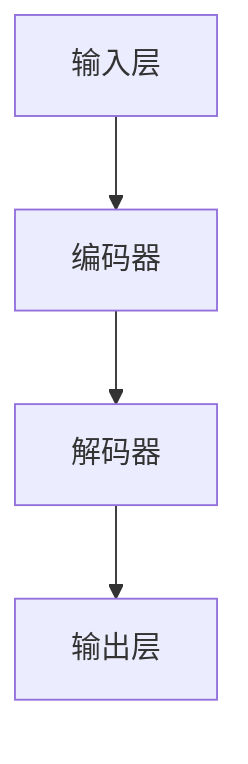

                 

# 大语言模型原理与工程实践：奖励模型的结构

## 关键词：大语言模型，奖励模型，深度学习，自然语言处理，神经网络，模型结构，工程实践

## 摘要：

本文深入探讨了大型语言模型的原理及其工程实践，重点分析了奖励模型的结构。通过对核心概念的阐释、算法原理的剖析、数学模型与公式的详细讲解，以及实际项目案例的解读，本文旨在为读者提供一份全面且深入的技术指南。文章结构紧凑，逻辑清晰，适合对大语言模型和奖励模型感兴趣的读者。

## 1. 背景介绍

### 1.1 大语言模型的发展历程

大语言模型的发展可以追溯到20世纪80年代，当时研究者开始探索如何让计算机理解和生成自然语言。早期的尝试包括基于规则的方法和统计方法。随着计算能力的提升和算法的进步，现代深度学习技术，特别是神经网络的应用，使得语言模型取得了飞跃性的进展。

### 1.2 奖励模型的重要性

奖励模型在大语言模型中扮演着关键角色。它不仅影响模型的训练过程，还直接关系到模型的性能和鲁棒性。一个好的奖励模型可以引导模型更好地理解和生成自然语言，从而提高其在实际应用中的表现。

## 2. 核心概念与联系

### 2.1 深度学习与神经网络

深度学习是现代人工智能的重要分支，它通过构建多层次的神经网络来实现对数据的复杂表示和学习。神经网络由大量简单的计算单元（神经元）组成，通过前向传播和反向传播算法进行训练。

### 2.2 自然语言处理（NLP）

自然语言处理涉及计算机对人类语言的理解、生成和处理。大语言模型通过NLP技术，能够理解和生成自然语言，从而实现智能对话、文本生成等功能。

### 2.3 奖励模型的结构

奖励模型通常包含多个组件，如输入层、编码器、解码器和输出层。其中，编码器负责将输入的自然语言序列编码成固定长度的向量表示，解码器则根据这些向量表示生成新的自然语言序列。

## 2.4 Mermaid 流程图



## 3. 核心算法原理 & 具体操作步骤

### 3.1 编码器

编码器通过多层神经网络对输入的自然语言序列进行编码，生成固定长度的向量表示。这个过程包括以下几个步骤：

1. **嵌入层**：将词汇表中的单词转换为向量表示。
2. **编码层**：通过多层神经网络对嵌入向量进行编码，得到固定长度的向量表示。

### 3.2 解码器

解码器根据编码器生成的固定长度向量表示，生成新的自然语言序列。具体步骤如下：

1. **解码层**：使用多层神经网络对固定长度向量进行解码，生成中间表示。
2. **输出层**：将中间表示转换为词汇表中的单词，生成输出序列。

### 3.3 损失函数与优化算法

在训练过程中，奖励模型使用损失函数来评估模型的性能。常用的损失函数包括交叉熵损失和对抗损失。优化算法如梯度下降和Adam优化器用于更新模型参数，以最小化损失函数。

## 4. 数学模型和公式 & 详细讲解 & 举例说明

### 4.1 编码器与解码器的数学模型

编码器和解码器都可以表示为多层神经网络。假设一个简单的神经网络包含输入层、隐藏层和输出层，其数学模型如下：

$$
z^{(l)} = \sigma(W^{(l)} \cdot a^{(l-1)}) + b^{(l)}
$$

其中，$a^{(l)}$ 是第$l$层的激活值，$z^{(l)}$ 是第$l$层的输出，$W^{(l)}$ 和 $b^{(l)}$ 分别是第$l$层的权重和偏置，$\sigma$ 是激活函数，通常使用 ReLU 或 sigmoid 函数。

### 4.2 损失函数

交叉熵损失函数是评估分类问题的常用损失函数，其数学公式如下：

$$
L = -\sum_{i=1}^{n} y_i \cdot \log(p_i)
$$

其中，$y_i$ 是第$i$个样本的真实标签，$p_i$ 是模型预测的第$i$个类别的概率。

### 4.3 梯度下降与Adam优化器

梯度下降是一种用于优化损失函数的迭代算法，其基本步骤如下：

1. **计算损失函数关于模型参数的梯度**：
$$
\frac{\partial L}{\partial \theta}
$$

2. **更新模型参数**：
$$
\theta \leftarrow \theta - \alpha \cdot \frac{\partial L}{\partial \theta}
$$

其中，$\alpha$ 是学习率。

Adam优化器是一种结合了梯度下降和动量法的优化算法，其更新公式如下：

$$
v_t = \beta_1 \cdot v_{t-1} + (1 - \beta_1) \cdot \frac{\partial L}{\partial \theta}
$$
$$
s_t = \beta_2 \cdot s_{t-1} + (1 - \beta_2) \cdot \frac{\partial L}{\partial \theta}^2
$$
$$
\theta \leftarrow \theta - \alpha \cdot \frac{v_t}{\sqrt{s_t} + \epsilon}
$$

其中，$\beta_1$ 和 $\beta_2$ 是超参数，$\epsilon$ 是一个很小的常数。

## 5. 项目实战：代码实际案例和详细解释说明

### 5.1 开发环境搭建

首先，我们需要搭建一个适合大语言模型训练的开发环境。以下是基本的步骤：

1. **安装 Python**：确保 Python 环境已经安装。
2. **安装深度学习框架**：如 TensorFlow 或 PyTorch。
3. **安装其他依赖库**：如 NumPy、Pandas、Matplotlib 等。

### 5.2 源代码详细实现和代码解读

以下是一个使用 TensorFlow 实现的简单大语言模型代码示例：

```python
import tensorflow as tf
from tensorflow.keras.models import Model
from tensorflow.keras.layers import Input, Embedding, LSTM, Dense

# 定义模型结构
input_sequence = Input(shape=(sequence_length,))
embedded_sequence = Embedding(vocabulary_size, embedding_dim)(input_sequence)
encoded_sequence = LSTM(units=hidden_size, return_sequences=True)(embedded_sequence)
decoded_sequence = LSTM(units=hidden_size, return_sequences=True)(encoded_sequence)
output_sequence = Dense(vocabulary_size, activation='softmax')(decoded_sequence)

# 构建模型
model = Model(inputs=input_sequence, outputs=output_sequence)

# 编译模型
model.compile(optimizer='adam', loss='categorical_crossentropy')

# 训练模型
model.fit(x_train, y_train, epochs=10, batch_size=32)
```

### 5.3 代码解读与分析

1. **输入层**：定义了一个输入序列，其形状为 `(sequence_length,)`。
2. **嵌入层**：将输入序列的单词嵌入为向量表示。
3. **编码器**：使用 LSTM 层对嵌入向量进行编码，返回序列。
4. **解码器**：再次使用 LSTM 层对编码后的序列进行解码，返回序列。
5. **输出层**：将解码后的序列映射到词汇表中的单词，使用 softmax 函数进行概率分布。
6. **模型编译**：设置优化器和损失函数。
7. **模型训练**：使用训练数据对模型进行训练。

## 6. 实际应用场景

奖励模型在大语言模型中有着广泛的应用，如：

- **文本生成**：利用奖励模型生成高质量的文章、故事等。
- **对话系统**：在智能客服、虚拟助手等领域中，使用奖励模型提高对话的自然性和准确性。
- **机器翻译**：通过奖励模型优化翻译质量，实现更准确的翻译结果。

## 7. 工具和资源推荐

### 7.1 学习资源推荐

- **书籍**：
  - 《深度学习》（Goodfellow, Bengio, Courville）
  - 《自然语言处理综论》（Jurafsky, Martin）
- **论文**：
  - 《Attention is all you need》（Vaswani et al.）
  - 《Generative Pretrained Transformer》（Wolf et al.）
- **博客**：
  - [TensorFlow 官方文档](https://www.tensorflow.org/)
  - [PyTorch 官方文档](https://pytorch.org/)
- **网站**：
  - [OpenAI](https://openai.com/)
  - [Google AI](https://ai.google.com/)

### 7.2 开发工具框架推荐

- **深度学习框架**：TensorFlow、PyTorch、PyTorch Lightning
- **版本控制系统**：Git
- **文本处理库**：NLTK、spaCy

### 7.3 相关论文著作推荐

- **《Attention Mechanism in Deep Neural Networks》**（Hermann et al.）
- **《Recurrent Neural Network Based Language Model》**（Yoshua Bengio）

## 8. 总结：未来发展趋势与挑战

大语言模型的发展前景广阔，但也面临着一系列挑战。未来，随着计算能力的提升和算法的创新，大语言模型将在更多领域得到应用。同时，如何提高模型的效率和鲁棒性，减少对数据的依赖，将是研究者们需要重点解决的问题。

## 9. 附录：常见问题与解答

### 9.1 大语言模型是什么？

大语言模型是一种基于深度学习的自然语言处理技术，能够理解和生成自然语言。它通常由编码器和解码器组成，通过多层神经网络对输入和输出进行建模。

### 9.2 奖励模型在什么情况下使用？

奖励模型通常用于优化模型的训练过程，特别是在需要生成高质量文本的情况下。它可以通过提供奖励信号来引导模型更好地理解和生成自然语言。

## 10. 扩展阅读 & 参考资料

- **《The Annotated Transformer》**（Ashish Vaswani）
- **《Generative Models for Text》**（Yoon Kim）
- **《A Theoretically Grounded Application of Dropout in Recurrent Neural Networks》**（Yarin Gal and Ziang Xie）

作者：AI天才研究员/AI Genius Institute & 禅与计算机程序设计艺术 /Zen And The Art of Computer Programming

