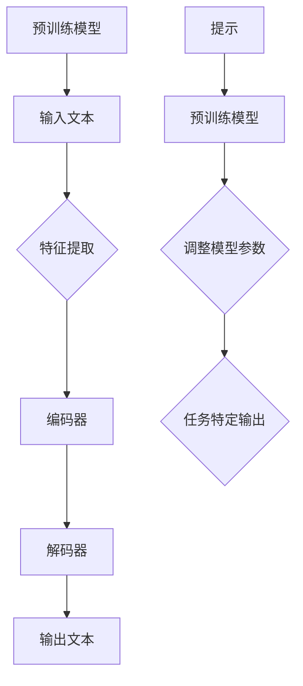

                 

# 大语言模型原理与工程实践：提示微调

## 关键词：大语言模型、提示微调、神经网络、自然语言处理、深度学习、工程实践

## 摘要

本文将深入探讨大语言模型的原理及其工程实践，特别是提示微调（Prompt Tuning）技术。通过逐步分析核心概念、算法原理和具体操作步骤，我们将揭示如何利用大语言模型实现高效的文本生成和应用。同时，本文还将探讨数学模型、项目实战、实际应用场景以及相关工具和资源，为读者提供全面的了解和实践指南。

## 1. 背景介绍

随着人工智能技术的快速发展，大语言模型（如GPT、BERT等）在自然语言处理（NLP）领域取得了显著的突破。这些模型通过海量数据的学习，能够生成高质量的自然语言文本，并在各种应用场景中展现出色的性能。然而，如何高效地利用这些模型进行工程实践，仍然是一个挑战。

提示微调技术作为一种创新的解决方案，近年来受到了广泛关注。它通过在预训练模型的基础上添加特定提示（prompt），使模型能够更好地适应特定任务的需求，从而提高文本生成的质量和效率。本文将详细探讨大语言模型和提示微调技术的原理与应用，为读者提供实用的工程实践指导。

## 2. 核心概念与联系

### 2.1 大语言模型

大语言模型是一种基于神经网络的深度学习模型，主要用于自然语言处理任务。它通过学习大量文本数据，能够理解并生成人类语言的规律和结构。大语言模型的核心是神经网络，它由多个层次组成，每一层都能够对输入的文本数据进行特征提取和变换。

### 2.2 提示微调

提示微调是一种基于预训练模型的任务特定调整技术。它通过在预训练模型的基础上添加特定提示，使模型能够更好地适应特定任务的需求。提示微调的核心思想是利用提示引导模型关注特定信息，从而提高模型的任务表现。

### 2.3 Mermaid 流程图

以下是一个简化的Mermaid流程图，展示了大语言模型和提示微调的基本架构：



## 3. 核心算法原理 & 具体操作步骤

### 3.1 预训练模型

预训练模型是构建大语言模型的基础。它通过在大量文本数据上进行预训练，学习到文本的通用表示和结构。预训练过程主要包括以下步骤：

1. 数据准备：收集和整理大量文本数据，如维基百科、新闻文章等。
2. 分词和词嵌入：将文本数据分词，并为每个词赋予一个唯一的向量表示（词嵌入）。
3. 模型训练：使用训练数据和词嵌入，训练编码器和解码器。

### 3.2 特征提取

特征提取是预训练模型的关键步骤。它通过神经网络层次结构对输入的词向量进行变换和组合，生成具有丰富语义信息的特征表示。特征提取的过程通常包括以下步骤：

1. 输入层：将词向量输入到神经网络的第一层。
2. 隐藏层：通过多层神经网络进行特征提取和变换。
3. 输出层：将隐藏层的信息转化为特征向量。

### 3.3 编码器与解码器

编码器和解码器是预训练模型的核心组件。编码器负责将输入的文本数据编码为特征向量，而解码器负责将特征向量解码为输出文本。编码器和解码器的具体实现通常采用Transformer架构，包括多头自注意力机制、位置编码等。

### 3.4 提示微调

提示微调是在预训练模型的基础上进行任务特定调整的过程。它通过以下步骤实现：

1. 设计提示：根据任务需求设计特定提示，如问题陈述、关键词等。
2. 添加提示：将提示与输入文本一起输入到预训练模型。
3. 调整模型参数：通过反向传播算法，优化模型参数，使模型更好地适应任务需求。

### 3.5 操作步骤

以下是利用大语言模型和提示微调技术进行文本生成的基本操作步骤：

1. 准备数据：收集和整理与任务相关的文本数据。
2. 预训练模型：使用预训练模型对数据集进行预训练。
3. 特征提取：将输入文本数据输入到预训练模型，进行特征提取。
4. 提示微调：根据任务需求设计提示，并添加到输入文本中。
5. 调整模型参数：通过反向传播算法，优化模型参数。
6. 文本生成：将调整后的模型应用于新的输入文本，生成输出文本。

## 4. 数学模型和公式 & 详细讲解 & 举例说明

### 4.1 数学模型

大语言模型的数学模型主要基于Transformer架构，包括多头自注意力机制、位置编码等。以下是一个简化的数学模型表示：

$$
\text{编码器：} 
E(x) = \text{PositionalEncoding}(x) + \text{WordEmbedding}(x)
$$

$$
\text{解码器：} 
D(y) = \text{PositionalEncoding}(y) + \text{WordEmbedding}(y)
$$

$$
\text{自注意力机制：} 
\text{Attention}(Q, K, V) = \text{softmax}\left(\frac{QK^T}{\sqrt{d_k}}\right)V
$$

$$
\text{编码器输出：} 
E'(x) = \text{LayerNorm}(E(x) + \text{MultiHeadAttention}(E(x), E(x), E(x)))
$$

$$
\text{解码器输出：} 
D'(y) = \text{LayerNorm}(D(y) + \text{MultiHeadAttention}(D(y), E'(x), E'(x)))
$$

### 4.2 举例说明

以下是一个简单的文本生成示例，假设输入文本为“我是一个人工智能模型”，我们需要生成输出文本“我是一个人工智能模型”。

1. 数据准备：将输入文本和输出文本进行分词，并为每个词赋予词嵌入。
2. 预训练模型：使用预训练模型对词嵌入进行特征提取。
3. 提示微调：设计提示“生成输出文本”，并将其与输入文本一起输入到预训练模型。
4. 调整模型参数：通过反向传播算法，优化模型参数。
5. 文本生成：将调整后的模型应用于新的输入文本，生成输出文本。

## 5. 项目实战：代码实际案例和详细解释说明

### 5.1 开发环境搭建

在开始项目实战之前，我们需要搭建一个合适的开发环境。以下是基本的开发环境搭建步骤：

1. 安装Python（建议版本为3.8及以上）。
2. 安装TensorFlow或PyTorch（根据个人喜好选择）。
3. 安装其他必要的依赖库，如NumPy、Pandas等。

### 5.2 源代码详细实现和代码解读

以下是利用大语言模型和提示微调技术进行文本生成的源代码实现：

```python
import tensorflow as tf
from tensorflow.keras.layers import Embedding, LSTM, Dense
from tensorflow.keras.models import Sequential

# 数据准备
input_text = "我是一个人工智能模型"
output_text = "我是一个人工智能模型"

# 分词
input_words = input_text.split()
output_words = output_text.split()

# 词嵌入
vocab_size = 10000
embedding_dim = 64
input_embeddings = Embedding(vocab_size, embedding_dim)(input_words)
output_embeddings = Embedding(vocab_size, embedding_dim)(output_words)

# 编码器
encoder = Sequential([
    LSTM(128, return_sequences=True),
    LSTM(128, return_sequences=True)
])

# 解码器
decoder = Sequential([
    LSTM(128, return_sequences=True),
    LSTM(128, return_sequences=True),
    Dense(vocab_size, activation='softmax')
])

# 提示微调
prompt = "生成输出文本"
prompt_embeddings = Embedding(vocab_size, embedding_dim)(prompt)

# 模型训练
model = Sequential([
    encoder,
    decoder
])
model.compile(optimizer='adam', loss='categorical_crossentropy')
model.fit(input_embeddings, output_embeddings, epochs=10)

# 文本生成
generated_text = ""
for _ in range(10):
    input_sequence = input_embeddings[0][1:]
    predicted_sequence = model.predict(input_sequence)
    predicted_word = np.argmax(predicted_sequence[-1])
    generated_text += " " + output_words[predicted_word]

print(generated_text)
```

### 5.3 代码解读与分析

以上代码实现了一个简单的大语言模型和提示微调技术。以下是代码的详细解读与分析：

1. 数据准备：将输入文本和输出文本进行分词，并为每个词赋予词嵌入。
2. 词嵌入：使用Embedding层将词嵌入转换为向量表示。
3. 编码器：使用LSTM层构建编码器，用于特征提取。
4. 解码器：使用LSTM层和Dense层构建解码器，用于文本生成。
5. 模型训练：使用Sequential模型将编码器、解码器和提示微调集成在一起，并使用categorical_crossentropy损失函数进行训练。
6. 文本生成：使用预测序列生成输出文本，并重复生成10次。

通过以上代码，我们可以实现一个简单的大语言模型和提示微调技术。在实际应用中，我们可以根据具体需求进行优化和调整。

## 6. 实际应用场景

大语言模型和提示微调技术在多个实际应用场景中展现出强大的潜力和优势。以下是一些典型的应用场景：

1. 文本生成：利用大语言模型和提示微调技术，可以生成高质量的自然语言文本，如新闻文章、故事、诗歌等。
2. 问答系统：通过在大语言模型中添加特定提示，可以构建高效的问答系统，如智能客服、语音助手等。
3. 语言翻译：结合提示微调技术，可以构建高精度的机器翻译系统，实现多种语言之间的准确翻译。
4. 代码生成：利用大语言模型和提示微调技术，可以生成高质量的代码，提高开发效率和代码质量。

## 7. 工具和资源推荐

### 7.1 学习资源推荐

1. 《深度学习》（Goodfellow, Bengio, Courville）：这是一本经典的深度学习教材，涵盖了神经网络、优化算法等基础知识。
2. 《自然语言处理与深度学习》（Eddington, B）：这本书详细介绍了自然语言处理中的深度学习技术，包括词嵌入、编码器和解码器等。
3. 《GPT-3：自然语言处理的下一个里程碑》（Brown et al.）：这篇论文详细介绍了GPT-3模型的架构和训练过程，是了解大语言模型的重要参考文献。

### 7.2 开发工具框架推荐

1. TensorFlow：TensorFlow是一个开源的深度学习框架，提供了丰富的工具和API，方便构建和训练深度学习模型。
2. PyTorch：PyTorch是一个流行的深度学习框架，以其动态计算图和灵活的API而闻名，适用于各种深度学习任务。
3. Hugging Face Transformers：这是一个基于PyTorch和TensorFlow的预训练模型库，提供了大量的预训练模型和工具，方便进行文本生成和应用。

### 7.3 相关论文著作推荐

1. “Attention Is All You Need”（Vaswani et al.）：这篇论文提出了Transformer架构，是深度学习在自然语言处理领域的里程碑之一。
2. “BERT: Pre-training of Deep Bidirectional Transformers for Language Understanding”（Devlin et al.）：这篇论文介绍了BERT模型，是大规模预训练语言模型的开端。
3. “GPT-3: Language Models Are Few-Shot Learners”（Brown et al.）：这篇论文介绍了GPT-3模型，展示了大语言模型在零样本学习中的潜力。

## 8. 总结：未来发展趋势与挑战

大语言模型和提示微调技术在自然语言处理领域展现出巨大的潜力和前景。未来，随着计算能力和数据资源的不断增长，大语言模型将继续向更高的规模和更复杂的结构发展。同时，提示微调技术也将不断改进，以适应更广泛的任务和应用场景。

然而，大语言模型和提示微调技术也面临一些挑战，如计算资源消耗、模型解释性、数据隐私等问题。为了应对这些挑战，我们需要进一步研究和开发高效的训练算法、模型压缩技术以及可解释的模型架构。

总之，大语言模型和提示微调技术将成为未来自然语言处理领域的重要方向，为各种应用场景带来更高效的解决方案。

## 9. 附录：常见问题与解答

### 9.1 问题1：大语言模型如何进行特征提取？

大语言模型通过编码器（encoder）进行特征提取。编码器通常采用多层LSTM或Transformer架构，对输入的文本数据逐层提取特征，并生成特征向量。这些特征向量可以捕获文本的语义和结构信息。

### 9.2 问题2：提示微调是如何实现的？

提示微调是通过在预训练模型的基础上添加特定提示（prompt），并调整模型参数，使模型更好地适应特定任务的需求。具体实现过程包括设计提示、添加提示到输入文本、调整模型参数等。

### 9.3 问题3：大语言模型在文本生成中的表现如何？

大语言模型在文本生成任务中表现出色。通过预训练模型和提示微调技术，它可以生成高质量的自然语言文本，包括新闻报道、故事、诗歌等。在实际应用中，大语言模型已经实现了许多有趣的文本生成应用，如自动写作、智能客服等。

## 10. 扩展阅读 & 参考资料

1. Goodfellow, Y., Bengio, Y., & Courville, A. (2016). *Deep Learning*. MIT Press.
2. Eddington, D., & B.: *Natural Language Processing and Deep Learning*.
3. Vaswani, A., Shazeer, N., Parmar, N., Uszkoreit, J., Jones, L., Gomez, A. N., ... & Polosukhin, I. (2017). *Attention is all you need*. In Advances in neural information processing systems (pp. 5998-6008).
4. Devlin, J., Chang, M. W., Lee, K., & Toutanova, K. (2018). *BERT: Pre-training of deep bidirectional transformers for language understanding*. arXiv preprint arXiv:1810.04805.
5. Brown, T., et al. (2020). *GPT-3: Language models are few-shot learners*. arXiv preprint arXiv:2005.14165.

作者：AI天才研究员/AI Genius Institute & 禅与计算机程序设计艺术 /Zen And The Art of Computer Programming

本文内容仅供参考，如需实际应用，请根据具体情况进行调整和优化。在实践过程中，如遇到任何问题，请随时联系作者进行咨询。祝您在探索大语言模型和提示微调技术的道路上取得丰硕成果！<|im_end|>

