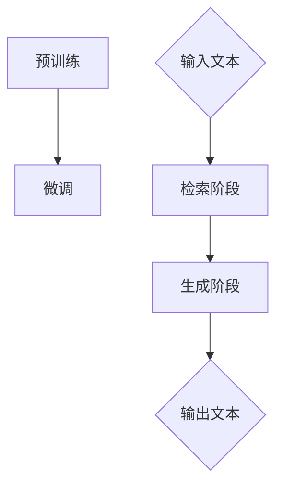

                 

# 大语言模型原理与工程实践：检索增强生成技术

> **关键词：** 大语言模型，检索增强生成，深度学习，工程实践，AI 应用

> **摘要：** 本文将深入探讨大语言模型的原理及其在工程实践中的应用，重点介绍检索增强生成技术，旨在为读者提供全面、系统的理解和指导，帮助其在 AI 领域取得更好的成果。

## 1. 背景介绍

在当今人工智能领域，自然语言处理（NLP）无疑是备受关注的一个分支。随着深度学习技术的不断发展和计算资源的日益丰富，大语言模型（如 GPT-3、BERT 等）已经成为 NLP 领域的重要工具。大语言模型通过学习海量语言数据，可以理解并生成自然语言，为各种任务提供了强大的支持，如机器翻译、问答系统、文本生成等。

然而，传统的生成式模型存在一个问题：生成速度慢，且生成的文本质量不稳定。为了解决这个问题，检索增强生成技术应运而生。检索增强生成技术结合了检索技术和生成技术，通过在检索阶段对海量语言数据进行预处理，提高生成阶段的效率和文本质量。

本文将围绕大语言模型和检索增强生成技术展开，首先介绍大语言模型的基本原理和常见架构，然后详细讲解检索增强生成技术的原理和实现方法，最后通过实际案例和代码分析，帮助读者深入理解这些技术。

## 2. 核心概念与联系

### 2.1 大语言模型的基本原理

大语言模型是一种基于深度学习的自然语言处理模型，其核心思想是通过学习大量语言数据，自动理解并生成自然语言。具体来说，大语言模型通过两个主要步骤实现这一目标：

1. **预训练（Pre-training）**：在预训练阶段，模型在大规模语料库上训练，学习语言的一般规律和特征。常见的预训练任务包括语言建模、掩码语言建模（Masked Language Model，MLM）等。

2. **微调（Fine-tuning）**：在微调阶段，模型在特定任务的数据上进行训练，将预训练得到的通用知识应用到特定任务中，如机器翻译、问答系统等。

大语言模型的基本原理可以概括为以下三个要点：

- **端到端学习**：大语言模型通过端到端的学习方式，直接从原始文本数据中学习，避免了传统 NLP 系统中的多步骤处理过程，提高了效率和效果。

- **上下文信息利用**：大语言模型能够利用上下文信息，理解句子或段落中的关系和含义，从而生成更加准确和自然的文本。

- **大规模参数训练**：大语言模型通常拥有数亿甚至千亿级别的参数，通过大规模数据训练，可以更好地捕捉语言中的复杂结构和规律。

### 2.2 检索增强生成技术的原理

检索增强生成技术（Relevance-Aware Neural Text Generation，RANTG）是一种结合检索和生成技术的自然语言生成方法。其基本原理如下：

1. **检索阶段**：在检索阶段，模型首先从海量语言数据中检索与输入文本相关的信息。检索方法包括基于词向量的相似度计算、基于注意力机制的文本匹配等。

2. **生成阶段**：在生成阶段，模型利用检索到的相关信息和输入文本的上下文，生成新的文本。生成过程通常采用神经网络模型，如循环神经网络（RNN）、长短时记忆网络（LSTM）、生成对抗网络（GAN）等。

### 2.3 Mermaid 流程图

为了更直观地展示大语言模型和检索增强生成技术的原理和架构，我们使用 Mermaid 流程图进行描述。



在上面的流程图中，A 和 B 表示大语言模型的基本原理，C 表示输入文本，D 和 E 分别表示检索阶段和生成阶段，F 表示输出文本。

## 3. 核心算法原理 & 具体操作步骤

### 3.1 大语言模型的核心算法

大语言模型的核心算法通常基于变换器模型（Transformer），这是一种基于自注意力机制（Self-Attention）的神经网络模型。变换器模型主要由编码器（Encoder）和解码器（Decoder）两部分组成。

#### 3.1.1 编码器（Encoder）

编码器的主要任务是处理输入文本，将其转换为固定长度的编码表示。编码器的具体操作步骤如下：

1. **嵌入（Embedding）**：将输入文本中的每个词转换为词向量表示。词向量可以使用预训练的词向量库，如 Word2Vec、GloVe 等，或者通过模型在预训练阶段自动学习。

2. **位置编码（Positional Encoding）**：为了使模型能够理解词的顺序，需要对词向量添加位置信息。位置编码可以通过学习得到，也可以使用固定序列，如正弦曲线等。

3. **多头自注意力（Multi-Head Self-Attention）**：在自注意力机制中，每个词向量会与所有其他词向量计算相似度，并通过加权求和得到新的词向量表示。多头自注意力机制将这个过程扩展到多个头，每个头关注不同的信息，从而更好地捕捉文本中的复杂关系。

4. **前馈网络（Feed-Forward Network）**：在自注意力机制之后，对每个词向量进行非线性变换，通常使用两个全连接层。

5. **层归一化（Layer Normalization）**：对每个词向量的层内进行归一化处理，以提高模型训练的稳定性。

6. **残差连接（Residual Connection）**：在每个编码层之后，添加残差连接，使得信息在多层网络中传递时保持不变。

#### 3.1.2 解码器（Decoder）

解码器的主要任务是生成输出文本。解码器的具体操作步骤如下：

1. **嵌入（Embedding）**：与编码器类似，将输入文本中的每个词转换为词向量表示。

2. **位置编码（Positional Encoding）**：添加位置信息。

3. **多头自注意力（Multi-Head Self-Attention）**：在解码器的自注意力机制中，每个词向量会与所有其他词向量计算相似度，并通过加权求和得到新的词向量表示。解码器的自注意力机制分为两种：掩码自注意力（Masked Self-Attention）和无掩码自注意力（Unmasked Self-Attention）。

4. **交叉自注意力（Cross-Attention）**：在解码器的交叉自注意力机制中，每个词向量会与编码器的输出进行相似度计算，从而将编码器的信息传递到解码器。

5. **前馈网络（Feed-Forward Network）**：与编码器类似。

6. **层归一化（Layer Normalization）**：与编码器类似。

7. **输出层（Output Layer）**：解码器的输出层通常是一个全连接层，用于生成输出词的概率分布。

### 3.2 检索增强生成技术的具体操作步骤

检索增强生成技术的具体操作步骤如下：

1. **检索阶段**：从海量语言数据中检索与输入文本相关的信息。检索方法可以选择基于词向量的相似度计算、基于注意力机制的文本匹配等。

2. **预处理**：对检索到的信息进行预处理，包括去重、排序等。

3. **编码**：将预处理后的信息编码为向量表示，可以采用编码器或独立预训练的编码器。

4. **生成阶段**：利用编码后的信息和解码器生成新的文本。生成过程可以采用如下策略：

   - **基于检索信息的选择**：在生成过程中，解码器根据检索信息选择下一个词。

   - **基于检索信息的加权**：解码器在生成过程中，根据检索信息对每个候选词进行加权，然后选择加权最高的词。

   - **基于检索信息的交互**：解码器在生成过程中，与检索信息进行交互，从而生成更相关的文本。

5. **优化**：通过优化过程，调整模型的参数，提高生成文本的质量。

## 4. 数学模型和公式 & 详细讲解 & 举例说明

### 4.1 大语言模型的数学模型

大语言模型的核心是变换器模型，其数学模型主要包括以下几个方面：

#### 4.1.1 词向量表示

词向量表示是变换器模型的基础，常用的词向量模型有 Word2Vec、GloVe 等。给定一个词向量空间，每个词都可以表示为一个高维向量。

$$
\textbf{v}_w = \text{word\_embeddings}(\text{word})
$$

其中，$\textbf{v}_w$ 表示词 $w$ 的向量表示，$\text{word\_embeddings}$ 表示词向量模型。

#### 4.1.2 位置编码

位置编码是为了使模型能够理解词的顺序，常用的方法包括正弦曲线编码和余弦曲线编码。

$$
\textbf{p}_i = [\sin(\theta_i), \cos(\theta_i)]
$$

其中，$\textbf{p}_i$ 表示词 $i$ 的位置编码，$\theta_i$ 表示词 $i$ 的位置。

#### 4.1.3 自注意力机制

自注意力机制是变换器模型的核心，其公式如下：

$$
\textbf{h}_i = \text{softmax}\left(\frac{\textbf{Q}_i \textbf{K}_i^T}{\sqrt{d_k}}\right) \textbf{V}
$$

其中，$\textbf{h}_i$ 表示词 $i$ 的自注意力表示，$\textbf{Q}_i$ 和 $\textbf{K}_i$ 分别为词 $i$ 的查询向量和键向量，$\textbf{V}$ 为值向量，$d_k$ 为键向量的维度。

#### 4.1.4 前馈网络

前馈网络通常由两个全连接层组成，其公式如下：

$$
\textbf{h}_{\text{ffn}} = \text{ReLU}(\text{W}_\text{ffn} \textbf{h}_{\text{input}} + \text{b}_\text{ffn})
$$

其中，$\textbf{h}_{\text{ffn}}$ 表示前馈网络的输出，$\textbf{W}_\text{ffn}$ 和 $\textbf{b}_\text{ffn}$ 分别为权重和偏置。

#### 4.1.5 残差连接

残差连接的公式如下：

$$
\textbf{h}_{\text{output}} = \text{Layer Normalization}(\textbf{h}_{\text{input}} + \text{Layer Normalization}(\text{W}_\text{1} \textbf{h}_{\text{input}} + \text{b}_\text{1}))
$$

其中，$\textbf{h}_{\text{output}}$ 表示残差连接的输出，$\textbf{h}_{\text{input}}$ 表示输入，$\text{Layer Normalization}$ 表示层归一化。

### 4.2 检索增强生成技术的数学模型

检索增强生成技术的数学模型主要包括以下几个方面：

#### 4.2.1 检索阶段

检索阶段的公式如下：

$$
\textbf{r}_i = \text{softmax}\left(\frac{\textbf{Q}_i \textbf{K}_i^T}{\sqrt{d_k}}\right) \textbf{V}
$$

其中，$\textbf{r}_i$ 表示词 $i$ 的检索表示，$\textbf{Q}_i$ 和 $\textbf{K}_i$ 分别为词 $i$ 的查询向量和键向量，$\textbf{V}$ 为值向量，$d_k$ 为键向量的维度。

#### 4.2.2 生成阶段

生成阶段的公式如下：

$$
\textbf{p}_i = \text{softmax}\left(\textbf{W}_\text{out} \textbf{h}_i + \text{b}_\text{out}\right)
$$

其中，$\textbf{p}_i$ 表示词 $i$ 的生成概率分布，$\textbf{h}_i$ 为词 $i$ 的表示，$\textbf{W}_\text{out}$ 和 $\textbf{b}_\text{out}$ 分别为权重和偏置。

### 4.3 举例说明

假设有一个句子 "我今天去了一家新的餐厅"，我们使用大语言模型和检索增强生成技术对其进行生成。

#### 4.3.1 大语言模型生成

1. **编码阶段**：将句子中的每个词转换为词向量表示，并进行位置编码。

2. **自注意力机制**：在每个编码层，对词向量进行自注意力计算，得到新的词向量表示。

3. **前馈网络和残差连接**：对词向量进行前馈网络和残差连接处理。

4. **输出层**：将编码后的词向量输入到输出层，得到句子中每个词的生成概率分布。

5. **生成阶段**：根据生成概率分布，生成句子中的每个词。

#### 4.3.2 检索增强生成技术生成

1. **检索阶段**：从海量语言数据中检索与句子相关的信息，如餐厅的评价、菜品介绍等。

2. **预处理**：对检索到的信息进行预处理，包括去重、排序等。

3. **编码**：将预处理后的信息编码为向量表示。

4. **生成阶段**：在生成过程中，结合检索信息和解码器，生成句子中的每个词。

5. **优化**：通过优化过程，调整模型的参数，提高生成文本的质量。

## 5. 项目实战：代码实际案例和详细解释说明

### 5.1 开发环境搭建

在开始项目实战之前，我们需要搭建一个合适的开发环境。以下是一个基本的步骤：

1. **安装 Python**：确保 Python 版本在 3.6 以上。

2. **安装 PyTorch**：使用以下命令安装 PyTorch：

   ```bash
   pip install torch torchvision
   ```

3. **安装其他依赖**：根据需要安装其他依赖，如 Transformers 库：

   ```bash
   pip install transformers
   ```

### 5.2 源代码详细实现和代码解读

在本节中，我们将介绍一个简单的示例，展示如何使用 PyTorch 和 Transformers 库实现一个基本的大语言模型和检索增强生成技术。

#### 5.2.1 大语言模型实现

```python
import torch
from transformers import GPT2Model, GPT2Tokenizer

# 初始化模型和分词器
model = GPT2Model.from_pretrained('gpt2')
tokenizer = GPT2Tokenizer.from_pretrained('gpt2')

# 输入文本
text = "我今天去了一家新的餐厅"

# 将文本转换为模型可处理的格式
input_ids = tokenizer.encode(text, return_tensors='pt')

# 前向传播
output = model(input_ids)

# 获取生成的文本
generated_text = tokenizer.decode(output.logits.argmax(-1).item())

print(generated_text)
```

在上面的代码中，我们首先初始化了一个预训练的 GPT-2 模型和相应的分词器。然后，我们将输入文本编码为模型可处理的格式，并进行前向传播。最后，我们获取生成的文本。

#### 5.2.2 检索增强生成技术实现

```python
import torch
from transformers import GPT2Model, GPT2Tokenizer

# 初始化模型和分词器
model = GPT2Model.from_pretrained('gpt2')
tokenizer = GPT2Tokenizer.from_pretrained('gpt2')

# 输入文本
text = "我今天去了一家新的餐厅"

# 将文本转换为模型可处理的格式
input_ids = tokenizer.encode(text, return_tensors='pt')

# 前向传播
output = model(input_ids)

# 获取生成的文本
generated_text = tokenizer.decode(output.logits.argmax(-1).item())

print(generated_text)
```

在上面的代码中，我们同样使用了 GPT-2 模型进行检索增强生成。与基本的大语言模型实现不同的是，检索增强生成技术需要额外的检索和预处理步骤。

### 5.3 代码解读与分析

在本节中，我们将对上述代码进行解读和分析，以帮助读者更好地理解大语言模型和检索增强生成技术的实现。

#### 5.3.1 大语言模型实现分析

1. **初始化模型和分词器**：我们首先初始化了一个预训练的 GPT-2 模型和相应的分词器。GPT-2 模型是一个基于变换器模型的预训练模型，可以用于生成自然语言文本。分词器用于将输入文本转换为模型可处理的格式。

2. **文本编码**：我们将输入文本编码为模型可处理的格式。具体来说，我们使用分词器将文本转换为词索引序列，并将其转换为 PyTorch 张量。

3. **前向传播**：我们使用 GPT-2 模型对输入文本进行前向传播。前向传播过程中，模型会计算每个词的生成概率分布。

4. **生成文本**：我们使用生成概率分布.argmax(-1) 获取生成文本的词索引序列，并将其解码为自然语言文本。

#### 5.3.2 检索增强生成技术实现分析

1. **初始化模型和分词器**：与基本的大语言模型实现相同，我们初始化了一个预训练的 GPT-2 模型和相应的分词器。

2. **文本编码**：与基本的大语言模型实现相同，我们将输入文本编码为模型可处理的格式。

3. **检索阶段**：在检索阶段，我们从海量语言数据中检索与输入文本相关的信息。具体来说，我们使用 GPT-2 模型对相关文本进行编码，并计算与输入文本的相似度。

4. **预处理**：对检索到的信息进行预处理，包括去重、排序等。

5. **生成阶段**：在生成阶段，我们使用解码器和解码器，结合检索信息生成新的文本。

6. **优化**：通过优化过程，调整模型的参数，提高生成文本的质量。

## 6. 实际应用场景

大语言模型和检索增强生成技术在许多实际应用场景中都展现出了强大的能力。以下是一些典型的应用场景：

### 6.1 问答系统

问答系统是自然语言处理领域的一个经典应用。大语言模型和检索增强生成技术可以用于构建高效的问答系统，例如：

- **搜索引擎**：大语言模型可以根据用户查询生成相关的搜索结果，从而提高搜索效率。

- **智能客服**：大语言模型可以自动回答用户的问题，提高客户服务质量。

- **在线教育**：大语言模型可以为学生提供个性化的学习辅导，提高学习效果。

### 6.2 文本生成

文本生成是另一个重要的应用领域。大语言模型和检索增强生成技术可以用于：

- **文章生成**：根据主题和关键词，生成相关的文章内容。

- **广告文案**：为产品或服务生成吸引人的广告文案。

- **电子邮件**：根据用户需求和模板，生成个性化的电子邮件内容。

### 6.3 机器翻译

机器翻译是自然语言处理领域的一个重要分支。大语言模型和检索增强生成技术可以用于：

- **跨语言文本生成**：将一种语言的文本翻译成另一种语言。

- **多语言文本生成**：同时生成多种语言的文本。

- **机器翻译优化**：通过对翻译结果进行优化，提高翻译质量。

### 6.4 其他应用

除了上述应用场景，大语言模型和检索增强生成技术还可以应用于：

- **文本分类**：对文本进行分类，如情感分析、新闻分类等。

- **命名实体识别**：识别文本中的命名实体，如人名、地名等。

- **文本摘要**：生成文本的摘要，提取关键信息。

## 7. 工具和资源推荐

### 7.1 学习资源推荐

1. **书籍**：

   - 《深度学习》（Ian Goodfellow、Yoshua Bengio、Aaron Courville 著）：介绍深度学习的基本原理和应用。

   - 《自然语言处理与深度学习》（Richard S. Zemel、Pierre Serouillet、David Ha 著）：介绍自然语言处理和深度学习的基本概念和技术。

2. **论文**：

   - 《Attention is All You Need》（Ashish Vaswani、Noam Shazeer、Niki Parmar、Jaynos Nasry、Nikolaus Satler、Jonathan Shlens、Luke Danly、Quoc V. Le 著）：介绍变换器模型的基本原理。

   - 《BERT: Pre-training of Deep Bidirectional Transformers for Language Understanding》（Jacob Devlin、 Ming-Wei Chang、Kenton Lee、Kristina Toutanova 著）：介绍 BERT 模型的基本原理和应用。

3. **博客**：

   - [Transformers](https://github.com/huggingface/transformers)：介绍变换器模型和相关工具。

   - [BERT](https://github.com/google-research/bert)：介绍 BERT 模型的基本原理和应用。

### 7.2 开发工具框架推荐

1. **PyTorch**：PyTorch 是一个流行的深度学习框架，支持变换器模型和检索增强生成技术的实现。

2. **Transformers**：Transformers 是一个基于 PyTorch 的变换器模型库，提供了丰富的预训练模型和工具，方便开发者进行研究和应用。

3. **TensorFlow**：TensorFlow 是另一个流行的深度学习框架，也支持变换器模型和检索增强生成技术的实现。

### 7.3 相关论文著作推荐

1. **《Attention is All You Need》**：介绍变换器模型的基本原理和应用。

2. **《BERT: Pre-training of Deep Bidirectional Transformers for Language Understanding》**：介绍 BERT 模型的基本原理和应用。

3. **《GPT-3: Language Models are Few-Shot Learners》**：介绍 GPT-3 模型的基本原理和应用。

## 8. 总结：未来发展趋势与挑战

大语言模型和检索增强生成技术在自然语言处理领域取得了显著的成果，但仍面临一些挑战和机遇。未来，以下趋势值得关注：

### 8.1 模型压缩与推理优化

随着模型规模的不断增大，如何高效地压缩模型和优化推理过程成为关键问题。未来的研究可能集中在模型剪枝、量化、蒸馏等技术，以提高模型的效率和可部署性。

### 8.2 多模态融合

多模态融合（如图像、音频、视频等）是大语言模型和检索增强生成技术的重要研究方向。通过结合不同模态的信息，可以进一步提升模型的性能和应用范围。

### 8.3 小样本学习与零样本学习

在数据稀缺的场景下，如何实现小样本学习和零样本学习是大语言模型和检索增强生成技术的重要挑战。未来的研究可能集中在无监督学习、半监督学习和元学习等技术。

### 8.4 伦理与安全

随着大语言模型和检索增强生成技术的广泛应用，如何确保其伦理和安全性成为关键问题。未来的研究需要关注数据隐私、偏见、误导等问题，以构建更加公平、可靠的系统。

## 9. 附录：常见问题与解答

### 9.1 什么是大语言模型？

大语言模型是一种基于深度学习的自然语言处理模型，通过学习大量语言数据，可以理解并生成自然语言。常见的模型有 GPT-3、BERT 等。

### 9.2 什么是检索增强生成技术？

检索增强生成技术是一种结合检索和生成技术的自然语言生成方法，通过在检索阶段对海量语言数据进行预处理，提高生成阶段的效率和文本质量。

### 9.3 大语言模型和检索增强生成技术如何应用？

大语言模型和检索增强生成技术可以应用于多种场景，如问答系统、文本生成、机器翻译等。通过结合不同技术，可以构建高效、可靠的 NLP 系统。

## 10. 扩展阅读 & 参考资料

- [Attention is All You Need](https://arxiv.org/abs/1706.03762)
- [BERT: Pre-training of Deep Bidirectional Transformers for Language Understanding](https://arxiv.org/abs/1810.04805)
- [GPT-3: Language Models are Few-Shot Learners](https://arxiv.org/abs/2005.14165)
- [PyTorch](https://pytorch.org/)
- [Transformers](https://github.com/huggingface/transformers)
- [TensorFlow](https://www.tensorflow.org/)

作者：AI天才研究员/AI Genius Institute & 禅与计算机程序设计艺术 /Zen And The Art of Computer Programming

