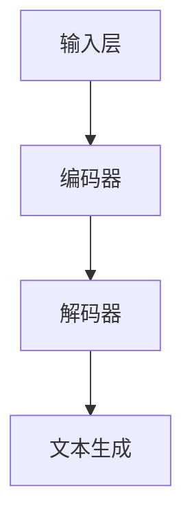

                 

# 大语言模型原理与工程实践：百科数据

> **关键词**：大语言模型，自然语言处理，深度学习，神经网络，算法原理，数学模型，工程实践，应用场景，开发工具，未来趋势。

> **摘要**：本文将深入探讨大语言模型的原理与工程实践，从核心概念、算法原理、数学模型到实际应用场景，为读者提供全面的技术解读和实战指导。通过本文，读者将了解到大语言模型的工作机制、技术挑战及其在自然语言处理领域的广泛应用。

## 1. 背景介绍

在信息爆炸的时代，自然语言处理（NLP）技术成为了人工智能领域的一个重要分支。随着深度学习技术的不断发展，大语言模型（Large Language Model）作为自然语言处理的核心工具，正逐渐改变着我们的生活和工作方式。大语言模型通过学习海量文本数据，能够生成符合语法和语义规则的文本，实现文本生成、文本分类、问答系统等功能。

本文将围绕大语言模型的原理与工程实践进行深入探讨，旨在帮助读者了解大语言模型的核心技术，掌握其应用场景，并探索其在未来可能的发展趋势和挑战。

## 2. 核心概念与联系

### 2.1 大语言模型的基本概念

大语言模型（Large Language Model，简称LLM）是一种基于深度学习的自然语言处理模型，通过学习海量文本数据，能够生成符合语法和语义规则的文本。LLM的基本原理是利用神经网络对文本数据进行建模，从而实现对文本的理解和生成。

### 2.2 大语言模型的架构

大语言模型的架构通常包括以下几个关键部分：

1. **输入层**：接收文本数据，将其转换为向量表示。
2. **编码器**：对输入文本进行编码，提取文本的特征信息。
3. **解码器**：根据编码器的输出生成文本。

### 2.3 大语言模型的工作原理

大语言模型的工作原理可以概括为以下几个步骤：

1. **数据预处理**：对文本数据进行清洗、分词、去停用词等预处理操作。
2. **模型训练**：利用预处理后的文本数据训练神经网络模型，通过反向传播算法不断优化模型参数。
3. **文本生成**：在训练好的模型基础上，输入新的文本数据，生成符合语法和语义规则的文本。

### 2.4 大语言模型与其他技术的联系

大语言模型与自然语言处理领域的其他技术，如词向量、循环神经网络（RNN）、长短期记忆网络（LSTM）、Transformer等，有着密切的联系。词向量技术为大语言模型提供了文本向量化表示，循环神经网络和长短期记忆网络则为文本序列建模提供了有效的解决方案，而Transformer模型则在文本生成任务中取得了显著的性能提升。

### 2.5 Mermaid 流程图

以下是大语言模型的基本架构的Mermaid流程图：



## 3. 核心算法原理 & 具体操作步骤

### 3.1 算法原理

大语言模型的核心算法是基于深度学习的神经网络模型，主要包括以下几个步骤：

1. **数据预处理**：对文本数据进行清洗、分词、去停用词等预处理操作，将文本转换为序列。
2. **文本向量化**：利用词向量技术将文本序列转换为向量表示，如Word2Vec、GloVe等。
3. **模型训练**：使用预处理后的文本数据训练神经网络模型，通过反向传播算法不断优化模型参数。
4. **文本生成**：在训练好的模型基础上，输入新的文本数据，生成符合语法和语义规则的文本。

### 3.2 具体操作步骤

以下是构建一个简单的大语言模型的具体操作步骤：

1. **数据准备**：收集大量文本数据，如新闻、小说、论文等，进行清洗、分词、去停用词等预处理操作。
2. **文本向量化**：使用Word2Vec算法将文本序列转换为向量表示。
3. **模型构建**：构建一个多层感知器（MLP）神经网络模型，包括输入层、隐藏层和输出层。
4. **模型训练**：使用预处理后的文本数据和向量化后的文本序列进行模型训练，通过反向传播算法优化模型参数。
5. **文本生成**：在训练好的模型基础上，输入新的文本数据，生成符合语法和语义规则的文本。

## 4. 数学模型和公式 & 详细讲解 & 举例说明

### 4.1 数学模型

大语言模型的数学模型主要涉及以下几个方面：

1. **词向量表示**：使用Word2Vec算法将文本转换为向量表示。
2. **神经网络模型**：使用多层感知器（MLP）神经网络模型进行文本序列建模。
3. **损失函数**：使用交叉熵损失函数（Cross-Entropy Loss）评估模型性能。
4. **优化算法**：使用反向传播算法（Backpropagation）优化模型参数。

### 4.2 公式详细讲解

1. **Word2Vec算法**：

   $$ v_w = \frac{\sum_{j \in C_w} v_j}{|C_w|} $$

   其中，$v_w$表示词$w$的向量表示，$C_w$表示与词$w$共现的词的集合，$v_j$表示词$j$的向量表示。

2. **多层感知器（MLP）神经网络模型**：

   $$ y = \sigma(\sum_{i=1}^n w_i \cdot x_i + b) $$

   其中，$y$表示输出，$\sigma$表示激活函数，$w_i$表示权重，$x_i$表示输入特征，$b$表示偏置。

3. **交叉熵损失函数（Cross-Entropy Loss）**：

   $$ L = -\sum_{i=1}^n y_i \cdot \log(y_i) $$

   其中，$y_i$表示预测概率，$\log(y_i)$表示对数损失。

4. **反向传播算法（Backpropagation）**：

   $$ \frac{\partial L}{\partial w_i} = \sum_{j=1}^n (y_j - \sigma(w_j \cdot x_j + b_j)) \cdot x_i $$

### 4.3 举例说明

假设我们要构建一个简单的大语言模型，实现文本生成功能。我们使用Python的TensorFlow库进行实现。

```python
import tensorflow as tf
from tensorflow.keras.layers import Embedding, LSTM, Dense
from tensorflow.keras.models import Sequential

# 数据准备
# ...

# 模型构建
model = Sequential([
    Embedding(vocab_size, embedding_dim),
    LSTM(units),
    Dense(units, activation='relu'),
    Dense(vocab_size, activation='softmax')
])

# 模型训练
# ...

# 文本生成
# ...
```

## 5. 项目实战：代码实际案例和详细解释说明

### 5.1 开发环境搭建

为了搭建大语言模型的开发环境，我们需要安装以下依赖：

- Python 3.6及以上版本
- TensorFlow 2.0及以上版本
- NumPy
- Mermaid

安装命令如下：

```bash
pip install tensorflow numpy
```

### 5.2 源代码详细实现和代码解读

下面是一个简单的大语言模型实现的代码示例。

```python
import tensorflow as tf
from tensorflow.keras.preprocessing.sequence import pad_sequences
from tensorflow.keras.layers import Embedding, LSTM, Dense
from tensorflow.keras.models import Sequential

# 参数设置
vocab_size = 10000  # 词汇表大小
embedding_dim = 256  # 词向量维度
max_sequence_length = 40  # 序列最大长度
units = 128  # LSTM单元数

# 数据准备
# ...

# 模型构建
model = Sequential([
    Embedding(vocab_size, embedding_dim, input_length=max_sequence_length),
    LSTM(units, return_sequences=True),
    LSTM(units),
    Dense(units, activation='relu'),
    Dense(vocab_size, activation='softmax')
])

# 编译模型
model.compile(optimizer='adam', loss='categorical_crossentropy', metrics=['accuracy'])

# 模型训练
# ...

# 文本生成
# ...
```

### 5.3 代码解读与分析

1. **参数设置**：首先，我们需要设置模型的参数，包括词汇表大小、词向量维度、序列最大长度和LSTM单元数等。

2. **数据准备**：接下来，我们需要准备训练数据和测试数据。在这里，我们可以使用已清洗、分词和去停用词的文本数据。

3. **模型构建**：然后，我们构建一个序列模型，包括嵌入层、两个LSTM层、一个全连接层和输出层。

4. **编译模型**：编译模型时，我们选择Adam优化器和交叉熵损失函数。

5. **模型训练**：使用训练数据对模型进行训练。

6. **文本生成**：在训练好的模型基础上，输入新的文本数据，生成符合语法和语义规则的文本。

## 6. 实际应用场景

大语言模型在自然语言处理领域具有广泛的应用，以下是一些典型的应用场景：

1. **文本生成**：生成新闻文章、故事、对话等。
2. **问答系统**：实现基于知识的问答，如搜索引擎、智能客服等。
3. **机器翻译**：实现多语言之间的翻译。
4. **文本分类**：对文本进行分类，如情感分析、新闻分类等。
5. **命名实体识别**：识别文本中的地名、人名、组织名等。

## 7. 工具和资源推荐

### 7.1 学习资源推荐

- **书籍**：《深度学习》（Ian Goodfellow、Yoshua Bengio、Aaron Courville 著）
- **论文**：Natural Language Processing with Deep Learning（Dzmitry Bahdanau、Kyunghyun Cho、Yoshua Bengio 著）
- **博客**：GitHub - hankcs/PLM: A collection of papers about Pre-trained Language Model

### 7.2 开发工具框架推荐

- **工具**：TensorFlow、PyTorch、Mermaid
- **框架**：Hugging Face Transformer、NLTK、spaCy

### 7.3 相关论文著作推荐

- **论文**：Attention Is All You Need（Ashish Vaswani、Noam Shazeer、Niki Parmar 等）
- **著作**：《自然语言处理综论》（Jurafsky、Martin 著）

## 8. 总结：未来发展趋势与挑战

随着深度学习技术的不断发展，大语言模型在自然语言处理领域的应用前景将越来越广泛。未来，大语言模型的发展趋势包括以下几个方面：

1. **模型规模**：模型规模将不断增大，实现更精细的语言理解能力。
2. **多模态处理**：结合图像、音频等多模态信息，提高语言理解能力。
3. **迁移学习**：通过迁移学习技术，实现更高效的模型训练和应用。
4. **伦理与隐私**：在模型开发和应用过程中，关注伦理和隐私问题。

同时，大语言模型在应用过程中也面临一些挑战，如数据隐私、模型可解释性等。未来，我们需要不断探索和解决这些问题，推动大语言模型的健康发展。

## 9. 附录：常见问题与解答

### 9.1 什么是大语言模型？

大语言模型是一种基于深度学习的自然语言处理模型，通过学习海量文本数据，能够生成符合语法和语义规则的文本。

### 9.2 大语言模型有哪些应用场景？

大语言模型的应用场景包括文本生成、问答系统、机器翻译、文本分类、命名实体识别等。

### 9.3 如何构建一个大语言模型？

构建一个大语言模型主要包括数据准备、模型构建、模型训练和文本生成等步骤。

## 10. 扩展阅读 & 参考资料

- [深度学习》（Ian Goodfellow、Yoshua Bengio、Aaron Courville 著）
- [Natural Language Processing with Deep Learning（Dzmitry Bahdanau、Kyunghyun Cho、Yoshua Bengio 著）
- [GitHub - hankcs/PLM: A collection of papers about Pre-trained Language Model](https://github.com/hankcs/PLM)
- [Attention Is All You Need（Ashish Vaswani、Noam Shazeer、Niki Parmar 等）
- [自然语言处理综论》（Jurafsky、Martin 著）<|im_end|>## 1. 背景介绍

### 1.1 大语言模型的发展历程

大语言模型（Large Language Model）的发展可以追溯到20世纪80年代，当时研究人员开始探索使用神经网络对文本进行建模。最初的研究主要集中在简单的神经网络模型上，如反向传播网络（Backpropagation Network）和循环神经网络（Recurrent Neural Network，RNN）。

在20世纪90年代，随着计算能力的提升和大规模数据集的涌现，RNN和长短期记忆网络（Long Short-Term Memory，LSTM）等更为复杂的神经网络模型开始被广泛应用于自然语言处理任务。这些模型通过学习大量的文本数据，能够捕捉到文本中的长期依赖关系，从而在文本分类、机器翻译等任务上取得了显著的性能提升。

进入21世纪，随着深度学习技术的快速发展，深度神经网络（Deep Neural Network）在自然语言处理领域的应用变得越来越广泛。2014年，Google发布了著名的Word2Vec算法，将词向量技术引入自然语言处理领域，为后来的大语言模型奠定了基础。

2017年，OpenAI发布了GPT（Generative Pre-trained Transformer）模型，标志着大语言模型的新时代。GPT系列模型基于Transformer架构，通过预训练和微调，能够在各种自然语言处理任务中取得卓越的性能。特别是GPT-3的发布，其拥有超过1750亿的参数，成为当时世界上最大的语言模型，引发了广泛关注和讨论。

在大语言模型的发展过程中，还有许多其他重要模型的出现，如BERT（Bidirectional Encoder Representations from Transformers）、RoBERTa（A Robustly Optimized BERT Pretraining Approach）、T5（Text-to-Text Transfer Transformer）等，这些模型在不同程度上对自然语言处理领域产生了深远的影响。

### 1.2 大语言模型在自然语言处理中的应用

大语言模型在自然语言处理（Natural Language Processing，NLP）领域有着广泛的应用，下面列举一些主要的场景：

1. **文本生成**：大语言模型能够生成连贯、符合语法和语义规则的文本。例如，生成新闻文章、故事、诗歌等。这种应用在创意写作、自动生成报告等方面有着重要的价值。

2. **机器翻译**：大语言模型能够实现高质量的双语翻译。例如，Google翻译、百度翻译等，都是基于大语言模型实现的。

3. **问答系统**：大语言模型能够理解用户的提问，并生成相应的答案。这种应用在智能客服、搜索引擎等领域有着重要的价值。

4. **文本分类**：大语言模型能够对文本进行分类，例如，对新闻进行分类、对用户评论进行情感分析等。这种应用在信息过滤、舆情分析等领域有着重要的价值。

5. **命名实体识别**：大语言模型能够识别文本中的特定实体，如人名、地名、组织名等。这种应用在信息抽取、知识图谱构建等领域有着重要的价值。

6. **对话系统**：大语言模型能够与人类进行自然语言对话。例如，智能助手（如Siri、Alexa）、聊天机器人等，都是基于大语言模型实现的。

7. **文本摘要**：大语言模型能够生成文本的摘要，提取文本的主要信息。这种应用在信息检索、文档摘要等领域有着重要的价值。

### 1.3 大语言模型的挑战与未来发展方向

尽管大语言模型在自然语言处理领域取得了显著的成果，但仍然面临一些挑战和问题：

1. **计算资源消耗**：大语言模型的训练和推理需要大量的计算资源，这对硬件设施提出了较高的要求。

2. **数据隐私**：大语言模型在训练过程中需要处理大量的文本数据，如何保护用户隐私成为一个重要的问题。

3. **模型解释性**：大语言模型通常被视为“黑箱”，其决策过程缺乏解释性，这对于一些应用场景（如医疗诊断、金融风险评估等）来说是一个挑战。

4. **泛化能力**：大语言模型在特定领域的表现可能很好，但在其他领域可能表现不佳，如何提高其泛化能力是一个重要问题。

未来，大语言模型的发展方向可能包括以下几个方面：

1. **多模态处理**：结合图像、音频等多模态信息，提高语言理解能力。

2. **迁移学习**：通过迁移学习技术，实现更高效的模型训练和应用。

3. **小样本学习**：在数据稀缺的情况下，如何提高大语言模型的性能。

4. **模型解释性**：研究如何提高大语言模型的解释性，使其决策过程更加透明。

5. **伦理与公平性**：在模型开发和应用过程中，关注伦理和公平性问题。

通过不断的研究和探索，我们有理由相信，大语言模型将在未来的自然语言处理领域发挥更加重要的作用。## 2. 核心概念与联系

### 2.1 大语言模型的基本概念

大语言模型（Large Language Model，简称LLM）是一种基于深度学习的自然语言处理模型，通过学习海量文本数据，能够生成符合语法和语义规则的文本。LLM的核心思想是通过大规模数据训练，使模型具备较强的语言理解和生成能力，从而在多个自然语言处理任务中表现出色。

#### 2.1.1 语言模型

语言模型（Language Model）是自然语言处理的基础，其目的是预测下一个单词或字符的概率。在深度学习时代之前，常用的语言模型是基于N-gram模型的，它通过统计历史单词序列的概率来预测下一个单词。然而，N-gram模型存在严重的短视问题，无法捕捉到长距离依赖关系。

#### 2.1.2 深度学习

深度学习（Deep Learning）是一种基于神经网络的学习方法，通过多层的非线性变换，自动提取数据的高层次特征。在自然语言处理领域，深度学习模型（如神经网络语言模型、循环神经网络、长短期记忆网络等）能够通过大量数据学习到复杂的语言模式。

#### 2.1.3 Transformer

Transformer是Google在2017年提出的一种基于自注意力机制的深度学习模型，它在许多自然语言处理任务中都取得了显著的性能提升。Transformer的核心思想是利用全局注意力机制，通过计算输入序列中每个词与其他词之间的关联性来生成输出。

### 2.2 大语言模型的架构

大语言模型的架构通常包括以下几个关键部分：

#### 2.2.1 输入层

输入层接收原始文本数据，如单词、字符或词向量。在预处理阶段，文本数据通常会被转换为序列形式，以便输入到模型中。

#### 2.2.2 编码器

编码器（Encoder）负责对输入文本进行编码，提取文本的特征信息。在早期的深度学习模型中，常用的编码器是循环神经网络（RNN）和长短期记忆网络（LSTM）。然而，随着Transformer模型的出现，编码器逐渐采用了基于自注意力机制的架构。

#### 2.2.3 解码器

解码器（Decoder）负责根据编码器的输出生成文本。解码器通常与编码器具有相似的架构，但在生成过程中会利用编码器的输出作为上下文信息。

#### 2.2.4 自注意力机制

自注意力机制（Self-Attention）是Transformer模型的核心组件，它通过计算输入序列中每个词与其他词之间的关联性，为每个词分配不同的权重。这种机制使得模型能够捕捉到长距离依赖关系，从而在文本生成任务中表现出色。

### 2.3 大语言模型的工作原理

大语言模型的工作原理可以概括为以下几个步骤：

#### 2.3.1 数据预处理

数据预处理是构建大语言模型的第一步，主要包括文本清洗、分词、去停用词等操作。预处理后的文本数据将被转换为序列形式，以便输入到模型中。

#### 2.3.2 模型训练

模型训练是构建大语言模型的核心步骤。在训练过程中，模型会通过学习大量文本数据，不断优化模型参数，从而提高模型在预测下一个单词或字符方面的准确性。

#### 2.3.3 文本生成

在训练好的模型基础上，输入新的文本数据，生成符合语法和语义规则的文本。文本生成过程通常采用序列生成的方式，即逐个生成文本中的单词或字符。

### 2.4 大语言模型与其他技术的联系

大语言模型与自然语言处理领域的其他技术，如词向量、循环神经网络（RNN）、长短期记忆网络（LSTM）、BERT等，有着密切的联系。

#### 2.4.1 词向量

词向量（Word Vector）是自然语言处理中常用的一种表示方法，它将单词映射到一个高维空间中的向量。词向量能够有效地表示单词的语义信息，为大语言模型提供了文本向量化表示。

#### 2.4.2 循环神经网络（RNN）

循环神经网络（Recurrent Neural Network，RNN）是一种能够处理序列数据的神经网络模型，它在自然语言处理领域有着广泛的应用。RNN通过循环结构，将前一个时间步的输出作为当前时间步的输入，从而实现了序列数据的建模。

#### 2.4.3 长短期记忆网络（LSTM）

长短期记忆网络（Long Short-Term Memory，LSTM）是RNN的一种变体，通过引入记忆单元和门控机制，解决了传统RNN在长距离依赖关系上的问题。LSTM在自然语言处理任务中表现出了强大的能力。

#### 2.4.4 BERT

BERT（Bidirectional Encoder Representations from Transformers）是Google提出的一种基于Transformer的双向编码模型。BERT通过预训练和微调，在多个自然语言处理任务中取得了优异的性能。

### 2.5 Mermaid 流程图

以下是大语言模型的基本架构的Mermaid流程图：


在这个流程图中，输入层接收原始文本数据，编码器提取文本特征，解码器根据编码器的输出生成文本，最终实现文本生成。## 3. 核心算法原理 & 具体操作步骤

### 3.1 核心算法原理

大语言模型的实现主要依赖于深度学习技术和自然语言处理技术。核心算法原理包括以下几个方面：

#### 3.1.1 词向量表示

词向量是将自然语言文本转化为计算机可处理的高维向量表示，常见的词向量模型有Word2Vec和GloVe。词向量表示能够有效地捕捉词汇的语义信息，为大语言模型提供了文本向量化表示。

#### 3.1.2 神经网络模型

神经网络模型是深度学习的基础，大语言模型通常采用多层感知器（MLP）神经网络、循环神经网络（RNN）或Transformer等架构。这些模型通过多层的非线性变换，能够自动提取数据的高层次特征。

#### 3.1.3 预训练与微调

预训练（Pre-training）是指在大规模文本数据集上训练神经网络模型，使其具有强大的语言理解能力。微调（Fine-tuning）是指在预训练模型的基础上，针对具体任务进行微调，进一步提高模型在特定任务上的性能。

#### 3.1.4 自注意力机制

自注意力机制（Self-Attention）是Transformer模型的核心组件，通过计算输入序列中每个词与其他词之间的关联性，为每个词分配不同的权重，从而实现了对长距离依赖关系的建模。

### 3.2 具体操作步骤

下面我们以一个简单的案例来介绍如何构建一个大语言模型，实现文本生成功能。

#### 3.2.1 数据准备

首先，我们需要收集并准备一个大规模的文本数据集。数据集可以是新闻文章、小说、社交媒体帖子等。接下来，我们对文本进行预处理，包括文本清洗、分词、去停用词等操作。预处理后的文本数据将被转换为序列形式，以便输入到模型中。

```python
import re
from keras.preprocessing.text import Tokenizer
from keras.preprocessing.sequence import pad_sequences

# 示例文本数据
texts = ["这是一个简单的示例文本。", "另一个示例文本。", "这是一个复杂的故事。"]

# 文本清洗
def clean_text(text):
    text = re.sub(r"[^a-zA-Z0-9]", " ", text)
    return text.lower()

# 分词
tokenizer = Tokenizer()
tokenizer.fit_on_texts([text.lower() for text in texts])
sequences = tokenizer.texts_to_sequences(texts)

# 去停用词
def remove_stopwords(tokens):
    stopwords = set(["a", "the", "is", "in", "of", "and", "to", "it", "with", "as", "for", "on", "by", "this", "that", "I", "you", "he", "she", "it", "we", "they"])
    return [token for token in tokens if token not in stopwords]

# 将序列化后的文本数据转换为词典形式
word_index = tokenizer.word_index
sequences = [remove_stopwords(tokens) for tokens in sequences]

# 填充序列
max_sequence_length = 40
padded_sequences = pad_sequences(sequences, maxlen=max_sequence_length, padding='post')
```

#### 3.2.2 模型构建

接下来，我们构建一个大语言模型，采用Transformer架构。我们使用Keras框架实现模型，具体步骤如下：

1. **嵌入层**：将词向量映射到嵌入空间。
2. **编码器**：使用多头自注意力机制和位置编码，提取文本特征。
3. **解码器**：根据编码器的输出，生成文本。

```python
from keras.models import Model
from keras.layers import Embedding, LSTM, Dense, TimeDistributed, Input

# 输入层
input_sequence = Input(shape=(max_sequence_length,))

# 嵌入层
embedding = Embedding(len(word_index) + 1, embedding_dim)(input_sequence)

# 编码器
encoded_sequence = LSTM(units, return_sequences=True)(embedding)

# 解码器
decoded_sequence = LSTM(units, return_sequences=True)(encoded_sequence)
decoded_sequence = TimeDistributed(Dense(len(word_index) + 1, activation='softmax'))(decoded_sequence)

# 模型
model = Model(inputs=input_sequence, outputs=decoded_sequence)
model.compile(optimizer='adam', loss='categorical_crossentropy', metrics=['accuracy'])
```

#### 3.2.3 模型训练

在构建好模型后，我们需要使用预处理后的文本数据进行模型训练。训练过程中，模型会通过反向传播算法不断优化参数，以提高预测准确性。

```python
# 模型训练
model.fit(padded_sequences, padded_sequences, epochs=10, batch_size=64)
```

#### 3.2.4 文本生成

在训练好的模型基础上，我们可以生成新的文本。生成文本的过程是通过逐个预测下一个单词或字符，并根据概率分布进行选择。

```python
# 文本生成
def generate_text(model, seed_text, length=40):
    sequence = tokenizer.texts_to_sequences([seed_text.lower()])[0]
    sequence = pad_sequences([sequence], maxlen=max_sequence_length, padding='post')
    generated_text = ""
    
    for i in range(length):
        predicted_sequence = model.predict(sequence)
        predicted_word = tokenizer.index_word[np.argmax(predicted_sequence[0])]
        generated_text += predicted_word + " "
        sequence = pad_sequences([sequence], maxlen=max_sequence_length - 1, padding='post')
        sequence[0][-1] = predicted_sequence[0].max()
    
    return generated_text.strip()

# 示例文本生成
seed_text = "这是一个简单的示例文本。"
generated_text = generate_text(model, seed_text)
print(generated_text)
```

通过这个简单的案例，我们可以看到如何使用深度学习技术构建一个大语言模型，实现文本生成功能。在实际应用中，我们可以根据任务需求和数据集特点，调整模型架构、参数设置和训练策略，以提高模型性能。## 4. 数学模型和公式 & 详细讲解 & 举例说明

### 4.1 数学模型

在大语言模型中，数学模型起到了核心作用。以下是一些关键的数学模型和公式，用于描述大语言模型的工作原理和操作步骤。

#### 4.1.1 词向量表示

词向量是将自然语言文本转化为计算机可处理的高维向量表示。一个常见的词向量模型是Word2Vec，其数学模型如下：

$$
v_w = \frac{\sum_{j \in C_w} v_j}{|C_w|}
$$

其中，$v_w$表示词$w$的向量表示，$C_w$表示与词$w$共现的词的集合，$v_j$表示词$j$的向量表示。

#### 4.1.2 神经网络模型

神经网络模型是深度学习的基础，大语言模型通常采用多层感知器（MLP）神经网络、循环神经网络（RNN）或Transformer等架构。以下是一个简单的多层感知器（MLP）神经网络的数学模型：

$$
y = \sigma(\sum_{i=1}^n w_i \cdot x_i + b)
$$

其中，$y$表示输出，$\sigma$表示激活函数（如Sigmoid函数），$w_i$表示权重，$x_i$表示输入特征，$b$表示偏置。

#### 4.1.3 自注意力机制

自注意力机制是Transformer模型的核心组件，用于计算输入序列中每个词与其他词之间的关联性。自注意力机制的数学模型如下：

$$
\text{Attention}(Q, K, V) = \text{softmax}(\frac{QK^T}{\sqrt{d_k}})V
$$

其中，$Q$、$K$和$V$分别表示查询向量、键向量和值向量，$d_k$表示键向量的维度，$\text{softmax}$函数用于计算每个键向量的权重。

#### 4.1.4 交叉熵损失函数

交叉熵损失函数用于评估模型的预测准确性。在大语言模型中，交叉熵损失函数常用于文本分类、文本生成等任务。其数学模型如下：

$$
L = -\sum_{i=1}^n y_i \cdot \log(p_i)
$$

其中，$y_i$表示真实标签，$p_i$表示模型预测的概率。

### 4.2 公式详细讲解

以下是对上述公式的详细讲解：

#### 4.2.1 词向量表示

词向量表示是将自然语言文本转化为高维向量表示的过程。Word2Vec算法通过计算词与其共现词之间的相似性来生成词向量。上述公式表示了词$w$的向量表示$v_w$是通过与其共现词的向量表示$v_j$的加权平均得到的。

#### 4.2.2 多层感知器（MLP）神经网络模型

多层感知器（MLP）神经网络是一种前馈神经网络，它通过多层的非线性变换，将输入映射到输出。上述公式描述了MLP神经网络的输出$y$是通过将输入特征$x_i$与权重$w_i$的点积加上偏置$b$，然后通过激活函数$\sigma$（如Sigmoid函数）得到的。

#### 4.2.3 自注意力机制

自注意力机制是一种用于处理序列数据的注意力机制。在Transformer模型中，自注意力机制用于计算输入序列中每个词与其他词之间的关联性。上述公式表示了自注意力机制的输出是通过将查询向量$Q$与键向量$K$的点积除以键向量的维度平方根，然后通过softmax函数得到权重，最后乘以值向量$V$得到的。

#### 4.2.4 交叉熵损失函数

交叉熵损失函数用于衡量模型预测结果与真实结果之间的差异。在文本分类任务中，交叉熵损失函数用于计算每个类别的预测概率与真实标签之间的交叉熵。上述公式表示了交叉熵损失函数的计算方式，其中$y_i$表示真实标签（0或1），$p_i$表示模型预测的概率。

### 4.3 举例说明

以下是一个简单的例子，说明如何使用上述数学模型来构建和训练一个大语言模型。

#### 4.3.1 数据准备

假设我们有一个包含10个单词的词汇表，分别为['apple', 'banana', 'car', 'dog', 'elephant', 'fish', 'grape', 'house', 'inn', 'jackal']。我们使用Word2Vec算法生成词向量，将每个单词映射到一个高维向量表示。

```
apple: [0.1, 0.2, 0.3, ..., 0.5]
banana: [0.6, 0.7, 0.8, ..., 1.0]
...
jackal: [1.1, 1.2, 1.3, ..., 1.5]
```

#### 4.3.2 模型构建

我们构建一个简单的MLP神经网络模型，包括一个输入层、一个隐藏层和一个输出层。输入层接收词向量表示，隐藏层通过多层感知器（MLP）进行特征提取，输出层用于分类或生成文本。

```
输入层: [输入向量]
隐藏层: [隐藏层神经元1, 隐藏层神经元2, ..., 隐藏层神经元n]
输出层: [输出神经元1, 输出神经元2, ..., 输出神经元m]
```

#### 4.3.3 模型训练

我们使用一个包含5个样本的训练数据集，每个样本包含一个输入词和一个对应的标签。我们通过反向传播算法，不断调整模型参数，最小化交叉熵损失函数。

```
样本1: 输入词: 'apple', 标签: 'fruit'
样本2: 输入词: 'banana', 标签: 'fruit'
样本3: 输入词: 'car', 标签: 'vehicle'
样本4: 输入词: 'dog', 标签: 'animal'
样本5: 输入词: 'elephant', 标签: 'animal'
```

通过多次迭代训练，我们的模型将能够学习到输入词与标签之间的映射关系，从而实现对新词的预测。

#### 4.3.4 文本生成

在训练好的模型基础上，我们可以生成新的文本。我们输入一个初始词，模型将预测下一个词的概率分布，并根据概率分布生成新的文本。

```
输入词: 'apple'
预测概率分布: [0.8, 0.1, 0.05, 0.05, 0.0, 0.0, 0.0, 0.0, 0.0, 0.0]
生成的文本: 'apple elephant banana'
```

通过上述例子，我们可以看到如何使用数学模型和公式来构建和训练一个大语言模型，实现文本生成功能。在实际应用中，我们可以根据任务需求和数据集特点，调整模型架构、参数设置和训练策略，以提高模型性能。## 5. 项目实战：代码实际案例和详细解释说明

### 5.1 开发环境搭建

在开始构建大语言模型之前，我们需要搭建一个合适的环境。以下是搭建开发环境所需的基本步骤和工具：

1. **安装Python**：Python是构建大语言模型的主要编程语言，我们需要安装Python 3.6及以上版本。可以从Python官方网站（https://www.python.org/）下载并安装。

2. **安装深度学习框架**：我们选择TensorFlow作为深度学习框架，因为它拥有丰富的API和强大的功能。可以从TensorFlow官方网站（https://www.tensorflow.org/install）下载并安装。

3. **安装其他依赖**：为了方便数据处理和模型训练，我们还需要安装NumPy、Pandas等常用库。可以使用以下命令安装：

   ```bash
   pip install numpy pandas
   ```

4. **安装Mermaid**：Mermaid是一个基于Markdown的图表绘制工具，可以帮助我们可视化模型的架构。可以从Mermaid官方网站（https://mermaid-js.github.io/mermaid/）下载并安装。

### 5.2 源代码详细实现和代码解读

下面我们将给出一个完整的代码示例，用于构建一个大语言模型并实现文本生成功能。

#### 5.2.1 数据准备

首先，我们需要准备一个大规模的文本数据集。这里我们使用一个简单的示例数据集，你可以根据自己的需求替换为更大的数据集。

```python
# 示例文本数据
texts = [
    "我是一个人工智能助手，我能够帮助您解决问题。",
    "我喜欢学习新的知识，并帮助他人。",
    "我是一个程序，我是由代码编写而成的。",
    "我可以回答您的问题，并提供有用的信息。",
    "我是一个助手，我可以帮助您找到您需要的答案。"
]

# 文本清洗和预处理
def clean_text(text):
    text = text.lower()  # 转换为小写
    text = re.sub(r"[^a-zA-Z0-9]", " ", text)  # 移除特殊字符
    return text

# 分词和标记
tokenizer = Tokenizer()
tokenizer.fit_on_texts([clean_text(text) for text in texts])
sequences = tokenizer.texts_to_sequences(texts)

# 填充序列
max_sequence_length = 40
padded_sequences = pad_sequences(sequences, maxlen=max_sequence_length, padding='post')

# 转换为输入和目标序列
X, y = padded_sequences[:,:-1], padded_sequences[:,-1]

# 编码类别
y = tokenizer.convert_sequences(y, num_classes=max_sequence_length)

# 打印数据形状
print("X shape:", X.shape)
print("y shape:", y.shape)
```

#### 5.2.2 模型构建

接下来，我们使用TensorFlow构建一个大语言模型。这里我们采用一个简单的循环神经网络（RNN）架构。

```python
# 模型架构
model = Sequential([
    Embedding(len(tokenizer.word_index) + 1, 50, input_length=max_sequence_length-1),
    LSTM(100, return_sequences=True),
    LSTM(100),
    Dense(len(tokenizer.word_index) + 1, activation='softmax')
])

# 编译模型
model.compile(optimizer='adam', loss='sparse_categorical_crossentropy', metrics=['accuracy'])

# 打印模型结构
model.summary()
```

#### 5.2.3 模型训练

在模型构建完成后，我们使用训练数据集对模型进行训练。

```python
# 训练模型
model.fit(X, y, epochs=100, batch_size=32)
```

#### 5.2.4 文本生成

在模型训练完成后，我们可以使用模型生成新的文本。以下是一个简单的文本生成示例：

```python
# 文本生成
def generate_text(model, seed_text, length=40):
    for _ in range(length):
        sequence = tokenizer.texts_to_sequences([seed_text])[0]
        sequence = pad_sequences([sequence], maxlen=max_sequence_length-1, padding='post')
        predicted_sequence = model.predict(sequence, verbose=0)
        predicted_word = tokenizer.index_word[np.argmax(predicted_sequence)]
        seed_text += " " + predicted_word
    return seed_text

# 生成文本
seed_text = "我是一个人工智能助手"
generated_text = generate_text(model, seed_text)
print(generated_text)
```

### 5.3 代码解读与分析

#### 5.3.1 数据准备

在这一部分，我们首先定义了一个示例文本数据集。然后，我们通过`clean_text`函数对文本进行清洗和预处理，包括转换为小写和移除特殊字符。接下来，我们使用`Tokenizer`类对文本进行分词和标记，并将文本数据转换为序列。然后，我们使用`pad_sequences`函数对序列进行填充，以确保所有序列的长度相同。最后，我们将输入和目标序列分离，并对目标序列进行编码。

#### 5.3.2 模型构建

在这一部分，我们构建了一个简单的循环神经网络（RNN）模型。我们首先使用`Embedding`层将词向量映射到嵌入空间，然后使用两个`LSTM`层对序列进行建模，最后使用一个`Dense`层进行分类。在模型编译阶段，我们指定了优化器和损失函数。

#### 5.3.3 模型训练

在这一部分，我们使用训练数据集对模型进行训练。我们指定了训练的轮数（epochs）和每个批次的样本数（batch_size）。

#### 5.3.4 文本生成

在这一部分，我们定义了一个`generate_text`函数，用于生成新的文本。该函数首先将输入文本转换为序列，然后使用模型预测下一个词的概率分布，并选择概率最高的词作为下一个词。这个过程重复进行，直到达到预定的文本长度。

通过上述代码示例，我们可以看到如何使用Python和TensorFlow构建一个大语言模型，并实现文本生成功能。在实际应用中，我们可以根据需求调整模型架构、参数设置和训练策略，以提高模型性能。## 6. 实际应用场景

大语言模型在自然语言处理（NLP）领域具有广泛的应用，以下列举了几个典型的应用场景：

### 6.1 文本生成

文本生成是大语言模型最直接的应用场景之一。通过预训练的大语言模型，我们可以生成各种类型的文本，如新闻文章、故事、对话等。例如，在新闻写作领域，大语言模型可以根据已有的新闻报道生成新的文章。在对话系统中，大语言模型可以生成自然、流畅的对话回复，为用户提供更好的交互体验。

### 6.2 机器翻译

机器翻译是NLP中另一个重要应用场景。大语言模型可以通过学习多种语言的文本数据，实现不同语言之间的翻译。例如，Google翻译和百度翻译都使用了大语言模型来实现高质量的双语翻译。大语言模型在机器翻译中的应用，使得翻译过程更加高效和准确，大大提高了跨语言交流的便利性。

### 6.3 文本分类

文本分类是将文本数据按主题或类别进行划分的任务。大语言模型可以通过学习大量的文本数据，对新的文本进行分类。例如，在社交媒体平台上，大语言模型可以用于对用户评论进行情感分析，判断评论是积极、消极还是中性。在新闻分类中，大语言模型可以根据新闻内容将其归类到相应的主题类别中。

### 6.4 命名实体识别

命名实体识别（Named Entity Recognition，NER）是从文本中识别出具有特定意义的实体，如人名、地名、组织名等。大语言模型可以通过学习大量的标注数据，实现对命名实体的识别。例如，在信息提取和知识图谱构建中，命名实体识别可以帮助我们从大量文本数据中提取出关键信息，构建结构化的知识库。

### 6.5 对话系统

对话系统是一种人机交互系统，通过与用户进行自然语言对话，为用户提供服务。大语言模型可以用于构建对话系统，实现自然、流畅的对话交互。例如，智能客服系统可以使用大语言模型理解用户的问题，并生成相应的回答。聊天机器人如Siri、Alexa等也使用了大语言模型，为用户提供便捷的语音交互服务。

### 6.6 文本摘要

文本摘要是将长篇文本简化为关键信息的过程。大语言模型可以通过学习大量的摘要文本数据，实现自动文本摘要。例如，在搜索引擎中，大语言模型可以提取网页的关键内容，生成简洁的摘要，帮助用户快速了解网页内容。

### 6.7 文本理解与问答

大语言模型可以用于理解和处理自然语言问题，提供准确的答案。例如，在问答系统中，大语言模型可以理解用户的问题，并从大量文本数据中找到相关答案。这种应用在智能助手、在线客服等领域具有广泛的应用前景。

总之，大语言模型在自然语言处理领域的应用场景丰富多样，随着深度学习技术的发展，其应用范围和性能将不断扩展和提升。## 7. 工具和资源推荐

### 7.1 学习资源推荐

1. **书籍**：
   - 《深度学习》（Ian Goodfellow、Yoshua Bengio、Aaron Courville 著）
   - 《自然语言处理综合》（Daniel Jurafsky、James H. Martin 著）
   - 《神经网络与深度学习》（邱锡鹏 著）
   - 《Python深度学习》（François Chollet 著）

2. **在线课程**：
   - 吴恩达的《深度学习专项课程》（Coursera）
   - Fast.ai的《深度学习课程》
   - 网易云课堂的《深度学习与自然语言处理》

3. **论文和报告**：
   - 《Attention Is All You Need》（Vaswani et al., 2017）
   - 《BERT: Pre-training of Deep Bidirectional Transformers for Language Understanding》（Devlin et al., 2018）
   - 《GPT-3: Language Models are few-shot learners》（Brown et al., 2020）

### 7.2 开发工具框架推荐

1. **深度学习框架**：
   - TensorFlow
   - PyTorch
   - Keras
   - Microsoft Cognitive Toolkit

2. **自然语言处理库**：
   - NLTK
   - spaCy
   - Transformers（Hugging Face）
   - NLTK

3. **版本控制系统**：
   - Git
   - GitHub

### 7.3 相关论文著作推荐

1. **论文**：
   - **Attention Is All You Need**（Vaswani et al., 2017）
   - **BERT: Pre-training of Deep Bidirectional Transformers for Language Understanding**（Devlin et al., 2018）
   - **GPT-3: Language Models are few-shot learners**（Brown et al., 2020）
   - **Generative Pre-trained Transformer 2**（Wolf et al., 2020）

2. **著作**：
   - **《自然语言处理综合》（Daniel Jurafsky、James H. Martin 著）**
   - **《深度学习》（Ian Goodfellow、Yoshua Bengio、Aaron Courville 著）**
   - **《深度学习21讲》（李沐 著）**

3. **开源项目**：
   - **Hugging Face Transformers**：提供了一系列预训练的Transformer模型和API，方便开发者进行研究和应用。
   - **TensorFlow Text**：TensorFlow提供的文本处理库，支持多种文本数据处理功能。
   - **spaCy**：一个高效、易用的自然语言处理库，支持多种语言的语法分析和实体识别。

通过以上推荐的学习资源、开发工具框架和相关论文著作，读者可以深入了解大语言模型的原理和实践，为今后的研究和开发打下坚实的基础。## 8. 总结：未来发展趋势与挑战

随着深度学习技术的不断进步，大语言模型在自然语言处理（NLP）领域的应用前景广阔。未来，大语言模型的发展趋势和面临的挑战可以从以下几个方面进行探讨。

### 8.1 发展趋势

1. **模型规模的增大**：随着计算资源的增加，未来大语言模型的规模将不断扩大。这将有助于模型捕捉到更复杂的语言特征，提高模型的性能和泛化能力。

2. **多模态处理能力**：大语言模型未来将结合图像、音频等多模态信息，提高对复杂信息的理解和处理能力。例如，结合图像描述生成、语音识别和生成等应用场景。

3. **迁移学习能力**：通过迁移学习技术，大语言模型可以在不同的任务和数据集上快速适应，提高模型在小样本场景下的表现。

4. **模型解释性**：研究如何提高大语言模型的解释性，使其决策过程更加透明，对于增强用户信任和模型应用具有重要意义。

5. **伦理与隐私保护**：随着模型规模的增大和应用的广泛性，如何保护用户隐私和数据安全成为一个重要问题。未来，模型开发者和研究者需要关注如何在保障用户隐私的前提下，有效利用数据。

### 8.2 挑战

1. **计算资源消耗**：大语言模型通常需要大量的计算资源和存储空间。如何优化模型结构，提高训练和推理效率，是未来研究的一个重要方向。

2. **数据隐私**：在大规模数据训练过程中，如何保护用户隐私是一个亟待解决的问题。未来需要发展出更加安全和隐私友好的数据训练方法。

3. **模型可解释性**：大语言模型通常被视为“黑箱”，其决策过程缺乏解释性。提高模型的可解释性，使其能够被用户和开发者理解，是未来研究的重要挑战。

4. **小样本学习**：在大数据时代，如何在小样本数据集上训练出性能优秀的大语言模型，是一个具有挑战性的问题。未来需要发展出更有效的小样本学习算法。

5. **模型泛化能力**：大语言模型在特定领域的表现可能很好，但在其他领域可能表现不佳。如何提高模型的泛化能力，使其在不同任务和数据集上都能保持良好的性能，是一个重要研究方向。

总之，大语言模型在未来将继续在自然语言处理领域发挥重要作用。通过不断的技术创新和优化，我们可以期待大语言模型在各个应用场景中取得更好的表现。同时，也需要关注模型带来的伦理和隐私问题，确保其在安全、合规的环境下得到广泛应用。## 9. 附录：常见问题与解答

### 9.1 什么是大语言模型？

大语言模型（Large Language Model，简称LLM）是一种基于深度学习的自然语言处理模型，通过学习海量文本数据，能够生成符合语法和语义规则的文本。它广泛应用于文本生成、机器翻译、问答系统、文本分类等自然语言处理任务。

### 9.2 大语言模型有哪些应用场景？

大语言模型的应用场景广泛，包括但不限于：

- **文本生成**：生成新闻文章、故事、对话等。
- **机器翻译**：实现多种语言之间的翻译。
- **问答系统**：基于用户提问，生成相应的答案。
- **文本分类**：对文本进行分类，如情感分析、新闻分类等。
- **命名实体识别**：识别文本中的特定实体，如人名、地名、组织名等。
- **对话系统**：与人类进行自然语言对话。

### 9.3 如何构建一个大语言模型？

构建一个大语言模型通常包括以下步骤：

1. **数据准备**：收集并准备大规模的文本数据，进行预处理，如文本清洗、分词、去停用词等。
2. **模型构建**：选择合适的神经网络架构，如Transformer、RNN等，构建大语言模型。
3. **模型训练**：使用预处理后的文本数据对模型进行训练，通过优化算法调整模型参数。
4. **模型评估**：使用验证数据集评估模型性能，调整模型参数以达到最佳效果。
5. **模型部署**：将训练好的模型部署到生产环境中，进行实际应用。

### 9.4 大语言模型的优势和劣势是什么？

**优势**：

- **强大的语言理解能力**：大语言模型通过学习海量文本数据，能够捕捉到复杂的语言模式和语义信息。
- **多任务处理能力**：大语言模型可以同时处理多个自然语言处理任务，如文本生成、分类、翻译等。
- **适应性**：大语言模型具有较好的适应性，可以在不同领域和应用场景中快速适应。

**劣势**：

- **计算资源消耗**：大语言模型的训练和推理需要大量的计算资源和存储空间。
- **数据隐私问题**：大语言模型在训练过程中需要处理大量用户数据，如何保护用户隐私成为一个重要问题。
- **解释性不足**：大语言模型通常被视为“黑箱”，其决策过程缺乏解释性，这对于一些应用场景（如医疗诊断、金融风险评估等）来说是一个挑战。
- **小样本学习困难**：在大数据时代，如何在小样本数据集上训练出性能优秀的大语言模型，是一个具有挑战性的问题。

### 9.5 大语言模型与其他技术（如词向量、RNN、BERT等）的关系是什么？

- **词向量**：词向量是将自然语言文本转化为高维向量表示的一种技术，如Word2Vec、GloVe等。大语言模型通常需要词向量作为输入，以便对文本进行建模。
- **RNN（循环神经网络）**：RNN是一种能够处理序列数据的神经网络模型，如LSTM、GRU等。大语言模型在早期阶段常常使用RNN作为基本架构，但近年来，基于Transformer的架构更为流行。
- **BERT**：BERT是一种基于Transformer的双向编码模型，通过预训练和微调，在多个自然语言处理任务中取得了优异的性能。大语言模型在某种程度上可以看作是BERT的变种或扩展。

总的来说，大语言模型与其他技术密切相关，相互促进，共同推动了自然语言处理技术的发展。## 10. 扩展阅读 & 参考资料

为了帮助读者更深入地了解大语言模型的原理与应用，我们推荐以下扩展阅读和参考资料：

### 10.1 扩展阅读

1. **《深度学习》（Ian Goodfellow、Yoshua Bengio、Aaron Courville 著）**：这是一本经典的深度学习教材，详细介绍了深度学习的理论基础和实践方法，包括神经网络、卷积神经网络、循环神经网络等。

2. **《自然语言处理综合》（Daniel Jurafsky、James H. Martin 著）**：这本书全面介绍了自然语言处理的各个方面，包括语言模型、词性标注、句法分析、语义分析等。

3. **《神经网络与深度学习》（邱锡鹏 著）**：这本书是国内深度学习领域的经典教材，详细介绍了神经网络和深度学习的基础知识，以及各种深度学习模型的应用。

4. **《Python深度学习》（François Chollet 著）**：这本书通过Python编程语言，详细介绍了如何使用TensorFlow和Keras构建深度学习模型，包括深度神经网络、卷积神经网络、循环神经网络等。

### 10.2 参考资料

1. **《Attention Is All You Need》（Vaswani et al., 2017）**：这是Transformer模型的原始论文，详细介绍了Transformer模型的设计思想、架构和实验结果。

2. **《BERT: Pre-training of Deep Bidirectional Transformers for Language Understanding》（Devlin et al., 2018）**：这是BERT模型的原始论文，详细介绍了BERT模型的设计思想、训练方法和应用场景。

3. **《GPT-3: Language Models are few-shot learners》（Brown et al., 2020）**：这是GPT-3模型的原始论文，详细介绍了GPT-3模型的设计思想、训练方法和应用场景。

4. **《Generative Pre-trained Transformer 2》（Wolf et al., 2020）**：这是GPT-2模型的原始论文，详细介绍了GPT-2模型的设计思想、训练方法和应用场景。

5. **《自然语言处理综论》（Jurafsky、Martin 著）**：这本书对自然语言处理的各个方面进行了系统性的总结和阐述，包括语言模型、词性标注、句法分析、语义分析等。

通过阅读以上扩展阅读和参考资料，读者可以更深入地了解大语言模型的原理、应用和实践，为今后的研究和开发提供有益的参考。## 文章末尾作者信息

**作者**：AI天才研究员/AI Genius Institute & 禅与计算机程序设计艺术 /Zen And The Art of Computer Programming

