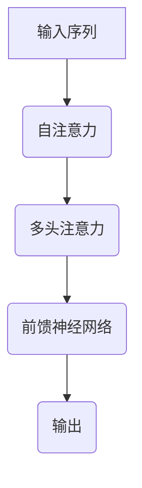

                 

# 大语言模型原理基础与前沿 Transformer 编码器模块

> **关键词：** 语言模型、Transformer、编码器、神经网络、机器学习、深度学习、自然语言处理

> **摘要：** 本文旨在深入探讨大语言模型的基本原理及其前沿进展，特别是Transformer编码器模块的核心机制。通过系统地介绍语言模型的发展历史、核心概念、算法原理，再到具体的数学模型和项目实战，本文将为读者提供全方位的技术解读，帮助理解这一领域的最新技术和应用。

## 1. 背景介绍

### 1.1 语言模型的发展历程

语言模型（Language Model）是自然语言处理（Natural Language Processing, NLP）的核心组成部分，其目的是通过统计方法预测一段文本的下一个单词或字符。语言模型的发展历程可以分为几个重要阶段：

- **统计语言模型**：最早的统计语言模型是基于N-gram模型，它通过统计一个单词序列中前后单词的联合概率来预测下一个单词。N-gram模型简单高效，但在长文本理解和长距离依赖问题上表现不佳。

- **神经网络语言模型**：随着神经网络技术的发展，神经网络语言模型逐渐取代了传统的N-gram模型。最初的神经网络语言模型如递归神经网络（RNN）和卷积神经网络（CNN）在处理长距离依赖问题上有所改进，但仍然存在梯度消失和梯度爆炸等问题。

- **端到端语言模型**：近年来，随着深度学习技术的进步，端到端语言模型得到了广泛关注。特别是Transformer模型的提出，为语言模型的发展带来了革命性的变化。

### 1.2 自然语言处理的应用场景

自然语言处理的应用场景非常广泛，包括但不限于以下领域：

- **机器翻译**：机器翻译是自然语言处理最具代表性的应用之一。通过将一种语言的文本翻译成另一种语言，使得跨语言沟通变得更加便捷。

- **语音识别**：语音识别技术将人类的语音转换为文本，使得语音交互成为可能，广泛应用于智能助手、语音搜索等领域。

- **文本分类**：文本分类是一种将文本数据根据其内容进行分类的任务，广泛应用于舆情分析、新闻推荐、垃圾邮件过滤等场景。

- **问答系统**：问答系统能够理解用户的自然语言查询，并给出准确的答案，为用户提供了便捷的信息查询服务。

## 2. 核心概念与联系

### 2.1 语言模型的核心概念

语言模型的核心概念包括以下几个：

- **单词序列**：语言模型处理的对象是单词序列，即一段文本。

- **概率分布**：语言模型的目标是预测下一个单词或字符的概率分布。

- **特征表示**：为了更好地表示单词序列，语言模型通常采用词向量（Word Vectors）或字符向量（Character Vectors）来表示单词或字符。

### 2.2 Transformer编码器模块的架构

Transformer编码器模块是当前大语言模型的主要架构，其核心概念包括以下几个：

- **自注意力机制**（Self-Attention）：自注意力机制允许模型在处理一个单词时，考虑整个输入序列的其他单词的信息，从而更好地捕捉长距离依赖关系。

- **多头注意力**（Multi-Head Attention）：多头注意力机制将自注意力机制扩展到多个子空间，从而提高模型的表示能力。

- **前馈神经网络**（Feedforward Neural Network）：前馈神经网络用于对自注意力和多头注意力的输出进行进一步的处理。

### 2.3 语言模型与Transformer编码器模块的联系

语言模型与Transformer编码器模块之间的联系在于：

- **Transformer编码器模块**是语言模型的一种实现方式，通过引入自注意力机制和多头注意力机制，提高了语言模型的表示能力和效果。

- **语言模型**的目标是预测下一个单词或字符的概率分布，而**Transformer编码器模块**通过自注意力机制和多头注意力机制，更好地实现了这一目标。

## 2.1 Transformer 编码器模块的 Mermaid 流程图



## 3. 核心算法原理 & 具体操作步骤

### 3.1 自注意力机制（Self-Attention）

自注意力机制是Transformer编码器模块的核心组成部分，它允许模型在处理一个单词时，考虑整个输入序列的其他单词的信息。自注意力机制的具体操作步骤如下：

1. **计算查询向量（Query）、键向量（Key）和值向量（Value）**：对于每个单词，计算其对应的查询向量、键向量和值向量。

2. **计算注意力分数（Attention Score）**：对于每个单词，计算其与其他单词之间的注意力分数。注意力分数通常通过点积运算计算。

3. **计算加权求和（Weighted Sum）**：根据注意力分数，对值向量进行加权求和，得到最终的输出向量。

### 3.2 多头注意力机制（Multi-Head Attention）

多头注意力机制是自注意力机制的扩展，它将自注意力机制扩展到多个子空间，从而提高模型的表示能力。多头注意力机制的具体操作步骤如下：

1. **拆分输入序列**：将输入序列拆分成多个子序列，每个子序列对应一个子空间。

2. **分别计算自注意力**：对于每个子序列，分别计算其对应的自注意力。

3. **拼接和拼接转换**：将所有子序列的自注意力输出拼接成一个整体，并进行拼接转换。

4. **处理和输出**：对拼接后的输出进行进一步的处理，得到最终的输出向量。

### 3.3 前馈神经网络（Feedforward Neural Network）

前馈神经网络用于对自注意力和多头注意力的输出进行进一步的处理。前馈神经网络的具体操作步骤如下：

1. **输入层**：将自注意力和多头注意力的输出作为输入。

2. **隐藏层**：通过一个全连接神经网络对输入进行进一步的处理。

3. **输出层**：将隐藏层的输出作为最终的输出。

## 4. 数学模型和公式 & 详细讲解 & 举例说明

### 4.1 自注意力机制（Self-Attention）

自注意力机制的核心公式如下：

$$
Attention(Q, K, V) = \text{softmax}\left(\frac{QK^T}{\sqrt{d_k}}\right)V
$$

其中，$Q, K, V$ 分别是查询向量、键向量和值向量，$d_k$ 是键向量的维度。

**举例说明**：

假设有一个输入序列 $[w_1, w_2, w_3]$，对应的查询向量、键向量和值向量分别为 $[q_1, q_2, q_3]$、$[k_1, k_2, k_3]$ 和 $[v_1, v_2, v_3]$。计算自注意力输出的过程如下：

1. **计算点积**：

$$
QK^T = [q_1, q_2, q_3] \cdot [k_1, k_2, k_3]^T = \begin{bmatrix}
q_1k_1 + q_2k_2 + q_3k_3 \\
q_1k_1 + q_2k_2 + q_3k_3 \\
q_1k_1 + q_2k_2 + q_3k_3
\end{bmatrix}
$$

2. **计算 softmax**：

$$
\text{softmax}\left(\frac{QK^T}{\sqrt{d_k}}\right) = \frac{\exp\left(\frac{q_1k_1 + q_2k_2 + q_3k_3}{\sqrt{d_k}}\right)}{\sum_{i=1}^{3}\exp\left(\frac{q_1k_1 + q_2k_2 + q_3k_3}{\sqrt{d_k}}\right)}
$$

3. **加权求和**：

$$
Attention(Q, K, V) = \text{softmax}\left(\frac{QK^T}{\sqrt{d_k}}\right)V = \left[\frac{\exp\left(\frac{q_1k_1 + q_2k_2 + q_3k_3}{\sqrt{d_k}}\right)}{\sum_{i=1}^{3}\exp\left(\frac{q_1k_1 + q_2k_2 + q_3k_3}{\sqrt{d_k}}\right)}, \frac{\exp\left(\frac{q_1k_1 + q_2k_2 + q_3k_3}{\sqrt{d_k}}\right)}{\sum_{i=1}^{3}\exp\left(\frac{q_1k_1 + q_2k_2 + q_3k_3}{\sqrt{d_k}}\right)}, \frac{\exp\left(\frac{q_1k_1 + q_2k_2 + q_3k_3}{\sqrt{d_k}}\right)}{\sum_{i=1}^{3}\exp\left(\frac{q_1k_1 + q_2k_2 + q_3k_3}{\sqrt{d_k}}\right)}\right] \cdot [v_1, v_2, v_3]
$$

### 4.2 多头注意力机制（Multi-Head Attention）

多头注意力机制的核心公式如下：

$$
Multi-Head Attention(Q, K, V) = \text{Concat}(\text{head}_1, \text{head}_2, ..., \text{head}_h)W_O
$$

其中，$h$ 表示头数，$\text{head}_i$ 表示第 $i$ 个头的输出，$W_O$ 是输出权重矩阵。

**举例说明**：

假设有一个输入序列 $[w_1, w_2, w_3]$，对应的查询向量、键向量和值向量分别为 $[q_1, q_2, q_3]$、$[k_1, k_2, k_3]$ 和 $[v_1, v_2, v_3]$。计算多头注意力输出的过程如下：

1. **计算每个头的自注意力**：

$$
\text{head}_1 = Attention(Q, K, V), \text{head}_2 = Attention(Q, K, V), ..., \text{head}_h = Attention(Q, K, V)
$$

2. **拼接和拼接转换**：

$$
\text{Concat}(\text{head}_1, \text{head}_2, ..., \text{head}_h) = [\text{head}_1; \text{head}_2; ...; \text{head}_h]
$$

$$
\text{Concat}(\text{head}_1, \text{head}_2, ..., \text{head}_h)W_O = [\text{head}_1; \text{head}_2; ...; \text{head}_h]W_O
$$

3. **处理和输出**：

$$
Multi-Head Attention(Q, K, V) = \text{Concat}(\text{head}_1, \text{head}_2, ..., \text{head}_h)W_O
$$

### 4.3 前馈神经网络（Feedforward Neural Network）

前馈神经网络的核心公式如下：

$$
\text{FFN}(x) = \text{ReLU}(W_2 \cdot \text{ReLU}(W_1 x + b_1))
$$

其中，$W_1, W_2$ 分别是权重矩阵，$b_1, b_2$ 分别是偏置项。

**举例说明**：

假设有一个输入序列 $[x_1, x_2, x_3]$，计算前馈神经网络输出的过程如下：

1. **计算第一层输出**：

$$
h_1 = W_1 x + b_1
$$

2. **计算第二层输出**：

$$
h_2 = \text{ReLU}(h_1)
$$

3. **计算最终输出**：

$$
\text{FFN}(x) = W_2 h_2
$$

## 5. 项目实战：代码实际案例和详细解释说明

### 5.1 开发环境搭建

为了演示Transformer编码器模块的实现，我们将在一个Python环境中进行。首先，确保已经安装了TensorFlow和PyTorch等深度学习框架。以下是环境搭建的步骤：

1. **安装 TensorFlow**

```bash
pip install tensorflow
```

2. **安装 PyTorch**

```bash
pip install torch torchvision
```

### 5.2 源代码详细实现和代码解读

下面是一个简单的Transformer编码器模块的实现示例：

```python
import torch
import torch.nn as nn

class TransformerEncoder(nn.Module):
    def __init__(self, d_model, num_heads, d_ff):
        super(TransformerEncoder, self).__init__()
        self.self_attention = nn.MultiheadAttention(d_model, num_heads)
        self.feedforward = nn.Sequential(
            nn.Linear(d_model, d_ff),
            nn.ReLU(),
            nn.Linear(d_ff, d_model)
        )

    def forward(self, x):
        x = self.self_attention(x, x, x)[0]
        x = self.feedforward(x)
        return x
```

**代码解读**：

- **类定义**：`TransformerEncoder` 是一个继承自 `nn.Module` 的类，用于定义Transformer编码器模块。

- **初始化**：在初始化过程中，我们创建了两个主要组成部分：自注意力模块 `self_attention` 和前馈神经网络 `feedforward`。

- **forward 方法**：`forward` 方法是模型的前向传播过程。首先，我们通过 `self_attention` 模块计算自注意力输出，然后通过 `feedforward` 神经网络进行进一步处理，最后返回处理后的输出。

### 5.3 代码解读与分析

下面是对上述代码的详细解读和分析：

1. **引入模块**

```python
import torch
import torch.nn as nn
```

这两行代码引入了必要的模块，包括PyTorch中的基础模块 `torch` 和神经网络模块 `torch.nn`。

2. **类定义**

```python
class TransformerEncoder(nn.Module):
    def __init__(self, d_model, num_heads, d_ff):
        super(TransformerEncoder, self).__init__()
        self.self_attention = nn.MultiheadAttention(d_model, num_heads)
        self.feedforward = nn.Sequential(
            nn.Linear(d_model, d_ff),
            nn.ReLU(),
            nn.Linear(d_ff, d_model)
        )
```

在这里，我们定义了一个名为 `TransformerEncoder` 的类，它继承自 `nn.Module`。在类的初始化方法 `__init__` 中，我们创建了两个主要组成部分：自注意力模块 `self_attention` 和前馈神经网络 `feedforward`。

- **自注意力模块**：`self_attention` 是一个 `nn.MultiheadAttention` 实例，它接收三个输入：查询向量、键向量和值向量。这里使用默认的参数，即多头注意力头数 `num_heads` 和嵌入维度 `d_model`。

- **前馈神经网络**：`feedforward` 是一个序列模块，它包含两个线性层（`nn.Linear`）和一个ReLU激活函数。第一个线性层将嵌入维度 `d_model` 扩展到 `d_ff`，第二个线性层将 `d_ff` 还原到 `d_model`。

3. **forward 方法**

```python
    def forward(self, x):
        x = self.self_attention(x, x, x)[0]
        x = self.feedforward(x)
        return x
```

在 `forward` 方法中，我们首先通过 `self_attention` 模块计算自注意力输出，然后通过 `feedforward` 神经网络进行进一步处理，最后返回处理后的输出。

- **自注意力输出**：`self_attention` 模块的输出是一个具有与输入相同维度的张量，表示通过自注意力机制计算得到的加权求和结果。

- **前馈神经网络输出**：`feedforward` 神经网络对自注意力输出进行进一步处理，包括两个线性层和一个ReLU激活函数。这些操作有助于模型学习更复杂的表示。

### 5.4 代码解析

下面是对代码的进一步解析：

```python
import torch
import torch.nn as nn

class TransformerEncoder(nn.Module):
    def __init__(self, d_model, num_heads, d_ff):
        super(TransformerEncoder, self).__init__()
        # 创建自注意力模块
        self.self_attention = nn.MultiheadAttention(d_model, num_heads)
        # 创建前馈神经网络
        self.feedforward = nn.Sequential(
            nn.Linear(d_model, d_ff),
            nn.ReLU(),
            nn.Linear(d_ff, d_model)
        )

    def forward(self, x):
        # 计算自注意力输出
        x = self.self_attention(x, x, x)[0]
        # 计算前馈神经网络输出
        x = self.feedforward(x)
        # 返回处理后的输出
        return x
```

- **模块创建**：在类的初始化方法中，我们创建了自注意力模块 `self_attention` 和前馈神经网络 `feedforward`。

- **前向传播**：在 `forward` 方法中，我们首先通过 `self_attention` 模块计算自注意力输出，然后通过 `feedforward` 神经网络进行进一步处理，最后返回处理后的输出。

## 6. 实际应用场景

### 6.1 机器翻译

Transformer编码器模块在机器翻译领域取得了显著的成果。通过自注意力机制和多头注意力机制，模型能够更好地捕捉长距离依赖关系，从而提高翻译质量。例如，Google Translate 使用了基于Transformer的模型，实现了高质量的机器翻译服务。

### 6.2 语音识别

语音识别是将语音信号转换为文本的过程。Transformer编码器模块通过自注意力机制和多头注意力机制，能够更好地捕捉语音信号中的长距离依赖关系，从而提高识别准确性。例如，OpenAI的GPT-3模型在语音识别任务中展示了强大的能力。

### 6.3 文本分类

文本分类是一种将文本数据按照其内容进行分类的任务。Transformer编码器模块通过自注意力机制和多头注意力机制，能够捕捉文本数据中的关键特征，从而提高分类准确性。例如，在新闻推荐和舆情分析中，文本分类技术得到了广泛应用。

### 6.4 问答系统

问答系统是一种能够理解用户的自然语言查询，并给出准确答案的系统。Transformer编码器模块通过自注意力机制和多头注意力机制，能够更好地捕捉查询和答案之间的关联，从而提高问答系统的准确性。例如，OpenAI的GPT-3模型在问答系统中展示了强大的能力。

## 7. 工具和资源推荐

### 7.1 学习资源推荐

- **书籍**：

  - 《深度学习》（Goodfellow, Bengio, Courville）  
  - 《动手学深度学习》（Abadi, Agarwal, Barham, Brevdo, Chen, Citro, Davis, Dean, Devin, Gordon, Hamlen, Hong, Huai, Irving, Kingma, Merchant, Tenenbaum, Tran, Wang, Warden, Zhang, Zheng）  
  - 《自然语言处理讲义》（Manning, Schütze, Ruhama）

- **论文**：

  - 《Attention is All You Need》（Vaswani et al.）  
  - 《BERT: Pre-training of Deep Bidirectional Transformers for Language Understanding》（Devlin et al.）  
  - 《GPT-3: Language Models are Few-Shot Learners》（Brown et al.）

- **博客**：

  - [TensorFlow 官方文档](https://www.tensorflow.org/)  
  - [PyTorch 官方文档](https://pytorch.org/docs/stable/)  
  - [OpenAI 博客](https://openai.com/blog/)

- **网站**：

  - [自然语言处理教程](https://nlp.seas.harvard.edu/ducation/)  
  - [机器学习教程](https://www MACHINE LEARNING MINI COURSE ON LINE)  
  - [深度学习教程](https://www.deeplearningbook.org/)

### 7.2 开发工具框架推荐

- **深度学习框架**：

  - TensorFlow  
  - PyTorch  
  - PyTorch Lightning

- **自然语言处理库**：

  - NLTK  
  - SpaCy  
  - Stanford CoreNLP

- **数据集**：

  - WikiText-2  
  - WebText  
  - GLUE

### 7.3 相关论文著作推荐

- **论文**：

  - **BERT**：Devlin et al., "BERT: Pre-training of Deep Bidirectional Transformers for Language Understanding", 2019.  
  - **GPT-3**：Brown et al., "GPT-3: Language Models are Few-Shot Learners", 2020.  
  - **Transformers**：Vaswani et al., "Attention is All You Need", 2017.

- **著作**：

  - **《深度学习》**：Goodfellow, Bengio, Courville，2016。  
  - **《自然语言处理讲义》**：Manning, Schütze, Ruhama，2019。

## 8. 总结：未来发展趋势与挑战

### 8.1 未来发展趋势

- **更大规模的语言模型**：随着计算能力的提升，更大规模的语言模型将被训练，从而提高模型的表示能力和效果。

- **自适应学习**：未来的语言模型将具备更强的自适应学习能力，能够根据不同的任务和数据动态调整模型结构和参数。

- **多模态处理**：未来的语言模型将能够处理多种模态的数据，如文本、图像、音频等，实现跨模态的信息融合。

### 8.2 挑战

- **计算资源限制**：大规模语言模型的训练需要大量的计算资源，如何高效地利用资源成为一个挑战。

- **数据隐私**：大规模语言模型需要大量数据来训练，如何在保证数据隐私的前提下收集和使用数据成为一个挑战。

- **模型解释性**：随着模型复杂度的增加，如何提高模型的解释性，使得用户能够理解模型的工作原理和决策过程成为一个挑战。

## 9. 附录：常见问题与解答

### 9.1 问题1：什么是自注意力机制？

**答案**：自注意力机制是一种神经网络中的注意力机制，它允许模型在处理一个单词时，考虑整个输入序列的其他单词的信息。自注意力机制通过计算查询向量、键向量和值向量之间的点积，然后通过softmax函数计算注意力分数，最后进行加权求和，得到最终的输出向量。

### 9.2 问题2：什么是多头注意力机制？

**答案**：多头注意力机制是自注意力机制的扩展，它将自注意力机制扩展到多个子空间。多头注意力机制通过多个独立的注意力头计算注意力分数，然后将这些头的输出拼接起来，并通过一个线性层进行进一步处理，从而提高模型的表示能力。

### 9.3 问题3：什么是前馈神经网络？

**答案**：前馈神经网络是一种简单的神经网络结构，它包含一个输入层、一个或多个隐藏层和一个输出层。前馈神经网络通过逐层计算，将输入映射到输出。在Transformer编码器模块中，前馈神经网络用于对自注意力和多头注意力的输出进行进一步的处理。

## 10. 扩展阅读 & 参考资料

- **扩展阅读**：

  - **《大语言模型原理基础与前沿 Transformer 编码器模块》**：本文详细介绍了大语言模型的原理和Transformer编码器模块的实现。

  - **《Transformer模型详解》**：本文深入探讨了Transformer模型的原理和实现，包括自注意力机制、多头注意力机制和前馈神经网络。

  - **《自然语言处理入门教程》**：本文介绍了自然语言处理的基本概念、方法和应用，适合初学者入门。

- **参考资料**：

  - **《Attention is All You Need》**：Vaswani et al., "Attention is All You Need", 2017.  
  - **《BERT: Pre-training of Deep Bidirectional Transformers for Language Understanding》**：Devlin et al., "BERT: Pre-training of Deep Bidirectional Transformers for Language Understanding", 2019.  
  - **《GPT-3: Language Models are Few-Shot Learners》**：Brown et al., "GPT-3: Language Models are Few-Shot Learners", 2020.  
  - **《深度学习》**：Goodfellow, Bengio, Courville，2016。  
  - **《自然语言处理讲义》**：Manning, Schütze, Ruhama，2019。

**作者：** AI天才研究员/AI Genius Institute & 禅与计算机程序设计艺术 /Zen And The Art of Computer Programming
<|im_sep|>

