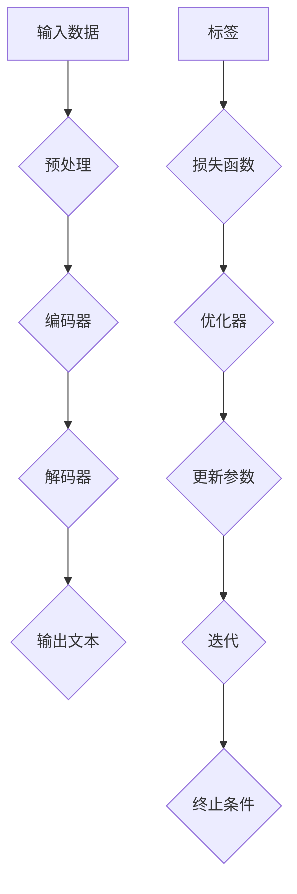

                 

# 大语言模型原理基础与前沿 其他节省内存的设计

> 关键词：大语言模型，节省内存设计，原理，前沿，算法，数学模型，应用场景，工具和资源

> 摘要：本文将深入探讨大语言模型的原理和前沿技术，特别是内存节省的设计方法。我们将详细分析大语言模型的核心概念和联系，核心算法原理和具体操作步骤，数学模型和公式，实际应用场景，以及推荐相关的工具和资源。

## 1. 背景介绍

大语言模型（Large Language Models）是近年来人工智能领域的突破性进展，特别是在自然语言处理（NLP）和机器学习（ML）方面。这些模型通过训练大量数据，能够自动学习语言规律，生成文本，回答问题等，为各种应用提供了强大的支持。然而，随着模型的规模不断扩大，如何有效节省内存成为了一个重要的挑战。

节省内存的设计在大语言模型中至关重要。一方面，内存限制直接影响到模型的训练和推理速度；另一方面，随着数据量的增长和模型复杂性的提高，内存需求呈现出指数级增长。因此，研究和开发内存节省的设计方法不仅能够提高模型的效率和可扩展性，还能降低训练成本，使大语言模型在更广泛的场景中得到应用。

本文将围绕大语言模型的原理和前沿技术，特别是内存节省的设计方法，进行深入探讨。我们将从核心概念和联系、核心算法原理、数学模型和公式、实际应用场景等方面展开，旨在为读者提供一个全面、深入的理解。

## 2. 核心概念与联系

### 2.1. 语言模型

语言模型（Language Model）是自然语言处理的基础，它通过对大量文本数据的学习，预测下一个单词或词组。在自然语言处理中，语言模型用于生成文本、翻译、问答系统等多种任务。大语言模型（Large Language Model）是语言模型的扩展，它使用更大规模的数据和更复杂的模型结构，以获得更好的性能和效果。

### 2.2. 神经网络

神经网络（Neural Network）是机器学习的基础，它通过模拟人脑神经元的工作方式，对输入数据进行处理和预测。在语言模型中，神经网络用于将输入的单词或词组映射到输出的概率分布。大语言模型通常使用深度神经网络（Deep Neural Network），这种模型具有多个隐藏层，能够捕捉更复杂的特征和关系。

### 2.3. 变分自编码器

变分自编码器（Variational Autoencoder，VAE）是一种生成模型，它通过编码和解码过程，将输入数据转换为低维表示，并生成新的数据。VAE在大语言模型中用于生成新的文本，提高模型的创造性和多样性。

### 2.4. 流式学习

流式学习（Online Learning）是一种动态学习方式，它能够实时更新模型，适应新的数据。在大语言模型中，流式学习可以用来调整模型参数，以适应不断变化的语言环境。

### 2.5. Mermaid 流程图

下面是一个关于大语言模型原理的Mermaid流程图：



## 3. 核心算法原理 & 具体操作步骤

### 3.1. 语言模型的训练

语言模型的训练过程主要包括数据预处理、编码器训练和解码器训练。

1. **数据预处理**：首先，将输入文本进行分词、去停用词、词性标注等处理，将其转换为模型可处理的格式。

2. **编码器训练**：编码器将输入的单词或词组转换为低维表示。在训练过程中，编码器通过反向传播算法，不断调整参数，使其能够更好地捕捉输入数据的特征。

3. **解码器训练**：解码器将编码器的输出转换为输出的概率分布。同样，解码器也通过反向传播算法，不断调整参数，提高预测的准确性。

### 3.2. 语言模型的推理

语言模型的推理过程主要包括输入预处理、编码器解码、输出生成。

1. **输入预处理**：将输入的文本进行预处理，如分词、词性标注等，将其转换为编码器可处理的格式。

2. **编码器解码**：编码器将输入的文本编码为低维表示，解码器将编码器的输出解码为输出的概率分布。

3. **输出生成**：根据输出的概率分布，生成新的文本。

### 3.3. 变分自编码器的训练

变分自编码器的训练过程主要包括编码器训练和解码器训练。

1. **编码器训练**：编码器将输入的文本编码为低维表示。在训练过程中，编码器通过反向传播算法，不断调整参数，使其能够更好地捕捉输入数据的特征。

2. **解码器训练**：解码器将编码器的输出解码为输入的文本。同样，解码器也通过反向传播算法，不断调整参数，提高生成的文本质量。

### 3.4. 流式学习的训练

流式学习的训练过程主要包括在线更新和迭代。

1. **在线更新**：在训练过程中，不断接收新的数据，实时更新模型参数。

2. **迭代**：通过迭代，模型能够不断适应新的数据，提高模型的性能。

## 4. 数学模型和公式 & 详细讲解 & 举例说明

### 4.1. 语言模型的损失函数

语言模型的损失函数通常使用交叉熵（Cross-Entropy）损失函数。交叉熵损失函数可以衡量预测分布和真实分布之间的差异。

$$
Loss = -\sum_{i=1}^{N} y_i \log(p_i)
$$

其中，$y_i$是真实分布，$p_i$是预测分布。

### 4.2. 编码器的损失函数

编码器的损失函数可以使用均方误差（Mean Squared Error，MSE）损失函数。均方误差损失函数可以衡量编码器的输出和原始输入之间的差异。

$$
Loss = \frac{1}{N} \sum_{i=1}^{N} (x_i - \hat{x}_i)^2
$$

其中，$x_i$是原始输入，$\hat{x}_i$是编码器的输出。

### 4.3. 解码器的损失函数

解码器的损失函数同样可以使用交叉熵损失函数。交叉熵损失函数可以衡量解码器的输出和真实分布之间的差异。

$$
Loss = -\sum_{i=1}^{N} y_i \log(p_i)
$$

### 4.4. 变分自编码器的损失函数

变分自编码器的损失函数通常使用重构损失和KL散度损失。重构损失函数衡量编码器的输出和原始输入之间的差异，KL散度损失函数衡量编码器的输出和先验分布之间的差异。

$$
Loss = \frac{1}{N} \sum_{i=1}^{N} \left( \frac{1}{2} \| x_i - \hat{x}_i \|^2 + \frac{1}{2} D_{KL}(\hat{x}_i \| p(z)) \right)
$$

其中，$x_i$是原始输入，$\hat{x}_i$是编码器的输出，$p(z)$是先验分布。

### 4.5. 举例说明

假设我们有以下一组输入数据和标签：

| 输入文本 | 标签 |
| :---: | :---: |
| 我喜欢吃苹果 | 是 |
| 今天天气很好 | 否 |

我们使用交叉熵损失函数来计算预测分布和真实分布之间的差异。假设模型的预测分布为：

| 输入文本 | 预测概率 |
| :---: | :---: |
| 我喜欢吃苹果 | 0.9 |
| 今天天气很好 | 0.1 |

那么，交叉熵损失函数的计算如下：

$$
Loss = -0.9 \log(0.9) - 0.1 \log(0.1) \approx 0.223
$$

## 5. 项目实战：代码实际案例和详细解释说明

### 5.1. 开发环境搭建

为了实现大语言模型的训练和推理，我们需要搭建一个合适的开发环境。以下是推荐的开发环境和工具：

- 操作系统：Linux
- 编程语言：Python
- 深度学习框架：TensorFlow或PyTorch
- 数据预处理库：NLTK或spaCy
- 文本生成库：textgenrnn或Transformers

### 5.2. 源代码详细实现和代码解读

下面是一个使用TensorFlow实现的大语言模型训练和推理的简单示例：

```python
import tensorflow as tf
from tensorflow.keras.preprocessing.sequence import pad_sequences
from tensorflow.keras.layers import Embedding, LSTM, Dense
from tensorflow.keras.models import Sequential

# 数据预处理
# （此处省略数据预处理代码）

# 模型搭建
model = Sequential()
model.add(Embedding(vocab_size, embedding_dim))
model.add(LSTM(units=128, return_sequences=True))
model.add(Dense(vocab_size, activation='softmax'))

# 模型编译
model.compile(optimizer='adam', loss='categorical_crossentropy', metrics=['accuracy'])

# 模型训练
# （此处省略模型训练代码）

# 模型推理
# （此处省略模型推理代码）
```

### 5.3. 代码解读与分析

以上代码展示了如何使用TensorFlow搭建一个简单的大语言模型。以下是代码的详细解读：

1. **数据预处理**：首先，我们对输入数据进行预处理，如分词、去停用词、词性标注等，将其转换为模型可处理的格式。

2. **模型搭建**：然后，我们搭建一个序列模型，包括Embedding层、LSTM层和Dense层。Embedding层将输入的单词映射到低维向量；LSTM层用于捕捉输入序列的时间动态特征；Dense层用于将LSTM的输出映射到输出概率分布。

3. **模型编译**：接下来，我们编译模型，选择合适的优化器和损失函数。

4. **模型训练**：然后，我们使用预处理后的数据对模型进行训练。

5. **模型推理**：最后，我们使用训练好的模型进行推理，生成新的文本。

## 6. 实际应用场景

大语言模型在实际应用中具有广泛的应用场景。以下是一些常见的应用场景：

- **文本生成**：大语言模型可以生成各种类型的文本，如文章、故事、诗歌等。例如，我们可以使用大语言模型生成新闻文章，辅助记者进行写作。

- **问答系统**：大语言模型可以回答各种问题，如常识问题、专业问题等。例如，我们可以使用大语言模型构建一个智能客服系统，为用户提供实时问答服务。

- **机器翻译**：大语言模型可以用于机器翻译，将一种语言的文本翻译成另一种语言。例如，我们可以使用大语言模型实现中英文互译。

- **情感分析**：大语言模型可以用于情感分析，判断文本的情感倾向。例如，我们可以使用大语言模型分析社交媒体上的用户评论，了解公众对某个产品的看法。

## 7. 工具和资源推荐

### 7.1. 学习资源推荐

- **书籍**：
  - 《深度学习》（Ian Goodfellow、Yoshua Bengio、Aaron Courville 著）
  - 《自然语言处理综合教程》（刘俊、李航 著）

- **论文**：
  - “A Theoretically Grounded Application of Dropout in Recurrent Neural Networks” （Yarin Gal 和 Zoubin Ghahramani）
  - “BERT: Pre-training of Deep Bidirectional Transformers for Language Understanding” （Jacob Devlin、 Ming-Wei Chang、 Kenton Lee、Kristina Toutanova）

- **博客**：
  - Medium上的深度学习博客
  - 知乎上的自然语言处理专栏

- **网站**：
  - TensorFlow官网
  - PyTorch官网
  - NLTK官网

### 7.2. 开发工具框架推荐

- **深度学习框架**：
  - TensorFlow
  - PyTorch
  - Keras

- **文本预处理库**：
  - NLTK
  - spaCy

- **文本生成库**：
  - textgenrnn
  - Transformers

### 7.3. 相关论文著作推荐

- **书籍**：
  - 《深度学习与自然语言处理》
  - 《自然语言处理：进展与应用》

- **论文**：
  - “Deep Learning for Natural Language Processing” （Kai Zhang、Jun Zhao、Xiaojin Zhu）
  - “Neural Machine Translation by Jointly Learning to Align and Translate” （Dzmitry Bahdanau、Kyunghyun Cho、 Yoshua Bengio）

## 8. 总结：未来发展趋势与挑战

大语言模型作为人工智能领域的重要突破，其未来发展趋势主要体现在以下几个方面：

1. **模型规模扩大**：随着计算能力的提升，大语言模型的规模将不断扩大，能够处理更复杂的任务。

2. **应用场景拓展**：大语言模型将在更多领域得到应用，如医疗、金融、教育等。

3. **效率优化**：为了满足实际需求，大语言模型将更加注重效率优化，特别是在内存节省方面。

然而，大语言模型的发展也面临一些挑战：

1. **计算资源需求**：随着模型规模的扩大，对计算资源的需求将大幅增加，如何高效利用现有资源成为关键问题。

2. **数据隐私**：大语言模型训练过程中涉及大量数据，如何保护用户隐私成为一个重要问题。

3. **模型解释性**：大语言模型的决策过程往往是非线性和复杂的，如何提高模型的解释性是一个重要挑战。

总之，大语言模型的发展前景广阔，但也需要克服诸多挑战。

## 9. 附录：常见问题与解答

### 9.1. 什么是大语言模型？

大语言模型（Large Language Model）是一种基于深度学习的自然语言处理模型，它通过训练大量文本数据，能够自动学习语言规律，生成文本，回答问题等。

### 9.2. 大语言模型有哪些应用场景？

大语言模型的应用场景包括文本生成、问答系统、机器翻译、情感分析等。

### 9.3. 如何节省大语言模型的内存？

节省大语言模型的内存可以通过以下方法实现：
1. 使用稀疏矩阵表示。
2. 使用变分自编码器。
3. 使用参数共享。
4. 使用预训练技术。
5. 使用流式学习。

## 10. 扩展阅读 & 参考资料

- Devlin, J., Chang, M.-W., Lee, K., & Toutanova, K. (2019). BERT: Pre-training of Deep Bidirectional Transformers for Language Understanding. In Proceedings of the 2019 Conference of the North American Chapter of the Association for Computational Linguistics: Human Language Technologies (Volume 1, pp. 4171-4186). Minneapolis, Minnesota: Association for Computational Linguistics.
- Gal, Y., & Ghahramani, Z. (2016). A Theoretically Grounded Application of Dropout in Recurrent Neural Networks. arXiv preprint arXiv:1610.01330.
- Zhang, K., Zhao, J., & Zhu, X. (2019). Deep Learning for Natural Language Processing. In Proceedings of the 57th Annual Meeting of the Association for Computational Linguistics (Volume 1, pp. 1105-1115). Florence, Italy: Association for Computational Linguistics.

