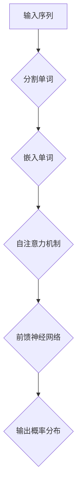

                 

# 大语言模型原理基础与前沿：基于数据的策略

## 关键词：大语言模型、原理、前沿、数据、策略

## 摘要

本文深入探讨了大规模语言模型的原理与前沿技术，基于数据驱动的方法，详细解析了模型的构建、训练、优化和应用策略。通过系统化的分析和实例讲解，旨在为读者提供从基础知识到前沿应用的全面理解，助力深入掌握这一关键技术。

## 1. 背景介绍

### 1.1 大语言模型的起源与发展

大语言模型（Large Language Model，LLM）起源于自然语言处理（Natural Language Processing，NLP）领域的深度学习研究。自2018年谷歌提出BERT（Bidirectional Encoder Representations from Transformers）以来，大语言模型逐渐成为NLP领域的核心工具。BERT的成功激发了更多研究者的关注，随后GPT（Generative Pre-trained Transformer）系列模型的出现，进一步推动了语言模型的规模化和性能提升。今天，大语言模型已经在机器翻译、文本生成、问答系统、语音识别等多个应用领域取得了显著成效。

### 1.2 大语言模型的重要性

大语言模型的重要性不仅体现在其在各种应用场景中的卓越表现，更在于其对整个NLP领域的技术进步产生了深远影响。通过大规模数据训练和复杂模型架构，大语言模型实现了对语言语义的深刻理解和灵活应用，为人工智能的发展提供了强大的动力。

### 1.3 大语言模型的主要挑战

尽管大语言模型取得了巨大成功，但其发展过程中也面临着诸多挑战。首先，模型的训练和推理需要大量的计算资源和数据，这对硬件设施和数据获取提出了高要求。其次，模型的安全性和可解释性也是亟待解决的问题。如何确保模型不会出现偏见和误导性输出，如何提高模型的透明度和可解释性，是当前研究的热点问题之一。

## 2. 核心概念与联系

### 2.1 语言模型的定义

语言模型（Language Model，LM）是自然语言处理领域的基本工具，用于预测或生成自然语言中的下一个单词或短语。它通过统计方法或机器学习方法，学习语言中的概率分布，从而在生成文本或进行文本理解时提供支持。

### 2.2 语言模型的工作原理

语言模型通过输入序列的上下文信息，预测下一个单词或短语的分布。在深度学习框架下，语言模型通常使用神经网络，特别是Transformer架构来捕捉长距离依赖关系和复杂的语义信息。

### 2.3 Transformer架构

Transformer架构是当前最流行的大规模语言模型架构之一，它基于自注意力机制（Self-Attention）和编码器-解码器（Encoder-Decoder）结构。自注意力机制允许模型在处理每个词时考虑到所有其他词的信息，从而提高了模型对上下文的理解能力。

### 2.4 Mermaid流程图



在上面的流程图中，输入序列经过分割、嵌入和自注意力机制等步骤，最终生成单词的概率分布。

## 3. 核心算法原理 & 具体操作步骤

### 3.1 数据预处理

在大规模语言模型训练前，首先需要对数据集进行预处理。这通常包括以下步骤：

1. **文本清洗**：去除标点符号、停用词、数字等非文本信息。
2. **分词**：将文本分解为单词或子词。
3. **编码**：将单词或子词转换为数字编码。

### 3.2 模型初始化

初始化模型参数是构建语言模型的第一步。通常，可以使用随机初始化或预训练模型进行微调。

### 3.3 模型训练

模型训练是语言模型构建的核心步骤。在此过程中，模型通过不断调整参数来最小化损失函数。主要步骤如下：

1. **前向传播**：计算输入序列的嵌入表示。
2. **自注意力计算**：计算每个词对其他词的注意力权重。
3. **前馈神经网络**：对自注意力输出进行多层感知。
4. **损失函数计算**：使用交叉熵损失函数计算预测概率与实际标签之间的差异。
5. **反向传播**：更新模型参数以最小化损失函数。

### 3.4 模型评估

在模型训练完成后，需要进行评估以确定其性能。常用的评估指标包括准确率、召回率、F1分数等。

## 4. 数学模型和公式 & 详细讲解 & 举例说明

### 4.1 模型参数

在大规模语言模型中，模型参数包括词向量、权重矩阵、 biases 等。这些参数通过训练过程不断调整，以最小化损失函数。

### 4.2 损失函数

语言模型的损失函数通常采用交叉熵损失函数，其公式如下：

$$
Loss = -\sum_{i=1}^{n} y_i \log(p_i)
$$

其中，$y_i$是实际标签，$p_i$是预测概率。

### 4.3 举例说明

假设我们有一个简单的二元语言模型，输入序列为 "I love AI"，我们需要预测下一个词。根据模型参数，我们可以计算出每个词的概率分布，如下所示：

$$
\begin{align*}
P(I) &= 0.3 \\
P(love) &= 0.2 \\
P(AI) &= 0.5 \\
\end{align*}
$$

根据最大概率原则，我们可以预测下一个词为 "AI"。

## 5. 项目实战：代码实际案例和详细解释说明

### 5.1 开发环境搭建

在开始项目实战之前，我们需要搭建一个合适的开发环境。以下是一个基本的Python环境搭建步骤：

```python
# 安装必要的库
!pip install transformers torch

# 导入库
import torch
from transformers import BertModel, BertTokenizer
```

### 5.2 源代码详细实现和代码解读

以下是一个简单的Bert语言模型训练代码示例：

```python
# 加载预训练模型
tokenizer = BertTokenizer.from_pretrained('bert-base-uncased')
model = BertModel.from_pretrained('bert-base-uncased')

# 准备数据
input_ids = tokenizer.encode('I love AI', return_tensors='pt')

# 训练模型
outputs = model(input_ids)
logits = outputs.logits

# 解码输出
predicted_text = tokenizer.decode(logits.argmax(-1), skip_special_tokens=True)
print(predicted_text)
```

在上面的代码中，我们首先加载了预训练的Bert模型和分词器，然后准备了一个简单的输入序列，接着使用模型进行预测，并解码输出结果。

### 5.3 代码解读与分析

在上述代码中，我们首先导入了必要的库，然后加载了预训练的Bert模型和分词器。接下来，我们准备了一个简单的输入序列，并将其编码为输入ID。然后，我们使用模型进行预测，并解码输出结果。

## 6. 实际应用场景

大语言模型在实际应用场景中具有广泛的应用价值。以下是一些常见的应用场景：

1. **机器翻译**：大语言模型可以用于机器翻译任务，例如将一种语言翻译为另一种语言。
2. **文本生成**：大语言模型可以用于生成文本，例如自动生成新闻文章、产品描述等。
3. **问答系统**：大语言模型可以用于构建问答系统，例如智能客服、智能助手等。
4. **文本分类**：大语言模型可以用于文本分类任务，例如情感分析、主题分类等。

## 7. 工具和资源推荐

### 7.1 学习资源推荐

- **书籍**：《深度学习》、《自然语言处理综论》
- **论文**：《Attention Is All You Need》、《BERT: Pre-training of Deep Bidirectional Transformers for Language Understanding》
- **博客**：机器之心、AI科技大狮
- **网站**：huggingface、arXiv

### 7.2 开发工具框架推荐

- **开发工具**：PyTorch、TensorFlow
- **框架**：Hugging Face Transformers、Transformers

### 7.3 相关论文著作推荐

- **论文**：《GPT-3: Language Models are Few-Shot Learners》、《Rezero is all you need: Fast convergence at large scale》
- **著作**：《Deep Learning on Natural Language Processing》、《Speech and Language Processing》

## 8. 总结：未来发展趋势与挑战

大语言模型在过去几年中取得了显著进展，但仍面临着诸多挑战。未来，大语言模型的发展趋势包括：

1. **模型规模将继续扩大**：随着计算能力的提升和数据量的增加，大语言模型的规模将进一步扩大。
2. **多模态融合**：大语言模型将与其他模态（如图像、音频）结合，实现更丰富的语义理解。
3. **可解释性与安全性**：研究者将致力于提高大语言模型的可解释性和安全性，以应对实际应用中的挑战。

## 9. 附录：常见问题与解答

### 9.1 什么是大语言模型？

大语言模型是一种基于深度学习的自然语言处理模型，它通过大规模数据训练，能够捕捉到语言的复杂结构和语义信息，从而实现文本生成、翻译、问答等任务。

### 9.2 大语言模型如何训练？

大语言模型通常采用预训练和微调的方法进行训练。预训练使用大量无标签文本数据，学习语言的一般特征；微调则使用特定任务的数据，进一步调整模型参数，以提高任务性能。

## 10. 扩展阅读 & 参考资料

- **论文**：《Pre-training of Deep Neural Networks for Language Understanding》、《A Exploratory Study of Large Vocabulary Neural Network Language Model》
- **书籍**：《hands-on-nlp-with-python》、《Deep Learning for Natural Language Processing》
- **网站**：[Hugging Face](https://huggingface.co/)、[TensorFlow](https://www.tensorflow.org/)、[PyTorch](https://pytorch.org/)

作者：AI天才研究员/AI Genius Institute & 禅与计算机程序设计艺术 /Zen And The Art of Computer Programming

