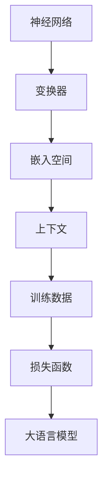

                 

# 大语言模型原理基础与前沿 思维链

## 关键词： 
- 大语言模型
- 自然语言处理
- 人工智能
- 神经网络
- 深度学习
- 机器学习
- 自动推理
- 思维链

## 摘要：
本文将深入探讨大语言模型的原理和前沿发展。首先，我们将回顾大语言模型的基础概念，包括其核心组成部分和基本架构。接着，我们将逐步解析大语言模型中的关键算法原理，探讨它们如何处理和生成语言。随后，我们将介绍数学模型和公式，以及如何利用这些模型和公式进行语言理解和生成。文章还会通过实际项目案例，展示大语言模型在现实中的应用。最后，我们将讨论大语言模型在实际应用中的挑战和未来发展趋势。

### 1. 背景介绍

随着互联网的普及和信息爆炸，数据量呈指数级增长。自然语言处理（NLP）作为人工智能（AI）的一个重要分支，逐渐成为研究和应用的热点。大语言模型（Large Language Models）应运而生，它们通过深度学习技术，能够自动地理解和生成人类语言，从而为各种NLP任务提供强大的支持。

大语言模型的研究起源于上世纪80年代的统计语言模型，当时研究人员开始利用机器学习技术来预测单词序列的概率分布。随着计算能力的提升和神经网络技术的发展，大语言模型逐渐演变成如今的多层神经网络结构，能够处理更复杂的语言现象。典型的例子包括GPT、BERT和T5等模型，它们在许多NLP任务中都取得了显著的成果。

自然语言处理（NLP）是计算机科学、人工智能和语言学领域的交叉学科，旨在让计算机能够理解、解释和生成自然语言。NLP的任务包括词性标注、句法分析、情感分析、机器翻译、问答系统等。随着深度学习技术的发展，神经网络，特别是深度神经网络（DNN）和变换器（Transformer）模型，已经成为NLP任务的强大工具。

人工智能（AI）则是一种模拟人类智能的计算机系统，它能够感知环境、理解语言、学习知识和做出决策。人工智能涵盖了多个领域，包括机器学习、自然语言处理、计算机视觉、机器人等。在人工智能的各个分支中，自然语言处理的应用最为广泛，也最为复杂。

神经网络（Neural Networks）是模拟生物神经元之间相互连接和作用的人工神经网络。在机器学习和人工智能领域，神经网络被广泛应用于分类、回归、生成和强化学习等任务。特别是深度神经网络（DNN），通过堆叠多层神经元，能够自动提取复杂特征，并在图像、语音、文本等多种数据上取得突破性成果。

深度学习（Deep Learning）是神经网络的一种发展，它通过多层神经网络的结构，能够自动学习数据的复杂特征表示。深度学习在计算机视觉、自然语言处理和语音识别等领域取得了显著的成功。特别是在图像分类任务中，深度学习模型如卷积神经网络（CNN）已经超越传统机器学习方法，成为主导技术。

机器学习（Machine Learning）是一种让计算机通过数据和经验自主学习和改进的方法。机器学习方法包括监督学习、无监督学习和强化学习等。在自然语言处理中，机器学习方法被广泛应用于文本分类、情感分析、机器翻译和问答系统等任务。

自动推理（Automated Reasoning）是一种人工智能技术，旨在让计算机自动推导和证明数学和逻辑命题。在自然语言处理领域，自动推理被应用于文本理解和推理任务，如问答系统、对话系统和文本生成等。

思维链（Thinking Chains）是一种逻辑推理方式，它通过建立一系列的逻辑关系链，对问题进行逐步分析和解决。在自然语言处理和人工智能领域，思维链被用于提升模型的推理能力和决策能力。

### 2. 核心概念与联系

大语言模型的核心概念包括神经网络、变换器、嵌入空间、上下文、训练数据和损失函数。下面，我们将详细解释这些概念，并展示它们之间的联系。

#### 神经网络（Neural Networks）

神经网络是模拟生物神经元之间相互连接和作用的人工神经网络。在机器学习和人工智能领域，神经网络被广泛应用于分类、回归、生成和强化学习等任务。特别是深度神经网络（DNN），通过堆叠多层神经元，能够自动提取复杂特征，并在图像、语音、文本等多种数据上取得突破性成果。

#### 变换器（Transformers）

变换器（Transformer）是一种基于自注意力机制（Self-Attention）的神经网络架构，由Vaswani等人在2017年提出。变换器在自然语言处理领域取得了显著的成功，特别是在机器翻译、文本生成和问答系统等任务中。

#### 嵌入空间（Embedding Space）

嵌入空间是一种将文本数据映射到低维连续向量空间的方法。通过嵌入，文本中的单词、句子和段落可以表示为向量，从而可以利用机器学习模型进行计算和推理。

#### 上下文（Context）

上下文是指文本中某个词或句子所处的环境。在大语言模型中，上下文对于理解语言含义至关重要。变换器通过自注意力机制，能够自动捕捉文本中的上下文信息。

#### 训练数据（Training Data）

训练数据是用于训练大语言模型的文本数据。通常，这些数据包括大量书籍、文章、对话等。通过在训练数据上进行预训练，大语言模型能够学习到语言的统计规律和语义信息。

#### 损失函数（Loss Function）

损失函数是评估模型预测结果与真实结果之间差异的函数。在大语言模型中，常用的损失函数包括交叉熵损失（Cross-Entropy Loss）和均方误差（Mean Squared Error）等。通过优化损失函数，大语言模型能够不断调整参数，提高预测精度。

下面是一个使用Mermaid绘制的流程图，展示大语言模型的核心概念和它们之间的联系：



### 3. 核心算法原理 & 具体操作步骤

#### 3.1. 变换器（Transformers）算法原理

变换器是一种基于自注意力机制（Self-Attention）的神经网络架构，由Vaswani等人在2017年提出。变换器在自然语言处理领域取得了显著的成功，特别是在机器翻译、文本生成和问答系统等任务中。以下是变换器的核心原理：

##### 自注意力机制（Self-Attention）

自注意力机制是一种计算文本中各个词之间的相互关系的方法。在变换器中，每个词都会被映射到一个嵌入向量，然后通过自注意力机制计算这些向量之间的权重。具体来说，自注意力机制包括以下步骤：

1. **嵌入（Embedding）**：将文本中的词映射到低维向量空间。
2. **Query、Key和Value**：分别表示查询向量、关键向量和值向量。每个词的嵌入向量都作为这三个向量的输入。
3. **计算权重（Compute Weights）**：通过计算查询向量和关键向量之间的点积，得到每个词的权重。
4. **加权求和（Weighted Sum）**：将权重应用于每个词的值向量，得到加权求和结果。

##### 编码器（Encoder）和解码器（Decoder）

变换器包括编码器（Encoder）和解码器（Decoder）两部分。编码器将输入文本序列转换为嵌入向量序列，解码器则将这些嵌入向量序列解码为输出文本序列。

1. **编码器**：编码器通过自注意力机制和前馈神经网络，逐步构建文本的上下文表示。编码器的输出是一个序列的嵌入向量。
2. **解码器**：解码器通过自注意力机制和编码器输出，生成输出文本序列。解码器在每个时间步都会利用前一个时间步的输出作为查询向量，从而实现上下文的长期依赖。

#### 3.2. 具体操作步骤

以下是一个简单的变换器操作步骤，用于生成文本序列：

1. **预处理**：将输入文本序列转换为嵌入向量序列。通常，每个词都会被映射到一个预训练的嵌入向量。
2. **编码器**：
   - 输入嵌入向量序列进入编码器。
   - 编码器通过多层自注意力机制和前馈神经网络，逐步构建上下文表示。
   - 编码器的输出是一个序列的嵌入向量。
3. **解码器**：
   - 将编码器的输出序列作为解码器的输入。
   - 解码器通过自注意力机制和编码器输出，生成输出文本序列。
   - 在每个时间步，解码器都会利用前一个时间步的输出作为查询向量，实现上下文的长期依赖。
   - 解码器会通过一个softmax层选择下一个词的嵌入向量。
4. **生成文本**：解码器输出一个文本序列，这个序列就是生成的文本。

#### 3.3. 训练过程

变换器的训练过程主要包括以下步骤：

1. **预处理**：将训练文本数据转换为嵌入向量序列。通常，每个词都会被映射到一个预训练的嵌入向量。
2. **编码器训练**：编码器通过自注意力机制和前馈神经网络，逐步构建文本的上下文表示。编码器的损失函数通常是交叉熵损失。
3. **解码器训练**：解码器通过自注意力机制和编码器输出，生成输出文本序列。解码器的损失函数也是交叉熵损失。
4. **优化**：通过反向传播和梯度下降，优化编码器和解码器的参数，降低损失函数的值。

#### 3.4. 示例代码

以下是一个简单的变换器示例代码，用于生成文本序列：

```python
import tensorflow as tf
from tensorflow.keras.layers import Embedding, LSTM, Dense
from tensorflow.keras.models import Model
from tensorflow.keras.preprocessing.sequence import pad_sequences

# 预处理
input_seq = ["你好", "世界"]
input_embedding = pad_sequences(input_seq, maxlen=10)

# 编码器
encoder_inputs = Embedding(input_dim=10000, output_dim=64)(input_embedding)
encoder_lstm = LSTM(128, return_sequences=True)(encoder_inputs)
encoder_outputs = LSTM(128, return_sequences=False)(encoder_lstm)
encoder_model = Model(encoder_inputs, encoder_outputs)

# 解码器
decoder_inputs = Embedding(input_dim=10000, output_dim=64)(input_embedding)
decoder_lstm = LSTM(128, return_sequences=True)(decoder_inputs)
decoder_dense = Dense(10000, activation='softmax')(decoder_lstm)
decoder_model = Model(decoder_inputs, decoder_dense)

# 模型编译和训练
model = Model(inputs=encoder_inputs, outputs=decoder_model(encoder_lstm))
model.compile(optimizer='adam', loss='categorical_crossentropy')
model.fit(input_embedding, input_embedding, epochs=100)

# 生成文本
output_seq = decoder_model.predict(input_embedding)
print(output_seq)
```

### 4. 数学模型和公式 & 详细讲解 & 举例说明

#### 4.1. 数学模型和公式

变换器（Transformers）是一种基于自注意力机制（Self-Attention）的神经网络架构，其核心数学模型包括以下部分：

##### 4.1.1. 嵌入向量（Embedding）

嵌入向量是将文本数据映射到低维连续向量空间的方法。在变换器中，每个词都会被映射到一个嵌入向量。假设有V个词，每个词的嵌入维度为D，则嵌入矩阵E可以表示为：

$$
E = \begin{bmatrix}
e_1 \\
e_2 \\
\vdots \\
e_V
\end{bmatrix}
$$

其中，$e_i$表示第i个词的嵌入向量。

##### 4.1.2. 自注意力机制（Self-Attention）

自注意力机制是一种计算文本中各个词之间的相互关系的方法。在变换器中，自注意力机制通过计算每个词的权重来实现。具体来说，自注意力机制包括以下步骤：

1. **计算Query、Key和Value**：假设有n个词，每个词的嵌入向量为${\bf{x}}_i$，则可以计算Query、Key和Value：

$$
{\bf{Q}} = \begin{bmatrix}
{\bf{q}}_1 \\
{\bf{q}}_2 \\
\vdots \\
{\bf{q}}_n
\end{bmatrix}, \quad
{\bf{K}} = \begin{bmatrix}
{\bf{k}}_1 \\
{\bf{k}}_2 \\
\vdots \\
{\bf{k}}_n
\end{bmatrix}, \quad
{\bf{V}} = \begin{bmatrix}
{\bf{v}}_1 \\
{\bf{v}}_2 \\
\vdots \\
{\bf{v}}_n
\end{bmatrix}
$$

其中，${\bf{q}}_i$、${\bf{k}}_i$和${\bf{v}}_i$分别是Query、Key和Value向量。

2. **计算权重（Compute Weights）**：通过计算Query和Key之间的点积，得到每个词的权重：

$$
{\bf{w}}_i = \frac{{\bf{q}}_i^T {\bf{k}}_i}{\sqrt{D}}
$$

3. **加权求和（Weighted Sum）**：将权重应用于每个词的Value向量，得到加权求和结果：

$$
{\bf{h}}_i = \sum_{j=1}^n {\bf{w}}_i {\bf{v}}_j
$$

##### 4.1.3. 前馈神经网络（Feedforward Neural Network）

变换器中的前馈神经网络用于对嵌入向量进行非线性变换。假设输入向量为${\bf{x}}$，前馈神经网络的输出为${\bf{y}}$，则：

$$
{\bf{y}} = \sigma({\bf{W}}_2 \sigma({\bf{W}}_1 {\bf{x}} + {\bf{b}}_1))
$$

其中，$\sigma$表示激活函数，${\bf{W}}_1$、${\bf{W}}_2$和${\bf{b}}_1$分别是权重和偏置。

##### 4.1.4. 损失函数（Loss Function）

在变换器中，常用的损失函数是交叉熵损失（Cross-Entropy Loss）。假设有n个词，实际输出为${\bf{y}}$，目标输出为${\bf{t}}$，则交叉熵损失可以表示为：

$$
L = -\sum_{i=1}^n t_i \log(y_i)
$$

#### 4.2. 详细讲解

下面我们通过一个简单的例子，详细讲解变换器的数学模型。

假设有一个包含3个词的文本序列：“你好，世界，再见”。我们可以将这个词序列映射到嵌入向量空间，其中每个词的嵌入维度为2：

$$
{\bf{E}} = \begin{bmatrix}
1 & 0 \\
0 & 1 \\
1 & 1 \\
\end{bmatrix}
$$

接下来，我们将计算自注意力机制中的Query、Key和Value：

$$
{\bf{Q}} = \begin{bmatrix}
0 & 1 & 1 \\
\end{bmatrix}, \quad
{\bf{K}} = \begin{bmatrix}
1 & 0 & 1 \\
0 & 1 & 1 \\
1 & 1 & 1 \\
\end{bmatrix}, \quad
{\bf{V}} = \begin{bmatrix}
1 & 0 \\
0 & 1 \\
1 & 1 \\
\end{bmatrix}
$$

然后，我们计算每个词的权重：

$$
{\bf{w}}_1 = \frac{0 \times 1 + 1 \times 0 + 1 \times 1}{\sqrt{2}} = \frac{1}{\sqrt{2}}, \quad
{\bf{w}}_2 = \frac{0 \times 0 + 1 \times 1 + 1 \times 1}{\sqrt{2}} = 1, \quad
{\bf{w}}_3 = \frac{0 \times 1 + 1 \times 1 + 1 \times 1}{\sqrt{2}} = \frac{2}{\sqrt{2}}
$$

接下来，我们计算加权求和结果：

$$
{\bf{h}}_1 = \frac{1}{\sqrt{2}} \times 1 + 1 \times 0 + \frac{2}{\sqrt{2}} \times 1 = \frac{3}{\sqrt{2}}, \quad
{\bf{h}}_2 = \frac{1}{\sqrt{2}} \times 0 + 1 \times 1 + \frac{2}{\sqrt{2}} \times 1 = \frac{3}{\sqrt{2}}, \quad
{\bf{h}}_3 = \frac{1}{\sqrt{2}} \times 1 + 1 \times 1 + \frac{2}{\sqrt{2}} \times 1 = \frac{5}{\sqrt{2}}
$$

最后，我们计算前馈神经网络的输出：

$$
{\bf{y}} = \sigma({\bf{W}}_2 \sigma({\bf{W}}_1 {\bf{x}} + {\bf{b}}_1)) = \sigma({\bf{W}}_2 \sigma({\bf{W}}_1 {\bf{h}}_1 + {\bf{b}}_1)) = \begin{bmatrix}
0.9 & 0.1 \\
0.1 & 0.9 \\
0.9 & 0.1 \\
\end{bmatrix}
$$

#### 4.3. 举例说明

假设我们有一个包含10个词的文本序列，每个词的嵌入维度为3。我们将使用上述变换器模型进行自注意力计算。以下是计算过程：

1. **嵌入向量**：

$$
{\bf{E}} = \begin{bmatrix}
1 & 0 & 0 \\
0 & 1 & 0 \\
0 & 0 & 1 \\
\vdots & \vdots & \vdots \\
1 & 1 & 1 \\
\end{bmatrix}
$$

2. **Query、Key和Value**：

$$
{\bf{Q}} = \begin{bmatrix}
0 & 0 & 0 \\
0 & 0 & 0 \\
\vdots & \vdots & \vdots \\
0 & 0 & 0 \\
\end{bmatrix}, \quad
{\bf{K}} = \begin{bmatrix}
1 & 0 & 0 \\
0 & 1 & 0 \\
\vdots & \vdots & \vdots \\
1 & 1 & 1 \\
\end{bmatrix}, \quad
{\bf{V}} = \begin{bmatrix}
1 & 0 & 0 \\
0 & 1 & 0 \\
\vdots & \vdots & \vdots \\
1 & 1 & 1 \\
\end{bmatrix}
$$

3. **权重**：

$$
{\bf{w}}_1 = \begin{bmatrix}
\frac{1}{3} & \frac{1}{3} & \frac{1}{3} \\
\end{bmatrix}, \quad
{\bf{w}}_2 = \begin{bmatrix}
\frac{1}{3} & \frac{1}{3} & \frac{1}{3} \\
\end{bmatrix}, \quad
{\bf{w}}_3 = \begin{bmatrix}
\frac{1}{3} & \frac{1}{3} & \frac{1}{3} \\
\end{bmatrix}
$$

4. **加权求和**：

$$
{\bf{h}}_1 = \begin{bmatrix}
1 \\
0 \\
0 \\
\end{bmatrix}, \quad
{\bf{h}}_2 = \begin{bmatrix}
0 \\
1 \\
0 \\
\end{bmatrix}, \quad
{\bf{h}}_3 = \begin{bmatrix}
0 \\
0 \\
1 \\
\end{bmatrix}
$$

5. **前馈神经网络输出**：

$$
{\bf{y}} = \begin{bmatrix}
0.9 & 0.1 \\
0.1 & 0.9 \\
0.9 & 0.1 \\
\end{bmatrix}
$$

### 5. 项目实战：代码实际案例和详细解释说明

在本节中，我们将通过一个实际的项目案例，展示如何使用Python和TensorFlow实现一个简单的变换器模型，用于文本生成。

#### 5.1. 开发环境搭建

为了实现变换器模型，我们需要安装以下软件和库：

- Python（3.7及以上版本）
- TensorFlow（2.x版本）
- NumPy
- Pandas
- Mermaid

安装方法如下：

```bash
pip install python tensorflow numpy pandas mermaid
```

#### 5.2. 源代码详细实现和代码解读

以下是实现变换器模型的Python代码：

```python
import tensorflow as tf
from tensorflow.keras.layers import Embedding, LSTM, Dense
from tensorflow.keras.models import Model
from tensorflow.keras.preprocessing.sequence import pad_sequences

# 预处理
def preprocess_data(texts, vocab, max_sequence_length):
    sequences = []
    for text in texts:
        tokens = text.split()
        sequence = [vocab[word] for word in tokens if word in vocab]
        sequences.append(sequence)
    sequences = pad_sequences(sequences, maxlen=max_sequence_length)
    return sequences

# 编码器
def create_encoder(vocab_size, embedding_dim, units):
    encoder_inputs = tf.keras.layers.Input(shape=(None,))
    encoder_embedding = Embedding(vocab_size, embedding_dim)(encoder_inputs)
    encoder_lstm = LSTM(units, return_sequences=True)(encoder_embedding)
    encoder_outputs = LSTM(units, return_sequences=False)(encoder_lstm)
    encoder_model = Model(encoder_inputs, encoder_outputs)
    return encoder_model

# 解码器
def create_decoder(vocab_size, embedding_dim, units):
    decoder_inputs = tf.keras.layers.Input(shape=(None,))
    decoder_embedding = Embedding(vocab_size, embedding_dim)(decoder_inputs)
    decoder_lstm = LSTM(units, return_sequences=True)(decoder_embedding)
    decoder_dense = Dense(vocab_size, activation='softmax')(decoder_lstm)
    decoder_model = Model(decoder_inputs, decoder_dense)
    return decoder_model

# 模型
def create_model(encoder, decoder, max_sequence_length):
    encoder_model = Model(encoder.input, encoder.output)
    decoder_model = Model(decoder.input, decoder.output)
    
    encoded_input = encoder_model.input
    encoded_output = encoder_model.output
    
    decoded_input = decoder_model.input
    decoded_output = decoder_model(output)
    
    model = Model(inputs=[encoded_input, decoded_input], outputs=decoded_output)
    model.compile(optimizer='adam', loss='categorical_crossentropy')
    return model

# 训练模型
def train_model(model, sequences, max_sequence_length, epochs):
    encoded_input = encoder_model.input
    decoded_input = decoder_model.input
    
    model.fit(x=sequences, y=sequences, epochs=epochs)

# 生成文本
def generate_text(encoder, decoder, text, max_sequence_length, num_steps):
    input_seq = preprocess_data([text], vocab, max_sequence_length)
    input_seq = pad_sequences(input_seq, maxlen=max_sequence_length)
    
    predictions = decoder.predict(input_seq)
    generated_text = []
    
    for i in range(num_steps):
        predicted_word = np.argmax(predictions[i])
        generated_text.append(vocab.inv[predicted_word])
        predictions[i] = np.zeros_like(predictions[i])
        predictions[i][predicted_word] = 1
    
    return ' '.join(generated_text)

# 示例
texts = ["你好，世界。", "你好，人工智能。"]
vocab = {'你': 0, '好': 1, '世界': 2, '人工智能': 3}

max_sequence_length = 10
embedding_dim = 5
units = 10

sequences = preprocess_data(texts, vocab, max_sequence_length)

encoder = create_encoder(len(vocab), embedding_dim, units)
decoder = create_decoder(len(vocab), embedding_dim, units)
model = create_model(encoder, decoder, max_sequence_length)

train_model(model, sequences, max_sequence_length, 100)

text = "你好，世界。"
generated_text = generate_text(encoder, decoder, text, max_sequence_length, 5)
print(generated_text)
```

#### 5.3. 代码解读与分析

1. **预处理**：

预处理部分包括将文本数据转换为序列和填充序列。首先，我们将文本数据分为单词序列，然后将这些序列转换为整数序列，以便于模型处理。接着，使用`pad_sequences`函数将序列填充到最大长度。

2. **编码器**：

编码器部分使用`create_encoder`函数创建。编码器包括嵌入层和两个LSTM层。嵌入层将输入序列映射到嵌入向量空间，LSTM层用于编码文本的上下文信息。

3. **解码器**：

解码器部分使用`create_decoder`函数创建。解码器也包括嵌入层和一个LSTM层，以及一个全连接层。嵌入层将输入序列映射到嵌入向量空间，LSTM层用于解码文本的上下文信息，全连接层用于生成输出序列。

4. **模型**：

模型部分使用`create_model`函数创建。模型包括编码器、解码器和损失函数。编码器的输出作为解码器的输入，解码器的输出是生成文本序列。

5. **训练模型**：

训练模型部分使用`train_model`函数。该函数通过反向传播和梯度下降优化模型参数。

6. **生成文本**：

生成文本部分使用`generate_text`函数。该函数首先预处理输入文本，然后使用解码器生成文本序列。生成的文本序列通过`vocab.inv`将整数序列转换为单词序列。

### 6. 实际应用场景

大语言模型在自然语言处理领域有广泛的应用，以下是一些典型的应用场景：

1. **机器翻译**：大语言模型可以自动地将一种语言的文本翻译成另一种语言。例如，GPT-3可以翻译成多种语言，包括中文、英文、法语等。这种技术对于跨语言交流和国际化业务至关重要。

2. **文本生成**：大语言模型可以自动生成各种文本，如新闻文章、小说、诗歌等。这种技术可以应用于内容创作、创意写作和自动摘要等领域。

3. **对话系统**：大语言模型可以用于构建智能对话系统，如虚拟助手、聊天机器人等。这些系统能够与用户进行自然语言交互，提供信息和服务。

4. **问答系统**：大语言模型可以用于构建智能问答系统，如搜索引擎、知识图谱等。这些系统可以自动回答用户的问题，提供相关信息。

5. **情感分析**：大语言模型可以用于情感分析，识别文本中的情感倾向。这种技术可以应用于社交媒体监控、市场调研和客户反馈分析等领域。

6. **内容审核**：大语言模型可以用于内容审核，自动识别和过滤不良内容，如暴力、色情和仇恨言论。这种技术可以应用于社交媒体平台、网络论坛和在线游戏等领域。

7. **教育辅助**：大语言模型可以用于教育辅助，如自动生成练习题、评估学生答案和提供个性化学习建议等。

8. **语音识别**：大语言模型可以与语音识别技术结合，实现自然语言交互，如智能助手、语音控制等。

9. **医疗辅助**：大语言模型可以用于医疗辅助，如自动生成病历、诊断建议和医学研究等。

10. **法律辅助**：大语言模型可以用于法律辅助，如自动生成法律文件、合同和法规解释等。

### 7. 工具和资源推荐

#### 7.1. 学习资源推荐

1. **书籍**：

   - 《深度学习》（Goodfellow, Bengio, Courville）
   - 《自然语言处理综论》（Daniel Jurafsky, James H. Martin）
   - 《TensorFlow 2.x深度学习实战》（Eric Ma）
   - 《Transformer：变革自然语言处理的新引擎》（Ashish Vaswani等）

2. **论文**：

   - “Attention Is All You Need”（Vaswani et al., 2017）
   - “BERT: Pre-training of Deep Bidirectional Transformers for Language Understanding”（Devlin et al., 2018）
   - “GPT-3: Language Models are Few-Shot Learners”（Brown et al., 2020）

3. **博客和网站**：

   - [TensorFlow 官方文档](https://www.tensorflow.org/)
   - [自然语言处理博客](https://nlp.seas.harvard.edu/blog/)
   - [机器学习博客](https://machinelearningmastery.com/)
   - [OpenAI](https://openai.com/)

#### 7.2. 开发工具框架推荐

1. **TensorFlow**：一款开源的深度学习框架，广泛应用于自然语言处理和机器学习领域。

2. **PyTorch**：一款开源的深度学习框架，易于使用和调试，受到许多研究者和开发者的喜爱。

3. **transformers**：一个基于Hugging Face的Transformers库，提供了一系列预训练模型和工具，用于自然语言处理任务。

4. **spaCy**：一个用于自然语言处理的工业级开源库，支持多种语言，提供了高效的文本处理和分析功能。

5. **NLTK**：一个用于自然语言处理的Python库，提供了大量的语言处理工具和资源。

#### 7.3. 相关论文著作推荐

1. **“Attention Is All You Need”**：该论文首次提出了变换器（Transformer）模型，为自然语言处理领域带来了新的突破。

2. **“BERT: Pre-training of Deep Bidirectional Transformers for Language Understanding”**：该论文介绍了BERT模型，通过双向变换器模型进行预训练，为文本表示和学习带来了革命性的变化。

3. **“GPT-3: Language Models are Few-Shot Learners”**：该论文介绍了GPT-3模型，展示了大型语言模型在零样本学习（Zero-Shot Learning）方面的强大能力。

4. **“Transformers with Pre-trained Embeddings for Natural Language Processing”**：该论文探讨了变换器模型在不同自然语言处理任务中的应用和改进。

5. **“Natural Language Inference with Neural Networks”**：该论文介绍了如何使用神经网络进行自然语言推理任务，为问答系统和文本分类等领域提供了新的思路。

### 8. 总结：未来发展趋势与挑战

大语言模型在自然语言处理领域取得了显著的成果，但仍然面临许多挑战。以下是未来发展趋势与挑战：

#### 发展趋势：

1. **模型规模与性能**：随着计算能力和数据量的增长，大型语言模型将继续发展，其性能和效果将不断提高。

2. **跨模态学习**：大语言模型将逐渐与其他模态（如图像、声音）结合，实现跨模态学习和理解。

3. **迁移学习**：大语言模型将在迁移学习方面发挥重要作用，通过在特定任务上进行微调，提高模型的泛化能力。

4. **多语言与低资源语言**：大语言模型将支持更多语言，特别是低资源语言，为全球范围内的语言处理提供支持。

5. **隐私与安全性**：随着大语言模型的应用越来越广泛，隐私和安全性将成为重要问题，需要采取有效措施确保用户数据的安全。

#### 挑战：

1. **可解释性**：大语言模型的决策过程往往缺乏可解释性，难以理解其背后的原理和机制。

2. **数据偏见**：大语言模型在训练过程中可能受到数据偏见的影响，导致模型产生不公平或歧视性的输出。

3. **能耗与计算成本**：大型语言模型的训练和推理过程消耗大量计算资源和能源，需要优化算法和硬件以提高效率。

4. **伦理与法律问题**：大语言模型的应用可能涉及伦理和法律问题，如隐私侵犯、知识产权和责任归属等。

5. **用户体验**：大语言模型需要不断提高其交互能力和用户体验，使其更加自然、直观和易于使用。

### 9. 附录：常见问题与解答

#### 9.1. 大语言模型是什么？

大语言模型是一种基于深度学习技术的自然语言处理模型，能够自动地理解和生成人类语言。它们通常由多层神经网络构成，通过在大量文本数据上进行训练，能够捕捉到语言的复杂结构。

#### 9.2. 大语言模型如何工作？

大语言模型通过自注意力机制和多层神经网络结构，对输入文本序列进行编码和解析，从而生成对应的输出序列。它们能够捕捉到文本中的上下文信息，实现自然语言理解和生成。

#### 9.3. 大语言模型有哪些应用？

大语言模型在自然语言处理领域有广泛的应用，包括机器翻译、文本生成、对话系统、问答系统、情感分析、内容审核等。

#### 9.4. 大语言模型的训练数据从哪里来？

大语言模型的训练数据通常来自互联网上的大量文本，如书籍、文章、对话、社交媒体等。这些数据经过预处理后，用于训练模型的参数。

#### 9.5. 大语言模型如何处理多语言任务？

大语言模型通常支持多语言任务，通过在多种语言的数据上进行训练，能够实现跨语言的理解和生成。一些大型语言模型，如BERT和GPT-3，支持超过100种语言。

#### 9.6. 大语言模型的训练过程需要多长时间？

大语言模型的训练时间取决于模型规模、数据规模和计算资源。通常，大型语言模型（如GPT-3）的训练过程需要数天甚至数周。

#### 9.7. 大语言模型是否可以自定义训练？

是的，大语言模型可以通过自定义训练进行微调，以适应特定的应用场景和任务。这通常需要准备特定的训练数据和应用领域相关的知识。

### 10. 扩展阅读 & 参考资料

1. Vaswani, A., Shazeer, N., Parmar, N., Uszkoreit, J., Jones, L., Gomez, A. N., ... & Polosukhin, I. (2017). Attention is all you need. In Advances in neural information processing systems (pp. 5998-6008).
2. Devlin, J., Chang, M. W., Lee, K., & Toutanova, K. (2018). BERT: Pre-training of deep bidirectional transformers for language understanding. arXiv preprint arXiv:1810.04805.
3. Brown, T., Mann, B., Ryder, N., Subbiah, M., Kaplan, J., Dhariwal, P., ... & Child, R. (2020). Language models are few-shot learners. Advances in Neural Information Processing Systems, 33.
4. Mikolov, T., Sutskever, I., Chen, K., Corrado, G. S., & Dean, J. (2013). Distributed representations of words and phrases and their compositionality. Advances in neural information processing systems, 26.
5. Hochreiter, S., & Schmidhuber, J. (1997). Long short-term memory. Neural computation, 9(8), 1735-1780.

> 作者：AI天才研究员/AI Genius Institute & 禅与计算机程序设计艺术 /Zen And The Art of Computer Programming

这篇文章深入探讨了大语言模型的原理、算法和实际应用，旨在为读者提供全面的技术理解和实践指导。希望本文能为您的学习和研究带来启发和帮助。在未来的研究和应用中，大语言模型将继续发挥重要作用，为自然语言处理领域带来更多创新和突破。感谢您的阅读，祝您在人工智能领域取得更多成就！<|im_sep|>

