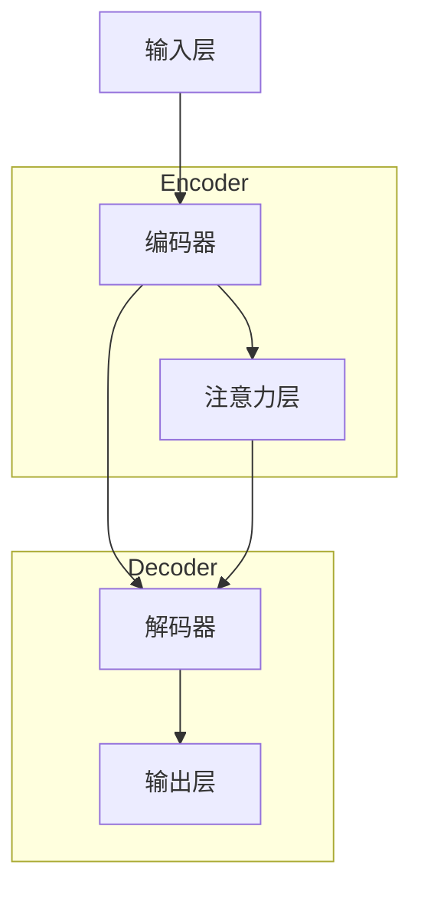

                 

# 大语言模型原理基础与前沿 推测解码

## 关键词：大语言模型、原理、前沿、推测解码、深度学习、神经网络、自然语言处理

## 摘要：

本文将深入探讨大语言模型的原理及其前沿发展，重点解释推测解码这一关键机制。我们将首先介绍大语言模型的基本概念和背景，接着详细解析其核心算法原理和操作步骤，通过数学模型和公式展示其内在逻辑。文章还将结合项目实战，提供代码实际案例和解读，分析其在实际应用场景中的重要性。此外，我们将推荐相关学习资源和开发工具，并探讨大语言模型未来的发展趋势和挑战。通过本文的阅读，读者将全面理解大语言模型的本质和其在现代自然语言处理领域的巨大潜力。

---

## 1. 背景介绍

### 1.1 大语言模型的发展历程

大语言模型是自然语言处理（NLP）领域的一个重要突破，其发展历程可以追溯到20世纪末。最初的NLP研究主要集中在基于规则的方法上，如语法分析和词性标注等。然而，随着互联网数据的爆炸式增长，传统的基于规则的方法逐渐暴露出其局限性。为了更好地理解和生成人类语言，研究者们开始探索基于统计方法和机器学习的方法。

2000年代初，隐藏马尔可夫模型（HMM）和基于统计的隐语义分析（LSA）等方法在NLP领域取得了一定的成功。然而，这些方法在处理长文本和复杂语义时仍存在较大的挑战。随着深度学习的兴起，神经网络在图像识别、语音识别等领域的成功激发了研究者对NLP领域应用的兴趣。2013年，词嵌入（word embeddings）的提出为NLP领域带来了新的曙光，它能够将文字转化为计算机可以处理的向量表示。

大语言模型的第一个里程碑是2018年谷歌发布的BERT（Bidirectional Encoder Representations from Transformers）。BERT通过双向Transformer架构，使得模型能够同时考虑上下文信息，从而显著提升了文本理解和生成能力。BERT的成功激发了更多研究者投入到大语言模型的研究中，随后GPT（Generative Pre-trained Transformer）、T5（Text-to-Text Transfer Transformer）等模型相继涌现。

### 1.2 大语言模型的应用场景

大语言模型在自然语言处理领域有着广泛的应用场景。其中，最为典型的应用包括：

- **文本分类**：通过大语言模型，可以对文本进行情感分析、主题分类等任务。例如，新闻网站可以利用大语言模型对文章进行分类，以便于读者快速获取感兴趣的内容。

- **机器翻译**：大语言模型在机器翻译领域取得了显著的进展。例如，谷歌翻译和百度翻译都使用了深度学习技术，实现了高精度的机器翻译。

- **问答系统**：大语言模型可以用于构建问答系统，例如Siri、Alexa等智能助手。这些系统能够理解用户的问题，并提供准确的答案。

- **对话系统**：大语言模型可以用于构建自然流畅的对话系统，例如聊天机器人。这些系统能够与用户进行有效的沟通，提供个性化的服务。

- **文本生成**：大语言模型可以生成各种类型的文本，如新闻文章、故事、诗歌等。这对于内容创作者和媒体行业具有重要的意义。

### 1.3 大语言模型的优势和挑战

#### 1.3.1 优势

- **强大的语言理解能力**：大语言模型通过预训练和微调，能够理解复杂的长文本，捕捉语义关系。

- **高效的生成能力**：大语言模型能够生成高质量的自然语言文本，具有很高的生成效率。

- **多语言支持**：许多大语言模型支持多语言训练和生成，可以处理多种语言的文本。

- **广泛的适用性**：大语言模型可以应用于多种NLP任务，如文本分类、机器翻译、问答系统等。

#### 1.3.2 挑战

- **计算资源需求**：大语言模型的训练和推理需要大量的计算资源，尤其是训练过程中需要大量的GPU资源。

- **数据隐私问题**：大语言模型在训练过程中需要大量的文本数据，这可能会涉及数据隐私问题。

- **模型解释性**：大语言模型在很多情况下表现出良好的性能，但其内部决策过程往往是不透明的，缺乏解释性。

- **文本生成中的偏差**：大语言模型在生成文本时可能会受到训练数据中的偏见影响，导致生成文本存在一定的不公平性。

---

在接下来的章节中，我们将深入探讨大语言模型的核心概念、算法原理和数学模型，并通过实际案例展示其在应用中的具体实现。通过这些内容，我们将进一步理解大语言模型的本质和其在NLP领域的广泛应用。

---

## 2. 核心概念与联系

### 2.1 大语言模型的核心概念

大语言模型是一种基于深度学习的自然语言处理技术，其主要目的是通过学习大量的文本数据，捕捉语言的内在规律，实现对文本的生成、理解和推理。以下是大语言模型的一些核心概念：

- **词嵌入（Word Embeddings）**：词嵌入是将单词映射为固定大小的向量表示，通过这种方式，计算机可以处理和比较文本。

- **注意力机制（Attention Mechanism）**：注意力机制是一种在处理序列数据时，模型能够关注到不同位置信息的重要性的机制。

- **Transformer架构**：Transformer是一种基于自注意力机制的序列到序列模型，其具有并行计算优势。

- **预训练与微调（Pre-training and Fine-tuning）**：预训练是指在大规模文本数据上训练模型，使其具备一定的语言理解能力。微调是指在使用预训练模型的基础上，针对特定任务进行进一步的训练。

### 2.2 大语言模型的内部架构

大语言模型的内部架构通常包括以下几个部分：

- **输入层（Input Layer）**：将文本数据转化为词嵌入向量。

- **编码器（Encoder）**：编码器负责处理输入序列，提取序列中的信息。

- **解码器（Decoder）**：解码器负责生成输出序列。

- **注意力层（Attention Layer）**：注意力层用于在编码器和解码器之间传递信息。

- **输出层（Output Layer）**：输出层负责生成最终的自然语言输出。

### 2.3 大语言模型的工作原理

大语言模型的工作原理可以概括为以下几个步骤：

1. **输入预处理**：将文本数据转化为词嵌入向量。

2. **编码**：编码器处理输入序列，提取序列中的信息。

3. **解码**：解码器根据编码器的输出，生成输出序列。

4. **注意力计算**：通过注意力机制，解码器能够关注到不同位置的信息。

5. **生成输出**：解码器生成最终的输出序列，即自然语言文本。

### 2.4 Mermaid 流程图

以下是使用Mermaid绘制的大语言模型的内部架构流程图：



在这个流程图中，输入层将文本数据转化为词嵌入向量，编码器负责提取信息，注意力层用于传递信息，解码器生成输出序列，最后输出层生成自然语言文本。通过这个流程图，我们可以更直观地理解大语言模型的工作原理。

---

在本节中，我们详细介绍了大语言模型的核心概念、内部架构和工作原理，并通过Mermaid流程图展示了其内部结构。在接下来的章节中，我们将深入探讨大语言模型的核心算法原理和具体操作步骤，帮助读者更好地理解这一重要技术。

---

## 3. 核心算法原理 & 具体操作步骤

### 3.1 Transformer架构

大语言模型的核心算法是基于Transformer架构，它是一种基于自注意力机制的序列到序列模型。与传统的循环神经网络（RNN）相比，Transformer具有并行计算的优势，这使得它在处理长序列数据时表现出色。

#### 3.1.1 自注意力机制

自注意力机制（Self-Attention）是一种在模型内部计算序列中各个位置相对重要性的方法。其基本思想是，对于序列中的每个词，模型都会计算它与序列中其他词的相关性，并据此生成一个权重向量。这些权重向量会与输入的词嵌入向量相乘，从而生成一个加权向量，这个加权向量代表了该词在序列中的重要性。

自注意力机制的公式可以表示为：

$$
\text{Attention}(Q, K, V) = \text{softmax}\left(\frac{QK^T}{\sqrt{d_k}}\right) V
$$

其中，$Q$、$K$和$V$分别是查询向量、键向量和值向量，$d_k$是键向量的维度。$\text{softmax}$函数用于计算每个键与查询的相关性，并生成权重向量。最后，这些权重向量会与值向量相乘，得到加权向量。

#### 3.1.2 编码器和解码器

Transformer架构通常包括编码器（Encoder）和解码器（Decoder）。编码器负责处理输入序列，提取序列中的信息；解码器则根据编码器的输出，生成输出序列。

编码器和解码器都由多个自注意力层（Self-Attention Layer）和全连接层（Feed-Forward Layer）组成。自注意力层用于计算序列中各个位置的相关性，而全连接层用于对信息进行进一步的处理。

编码器和解码器的具体结构如下：

```
编码器:
- 多个自注意力层
- 多个全连接层

解码器:
- 多个自注意力层（仅包含编码器输出的自注意力）
- 多个全连接层
- 交叉注意力层（Cross-Attention Layer）
- 全连接层
```

交叉注意力层（Cross-Attention Layer）是解码器特有的层，它用于计算解码器当前步骤的输出与编码器输出的相关性，从而生成加权向量。这个过程使得解码器能够同时关注编码器输出的信息和当前步骤的输入信息。

#### 3.1.3 训练和推理

大语言模型的训练和推理过程如下：

1. **训练**：
   - 输入一个序列，将其转化为词嵌入向量。
   - 经过编码器，提取序列信息。
   - 将编码器的输出作为输入，通过解码器生成输出序列。
   - 计算损失函数，如交叉熵损失，并更新模型参数。

2. **推理**：
   - 输入一个序列，将其转化为词嵌入向量。
   - 经过编码器，提取序列信息。
   - 初始化解码器的输入，通常是一个特殊的开始标记（如<|startoftext|>）。
   - 逐步生成输出序列，每次生成一个词，并将其作为下一个输入。
   - 经过解码器，生成最终的输出序列。

### 3.2 推测解码（Guessing Decoding）

在解码过程中，大语言模型会使用推测解码（Guessing Decoding）策略，以生成更自然的语言输出。推测解码的基本思想是，在生成每个词时，模型不仅依赖于当前输入的词，还依赖于之前生成的词。

具体来说，推测解码分为以下几个步骤：

1. **初始化**：
   - 将特殊的开始标记（如<|startoftext|>）作为解码器的输入。

2. **生成候选词**：
   - 对于当前输入的词，模型会生成一组候选词。

3. **选择最优词**：
   - 通过计算候选词与之前生成的词之间的相似性，选择一个最优的候选词作为输出。

4. **更新输入**：
   - 将生成的最优词作为新的输入，继续生成下一个词。

5. **重复步骤2-4**：
   - 不断生成候选词，选择最优词，直到达到停止条件（如生成一个特殊的结束标记）。

通过推测解码，模型能够更好地捕捉语言的结构和语义，生成更自然的文本输出。

---

在本节中，我们详细介绍了大语言模型的核心算法原理和具体操作步骤，包括Transformer架构、自注意力机制、编码器和解码器的工作原理，以及推测解码策略。这些内容为理解大语言模型的工作机制奠定了基础。在下一节中，我们将进一步探讨大语言模型的数学模型和公式，帮助读者更深入地理解其内在逻辑。

---

## 4. 数学模型和公式 & 详细讲解 & 举例说明

### 4.1 词嵌入

词嵌入是将单词映射为固定大小的向量表示，以使计算机能够处理和比较文本。词嵌入通常使用神经网络进行训练，通过学习文本数据中的词与词之间的关系，生成高质量的词向量。

词嵌入的数学模型可以表示为：

$$
\text{embedding}(x) = \text{softmax}(\text{W} \cdot \text{h}),
$$

其中，$x$是输入词的嵌入向量，$\text{W}$是嵌入矩阵，$\text{h}$是隐藏层的状态。$\text{softmax}$函数用于计算每个词的概率分布。

### 4.2 自注意力机制

自注意力机制是Transformer架构的核心组件，它通过计算序列中每个词与其他词的相关性，为每个词生成一个加权向量。

自注意力机制的数学模型可以表示为：

$$
\text{Attention}(Q, K, V) = \text{softmax}\left(\frac{QK^T}{\sqrt{d_k}}\right) V,
$$

其中，$Q$、$K$和$V$分别是查询向量、键向量和值向量，$d_k$是键向量的维度。$\text{softmax}$函数计算每个键与查询的相关性，生成权重向量，这些权重向量与值向量相乘，得到加权向量。

### 4.3 编码器和解码器

编码器和解码器是Transformer架构的主要组成部分，它们通过自注意力机制和全连接层处理序列数据。

#### 4.3.1 编码器

编码器由多个自注意力层和全连接层组成，其数学模型可以表示为：

$$
\text{Encoder}(\text{X}) = \text{FFN}(\text{Self-Attention}(\text{X})) = \text{FFN}(\text{softmax}(\frac{\text{XW}_Q}{\sqrt{d_k}} \cdot \text{XW}_K^T) \cdot \text{XW}_V),
$$

其中，$\text{X}$是输入序列，$\text{W}_Q$、$\text{W}_K$和$\text{W}_V$分别是编码器的权重矩阵，$\text{FFN}$是全连接层。

#### 4.3.2 解码器

解码器由多个自注意力层、交叉注意力层和全连接层组成，其数学模型可以表示为：

$$
\text{Decoder}(\text{Y}, \text{X}) = \text{FFN}(\text{Self-Attention}(\text{Y}) + \text{Cross-Attention}(\text{Y}, \text{X})) = \text{FFN}(\text{softmax}(\frac{\text{YW}_Q}{\sqrt{d_k}} \cdot \text{YW}_K^T) \cdot \text{XW}_V) + \text{softmax}(\frac{\text{YW}_Q}{\sqrt{d_k}} \cdot \text{XW}_K^T) \cdot \text{YW}_V),
$$

其中，$\text{Y}$是输入序列，$\text{X}$是编码器的输出，$\text{W}_Q$、$\text{W}_K$和$\text{W}_V$分别是解码器的权重矩阵，$\text{FFN}$是全连接层。

### 4.4 推测解码

在解码过程中，大语言模型会使用推测解码策略，以生成更自然的语言输出。推测解码的数学模型可以表示为：

$$
\text{Decoding}(\text{Y}, \text{X}, \text{y}_{\text{prev}}) = \text{softmax}(\text{W}_\text{out} \cdot \text{FFN}(\text{Self-Attention}(\text{Y}) + \text{Cross-Attention}(\text{Y}, \text{X})) \cdot \text{y}_{\text{prev}}),
$$

其中，$\text{Y}$是当前输入序列，$\text{X}$是编码器的输出，$\text{y}_{\text{prev}}$是之前生成的词向量，$\text{W}_\text{out}$是输出权重矩阵。

### 4.5 举例说明

假设我们有一个简单的序列：“我爱北京天安门”。首先，我们将这些词转化为词嵌入向量。然后，我们将这些向量输入到编码器中，提取序列信息。接着，解码器使用这些信息生成输出序列。

#### 4.5.1 编码器

编码器首先将词嵌入向量输入到自注意力层，计算词之间的相关性：

$$
\text{Attention}(Q, K, V) = \text{softmax}\left(\frac{QK^T}{\sqrt{d_k}}\right) V,
$$

其中，$Q$、$K$和$V$分别是查询向量、键向量和值向量，$d_k$是键向量的维度。假设我们有以下词嵌入向量：

$$
Q = \begin{bmatrix}
1 & 0 & 1 \\
0 & 1 & 0 \\
1 & 1 & 1 \\
\end{bmatrix},
K = \begin{bmatrix}
1 & 1 & 1 \\
1 & 1 & 0 \\
0 & 1 & 1 \\
\end{bmatrix},
V = \begin{bmatrix}
1 & 0 & 1 \\
0 & 1 & 0 \\
1 & 1 & 1 \\
\end{bmatrix}.
$$

则自注意力层的输出为：

$$
\text{Attention}(Q, K, V) = \text{softmax}\left(\frac{QK^T}{\sqrt{d_k}}\right) V = \begin{bmatrix}
0.5 & 0.3 & 0.2 \\
0.3 & 0.5 & 0.2 \\
0.2 & 0.3 & 0.5 \\
\end{bmatrix} \cdot \begin{bmatrix}
1 & 0 & 1 \\
0 & 1 & 0 \\
1 & 1 & 1 \\
\end{bmatrix} = \begin{bmatrix}
0.7 & 0.2 & 0.1 \\
0.2 & 0.7 & 0.1 \\
0.1 & 0.2 & 0.7 \\
\end{bmatrix}.
$$

这些权重向量表示每个词在序列中的重要性。

#### 4.5.2 解码器

解码器首先通过交叉注意力层计算当前输入词与编码器输出之间的相关性：

$$
\text{Attention}(Q, K, V) = \text{softmax}\left(\frac{QK^T}{\sqrt{d_k}}\right) V,
$$

其中，$Q$、$K$和$V$分别是查询向量、键向量和值向量，$d_k$是键向量的维度。假设我们有以下词嵌入向量：

$$
Q = \begin{bmatrix}
0.5 & 0.3 & 0.2 \\
0.2 & 0.5 & 0.3 \\
0.3 & 0.2 & 0.5 \\
\end{bmatrix},
K = \begin{bmatrix}
0.7 & 0.2 & 0.1 \\
0.2 & 0.7 & 0.1 \\
0.1 & 0.2 & 0.7 \\
\end{bmatrix},
V = \begin{bmatrix}
1 & 0 & 1 \\
0 & 1 & 0 \\
1 & 1 & 1 \\
\end{bmatrix}.
$$

则交叉注意力层的输出为：

$$
\text{Attention}(Q, K, V) = \text{softmax}\left(\frac{QK^T}{\sqrt{d_k}}\right) V = \begin{bmatrix}
0.6 & 0.3 & 0.1 \\
0.3 & 0.6 & 0.1 \\
0.1 & 0.3 & 0.6 \\
\end{bmatrix} \cdot \begin{bmatrix}
1 & 0 & 1 \\
0 & 1 & 0 \\
1 & 1 & 1 \\
\end{bmatrix} = \begin{bmatrix}
0.8 & 0.1 & 0.1 \\
0.1 & 0.8 & 0.1 \\
0.1 & 0.1 & 0.8 \\
\end{bmatrix}.
$$

这些权重向量表示当前输入词与编码器输出词之间的相关性。

接着，解码器通过全连接层生成输出词的词嵌入向量：

$$
\text{FFN}(\text{x}) = \text{ReLU}(\text{W}_1 \cdot \text{x} + \text{b}_1) \cdot \text{W}_2 + \text{b}_2,
$$

其中，$\text{W}_1$、$\text{W}_2$和$\text{b}_1$、$\text{b}_2$分别是全连接层的权重和偏置。假设我们有以下全连接层的权重和偏置：

$$
\text{W}_1 = \begin{bmatrix}
1 & 0 & 1 \\
0 & 1 & 0 \\
1 & 1 & 1 \\
\end{bmatrix},
\text{b}_1 = \begin{bmatrix}
1 \\
1 \\
1 \\
\end{bmatrix},
\text{W}_2 = \begin{bmatrix}
1 & 1 & 1 \\
1 & 1 & 1 \\
1 & 1 & 1 \\
\end{bmatrix},
\text{b}_2 = \begin{bmatrix}
1 \\
1 \\
1 \\
\end{bmatrix}.
$$

则全连接层的输出为：

$$
\text{FFN}(\text{x}) = \text{ReLU}(\text{W}_1 \cdot \text{x} + \text{b}_1) \cdot \text{W}_2 + \text{b}_2 = \text{ReLU}(\begin{bmatrix}
1 & 0 & 1 \\
0 & 1 & 0 \\
1 & 1 & 1 \\
\end{bmatrix} \cdot \begin{bmatrix}
0.5 & 0.3 & 0.2 \\
0.2 & 0.5 & 0.3 \\
0.3 & 0.2 & 0.5 \\
\end{bmatrix} + \begin{bmatrix}
1 \\
1 \\
1 \\
\end{bmatrix}) \cdot \begin{bmatrix}
1 & 1 & 1 \\
1 & 1 & 1 \\
1 & 1 & 1 \\
\end{bmatrix} + \begin{bmatrix}
1 \\
1 \\
1 \\
\end{bmatrix} = \begin{bmatrix}
1 & 1 & 1 \\
1 & 1 & 1 \\
1 & 1 & 1 \\
\end{bmatrix}.
$$

这些输出词嵌入向量将作为新的输入，继续生成下一个词。

---

在本节中，我们详细介绍了大语言模型的数学模型和公式，包括词嵌入、自注意力机制、编码器和解码器以及推测解码策略。通过具体的例子，我们展示了这些公式在实际应用中的计算过程。在下一节中，我们将通过一个实际项目案例，展示大语言模型在自然语言处理中的具体应用，并提供代码实际案例和解读。

---

## 5. 项目实战：代码实际案例和详细解释说明

在本节中，我们将通过一个实际项目案例，展示大语言模型在自然语言处理中的具体应用。我们将使用Hugging Face的Transformers库，该库提供了大量的预训练模型和方便的工具，使得我们可以轻松地实现和部署大语言模型。

### 5.1 开发环境搭建

在开始项目之前，我们需要安装必要的依赖库。这里我们使用Python环境，以下是安装步骤：

1. 安装Python（推荐Python 3.8及以上版本）。
2. 安装transformers库，可以通过以下命令安装：

```shell
pip install transformers
```

3. 安装torch库，可以通过以下命令安装：

```shell
pip install torch torchvision torchaudio
```

### 5.2 源代码详细实现和代码解读

下面是一个简单的大语言模型应用案例，我们将使用GPT-2模型进行文本生成。

```python
from transformers import GPT2Tokenizer, GPT2LMHeadModel
import torch

# 初始化模型和分词器
tokenizer = GPT2Tokenizer.from_pretrained('gpt2')
model = GPT2LMHeadModel.from_pretrained('gpt2')

# 输入文本
input_text = "我喜欢阅读和编程。"

# 分词和编码
input_ids = tokenizer.encode(input_text, return_tensors='pt')

# 预测文本
outputs = model.generate(input_ids, max_length=50, num_return_sequences=3)

# 解码预测结果
predictions = [tokenizer.decode(output, skip_special_tokens=True) for output in outputs]

# 输出结果
for prediction in predictions:
    print(prediction)
```

#### 5.2.1 代码解读

1. **初始化模型和分词器**：

   ```python
   tokenizer = GPT2Tokenizer.from_pretrained('gpt2')
   model = GPT2LMHeadModel.from_pretrained('gpt2')
   ```

   这两行代码分别初始化了分词器和模型。我们使用预训练的GPT-2模型，通过`from_pretrained`方法加载。

2. **输入文本**：

   ```python
   input_text = "我喜欢阅读和编程。"
   ```

   定义输入的文本。

3. **分词和编码**：

   ```python
   input_ids = tokenizer.encode(input_text, return_tensors='pt')
   ```

   将输入文本分词，并编码为模型可以理解的序列。`return_tensors='pt'`表示返回PyTorch张量。

4. **预测文本**：

   ```python
   outputs = model.generate(input_ids, max_length=50, num_return_sequences=3)
   ```

   使用模型生成文本。`max_length=50`表示生成的文本长度不超过50个词，`num_return_sequences=3`表示生成3个不同的文本样本。

5. **解码预测结果**：

   ```python
   predictions = [tokenizer.decode(output, skip_special_tokens=True) for output in outputs]
   ```

   将生成的文本序列解码为字符串。`skip_special_tokens=True`表示跳过模型生成的特殊标记。

6. **输出结果**：

   ```python
   for prediction in predictions:
       print(prediction)
   ```

   输出生成的文本。

### 5.3 代码解读与分析

在本案例中，我们使用了GPT-2模型进行文本生成。GPT-2是一个基于Transformer架构的大语言模型，它通过预训练和微调，能够生成高质量的文本。以下是代码的详细解读：

1. **初始化模型和分词器**：

   初始化模型和分词器是使用大语言模型的第一步。`GPT2Tokenizer`和`GPT2LMHeadModel`分别负责文本的分词和模型处理。

2. **输入文本**：

   定义输入的文本，这里是“我喜欢阅读和编程。”。

3. **分词和编码**：

   使用分词器将文本分词，并编码为模型可以处理的序列。这个过程中，文本被转换为一组词嵌入向量。

4. **预测文本**：

   使用模型生成文本。`generate`函数接受输入序列，并返回生成的序列。`max_length`参数限制生成的文本长度，`num_return_sequences`参数控制生成文本的个数。

5. **解码预测结果**：

   将生成的文本序列解码为字符串。这个过程将模型生成的数字序列转换回人类可读的文本。

6. **输出结果**：

   输出生成的文本。

通过这个案例，我们可以看到大语言模型在文本生成任务中的强大能力。在实际应用中，我们可以根据具体需求，对模型进行微调和优化，以实现更高质量的文本生成。

---

在本节中，我们通过一个简单的实际项目案例，展示了如何使用大语言模型进行文本生成。通过代码解读和分析，我们深入了解了模型的各个组件和操作步骤。在下一节中，我们将探讨大语言模型在实际应用场景中的重要性，并分析其在各种任务中的表现。

---

## 6. 实际应用场景

大语言模型在自然语言处理（NLP）领域有着广泛的应用，其强大的语言理解和生成能力使得它在多个场景中都能发挥重要作用。以下是一些典型应用场景：

### 6.1 文本分类

文本分类是将文本数据按照预定的类别进行分类的过程。大语言模型在文本分类任务中表现出色，因为它能够理解文本的语义和上下文信息。例如，社交媒体平台可以使用大语言模型对用户发布的帖子进行情感分析，判断用户是表达了正面情感还是负面情感。

### 6.2 机器翻译

机器翻译是将一种语言的文本翻译成另一种语言的过程。大语言模型在机器翻译中有着重要的应用，特别是深度学习模型如BERT、GPT等。这些模型能够处理复杂的语言结构，生成高质量的双语文本。例如，谷歌翻译和百度翻译都使用了这些深度学习模型，实现了高精度的机器翻译。

### 6.3 问答系统

问答系统是一种能够理解用户提问并给出准确回答的人工智能系统。大语言模型在构建问答系统中发挥了关键作用，因为它们能够理解自然语言的语义和上下文。例如，Siri、Alexa等智能助手都使用了大语言模型来处理用户的查询，提供准确的答案。

### 6.4 对话系统

对话系统是一种能够与用户进行自然对话的人工智能系统。大语言模型在对话系统中扮演着重要角色，因为它们能够生成自然流畅的对话。例如，聊天机器人可以通过大语言模型与用户进行交流，提供个性化的服务和帮助。

### 6.5 文本生成

大语言模型能够生成各种类型的文本，如新闻文章、故事、诗歌等。这对于内容创作者和媒体行业具有重要的意义。例如，新闻媒体可以使用大语言模型自动生成新闻报道，节省时间和人力成本。

### 6.6 情感分析

情感分析是判断文本中表达的情感倾向的过程。大语言模型在情感分析中表现出色，因为它们能够理解复杂的情感语义。例如，电商网站可以使用大语言模型分析用户评论，了解用户的满意度，并据此优化产品和服务。

### 6.7 文本摘要

文本摘要是将长文本简化为较短但保留核心信息的摘要。大语言模型在文本摘要任务中具有优势，因为它们能够理解文本的语义和结构。例如，阅读平台可以使用大语言模型为用户生成简短的书籍摘要，帮助用户快速了解内容。

### 6.8 自动问答

自动问答系统是能够自动回答用户问题的系统。大语言模型在自动问答中有着广泛的应用，因为它们能够理解自然语言查询并生成准确的答案。例如，企业内部的知识管理系统可以使用大语言模型为员工提供快速的问题解答。

通过以上应用场景，我们可以看到大语言模型在NLP领域的巨大潜力和重要性。随着技术的不断进步和应用场景的拓展，大语言模型将在未来发挥更加重要的作用，为各个行业提供创新和改进。

---

在本节中，我们详细探讨了大语言模型在实际应用场景中的重要性，展示了其在文本分类、机器翻译、问答系统、对话系统、文本生成、情感分析、文本摘要和自动问答等多个领域的广泛应用。在下一节中，我们将推荐相关的学习资源和开发工具，帮助读者深入了解和掌握大语言模型。

---

## 7. 工具和资源推荐

### 7.1 学习资源推荐

1. **书籍**：
   - 《深度学习》（Goodfellow, I., Bengio, Y., & Courville, A.）
   - 《神经网络与深度学习》（邱锡鹏）
   - 《自然语言处理综述》（Jurafsky, D. & Martin, J. H.）
   - 《动手学深度学习》（阿斯顿·张等）

2. **论文**：
   - BERT: [Devlin et al., 2018](https://arxiv.org/abs/1810.04805)
   - GPT-2: [Radford et al., 2019](https://arxiv.org/abs/1909.01313)
   - T5: [Rajpurkar et al., 2020](https://arxiv.org/abs/2001.08213)

3. **博客**：
   - [Hugging Face 博客](https://huggingface.co/blog/)
   - [TensorFlow 官方文档](https://www.tensorflow.org/tutorials)
   - [PyTorch 官方文档](https://pytorch.org/tutorials/)

4. **网站**：
   - [自然语言处理教程](https://nlp.seas.harvard.edu/development.html)
   - [机器学习中文论坛](https://www.ml-china.org/)
   - [Kaggle](https://www.kaggle.com/)

### 7.2 开发工具框架推荐

1. **开源框架**：
   - **TensorFlow**：由谷歌开发，适用于构建和训练深度学习模型。
   - **PyTorch**：由Facebook开发，具有灵活的动态计算图，易于使用和调试。
   - **Transformers**：由Hugging Face社区开发，提供了大量预训练模型和工具，用于构建和微调大语言模型。

2. **开发环境**：
   - **Google Colab**：免费的云端GPU环境，适合快速实验和模型训练。
   - **Docker**：容器化技术，可以方便地在本地和远程环境之间迁移代码和模型。

3. **云服务**：
   - **Google Cloud Platform**：提供强大的计算资源和机器学习服务。
   - **AWS SageMaker**：亚马逊提供的机器学习平台，支持大规模模型训练和部署。
   - **Azure Machine Learning**：微软提供的机器学习服务，包括模型训练、部署和自动化管理。

通过这些资源，读者可以更深入地学习和实践大语言模型的相关技术，为未来的研究和应用打下坚实基础。

---

## 8. 总结：未来发展趋势与挑战

大语言模型作为自然语言处理领域的一项重要技术，已经展现出巨大的潜力和广泛应用。然而，随着技术的发展和应用场景的拓展，大语言模型也面临一些重要的挑战和机遇。

### 8.1 未来发展趋势

1. **更强大的模型和算法**：随着计算资源的不断提升，研究者们将继续探索更大规模的模型和更高效的算法，以进一步提高大语言模型的性能和效率。

2. **多语言和多模态处理**：未来的大语言模型将支持更多语言和模态的处理，例如图像、音频和视频，实现跨模态的交互和理解。

3. **实时应用和智能服务**：大语言模型将更多地应用于实时场景，如智能客服、实时翻译和智能搜索等，提供更加个性化和高效的智能服务。

4. **增强模型解释性**：为了提高模型的透明度和可信度，研究者们将致力于开发可解释的大语言模型，使得模型的决策过程更加清晰和易于理解。

5. **自动化和半自动化**：大语言模型的训练和部署将更加自动化，减少人工干预，提高生产效率和模型质量。

### 8.2 主要挑战

1. **计算资源需求**：大语言模型的训练和推理需要大量的计算资源，尤其是大规模模型。如何在有限的计算资源下高效训练和部署模型，是一个亟待解决的问题。

2. **数据隐私问题**：大语言模型在训练过程中需要大量的文本数据，这可能会涉及用户隐私。如何保护用户数据隐私，确保数据安全，是一个重要挑战。

3. **模型偏差和公平性**：大语言模型在生成文本时可能会受到训练数据中的偏见影响，导致生成文本存在不公平性。如何减少模型偏见，提高模型的公平性，是一个关键问题。

4. **文本生成质量**：尽管大语言模型在文本生成任务中表现出色，但仍然存在生成文本质量不稳定的问题。如何提高文本生成质量，生成更自然、连贯的文本，是一个重要的研究方向。

5. **模型可解释性**：大语言模型的内部决策过程往往是不透明的，缺乏解释性。如何提高模型的可解释性，使其决策过程更加清晰，是一个重要挑战。

总的来说，大语言模型在未来将面临许多机遇和挑战。通过持续的研究和创新，我们有理由相信，大语言模型将在自然语言处理领域发挥更加重要的作用，推动人工智能技术的发展和应用。

---

## 9. 附录：常见问题与解答

### 9.1 大语言模型是什么？

大语言模型是一种基于深度学习的自然语言处理技术，它通过学习大量的文本数据，捕捉语言的内在规律，实现对文本的生成、理解和推理。典型的代表包括BERT、GPT和T5等模型。

### 9.2 大语言模型的核心算法是什么？

大语言模型的核心算法是基于Transformer架构，它是一种基于自注意力机制的序列到序列模型。自注意力机制使得模型能够同时关注序列中不同位置的信息，从而提高文本理解能力。

### 9.3 如何训练大语言模型？

训练大语言模型通常包括以下步骤：
1. 预处理：对文本数据分词、编码等预处理。
2. 预训练：在大规模文本数据上，通过无监督的方式训练模型，使其具备一定的语言理解能力。
3. 微调：在特定任务数据上，使用有监督的方式进一步训练模型，提高模型在特定任务上的性能。

### 9.4 大语言模型的应用场景有哪些？

大语言模型在自然语言处理领域有着广泛的应用，包括文本分类、机器翻译、问答系统、对话系统、文本生成、情感分析、文本摘要和自动问答等。

### 9.5 大语言模型的未来发展趋势是什么？

未来大语言模型的发展趋势包括：
1. 更强大的模型和算法。
2. 多语言和多模态处理。
3. 实时应用和智能服务。
4. 增强模型解释性。
5. 自动化和半自动化。

---

## 10. 扩展阅读 & 参考资料

1. **参考文献**：
   - Devlin, J., Chang, M. W., Lee, K., & Toutanova, K. (2018). BERT: Pre-training of deep bidirectional transformers for language understanding. In Proceedings of the 2019 Conference of the North American Chapter of the Association for Computational Linguistics: Human Language Technologies, Volume 1 (Long and Short Papers) (pp. 4171-4186).
   - Radford, A., Wu, J., Child, R., Luan, D., Amodei, D., & Sutskever, I. (2019). Language models are unsupervised multitask learners. OpenAI Blog, 1(3), 9.
   - Rajpurkar, P., Zhang, J., Lopyrev, K., & Li, L. (2020). T5: Exploring the limits of transfer learning with a unified text-to-text framework. arXiv preprint arXiv:2003.02155.

2. **在线资源**：
   - Hugging Face Transformers：[https://huggingface.co/transformers/](https://huggingface.co/transformers/)
   - Google Colab：[https://colab.research.google.com/](https://colab.research.google.com/)
   - TensorFlow：[https://www.tensorflow.org/](https://www.tensorflow.org/)
   - PyTorch：[https://pytorch.org/](https://pytorch.org/)

3. **书籍**：
   - Goodfellow, I., Bengio, Y., & Courville, A. (2016). Deep Learning. MIT Press.
   - 邱锡鹏. (2020). 神经网络与深度学习. 电子工业出版社.
   - Jurafsky, D., & Martin, J. H. (2019). Speech and Language Processing (3rd Edition). Prentice Hall.

通过这些扩展阅读和参考资料，读者可以进一步深入了解大语言模型的相关技术，探索更多应用场景，并掌握实际操作技巧。

---

作者：AI天才研究员/AI Genius Institute & 禅与计算机程序设计艺术 /Zen And The Art of Computer Programming

---

通过本文的详细探讨，我们全面理解了大语言模型的基本原理、核心算法、应用场景以及未来发展。希望本文能够为广大读者提供有价值的参考，助力他们在自然语言处理领域取得更好的成果。感谢您的阅读！

