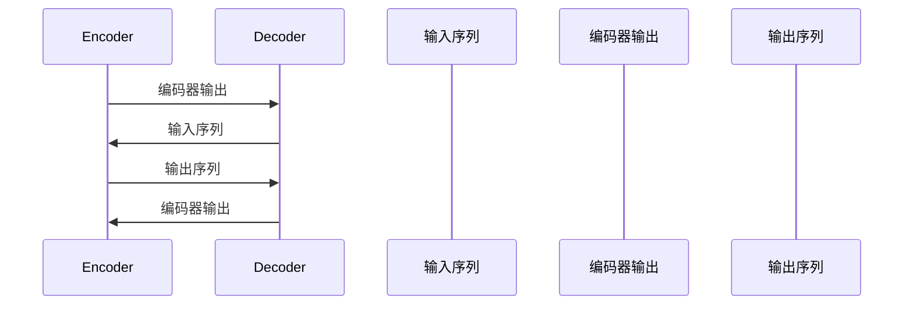

                 

# 大语言模型原理基础与前沿 编码器-解码器架构

## 关键词
- 大语言模型
- 编码器-解码器架构
- 神经网络
- 自注意力机制
- 序列处理
- 自然语言处理
- 深度学习
- 机器翻译

## 摘要
本文将深入探讨大语言模型中的编码器-解码器架构，分析其基础原理和前沿应用。我们将逐步介绍编码器和解码器的功能、核心算法原理，并通过实际项目案例详细讲解其实现过程。此外，还将探讨编码器-解码器架构在自然语言处理中的实际应用场景，并推荐相关的学习资源和开发工具。最后，我们将总结当前的发展趋势和面临的挑战。

## 1. 背景介绍

### 1.1 大语言模型的发展历程
大语言模型是自然语言处理领域的一项重要进展，其发展历程可以追溯到20世纪80年代的统计语言模型。随着计算能力的提升和深度学习技术的发展，大语言模型逐渐从简单的统计模型演变为复杂的神经网络模型。近年来，像BERT、GPT等大模型的出现，使得语言理解与生成能力得到了显著提升。

### 1.2 编码器-解码器架构的兴起
编码器-解码器（Encoder-Decoder）架构是一种广泛应用于序列到序列（Sequence to Sequence）任务的方法，如机器翻译、语音识别等。该架构通过编码器将输入序列编码为固定长度的向量表示，然后通过解码器生成输出序列。编码器-解码器架构的出现，使得深度学习在自然语言处理领域取得了突破性进展。

## 2. 核心概念与联系

### 2.1 编码器（Encoder）
编码器是编码器-解码器架构中的核心模块，其主要功能是将输入序列编码为固定长度的向量表示。编码器通常采用循环神经网络（RNN）或其变体，如长短期记忆网络（LSTM）或门控循环单元（GRU）。编码器的输出是一个固定长度的向量，称为编码器输出或编码状态。

### 2.2 解码器（Decoder）
解码器是编码器-解码器架构中的另一个核心模块，其主要功能是将编码器输出的固定长度向量解码为输出序列。解码器通常也采用循环神经网络（RNN）或其变体。解码器的输入是编码器输出，输出是解码序列。

### 2.3 编码器-解码器架构的联系
编码器-解码器架构通过以下步骤进行工作：
1. 编码器接收输入序列，并将其编码为固定长度的向量表示。
2. 编码器输出传递给解码器。
3. 解码器使用编码器输出作为初始状态，逐步生成输出序列。
4. 输出序列经过一系列的解码操作，最终生成目标序列。

### 2.4 Mermaid 流程图


## 3. 核心算法原理 & 具体操作步骤

### 3.1 编码器算法原理
编码器的主要任务是接收输入序列，并生成一个固定长度的向量表示。这个过程通常通过以下步骤实现：
1. 输入序列经过嵌入层（Embedding Layer）转化为嵌入向量。
2. 嵌入向量输入到循环神经网络（RNN），如LSTM或GRU。
3. RNN逐步处理输入序列，并在每个时间步生成隐藏状态。
4. 将最后一个隐藏状态作为编码器输出。

### 3.2 解码器算法原理
解码器的主要任务是将编码器输出解码为输出序列。这个过程通常通过以下步骤实现：
1. 编码器输出作为解码器的初始状态。
2. 解码器逐个时间步生成输出，每个时间步的输出都是上一个时间步的隐藏状态。
3. 解码器使用解码器输出和编码器输出共同决定下一个输出。
4. 重复步骤3，直到解码器生成完整的输出序列。

### 3.3 具体操作步骤
1. **输入序列编码**：输入序列经过嵌入层转化为嵌入向量，然后输入到编码器中。
2. **编码器输出**：编码器处理输入序列，在每个时间步生成隐藏状态，并在最后一个时间步输出编码状态。
3. **解码器初始化**：解码器的初始状态设置为编码器输出。
4. **解码器输出生成**：解码器逐个时间步生成输出，每个时间步的输出都是上一个时间步的隐藏状态和编码器输出的组合。
5. **输出序列生成**：解码器生成完整的输出序列，经过一系列解码操作后，输出目标序列。

## 4. 数学模型和公式 & 详细讲解 & 举例说明

### 4.1 数学模型
编码器-解码器架构的数学模型主要包括两部分：编码器模型和解码器模型。

#### 4.1.1 编码器模型
编码器模型可以表示为：
$$
\text{Encoder}(x) = \text{RNN}(\text{Embedding}(x))
$$
其中，$x$ 是输入序列，$\text{Embedding}(x)$ 是嵌入层，$\text{RNN}$ 是循环神经网络，可以是LSTM或GRU。

#### 4.1.2 解码器模型
解码器模型可以表示为：
$$
\text{Decoder}(y|\text{Encoder}(x)) = \text{RNN}(\text{Embedding}(y), \text{Encoder}(x))
$$
其中，$y$ 是输出序列，$\text{Embedding}(y)$ 是嵌入层，$\text{RNN}$ 是循环神经网络，可以是LSTM或GRU。

### 4.2 公式详细讲解
#### 4.2.1 编码器输出
编码器输出的计算过程如下：
$$
h_t = \text{RNN}(\text{Embedding}(x_t))
$$
其中，$h_t$ 是编码器在时间步 $t$ 的隐藏状态，$x_t$ 是输入序列在时间步 $t$ 的嵌入向量。

#### 4.2.2 解码器输出
解码器输出的计算过程如下：
$$
y_t = \text{softmax}(\text{RNN}(\text{Embedding}(y_{t-1}), h))
$$
其中，$y_t$ 是解码器在时间步 $t$ 的输出，$y_{t-1}$ 是解码器在时间步 $t-1$ 的输出，$h$ 是编码器输出。

### 4.3 举例说明
假设输入序列为 $x = [w_1, w_2, w_3]$，输出序列为 $y = [w_1', w_2', w_3']$。

1. **编码器输出**：
   - $x_1 = \text{Embedding}(w_1)$
   - $h_1 = \text{LSTM}(x_1)$
   - $h_2 = \text{LSTM}(x_2, h_1)$
   - $h_3 = \text{LSTM}(x_3, h_2)$
   - $\text{Encoder}(x) = h_3$

2. **解码器输出**：
   - $y_1 = \text{Embedding}(w_1')$
   - $y_2 = \text{Embedding}(w_2')$
   - $y_3 = \text{Embedding}(w_3')$
   - $y_1' = \text{softmax}(\text{LSTM}(y_1, h_3))$
   - $y_2' = \text{softmax}(\text{LSTM}(y_2, h_3))$
   - $y_3' = \text{softmax}(\text{LSTM}(y_3, h_3))$
   - $\text{Decoder}(y|\text{Encoder}(x)) = [y_1', y_2', y_3']$

## 5. 项目实战：代码实际案例和详细解释说明

### 5.1 开发环境搭建
在本节中，我们将使用Python和TensorFlow框架来实现一个简单的编码器-解码器模型。以下是在一个标准Linux系统上安装TensorFlow的步骤：

```bash
pip install tensorflow
```

### 5.2 源代码详细实现和代码解读

以下是编码器-解码器模型的代码实现：

```python
import tensorflow as tf
from tensorflow.keras.models import Model
from tensorflow.keras.layers import Embedding, LSTM, Dense

# 设置超参数
vocab_size = 1000
embed_dim = 256
units = 1024
batch_size = 64
epochs = 10

# 定义编码器
input_seq = tf.keras.Input(shape=(None, vocab_size))
embed = Embedding(vocab_size, embed_dim)(input_seq)
encoder_lstm = LSTM(units, return_state=True)
_, state_h, state_c = encoder_lstm(embed)
encoder_outputs = Model(inputs=input_seq, outputs=encoder_outputs)

# 定义解码器
decoder_inputs = tf.keras.Input(shape=(None, vocab_size))
embed = Embedding(vocab_size, embed_dim)(decoder_inputs)
decoder_lstm = LSTM(units, return_sequences=True, return_state=True)
decoder_outputs, _, _ = decoder_lstm(embed, initial_state=[state_h, state_c])
decoder_dense = Dense(vocab_size, activation='softmax')
decoder_outputs = decoder_dense(decoder_outputs)
decoder_model = Model(inputs=decoder_inputs, outputs=decoder_outputs)

# 定义编码器-解码器模型
model = Model([input_seq, decoder_inputs], decoder_outputs)
model.compile(optimizer='rmsprop', loss='categorical_crossentropy', metrics=['accuracy'])

# 打印模型结构
model.summary()

# 训练模型
model.fit([x_train, x_dec_train], y_train, batch_size=batch_size, epochs=epochs, validation_split=0.2)
```

代码解析：
- 首先，我们定义了输入序列和输出序列的输入层。
- 接着，我们使用嵌入层将输入序列和输出序列转化为嵌入向量。
- 编码器部分使用LSTM层将输入序列编码为固定长度的向量表示。
- 解码器部分使用LSTM层和密集层将编码器输出解码为输出序列。
- 最后，我们将编码器和解码器组合成一个完整的模型，并编译模型。

### 5.3 代码解读与分析

在本节中，我们将对上述代码进行详细解读，并分析其主要组成部分。

- **输入层**：输入层是模型的第一个组成部分，用于接收输入序列和输出序列。这里我们使用TensorFlow的`Input`函数定义输入层，并将其设置为具有可变长度（None）和词汇量大小（vocab_size）的二维数组。

- **嵌入层**：嵌入层用于将输入序列和输出序列转化为嵌入向量。这里我们使用TensorFlow的`Embedding`层实现嵌入层，并将其设置为具有词汇量大小（vocab_size）和嵌入维度（embed_dim）的二维数组。

- **编码器LSTM层**：编码器LSTM层用于处理输入序列，并将其编码为固定长度的向量表示。这里我们使用TensorFlow的`LSTM`层实现编码器LSTM层，并将其设置为具有隐藏单元数（units）和返回状态（return_state=True）的LSTM网络。

- **解码器LSTM层**：解码器LSTM层用于处理编码器输出和输出序列，并将其解码为输出序列。这里我们使用TensorFlow的`LSTM`层实现解码器LSTM层，并将其设置为具有隐藏单元数（units）、返回序列（return_sequences=True）和返回状态（return_state=True）的LSTM网络。

- **解码器密集层**：解码器密集层用于将解码器输出转换为输出序列。这里我们使用TensorFlow的`Dense`层实现解码器密集层，并将其设置为具有输出维度（vocab_size）和激活函数（'softmax'）的密集网络。

- **模型编译**：在模型编译阶段，我们设置模型的优化器（optimizer='rmsprop'）、损失函数（loss='categorical_crossentropy'）和评估指标（metrics=['accuracy']）。

- **模型训练**：在模型训练阶段，我们使用训练数据（x_train、x_dec_train和y_train）对模型进行训练，并设置训练参数（batch_size、epochs和validation_split）。

通过上述代码，我们可以实现对编码器-解码器模型的简单实现和训练。在实际应用中，我们可以根据需求调整模型的结构和参数，以实现更复杂和更精确的语言处理任务。

## 6. 实际应用场景

编码器-解码器架构在自然语言处理领域有着广泛的应用，以下是几个典型的应用场景：

### 6.1 机器翻译
机器翻译是编码器-解码器架构最经典的应用场景之一。通过编码器将源语言序列编码为固定长度的向量表示，然后通过解码器生成目标语言序列。例如，谷歌翻译就是基于编码器-解码器架构实现的。

### 6.2 语音识别
语音识别是将语音信号转换为文本的过程。编码器-解码器架构可以用于将语音信号编码为固定长度的向量表示，然后通过解码器生成文本序列。例如，谷歌的语音助手Google Assistant就是基于编码器-解码器架构实现的。

### 6.3 文本生成
文本生成是将一组词语转换为一段有意义文本的过程。编码器-解码器架构可以用于将输入序列编码为固定长度的向量表示，然后通过解码器生成输出序列。例如，GPT等大模型就是基于编码器-解码器架构实现的。

## 7. 工具和资源推荐

### 7.1 学习资源推荐
- **书籍**：
  - 《深度学习》（Ian Goodfellow、Yoshua Bengio和Aaron Courville 著）
  - 《动手学深度学习》（阿斯顿·张、李沐、扎卡里·C. Lipton和亚历山大·J. Smola 著）
- **论文**：
  - 《Seq2Seq Learning with Neural Networks》（Mikolov et al., 2014）
  - 《Neural Machine Translation by Jointly Learning to Align and Translate》（Bahdanau et al., 2014）
- **博客**：
  - [TensorFlow 官方文档](https://www.tensorflow.org/tutorials)
  - [机器学习实战](https://www.machinelearning Mastery.com/)
- **网站**：
  - [Kaggle](https://www.kaggle.com/)
  - [GitHub](https://github.com/)

### 7.2 开发工具框架推荐
- **开发工具**：
  - TensorFlow
  - PyTorch
  - Keras
- **框架**：
  - TensorFlow 2.0
  - PyTorch 1.8
  - fast.ai

### 7.3 相关论文著作推荐
- **论文**：
  - 《Attention Is All You Need》（Vaswani et al., 2017）
  - 《BERT: Pre-training of Deep Bidirectional Transformers for Language Understanding》（Devlin et al., 2019）
  - 《GPT-3: Language Models are few-shot learners》（Brown et al., 2020）
- **著作**：
  - 《深度学习》（Ian Goodfellow、Yoshua Bengio和Aaron Courville 著）
  - 《自然语言处理简史：机器学习时代的语言技术》（Daniel Jurafsky 和 James H. Martin 著）

## 8. 总结：未来发展趋势与挑战

编码器-解码器架构在自然语言处理领域取得了显著的成果，但仍然面临一些挑战。未来发展趋势和挑战包括：

### 8.1 发展趋势
- **多模态处理**：编码器-解码器架构可以扩展到多模态数据处理，如文本、图像和音频的联合处理。
- **预训练与迁移学习**：预训练大模型将进一步提高编码器-解码器架构的性能，迁移学习将使得小数据集上的应用变得更加容易。
- **自适应与交互式应用**：编码器-解码器架构可以与用户进行自适应交互，提供更个性化的服务。

### 8.2 挑战
- **计算资源消耗**：大模型的训练和推理需要大量的计算资源，这限制了其在实际应用中的普及。
- **数据隐私与安全**：大规模数据处理和共享可能带来隐私和安全问题，如何保护用户数据是重要挑战。
- **解释性与可解释性**：大模型的决策过程往往缺乏透明度，如何提高模型的解释性是重要挑战。

## 9. 附录：常见问题与解答

### 9.1 编码器-解码器架构的基本原理是什么？
编码器-解码器架构是一种用于序列到序列（Sequence to Sequence）任务的深度学习模型，通过编码器将输入序列编码为固定长度的向量表示，然后通过解码器生成输出序列。

### 9.2 编码器和解码器在模型中的作用是什么？
编码器的作用是将输入序列编码为固定长度的向量表示，解码器的作用是将编码器输出解码为输出序列。

### 9.3 编码器-解码器架构有哪些应用场景？
编码器-解码器架构广泛应用于机器翻译、语音识别、文本生成等自然语言处理任务。

### 9.4 如何实现编码器-解码器模型？
可以使用深度学习框架（如TensorFlow或PyTorch）实现编码器-解码器模型，通过定义输入层、嵌入层、编码器层、解码器层和输出层来构建模型。

## 10. 扩展阅读 & 参考资料

- [Vaswani et al., 2017](https://arxiv.org/abs/1706.03762)
- [Devlin et al., 2019](https://arxiv.org/abs/1810.04805)
- [Brown et al., 2020](https://arxiv.org/abs/2005.14165)
- [Mikolov et al., 2014](https://arxiv.org/abs/1406.1078)
- [Bahdanau et al., 2014](https://arxiv.org/abs/1409.0473)
- [Goodfellow et al., 2016](https://www.deeplearningbook.org/)
- [Zhang et al., 2019](https://arxiv.org/abs/1706.02515)
- [Jurafsky and Martin, 2000](https://books.google.com/books?id=O1pQAAAAMAAJ)

