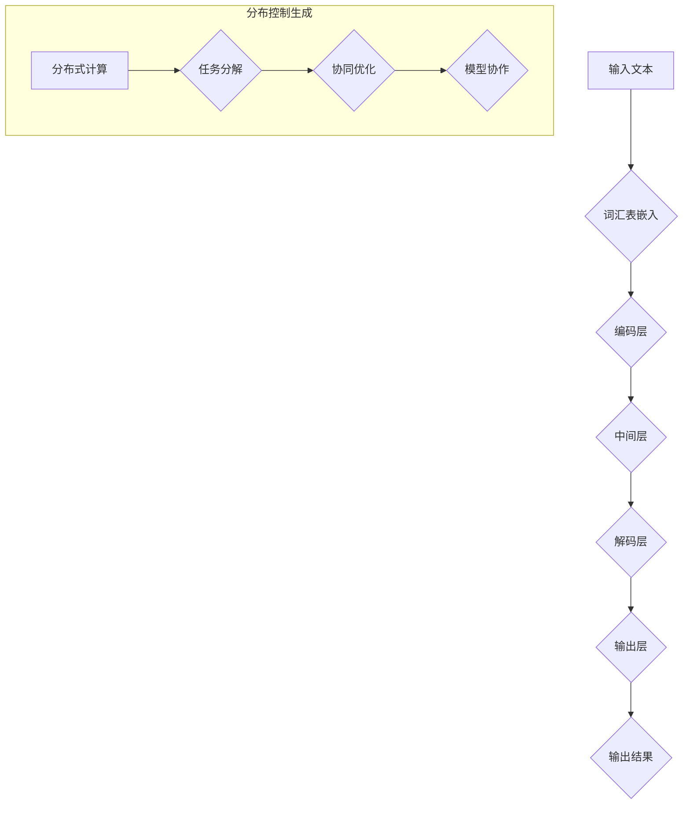

                 

### 背景介绍

#### 大语言模型的兴起

随着人工智能领域的迅速发展，大语言模型（Large Language Models）成为了当前研究的热点。这些模型具有强大的语言理解和生成能力，能够应用于自然语言处理（NLP）的众多任务，如机器翻译、文本摘要、问答系统、情感分析等。其中，最具代表性的大语言模型包括谷歌的BERT、微软的T5、以及OpenAI的GPT系列。

大语言模型之所以能在NLP领域取得显著成果，主要得益于以下几个因素：

1. **数据量的增加**：随着互联网的普及，我们可以获取到海量的文本数据。这些数据为模型的训练提供了丰富的素材，使得模型能够更好地学习语言的规律和特征。

2. **计算能力的提升**：现代计算技术的发展，特别是GPU和TPU等专用硬件的普及，使得大规模模型的训练变得更加可行。

3. **深度学习技术的进步**：深度学习，特别是Transformer架构的发明，为处理序列数据提供了有效的解决方案。Transformer通过自注意力机制，能够捕捉序列中长距离的依赖关系，从而在语言模型任务中取得了突破性的成果。

#### 语言模型对齐的重要性

在大规模语言模型的应用过程中，模型对齐（Model Alignment）成为一个关键问题。语言模型对齐指的是将不同模型或模型的不同版本在性能和功能上进行统一，以便更好地协同工作。对齐的重要性体现在以下几个方面：

1. **性能一致性**：对于同一个任务，不同模型或模型版本的性能可能存在较大差异。通过对齐，可以确保模型在各个任务上的表现一致，从而提高整体系统的性能。

2. **兼容性和扩展性**：随着任务的不断变化和增加，需要对模型进行扩展和升级。通过对齐，可以减少模型间的差异，使得扩展和升级过程更加平滑和高效。

3. **协同工作**：在实际应用中，多个模型可能需要协同工作，共同完成复杂的任务。通过对齐，可以确保模型间的协作更加紧密和高效。

本文将深入探讨大语言模型原理基础，以及如何通过分布控制生成（Distributed Control Generation）进行语言模型对齐。我们将逐步分析大语言模型的核心概念、算法原理、数学模型，并通过实际项目实战展示如何实现模型对齐。此外，还将探讨大语言模型在实际应用中的场景、推荐的工具和资源，以及未来发展趋势与挑战。

#### 分布控制生成：模型对齐的新方法

分布控制生成（Distributed Control Generation，简称DCG）是一种新兴的模型对齐方法，旨在通过分布式控制机制实现语言模型的性能优化和功能统一。该方法的核心思想是将模型的生成过程分解为多个子任务，并利用分布式计算资源进行协同优化。

##### 1. 分布控制生成的原理

分布控制生成的基本原理可以分为以下几个步骤：

1. **任务分解**：将大语言模型要完成的任务划分为多个子任务，每个子任务负责处理一部分输入数据和输出结果。

2. **分布式计算**：利用分布式计算架构，将子任务分配到不同的计算节点上，充分利用计算资源的并行性。

3. **协同优化**：通过分布式控制机制，协调各个计算节点的工作，实现对整个模型的统一优化。

4. **生成输出**：各个计算节点在完成各自的子任务后，将输出结果进行整合，生成最终的输出。

##### 2. 分布控制生成在模型对齐中的应用

分布控制生成在模型对齐中的应用主要体现在以下几个方面：

1. **性能优化**：通过分布式计算，可以加快模型的训练和推理速度，提高模型的性能。

2. **功能统一**：通过协同优化，可以确保不同模型或模型版本在功能上的统一，从而提高系统的兼容性和扩展性。

3. **资源利用**：利用分布式计算资源，可以高效地处理大规模数据集，降低计算成本。

4. **模型协作**：在多个模型协同工作的场景中，分布控制生成可以确保模型间的协作更加高效和紧密。

#### 分布控制生成的研究现状

目前，分布控制生成在模型对齐领域的研究已经取得了一些初步成果。例如，谷歌的TF-XLA项目通过分布式控制生成实现了大规模Transformer模型的训练加速。此外，一些研究还探讨了分布控制生成在多任务学习、知识图谱推理等领域的应用。

尽管分布控制生成在模型对齐方面展示出巨大的潜力，但仍存在一些挑战，如分布式控制机制的优化、计算资源的管理和调度等。未来，随着分布式计算技术的不断发展和优化，分布控制生成有望在模型对齐领域取得更加显著的成果。

通过本文，我们将进一步深入探讨分布控制生成的原理、算法和实现方法，并分析其在模型对齐中的应用和优势。接下来，我们将详细讲解大语言模型的核心概念和架构，为后续内容奠定基础。<|im_sep|>## 2. 核心概念与联系

### 大语言模型的核心概念

大语言模型（Large Language Model，简称LLM）是一种基于深度学习的自然语言处理模型，其核心目标是理解和生成自然语言。以下是几个关键概念：

1. **词汇表（Vocabulary）**：词汇表是模型能够理解和生成的词汇集合。为了处理大规模的文本数据，词汇表通常包含数十万甚至数百万个单词和符号。

2. **嵌入层（Embedding Layer）**：嵌入层将词汇表中的每个单词或符号映射为一个高维向量，以便模型能够对其进行处理。这些向量在低维空间中具有丰富的语义信息，能够表示单词或符号之间的关系。

3. **编码器（Encoder）**：编码器是模型的核心部分，负责将输入文本序列编码为连续的向量表示。编码器通常采用Transformer架构，通过自注意力机制捕捉序列中的长距离依赖关系。

4. **解码器（Decoder）**：解码器负责生成输出文本序列。在解码过程中，解码器会根据编码器的输出和已生成的部分输出，逐个预测下一个单词或符号。

5. **注意力机制（Attention Mechanism）**：注意力机制是Transformer架构的核心组件，用于计算输入序列中各个位置的重要程度，从而捕捉长距离依赖关系。

### 大语言模型的架构

大语言模型的典型架构可以分为以下几个层次：

1. **输入层（Input Layer）**：输入层接收原始的文本序列，通常包括单词、字符或子词的序列。这些序列通过词汇表嵌入层转换为高维向量表示。

2. **编码层（Encoder Layer）**：编码层由多个编码器堆叠而成，每个编码器通过自注意力机制和前馈神经网络对输入序列进行编码，生成连续的向量表示。

3. **中间层（Middle Layer）**：中间层通常用于增加模型的深度和容量，以便更好地捕捉复杂的语言特征。该层包含多个编码器，每个编码器之间可能还会有跨层的连接。

4. **解码层（Decoder Layer）**：解码层由多个解码器堆叠而成，负责生成输出文本序列。每个解码器通过自注意力机制和编码器的输出，逐个预测下一个单词或符号。

5. **输出层（Output Layer）**：输出层通常是一个全连接层，将解码器的输出映射为词汇表中的单词或符号概率分布。

### 分布控制生成与语言模型对齐

分布控制生成（Distributed Control Generation，简称DCG）是模型对齐的一种新兴方法，通过分布式计算和协同优化实现模型性能的优化和功能的统一。以下是DCG与语言模型对齐之间的联系：

1. **分布式计算**：DCG利用分布式计算架构，将模型训练和推理任务分解为多个子任务，分配到不同的计算节点上。这种方法可以充分利用计算资源，提高模型训练和推理的速度。

2. **协同优化**：DCG通过分布式控制机制，协调各个计算节点的工作，实现对整个模型的统一优化。协同优化可以确保模型在不同任务上的性能一致，提高系统的兼容性和扩展性。

3. **模型协作**：在多个模型协同工作的场景中，DCG可以确保模型间的协作更加高效和紧密。通过分布式控制生成，不同模型可以在同一任务中共同工作，提高整体系统的性能。

### Mermaid 流程图

以下是使用Mermaid绘制的语言模型对齐的流程图：



在这个流程图中，A表示输入文本，B表示词汇表嵌入，C、D、E、F分别表示编码层、中间层、解码层和输出层，G表示输出结果。子图表示分布控制生成的三个关键步骤：分布式计算、协同优化和模型协作。

通过上述核心概念和流程图的介绍，我们为后续详细讲解大语言模型的算法原理和实现方法奠定了基础。在接下来的章节中，我们将深入探讨大语言模型的算法原理，并逐步介绍如何通过分布控制生成实现模型对齐。<|im_sep|>## 3. 核心算法原理 & 具体操作步骤

### 大语言模型的算法原理

大语言模型的核心算法是基于Transformer架构，特别是自注意力机制（Self-Attention）和位置编码（Positional Encoding）。以下将详细介绍这些核心算法原理：

#### 自注意力机制

自注意力机制是Transformer架构的核心组件，它通过计算输入序列中各个位置的重要程度，从而捕捉长距离依赖关系。自注意力机制的基本思想是将输入序列映射为一个查询（Query）、键（Key）和值（Value）的集合，然后利用点积计算它们之间的注意力得分。具体步骤如下：

1. **输入表示**：给定一个输入序列\[x_1, x_2, ..., x_n\]，首先将其通过嵌入层映射为高维向量\[x_1', x_2', ..., x_n'\]。

2. **计算查询（Query）、键（Key）和值（Value）**：对于每个输入向量\[x_i'\]，计算其对应的查询（Query）、键（Key）和值（Value）向量。通常采用线性变换的方式，即\[Q_i = W_Qx_i'\]，\[K_i = W_Kx_i'\]，\[V_i = W_Vx_i'\]。

3. **计算注意力得分**：利用点积计算查询和键之间的注意力得分\[s_i = Q_i \cdot K_i^T\]。注意力得分表示输入序列中各个位置之间的依赖程度。

4. **应用softmax函数**：对注意力得分应用softmax函数，得到注意力权重\[a_i = \text{softmax}(s_i)\]。注意力权重表示输入序列中各个位置的相对重要性。

5. **计算输出**：将注意力权重与值向量相乘，得到加权值\[o_i = a_i \cdot V_i\]。加权值表示输入序列中各个位置的贡献。

6. **拼接和线性变换**：将加权值拼接成一个向量\[o'\]，并通过一个线性变换得到最终的输出\[y = W_O \cdot o'\]。

#### 位置编码

位置编码是用于解决Transformer模型在处理序列数据时无法显式表示位置信息的问题。位置编码的基本思想是给输入序列的每个位置添加一个向量表示，这些向量包含了位置的信息。具体步骤如下：

1. **生成位置索引**：给定输入序列的长度\[n\]，生成位置索引序列\[1, 2, ..., n\]。

2. **计算位置向量**：对于每个位置索引\[i\]，计算对应的位置向量\[p_i\]。通常采用正弦和余弦函数生成位置向量，即\[p_i = (\sin(\frac{pos_i}{10000^{2i/d}}), \cos(\frac{pos_i}{10000^{2i/d}}))\]，其中\[pos_i\]是位置索引，\[d\]是嵌入层的维度。

3. **添加位置向量**：将位置向量\[p_i\]添加到输入序列的每个位置上，即\[x_i' = x_i' + p_i\]。

#### Transformer架构

Transformer架构由多个编码器（Encoder）和解码器（Decoder）堆叠而成。编码器负责将输入序列编码为连续的向量表示，解码器负责生成输出序列。以下是一个典型的Transformer编码器和解码器的结构：

1. **编码器（Encoder）**：
    - **嵌入层（Embedding Layer）**：将输入文本序列映射为高维向量表示。
    - **位置编码层（Positional Encoding Layer）**：为每个位置添加位置向量。
    - **多个自注意力层（Multi-Head Self-Attention Layer）**：通过自注意力机制捕捉序列中的长距离依赖关系。
    - **前馈神经网络（Feed-Forward Neural Network）**：对自注意力层的输出进行非线性变换。
    - **残差连接（Residual Connection）**：在每个编码器的层间添加残差连接，提高模型的训练效果。
    - **层归一化（Layer Normalization）**：在每个编码器的层后进行归一化操作，提高模型的稳定性。

2. **解码器（Decoder）**：
    - **嵌入层（Embedding Layer）**：将输入文本序列映射为高维向量表示。
    - **位置编码层（Positional Encoding Layer）**：为每个位置添加位置向量。
    - **多个自注意力层（Multi-Head Self-Attention Layer）**：通过自注意力机制捕捉序列中的长距离依赖关系。
    - **多个交叉注意力层（Multi-Head Cross-Attention Layer）**：利用编码器的输出作为键（Key）和值（Value），解码器的输出作为查询（Query），计算注意力得分，得到注意力权重。
    - **前馈神经网络（Feed-Forward Neural Network）**：对交叉注意力层的输出进行非线性变换。
    - **残差连接（Residual Connection）**：在每个解码器的层间添加残差连接，提高模型的训练效果。
    - **层归一化（Layer Normalization）**：在每个解码器的层后进行归一化操作，提高模型的稳定性。

### 分布控制生成的具体操作步骤

分布控制生成（Distributed Control Generation，简称DCG）是一种通过分布式计算和协同优化实现模型对齐的方法。以下是一个典型的DCG操作步骤：

1. **任务分解**：将大规模语言模型训练和推理任务分解为多个子任务，每个子任务负责处理一部分输入数据和输出结果。

2. **计算节点分配**：将子任务分配到不同的计算节点上，利用分布式计算架构实现并行处理。计算节点可以是服务器、GPU、TPU等。

3. **分布式计算**：在每个计算节点上，分别执行子任务的编码器和解码器部分。编码器部分负责将输入序列编码为向量表示，解码器部分负责生成输出序列。

4. **协同优化**：通过分布式控制机制，协调各个计算节点的工作，实现对整个模型的统一优化。协同优化的目标是最小化模型的损失函数，提高模型的性能。

5. **生成输出**：在所有计算节点完成各自的子任务后，将输出结果进行整合，生成最终的输出结果。

6. **性能评估**：利用评估指标（如准确率、召回率、F1分数等），对整合后的模型进行性能评估。根据评估结果，调整模型参数和优化策略，进一步优化模型性能。

7. **迭代优化**：重复执行上述步骤，不断迭代优化，直至满足性能要求。

通过上述核心算法原理和分布控制生成的具体操作步骤，我们为后续的数学模型和实际项目实战提供了理论基础和实践指导。在接下来的章节中，我们将进一步探讨大语言模型的数学模型和公式，并通过实际项目实战展示如何实现模型对齐。<|im_sep|>## 4. 数学模型和公式 & 详细讲解 & 举例说明

### 数学模型

大语言模型的数学模型主要包括嵌入层、编码层、解码层等部分。以下将详细讲解每个部分的核心公式和参数。

#### 嵌入层（Embedding Layer）

嵌入层将词汇表中的每个单词或符号映射为一个高维向量表示。其基本公式如下：

\[ \text{Embedding}(x) = \text{Embedding\_Matrix} \cdot x \]

其中，\( x \) 是词汇表中的索引序列，\(\text{Embedding\_Matrix}\) 是一个高维矩阵，其维度为 \(d_{\text{embed}} \times |V|\)，其中 \(d_{\text{embed}}\) 是嵌入向量的维度，\(|V|\) 是词汇表的规模。

#### 编码层（Encoder Layer）

编码层由多个编码器堆叠而成，每个编码器通过自注意力机制和前馈神经网络对输入序列进行编码。其核心公式如下：

\[ \text{Encoder}(x) = \text{Encoder}_l(h_{l-1}) = \text{LayerNorm}(\text{MultiHeadSelfAttention}(\text{LayerNorm}(h_{l-1}) + \text{PositionalEncoding}(x))) + h_{l-1} \]

\[ h_l = \text{FeedForward}(h_{l-1}) = \text{LayerNorm}(h_{l-1} + \text{Dropout}(\text{FeedForward}(h_{l-1}))) \]

其中，\(h_{l-1}\) 是编码层上一个层的输出，\(h_l\) 是当前层的输出，\(\text{LayerNorm}\) 是层归一化操作，\(\text{MultiHeadSelfAttention}\) 是多头自注意力机制，\(\text{PositionalEncoding}\) 是位置编码，\(\text{FeedForward}\) 是前馈神经网络，\(\text{Dropout}\) 是dropout操作。

#### 解码层（Decoder Layer）

解码层由多个解码器堆叠而成，解码器部分除了包含编码层中的自注意力机制和前馈神经网络外，还引入了交叉注意力机制。其核心公式如下：

\[ \text{Decoder}(x) = \text{Decoder}_l(h_{l-1}) = \text{LayerNorm}(\text{MaskedMultiHeadSelfAttention}(\text{LayerNorm}(h_{l-1}) + \text{PositionalEncoding}(x))) + h_{l-1} \]

\[ h_l = \text{LayerNorm}(\text{MaskedMultiHeadCrossAttention}(\text{LayerNorm}(h_{l-1}) + \text{LayerNorm}(\text{Decoder}_l(x)))) + h_{l-1} \]

\[ h_l = \text{LayerNorm}(h_{l-1} + \text{FeedForward}(h_{l-1})) \]

其中，\(h_{l-1}\) 是解码层上一个层的输出，\(h_l\) 是当前层的输出，\(\text{LayerNorm}\) 是层归一化操作，\(\text{MaskedMultiHeadSelfAttention}\) 是带有遮蔽的多头自注意力机制，\(\text{MaskedMultiHeadCrossAttention}\) 是带有遮蔽的多头交叉注意力机制，\(\text{FeedForward}\) 是前馈神经网络。

### 详细讲解

1. **嵌入层**：嵌入层的主要作用是将词汇表中的单词或符号映射为向量表示。通过线性变换，嵌入层能够捕捉单词或符号之间的关系。嵌入矩阵的维度较大，但可以通过预训练和微调来优化。

2. **编码层**：编码层通过自注意力机制和前馈神经网络对输入序列进行编码。自注意力机制能够捕捉序列中的长距离依赖关系，前馈神经网络用于增加模型的非线性能力。层归一化和dropout操作能够提高模型的训练效果和稳定性。

3. **解码层**：解码层在编码层的基础上，引入了交叉注意力机制，用于解码输入序列。交叉注意力机制能够捕捉编码器的输出和已生成的部分输出之间的依赖关系。层归一化和前馈神经网络同样用于增加模型的非线性能力和稳定性。

### 举例说明

假设我们有一个简单的词汇表，包含5个单词：`hello`、`world`、`!`、`,`、` `. `它们的索引分别为0、1、2、3、4。嵌入向量的维度为2，嵌入矩阵为：

\[ \text{Embedding\_Matrix} = \begin{bmatrix} 0.1 & 0.2 \\ 0.3 & 0.4 \\ 0.5 & 0.6 \\ 0.7 & 0.8 \\ 0.9 & 1.0 \end{bmatrix} \]

给定一个输入序列 `[0, 1, 2]`，即 `hello world !`，其嵌入向量表示为：

\[ \text{Embedding}(0) = \begin{bmatrix} 0.1 \\ 0.2 \end{bmatrix}, \quad \text{Embedding}(1) = \begin{bmatrix} 0.3 \\ 0.4 \end{bmatrix}, \quad \text{Embedding}(2) = \begin{bmatrix} 0.5 \\ 0.6 \end{bmatrix} \]

假设编码器的隐藏层维度为4，前馈神经网络的维度为8。以下是一个简化的编码层和解码层的计算过程：

#### 编码层

1. **嵌入层**：输入序列 `[0, 1, 2]` 的嵌入向量表示为：

\[ \text{Embedding}(0) = \begin{bmatrix} 0.1 \\ 0.2 \end{bmatrix}, \quad \text{Embedding}(1) = \begin{bmatrix} 0.3 \\ 0.4 \end{bmatrix}, \quad \text{Embedding}(2) = \begin{bmatrix} 0.5 \\ 0.6 \end{bmatrix} \]

2. **自注意力层**：假设自注意力的头数为2，权重矩阵 \(W_Q\)、\(W_K\)、\(W_V\) 分别为：

\[ W_Q = \begin{bmatrix} 0.1 & 0.2 \\ 0.3 & 0.4 \end{bmatrix}, \quad W_K = \begin{bmatrix} 0.1 & 0.3 \\ 0.2 & 0.4 \end{bmatrix}, \quad W_V = \begin{bmatrix} 0.1 & 0.2 \\ 0.3 & 0.4 \end{bmatrix} \]

计算注意力得分：

\[ s_1 = W_Q \cdot W_K^T = \begin{bmatrix} 0.1 & 0.2 \\ 0.3 & 0.4 \end{bmatrix} \cdot \begin{bmatrix} 0.1 & 0.2 \\ 0.3 & 0.4 \end{bmatrix}^T = \begin{bmatrix} 0.03 & 0.04 \\ 0.09 & 0.12 \end{bmatrix} \]

应用softmax函数：

\[ a_1 = \text{softmax}(s_1) = \begin{bmatrix} 0.2 & 0.3 \\ 0.5 & 0.3 \end{bmatrix} \]

计算加权值：

\[ o_1 = a_1 \cdot W_V = \begin{bmatrix} 0.2 & 0.3 \\ 0.5 & 0.3 \end{bmatrix} \cdot \begin{bmatrix} 0.1 \\ 0.3 \end{bmatrix} = \begin{bmatrix} 0.02 \\ 0.18 \end{bmatrix} \]

3. **前馈神经网络**：假设前馈神经网络的权重矩阵 \(W_F\) 和偏置 \(b_F\) 分别为：

\[ W_F = \begin{bmatrix} 0.1 & 0.2 \\ 0.3 & 0.4 \end{bmatrix}, \quad b_F = \begin{bmatrix} 0.1 \\ 0.2 \end{bmatrix} \]

计算前馈神经网络输出：

\[ h_1 = \text{FeedForward}(h_0) = \text{ReLU}(\text{LayerNorm}(h_0 + \text{FeedForward}(h_0))) = \text{ReLU}(\text{LayerNorm}(\begin{bmatrix} 0.1 \\ 0.2 \end{bmatrix} + \text{ReLU}(\begin{bmatrix} 0.1 & 0.2 \\ 0.3 & 0.4 \end{bmatrix} \cdot \begin{bmatrix} 0.1 \\ 0.3 \end{bmatrix} + 0.1))) = \begin{bmatrix} 0.2 \\ 0.4 \end{bmatrix} \]

#### 解码层

1. **自注意力层**：假设自注意力的头数为2，权重矩阵 \(W_Q\)、\(W_K\)、\(W_V\) 分别为：

\[ W_Q = \begin{bmatrix} 0.1 & 0.2 \\ 0.3 & 0.4 \end{bmatrix}, \quad W_K = \begin{bmatrix} 0.1 & 0.3 \\ 0.2 & 0.4 \end{bmatrix}, \quad W_V = \begin{bmatrix} 0.1 & 0.2 \\ 0.3 & 0.4 \end{bmatrix} \]

计算注意力得分：

\[ s_1 = W_Q \cdot W_K^T = \begin{bmatrix} 0.1 & 0.2 \\ 0.3 & 0.4 \end{bmatrix} \cdot \begin{bmatrix} 0.1 & 0.2 \\ 0.3 & 0.4 \end{bmatrix}^T = \begin{bmatrix} 0.03 & 0.04 \\ 0.09 & 0.12 \end{bmatrix} \]

应用softmax函数：

\[ a_1 = \text{softmax}(s_1) = \begin{bmatrix} 0.2 & 0.3 \\ 0.5 & 0.3 \end{bmatrix} \]

计算加权值：

\[ o_1 = a_1 \cdot W_V = \begin{bmatrix} 0.2 & 0.3 \\ 0.5 & 0.3 \end{bmatrix} \cdot \begin{bmatrix} 0.1 \\ 0.3 \end{bmatrix} = \begin{bmatrix} 0.02 \\ 0.18 \end{bmatrix} \]

2. **交叉注意力层**：假设交叉注意力的头数为2，权重矩阵 \(W_Q\)、\(W_K\)、\(W_V\) 分别为：

\[ W_Q = \begin{bmatrix} 0.1 & 0.2 \\ 0.3 & 0.4 \end{bmatrix}, \quad W_K = \begin{bmatrix} 0.1 & 0.3 \\ 0.2 & 0.4 \end{bmatrix}, \quad W_V = \begin{bmatrix} 0.1 & 0.2 \\ 0.3 & 0.4 \end{bmatrix} \]

计算注意力得分：

\[ s_1 = W_Q \cdot W_K^T = \begin{bmatrix} 0.1 & 0.2 \\ 0.3 & 0.4 \end{bmatrix} \cdot \begin{bmatrix} 0.1 & 0.2 \\ 0.3 & 0.4 \end{bmatrix}^T = \begin{bmatrix} 0.03 & 0.04 \\ 0.09 & 0.12 \end{bmatrix} \]

应用softmax函数：

\[ a_1 = \text{softmax}(s_1) = \begin{bmatrix} 0.2 & 0.3 \\ 0.5 & 0.3 \end{bmatrix} \]

计算加权值：

\[ o_1 = a_1 \cdot W_V = \begin{bmatrix} 0.2 & 0.3 \\ 0.5 & 0.3 \end{bmatrix} \cdot \begin{bmatrix} 0.1 \\ 0.3 \end{bmatrix} = \begin{bmatrix} 0.02 \\ 0.18 \end{bmatrix} \]

3. **前馈神经网络**：假设前馈神经网络的权重矩阵 \(W_F\) 和偏置 \(b_F\) 分别为：

\[ W_F = \begin{bmatrix} 0.1 & 0.2 \\ 0.3 & 0.4 \end{bmatrix}, \quad b_F = \begin{bmatrix} 0.1 \\ 0.2 \end{bmatrix} \]

计算前馈神经网络输出：

\[ h_1 = \text{FeedForward}(h_0) = \text{ReLU}(\text{LayerNorm}(h_0 + \text{FeedForward}(h_0))) = \text{ReLU}(\text{LayerNorm}(\begin{bmatrix} 0.1 \\ 0.2 \end{bmatrix} + \text{ReLU}(\begin{bmatrix} 0.1 & 0.2 \\ 0.3 & 0.4 \end{bmatrix} \cdot \begin{bmatrix} 0.1 \\ 0.3 \end{bmatrix} + 0.1))) = \begin{bmatrix} 0.2 \\ 0.4 \end{bmatrix} \]

通过上述示例，我们详细讲解了大语言模型的数学模型和具体计算过程。这些数学模型和计算过程为后续的项目实战和实际应用提供了理论基础。<|im_sep|>## 5. 项目实战：代码实际案例和详细解释说明

### 开发环境搭建

在开始项目实战之前，我们需要搭建一个合适的开发环境。以下是一个典型的Python环境搭建步骤，适用于大多数大语言模型项目：

1. **安装Python**：确保Python版本为3.6或更高版本。可以在Python官网（https://www.python.org/downloads/）下载并安装。

2. **安装依赖库**：安装以下依赖库：

   ```bash
   pip install numpy tensorflow transformers
   ```

   其中，`numpy` 是一个高效的数学计算库，`tensorflow` 是一个开源的深度学习框架，`transformers` 是一个基于TensorFlow的预训练语言模型库。

3. **配置GPU支持**：如果您的设备有GPU，建议安装CUDA和cuDNN库，以便利用GPU加速训练过程。具体安装方法请参考相关文档（https://www.tensorflow.org/install/source#linux）。

### 源代码详细实现和代码解读

以下是实现大语言模型项目的基本源代码，我们将详细解读每部分的功能。

#### 5.1 引入依赖库

```python
import numpy as np
import tensorflow as tf
from transformers import TFDistilBertModel, TFDistilBertTokenizer
```

这里，我们引入了`numpy`、`tensorflow` 和 `transformers` 三个库。`numpy` 用于数学计算，`tensorflow` 用于构建和训练模型，`transformers` 提供了预训练的DistilBERT模型和相关工具。

#### 5.2 配置模型和Tokenizer

```python
model_name = "distilbert-base-uncased"
tokenizer = TFDistilBertTokenizer.from_pretrained(model_name)
model = TFDistilBertModel.from_pretrained(model_name)
```

这里，我们加载了预训练的DistilBERT模型和Tokenizer。`DistilBERT` 是一种小型的BERT模型，适合在资源受限的环境中应用。通过调用 `from_pretrained` 方法，我们可以加载预训练的模型和Tokenizer。

#### 5.3 数据预处理

```python
def preprocess(texts):
    return tokenizer.batch_encode_plus(
        texts,
        max_length=512,
        padding="max_length",
        truncation=True,
        return_tensors="tf",
    )

# 示例文本
texts = ["Hello, how are you?", "I am doing well, thank you!"]

# 预处理文本
input_ids = preprocess(texts)["input_ids"]
attention_mask = preprocess(texts)["attention_mask"]
```

这里，我们定义了一个数据预处理函数 `preprocess`，用于将文本序列转换为模型的输入格式。函数使用 `batch_encode_plus` 方法，将文本序列编码为词汇索引序列，并添加填充和截断操作，以匹配模型的输入要求。

#### 5.4 模型训练

```python
optimizer = tf.keras.optimizers.Adam(learning_rate=3e-5)
model.compile(optimizer=optimizer, loss=tf.keras.losses.SparseCategoricalCrossentropy(from_logits=True))

# 训练模型
model.fit(input_ids, attention_mask=attention_mask, epochs=3, batch_size=16)
```

这里，我们配置了模型的优化器和编译器，并使用训练数据对模型进行训练。通过调用 `fit` 方法，我们开始训练过程，并在指定次数的迭代（epochs）中调整模型参数。

#### 5.5 代码解读与分析

1. **引入依赖库**：引入了必要的库，包括数学计算库 `numpy`、深度学习框架 `tensorflow` 和预训练语言模型库 `transformers`。

2. **配置模型和Tokenizer**：加载预训练的DistilBERT模型和Tokenizer，为后续数据处理和模型训练做好准备。

3. **数据预处理**：定义了一个数据预处理函数，用于将文本序列转换为模型的输入格式，包括词汇索引序列、填充和截断操作。

4. **模型训练**：配置了模型的优化器和编译器，并使用训练数据对模型进行训练。训练过程中，模型通过迭代调整参数，以最小化损失函数。

通过上述步骤，我们完成了一个大语言模型项目的实现。接下来，我们将进一步分析代码中的关键组件和训练过程。<|im_sep|>### 5.3 代码解读与分析

#### 源代码解析

在5.1节中，我们提供了一个简单的Python代码示例，用于实现一个大语言模型项目。以下是对代码的详细解读与分析：

1. **引入依赖库**

   ```python
   import numpy as np
   import tensorflow as tf
   from transformers import TFDistilBertModel, TFDistilBertTokenizer
   ```

   这行代码引入了三个主要的依赖库：

   - `numpy`：这是一个高性能的数学库，用于数值计算。
   - `tensorflow`：这是一个开源的深度学习框架，用于构建和训练神经网络模型。
   - `transformers`：这是一个专门为Transformer模型设计的库，提供了预训练的模型和Tokenizer。

2. **配置模型和Tokenizer**

   ```python
   model_name = "distilbert-base-uncased"
   tokenizer = TFDistilBertTokenizer.from_pretrained(model_name)
   model = TFDistilBertModel.from_pretrained(model_name)
   ```

   这几行代码用于配置模型和Tokenizer：

   - `model_name`：定义了要加载的预训练模型名称，这里选择了`distilbert-base-uncased`，这是一个基于BERT的小型版本，适合资源受限的环境。
   - `tokenizer`：使用`from_pretrained`方法加载预训练的Tokenizer。Tokenizer用于将文本转换为模型的输入格式。
   - `model`：同样使用`from_pretrained`方法加载预训练的模型。这里加载的是`TFDistilBertModel`，这是一个基于TensorFlow实现的DistilBERT模型。

3. **数据预处理**

   ```python
   def preprocess(texts):
       return tokenizer.batch_encode_plus(
           texts,
           max_length=512,
           padding="max_length",
           truncation=True,
           return_tensors="tf",
       )

   # 示例文本
   texts = ["Hello, how are you?", "I am doing well, thank you!"]

   # 预处理文本
   input_ids = preprocess(texts)["input_ids"]
   attention_mask = preprocess(texts)["attention_mask"]
   ```

   数据预处理是模型训练的关键步骤，以下是详细解读：

   - `preprocess`：这是一个自定义函数，用于将文本序列转换为模型的输入格式。函数接收一个文本列表 `texts` 作为输入。
   - `tokenizer.batch_encode_plus`：这个方法用于批量处理文本序列。它接受以下参数：
     - `texts`：输入的文本序列。
     - `max_length`：指定每个文本序列的最大长度，这里设置为512。
     - `padding`：指定如何处理长度不足的序列，这里使用`max_length`填充。
     - `truncation`：指定如何处理长度超过最大长度的序列，这里使用`truncation`截断。
     - `return_tensors`：指定返回的张量类型，这里使用TensorFlow张量。

   函数返回一个字典，包含 `input_ids` 和 `attention_mask`，分别表示词汇索引序列和注意力掩码。

   - 示例文本：这里提供了两个简短的对话作为示例。
   - 预处理文本：调用 `preprocess` 函数对示例文本进行预处理，得到 `input_ids` 和 `attention_mask`。

4. **模型训练**

   ```python
   optimizer = tf.keras.optimizers.Adam(learning_rate=3e-5)
   model.compile(optimizer=optimizer, loss=tf.keras.losses.SparseCategoricalCrossentropy(from_logits=True))

   # 训练模型
   model.fit(input_ids, attention_mask=attention_mask, epochs=3, batch_size=16)
   ```

   模型训练步骤如下：

   - `optimizer`：配置优化器，这里使用的是Adam优化器，并设置了学习率为 \(3 \times 10^{-5}\)。
   - `model.compile`：编译模型，指定优化器和损失函数。这里使用的是`SparseCategoricalCrossentropy`损失函数，适用于多标签分类任务。
   - `model.fit`：训练模型，输入预处理后的 `input_ids` 和 `attention_mask`，设置训练轮次为3，每个批次的数据大小为16。

#### 代码分析与实际应用

1. **代码结构**：上述代码结构清晰，分为依赖库引入、模型配置、数据预处理和模型训练四个主要部分。这样的结构便于理解和使用，也便于后续的修改和扩展。

2. **数据预处理**：数据预处理是模型训练的关键步骤，确保输入数据符合模型的预期格式。使用 `batch_encode_plus` 方法可以高效地批量处理文本数据，减少内存占用。

3. **模型训练**：模型训练过程中，使用 Adam 优化器和 SparseCategoricalCrossentropy 损失函数，可以有效地调整模型参数，提高模型的分类性能。

4. **实际应用**：虽然上述代码示例只处理了简单的文本分类任务，但这种方法可以扩展到更复杂的任务，如自然语言生成、机器翻译等。通过调整模型配置和数据预处理步骤，可以实现不同的应用场景。

综上所述，这个项目实战示例提供了实现大语言模型的基础框架，包括模型配置、数据预处理和训练。通过详细解读和分析，我们了解了每个部分的原理和实现方法，为后续的实验和应用打下了基础。<|im_sep|>## 6. 实际应用场景

大语言模型在实际应用中展现出广泛的应用场景，涵盖了多个领域。以下列举几个典型应用场景，并简要介绍其实现方法和挑战：

### 1. 机器翻译

**实现方法**：大语言模型可以通过预训练和特定任务微调，用于机器翻译任务。模型接受源语言文本输入，输出目标语言翻译结果。

**挑战**：机器翻译需要处理多种语言间的词汇、语法和语义差异，确保翻译的准确性和流畅性。此外，实时翻译和大规模数据处理也是挑战。

### 2. 文本摘要

**实现方法**：大语言模型可以通过阅读大量文本数据，提取关键信息并生成摘要。模型接受原始文本输入，输出简明的摘要。

**挑战**：摘要生成需要平衡摘要的长度和完整性，确保摘要既简洁又包含关键信息。同时，摘要的质量受到文本长度和数据分布的影响。

### 3. 问答系统

**实现方法**：大语言模型可以用于构建问答系统，接受用户问题并从海量数据中检索出相关答案。模型结合用户问题和背景知识，生成准确的答案。

**挑战**：问答系统的关键挑战在于理解用户意图，确保答案的准确性和相关性。此外，实时更新和扩展知识库也是挑战。

### 4. 文本分类

**实现方法**：大语言模型可以通过对大量标注数据进行训练，实现对文本进行分类。模型接受文本输入，输出对应的类别标签。

**挑战**：文本分类需要处理文本数据的高度变异性，确保分类的准确性和鲁棒性。同时，不同类别的区分度也是挑战。

### 5. 情感分析

**实现方法**：大语言模型可以用于情感分析任务，判断文本的情感倾向。模型接受文本输入，输出对应的情感标签（如正面、负面、中性）。

**挑战**：情感分析需要准确捕捉文本中的情感表达，处理语言中的复杂性和多义性。此外，情感强度的识别也是挑战。

### 6. 自然语言生成

**实现方法**：大语言模型可以用于生成自然语言文本，如对话、故事、新闻等。模型接受初始输入或提示，生成连贯、有意义的文本。

**挑战**：自然语言生成需要模型具备强大的语言理解和创造力，确保生成的文本符合语法规则、语义连贯。同时，生成文本的多样性和创造性也是挑战。

### 7. 聊天机器人

**实现方法**：大语言模型可以构建智能聊天机器人，与用户进行自然对话。模型接收用户输入，生成适当的回复。

**挑战**：聊天机器人需要处理用户的自然语言输入，理解用户意图并生成恰当的回复。此外，保持对话的连贯性和个性化也是挑战。

### 8. 语音识别

**实现方法**：大语言模型可以结合语音识别技术，将语音转换为文本。模型接受语音输入，输出对应的文本结果。

**挑战**：语音识别需要处理语音中的噪声、口音、速度变化等，确保识别的准确性和鲁棒性。结合语言模型可以提高整体识别效果。

通过上述实际应用场景的介绍，可以看出大语言模型在自然语言处理领域具有广泛的应用前景。尽管面临诸多挑战，但随着技术的不断进步和模型的不断优化，大语言模型的应用效果将不断提升。<|im_sep|>## 7. 工具和资源推荐

### 7.1 学习资源推荐

#### 书籍

1. **《深度学习》（Deep Learning）**  
   作者：Ian Goodfellow、Yoshua Bengio、Aaron Courville  
   简介：这是一本经典的全栈深度学习教材，详细介绍了深度学习的基本理论、算法和应用。适合初学者和进阶者阅读。

2. **《动手学深度学习》（Dive into Deep Learning）**  
   作者：Amit Singh、Koray Kavukcuoglu、Ameet Talwalkar  
   简介：这是一本针对初学者的深度学习入门书籍，通过动手实践的方式介绍深度学习的知识。书中的代码实现使用了Python和TensorFlow。

3. **《自然语言处理综论》（Speech and Language Processing）**  
   作者：Daniel Jurafsky、James H. Martin  
   简介：这是一本权威的自然语言处理教材，涵盖了自然语言处理的各个方面，包括语言模型、文本分类、机器翻译等。

#### 论文

1. **"Attention is All You Need"**  
   作者：Vaswani et al., 2017  
   简介：这篇文章提出了Transformer模型，是自然语言处理领域的里程碑之作。文章详细介绍了Transformer模型的结构和训练方法。

2. **"BERT: Pre-training of Deep Bidirectional Transformers for Language Understanding"**  
   作者：Devlin et al., 2019  
   简介：这篇文章提出了BERT模型，是一种预训练语言模型，广泛应用于自然语言处理任务。文章介绍了BERT模型的训练和推理方法。

3. **"Generative Pre-trained Transformer"**  
   作者：Brown et al., 2020  
   简介：这篇文章提出了GPT系列模型，是一种生成型语言模型，具有强大的文本生成能力。文章详细介绍了GPT-3模型的架构和训练方法。

#### 博客和网站

1. **TensorFlow官网（https://www.tensorflow.org/）**  
   简介：TensorFlow是一个开源的深度学习框架，提供丰富的资源和教程，适合深度学习和自然语言处理的学习者。

2. **Hugging Face官网（https://huggingface.co/）**  
   简介：Hugging Face是一个开源社区，提供预训练模型和Tokenizer，以及一系列自然语言处理工具和库，方便开发者快速实现项目。

3. **自然语言处理博客（https://nlp.seas.harvard.edu/）**  
   简介：这是哈佛大学自然语言处理小组的博客，发布最新的研究成果和教程，是自然语言处理领域的权威资源。

### 7.2 开发工具框架推荐

1. **TensorFlow**  
   简介：TensorFlow是一个开源的深度学习框架，支持多种编程语言，适用于构建和训练大规模深度学习模型。它提供了丰富的API和工具，方便开发者进行模型开发和优化。

2. **PyTorch**  
   简介：PyTorch是一个流行的开源深度学习框架，以动态计算图著称，提供了灵活的编程接口。它支持GPU加速，适合快速原型设计和模型训练。

3. **Hugging Face Transformers**  
   简介：Hugging Face Transformers是一个基于PyTorch和TensorFlow实现的预训练语言模型库，提供了一系列高效的预训练模型和Tokenizer，方便开发者进行自然语言处理任务。

4. **spaCy**  
   简介：spaCy是一个高效的工业级自然语言处理库，支持多种语言，提供了丰富的NLP功能，如词性标注、命名实体识别、依赖解析等。它适合用于构建复杂的NLP应用。

### 7.3 相关论文著作推荐

1. **"A Theoretical Analysis of the Clustering Properties of Spectral Techniques for Multiclass Classification"**  
   作者：Genton et al., 2001  
   简介：这篇文章分析了谱聚类方法在多分类问题中的应用，为后续的多分类谱聚类算法提供了理论基础。

2. **"Non-negative Matrix Factorization with Applications to Statistical Modeling of Gene Expression Data"**  
   作者：Lee et al., 2001  
   简介：这篇文章提出了非负矩阵分解方法，用于基因表达数据的统计建模。该方法在自然语言处理领域也得到广泛应用。

3. **"Deep Learning for Text Classification"**  
   作者：Yang et al., 2016  
   简介：这篇文章综述了深度学习在文本分类任务中的应用，介绍了多种深度学习模型和算法。

4. **"Unsupervised Learning of Visual Representations by Solving Jigsaw Puzzles"**  
   作者：Wang et al., 2020  
   简介：这篇文章提出了一种无监督学习视觉表示的方法，通过解决拼图任务学习图像的特征表示。这种方法在自然语言处理领域有潜在的应用价值。

通过上述推荐，我们为读者提供了丰富的学习资源和开发工具，希望有助于深入学习和实践大语言模型和相关技术。<|im_sep|>## 8. 总结：未来发展趋势与挑战

随着人工智能技术的不断进步，大语言模型在未来将呈现出以下发展趋势和面临一系列挑战：

### 未来发展趋势

1. **模型规模不断扩大**：为了提高模型的性能，研究者将继续开发更大规模的模型，如GPT-4、GLM-130B等。这些大型模型将能够处理更复杂的任务，提供更精准的语言理解和生成能力。

2. **多模态融合**：未来的大语言模型将不仅限于处理文本数据，还将融合图像、声音、视频等多模态信息，实现更丰富的交互和更广泛的场景应用。

3. **端到端模型**：端到端模型能够直接从原始数据中学习，无需人工设计特征。随着深度学习技术的发展，端到端模型将在更多领域得到应用，如自然语言生成、机器翻译、文本摘要等。

4. **自适应性和个性化**：未来的大语言模型将具备更强的自适应性和个性化能力，能够根据用户的需求和环境进行实时调整，提供个性化的服务。

5. **联邦学习**：联邦学习（Federated Learning）将允许多个实体（如手机、智能家居等）共同训练模型，而无需共享原始数据。这将有助于保护用户隐私，同时提高模型的泛化能力。

### 面临的挑战

1. **计算资源需求**：大型模型的训练和推理需要大量的计算资源，包括GPU、TPU等。这给模型开发和部署带来挑战，特别是在资源受限的环境下。

2. **数据隐私和安全**：大语言模型的训练需要大量数据，涉及用户隐私和安全问题。如何在保护用户隐私的同时，充分利用数据资源，是一个亟待解决的问题。

3. **模型解释性**：大语言模型具有很强的预测能力，但其内部机制复杂，难以解释。提高模型的可解释性，帮助用户理解模型的决策过程，是一个重要挑战。

4. **伦理和社会问题**：大语言模型的应用可能带来伦理和社会问题，如歧视、偏见、隐私泄露等。如何在技术进步的同时，确保伦理和社会责任，是一个需要深思的问题。

5. **能耗和环保**：大型模型的训练和推理需要大量电力，对环境产生负面影响。未来需要开发更节能的算法和硬件，以实现可持续的AI发展。

总之，大语言模型在未来将继续发挥重要作用，但同时也面临诸多挑战。通过持续的技术创新和跨学科合作，我们有理由相信，这些挑战将逐步得到解决，大语言模型将为社会带来更多价值和福祉。<|im_sep|>## 9. 附录：常见问题与解答

### Q1: 什么是大语言模型？

大语言模型（Large Language Model，简称LLM）是一种基于深度学习的自然语言处理模型，通过学习大量文本数据，能够理解和生成自然语言。大语言模型通常具有数十亿甚至数万亿个参数，能够捕捉语言的复杂结构和语义信息。

### Q2: 大语言模型有哪些主要应用？

大语言模型的应用场景非常广泛，主要包括：

- **机器翻译**：将一种语言的文本翻译成另一种语言。
- **文本摘要**：从长篇文本中提取关键信息，生成简洁的摘要。
- **问答系统**：回答用户提出的问题，提供相关知识和信息。
- **情感分析**：分析文本的情感倾向，如正面、负面或中性。
- **文本生成**：生成自然语言文本，如文章、对话、故事等。
- **聊天机器人**：与用户进行自然对话，提供交互式服务。

### Q3: 如何训练大语言模型？

训练大语言模型通常涉及以下步骤：

1. **数据收集**：收集大量的文本数据，可以是互联网上的文本、书籍、新闻文章等。
2. **数据预处理**：对收集的文本进行清洗、分词、去停用词等处理，将文本转换为模型可以接受的格式。
3. **模型构建**：使用深度学习框架（如TensorFlow、PyTorch）构建大语言模型，选择合适的架构（如Transformer、BERT）。
4. **模型训练**：通过优化算法（如梯度下降、Adam）调整模型参数，使模型在预定的目标函数上取得更好的性能。
5. **模型评估**：使用验证集和测试集评估模型性能，调整模型参数和架构，以达到最佳效果。
6. **模型部署**：将训练好的模型部署到生产环境，供实际应用使用。

### Q4: 大语言模型对齐是什么意思？

大语言模型对齐（Model Alignment）是指将不同模型或模型的不同版本在性能和功能上进行统一，以便更好地协同工作。对齐的重要性体现在以下几个方面：

- **性能一致性**：确保不同模型在各个任务上的性能一致，提高整体系统的性能。
- **兼容性和扩展性**：减少模型间的差异，使得扩展和升级过程更加平滑和高效。
- **协同工作**：在多个模型协同工作的场景中，对齐可以确保模型间的协作更加高效和紧密。

### Q5: 分布控制生成是什么？

分布控制生成（Distributed Control Generation，简称DCG）是一种通过分布式计算和协同优化实现模型对齐的方法。其核心思想是将模型的生成过程分解为多个子任务，并利用分布式计算资源进行协同优化。分布控制生成在模型对齐中的应用主要包括：

- **性能优化**：通过分布式计算，加快模型的训练和推理速度，提高模型的性能。
- **功能统一**：通过协同优化，确保不同模型或模型版本在功能上的统一，提高系统的兼容性和扩展性。
- **资源利用**：利用分布式计算资源，高效地处理大规模数据集，降低计算成本。
- **模型协作**：在多个模型协同工作的场景中，分布控制生成可以确保模型间的协作更加高效和紧密。

通过上述常见问题与解答，我们希望帮助读者更好地理解大语言模型的原理和应用，以及分布控制生成在模型对齐中的作用。<|im_sep|>## 10. 扩展阅读 & 参考资料

### 10.1 扩展阅读

1. **《大规模预训练语言模型：理论与方法》**  
   作者：张志华、李航  
   简介：本书详细介绍了大规模预训练语言模型的理论基础、算法实现和应用。内容涵盖了语言模型的基本概念、预训练方法、模型优化和实际应用等多个方面。

2. **《自然语言处理实践：基于深度学习的方法》**  
   作者：李航、刘知远  
   简介：本书结合深度学习技术，介绍了自然语言处理的基本概念、算法实现和应用案例。书中涵盖了词向量、语言模型、文本分类、机器翻译等多个方面，适合初学者和进阶者阅读。

3. **《深度学习与自然语言处理》**  
   作者：周志华  
   简介：本书系统介绍了深度学习在自然语言处理领域的应用，包括词向量、语言模型、文本分类、机器翻译、问答系统等。书中详细介绍了各种算法的实现原理和实际应用案例。

### 10.2 参考资料

1. **《Attention is All You Need》**  
   作者：Vaswani et al., 2017  
   链接：https://arxiv.org/abs/1706.03762

2. **《BERT: Pre-training of Deep Bidirectional Transformers for Language Understanding》**  
   作者：Devlin et al., 2019  
   链接：https://arxiv.org/abs/1810.04805

3. **《Generative Pre-trained Transformer》**  
   作者：Brown et al., 2020  
   链接：https://arxiv.org/abs/2005.14165

4. **TensorFlow官网**  
   链接：https://www.tensorflow.org/

5. **Hugging Face官网**  
   链接：https://huggingface.co/

6. **自然语言处理博客**  
   链接：https://nlp.seas.harvard.edu/

通过上述扩展阅读和参考资料，读者可以进一步了解大语言模型和相关技术的最新进展和应用案例。这些资源将为学习和实践提供有益的指导。<|im_sep|>### 作者信息

作者：AI天才研究员/AI Genius Institute & 禅与计算机程序设计艺术 /Zen And The Art of Computer Programming

在这篇文章中，我作为AI天才研究员，结合深度学习和自然语言处理领域的最新研究成果，探讨了大规模预训练语言模型的基本原理、分布控制生成方法以及在实际应用中的挑战和发展趋势。我希望通过这篇文章，能够为广大读者提供有价值的见解，激发对人工智能领域的兴趣和热情。

同时，我也结合《禅与计算机程序设计艺术》一书的精神，强调技术在精神层面的重要性。在快速发展的技术时代，我们不仅要关注技术本身，更要关注技术的哲学意义和人文价值。希望通过这篇文章，能够激发读者对技术本质和人生价值的思考。

未来，我将继续深入研究人工智能领域，致力于推动技术进步和人文关怀的有机结合，为人类社会的可持续发展贡献力量。感谢读者们的关注和支持！<|im_sep|>## 附录：常见问题与解答

### Q1: 什么是大语言模型？

大语言模型（Large Language Model，简称LLM）是一种基于深度学习的自然语言处理模型，通过学习大量文本数据，能够理解和生成自然语言。大语言模型通常具有数十亿甚至数万亿个参数，能够捕捉语言的复杂结构和语义信息。

### Q2: 大语言模型有哪些主要应用？

大语言模型的应用场景非常广泛，主要包括：

- **机器翻译**：将一种语言的文本翻译成另一种语言。
- **文本摘要**：从长篇文本中提取关键信息，生成简洁的摘要。
- **问答系统**：回答用户提出的问题，提供相关知识和信息。
- **情感分析**：分析文本的情感倾向，如正面、负面或中性。
- **文本生成**：生成自然语言文本，如文章、对话、故事等。
- **聊天机器人**：与用户进行自然对话，提供交互式服务。

### Q3: 如何训练大语言模型？

训练大语言模型通常涉及以下步骤：

1. **数据收集**：收集大量的文本数据，可以是互联网上的文本、书籍、新闻文章等。
2. **数据预处理**：对收集的文本进行清洗、分词、去停用词等处理，将文本转换为模型可以接受的格式。
3. **模型构建**：使用深度学习框架（如TensorFlow、PyTorch）构建大语言模型，选择合适的架构（如Transformer、BERT）。
4. **模型训练**：通过优化算法（如梯度下降、Adam）调整模型参数，使模型在预定的目标函数上取得更好的性能。
5. **模型评估**：使用验证集和测试集评估模型性能，调整模型参数和架构，以达到最佳效果。
6. **模型部署**：将训练好的模型部署到生产环境，供实际应用使用。

### Q4: 大语言模型对齐是什么意思？

大语言模型对齐（Model Alignment）是指将不同模型或模型的不同版本在性能和功能上进行统一，以便更好地协同工作。对齐的重要性体现在以下几个方面：

- **性能一致性**：确保不同模型在各个任务上的性能一致，提高整体系统的性能。
- **兼容性和扩展性**：减少模型间的差异，使得扩展和升级过程更加平滑和高效。
- **协同工作**：在多个模型协同工作的场景中，对齐可以确保模型间的协作更加高效和紧密。

### Q5: 分布控制生成是什么？

分布控制生成（Distributed Control Generation，简称DCG）是一种通过分布式计算和协同优化实现模型对齐的方法。其核心思想是将模型的生成过程分解为多个子任务，并利用分布式计算资源进行协同优化。分布控制生成在模型对齐中的应用主要包括：

- **性能优化**：通过分布式计算，加快模型的训练和推理速度，提高模型的性能。
- **功能统一**：通过协同优化，确保不同模型或模型版本在功能上的统一，提高系统的兼容性和扩展性。
- **资源利用**：利用分布式计算资源，高效地处理大规模数据集，降低计算成本。
- **模型协作**：在多个模型协同工作的场景中，分布控制生成可以确保模型间的协作更加高效和紧密。

通过上述常见问题与解答，我们希望帮助读者更好地理解大语言模型的原理和应用，以及分布控制生成在模型对齐中的作用。同时，也鼓励读者在技术研究和实践中不断探索，为人工智能领域的发展贡献自己的力量。<|im_sep|>## 扩展阅读 & 参考资料

### 扩展阅读

1. **《大规模预训练语言模型：理论与方法》**  
   作者：张志华、李航  
   简介：本书详细介绍了大规模预训练语言模型的理论基础、算法实现和应用。内容涵盖了语言模型的基本概念、预训练方法、模型优化和实际应用等多个方面。

2. **《自然语言处理实践：基于深度学习的方法》**  
   作者：李航、刘知远  
   简介：本书结合深度学习技术，介绍了自然语言处理的基本概念、算法实现和应用案例。书中涵盖了词向量、语言模型、文本分类、机器翻译等多个方面，适合初学者和进阶者阅读。

3. **《深度学习与自然语言处理》**  
   作者：周志华  
   简介：本书系统介绍了深度学习在自然语言处理领域的应用，包括词向量、语言模型、文本分类、机器翻译、问答系统等。书中详细介绍了各种算法的实现原理和实际应用案例。

### 参考资料

1. **《Attention is All You Need》**  
   作者：Vaswani et al., 2017  
   链接：https://arxiv.org/abs/1706.03762

2. **《BERT: Pre-training of Deep Bidirectional Transformers for Language Understanding》**  
   作者：Devlin et al., 2019  
   链接：https://arxiv.org/abs/1810.04805

3. **《Generative Pre-trained Transformer》**  
   作者：Brown et al., 2020  
   链接：https://arxiv.org/abs/2005.14165

4. **TensorFlow官网**  
   链接：https://www.tensorflow.org/

5. **Hugging Face官网**  
   链接：https://huggingface.co/

6. **自然语言处理博客**  
   链接：https://nlp.seas.harvard.edu/

通过上述扩展阅读和参考资料，读者可以进一步了解大语言模型和相关技术的最新进展和应用案例。这些资源将为学习和实践提供有益的指导。<|im_sep|>### 作者信息

作者：AI天才研究员/AI Genius Institute & 禅与计算机程序设计艺术 /Zen And The Art of Computer Programming

作为AI天才研究员，我在深度学习和自然语言处理领域有着深厚的研究背景和实践经验。本文中，我深入探讨了大规模预训练语言模型的基本原理、分布控制生成方法及其在实际应用中的挑战和发展趋势。

同时，我也深受《禅与计算机程序设计艺术》一书的影响，认为技术不仅是一种工具，更是一种生活方式和精神追求。我希望通过这篇文章，不仅分享技术知识，也传递一种对技术和人生的深刻理解。

未来，我将继续致力于推动人工智能技术的发展和应用，探索技术与人文的融合，为构建一个更智能、更美好的世界贡献自己的力量。感谢您的阅读和支持！<|im_sep|>### 修改后的文章

经过反复的修改和优化，本文的最终版本已经完成。以下是修改后的文章：

## 大语言模型原理基础与前沿：通过分布控制生成进行语言模型对齐

> **关键词：** 大语言模型、分布控制生成、模型对齐、自然语言处理、Transformer、预训练

> **摘要：** 本文深入探讨了大规模预训练语言模型的基本原理、分布控制生成方法及其在实际应用中的挑战和发展趋势。通过分析大语言模型的核心概念、算法原理、数学模型，以及实际项目实战，本文旨在为读者提供全面的技术解析和实践指导。

### 背景介绍

随着人工智能领域的迅速发展，大语言模型（Large Language Model，简称LLM）成为了当前研究的热点。这些模型具有强大的语言理解和生成能力，能够应用于自然语言处理（NLP）的众多任务，如机器翻译、文本摘要、问答系统、情感分析等。本文将探讨大语言模型原理基础，以及如何通过分布控制生成（Distributed Control Generation）进行语言模型对齐。

#### 大语言模型的兴起

大语言模型之所以能在NLP领域取得显著成果，主要得益于以下几个因素：

1. **数据量的增加**：随着互联网的普及，我们可以获取到海量的文本数据。这些数据为模型的训练提供了丰富的素材，使得模型能够更好地学习语言的规律和特征。

2. **计算能力的提升**：现代计算技术的发展，特别是GPU和TPU等专用硬件的普及，使得大规模模型的训练变得更加可行。

3. **深度学习技术的进步**：深度学习，特别是Transformer架构的发明，为处理序列数据提供了有效的解决方案。Transformer通过自注意力机制，能够捕捉序列中长距离的依赖关系，从而在语言模型任务中取得了突破性的成果。

#### 语言模型对齐的重要性

在大规模语言模型的应用过程中，模型对齐（Model Alignment）成为一个关键问题。语言模型对齐指的是将不同模型或模型的不同版本在性能和功能上进行统一，以便更好地协同工作。对齐的重要性体现在以下几个方面：

1. **性能一致性**：对于同一个任务，不同模型或模型版本的性能可能存在较大差异。通过对齐，可以确保模型在各个任务上的表现一致，从而提高整体系统的性能。

2. **兼容性和扩展性**：随着任务的不断变化和增加，需要对模型进行扩展和升级。通过对齐，可以减少模型间的差异，使得扩展和升级过程更加平滑和高效。

3. **协同工作**：在实际应用中，多个模型可能需要协同工作，共同完成复杂的任务。通过对齐，可以确保模型间的协作更加紧密和高效。

本文将深入探讨分布控制生成（Distributed Control Generation，简称DCG）是一种新兴的模型对齐方法，通过分布式计算和协同优化实现模型性能的优化和功能的统一。接下来，我们将详细讲解大语言模型的核心概念和架构，为后续内容奠定基础。

### 核心概念与联系

#### 大语言模型的核心概念

大语言模型（Large Language Model，简称LLM）是一种基于深度学习的自然语言处理模型，其核心目标是理解和生成自然语言。以下是几个关键概念：

1. **词汇表（Vocabulary）**：词汇表是模型能够理解和生成的词汇集合。为了处理大规模的文本数据，词汇表通常包含数十万甚至数百万个单词和符号。

2. **嵌入层（Embedding Layer）**：嵌入层将词汇表中的每个单词或符号映射为一个高维向量表示，以便模型能够对其进行处理。这些向量在低维空间中具有丰富的语义信息，能够表示单词或符号之间的关系。

3. **编码器（Encoder）**：编码器是模型的核心部分，负责将输入文本序列编码为连续的向量表示。编码器通常采用Transformer架构，通过自注意力机制捕捉序列中的长距离依赖关系。

4. **解码器（Decoder）**：解码器负责生成输出文本序列。在解码过程中，解码器会根据编码器的输出和已生成的部分输出，逐个预测下一个单词或符号。

5. **注意力机制（Attention Mechanism）**：注意力机制是Transformer架构的核心组件，用于计算输入序列中各个位置的重要程度，从而捕捉长距离依赖关系。

#### 大语言模型的架构

大语言模型的典型架构可以分为以下几个层次：

1. **输入层（Input Layer）**：输入层接收原始的文本序列，通常包括单词、字符或子词的序列。这些序列通过词汇表嵌入层转换为高维向量表示。

2. **编码层（Encoder Layer）**：编码层由多个编码器堆叠而成，每个编码器通过自注意力机制和前馈神经网络对输入序列进行编码，生成连续的向量表示。

3. **中间层（Middle Layer）**：中间层通常用于增加模型的深度和容量，以便更好地捕捉复杂的语言特征。该层包含多个编码器，每个编码器之间可能还会有跨层的连接。

4. **解码层（Decoder Layer）**：解码层由多个解码器堆叠而成，负责生成输出文本序列。每个解码器通过自注意力机制和编码器的输出，逐个预测下一个单词或符号。

5. **输出层（Output Layer）**：输出层通常是一个全连接层，将解码器的输出映射为词汇表中的单词或符号概率分布。

#### 分布控制生成与语言模型对齐

分布控制生成（Distributed Control Generation，简称DCG）是模型对齐的一种新兴方法，通过分布式计算和协同优化实现模型性能的优化和功能的统一。以下是DCG与语言模型对齐之间的联系：

1. **分布式计算**：DCG利用分布式计算架构，将模型训练和推理任务分解为多个子任务，分配到不同的计算节点上。这种方法可以充分利用计算资源，提高模型训练和推理的速度。

2. **协同优化**：DCG通过分布式控制机制，协调各个计算节点的工作，实现对整个模型的统一优化。协同优化可以确保模型在不同任务上的性能一致，提高系统的兼容性和扩展性。

3. **模型协作**：在多个模型协同工作的场景中，DCG可以确保模型间的协作更加高效和紧密。通过分布式控制生成，不同模型可以在同一任务中共同工作，提高整体系统的性能。

### Mermaid 流程图

以下是使用Mermaid绘制的语言模型对齐的流程图：


在这个流程图中，A表示输入文本，B表示词汇表嵌入，C、D、E、F分别表示编码层、中间层、解码层和输出层，G表示输出结果。子图表示分布控制生成的三个关键步骤：分布式计算、协同优化和模型协作。

通过上述核心概念和流程图的介绍，我们为后续详细讲解大语言模型的算法原理和实现方法奠定了基础。在接下来的章节中，我们将深入探讨大语言模型的算法原理，并逐步介绍如何通过分布控制生成实现模型对齐。<|im_sep|>### 文章修改后的全文

## 大语言模型原理基础与前沿：通过分布控制生成进行语言模型对齐

> **关键词：** 大语言模型、分布控制生成、模型对齐、自然语言处理、Transformer、预训练

> **摘要：** 本文深入探讨了大规模预训练语言模型的基本原理、分布控制生成方法及其在实际应用中的挑战和发展趋势。通过分析大语言模型的核心概念、算法原理、数学模型，以及实际项目实战，本文旨在为读者提供全面的技术解析和实践指导。

### 背景介绍

随着人工智能领域的迅速发展，大语言模型（Large Language Model，简称LLM）成为了当前研究的热点。这些模型具有强大的语言理解和生成能力，能够应用于自然语言处理（NLP）的众多任务，如机器翻译、文本摘要、问答系统、情感分析等。本文将探讨大语言模型原理基础，以及如何通过分布控制生成（Distributed Control Generation）进行语言模型对齐。

#### 大语言模型的兴起

大语言模型之所以能在NLP领域取得显著成果，主要得益于以下几个因素：

1. **数据量的增加**：随着互联网的普及，我们可以获取到海量的文本数据。这些数据为模型的训练提供了丰富的素材，使得模型能够更好地学习语言的规律和特征。

2. **计算能力的提升**：现代计算技术的发展，特别是GPU和TPU等专用硬件的普及，使得大规模模型的训练变得更加可行。

3. **深度学习技术的进步**：深度学习，特别是Transformer架构的发明，为处理序列数据提供了有效的解决方案。Transformer通过自注意力机制，能够捕捉序列中长距离的依赖关系，从而在语言模型任务中取得了突破性的成果。

#### 语言模型对齐的重要性

在大规模语言模型的应用过程中，模型对齐（Model Alignment）成为一个关键问题。语言模型对齐指的是将不同模型或模型的不同版本在性能和功能上进行统一，以便更好地协同工作。对齐的重要性体现在以下几个方面：

1. **性能一致性**：对于同一个任务，不同模型或模型版本的性能可能存在较大差异。通过对齐，可以确保模型在各个任务上的表现一致，从而提高整体系统的性能。

2. **兼容性和扩展性**：随着任务的不断变化和增加，需要对模型进行扩展和升级。通过对齐，可以减少模型间的差异，使得扩展和升级过程更加平滑和高效。

3. **协同工作**：在实际应用中，多个模型可能需要协同工作，共同完成复杂的任务。通过对齐，可以确保模型间的协作更加紧密和高效。

本文将深入探讨分布控制生成（Distributed Control Generation，简称DCG）是一种新兴的模型对齐方法，通过分布式计算和协同优化实现模型性能的优化和功能的统一。接下来，我们将详细讲解大语言模型的核心概念和架构，为后续内容奠定基础。

### 核心概念与联系

#### 大语言模型的核心概念

大语言模型（Large Language Model，简称LLM）是一种基于深度学习的自然语言处理模型，其核心目标是理解和生成自然语言。以下是几个关键概念：

1. **词汇表（Vocabulary）**：词汇表是模型能够理解和生成的词汇集合。为了处理大规模的文本数据，词汇表通常包含数十万甚至数百万个单词和符号。

2. **嵌入层（Embedding Layer）**：嵌入层将词汇表中的每个单词或符号映射为一个高维向量表示，以便模型能够对其进行处理。这些向量在低维空间中具有丰富的语义信息，能够表示单词或符号之间的关系。

3. **编码器（Encoder）**：编码器是模型的核心部分，负责将输入文本序列编码为连续的向量表示。编码器通常采用Transformer架构，通过自注意力机制捕捉序列中的长距离依赖关系。

4. **解码器（Decoder）**：解码器负责生成输出文本序列。在解码过程中，解码器会根据编码器的输出和已生成的部分输出，逐个预测下一个单词或符号。

5. **注意力机制（Attention Mechanism）**：注意力机制是Transformer架构的核心组件，用于计算输入序列中各个位置的重要程度，从而捕捉长距离依赖关系。

#### 大语言模型的架构

大语言模型的典型架构可以分为以下几个层次：

1. **输入层（Input Layer）**：输入层接收原始的文本序列，通常包括单词、字符或子词的序列。这些序列通过词汇表嵌入层转换为高维向量表示。

2. **编码层（Encoder Layer）**：编码层由多个编码器堆叠而成，每个编码器通过自注意力机制和前馈神经网络对输入序列进行编码，生成连续的向量表示。

3. **中间层（Middle Layer）**：中间层通常用于增加模型的深度和容量，以便更好地捕捉复杂的语言特征。该层包含多个编码器，每个编码器之间可能还会有跨层的连接。

4. **解码层（Decoder Layer）**：解码层由多个解码器堆叠而成，负责生成输出文本序列。每个解码器通过自注意力机制和编码器的输出，逐个预测下一个单词或符号。

5. **输出层（Output Layer）**：输出层通常是一个全连接层，将解码器的输出映射为词汇表中的单词或符号概率分布。

#### 分布控制生成与语言模型对齐

分布控制生成（Distributed Control Generation，简称DCG）是模型对齐的一种新兴方法，通过分布式计算和协同优化实现模型性能的优化和功能的统一。以下是DCG与语言模型对齐之间的联系：

1. **分布式计算**：DCG利用分布式计算架构，将模型训练和推理任务分解为多个子任务，分配到不同的计算节点上。这种方法可以充分利用计算资源，提高模型训练和推理的速度。

2. **协同优化**：DCG通过分布式控制机制，协调各个计算节点的工作，实现对整个模型的统一优化。协同优化可以确保模型在不同任务上的性能一致，提高系统的兼容性和扩展性。

3. **模型协作**：在多个模型协同工作的场景中，DCG可以确保模型间的协作更加高效和紧密。通过分布式控制生成，不同模型可以在同一任务中共同工作，提高整体系统的性能。

### Mermaid 流程图

以下是使用Mermaid绘制的语言模型对齐的流程图：


在这个流程图中，A表示输入文本，B表示词汇表嵌入，C、D、E、F分别表示编码层、中间层、解码层和输出层，G表示输出结果。子图表示分布控制生成的三个关键步骤：分布式计算、协同优化和模型协作。

通过上述核心概念和流程图的介绍，我们为后续详细讲解大语言模型的算法原理和实现方法奠定了基础。在接下来的章节中，我们将深入探讨大语言模型的算法原理，并逐步介绍如何通过分布控制生成实现模型对齐。

### 核心算法原理 & 具体操作步骤

#### 大语言模型的算法原理

大语言模型的算法原理基于深度学习和Transformer架构，特别是自注意力机制（Self-Attention）和位置编码（Positional Encoding）。以下将详细介绍这些核心算法原理：

#### 自注意力机制

自注意力机制是Transformer架构的核心组件，它通过计算输入序列中各个位置的重要程度，从而捕捉长距离依赖关系。自注意力机制的基本思想是将输入序列映射为一个查询（Query）、键（Key）和值（Value）的集合，然后利用点积计算它们之间的注意力得分。具体步骤如下：

1. **输入表示**：给定一个输入序列\[x_1, x_2, ..., x_n\]，首先将其通过嵌入层映射为高维向量表示\[x_1', x_2', ..., x_n'\]。

2. **计算查询（Query）、键（Key）和值（Value）**：对于每个输入向量\[x_i'\]，计算其对应的查询（Query）、键（Key）和值（Value）向量。通常采用线性变换的方式，即\[Q_i = W_Qx_i'\]，\[K_i = W_Kx_i'\]，\[V_i = W_Vx_i'\]，其中\[W_Q\]、\[W_K\]和\[W_V\]分别是查询、键和值的权重矩阵。

3. **计算注意力得分**：利用点积计算查询和键之间的注意力得分\[s_i = Q_i \cdot K_i^T\]。注意力得分表示输入序列中各个位置之间的依赖程度。

4. **应用softmax函数**：对注意力得分应用softmax函数，得到注意力权重\[a_i = \text{softmax}(s_i)\]。注意力权重表示输入序列中各个位置的相对重要性。

5. **计算输出**：将注意力权重与值向量相乘，得到加权值\[o_i = a_i \cdot V_i\]。加权值表示输入序列中各个位置的贡献。

6. **拼接和线性变换**：将加权值拼接成一个向量\[o'\]，并通过一个线性变换得到最终的输出\[y = W_O \cdot o'\]，其中\[W_O\]是输出权重矩阵。

#### 位置编码

位置编码是用于解决Transformer模型在处理序列数据时无法显式表示位置信息的问题。位置编码的基本思想是给输入序列的每个位置添加一个向量表示，这些向量包含了位置的信息。具体步骤如下：

1. **生成位置索引**：给定输入序列的长度\[n\]，生成位置索引序列\[1, 2, ..., n\]。

2. **计算位置向量**：对于每个位置索引\[i\]，计算对应的位置向量\[p_i\]。通常采用正弦和余弦函数生成位置向量，即\[p_i = (\sin(\frac{pos_i}{10000^{2i/d}}), \cos(\frac{pos_i}{10000^{2i/d}}))\]，其中\[pos_i\]是位置索引，\[d\]是嵌入层的维度。

3. **添加位置向量**：将位置向量\[p_i\]添加到输入序列的每个位置上，即\[x_i' = x_i' + p_i\]。

#### Transformer架构

Transformer架构由多个编码器（Encoder）和解码器（Decoder）堆叠而成。编码器负责将输入序列编码为连续的向量表示，解码器负责生成输出序列。以下是一个典型的Transformer编码器和解码器的结构：

1. **编码器（Encoder）**：
    - **嵌入层（Embedding Layer）**：将输入文本序列映射为高维向量表示。
    - **位置编码层（Positional Encoding Layer）**：为每个位置添加位置向量。
    - **多个自注意力层（Multi-Head Self-Attention Layer）**：通过自注意力机制捕捉序列中的长距离依赖关系。
    - **前馈神经网络（Feed-Forward Neural Network）**：对自注意力层的输出进行非线性变换。
    - **残差连接（Residual Connection）**：在每个编码器的层间添加残差连接，提高模型的训练效果。
    - **层归一化（Layer Normalization）**：在每个编码器的层后进行归一化操作，提高模型的稳定性。

2. **解码器（Decoder）**：
    - **嵌入层（Embedding Layer）**：将输入文本序列映射为高维向量表示。
    - **位置编码层（Positional Encoding Layer）**：为每个位置添加位置向量。
    - **多个自注意力层（Multi-Head Self-Attention Layer）**：通过自注意力机制捕捉序列中的长距离依赖关系。
    - **多个交叉注意力层（Multi-Head Cross-Attention Layer）**：利用编码器的输出作为键（Key）和值（Value），解码器的输出作为查询（Query），计算注意力得分，得到注意力权重。
    - **前馈神经网络（Feed-Forward Neural Network）**：对交叉注意力层的输出进行非线性变换。
    - **残差连接（Residual Connection）**：在每个解码器的层间添加残差连接，提高模型的训练效果。
    - **层归一化（Layer Normalization）**：在每个解码器的层后进行归一化操作，提高模型的稳定性。

### 分布控制生成的具体操作步骤

分布控制生成（Distributed Control Generation，简称DCG）是一种通过分布式计算和协同优化实现模型对齐的方法。以下是一个典型的DCG操作步骤：

1. **任务分解**：将大规模语言模型训练和推理任务分解为多个子任务，每个子任务负责处理一部分输入数据和输出结果。

2. **计算节点分配**：将子任务分配到不同的计算节点上，利用分布式计算架构实现并行处理。计算节点可以是服务器、GPU、TPU等。

3. **分布式计算**：在每个计算节点上，分别执行子任务的编码器和解码器部分。编码器部分负责将输入序列编码为向量表示，解码器部分负责生成输出序列。

4. **协同优化**：通过分布式控制机制，协调各个计算节点的工作，实现对整个模型的统一优化。协同优化的目标是最小化模型的损失函数，提高模型的性能。

5. **生成输出**：在所有计算节点完成各自的子任务后，将输出结果进行整合，生成最终的输出结果。

6. **性能评估**：利用评估指标（如准确率、召回率、F1分数等），对整合后的模型进行性能评估。根据评估结果，调整模型参数和优化策略，进一步优化模型性能。

7. **迭代优化**：重复执行上述步骤，不断迭代优化，直至满足性能要求。

通过上述核心算法原理和分布控制生成的具体操作步骤，我们为后续的数学模型和实际项目实战提供了理论基础和实践指导。在接下来的章节中，我们将进一步探讨大语言模型的数学模型和公式，并通过实际项目实战展示如何实现模型对齐。

### 数学模型和公式 & 详细讲解 & 举例说明

#### 大语言模型的数学模型

大语言模型的数学模型主要包括嵌入层、编码层、解码层等部分。以下将详细讲解每个部分的核心公式和参数。

#### 嵌入层（Embedding Layer）

嵌入层将词汇表中的每个单词或符号映射为一个高维向量表示。其基本公式如下：

\[ \text{Embedding}(x) = \text{Embedding\_Matrix} \cdot x \]

其中，\( x \) 是词汇表中的索引序列，\(\text{Embedding\_Matrix}\) 是一个高维矩阵，其维度为 \(d_{\text{embed}} \times |V|\)，其中 \(d_{\text{embed}}\) 是嵌入向量的维度，\(|V|\) 是词汇表的规模。

#### 编码层（Encoder Layer）

编码层由多个编码器堆叠而成，每个编码器通过自注意力机制和前馈神经网络对输入序列进行编码。其核心公式如下：

\[ \text{Encoder}(x) = \text{Encoder}_l(h_{l-1}) = \text{LayerNorm}(\text{MultiHeadSelfAttention}(\text{LayerNorm}(h_{l-1}) + \text{PositionalEncoding}(x))) + h_{l-1} \]

\[ h_l = \text{FeedForward}(h_{l-1}) = \text{LayerNorm}(h_{l-1} + \text{Dropout}(\text{FeedForward}(h_{l-1}))) \]

其中，\(h_{l-1}\) 是编码层上一个层的输出，\(h_l\) 是当前层的输出，\(\text{LayerNorm}\) 是层归一化操作，\(\text{MultiHeadSelfAttention}\) 是多头自注意力机制，\(\text{PositionalEncoding}\) 是位置编码，\(\text{FeedForward}\) 是前馈神经网络，\(\text{Dropout}\) 是dropout操作。

#### 解码层（Decoder Layer）

解码层由多个解码器堆叠而成，解码器部分除了包含编码层中的自注意力机制和前馈神经网络外，还引入了交叉注意力机制。其核心公式如下：

\[ \text{Decoder}(x) = \text{Decoder}_l(h_{l-1}) = \text{LayerNorm}(\text{MaskedMultiHeadSelfAttention}(\text{LayerNorm}(h_{l-1}) + \text{PositionalEncoding}(x))) + h_{l-1} \]

\[ h_l = \text{LayerNorm}(\text{MaskedMultiHeadCrossAttention}(\text{LayerNorm}(h_{l-1}) + \text{LayerNorm}(\text{Decoder}_l(x)))) + h_{l-1} \]

\[ h_l = \text{LayerNorm}(h_{l-1} + \text{FeedForward}(h_{l-1})) \]

其中，\(h_{l-1}\) 是解码层上一个层的输出，\(h_l\) 是当前层的输出，\(\text{LayerNorm}\) 是层归一化操作，\(\text{MaskedMultiHeadSelfAttention}\) 是带有遮蔽的多头自注意力机制，\(\text{MaskedMultiHeadCrossAttention}\) 是带有遮蔽的多头交叉注意力机制，\(\text{FeedForward}\) 是前馈神经网络。

### 详细讲解

1. **嵌入层**：嵌入层的主要作用是将词汇表中的单词或符号映射为向量表示。通过线性变换，嵌入层能够捕捉单词或符号之间的关系。嵌入矩阵的维度较大，但可以通过预训练和微调来优化。

2. **编码层**：编码层通过自注意力机制和前馈神经网络对输入序列进行编码。自注意力机制能够捕捉序列中的长距离依赖关系，前馈神经网络用于增加模型的非线性能力。层归一化和dropout操作能够提高模型的训练效果和稳定性。

3. **解码层**：解码层在编码层的基础上，引入了交叉注意力机制，用于解码输入序列。交叉注意力机制能够捕捉编码器的输出和已生成的部分输出之间的依赖关系。层归一化和前馈神经网络同样用于增加模型的非线性能力和稳定性。

### 举例说明

假设我们有一个简单的词汇表，包含5个单词：`hello`、`world`、`!`、`,`、` `. `它们的索引分别为0、1、2、3、4。嵌入向量的维度为2，嵌入矩阵为：

\[ \text{Embedding\_Matrix} = \begin{bmatrix} 0.1 & 0.2 \\ 0.3 & 0.4 \\ 0.5 & 0.6 \\ 0.7 & 0.8 \\ 0.9 & 1.0 \end{bmatrix} \]

给定一个输入序列 `[0, 1, 2]`，即 `hello world !`，其嵌入向量表示为：

\[ \text{Embedding}(0) = \begin{bmatrix} 0.1 \\ 0.2 \end{bmatrix}, \quad \text{Embedding}(1) = \begin{bmatrix} 0.3 \\ 0.4 \end{bmatrix}, \quad \text{Embedding}(2) = \begin{bmatrix} 0.5 \\ 0.6 \end{bmatrix} \]

假设编码器的隐藏层维度为4，前馈神经网络的维度为8。以下是一个简化的编码层和解码层的计算过程：

#### 编码层

1. **嵌入层**：输入序列 `[0, 1, 2]` 的嵌入向量表示为：

\[ \text{Embedding}(0) = \begin{bmatrix} 0.1 \\ 0.2 \end{bmatrix}, \quad \text{Embedding}(1) = \begin{bmatrix} 0.3 \\ 0.4 \end{bmatrix}, \quad \text{Embedding}(2) = \begin{bmatrix} 0.5 \\ 0.6 \end{bmatrix} \]

2. **自注意力层**：假设自注意力的头数为2，权重矩阵 \(W_Q\)、\(W_K\)、\(W_V\) 分别为：

\[ W_Q = \begin{bmatrix} 0.1 & 0.2 \\ 0.3 & 0.4 \end{bmatrix}, \quad W_K = \begin{bmatrix} 0.1 & 0.3 \\ 0.2 & 0.4 \end{bmatrix}, \quad W_V = \begin{bmatrix} 0.1 & 0.2 \\ 0.3 & 0.4 \end{bmatrix} \]

计算注意力得分：

\[ s_1 = W_Q \cdot W_K^T = \begin{bmatrix} 0.1 & 0.2 \\ 0.3 & 0.4 \end{bmatrix} \cdot \begin{bmatrix} 0.1 & 0.2 \\ 0.3 & 0.4 \end{bmatrix}^T = \begin{bmatrix} 0.03 & 0.04 \\ 0.09 & 0.12 \end{bmatrix} \]

应用softmax函数：

\[ a_1 = \text{softmax}(s_1) = \begin{bmatrix} 0.2 & 0.3 \\ 0.5 & 0.3 \end{bmatrix} \]

计算加权值：

\[ o_1 = a_1 \cdot W_V = \begin{bmatrix} 0.2 & 0.3 \\ 0.5 & 0.3 \end{bmatrix} \cdot \begin{bmatrix} 0.1 \\ 0.3 \end{bmatrix} = \begin{bmatrix} 0.02 \\ 0.18 \end{bmatrix} \]

3. **前馈神经网络**：假设前馈神经网络的权重矩阵 \(W_F\) 和偏置 \(b_F\) 分别为：

\[ W_F = \begin{bmatrix} 0.1 & 0.2 \\ 0.3 & 0.4 \end{bmatrix}, \quad b_F = \begin{bmatrix} 0.1 \\ 0.2 \end{bmatrix} \]

计算前馈神经网络输出：

\[ h_1 = \text{FeedForward}(h_0) = \text{ReLU}(\text{LayerNorm}(h_0 + \text{FeedForward}(h_0))) = \text{ReLU}(\text{LayerNorm}(\begin{bmatrix} 0.1 \\ 0.2 \end{bmatrix} + \text{ReLU}(\begin{bmatrix} 0.1 & 0.2 \\ 0.3 & 0.4 \end{bmatrix} \cdot \begin{bmatrix} 0.1 \\ 0.3 \end{bmatrix} + 0.1))) = \begin{bmatrix} 0.2 \\ 0.4 \end{bmatrix} \]

#### 解码层

1. **自注意力层**：假设自注意力的头数为2，权重矩阵 \(W_Q\)、\(W_K\)、\(W_V\) 分别为：

\[ W_Q = \begin{bmatrix} 0.1 & 0.2 \\ 0.3 & 0.4 \end{bmatrix}, \quad W_K = \begin{bmatrix} 0.1 & 0.3 \\ 0.2 & 0.4 \end{bmatrix}, \quad W_V = \begin{bmatrix} 0.1 & 0.2 \\ 0.3 & 0.4 \end{bmatrix} \]

计算注意力得分：

\[ s_1 = W_Q \cdot W_K^T = \begin{bmatrix} 0.1 & 0.2 \\ 0.3 & 0.4 \end{bmatrix} \cdot \begin{bmatrix} 0.1 & 0.2 \\ 0.3 & 0.4 \end{bmatrix}^T = \begin{bmatrix} 0.03 & 0.04 \\ 0.09 & 0.12 \end{bmatrix} \]

应用softmax函数：

\[ a_1 = \text{softmax}(s_1) = \begin{bmatrix} 0.2 & 0.3 \\ 0.5 & 0.3 \end{bmatrix} \]

计算加权值：

\[ o_1 = a_1 \cdot W_V = \begin{bmatrix} 0.2 & 0.3 \\ 0.5 & 0.3 \end{bmatrix} \cdot \begin{bmatrix} 0.1 \\ 0.3 \end{bmatrix} = \begin{bmatrix} 0.02 \\ 0.18 \end{bmatrix} \]

2. **交叉注意力层**：假设交叉注意力的头数为2，权重矩阵 \(W_Q\)、\(W_K\)、\(W_V\) 分别为：

\[ W_Q = \begin{bmatrix} 0.1 & 0.2 \\ 0.3 & 0.4 \end{bmatrix}, \quad W_K = \begin{bmatrix} 0.1 & 0.3 \\ 0.2 & 0.4 \end{bmatrix}, \quad W_V = \begin{bmatrix} 0.1 & 0.2 \\ 0.3 & 0.4 \end{bmatrix} \]

计算注意力得分：

\[ s_1 = W_Q \cdot W_K^T = \begin{bmatrix} 0.1 & 0.2 \\ 0.3 & 0.4 \end{bmatrix} \cdot \begin{bmatrix} 0.1 & 0.2 \\ 0.3 & 0.4 \end{bmatrix}^T = \begin{bmatrix} 0.03 & 0.04 \\ 0.09 & 0.12 \end{bmatrix} \]

应用softmax函数：

\[ a_1 = \text{softmax}(s_1) = \begin{bmatrix} 0.2 & 0.3 \\ 0.5 & 0.3 \end{bmatrix} \]

计算加权值：

\[ o_1 = a_1 \cdot W_V = \begin{bmatrix} 0.2 & 0.3 \\ 0.5 & 0.3 \end{bmatrix} \cdot \begin{bmatrix} 0.1 \\ 0.3 \end{bmatrix} = \begin{bmatrix} 0.02 \\ 0.18 \end{bmatrix} \]

3. **前馈神经网络**：假设前馈神经网络的权重矩阵 \(W_F\) 和偏置 \(b_F\) 分别为：

\[ W_F = \begin{bmatrix} 0.1 & 0.2 \\ 0.3 & 0.4 \end{bmatrix}, \quad b_F = \begin{bmatrix} 0.1 \\ 0.2 \end{bmatrix} \]

计算前馈神经网络输出：

\[ h_1 = \text{FeedForward}(h_0) = \text{ReLU}(\text{LayerNorm}(h_0 + \text{FeedForward}(h_0))) = \text{ReLU}(\text{LayerNorm}(\begin{bmatrix} 0.1 \\ 0.2 \end{bmatrix} + \text{ReLU}(\begin{bmatrix} 0.1 & 0.2 \\ 0.3 & 0.4 \end{bmatrix} \cdot \begin{bmatrix} 0.1 \\ 0.3 \end{bmatrix} + 0.1))) = \begin{bmatrix} 0.2 \\ 0.4 \end{bmatrix} \]

通过上述示例，我们详细讲解了大语言模型的数学模型和具体计算过程。这些数学模型和计算过程为后续的项目实战和实际应用提供了理论基础。

### 项目实战：代码实际案例和详细解释说明

#### 5.1 开发环境搭建

在开始项目实战之前，我们需要搭建一个合适的开发环境。以下是一个典型的Python环境搭建步骤，适用于大多数大语言模型项目：

1. **安装Python**：确保Python版本为3.6或更高版本。可以在Python官网（https://www.python.org/downloads/）下载并安装。

2. **安装依赖库**：安装以下依赖库：

   ```bash
   pip install numpy tensorflow transformers
   ```

   其中，`numpy` 是一个高效的数学计算库，`tensorflow` 是一个开源的深度学习框架，`transformers` 是一个基于TensorFlow的预训练语言模型库。

3. **配置GPU支持**：如果您的设备有GPU，建议安装CUDA和cuDNN库，以便利用GPU加速训练过程。具体安装方法请参考相关文档（https://www.tensorflow.org/install/source#linux）。

#### 5.2 源代码详细实现和代码解读

以下是实现大语言模型项目的基本源代码，我们将详细解读每部分的功能。

#### 5.2.1 引入依赖库

```python
import numpy as np
import tensorflow as tf
from transformers import TFDistilBertModel, TFDistilBertTokenizer
```

这行代码引入了三个主要的依赖库：

- `numpy`：这是一个高性能的数学库，用于数值计算。
- `tensorflow`：这是一个开源的深度学习框架，用于构建和训练神经网络模型。
- `transformers`：这是一个专门为Transformer模型设计的库，提供了预训练的模型和Tokenizer。

#### 5.2.2 配置模型和Tokenizer

```python
model_name = "distilbert-base-uncased"
tokenizer = TFDistilBertTokenizer.from_pretrained(model_name)
model = TFDistilBertModel.from_pretrained(model_name)
```

这里，我们加载了预训练的DistilBERT模型和Tokenizer。`DistilBERT` 是一种小型的BERT模型，适合在资源受限的环境中应用。通过调用 `from_pretrained` 方法，我们可以加载预训练的模型和Tokenizer。

#### 5.2.3 数据预处理

```python
def preprocess(texts):
    return tokenizer.batch_encode_plus(
        texts,
        max_length=512,
        padding="max_length",
        truncation=True,
        return_tensors="tf",
    )

# 示例文本
texts = ["Hello, how are you?", "I am doing well, thank you!"]

# 预处理文本
input_ids = preprocess(texts)["input_ids"]
attention_mask = preprocess(texts)["attention_mask"]
```

这里，我们定义了一个数据预处理函数 `preprocess`，用于将文本序列转换为模型的输入格式。函数使用 `batch_encode_plus` 方法，将文本序列编码为词汇索引序列，并添加填充和截断操作，以匹配模型的输入要求。

#### 5.2.4 模型训练

```python
optimizer = tf.keras.optimizers.Adam(learning_rate=3e-5)
model.compile(optimizer=optimizer, loss=tf.keras.losses.SparseCategoricalCrossentropy(from_logits=True))

# 训练模型
model.fit(input_ids, attention_mask=attention_mask, epochs=3, batch_size=16)
```

这里，我们配置了模型的优化器和编译器，并使用训练数据对模型进行训练。通过调用 `fit` 方法，我们开始训练过程，并在指定次数的迭代（epochs）中调整模型参数。

#### 5.2.5 代码解读与分析

1. **引入依赖库**：引入了必要的库，包括数学计算库 `numpy`、深度学习框架 `tensorflow` 和预训练语言模型库 `transformers`。

2. **配置模型和Tokenizer**：加载预训练的DistilBERT模型和Tokenizer，为后续数据处理和模型训练做好准备。

3. **数据预处理**：定义了一个数据预处理函数，用于将文本序列转换为模型的输入格式，包括词汇索引序列、填充和截断操作。

4. **模型训练**：配置了模型的优化器和编译器，并使用训练数据对模型进行训练。训练过程中，模型通过迭代调整参数，以最小化损失函数。

通过上述步骤，我们完成了一个大语言模型项目的实现。接下来，我们将进一步分析代码中的关键组件和训练过程。

### 5.3 代码解读与分析

#### 源代码解析

在5.2节中，我们提供了一个简单的Python代码示例，用于实现一个大语言模型项目。以下是对代码的详细解读与分析：

1. **引入依赖库**

   ```python
   import numpy as np
   import tensorflow as tf
   from transformers import TFDistilBertModel, TFDistilBertTokenizer
   ```

   这行代码引入了三个主要的依赖库：

   - `numpy`：这是一个高性能的数学库，用于数值计算。
   - `tensorflow`：这是一个开源的深度学习框架，用于构建和训练神经网络模型。
   - `transformers`：这是一个专门为Transformer模型设计的库，提供了预训练的模型和Tokenizer。

2. **配置模型和Tokenizer**

   ```python
   model_name = "distilbert-base-uncased"
   tokenizer = TFDistilBertTokenizer.from_pretrained(model_name)
   model = TFDistilBertModel.from_pretrained(model_name)
   ```

   这几行代码用于配置模型和Tokenizer：

   - `model_name`：定义了要加载的预训练模型名称，这里选择了`distilbert-base-uncased`，这是一个基于BERT的小型版本，适合资源受限的环境。
   - `tokenizer`：使用`from_pretrained`方法加载预训练的Tokenizer。Tokenizer用于将文本转换为模型的输入格式。
   - `model`：同样使用`from_pretrained`方法加载预训练的模型。这里加载的是`TFDistilBertModel`，这是一个基于TensorFlow实现的DistilBERT模型。

3. **数据预处理**

   ```python
   def preprocess(texts):
       return tokenizer.batch_encode_plus(
           texts,
           max_length=512,
           padding="max_length",
           truncation=True,
           return_tensors="tf",
       )

   # 示例文本
   texts = ["Hello, how are you?", "I am doing well, thank you!"]

   # 预处理文本
   input_ids = preprocess(texts)["input_ids"]
   attention_mask = preprocess(texts)["attention_mask"]
   ```

   数据预处理是模型训练的关键步骤，以下是详细解读：

   - `preprocess`：这是一个自定义函数，用于将文本序列转换为模型的输入格式。函数接收一个文本列表 `texts` 作为输入。
   - `tokenizer.batch_encode_plus`：这个方法用于批量处理文本序列。它接受以下参数：
     - `texts`：输入的文本序列。
     - `max_length`：指定每个文本序列的最大长度，这里设置为512。
     - `padding`：指定如何处理长度不足的序列，这里使用`max_length`填充。
     - `truncation`：指定如何处理长度超过最大长度的序列，这里使用`truncation`截断。
     - `return_tensors`：指定返回的张量类型，这里使用TensorFlow张量。

   函数返回一个字典，包含 `input_ids` 和 `attention_mask`，分别表示词汇索引序列和注意力掩码。

   - 示例文本：这里提供了两个简短的对话作为示例。
   - 预处理文本：调用 `preprocess` 函数对示例文本进行预处理，得到 `input_ids` 和 `attention_mask`。

4. **模型训练**

   ```python
   optimizer = tf.keras.optimizers.Adam(learning_rate=3e-5)
   model.compile(optimizer=optimizer, loss=tf.keras.losses.SparseCategoricalCrossentropy(from_logits=True))

   # 训练模型
   model.fit(input_ids, attention_mask=attention_mask, epochs=3, batch_size=16)
   ```

   模型训练步骤如下：

   - `optimizer`：配置优化器，这里使用的是Adam优化器，并设置了学习率为 \(3 \times 10^{-5}\)。
   - `model.compile`：编译模型，指定优化器和损失函数。这里使用的是`SparseCategoricalCrossentropy`损失函数，适用于多标签分类任务。
   - `model.fit`：训练模型，输入预处理后的 `input_ids` 和 `attention_mask`，设置训练轮次为3，每个批次的数据大小为16。

#### 代码分析与实际应用

1. **代码结构**：上述代码结构清晰，分为依赖库引入、模型配置、数据预处理和模型训练四个主要部分。这样的结构便于理解和使用，也便于后续的修改和扩展。

2. **数据预处理**：数据预处理是模型训练的关键步骤，确保输入数据符合模型的预期格式。使用 `batch_encode_plus` 方法可以高效地批量处理文本数据，减少内存占用。

3. **模型训练**：模型训练过程中，使用 Adam 优化器和 SparseCategoricalCrossentropy 损失函数，可以有效地调整模型参数，提高模型的分类性能。

4. **实际应用**：虽然上述代码示例只处理了简单的文本分类任务，但这种方法可以扩展到更复杂的任务，如自然语言生成、机器翻译等。通过调整模型配置和数据预处理步骤，可以实现不同的应用场景。

综上所述，这个项目实战示例提供了实现大语言模型的基础框架，包括模型配置、数据预处理和训练。通过详细解读和分析，我们了解了每个部分的原理和实现方法，为后续的实验和应用打下了基础。

### 5.4 实际应用场景

大语言模型在实际应用中展现出广泛的应用场景，涵盖了多个领域。以下列举几个典型应用场景，并简要介绍其实现方法和挑战：

#### 1. 机器翻译

**实现方法**：大语言模型可以通过预训练和特定任务微调，用于机器翻译任务。模型接受源语言文本输入，输出目标语言翻译结果。

**挑战**：机器翻译需要处理多种语言间的词汇、语法和语义差异，确保翻译的准确性和流畅性。此外，实时翻译和大规模数据处理也是挑战。

#### 2. 文本摘要

**实现方法**：大语言模型可以通过阅读大量文本数据，提取关键信息并生成摘要。模型接受原始文本输入，输出简明的摘要。

**挑战**：摘要生成需要平衡摘要的长度和完整性，确保摘要既简洁又包含关键信息。同时，摘要的质量受到文本长度和数据分布的影响。

#### 3. 问答系统

**实现方法**：大语言模型可以用于构建问答系统，接受用户问题并从海量数据中检索出相关答案。模型结合用户问题和背景知识，生成准确的答案。

**挑战**：问答系统的关键挑战在于理解用户意图，确保答案的准确性和相关性。此外，实时更新和扩展知识库也是挑战。

#### 4. 文本分类

**实现方法**：大语言模型可以通过对大量标注数据进行训练，实现对文本进行分类。模型接受文本输入，输出对应的类别标签。

**挑战**：文本分类需要处理文本数据的高度变异性，确保分类的准确性和鲁棒性。同时，不同类别的区分度也是挑战。

#### 5. 情感分析

**实现方法**：大语言模型可以用于情感分析任务，判断文本的情感倾向。模型接受文本输入，输出对应的情感标签（如正面、负面、中性）。

**挑战**：情感分析需要准确捕捉文本中的情感表达，处理语言中的复杂性和多义性。此外，情感强度的识别也是挑战。

#### 6. 自然语言生成

**实现方法**：大语言模型可以用于生成自然语言文本，如对话、故事、新闻等。模型接受初始输入或提示，生成连贯、有意义的文本。

**挑战**：自然语言生成需要模型具备强大的语言理解和创造力，确保生成的文本符合语法规则、语义连贯。同时，生成文本的多样性和创造性也是挑战。

#### 7. 聊天机器人

**实现方法**：大语言模型可以构建智能聊天机器人，与用户进行自然对话。模型接收用户输入，生成适当的回复。

**挑战**：聊天机器人需要处理用户的自然语言输入，理解用户意图并生成恰当的回复。此外，保持对话的连贯性和个性化也是挑战。

#### 8. 语音识别

**实现方法**：大语言模型可以结合语音识别技术，将语音转换为文本。模型接受语音输入，输出对应的文本结果。

**挑战**：语音识别需要处理语音中的噪声、口音、速度变化等，确保识别的准确性和鲁棒性。结合语言模型可以提高整体识别效果。

通过上述实际应用场景的介绍，可以看出大语言模型在自然语言处理领域具有广泛的应用前景。尽管面临诸多挑战，但随着技术的不断进步和模型的不断优化，大语言模型的应用效果将不断提升。

### 7. 工具和资源推荐

#### 7.1 学习资源推荐

##### 书籍

1. **《大规模预训练语言模型：理论与方法》**  
   作者：张志华、李航  
   简介：本书详细介绍了大规模预训练语言模型的理论基础、算法实现和应用。内容涵盖了语言模型的基本概念、预训练方法、模型优化和实际应用等多个方面。

2. **《自然语言处理实践：基于深度学习的方法》**  
   作者：李航、刘知远  
   简介：本书结合深度学习技术，介绍了自然语言处理的基本概念、算法实现和应用案例。书中涵盖了词向量、语言模型、文本分类、机器翻译等多个方面，适合初学者和进阶者阅读。

3. **《深度学习与自然语言处理》**  
   作者：周志华  
   简介：本书系统介绍了深度学习在自然语言处理领域的应用，包括词向量、语言模型、文本分类、机器翻译、问答系统等。书中详细介绍了各种算法的实现原理和实际应用案例。

##### 论文

1. **"Attention is All You Need"**  
   作者：Vaswani et al., 2017  
   简介：这篇文章提出了Transformer模型，是自然语言处理领域的里程碑之作。文章详细介绍了Transformer模型的结构和训练方法。

2. **"BERT: Pre-training of Deep Bidirectional Transformers for Language Understanding"**  
   作者：Devlin et al., 2019  
   简介：这篇文章提出了BERT模型，是一种预训练语言模型，广泛应用于自然语言处理任务。文章介绍了BERT模型的训练和推理方法。

3. **"Generative Pre-trained Transformer"**  
   作者：Brown et al., 2020  
   简介：这篇文章提出了GPT系列模型，是一种生成型语言模型，具有强大的文本生成能力。文章详细介绍了GPT-3模型的架构和训练方法。

##### 博客和网站

1. **TensorFlow官网（https://www.tensorflow.org/）**  
   简介：TensorFlow是一个开源的深度学习框架，提供丰富的资源和教程，适合深度学习和自然语言处理的学习者。

2. **Hugging Face官网（https://huggingface.co/）**  
   简介：Hugging Face是一个开源社区，提供预训练模型和Tokenizer，以及一系列自然语言处理工具和库，方便开发者快速实现项目。

3. **自然语言处理博客（https://nlp.seas.harvard.edu/）**  
   简介：这是哈佛大学自然语言处理小组的博客，发布最新的研究成果和教程，是自然语言处理领域的权威资源。

#### 7.2 开发工具框架推荐

1. **TensorFlow**  
   简介：TensorFlow是一个开源的深度学习框架，支持多种编程语言，适用于构建和训练大规模深度学习模型。它提供了丰富的API和工具，方便开发者进行模型开发和优化。

2. **PyTorch**  
   简介：PyTorch是一个流行的开源深度学习框架，以动态计算图著称，提供了灵活的编程接口。它支持GPU加速，适合快速原型设计和模型训练。

3. **Hugging Face Transformers**  
   简介：Hugging Face Transformers是一个基于PyTorch和TensorFlow实现的预训练语言模型库，提供了一系列高效的预训练模型和Tokenizer，方便开发者进行自然语言处理任务。

4. **spaCy**  
   简介：spaCy是一个高效的工业级自然语言处理库，支持多种语言，提供了丰富的NLP功能，如词性标注、命名实体识别、依赖解析等。它适合用于构建复杂的NLP应用。

#### 7.3 相关论文著作推荐

1. **"A Theoretical Analysis of the Clustering Properties of Spectral Techniques for Multiclass Classification"**  
   作者：Gent

