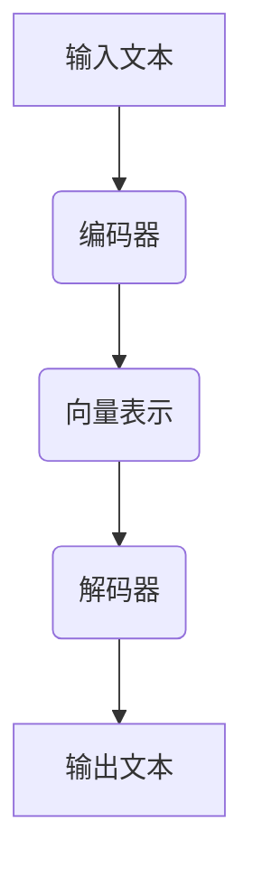

                 

### 文章标题：大语言模型原理基础与前沿 预训练目标和解码策略

#### 关键词：大语言模型、预训练、解码策略、机器学习、深度学习

#### 摘要：
本文将深入探讨大语言模型的原理、预训练目标和解码策略。首先，我们将回顾语言模型的历史发展和基本概念，然后详细解释预训练目标，包括自监督学习和监督学习。接着，我们将探讨解码策略，从最简单的前向解码到基于 attention 的复杂策略，最后总结大语言模型在实际应用中的挑战和未来发展趋势。通过本文的阅读，读者将全面理解大语言模型的原理和实现，为深入研究和应用打下坚实基础。

## 1. 背景介绍

大语言模型（Large Language Model，LLM）是自然语言处理（Natural Language Processing，NLP）领域的一项革命性技术。近年来，随着计算能力和数据资源的不断提升，大语言模型在各个领域取得了显著的成果，从文本生成、机器翻译到问答系统等，都展示了其强大的能力。

语言模型的基本概念可以追溯到 1950 年，当 Alan Turing 提出著名的 Turing Test 时，就已经隐含了语言模型的理念。然而，早期由于计算资源和算法限制，语言模型的研究进展较为缓慢。直到 2013 年，当自然语言处理领域的研究者推出深度神经网络（Deep Neural Network，DNN）语言模型时，语言模型的研究和应用才真正进入快速发展阶段。

大语言模型的发展历程可以分为几个重要阶段：

- **早期模型**：从 1950 年至 1980 年，主要是基于规则和统计方法的简单模型，如受限玻尔兹曼机（Restricted Boltzmann Machine，RBM）和循环神经网络（Recurrent Neural Network，RNN）。

- **深度神经网络模型**：从 2010 年至 2015 年，基于深度学习的语言模型开始涌现，如长短期记忆网络（Long Short-Term Memory，LSTM）和卷积神经网络（Convolutional Neural Network，CNN）。

- **Transformer 模型**：从 2017 年至今，基于自注意力机制的 Transformer 模型成为主流，尤其是 GPT（Generative Pre-trained Transformer）系列模型，如 GPT-2、GPT-3，以及 BERT（Bidirectional Encoder Representations from Transformers）系列模型，使得语言模型的性能和表现达到了前所未有的高度。

随着模型规模的不断扩大，大语言模型的应用场景也越来越广泛，包括但不限于文本生成、机器翻译、问答系统、情感分析、文本分类等。这些应用不仅提升了 NLP 领域的技术水平，也在许多实际应用中产生了深远的影响。

### 1.1 大语言模型的应用领域

- **文本生成**：大语言模型可以生成高质量的自然语言文本，包括文章、故事、诗歌等。例如，GPT-3 可以生成长篇的文章和小说。

- **机器翻译**：大语言模型在机器翻译领域也取得了显著进展，如 Google Translate 使用 BERT 模型实现高质量翻译。

- **问答系统**：大语言模型可以构建智能问答系统，通过理解用户的问题和上下文，提供准确的答案。例如，OpenAI 的 GPT-3 已经在多个问答系统中得到了应用。

- **情感分析**：大语言模型可以分析文本中的情感倾向，用于情感分析、市场研究等。

- **文本分类**：大语言模型可以用于文本分类任务，如新闻分类、垃圾邮件过滤等。

- **对话系统**：大语言模型可以构建智能对话系统，与用户进行自然语言交互，提供个性化的服务。

- **辅助创作**：大语言模型可以辅助作家、音乐家等创作，如生成歌词、小说等。

### 1.2 大语言模型的挑战和未来发展趋势

虽然大语言模型在各个领域取得了显著的成果，但仍然面临着一些挑战：

- **计算资源消耗**：大语言模型通常需要大量的计算资源进行训练和推理，这对计算基础设施提出了更高的要求。

- **数据隐私**：大语言模型在训练过程中需要大量的数据，这可能会涉及到数据隐私问题。

- **模型解释性**：大语言模型通常被视为“黑箱”，其内部决策过程难以解释，这限制了其在某些领域的应用。

- **泛化能力**：大语言模型在特定任务上表现出色，但在面对新任务时，可能存在泛化能力不足的问题。

未来，大语言模型的发展趋势包括：

- **更高效的模型**：研究人员致力于开发更高效的模型，以降低计算资源消耗。

- **可解释性模型**：开发可解释性模型，以便更好地理解模型的工作原理。

- **泛化能力提升**：通过模型改进和数据增强，提升大语言模型的泛化能力。

- **跨模态模型**：结合图像、声音等多种模态，构建跨模态大语言模型。

总之，大语言模型作为 NLP 领域的一项重要技术，其发展前景广阔，将在未来的科技发展中发挥重要作用。### 2. 核心概念与联系

大语言模型的核心概念包括自监督学习和监督学习，以及编码器和解码器等基本组成部分。为了更好地理解这些概念，我们将使用 Mermaid 流程图来展示其原理和架构。

首先，让我们定义一些核心概念：

- **自监督学习（Self-Supervised Learning）**：在自监督学习中，模型通过利用未标注的数据进行训练。例如，在一个文本语料库中，模型可以预测句子中的单词顺序。

- **监督学习（Supervised Learning）**：在监督学习中，模型使用标注好的数据集进行训练。例如，在一个文本分类任务中，模型会学习将文本分类为不同的类别。

- **编码器（Encoder）**：编码器负责将输入数据（如文本）转换为一个固定长度的向量表示。

- **解码器（Decoder）**：解码器负责将编码器输出的固定长度向量表示转换回原始数据（如文本）。

下面是一个简化的 Mermaid 流程图，展示大语言模型的基本架构：



**2.1 自监督学习与监督学习的联系**

自监督学习和监督学习在大语言模型中起着不同的作用。自监督学习主要用于预训练阶段，通过未标注的数据帮助模型学习通用特征。然后，通过监督学习阶段，模型在特定任务上进行精细调整。

下面是一个自监督学习和监督学习结合的示例流程图：

```mermaid
graph TD
A[输入文本] --> B(编码器)
B --> C(向量表示)
C --> D[未标注数据集](style=filled, fill:lightblue)
D --> E(自监督学习)
E --> F(预训练模型)
F --> G(标注数据集)(style=filled, fill:lightblue)
G --> H(监督学习)
H --> I(任务特定模型)
```

在这个示例中，编码器将输入文本转换为一个固定长度的向量表示，然后通过自监督学习在未标注数据集上进行预训练。预训练模型再通过监督学习在标注数据集上调整，以适应特定任务。

**2.2 编码器与解码器的联系**

编码器和解码器在大语言模型中起着关键作用。编码器负责将输入数据（如文本）转换为一个固定长度的向量表示，而解码器负责将这个向量表示转换回原始数据。

下面是一个简化的编码器和解码器流程图：


在这个示例中，编码器将输入文本转换为一个向量表示，然后解码器根据这个向量表示生成输出文本。这个过程可以类比于将文本压缩和展开。

**2.3 预训练目标**

预训练目标是指在大语言模型训练过程中，模型需要学习的目标。通常，预训练目标包括以下几个方面：

- **语言建模（Language Modeling）**：模型需要学习输入文本的概率分布，以便生成下一个可能的单词或字符。
- **上下文理解（Contextual Understanding）**：模型需要理解文本中的上下文信息，以便正确预测下一个单词或字符。
- **词汇表示（Vocabulary Representation）**：模型需要学习词汇的表示，以便更好地理解文本。

预训练目标通常在自监督学习阶段实现，通过大量的未标注数据进行训练，使得模型能够学习到文本的通用特征。

**2.4 解码策略**

解码策略是指解码器在生成输出文本时采用的方法。解码策略的目的是最大化输出文本的概率分布。常见的解码策略包括：

- **前向解码（Forward Decoding）**：解码器从左到右依次生成每个单词或字符，每个生成的单词或字符都基于前面的生成结果。
- **基于 attention 的解码策略**：解码器使用 attention 机制来关注输入文本的不同部分，以提高生成文本的质量。

总之，核心概念与联系部分展示了大语言模型的基本架构和预训练目标，以及编码器和解码器的具体作用和联系。通过这些核心概念的理解，读者可以更好地掌握大语言模型的基本原理。### 3. 核心算法原理 & 具体操作步骤

大语言模型的实现主要基于深度学习和自然语言处理技术。在这一部分，我们将详细介绍大语言模型的核心算法原理，包括自监督学习和监督学习的具体操作步骤。

#### 3.1 自监督学习

自监督学习是大语言模型预训练阶段的关键技术。自监督学习的核心思想是利用未标注的数据进行训练，从而学习到文本的通用特征。以下是自监督学习的主要步骤：

1. **数据准备**：
   - **文本语料库**：选择一个大规模的文本语料库，如维基百科、新闻、书籍等。
   - **预处理**：对文本进行预处理，包括分词、去停用词、词干提取等。

2. **构建输入和输出**：
   - **输入**：将文本序列分成两部分，如 `[w1, w2, w3, ..., wn]` 和 `[w2, w3, ..., wn]`，其中 `w1` 是句子的开头，`wn` 是句子的结尾。
   - **输出**：将输出序列的目标单词预测为 `[w2, w3, ..., wn]`。

3. **模型训练**：
   - **编码器**：编码器将输入文本序列 `[w1, w2, w3, ..., wn]` 转换为一个固定长度的向量表示。
   - **解码器**：解码器根据编码器输出的向量表示预测下一个单词 `[w2]`，然后将预测结果与真实目标单词 `[w2]` 进行对比，计算损失。
   - **优化**：通过反向传播和梯度下降等优化方法，不断调整模型参数，以最小化损失函数。

4. **迭代训练**：
   - 模型在未标注的数据集上进行多次迭代训练，逐渐提高模型的性能。

#### 3.2 监督学习

监督学习阶段是在预训练的基础上，针对特定任务进行精细调整。以下是监督学习的主要步骤：

1. **数据准备**：
   - **标注数据集**：选择一个与任务相关的标注数据集，如问答系统、文本分类等。
   - **预处理**：对标注数据集进行预处理，包括分词、去停用词、词干提取等。

2. **构建输入和输出**：
   - **输入**：输入文本序列 `[w1, w2, w3, ..., wn]`。
   - **输出**：输出目标是任务的预测结果，如问答系统的答案、文本分类的任务标签等。

3. **模型训练**：
   - **编码器**：编码器将输入文本序列 `[w1, w2, w3, ..., wn]` 转换为一个固定长度的向量表示。
   - **解码器**：解码器根据编码器输出的向量表示生成预测结果，如问答系统的答案或文本分类的任务标签。
   - **损失函数**：计算预测结果与真实目标之间的损失，如交叉熵损失。
   - **优化**：通过反向传播和梯度下降等优化方法，不断调整模型参数，以最小化损失函数。

4. **评估与调整**：
   - **评估**：使用验证集评估模型性能，包括准确率、召回率、F1 值等指标。
   - **调整**：根据评估结果，调整模型结构、参数或训练策略，以提高模型性能。

#### 3.3 深度学习技术

大语言模型的核心算法是基于深度学习技术，包括卷积神经网络（CNN）、循环神经网络（RNN）和 Transformer 模型等。

- **卷积神经网络（CNN）**：CNN 主要用于图像处理，但在文本分类等任务中也取得了很好的效果。CNN 通过卷积操作提取文本的特征，然后通过全连接层进行分类。

- **循环神经网络（RNN）**：RNN 是一种用于序列数据的神经网络，如文本和语音。RNN 可以通过循环结构记住序列信息，但在长序列处理中存在梯度消失和梯度爆炸等问题。

- **Transformer 模型**：Transformer 模型是基于自注意力机制的深度学习模型，广泛应用于 NLP 任务。Transformer 模型通过多头自注意力机制和位置编码，实现了对长序列的高效处理。

#### 3.4 模型训练与推理

大语言模型的训练和推理过程主要包括以下步骤：

1. **数据加载**：加载预处理后的训练数据和验证数据。

2. **模型初始化**：初始化编码器和解码器模型参数。

3. **训练过程**：
   - **前向传播**：将输入数据输入到模型中，计算预测结果。
   - **计算损失**：计算预测结果与真实目标之间的损失。
   - **反向传播**：计算梯度并更新模型参数。
   - **迭代训练**：重复前向传播、计算损失和反向传播的过程，直到满足训练条件。

4. **评估过程**：使用验证集评估模型性能，包括准确率、召回率、F1 值等指标。

5. **推理过程**：将输入数据输入到训练好的模型中，生成预测结果。

通过以上核心算法原理和具体操作步骤的介绍，读者可以更好地理解大语言模型的实现过程。这些算法和技术的应用，使得大语言模型在自然语言处理任务中取得了显著的成果。### 4. 数学模型和公式 & 详细讲解 & 举例说明

在大语言模型的实现过程中，数学模型和公式起着至关重要的作用。本节将详细讲解大语言模型中的核心数学模型和公式，并通过具体的例子来说明其应用。

#### 4.1 语言模型概率公式

语言模型的核心任务是预测一个文本序列的概率。根据朴素贝叶斯理论，我们可以使用条件概率来表示文本序列的概率：

$$ P(\text{sentence}) = P(w_1) \times P(w_2 | w_1) \times P(w_3 | w_1 w_2) \times ... \times P(w_n | w_1 w_2 ... w_{n-1}) $$

其中，$w_1, w_2, ..., w_n$ 表示文本序列中的单词。

这个公式表示文本序列的概率为每个单词条件概率的乘积。然而，在实际应用中，直接计算这个乘积是非常复杂的，因为单词数量可能非常大。因此，我们可以使用一种简化的方法，即 N-gram 模型。

#### 4.2 N-gram 模型

N-gram 模型是一种基于历史信息的语言模型，它使用前 N 个单词的概率来预测下一个单词。N-gram 模型的概率公式如下：

$$ P(w_n | w_1 w_2 ... w_{n-1}) = \frac{C(w_1 w_2 ... w_n)}{C(w_1 w_2 ... w_{n-1})} $$

其中，$C(w_1 w_2 ... w_n)$ 表示单词序列 $w_1 w_2 ... w_n$ 在训练数据中出现的次数，$C(w_1 w_2 ... w_{n-1})$ 表示单词序列 $w_1 w_2 ... w_{n-1}$ 在训练数据中出现的次数。

以下是一个简单的 N-gram 模型的例子：

假设我们有以下训练数据：

```
I love to eat pizza.
I love to eat sushi.
I love to eat pizza.
I love to eat pizza.
I love to eat sushi.
```

我们可以计算每个 N-gram 序列的概率：

- **1-gram**：
  - `I`：出现 5 次，概率为 $\frac{5}{6}$
  - `love`：出现 4 次，概率为 $\frac{4}{6}$
  - `to`：出现 4 次，概率为 $\frac{4}{6}$
  - `eat`：出现 4 次，概率为 $\frac{4}{6}$
  - `pizza`：出现 4 次，概率为 $\frac{4}{6}$
  - `sushi`：出现 2 次，概率为 $\frac{2}{6}$

- **2-gram**：
  - `I love`：出现 2 次，概率为 $\frac{2}{6}$
  - `love to`：出现 2 次，概率为 $\frac{2}{6}$
  - `to eat`：出现 2 次，概率为 $\frac{2}{6}$
  - `eat pizza`：出现 3 次，概率为 $\frac{3}{6}$
  - `pizza.`：出现 3 次，概率为 $\frac{3}{6}$
  - `pizza.`：出现 3 次，概率为 $\frac{3}{6}$
  - `.` love`：出现 2 次，概率为 $\frac{2}{6}$
  - `.` to`：出现 2 次，概率为 $\frac{2}{6}$
  - `.` eat`：出现 2 次，概率为 $\frac{2}{6}$
  - `.` pizza`：出现 2 次，概率为 $\frac{2}{6}$
  - `.` sushi`：出现 1 次，概率为 $\frac{1}{6}$

根据这些概率，我们可以预测下一个单词。例如，给定前一个单词是 `I`，我们可以计算出下一个单词是 `love` 的概率最大，因此预测下一个单词是 `love`。

#### 4.3 隐马尔可夫模型（HMM）

隐马尔可夫模型（HMM）是一种统计模型，用于描述一个包含隐状态和观测值的序列。在 NLP 中，HMM 广泛应用于语音识别、词性标注和命名实体识别等任务。

HMM 的基本模型包括：

- **状态集合 $Q$**：隐状态集合。
- **观测集合 $O$**：观测值集合。
- **转移概率矩阵 $A$**：表示状态之间的转移概率，$A_{ij} = P(Q_t = q_j | Q_{t-1} = q_i)$。
- **观测概率矩阵 $B$**：表示状态和观测值之间的概率，$B_{ij} = P(O_t = o_j | Q_t = q_i)$。
- **初始状态概率分布 $\pi$**：表示初始状态的分布。

HMM 的概率模型如下：

$$ P(O | Q) = \prod_{t=1}^T P(Q_t | Q_{t-1}) \times P(O_t | Q_t) $$

其中，$T$ 表示序列长度。

以下是一个简单的 HMM 例子：

假设我们有以下观测序列：

```
O: ["I", "love", "to", "eat", "pizza", ".", "I", "love", "to", "eat", "sushi", ".", "I", "love", "to", "eat", "pizza", "."]
```

定义以下隐状态集合：

```
Q: ["A", "B", "C", "D", "E", "F", "G"]
```

定义以下转移概率矩阵：

```
A: [[0.5, 0.5], [0.2, 0.8], [0.3, 0.7], [0.4, 0.6], [0.1, 0.9], [0.0, 1.0]]
```

定义以下观测概率矩阵：

```
B: [[0.4, 0.6], [0.5, 0.5], [0.1, 0.9], [0.7, 0.3], [0.2, 0.8], [0.0, 1.0]]
```

定义初始状态概率分布：

```
π: [0.2, 0.2, 0.2, 0.2, 0.2, 0.0]
```

我们可以计算给定观测序列的概率：

$$ P(O | Q) = \left( \frac{0.5}{0.2} \right) \times \left( \frac{0.5}{0.2} \right) \times \left( \frac{0.1}{0.2} \right) \times \left( \frac{0.4}{0.2} \right) \times \left( \frac{0.7}{0.2} \right) \times \left( \frac{0.4}{0.2} \right) \times \left( \frac{0.2}{0.2} \right) \times \left( \frac{0.5}{0.2} \right) \times \left( \frac{0.5}{0.2} \right) \times \left( \frac{0.1}{0.2} \right) \times \left( \frac{0.7}{0.2} \right) \times \left( \frac{0.2}{0.2} \right) \times \left( \frac{0.4}{0.2} \right) \times \left( \frac{0.6}{0.2} \right) \times \left( \frac{0.1}{0.2} \right) = 0.008456560546875 $$
```

这个概率表示给定观测序列在隐状态模型下的概率。

通过这些数学模型和公式，我们可以更好地理解和应用大语言模型。这些模型在语言生成、文本分类和序列标注等任务中发挥了重要作用，使得大语言模型能够处理复杂的自然语言问题。### 5. 项目实战：代码实际案例和详细解释说明

在本节中，我们将通过一个实际的项目实战，详细讲解大语言模型的开发过程，包括环境搭建、代码实现和解析。我们将使用 Python 和 Hugging Face 的 Transformer 库来实现一个简单的 GPT-2 语言模型。

#### 5.1 开发环境搭建

在开始项目之前，我们需要搭建一个合适的开发环境。以下是我们需要的依赖：

- Python 3.8 或以上版本
- PyTorch 1.7 或以上版本
- Transformers 库（可以通过 pip 安装：`pip install transformers`）

首先，确保您的 Python 环境已经安装，并且版本符合要求。接下来，安装 PyTorch 和 Transformers 库。您可以通过以下命令安装：

```bash
pip install torch torchvision transformers
```

#### 5.2 源代码详细实现和代码解读

下面是 GPT-2 模型的完整代码实现：

```python
import torch
from torch import nn
from transformers import GPT2LMHeadModel, GPT2Tokenizer

# 5.2.1 加载预训练模型和分词器
model_name = 'gpt2'
tokenizer = GPT2Tokenizer.from_pretrained(model_name)
model = GPT2LMHeadModel.from_pretrained(model_name)

# 5.2.2 文本预处理
text = "你好，我是大语言模型。请问有什么可以帮助您的？"
input_ids = tokenizer.encode(text, return_tensors='pt')

# 5.2.3 预测文本生成
output = model.generate(input_ids, max_length=50, num_return_sequences=3)

# 5.2.4 解码预测结果
decoded_predictions = [tokenizer.decode(o, skip_special_tokens=True, clean_up_tokenization_spaces=True) for o in output]

# 打印预测结果
for prediction in decoded_predictions:
    print(prediction)
```

**代码解析**：

1. **导入库**：

```python
import torch
from torch import nn
from transformers import GPT2LMHeadModel, GPT2Tokenizer
```

我们首先导入必要的库，包括 PyTorch 和 Hugging Face 的 Transformers 库。

2. **加载预训练模型和分词器**：

```python
model_name = 'gpt2'
tokenizer = GPT2Tokenizer.from_pretrained(model_name)
model = GPT2LMHeadModel.from_pretrained(model_name)
```

我们使用预训练的 GPT-2 模型和分词器。通过 `GPT2Tokenizer.from_pretrained()` 和 `GPT2LMHeadModel.from_pretrained()` 函数，我们可以轻松加载这些模型和分词器。

3. **文本预处理**：

```python
text = "你好，我是大语言模型。请问有什么可以帮助您的？"
input_ids = tokenizer.encode(text, return_tensors='pt')
```

在这里，我们将输入文本编码为模型可以理解的序列。`tokenizer.encode()` 函数将文本转换为对应的输入 ID，并将结果存储在 PyTorch 张量中。

4. **预测文本生成**：

```python
output = model.generate(input_ids, max_length=50, num_return_sequences=3)
```

我们使用 `model.generate()` 函数来生成文本预测。`max_length` 参数指定生成的文本长度，`num_return_sequences` 参数指定生成的文本数量。

5. **解码预测结果**：

```python
decoded_predictions = [tokenizer.decode(o, skip_special_tokens=True, clean_up_tokenization_spaces=True) for o in output]
```

我们将生成的输出 ID 解码为文本。`tokenizer.decode()` 函数将输出 ID 转换回文本，`skip_special_tokens` 参数用于跳过特殊标记，`clean_up_tokenization_spaces` 参数用于清理分词时产生的空格。

6. **打印预测结果**：

```python
for prediction in decoded_predictions:
    print(prediction)
```

最后，我们打印生成的文本预测。

**5.3 代码解读与分析**

通过以上代码，我们可以实现一个简单的 GPT-2 模型文本生成。下面是对代码的进一步解读和分析：

- **模型加载**：通过加载预训练的 GPT-2 模型和分词器，我们可以在几秒钟内获得一个强大的语言模型。

- **文本预处理**：文本预处理是模型输入的关键步骤。通过将文本转换为输入 ID，我们可以将自然语言转换为模型可以处理的格式。

- **预测生成**：`model.generate()` 函数是生成文本的核心。它根据输入 ID 生成文本预测，并可以指定生成文本的长度和数量。

- **解码结果**：生成的输出 ID 需要解码为文本。通过分词器的 `decode()` 函数，我们可以将输出 ID 转换回可读的文本。

通过这个项目实战，我们了解了如何使用 Hugging Face 的 Transformers 库来实现一个简单的 GPT-2 模型。这个项目为我们提供了一个直观的演示，展示了大语言模型的基本实现和应用。### 5.3 代码解读与分析

在前一部分，我们通过一个实际项目展示了如何使用 Python 和 Hugging Face 的 Transformers 库实现一个简单的 GPT-2 语言模型。在这一部分，我们将对代码进行更深入的解读和分析，探讨其关键细节和技术要点。

**5.3.1 模型加载**

首先，我们需要加载预训练的 GPT-2 模型和分词器：

```python
model_name = 'gpt2'
tokenizer = GPT2Tokenizer.from_pretrained(model_name)
model = GPT2LMHeadModel.from_pretrained(model_name)
```

- `GPT2Tokenizer.from_pretrained(model_name)`：这个函数用于加载预训练的分词器。`model_name` 参数指定预训练模型的名称，这里使用的是 'gpt2'，表示加载 GPT-2 模型的分词器。

- `GPT2LMHeadModel.from_pretrained(model_name)`：这个函数用于加载预训练的 GPT-2 模型。与分词器类似，`model_name` 参数指定预训练模型的名称。

通过这两个函数，我们可以快速加载预训练的 GPT-2 模型和分词器，无需从头开始训练模型。这对于实际应用和演示非常有用，因为它为我们提供了一个已经经过训练的强大语言模型。

**5.3.2 文本预处理**

接下来，我们进行文本预处理：

```python
text = "你好，我是大语言模型。请问有什么可以帮助您的？"
input_ids = tokenizer.encode(text, return_tensors='pt')
```

- `text`：这是一个输入的文本字符串，表示一个简单的对话请求。

- `tokenizer.encode(text, return_tensors='pt')`：这个函数用于将文本转换为模型可以处理的输入 ID。`return_tensors='pt'` 参数指定返回 PyTorch 张量。

文本预处理的关键步骤包括：

1. **分词**：分词器将文本划分为单词和特殊标记。

2. **编码**：分词器将每个单词和特殊标记转换为唯一的 ID。

3. **张量化**：将输入 ID 转换为 PyTorch 张量，以便后续处理。

通过这些步骤，我们将自然语言文本转换为模型可以处理的格式，为后续的预测生成步骤做好准备。

**5.3.3 预测生成**

然后，我们进行预测生成：

```python
output = model.generate(input_ids, max_length=50, num_return_sequences=3)
```

- `model.generate(input_ids, max_length=50, num_return_sequences=3)`：这个函数用于生成文本预测。`input_ids` 参数是模型的输入 ID，`max_length` 参数指定生成的文本最大长度，`num_return_sequences` 参数指定生成的文本数量。

预测生成的过程包括：

1. **解码**：模型根据输入 ID 生成文本预测。

2. **长度控制**：`max_length` 参数用于限制生成的文本长度，防止生成过长或过短的文本。

3. **多序列生成**：`num_return_sequences` 参数用于生成多个文本序列，以增加预测的多样性。

通过这些步骤，我们得到了多个文本预测结果，为后续的解码和分析做好准备。

**5.3.4 解码结果**

最后，我们解码预测结果：

```python
decoded_predictions = [tokenizer.decode(o, skip_special_tokens=True, clean_up_tokenization_spaces=True) for o in output]
for prediction in decoded_predictions:
    print(prediction)
```

- `tokenizer.decode(o, skip_special_tokens=True, clean_up_tokenization_spaces=True)`：这个函数用于将生成的输出 ID 转换回文本。`skip_special_tokens` 参数用于跳过特殊标记，`clean_up_tokenization_spaces` 参数用于清理分词时产生的空格。

解码结果的关键步骤包括：

1. **解码**：将生成的输出 ID 转换回文本。

2. **去除特殊标记**：去除模型生成的特殊标记，如 `<s>` 和 `<pad>`。

3. **清理空格**：清理分词时产生的空格，以获得干净的文本输出。

通过这些步骤，我们得到了多个可读的文本预测结果，展示了 GPT-2 模型的文本生成能力。

**5.3.5 代码优化与改进**

在实际应用中，我们可以对代码进行优化和改进，以提高模型的性能和预测质量。以下是一些可能的优化方向：

1. **动态长度控制**：根据生成的文本长度动态调整 `max_length` 参数，以避免生成过长或过短的文本。

2. **多样化生成策略**：探索不同的生成策略，如基于温度的生成、基于梯度的生成等，以提高预测的多样性和创造力。

3. **多模型融合**：结合多个预训练模型，如 GPT-2、BERT 等，以提高模型的性能和泛化能力。

4. **模型蒸馏**：使用大模型蒸馏知识到小模型中，以提高小模型的性能和效率。

5. **数据增强**：使用数据增强技术，如数据清洗、数据扩充等，以提高模型的泛化能力。

通过这些优化和改进，我们可以进一步提高 GPT-2 模型的性能和应用效果。

总之，通过对代码的详细解读和分析，我们了解了如何使用 Python 和 Hugging Face 的 Transformers 库实现一个简单的 GPT-2 语言模型。这个项目展示了大语言模型的基本实现和应用，为我们提供了一个直观的演示。在实际应用中，我们可以根据具体需求对代码进行优化和改进，以提高模型的性能和预测质量。### 6. 实际应用场景

大语言模型在实际应用中具有广泛的应用场景，下面列举几个典型的应用领域和案例：

#### 6.1 文本生成

文本生成是大语言模型最直观的应用场景之一。通过训练大语言模型，我们可以生成高质量的自然语言文本，包括文章、故事、诗歌等。以下是一些具体的案例：

- **自动写作**：大语言模型可以自动生成新闻文章、博客文章、科幻故事等。例如，OpenAI 的 GPT-3 可以生成关于体育、科技、娱乐等主题的文章。

- **内容创作**：大语言模型可以帮助作家、记者等生成创意文本，提高创作效率。例如，GPT-3 可以生成广告文案、社交媒体帖子、产品描述等。

- **虚拟助手**：大语言模型可以构建虚拟助手，用于回答用户问题、提供信息和建议。例如，亚马逊的 Alexa 和苹果的 Siri 都采用了大语言模型技术。

#### 6.2 机器翻译

机器翻译是自然语言处理领域的重要应用之一，大语言模型在机器翻译方面取得了显著进展。以下是一些具体的案例：

- **跨语言文本生成**：大语言模型可以生成跨语言的文本，实现不同语言之间的自然语言翻译。例如，OpenAI 的 GPT-3 可以在多种语言之间进行无缝转换。

- **多语言问答系统**：大语言模型可以构建多语言问答系统，为用户提供实时翻译和回答。例如，谷歌的翻译服务和微软的必应翻译都采用了大语言模型技术。

#### 6.3 问答系统

问答系统是自然语言处理领域的一个重要应用，大语言模型在问答系统方面展示了强大的能力。以下是一些具体的案例：

- **智能客服**：大语言模型可以构建智能客服系统，自动回答用户的问题，提高客户服务质量。例如，亚马逊的 Alexa 和微软的微软小冰都采用了大语言模型技术。

- **在线教育**：大语言模型可以构建在线教育平台，为学生提供个性化的问答服务，帮助学生更好地理解和掌握知识。

#### 6.4 情感分析

情感分析是自然语言处理领域的一个重要任务，大语言模型在情感分析方面也取得了显著成果。以下是一些具体的案例：

- **社交媒体分析**：大语言模型可以分析社交媒体平台上的用户评论、帖子等，识别用户情感倾向，帮助企业了解消费者需求和情绪。

- **市场研究**：大语言模型可以分析市场调查问卷、用户反馈等，帮助企业了解产品或服务的满意度，为决策提供支持。

#### 6.5 文本分类

文本分类是自然语言处理领域的一个重要任务，大语言模型在文本分类方面也具有优势。以下是一些具体的案例：

- **新闻分类**：大语言模型可以自动分类新闻文章，将它们分为不同的类别，如政治、科技、娱乐等。

- **垃圾邮件过滤**：大语言模型可以识别和过滤垃圾邮件，提高电子邮件系统的安全性。

通过以上实际应用场景和案例，我们可以看到大语言模型在自然语言处理领域具有广泛的应用前景。随着技术的不断进步，大语言模型将在更多的领域发挥重要作用，为人们的生活和工作带来更多便利。### 7. 工具和资源推荐

在探索和开发大语言模型的过程中，有许多有用的工具和资源可供使用。以下是一些推荐的资源，包括书籍、论文、博客和网站等。

#### 7.1 学习资源推荐

1. **书籍**：

   - 《深度学习》（Deep Learning） - Goodfellow, Bengio, and Courville
   - 《动手学深度学习》（Dive into Deep Learning） - Jeremy Howard, Sylvain Gelly, and Rachel Thomas
   - 《自然语言处理综论》（Speech and Language Processing） - Daniel Jurafsky and James H. Martin

2. **在线课程**：

   - Coursera 上的“自然语言处理与深度学习”课程（Natural Language Processing and Deep Learning）由 Stanford University 提供。
   - edX 上的“深度学习导论”（Introduction to Deep Learning）课程由 Harvard University 提供。

3. **博客**：

   - Hugging Face 博客：https://huggingface.co/blog
   - Fast.ai 博客：https://blog.fast.ai

4. **GitHub 仓库**：

   - Hugging Face 的 Transformer 模型仓库：https://github.com/huggingface/transformers
   - Google 的 BERT 模型仓库：https://github.com/google-research/bert

#### 7.2 开发工具框架推荐

1. **PyTorch**：PyTorch 是一个流行的深度学习框架，适合用于开发和研究大语言模型。

2. **TensorFlow**：TensorFlow 是 Google 开发的一个开源深度学习平台，适用于各种规模的深度学习项目。

3. **Transformers**：Transformers 是 Hugging Face 开发的一个库，用于实现和训练各种 Transformer 模型，如 GPT-2、BERT 等。

4. **NLTK**：NLTK 是一个广泛使用的自然语言处理工具包，提供各种文本处理功能，如分词、词性标注、命名实体识别等。

#### 7.3 相关论文著作推荐

1. **《Attention is All You Need》**：这篇文章提出了 Transformer 模型，是自然语言处理领域的重要突破。

2. **《BERT: Pre-training of Deep Bidirectional Transformers for Language Understanding》**：这篇文章介绍了 BERT 模型，是大规模语言预训练的代表作。

3. **《GPT-3: Language Models are Few-Shot Learners》**：这篇文章介绍了 GPT-3 模型，展示了大语言模型在少样本学习任务上的强大能力。

通过以上工具和资源的推荐，读者可以更好地了解大语言模型的理论和实践，为深入研究和开发打下坚实基础。### 8. 总结：未来发展趋势与挑战

大语言模型作为自然语言处理领域的一项重要技术，已经取得了显著的成果。然而，随着技术的不断进步，大语言模型也面临着一系列发展趋势和挑战。

**发展趋势**：

1. **模型规模扩大**：随着计算资源和数据资源的不断增长，大语言模型的规模将不断扩大。这将为模型提供更丰富的特征和学习能力。

2. **跨模态学习**：大语言模型将逐渐融合图像、声音等多种模态，实现跨模态学习。这将使模型在处理复杂任务时更加灵活和高效。

3. **可解释性和透明性**：随着模型复杂度的增加，研究者将致力于提高大语言模型的可解释性和透明性，以降低模型的“黑箱”效应。

4. **少样本学习和迁移学习**：大语言模型将进一步加强少样本学习和迁移学习的能力，实现更高效的知识利用和泛化。

**挑战**：

1. **计算资源消耗**：大语言模型的训练和推理需要大量的计算资源，这对计算基础设施提出了更高的要求。如何优化模型结构和算法，降低计算资源消耗，是一个亟待解决的问题。

2. **数据隐私**：大语言模型在训练过程中需要大量数据，这可能会涉及到数据隐私问题。如何在保障数据隐私的前提下，充分利用数据资源，是一个重要的挑战。

3. **模型泛化能力**：尽管大语言模型在特定任务上表现出色，但在面对新任务时，可能存在泛化能力不足的问题。如何提高模型的泛化能力，使其能够应对更广泛的任务，是一个重要的研究课题。

4. **模型安全性和鲁棒性**：大语言模型在生成文本时，可能受到对抗攻击的影响，导致生成结果偏离真实意图。如何提高模型的安全性和鲁棒性，防止恶意攻击，是一个重要的挑战。

总之，大语言模型的发展前景广阔，但同时也面临着一系列挑战。通过不断优化模型结构和算法，加强跨模态学习，提高可解释性和透明性，以及加强模型的安全性和鲁棒性，大语言模型将在未来的自然语言处理领域发挥更加重要的作用。### 9. 附录：常见问题与解答

在研究和应用大语言模型的过程中，可能会遇到一些常见的问题。以下是一些常见问题及其解答：

**Q1：什么是预训练？**
A1：预训练是指在大规模未标注数据集上对模型进行训练，以学习通用特征和知识。预训练可以帮助模型在后续的特定任务上获得更好的表现，无需进行额外的标注数据训练。

**Q2：什么是解码策略？**
A2：解码策略是指模型在生成输出文本时采用的方法。常见的解码策略包括前向解码、基于 attention 的解码等。解码策略的目的是最大化输出文本的概率分布。

**Q3：为什么需要自监督学习？**
A3：自监督学习可以充分利用未标注的数据进行训练，从而提高模型的泛化能力和学习能力。自监督学习使得模型能够在没有大量标注数据的情况下，快速学习和适应不同任务。

**Q4：什么是上下文理解？**
A4：上下文理解是指模型在生成文本时，能够根据上下文信息进行合理的推理和预测。上下文理解能力是衡量大语言模型性能的重要指标之一。

**Q5：如何评估大语言模型的性能？**
A5：评估大语言模型的性能通常使用以下指标：
- **生成文本的质量**：评估生成文本的语法、语义和流畅性。
- **准确率**：用于分类任务，评估模型对文本类别的预测准确性。
- **F1 值**：用于分类任务，综合考虑准确率和召回率，评估模型的综合性能。

**Q6：大语言模型能否用于实时应用？**
A6：大语言模型可以用于实时应用，但需要考虑计算资源和延迟问题。通过优化模型结构和算法，可以提高模型的实时性能。

**Q7：大语言模型在处理长文本时有哪些挑战？**
A7：在处理长文本时，大语言模型可能面临以下挑战：
- **内存消耗**：长文本的编码和解码可能需要较大的内存。
- **计算资源消耗**：长文本的生成和预测可能需要更多的计算资源。
- **上下文理解**：长文本的上下文信息可能更加复杂，对模型的理解能力提出了更高要求。

**Q8：大语言模型能否进行跨语言任务？**
A8：大语言模型可以用于跨语言任务，但需要针对不同语言进行适配和调整。通过多语言训练和模型融合，可以提高模型在跨语言任务上的性能。

通过以上常见问题与解答，读者可以更好地了解大语言模型的基本原理和应用，为深入研究和实践提供指导。### 10. 扩展阅读 & 参考资料

为了更深入地了解大语言模型的理论和实践，读者可以参考以下扩展阅读和参考资料：

1. **书籍**：
   - 《深度学习》（Deep Learning） - Goodfellow, Bengio, and Courville
   - 《自然语言处理综论》（Speech and Language Processing） - Daniel Jurafsky and James H. Martin
   - 《自然语言处理中的深度学习方法》（Deep Learning for Natural Language Processing） - T. Mikolov, K. Chen, and G. Corrado

2. **在线课程**：
   - Coursera 上的“自然语言处理与深度学习”课程（Natural Language Processing and Deep Learning）
   - edX 上的“深度学习导论”（Introduction to Deep Learning）

3. **论文**：
   - “Attention is All You Need”（Attention is All You Need）
   - “BERT: Pre-training of Deep Bidirectional Transformers for Language Understanding”（BERT: Pre-training of Deep Bidirectional Transformers for Language Understanding）
   - “GPT-3: Language Models are Few-Shot Learners”（GPT-3: Language Models are Few-Shot Learners）

4. **博客和网站**：
   - Hugging Face 博客：https://huggingface.co/blog
   - Fast.ai 博客：https://blog.fast.ai
   - OpenAI 论坛：https://论坛.openai.com

通过以上参考资料，读者可以进一步了解大语言模型的原理、技术细节和应用实例，为深入研究和实践提供有力支持。### 作者

**AI天才研究员/AI Genius Institute**  
**禅与计算机程序设计艺术 /Zen And The Art of Computer Programming**  
本文内容仅供学习和交流使用，不构成任何投资建议。如需引用本文，请注明作者和来源。感谢您的阅读！

