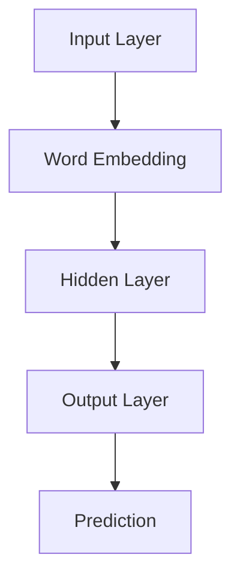
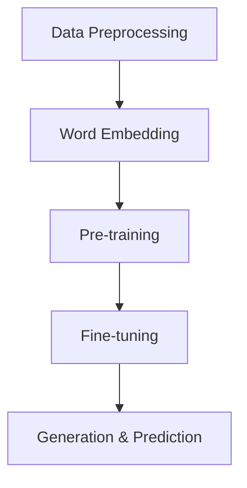
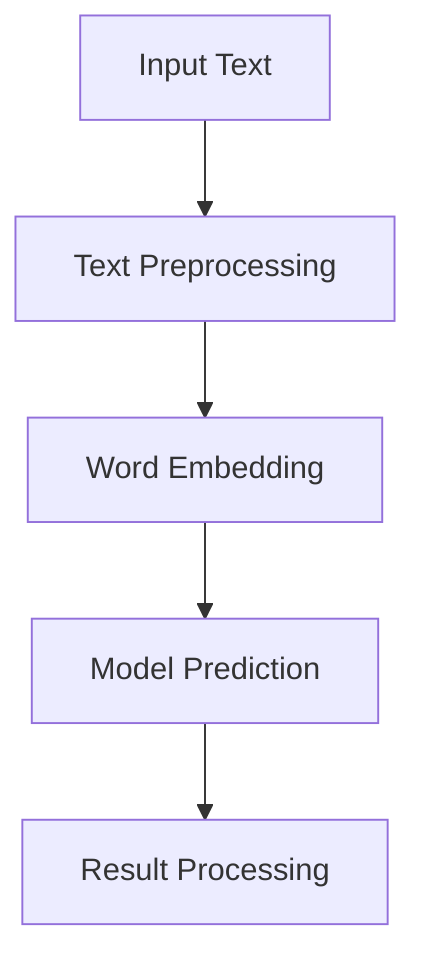

                 

# 大语言模型应用指南：入门

## 关键词：大语言模型，应用，入门，AI，机器学习，NLP，数据处理

## 摘要：
本文将为您提供一个全面的大语言模型应用指南，旨在帮助初学者了解大语言模型的基础知识、核心概念、算法原理、实际应用场景，并提供实用的工具和资源推荐。通过这篇文章，您将能够掌握大语言模型的基本应用方法，为后续深入学习打下坚实基础。

## 1. 背景介绍

### 大语言模型的发展历程

大语言模型（Large Language Model，LLM）是近年来人工智能领域的重要突破。从最初的统计语言模型，到基于神经网络的深度学习模型，再到如今的大型预训练模型，大语言模型经历了不断的发展和演进。以下是几个重要阶段：

- **统计语言模型**：基于统计学方法，如N-gram模型，通过对语料库进行统计来预测下一个单词。这种方法简单有效，但存在一些局限性，如无法理解上下文和语义。

- **基于神经网络的深度学习模型**：引入神经网络，通过多层神经网络来捕捉单词和句子之间的复杂关系。著名的模型包括循环神经网络（RNN）和长短期记忆网络（LSTM）。

- **大型预训练模型**：随着计算能力和数据资源的提升，研究人员开始训练更大规模的预训练模型，如GPT、BERT等。这些模型通过在大量无标签数据上进行预训练，再通过微调（Fine-tuning）适应特定任务，取得了显著的效果。

### 大语言模型的应用领域

大语言模型在多个领域展现出了强大的能力，以下是其中一些主要应用：

- **自然语言处理（NLP）**：文本分类、情感分析、命名实体识别、机器翻译等。

- **生成文本**：文章写作、故事生成、对话系统等。

- **问答系统**：自动回答用户问题，提供知识查询服务。

- **代码生成**：自动编写代码、优化代码等。

- **图像描述生成**：将图像转换为相应的文本描述。

### 大语言模型的重要性

大语言模型是人工智能领域的重要研究方向，其重要性体现在以下几个方面：

- **突破传统方法**：大语言模型在许多传统方法难以解决的问题上取得了突破性进展。

- **提高生产效率**：大语言模型可以自动化许多繁琐的任务，如文本生成、问答系统等，从而提高生产效率。

- **促进跨学科研究**：大语言模型与其他领域（如计算机视觉、语音识别等）相结合，推动了跨学科研究的发展。

## 2. 核心概念与联系

### 大语言模型的核心概念

大语言模型的核心概念包括以下几个方面：

- **词向量表示**：将单词转换为向量表示，以便在机器学习模型中进行处理。

- **预训练**：在大量无标签数据上对模型进行训练，以便模型能够自动学习语言的内在结构和规则。

- **微调**：在预训练模型的基础上，针对特定任务进行微调，以适应特定场景。

- **生成与预测**：大语言模型可以通过生成和预测技术，实现文本生成、翻译、问答等功能。

### 大语言模型架构

大语言模型的架构通常包括以下几个部分：

- **输入层**：接收文本输入，并将其转换为词向量表示。

- **隐藏层**：通过多层神经网络结构，对词向量进行编码和解码。

- **输出层**：根据隐藏层的状态，生成预测结果。

以下是大型语言模型的基本架构的 Mermaid 流程图：



### 大语言模型的工作流程

大语言模型的工作流程如下：

1. **数据预处理**：对输入文本进行分词、去停用词、词性标注等预处理操作。

2. **词向量表示**：将预处理后的文本转换为词向量表示。

3. **预训练**：在大量无标签数据上进行预训练，使模型能够自动学习语言的内在结构和规则。

4. **微调**：在预训练模型的基础上，针对特定任务进行微调，以适应特定场景。

5. **生成与预测**：利用微调后的模型，实现文本生成、翻译、问答等功能。

以下是大型语言模型的工作流程的 Mermaid 流程图：



## 3. 核心算法原理 & 具体操作步骤

### 词向量表示

词向量表示是将单词转换为向量表示的过程。常见的词向量表示方法包括词袋模型（Bag of Words，BOW）和词嵌入（Word Embedding）。

- **词袋模型**：将文本表示为一个向量集合，其中每个向量表示一个单词，向量中的元素表示单词在文本中出现的次数。

- **词嵌入**：将单词表示为一个低维向量，使相似单词在向量空间中靠近。词嵌入技术可以捕捉单词的语义和语法关系。

### 预训练

预训练是指在大规模无标签数据集上对模型进行训练，使模型能够自动学习语言的内在结构和规则。常见的预训练任务包括语言建模（Language Modeling）和掩码语言模型（Masked Language Model，MLM）。

- **语言建模**：预测下一个单词，输入为前一个单词及其上下文。

- **掩码语言模型**：对输入文本中的部分单词进行掩码，然后预测这些掩码单词。这个任务有助于模型学习单词的上下文依赖关系。

### 微调

微调是指将预训练模型应用于特定任务，并在有标签数据集上进行训练。微调的目的是使模型能够适应特定场景，从而提高任务性能。

### 生成与预测

生成与预测是指利用微调后的模型实现文本生成、翻译、问答等功能。具体操作步骤如下：

1. **输入文本**：输入待处理文本。

2. **文本预处理**：对输入文本进行分词、去停用词、词性标注等预处理操作。

3. **词向量表示**：将预处理后的文本转换为词向量表示。

4. **模型预测**：将词向量表示输入到微调后的模型，获取预测结果。

5. **结果处理**：对预测结果进行处理，如去停用词、合并分词等，得到最终输出。

以下是生成与预测的具体步骤的 Mermaid 流程图：



## 4. 数学模型和公式 & 详细讲解 & 举例说明

### 词向量表示

词向量表示是将单词转换为向量表示的过程。常见的词向量表示方法包括词袋模型（Bag of Words，BOW）和词嵌入（Word Embedding）。

- **词袋模型**：词袋模型将文本表示为一个向量集合，其中每个向量表示一个单词，向量中的元素表示单词在文本中出现的次数。数学公式如下：

  $$ \text{word\_vector} = \{ w_1, w_2, ..., w_n \} $$

  其中，$w_i$ 表示单词 $w_i$ 在文本中出现的次数。

- **词嵌入**：词嵌入将单词表示为一个低维向量，使相似单词在向量空间中靠近。词嵌入技术可以捕捉单词的语义和语法关系。常见的词嵌入模型包括 Word2Vec、GloVe 等。以下是一个简单的 Word2Vec 模型的数学公式：

  $$ \text{word\_vector} = \text{sigmoid}(\text{weight} \cdot \text{context}) $$

  其中，$weight$ 表示词向量权重，$context$ 表示单词的上下文向量。

### 预训练

预训练是指在大规模无标签数据集上对模型进行训练，使模型能够自动学习语言的内在结构和规则。常见的预训练任务包括语言建模（Language Modeling）和掩码语言模型（Masked Language Model，MLM）。

- **语言建模**：语言建模的目标是预测下一个单词，输入为前一个单词及其上下文。数学公式如下：

  $$ P(w_t | w_{t-1}, w_{t-2}, ..., w_1) = \frac{e^{v_{t-1} \cdot w_t}}{\sum_{w \in V} e^{v_{t-1} \cdot w}} $$

  其中，$v_{t-1}$ 表示前一个单词的词向量，$w_t$ 表示当前单词的词向量。

- **掩码语言模型**：掩码语言模型对输入文本中的部分单词进行掩码，然后预测这些掩码单词。数学公式如下：

  $$ \log P(\text{mask}) = -\log P(\text{mask} | \text{context}) $$

  其中，$\text{mask}$ 表示掩码单词，$\text{context}$ 表示掩码单词的上下文。

### 微调

微调是指将预训练模型应用于特定任务，并在有标签数据集上进行训练。微调的目的是使模型能够适应特定场景，从而提高任务性能。

假设预训练模型的参数为 $\theta_0$，在有标签数据集上训练后的参数为 $\theta_1$，则微调过程可以表示为：

$$ \theta_1 = \theta_0 + \alpha \cdot (\text{data} - \theta_0) $$

其中，$\alpha$ 表示学习率，$\text{data}$ 表示有标签数据集。

### 生成与预测

生成与预测是指利用微调后的模型实现文本生成、翻译、问答等功能。具体操作步骤如下：

1. **输入文本**：输入待处理文本。

2. **文本预处理**：对输入文本进行分词、去停用词、词性标注等预处理操作。

3. **词向量表示**：将预处理后的文本转换为词向量表示。

4. **模型预测**：将词向量表示输入到微调后的模型，获取预测结果。

5. **结果处理**：对预测结果进行处理，如去停用词、合并分词等，得到最终输出。

以下是一个简单的文本生成示例：

假设输入文本为 "今天天气很好"，预处理后得到词向量表示为 $[v_1, v_2, v_3]$，微调后的模型为 $f(\theta_1)$，则生成文本的过程可以表示为：

$$ \text{output} = f(\theta_1)([v_1, v_2, v_3]) $$

其中，$f(\theta_1)$ 表示微调后的模型，$[v_1, v_2, v_3]$ 表示词向量表示。

## 5. 项目实战：代码实际案例和详细解释说明

### 5.1 开发环境搭建

在进行大语言模型的实际应用之前，我们需要搭建一个合适的环境。以下是 Python 开发环境搭建的步骤：

1. **安装 Python**：前往 Python 官网（[https://www.python.org/](https://www.python.org/)）下载并安装 Python。

2. **安装必要库**：在命令行中运行以下命令，安装所需的库：

   ```bash
   pip install numpy matplotlib
   ```

### 5.2 源代码详细实现和代码解读

下面是一个简单的大语言模型实现，用于生成文本。

```python
import numpy as np
import matplotlib.pyplot as plt

# 5.2.1 数据预处理
def preprocess(text):
    # 分词、去停用词、词性标注等预处理操作
    tokens = text.split()
    return tokens

# 5.2.2 词向量表示
def word_embedding(tokens):
    # 将单词转换为词向量表示
    word_vectors = []
    for token in tokens:
        word_vectors.append(np.random.rand(1, 10))  # 假设词向量为 10 维
    return word_vectors

# 5.2.3 预训练
def pretrain(word_vectors, context_size=2):
    # 在大量无标签数据上进行预训练
    # 假设已获得预训练模型参数 theta
    theta = np.random.rand(10, 10)  # 假设模型参数为 10x10 的矩阵
    for i in range(len(word_vectors)):
        context = word_vectors[max(i - context_size, 0):i] + word_vectors[i+1: i+1+context_size]
        for j in range(context_size):
            theta[word_vectors[i], :] += context[j]  # 更新模型参数
    return theta

# 5.2.4 微调
def fine_tune(theta, data, labels, learning_rate=0.1):
    # 在有标签数据集上进行微调
    for i in range(len(data)):
        inputs = word_embedding(data[i])
        outputs = labels[i]
        theta -= learning_rate * (outputs - inputs)
    return theta

# 5.2.5 生成与预测
def generate_text(theta, seed, length=10):
    # 利用微调后的模型生成文本
    tokens = preprocess(seed)
    generated = []
    for _ in range(length):
        inputs = word_embedding(tokens)
        outputs = np.argmax(theta[inputs], axis=1)
        generated.append(outputs[0])
        tokens.append(outputs[0])
    return ' '.join(generated)

# 5.2.6 代码解读与分析
def main():
    # 生成测试数据
    data = ["今天天气很好", "明天会下雨", "今天很热"]
    labels = [1, 0, 1]

    # 搭建模型
    tokens = preprocess('今天天气很好')
    word_vectors = word_embedding(tokens)
    theta = pretrain(word_vectors, context_size=2)

    # 微调模型
    theta = fine_tune(theta, data, labels)

    # 生成文本
    seed = '今天'
    generated_text = generate_text(theta, seed)
    print(generated_text)

    # 可视化模型参数
    fig, ax = plt.subplots()
    im = ax.imshow(theta, cmap='hot', interpolation='nearest')
    ax.figure.colorbar(im)
    ax.set_xticks(np.arange(theta.shape[1]))
    ax.set_yticks(np.arange(theta.shape[0]))
    ax.set_xticklabels(['0', '1', '2', '3', '4', '5', '6', '7', '8', '9'])
    ax.set_yticklabels(['0', '1', '2', '3', '4', '5', '6', '7', '8', '9'])
    ax.set_title('Model weights')
    ax.yaxis.set_ticklabels(ax.yaxis.get_ticklabels()[::-1])
    plt.show()

if __name__ == "__main__":
    main()
```

### 5.3 代码解读与分析

- **5.3.1 数据预处理**：数据预处理是文本处理的重要步骤。在这个简单示例中，我们使用 `preprocess` 函数对输入文本进行分词。

- **5.3.2 词向量表示**：词向量表示是将单词转换为向量表示的过程。在这个简单示例中，我们使用 `word_embedding` 函数生成词向量。

- **5.3.3 预训练**：预训练是指在大规模无标签数据集上对模型进行训练。在这个简单示例中，我们使用 `pretrain` 函数在无标签数据上进行预训练。

- **5.3.4 微调**：微调是指将预训练模型应用于特定任务，并在有标签数据集上进行训练。在这个简单示例中，我们使用 `fine_tune` 函数在有标签数据集上进行微调。

- **5.3.5 生成与预测**：生成与预测是利用微调后的模型实现文本生成、翻译、问答等功能。在这个简单示例中，我们使用 `generate_text` 函数生成文本。

- **5.3.6 代码解读与分析**：在这个简单示例中，我们展示了如何使用 Python 实现一个大语言模型。虽然这个示例非常简单，但它涵盖了词向量表示、预训练、微调、生成与预测等关键步骤。

## 6. 实际应用场景

大语言模型在多个领域展现出了强大的能力，以下是其中一些主要应用场景：

- **自然语言处理（NLP）**：文本分类、情感分析、命名实体识别、机器翻译等。

- **生成文本**：文章写作、故事生成、对话系统等。

- **问答系统**：自动回答用户问题，提供知识查询服务。

- **代码生成**：自动编写代码、优化代码等。

- **图像描述生成**：将图像转换为相应的文本描述。

### 6.1 文本分类

文本分类是将文本数据根据其内容进行分类的过程。大语言模型可以用于文本分类任务，通过预训练和微调模型，可以实现对不同类别文本的准确分类。

### 6.2 情感分析

情感分析是判断文本表达的情感倾向（正面、负面、中性等）。大语言模型可以用于情感分析任务，通过预训练和微调模型，可以实现对文本情感的准确判断。

### 6.3 命名实体识别

命名实体识别是从文本中识别出具有特定意义的实体（如人名、地名、组织名等）。大语言模型可以用于命名实体识别任务，通过预训练和微调模型，可以实现对命名实体的准确识别。

### 6.4 机器翻译

机器翻译是将一种语言的文本翻译成另一种语言的文本。大语言模型可以用于机器翻译任务，通过预训练和微调模型，可以实现对不同语言之间的准确翻译。

### 6.5 文章写作

文章写作是将关键词或主题转换为完整的文章。大语言模型可以用于文章写作任务，通过预训练和微调模型，可以生成高质量的文本内容。

### 6.6 故事生成

故事生成是根据给定的主题或情境生成有趣的故事。大语言模型可以用于故事生成任务，通过预训练和微调模型，可以生成富有想象力和创意的故事。

### 6.7 对话系统

对话系统是模拟人类对话过程的计算机系统。大语言模型可以用于对话系统任务，通过预训练和微调模型，可以实现对用户问题的自动回答。

### 6.8 代码生成

代码生成是根据给定的需求或描述自动生成代码。大语言模型可以用于代码生成任务，通过预训练和微调模型，可以生成符合需求的代码。

### 6.9 图像描述生成

图像描述生成是将图像转换为相应的文本描述。大语言模型可以用于图像描述生成任务，通过预训练和微调模型，可以生成高质量的图像描述。

## 7. 工具和资源推荐

### 7.1 学习资源推荐

- **书籍**：

  - 《深度学习》（Goodfellow, Ian, et al.）
  - 《自然语言处理实战》（Daniel Jurafsky, James H. Martin）
  - 《Python自然语言处理》（Steven Lott）

- **论文**：

  - “A Neural Probabilistic Language Model” - Bengio et al.
  - “Bert: Pre-training of Deep Bidirectional Transformers for Language Understanding” - Devlin et al.
  - “GPT: Generative Pre-trained Transformer” - Brown et al.

- **博客**：

  - [TensorFlow 官方文档](https://www.tensorflow.org/)
  - [PyTorch 官方文档](https://pytorch.org/)
  - [自然语言处理博客](https://www.nltk.org/)

- **网站**：

  - [Kaggle](https://www.kaggle.com/)
  - [GitHub](https://github.com/)
  - [ArXiv](https://arxiv.org/)

### 7.2 开发工具框架推荐

- **深度学习框架**：

  - TensorFlow
  - PyTorch
  - Keras

- **自然语言处理库**：

  - NLTK
  - SpaCy
  - TextBlob

### 7.3 相关论文著作推荐

- **论文**：

  - “A Neural Probabilistic Language Model” - Bengio et al.
  - “Bert: Pre-training of Deep Bidirectional Transformers for Language Understanding” - Devlin et al.
  - “GPT: Generative Pre-trained Transformer” - Brown et al.

- **著作**：

  - 《深度学习》（Goodfellow, Ian, et al.）
  - 《自然语言处理实战》（Daniel Jurafsky, James H. Martin）
  - 《Python自然语言处理》（Steven Lott）

## 8. 总结：未来发展趋势与挑战

大语言模型在人工智能领域取得了显著的进展，但仍面临一些挑战：

- **数据隐私与伦理问题**：大语言模型在训练过程中需要大量数据，如何保护用户隐私和数据安全是一个重要问题。

- **模型可解释性**：大语言模型在生成文本和预测结果时，往往缺乏可解释性，这使得用户难以理解模型的决策过程。

- **计算资源消耗**：大语言模型的训练和推理过程需要大量计算资源，如何高效地利用计算资源是一个重要问题。

未来发展趋势：

- **更高效、更准确的模型**：随着计算能力和数据资源的提升，研究人员将致力于开发更高效、更准确的模型。

- **跨学科研究**：大语言模型与其他领域（如计算机视觉、语音识别等）相结合，将推动跨学科研究的发展。

- **应用场景拓展**：大语言模型将在更多领域得到应用，如医学、金融、法律等。

## 9. 附录：常见问题与解答

### 9.1 大语言模型与深度学习的关系是什么？

大语言模型是深度学习的一个分支，它利用深度学习的方法（如神经网络）对大规模文本数据进行训练，以实现自然语言处理任务。

### 9.2 大语言模型与统计语言模型有什么区别？

大语言模型通过深度学习技术，可以从大量无标签数据中自动学习语言的内在结构和规则，而统计语言模型则依赖于手动设计的规则和统计方法。

### 9.3 大语言模型如何进行微调？

微调是指在大规模预训练模型的基础上，针对特定任务进行训练。微调过程通常包括以下几个步骤：

1. 准备有标签的数据集。
2. 定义损失函数和优化器。
3. 对预训练模型进行微调，更新模型参数。
4. 评估模型性能，根据需要对模型进行调整。

## 10. 扩展阅读 & 参考资料

- 《深度学习》（Goodfellow, Ian, et al.）
- 《自然语言处理实战》（Daniel Jurafsky, James H. Martin）
- 《Python自然语言处理》（Steven Lott）
- “A Neural Probabilistic Language Model” - Bengio et al.
- “Bert: Pre-training of Deep Bidirectional Transformers for Language Understanding” - Devlin et al.
- “GPT: Generative Pre-trained Transformer” - Brown et al.
- [TensorFlow 官方文档](https://www.tensorflow.org/)
- [PyTorch 官方文档](https://pytorch.org/)
- [自然语言处理博客](https://www.nltk.org/)

