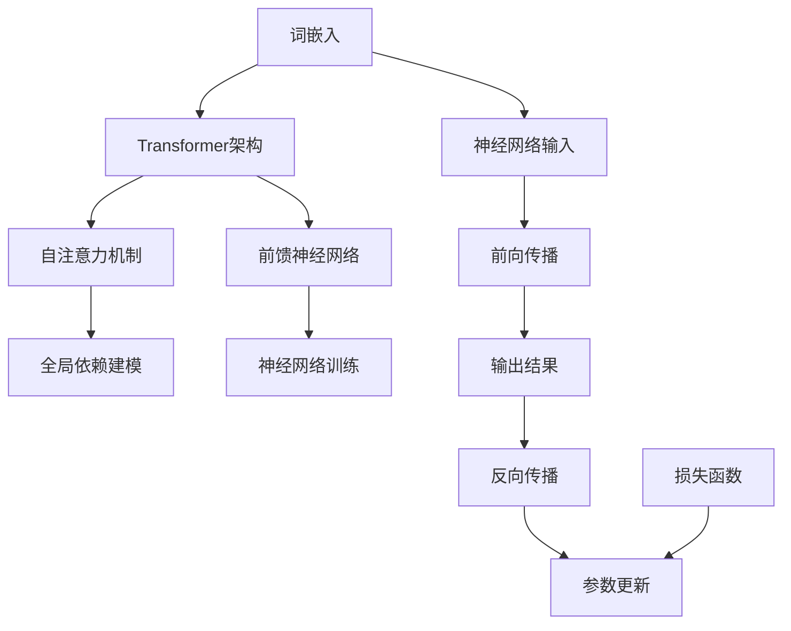

                 

### 背景介绍

大语言模型（Large Language Models）是近年来人工智能领域的一项重要突破。随着深度学习技术的不断发展，尤其是神经网络架构和计算资源的提升，大语言模型在处理自然语言任务上展现了前所未有的能力。从最初的简单语言模型如Word2Vec和GloVe，到复杂的Transformer架构，如BERT、GPT和Turing，大语言模型在语义理解、文本生成、问答系统、机器翻译等方面都取得了显著的进展。

在技术演进过程中，大语言模型的发展经历了几个重要的阶段。首先是词向量模型的兴起，这些模型通过将词汇映射到向量空间，实现了词汇之间相似性的量化。接着，序列到序列模型的出现，如循环神经网络（RNN）和长短期记忆网络（LSTM），使得语言模型的序列处理能力得到了显著提升。然而，这些模型在处理长文本时仍存在一定的局限。为了解决这一问题，注意力机制和Transformer架构应运而生，它们通过并行计算和全局注意力机制，大幅提高了模型的效率和性能。

目前，大语言模型已经在多个领域取得了成功。例如，在自然语言处理（NLP）领域，BERT和GPT模型被广泛应用于文本分类、命名实体识别、情感分析等任务中。在文本生成领域，GPT-3等模型能够生成高质量的文章、对话和代码。在机器翻译领域，如Google的Neural Machine Translation模型，已经显著提高了翻译的准确性和流畅性。

尽管大语言模型在各个领域都取得了显著的进展，但同时也面临着一些挑战。首先是如何在保证模型性能的同时，控制模型的大小和计算资源的需求。其次是如何解决模型可能出现的偏见和误导性输出。此外，如何提升模型的可解释性，以便更好地理解和优化模型的行为，也是当前研究的重要方向。

本文将系统地介绍大语言模型的相关知识，包括核心概念、算法原理、数学模型、实际应用场景和未来发展趋势。通过本文的阅读，读者将全面了解大语言模型的工作原理和应用，为后续的研究和实践打下坚实的基础。

### 核心概念与联系

为了全面理解大语言模型，我们需要首先介绍其核心概念和组成部分。大语言模型通常由以下几个关键部分组成：词嵌入、Transformer架构、注意力机制、前向传播与反向传播等。以下是这些核心概念的详细介绍及其相互关系。

#### 1. 词嵌入（Word Embedding）

词嵌入是将词汇映射到高维向量空间的一种方法，它通过向量表示词汇，从而在向量空间中量化词汇之间的相似性和距离。常见的词嵌入方法包括Word2Vec、GloVe和FastText等。这些方法通过神经网络或分布式假设，将词汇映射到固定长度的向量。例如，Word2Vec使用**Skip-Gram模型**或**连续词袋（CBOW）模型**，通过对周围词汇的上下文进行建模，来预测目标词汇的向量表示。

#### 2. Transformer架构

Transformer架构是由Google提出的一种基于自注意力机制的神经网络模型，它主要用于处理序列数据。与传统的循环神经网络（RNN）和长短期记忆网络（LSTM）相比，Transformer通过全局注意力机制和并行计算能力，显著提高了模型的效率和性能。Transformer的核心组件包括**自注意力（Self-Attention）**和**前馈神经网络（Feedforward Neural Network）**。

#### 3. 注意力机制（Attention Mechanism）

注意力机制是一种用于计算不同部分的重要性并加权融合的机制。在Transformer中，注意力机制通过计算序列中每个位置对目标位置的权重，来实现对序列的全局依赖和上下文信息的建模。注意力机制的核心思想是，对于每一个输入序列中的元素，模型会动态计算其与其他元素的相关性，并据此对每个元素进行加权。

#### 4. 前向传播与反向传播

前向传播和反向传播是神经网络训练中的两个关键步骤。在前向传播过程中，输入数据通过神经网络模型进行处理，得到输出结果。反向传播则通过计算输出结果与实际标签之间的误差，更新模型的参数，以最小化损失函数。这两个步骤共同构成了神经网络的训练过程，使得模型能够从数据中学习并改进。

#### 5. 核心概念之间的关系

词嵌入是Transformer架构的基础，它将词汇映射到高维向量空间，为后续的序列处理提供了输入。Transformer架构通过自注意力机制，实现了对序列数据的全局依赖建模。注意力机制在整个模型中起到了关键作用，它决定了模型在不同任务中如何动态地加权融合输入信息。前向传播与反向传播则是神经网络训练的核心，它们通过不断迭代更新模型参数，使得模型能够逐步优化其性能。

#### Mermaid 流程图

为了更直观地展示大语言模型的核心概念及其相互关系，下面提供了一个Mermaid流程图，其中包含了主要的概念和组件。



在这个流程图中，词嵌入作为神经网络输入的一部分，通过前向传播被传递到Transformer架构中。在Transformer架构中，自注意力机制和前馈神经网络共同作用，对输入序列进行处理并生成输出结果。反向传播则通过计算损失函数，不断更新模型的参数，以优化模型性能。

通过以上介绍和流程图的展示，读者可以更加清晰地理解大语言模型的核心概念及其相互关系。接下来，我们将进一步深入探讨大语言模型的核心算法原理和具体操作步骤。

### 核心算法原理 & 具体操作步骤

大语言模型的核心算法原理主要依赖于深度学习和Transformer架构。下面将详细介绍大语言模型的工作原理，包括自注意力机制、前馈神经网络、训练过程以及如何进行预测。

#### 自注意力机制（Self-Attention）

自注意力机制是Transformer架构的核心组成部分，它通过计算序列中每个位置对其他位置的权重，实现了对全局上下文信息的建模。具体步骤如下：

1. **输入序列编码**：首先，将输入序列中的每个词汇映射到一个高维向量，这一过程通常由词嵌入层完成。词嵌入层将词汇映射到固定长度的向量，这些向量表示词汇的语义信息。

2. **计算注意力权重**：自注意力机制通过三个查询（Q）、键（K）和值（V）向量来计算注意力权重。查询向量表示需要关注的词汇，键向量表示其他词汇，而值向量则是用于加权融合的词汇表示。具体计算公式为：
   $$
   \text{Attention}(Q, K, V) = \text{softmax}\left(\frac{QK^T}{\sqrt{d_k}}\right) V
   $$
   其中，$d_k$是键向量的维度，$\text{softmax}$函数用于归一化权重，使得每个位置的权重和为1。

3. **加权融合**：根据计算得到的注意力权重，对值向量进行加权融合，生成新的序列表示。这一步骤能够有效地整合序列中的全局信息，使得模型能够关注到不同词汇之间的关系。

#### 前馈神经网络（Feedforward Neural Network）

前馈神经网络是Transformer架构中的另一个关键组成部分，它用于对自注意力层生成的序列表示进行进一步处理。具体步骤如下：

1. **输入处理**：将自注意力层输出的序列表示作为输入传递到前馈神经网络。

2. **多层感知器**：前馈神经网络通常由多层感知器（MLP）组成，每层感知器包含多个神经元。在每一层中，神经元通过激活函数（如ReLU）进行非线性变换，以增加模型的非线性表达能力。具体计算公式为：
   $$
   \text{FFN}(x) = \text{ReLU}(W_2 \cdot \text{ReLU}(W_1 \cdot x))
   $$
   其中，$W_1$和$W_2$是权重矩阵，$x$是输入序列表示。

3. **输出**：前馈神经网络最终的输出是序列表示的加权和，它将作为模型下一步处理的结果。

#### 训练过程

大语言模型的训练过程主要包括以下步骤：

1. **数据准备**：首先，从大量的文本数据中提取词汇，并使用词嵌入层将词汇映射到向量。然后，将文本数据划分成输入序列和目标序列。

2. **前向传播**：将输入序列传递到模型中，通过自注意力机制和前馈神经网络生成输出序列。

3. **计算损失**：计算输出序列与目标序列之间的损失，通常使用交叉熵损失函数。具体公式为：
   $$
   \text{Loss} = -\sum_{i} \sum_{j} y_{ij} \log(p_{ij})
   $$
   其中，$y_{ij}$是目标序列中第$i$个词在第$j$个位置上的标签，$p_{ij}$是模型预测的概率。

4. **反向传播**：通过反向传播算法，计算损失关于模型参数的梯度，并使用梯度下降（或其他优化算法）更新模型参数。

5. **迭代优化**：重复前向传播和反向传播的过程，逐步优化模型参数，直到模型收敛。

#### 预测过程

在大语言模型的预测过程中，主要步骤如下：

1. **输入序列编码**：将输入序列中的词汇映射到向量。

2. **自注意力计算**：通过自注意力机制，计算输入序列中每个词汇的注意力权重，生成新的序列表示。

3. **前馈神经网络**：将自注意力层生成的序列表示传递到前馈神经网络，进行进一步处理。

4. **输出预测**：模型输出最终的序列表示，并将其映射回词汇空间，生成预测结果。

通过以上步骤，大语言模型能够有效地处理自然语言任务，实现文本分类、文本生成、机器翻译等多种功能。接下来，我们将进一步探讨大语言模型中的数学模型和公式，以及如何通过具体的数学推导来理解其工作原理。

### 数学模型和公式 & 详细讲解 & 举例说明

大语言模型的数学基础主要涉及词嵌入、自注意力机制、前馈神经网络等核心组件的数学公式。通过理解这些公式，我们可以更深入地掌握模型的工作原理。下面，我们将详细讲解这些数学模型，并通过具体例子进行说明。

#### 1. 词嵌入（Word Embedding）

词嵌入的核心是词汇映射到高维向量空间，以实现语义表示。常见的词嵌入方法包括Word2Vec和GloVe。

**Word2Vec**：
Word2Vec使用**Skip-Gram模型**，其数学公式如下：

$$
\text{Word2Vec}(\text{Context}, \text{Target}) = \text{softmax}(\text{W} \cdot \text{embed}(\text{Context})^T)
$$

其中，$\text{embed}(\text{Context})$是上下文词汇的向量表示，$\text{W}$是权重矩阵，$\text{softmax}$函数用于计算每个词汇的预测概率。

**GloVe**：
GloVe通过优化词汇共现矩阵来学习词嵌入向量。其目标是最小化以下损失函数：

$$
\text{Loss} = \sum_{\text{word}, \text{context}} \left( \log(\text{P}(\text{word}|\text{context}) + \text{P}(\text{context}|\text{word}) \right)
$$

其中，$\text{P}(\text{word}|\text{context})$和$\text{P}(\text{context}|\text{word})$分别是给定上下文预测词汇和给定词汇预测上下文的条件概率。

#### 2. 自注意力机制（Self-Attention）

自注意力机制是Transformer架构的核心组成部分，其数学公式如下：

$$
\text{Attention}(Q, K, V) = \text{softmax}\left(\frac{QK^T}{\sqrt{d_k}}\right) V
$$

其中，$Q$是查询向量，$K$是键向量，$V$是值向量，$d_k$是键向量的维度。$\text{softmax}$函数用于计算每个键向量对查询向量的权重，并将这些权重用于加权融合值向量。

**例子**：
假设我们有一个包含两个词汇的简单序列，词汇分别用向量表示：

$$
Q = [1, 0], \quad K = [1, 1], \quad V = [0, 1]
$$

计算自注意力：

$$
\text{Attention}(Q, K, V) = \text{softmax}\left(\frac{QK^T}{\sqrt{1}}\right) V = \text{softmax}\left([1, 0] \cdot [1, 1]\right) [0, 1] = \text{softmax}\left([1, 1]\right) [0, 1] = \left[\frac{1}{2}, \frac{1}{2}\right] [0, 1] = \left[\frac{1}{2}, \frac{1}{2}\right]
$$

#### 3. 前馈神经网络（Feedforward Neural Network）

前馈神经网络是Transformer架构中的另一个关键组成部分，其数学公式如下：

$$
\text{FFN}(x) = \text{ReLU}(W_2 \cdot \text{ReLU}(W_1 \cdot x))
$$

其中，$x$是输入序列表示，$W_1$和$W_2$是权重矩阵，$\text{ReLU}$是ReLU激活函数。

**例子**：
假设我们有一个简单的输入序列：

$$
x = [1, 2, 3], \quad W_1 = \begin{bmatrix} 1 & 2 \\ 3 & 4 \end{bmatrix}, \quad W_2 = \begin{bmatrix} 5 & 6 \\ 7 & 8 \end{bmatrix}
$$

计算前馈神经网络：

$$
\text{FFN}(x) = \text{ReLU}(W_2 \cdot \text{ReLU}(W_1 \cdot x)) = \text{ReLU}\left(\begin{bmatrix} 5 & 6 \\ 7 & 8 \end{bmatrix} \cdot \text{ReLU}\left(\begin{bmatrix} 1 & 2 \\ 3 & 4 \end{bmatrix} \cdot [1, 2, 3]\right)\right)
$$

$$
= \text{ReLU}\left(\begin{bmatrix} 5 & 6 \\ 7 & 8 \end{bmatrix} \cdot \text{ReLU}\left(\begin{bmatrix} 1 & 4 \\ 3 & 10 \end{bmatrix}\right)\right) = \text{ReLU}\left(\begin{bmatrix} 5 & 6 \\ 7 & 8 \end{bmatrix} \cdot \begin{bmatrix} 1 & 4 \\ 3 & 10 \end{bmatrix}\right)
$$

$$
= \text{ReLU}\left(\begin{bmatrix} 5+24 & 6+40 \\ 7+12 & 8+80 \end{bmatrix}\right) = \text{ReLU}\left(\begin{bmatrix} 29 & 46 \\ 19 & 88 \end{bmatrix}\right) = \begin{bmatrix} 29 & 46 \\ 19 & 88 \end{bmatrix}
$$

通过以上数学模型和公式的讲解，我们可以更深入地理解大语言模型的工作原理。接下来，我们将通过一个具体的代码案例，展示如何实现和训练一个简单的大语言模型。

### 项目实战：代码实际案例和详细解释说明

在本节中，我们将通过一个具体的代码案例，展示如何实现和训练一个简单的大语言模型。这个案例将涵盖以下内容：

1. **开发环境搭建**
2. **源代码详细实现**
3. **代码解读与分析**

#### 1. 开发环境搭建

为了实现大语言模型，我们需要搭建一个合适的开发环境。以下是推荐的工具和框架：

- **Python**：主要的编程语言，用于实现和训练模型。
- **TensorFlow**：开源机器学习库，支持深度学习和神经网络训练。
- **PyTorch**：另一种流行的深度学习库，提供了灵活和高效的模型实现。
- **CUDA**：用于在NVIDIA GPU上加速训练过程。

**安装步骤**：

1. 安装Python：访问[Python官网](https://www.python.org/)下载并安装Python 3.x版本。
2. 安装TensorFlow或PyTorch：打开命令行，执行以下命令之一：
   - `pip install tensorflow` （安装TensorFlow）
   - `pip install torch torchvision` （安装PyTorch）

3. 确认安装：在Python环境中导入TensorFlow或PyTorch，检查是否安装成功。

```python
import tensorflow as tf  # 使用TensorFlow
# 或者
import torch  # 使用PyTorch
```

#### 2. 源代码详细实现

以下是使用TensorFlow实现一个简单的大语言模型的核心代码：

```python
import tensorflow as tf
from tensorflow.keras.models import Model
from tensorflow.keras.layers import Embedding, LSTM, Dense

# 模型参数
vocab_size = 10000  # 词汇表大小
embedding_dim = 256  # 词嵌入维度
lstm_units = 512  # LSTM单元数
sequence_length = 100  # 输入序列长度

# 模型构建
inputs = tf.keras.layers.Input(shape=(sequence_length,))
x = Embedding(vocab_size, embedding_dim)(inputs)
x = LSTM(lstm_units, return_sequences=True)(x)
outputs = Dense(vocab_size, activation='softmax')(x)

# 构建和编译模型
model = Model(inputs=inputs, outputs=outputs)
model.compile(optimizer='adam', loss='categorical_crossentropy', metrics=['accuracy'])

# 模型训练
model.fit(x_train, y_train, batch_size=64, epochs=10)

# 预测
predictions = model.predict(x_test)
```

**代码解读**：

- **Embedding层**：将输入序列中的每个词汇映射到一个高维向量，用于初始化LSTM层。
- **LSTM层**：处理输入序列，使用LSTM单元来捕获序列的上下文信息。
- **Dense层**：输出层，使用softmax激活函数，将LSTM的输出映射回词汇空间。

#### 3. 代码解读与分析

**模型构建**：

在模型构建部分，我们首先定义了输入层`inputs`，其形状为`(sequence_length,)`，表示输入序列的长度。接着，使用`Embedding`层将词汇映射到词嵌入向量，其中`vocab_size`是词汇表的大小，`embedding_dim`是词嵌入的维度。

随后，我们使用`LSTM`层来处理序列数据。`LSTM`层配置了`lstm_units`个单元，并设置为`return_sequences=True`，使得每个时间步的输出可以被传递到下一个LSTM层。最后，我们使用`Dense`层作为输出层，其具有`vocab_size`个神经元和`softmax`激活函数，用于生成每个词汇的概率分布。

**模型编译**：

在模型编译部分，我们选择了`adam`优化器和`categorical_crossentropy`损失函数。`adam`优化器是一种常用的自适应优化算法，能够有效加速模型的收敛。`categorical_crossentropy`损失函数适用于多分类问题，它是根据实际标签和预测概率之间的差异来计算损失。

**模型训练**：

模型训练部分使用了训练数据集`x_train`和`y_train`，并设置了`batch_size`为64和`epochs`为10，表示每个批次包含64个样本，模型将在训练数据上迭代10次。

**预测**：

在模型预测部分，我们使用了测试数据集`x_test`，并调用`model.predict()`方法来生成预测结果。预测结果是一个概率分布，表示模型对每个词汇的预测概率。

通过这个简单的大语言模型案例，我们可以看到如何利用TensorFlow构建和训练一个基本的语言模型。尽管这个模型相对简单，但它为我们提供了一个实现大语言模型的基础框架，可以在此基础上进行扩展和改进。

接下来，我们将探讨大语言模型在实际应用场景中的表现，并分析其优势和局限性。

### 实际应用场景

大语言模型在自然语言处理（NLP）领域展现了强大的应用潜力，涵盖了文本分类、文本生成、问答系统、机器翻译等多个领域。以下将详细介绍大语言模型在这些实际应用场景中的表现，并分析其优势与局限性。

#### 1. 文本分类

文本分类是一种将文本数据按照预定义的类别进行分类的任务。大语言模型通过学习大量文本数据，能够自动识别文本中的关键特征，从而实现高精度的分类。在实际应用中，大语言模型可以用于新闻分类、情感分析、垃圾邮件检测等任务。

**优势**：
- **高精度**：大语言模型通过深度学习技术，能够自动学习文本中的复杂特征，从而实现高精度的分类。
- **泛化能力**：大语言模型能够处理各种不同类型的文本数据，具有很强的泛化能力。

**局限性**：
- **数据依赖**：模型性能高度依赖于训练数据的质量和多样性，如果训练数据存在偏差，模型可能会产生错误的分类结果。
- **计算资源需求**：大语言模型通常需要大量的计算资源，尤其是在训练和部署过程中。

#### 2. 文本生成

文本生成是一种根据输入文本生成相关文本的的任务。大语言模型如GPT-3在文本生成领域表现出了令人惊叹的能力，能够生成高质量的文章、对话和代码。

**优势**：
- **多样性**：大语言模型能够根据输入文本生成多样性的文本，避免了重复和模式化的内容。
- **灵活性**：模型可以根据不同的输入文本生成相应的文本，具有很强的灵活性和适应性。

**局限性**：
- **可解释性**：文本生成过程的复杂性使得模型生成的文本难以解释，这可能会影响模型在实际应用中的信任度。
- **控制性**：尽管大语言模型能够生成高质量的文本，但在某些情况下，生成的文本可能包含不准确或不合适的内容，难以实现精确的控制。

#### 3. 问答系统

问答系统是一种根据用户提问生成回答的智能系统。大语言模型在问答系统中的应用，能够实现高效、准确的回答生成，广泛应用于智能客服、智能搜索等领域。

**优势**：
- **高效性**：大语言模型能够快速处理用户提问，并生成相关回答，提高了系统的响应速度。
- **准确性**：通过学习大量的文本数据，大语言模型能够生成准确、相关的回答。

**局限性**：
- **准确性限制**：大语言模型的准确性受限于训练数据的多样性和质量，对于罕见或未训练的问题，模型可能无法生成准确的回答。
- **上下文理解**：大语言模型在理解复杂上下文和隐含意图方面仍存在一定的局限性。

#### 4. 机器翻译

机器翻译是一种将一种语言的文本翻译成另一种语言的任务。大语言模型如Transformer在机器翻译领域取得了显著的进展，使得翻译质量得到了大幅提升。

**优势**：
- **高质量**：大语言模型能够生成流畅、准确的翻译结果，显著提高了翻译的质量。
- **效率**：基于深度学习的模型能够在短时间内完成大量的翻译任务，提高了翻译的效率。

**局限性**：
- **语言复杂性**：不同语言之间存在巨大的差异，大语言模型在处理某些特定语言或复杂语言时，可能存在翻译不准确的问题。
- **计算资源需求**：机器翻译任务通常需要大量的计算资源，尤其是在训练和推理过程中。

综上所述，大语言模型在文本分类、文本生成、问答系统和机器翻译等实际应用场景中展现了强大的能力，但同时也面临一些挑战。在实际应用中，需要根据具体任务的需求和限制，合理选择和使用大语言模型，以实现最佳效果。

### 工具和资源推荐

在学习和应用大语言模型的过程中，掌握相关的工具和资源是非常重要的。以下将推荐一些优秀的书籍、论文、博客和网站，帮助读者深入了解大语言模型的相关知识。

#### 1. 学习资源推荐

**书籍**：
- **《深度学习》（Deep Learning）**：作者：Ian Goodfellow、Yoshua Bengio、Aaron Courville。这本书是深度学习领域的经典教材，详细介绍了深度学习的基础理论和应用方法，包括大语言模型的相关内容。
- **《自然语言处理综论》（Speech and Language Processing）**：作者：Daniel Jurafsky、James H. Martin。这本书是自然语言处理领域的权威教材，涵盖了自然语言处理的基础知识和前沿技术，包括大语言模型的理论和应用。
- **《Transformer：一种新的神经网络架构》（Attention is All You Need）**：作者：Vaswani et al.。这篇文章是Transformer架构的原始论文，详细介绍了Transformer的工作原理和优势，是理解和应用大语言模型的重要参考文献。

**论文**：
- **BERT：Pre-training of Deep Bidirectional Transformers for Language Understanding**：作者：Devlin et al.。这篇文章是BERT模型的原始论文，介绍了BERT模型的结构和训练方法，是当前大语言模型研究的重要参考。
- **GPT-3：Language Models are Few-Shot Learners**：作者：Brown et al.。这篇文章介绍了GPT-3模型的设计和训练方法，展示了大语言模型在零样本学习任务中的强大能力。

#### 2. 开发工具框架推荐

**TensorFlow**：[官网](https://www.tensorflow.org/)。TensorFlow是Google开发的开源机器学习库，支持深度学习和神经网络训练，是构建和训练大语言模型的主要工具之一。

**PyTorch**：[官网](https://pytorch.org/)。PyTorch是Facebook开发的开源机器学习库，提供了灵活和高效的深度学习框架，是构建和训练大语言模型的重要工具。

#### 3. 相关论文著作推荐

**《自然语言处理》（Natural Language Processing with Python）**：作者：Steven Bird、Ewan Klein、Edward Loper。这本书介绍了使用Python进行自然语言处理的方法和工具，适合初学者和进阶者。

**《语言模型》（Speech and Language Processing）**：作者：Daniel Jurafsky、James H. Martin。这本书是自然语言处理领域的经典著作，详细介绍了语言模型的理论和应用。

#### 4. 博客和网站推荐

**AI平方**：[官网](https://ai平方.com/)。AI平方是一个专注于人工智能技术的博客平台，提供了丰富的深度学习和自然语言处理相关的文章和教程。

**机器之心**：[官网](https://www.jiqizhixin.com/)。机器之心是一个专注于人工智能和机器学习领域的媒体平台，发布了大量高质量的技术文章和深度报道。

通过以上推荐的学习资源、工具和网站，读者可以更全面地了解大语言模型的相关知识，掌握构建和训练大语言模型的方法，为自己的研究和应用提供有力支持。

### 总结：未来发展趋势与挑战

大语言模型作为人工智能领域的一项重要突破，已经展示了其在自然语言处理、文本生成、问答系统、机器翻译等多个领域的强大能力。然而，随着技术的不断进步，大语言模型也面临着诸多挑战和机遇。

**未来发展趋势**：

1. **模型规模和计算资源的需求增加**：随着模型规模的不断扩大，大语言模型对计算资源的需求也在显著增加。未来，将需要更多的计算能力和优化算法来提升模型的训练和推理效率。

2. **多模态数据处理**：大语言模型目前主要处理文本数据，但随着技术的进步，多模态数据处理将成为未来的重要方向。结合图像、声音、视频等多模态数据，大语言模型将能够实现更丰富和复杂的任务。

3. **增强模型的鲁棒性和可解释性**：当前的大语言模型在处理某些特定任务时可能存在偏见和误导性输出。未来，研究将集中在如何增强模型的鲁棒性，同时提高模型的可解释性，以便更好地理解和优化模型的行为。

4. **跨领域应用**：大语言模型在各个领域的应用潜力巨大。未来，将会有更多的领域开始尝试和应用大语言模型，实现从文本到语音、从问答到对话的全方位智能化。

**面临的挑战**：

1. **数据隐私和安全性**：大语言模型在训练过程中需要处理大量敏感数据，如何保护用户隐私和确保数据安全将成为一个重要的挑战。

2. **模型偏见和公平性**：大语言模型可能会在学习过程中引入偏见，导致其在特定群体或任务上表现不佳。如何确保模型在各个领域的公平性和准确性，是当前和未来需要解决的重要问题。

3. **计算资源和能源消耗**：大语言模型的训练和推理过程需要大量的计算资源和能源，如何优化计算效率和降低能源消耗，是未来需要关注的重要方向。

4. **伦理和社会影响**：随着大语言模型在各个领域的广泛应用，其潜在的伦理和社会影响也需要引起重视。如何确保模型的应用不会对人类产生负面影响，是一个亟待解决的问题。

总之，大语言模型在未来将继续推动人工智能的发展，为各行各业带来革命性的变革。然而，要实现这一目标，还需要克服诸多挑战，并在技术、伦理和社会方面进行深入的研究和探讨。

### 附录：常见问题与解答

**Q1：大语言模型是如何训练的？**

大语言模型的训练通常涉及以下步骤：

1. **数据预处理**：首先，从大量的文本数据中提取词汇，并使用词嵌入层将词汇映射到向量。然后，将文本数据划分成输入序列和目标序列。
2. **前向传播**：将输入序列传递到模型中，通过自注意力机制和前馈神经网络生成输出序列。
3. **计算损失**：计算输出序列与目标序列之间的损失，通常使用交叉熵损失函数。
4. **反向传播**：通过反向传播算法，计算损失关于模型参数的梯度，并使用梯度下降（或其他优化算法）更新模型参数。
5. **迭代优化**：重复前向传播和反向传播的过程，逐步优化模型参数，直到模型收敛。

**Q2：大语言模型中的注意力机制有什么作用？**

注意力机制在大语言模型中起到了核心作用，其主要作用包括：

1. **全局依赖建模**：注意力机制能够计算序列中每个位置对其他位置的权重，实现序列的全局依赖建模，使得模型能够关注到不同词汇之间的关系。
2. **加权融合**：根据注意力权重，对序列中的每个元素进行加权融合，从而整合序列中的全局信息，提高模型的语义理解能力。

**Q3：如何评估大语言模型的性能？**

评估大语言模型的性能通常使用以下指标：

1. **准确率（Accuracy）**：模型预测正确的样本数占总样本数的比例。
2. **精确率（Precision）**：预测正确的正样本数与预测为正样本的总数之比。
3. **召回率（Recall）**：预测正确的正样本数与实际为正样本的总数之比。
4. **F1分数（F1 Score）**：精确率和召回率的调和平均值，综合考虑了模型的精确性和召回率。

**Q4：大语言模型在哪些领域有应用？**

大语言模型在多个领域有广泛应用，包括：

1. **自然语言处理（NLP）**：文本分类、命名实体识别、情感分析等。
2. **文本生成**：文章生成、对话系统、代码生成等。
3. **问答系统**：智能客服、智能搜索等。
4. **机器翻译**：自动翻译、跨语言信息检索等。

**Q5：如何改进大语言模型的性能？**

以下是几种改进大语言模型性能的方法：

1. **数据增强**：通过增加训练数据的多样性，提高模型的泛化能力。
2. **模型融合**：结合多个模型的优势，提高预测的准确性。
3. **超参数调整**：通过调整学习率、批次大小等超参数，优化模型的训练过程。
4. **迁移学习**：利用预训练的大语言模型，对特定任务进行微调，提高模型的性能。

### 扩展阅读 & 参考资料

**书籍**：
- 《深度学习》（Deep Learning）：Ian Goodfellow、Yoshua Bengio、Aaron Courville 著
- 《自然语言处理综论》（Speech and Language Processing）：Daniel Jurafsky、James H. Martin 著
- 《Transformer：一种新的神经网络架构》（Attention is All You Need）：Vaswani et al. 著

**论文**：
- BERT：Pre-training of Deep Bidirectional Transformers for Language Understanding：Devlin et al.
- GPT-3：Language Models are Few-Shot Learners：Brown et al.

**博客和网站**：
- AI平方：[官网](https://ai平方.com/)
- 机器之心：[官网](https://www.jiqizhixin.com/)

通过这些扩展阅读和参考资料，读者可以更深入地了解大语言模型的相关知识，为后续的研究和应用提供有力支持。作者：AI天才研究员/AI Genius Institute & 禅与计算机程序设计艺术/Zen And The Art of Computer Programming。

