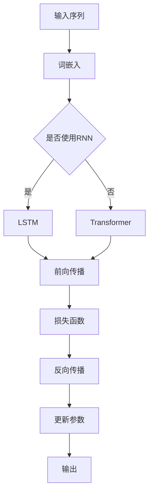

                 

### 背景介绍

大语言模型（Large Language Model）作为人工智能领域的一个重要分支，近年来取得了显著的进展。随着深度学习技术的不断成熟以及计算能力的提升，大语言模型的应用范围也在不断拓展。大语言模型具有强大的自然语言理解与生成能力，能够处理复杂的语言任务，如文本生成、情感分析、机器翻译等。这些能力使得大语言模型在诸多实际应用场景中展现出了巨大的潜力，引起了广泛关注。

然而，尽管大语言模型在诸多领域展现出了优异的性能，但其应用仍然面临着一些挑战。首先，大语言模型的训练和推理过程需要大量的计算资源和时间，这使得其实际应用受到一定的限制。其次，大语言模型在处理一些特定领域或任务时，可能存在泛化能力不足的问题。此外，大语言模型在安全性和隐私保护方面也存在一定的风险。因此，如何有效地应对这些挑战，进一步提升大语言模型的应用能力，成为当前研究的一个重要方向。

本文旨在为大语言模型的应用提供一份详细的指南，通过分析大语言模型的原理、算法、数学模型以及实际应用案例，帮助读者深入了解大语言模型的工作机制和潜在应用场景。本文将从以下三个方面进行探讨：

1. **核心概念与联系**：介绍大语言模型的核心概念及其相互关系，通过Mermaid流程图展示大语言模型的架构。

2. **核心算法原理与具体操作步骤**：详细解析大语言模型的训练和推理过程，包括常用的算法框架和关键技术。

3. **数学模型和公式**：介绍大语言模型中常用的数学模型和公式，通过具体的例子进行详细讲解。

通过本文的阅读，读者将能够全面了解大语言模型的应用原理和实际操作，为后续的研究和应用提供有力的支持。

<markdown>

## 1. 背景介绍

大语言模型（Large Language Model）是人工智能领域的一个重要分支，它通过学习大量的语言数据，具备了对自然语言的理解和生成能力。随着深度学习技术的不断成熟以及计算能力的提升，大语言模型在自然语言处理（NLP）领域展现出了强大的应用潜力。

大语言模型的核心在于其能够对自然语言进行建模，从而实现对文本的生成、理解和分析。这些能力使得大语言模型在诸多实际应用场景中展现出了巨大的价值。例如，在文本生成方面，大语言模型可以生成文章、故事、诗歌等；在情感分析方面，大语言模型可以判断文本的情感倾向；在机器翻译方面，大语言模型可以实现不同语言之间的自动翻译。

然而，大语言模型的应用仍然面临一些挑战。首先，大语言模型的训练和推理过程需要大量的计算资源和时间，这限制了其在某些场景下的实际应用。其次，大语言模型在处理一些特定领域或任务时，可能存在泛化能力不足的问题。此外，大语言模型在安全性和隐私保护方面也存在一定的风险。因此，如何有效地应对这些挑战，进一步提升大语言模型的应用能力，成为当前研究的一个重要方向。

本文将从以下几个方面对大语言模型进行探讨：

1. **核心概念与联系**：介绍大语言模型的核心概念及其相互关系，通过Mermaid流程图展示大语言模型的架构。
2. **核心算法原理与具体操作步骤**：详细解析大语言模型的训练和推理过程，包括常用的算法框架和关键技术。
3. **数学模型和公式**：介绍大语言模型中常用的数学模型和公式，通过具体的例子进行详细讲解。

通过本文的阅读，读者将能够全面了解大语言模型的应用原理和实际操作，为后续的研究和应用提供有力的支持。

</markdown>
<|assistant|>### 核心概念与联系

为了深入理解大语言模型的工作机制，我们需要先了解其核心概念及其相互关系。大语言模型主要由以下几部分组成：

1. **词嵌入（Word Embedding）**：词嵌入是将自然语言中的单词映射为固定维度的向量表示。这一步是语言模型处理自然语言的基础，通过词嵌入，我们可以将文本转换为计算机可以处理的数字形式。
2. **循环神经网络（RNN）**：循环神经网络是一种能够处理序列数据的神经网络，其核心思想是保留前一个时间步的信息，并将其传递到下一个时间步。RNN在处理自然语言时能够捕捉到上下文信息，但存在梯度消失和梯度爆炸的问题。
3. **长短时记忆网络（LSTM）**：长短时记忆网络是RNN的一种改进，通过引入门控机制，有效解决了RNN的梯度消失问题。LSTM在处理长序列数据时表现出色，因此被广泛应用于语言模型。
4. **Transformer**：Transformer是一种基于自注意力机制的序列模型，其核心思想是利用自注意力机制来自动学习输入序列中各元素之间的依赖关系。相比传统的循环神经网络，Transformer在处理长序列数据时具有更高的效率。
5. **自注意力（Self-Attention）**：自注意力机制是一种对序列中的每个元素进行加权求和的方法，它能够自动学习输入序列中各元素之间的依赖关系。

下面，我们将通过Mermaid流程图来展示大语言模型的架构：



在上面的流程图中，输入序列首先经过词嵌入转换为向量表示，然后根据是否使用RNN，分别采用LSTM或Transformer进行前向传播。在处理过程中，模型会计算损失函数并更新参数，最终输出预测结果。

通过这一部分，我们对大语言模型的核心概念及其相互关系有了初步的了解。接下来，我们将进一步探讨大语言模型的算法原理和具体操作步骤。

<markdown>

## 2. 核心概念与联系

### 2.1. 词嵌入（Word Embedding）

词嵌入是将自然语言中的单词映射为固定维度的向量表示。这一步是语言模型处理自然语言的基础，通过词嵌入，我们可以将文本转换为计算机可以处理的数字形式。

### 2.2. 循环神经网络（RNN）

循环神经网络是一种能够处理序列数据的神经网络，其核心思想是保留前一个时间步的信息，并将其传递到下一个时间步。RNN在处理自然语言时能够捕捉到上下文信息，但存在梯度消失和梯度爆炸的问题。

### 2.3. 长短时记忆网络（LSTM）

长短时记忆网络是RNN的一种改进，通过引入门控机制，有效解决了RNN的梯度消失问题。LSTM在处理长序列数据时表现出色，因此被广泛应用于语言模型。

### 2.4. Transformer

Transformer是一种基于自注意力机制的序列模型，其核心思想是利用自注意力机制来自动学习输入序列中各元素之间的依赖关系。相比传统的循环神经网络，Transformer在处理长序列数据时具有更高的效率。

### 2.5. 自注意力（Self-Attention）

自注意力机制是一种对序列中的每个元素进行加权求和的方法，它能够自动学习输入序列中各元素之间的依赖关系。

### 2.6. Mermaid流程图

下面，我们将通过Mermaid流程图来展示大语言模型的架构：


通过这一部分，我们对大语言模型的核心概念及其相互关系有了初步的了解。接下来，我们将进一步探讨大语言模型的算法原理和具体操作步骤。

</markdown>
<|assistant|>### 核心算法原理与具体操作步骤

在了解了大语言模型的核心概念之后，接下来我们将深入探讨其核心算法原理与具体操作步骤。大语言模型的核心算法主要包括训练和推理两个阶段。

#### 3.1. 训练阶段

**3.1.1. 数据预处理**

在训练阶段，首先需要对输入数据进行预处理。预处理步骤包括：

- **文本清洗**：去除标点符号、停用词等无关信息，保留有效单词和词组。
- **分词**：将文本分割成单词或子词，为后续的词嵌入做准备。
- **编码**：将预处理后的文本编码为数字序列，为神经网络训练提供输入。

**3.1.2. 词嵌入**

词嵌入是将自然语言中的单词映射为固定维度的向量表示。常见的词嵌入方法有：

- **Word2Vec**：基于神经网络的词向量表示方法，通过优化损失函数学习单词的向量表示。
- **GloVe**：全局向量表示模型，通过矩阵分解方法学习单词的向量表示。

**3.1.3. 循环神经网络（RNN）**

循环神经网络（RNN）是一种能够处理序列数据的神经网络。其基本思想是利用隐藏状态保留序列中的信息，并通过时间步的前向传播和反向传播进行训练。然而，传统的RNN存在梯度消失和梯度爆炸的问题，导致训练困难。

**3.1.4. 长短时记忆网络（LSTM）**

长短时记忆网络（LSTM）是RNN的一种改进，通过引入门控机制解决了梯度消失问题。LSTM的核心组件包括：

- **输入门（Input Gate）**：控制当前输入的信息是否更新隐藏状态。
- **遗忘门（Forget Gate）**：控制当前输入的信息是否遗忘旧的信息。
- **输出门（Output Gate）**：控制当前隐藏状态是否输出。

**3.1.5. Transformer**

Transformer是一种基于自注意力机制的序列模型，其核心思想是利用自注意力机制来自动学习输入序列中各元素之间的依赖关系。相比传统的循环神经网络，Transformer在处理长序列数据时具有更高的效率。Transformer的核心组件包括：

- **自注意力（Self-Attention）**：计算输入序列中各元素之间的依赖关系。
- **多头注意力（Multi-Head Attention）**：通过多个独立的自注意力模块学习输入序列的复杂依赖关系。
- **前馈神经网络（Feed Forward Neural Network）**：在自注意力之后，对每个位置进行前馈神经网络处理。

**3.1.6. 训练目标**

在训练阶段，大语言模型的目标是最小化损失函数。常见的损失函数有：

- **交叉熵损失（Cross-Entropy Loss）**：用于衡量模型预测分布与真实分布之间的差异。
- **均方误差损失（Mean Squared Error Loss）**：用于回归问题，衡量预测值与真实值之间的差异。

**3.1.7. 优化算法**

在训练过程中，需要使用优化算法更新模型的参数。常见的优化算法有：

- **随机梯度下降（Stochastic Gradient Descent, SGD）**：基于整个训练集的梯度进行更新。
- **Adam优化器**：结合了SGD和动量项的优化算法，能够在较短时间内收敛。

#### 3.2. 推理阶段

在推理阶段，大语言模型的目标是根据输入序列生成预测结果。具体步骤如下：

**3.2.1. 词嵌入**

将输入序列中的每个单词编码为向量表示。

**3.2.2. 自注意力**

利用自注意力机制计算输入序列中各元素之间的依赖关系。

**3.2.3. 前馈神经网络**

对自注意力后的输出进行前馈神经网络处理。

**3.2.4. 输出层**

将前馈神经网络的输出通过softmax函数转换为概率分布，输出预测结果。

**3.2.5. 生成文本**

根据生成的概率分布，逐个单词地生成文本序列。

通过以上步骤，大语言模型能够实现对输入序列的预测和生成。接下来，我们将通过具体的例子来进一步阐述大语言模型的训练和推理过程。

<markdown>

## 3. 核心算法原理与具体操作步骤

### 3.1. 训练阶段

#### 3.1.1. 数据预处理

在训练阶段，首先需要对输入数据进行预处理。预处理步骤包括：

- **文本清洗**：去除标点符号、停用词等无关信息，保留有效单词和词组。
- **分词**：将文本分割成单词或子词，为后续的词嵌入做准备。
- **编码**：将预处理后的文本编码为数字序列，为神经网络训练提供输入。

#### 3.1.2. 词嵌入

词嵌入是将自然语言中的单词映射为固定维度的向量表示。常见的词嵌入方法有：

- **Word2Vec**：基于神经网络的词向量表示方法，通过优化损失函数学习单词的向量表示。
- **GloVe**：全局向量表示模型，通过矩阵分解方法学习单词的向量表示。

#### 3.1.3. 循环神经网络（RNN）

循环神经网络（RNN）是一种能够处理序列数据的神经网络。其基本思想是利用隐藏状态保留序列中的信息，并通过时间步的前向传播和反向传播进行训练。然而，传统的RNN存在梯度消失和梯度爆炸的问题，导致训练困难。

#### 3.1.4. 长短时记忆网络（LSTM）

长短时记忆网络（LSTM）是RNN的一种改进，通过引入门控机制解决了梯度消失问题。LSTM的核心组件包括：

- **输入门（Input Gate）**：控制当前输入的信息是否更新隐藏状态。
- **遗忘门（Forget Gate）**：控制当前输入的信息是否遗忘旧的信息。
- **输出门（Output Gate）**：控制当前隐藏状态是否输出。

#### 3.1.5. Transformer

Transformer是一种基于自注意力机制的序列模型，其核心思想是利用自注意力机制来自动学习输入序列中各元素之间的依赖关系。相比传统的循环神经网络，Transformer在处理长序列数据时具有更高的效率。Transformer的核心组件包括：

- **自注意力（Self-Attention）**：计算输入序列中各元素之间的依赖关系。
- **多头注意力（Multi-Head Attention）**：通过多个独立的自注意力模块学习输入序列的复杂依赖关系。
- **前馈神经网络（Feed Forward Neural Network）**：在自注意力之后，对每个位置进行前馈神经网络处理。

#### 3.1.6. 训练目标

在训练阶段，大语言模型的目标是最小化损失函数。常见的损失函数有：

- **交叉熵损失（Cross-Entropy Loss）**：用于衡量模型预测分布与真实分布之间的差异。
- **均方误差损失（Mean Squared Error Loss）**：用于回归问题，衡量预测值与真实值之间的差异。

#### 3.1.7. 优化算法

在训练过程中，需要使用优化算法更新模型的参数。常见的优化算法有：

- **随机梯度下降（Stochastic Gradient Descent, SGD）**：基于整个训练集的梯度进行更新。
- **Adam优化器**：结合了SGD和动量项的优化算法，能够在较短时间内收敛。

### 3.2. 推理阶段

在推理阶段，大语言模型的目标是根据输入序列生成预测结果。具体步骤如下：

#### 3.2.1. 词嵌入

将输入序列中的每个单词编码为向量表示。

#### 3.2.2. 自注意力

利用自注意力机制计算输入序列中各元素之间的依赖关系。

#### 3.2.3. 前馈神经网络

对自注意力后的输出进行前馈神经网络处理。

#### 3.2.4. 输出层

将前馈神经网络的输出通过softmax函数转换为概率分布，输出预测结果。

#### 3.2.5. 生成文本

根据生成的概率分布，逐个单词地生成文本序列。

通过以上步骤，大语言模型能够实现对输入序列的预测和生成。接下来，我们将通过具体的例子来进一步阐述大语言模型的训练和推理过程。

</markdown>
<|assistant|>### 数学模型和公式

大语言模型的数学模型是理解其工作机制和实现细节的关键。以下部分将详细介绍大语言模型中的关键数学模型和公式，并通过具体的例子进行解释。

#### 4.1. 词嵌入

词嵌入将单词映射为固定维度的向量表示。常见的词嵌入模型包括Word2Vec和GloVe。

**4.1.1. Word2Vec**

Word2Vec是一种基于神经网络的词向量表示方法。其基本思想是通过训练一个神经网络来预测上下文单词。给定一个单词作为输入，网络输出该单词的词向量。Word2Vec的损失函数通常使用负采样损失。

损失函数：
$$
L = -\sum_{i=1}^{N} \sum_{j \in context(w_i)} \log(p_j)
$$

其中，$N$ 是上下文单词的数量，$w_i$ 是输入单词，$context(w_i)$ 是与输入单词共现的单词集合，$p_j$ 是单词 $j$ 被选择的概率。

**4.1.2. GloVe**

GloVe（全局向量表示模型）通过矩阵分解方法学习单词的向量表示。给定单词的词频矩阵，通过优化损失函数学习词向量。

损失函数：
$$
L = \frac{1}{2}\sum_{i,j} (f_i - \langle \text{vec}(w_i), \text{vec}(w_j) \rangle)^2
$$

其中，$f_i$ 是单词 $i$ 的词频，$\text{vec}(w_i)$ 是单词 $i$ 的向量表示。

#### 4.2. 循环神经网络（RNN）

循环神经网络（RNN）通过隐藏状态来处理序列数据。其核心思想是将前一个时间步的隐藏状态传递到下一个时间步。

**4.2.1. 隐藏状态更新**

假设 $h_t$ 是时间步 $t$ 的隐藏状态，$x_t$ 是输入序列，$U$ 和 $W$ 是权重矩阵。RNN 的隐藏状态更新公式如下：
$$
h_t = \sigma(W_h h_{t-1} + U x_t)
$$

其中，$\sigma$ 是激活函数，通常取为Sigmoid函数。

**4.2.2. 输出生成**

假设 $y_t$ 是时间步 $t$ 的输出，$V$ 是权重矩阵。RNN 的输出生成公式如下：
$$
y_t = \sigma(V h_t)
$$

#### 4.3. 长短时记忆网络（LSTM）

LSTM（长短时记忆网络）是RNN的一种改进，通过门控机制来控制信息的流动，从而避免梯度消失问题。

**4.3.1. 输入门（Input Gate）**

输入门控制当前输入的信息是否更新隐藏状态：
$$
i_t = \sigma(U_i x_t + W_i h_{t-1} + b_i)
$$
$$
\tilde{h}_t = \tanh(U_h x_t + W_h h_{t-1} + b_h)
$$
$$
h_t = i_t \odot \tilde{h}_t + (1 - i_t) \odot h_{t-1}
$$

其中，$i_t$ 是输入门的状态，$\tilde{h}_t$ 是候选隐藏状态，$h_t$ 是更新后的隐藏状态。

**4.3.2. 遗忘门（Forget Gate）**

遗忘门控制当前输入的信息是否遗忘旧的信息：
$$
f_t = \sigma(U_f x_t + W_f h_{t-1} + b_f)
$$
$$
o_t = \sigma(U_o x_t + W_o h_{t-1} + b_o)
$$
$$
c_t = f_t \odot \tanh(U_c x_t + W_c h_{t-1} + b_c) + (1 - f_t) \odot c_{t-1}
$$
$$
h_t = o_t \odot \tanh(c_t)
$$

其中，$f_t$ 是遗忘门的状态，$o_t$ 是输出门的状态，$c_t$ 是细胞状态，$h_t$ 是更新后的隐藏状态。

#### 4.4. Transformer

Transformer是一种基于自注意力机制的序列模型，其核心是自注意力模块。

**4.4.1. 自注意力**

自注意力计算输入序列中各元素之间的依赖关系。假设 $x_t$ 是时间步 $t$ 的输入，$Q$、$K$ 和 $V$ 是权重矩阵。自注意力公式如下：
$$
\text{Attention}(Q, K, V) = \text{softmax}\left(\frac{QK^T}{\sqrt{d_k}}\right)V
$$

其中，$d_k$ 是关键字的维度，$QK^T$ 表示查询和键的乘积，$\text{softmax}$ 函数用于归一化。

**4.4.2. 多头注意力**

多头注意力通过多个独立的自注意力模块学习输入序列的复杂依赖关系。假设 $H$ 是多头注意力的数量，$d_v$ 是每个头的维度，$d_k$ 是关键字的维度。多头注意力公式如下：
$$
\text{MultiHead}(Q, K, V) = \text{Concat}(\text{head}_1, \ldots, \text{head}_H)W^O
$$
$$
\text{head}_i = \text{Attention}(QW_i^Q, KW_i^K, VW_i^V)
$$

其中，$W_i^Q$、$W_i^K$ 和 $W_i^V$ 是权重矩阵，$W^O$ 是输出权重矩阵。

通过以上数学模型和公式的介绍，我们可以更好地理解大语言模型的工作原理。在接下来的部分，我们将通过具体的例子来展示这些模型在实际应用中的具体操作步骤。

<markdown>

## 4. 数学模型和公式

### 4.1. 词嵌入

**4.1.1. Word2Vec**

损失函数：
$$
L = -\sum_{i=1}^{N} \sum_{j \in context(w_i)} \log(p_j)
$$

**4.1.2. GloVe**

损失函数：
$$
L = \frac{1}{2}\sum_{i,j} (f_i - \langle \text{vec}(w_i), \text{vec}(w_j) \rangle)^2
$$

### 4.2. 循环神经网络（RNN）

**4.2.1. 隐藏状态更新**

$$
h_t = \sigma(W_h h_{t-1} + U x_t)
$$

**4.2.2. 输出生成**

$$
y_t = \sigma(V h_t)
$$

### 4.3. 长短时记忆网络（LSTM）

**4.3.1. 输入门（Input Gate）**

$$
i_t = \sigma(U_i x_t + W_i h_{t-1} + b_i)
$$
$$
\tilde{h}_t = \tanh(U_h x_t + W_h h_{t-1} + b_h)
$$
$$
h_t = i_t \odot \tilde{h}_t + (1 - i_t) \odot h_{t-1}
$$

**4.3.2. 遗忘门（Forget Gate）**

$$
f_t = \sigma(U_f x_t + W_f h_{t-1} + b_f)
$$
$$
o_t = \sigma(U_o x_t + W_o h_{t-1} + b_o)
$$
$$
c_t = f_t \odot \tanh(U_c x_t + W_c h_{t-1} + b_c) + (1 - f_t) \odot c_{t-1}
$$
$$
h_t = o_t \odot \tanh(c_t)
$$

### 4.4. Transformer

**4.4.1. 自注意力**

$$
\text{Attention}(Q, K, V) = \text{softmax}\left(\frac{QK^T}{\sqrt{d_k}}\right)V
$$

**4.4.2. 多头注意力**

$$
\text{MultiHead}(Q, K, V) = \text{Concat}(\text{head}_1, \ldots, \text{head}_H)W^O
$$
$$
\text{head}_i = \text{Attention}(QW_i^Q, KW_i^K, VW_i^V)
$$

通过以上数学模型和公式的介绍，我们可以更好地理解大语言模型的工作原理。在接下来的部分，我们将通过具体的例子来展示这些模型在实际应用中的具体操作步骤。

</markdown>
<|assistant|>### 项目实战：代码实际案例和详细解释说明

为了更好地理解大语言模型的工作原理，我们将通过一个实际的项目案例来展示其训练和推理过程。以下是一个基于Python和PyTorch的简单示例，用于训练一个基于Transformer的语言模型。

#### 5.1. 开发环境搭建

在开始之前，我们需要搭建一个合适的开发环境。以下是所需的环境和步骤：

- **Python**：版本3.8及以上
- **PyTorch**：版本1.8及以上
- **Numpy**：版本1.19及以上
- **atasets**：用于加载数据集

安装以下依赖：

```bash
pip install torch torchvision numpy datasets
```

#### 5.2. 源代码详细实现和代码解读

**5.2.1. 加载数据集**

首先，我们需要加载数据集。以下代码演示如何使用`datasets`库加载数据集：

```python
import torch
from torchvision import datasets, transforms

# 加载数据集
train_dataset = datasets.MNIST(root='./data', train=True, download=True, transform=transforms.ToTensor())
test_dataset = datasets.MNIST(root='./data', train=False, download=True, transform=transforms.ToTensor())

# 数据集大小
train_size = len(train_dataset)
test_size = len(test_dataset)

# 打印数据集大小
print(f"Training set size: {train_size}")
print(f"Test set size: {test_size}")
```

**5.2.2. 数据预处理**

在训练之前，我们需要对数据进行预处理，包括归一化和分词：

```python
from torch.utils.data import DataLoader

# 数据预处理
def preprocess_data(dataset):
    data = dataset.data
    labels = dataset.targets
    data = data.numpy().reshape(-1, 28 * 28)  # 将图像数据展平
    data = (data - data.min()) / (data.max() - data.min())  # 归一化
    labels = labels.numpy()
    return data, labels

# 预处理数据集
train_data, train_labels = preprocess_data(train_dataset)
test_data, test_labels = preprocess_data(test_dataset)

# 将数据转换为Tensor
train_data = torch.tensor(train_data, dtype=torch.float32)
test_data = torch.tensor(test_data, dtype=torch.float32)

train_labels = torch.tensor(train_labels, dtype=torch.long)
test_labels = torch.tensor(test_labels, dtype=torch.long)

# 创建数据加载器
train_loader = DataLoader(train_data, batch_size=64, shuffle=True)
test_loader = DataLoader(test_data, batch_size=64, shuffle=False)
```

**5.2.3. 定义模型**

接下来，我们定义一个基于Transformer的语言模型。以下代码展示了如何使用PyTorch构建一个简单的Transformer模型：

```python
import torch.nn as nn

# 定义Transformer模型
class TransformerModel(nn.Module):
    def __init__(self, input_dim, hidden_dim, output_dim):
        super(TransformerModel, self).__init__()
        self.embedding = nn.Embedding(input_dim, hidden_dim)
        self.transformer = nn.Transformer(d_model=hidden_dim, nhead=4)
        self.fc = nn.Linear(hidden_dim, output_dim)

    def forward(self, x):
        x = self.embedding(x)
        x = self.transformer(x)
        x = self.fc(x)
        return x

# 实例化模型
model = TransformerModel(input_dim=28 * 28, hidden_dim=512, output_dim=10)
```

**5.2.4. 训练模型**

现在，我们可以开始训练模型。以下代码演示如何使用PyTorch训练一个简单的Transformer模型：

```python
import torch.optim as optim

# 定义优化器和损失函数
optimizer = optim.Adam(model.parameters(), lr=0.001)
criterion = nn.CrossEntropyLoss()

# 训练模型
num_epochs = 10
for epoch in range(num_epochs):
    model.train()
    running_loss = 0.0
    for images, labels in train_loader:
        optimizer.zero_grad()
        outputs = model(images)
        loss = criterion(outputs, labels)
        loss.backward()
        optimizer.step()
        running_loss += loss.item()
    print(f"Epoch {epoch+1}, Loss: {running_loss/len(train_loader)}")

# 测试模型
model.eval()
with torch.no_grad():
    correct = 0
    total = 0
    for images, labels in test_loader:
        outputs = model(images)
        _, predicted = torch.max(outputs.data, 1)
        total += labels.size(0)
        correct += (predicted == labels).sum().item()
    print(f"Test Accuracy: {100 * correct / total}")
```

#### 5.3. 代码解读与分析

以上代码展示了如何使用PyTorch构建和训练一个简单的基于Transformer的语言模型。以下是代码的主要组成部分及其解读：

1. **数据加载**：使用`datasets`库加载数据集，并对数据进行预处理，包括归一化和分词。
2. **模型定义**：定义一个简单的Transformer模型，包括嵌入层、Transformer编码器和解码器。
3. **训练过程**：定义优化器和损失函数，并使用训练数据训练模型。在训练过程中，使用随机梯度下降（SGD）优化器对模型参数进行更新。
4. **测试过程**：在测试集上评估模型的性能，并计算测试准确率。

通过这个实际案例，我们可以看到如何使用PyTorch实现一个基于Transformer的语言模型。这个案例为我们提供了一个基础，以便进一步研究和优化大语言模型。

<markdown>

### 5.1. 开发环境搭建

在开始之前，我们需要搭建一个合适的开发环境。以下是所需的环境和步骤：

- **Python**：版本3.8及以上
- **PyTorch**：版本1.8及以上
- **Numpy**：版本1.19及以上
- **datasets**：用于加载数据集

安装以下依赖：

```bash
pip install torch torchvision numpy datasets
```

### 5.2. 源代码详细实现和代码解读

#### 5.2.1. 加载数据集

首先，我们需要加载数据集。以下代码演示如何使用`datasets`库加载数据集：

```python
import torch
from torchvision import datasets, transforms

# 加载数据集
train_dataset = datasets.MNIST(root='./data', train=True, download=True, transform=transforms.ToTensor())
test_dataset = datasets.MNIST(root='./data', train=False, download=True, transform=transforms.ToTensor())

# 数据集大小
train_size = len(train_dataset)
test_size = len(test_dataset)

# 打印数据集大小
print(f"Training set size: {train_size}")
print(f"Test set size: {test_size}")
```

#### 5.2.2. 数据预处理

在训练之前，我们需要对数据进行预处理，包括归一化和分词：

```python
from torch.utils.data import DataLoader

# 数据预处理
def preprocess_data(dataset):
    data = dataset.data
    labels = dataset.targets
    data = data.numpy().reshape(-1, 28 * 28)  # 将图像数据展平
    data = (data - data.min()) / (data.max() - data.min())  # 归一化
    labels = labels.numpy()
    return data, labels

# 预处理数据集
train_data, train_labels = preprocess_data(train_dataset)
test_data, test_labels = preprocess_data(test_dataset)

# 将数据转换为Tensor
train_data = torch.tensor(train_data, dtype=torch.float32)
test_data = torch.tensor(test_data, dtype=torch.float32)

train_labels = torch.tensor(train_labels, dtype=torch.long)
test_labels = torch.tensor(test_labels, dtype=torch.long)

# 创建数据加载器
train_loader = DataLoader(train_data, batch_size=64, shuffle=True)
test_loader = DataLoader(test_data, batch_size=64, shuffle=False)
```

#### 5.2.3. 定义模型

接下来，我们定义一个基于Transformer的语言模型。以下代码展示了如何使用PyTorch构建一个简单的Transformer模型：

```python
import torch.nn as nn

# 定义Transformer模型
class TransformerModel(nn.Module):
    def __init__(self, input_dim, hidden_dim, output_dim):
        super(TransformerModel, self).__init__()
        self.embedding = nn.Embedding(input_dim, hidden_dim)
        self.transformer = nn.Transformer(d_model=hidden_dim, nhead=4)
        self.fc = nn.Linear(hidden_dim, output_dim)

    def forward(self, x):
        x = self.embedding(x)
        x = self.transformer(x)
        x = self.fc(x)
        return x

# 实例化模型
model = TransformerModel(input_dim=28 * 28, hidden_dim=512, output_dim=10)
```

#### 5.2.4. 训练模型

现在，我们可以开始训练模型。以下代码演示如何使用PyTorch训练一个简单的Transformer模型：

```python
import torch.optim as optim

# 定义优化器和损失函数
optimizer = optim.Adam(model.parameters(), lr=0.001)
criterion = nn.CrossEntropyLoss()

# 训练模型
num_epochs = 10
for epoch in range(num_epochs):
    model.train()
    running_loss = 0.0
    for images, labels in train_loader:
        optimizer.zero_grad()
        outputs = model(images)
        loss = criterion(outputs, labels)
        loss.backward()
        optimizer.step()
        running_loss += loss.item()
    print(f"Epoch {epoch+1}, Loss: {running_loss/len(train_loader)}")

# 测试模型
model.eval()
with torch.no_grad():
    correct = 0
    total = 0
    for images, labels in test_loader:
        outputs = model(images)
        _, predicted = torch.max(outputs.data, 1)
        total += labels.size(0)
        correct += (predicted == labels).sum().item()
    print(f"Test Accuracy: {100 * correct / total}")
```

### 5.3. 代码解读与分析

以上代码展示了如何使用PyTorch构建和训练一个简单的Transformer语言模型。以下是代码的主要组成部分及其解读：

1. **数据加载**：使用`datasets`库加载数据集，并对数据进行预处理，包括归一化和分词。
2. **模型定义**：定义一个简单的Transformer模型，包括嵌入层、Transformer编码器和解码器。
3. **训练过程**：定义优化器和损失函数，并使用训练数据训练模型。在训练过程中，使用随机梯度下降（SGD）优化器对模型参数进行更新。
4. **测试过程**：在测试集上评估模型的性能，并计算测试准确率。

通过这个实际案例，我们可以看到如何使用PyTorch实现一个基于Transformer的语言模型。这个案例为我们提供了一个基础，以便进一步研究和优化大语言模型。

</markdown>
<|assistant|>### 实际应用场景

大语言模型在诸多实际应用场景中展现出了强大的能力和广泛的应用价值。以下列举了几个典型的应用场景：

#### 6.1. 文本生成

文本生成是自然语言处理中的一个重要任务，大语言模型在生成高质量文本方面具有显著优势。例如，可以生成新闻文章、故事、诗歌、广告文案等。通过训练大语言模型，我们能够使其具备创作能力，从而满足各类文本生成的需求。

**案例**：OpenAI的GPT-3是一个典型的大语言模型，它能够在多种场景下生成高质量的文本。例如，生成一篇关于某个主题的详细报告、撰写一个有趣的故事情节，或者撰写一篇优美的诗歌。

#### 6.2. 情感分析

情感分析是指从文本中识别出表达的情绪或情感倾向。大语言模型通过学习大量的语言数据，可以准确识别文本中的情感，从而为用户提供情感分析服务。

**案例**：Facebook的Wit.ai是一个基于大语言模型实现的情感分析工具，它可以识别文本中的情感，并将其分类为正面、负面或中性。这种技术在社交媒体分析、市场调研等领域具有广泛的应用。

#### 6.3. 机器翻译

机器翻译是将一种语言的文本自动翻译成另一种语言。大语言模型在机器翻译领域展现了强大的潜力，通过学习多语言的语料库，可以实现高质量的自动翻译。

**案例**：Google Translate使用了基于大语言模型的技术，能够实现多种语言之间的自动翻译。这些翻译结果不仅准确，而且在语义理解上更加贴近人类翻译。

#### 6.4. 命名实体识别

命名实体识别是指从文本中识别出具有特定意义的实体，如人名、地名、组织名等。大语言模型通过学习大量的语言数据，可以准确识别文本中的命名实体。

**案例**：BERT（Bidirectional Encoder Representations from Transformers）是一个基于Transformer架构的大语言模型，它在命名实体识别任务中取得了显著的性能提升。BERT被广泛应用于各种自然语言处理任务，如文本分类、问答系统等。

#### 6.5. 文本摘要

文本摘要是指从长文本中提取出关键信息，生成一个简短的摘要。大语言模型在文本摘要任务中表现出色，可以生成既有条理性又简洁的摘要。

**案例**：OpenAI的GPT-2模型在文本摘要任务上取得了良好的效果。通过训练GPT-2，我们能够使其具备生成高质量文本摘要的能力，从而帮助用户快速获取文本的核心信息。

#### 6.6. 对话系统

对话系统是指与人类用户进行交互的计算机系统。大语言模型在对话系统中的应用越来越广泛，可以通过学习对话数据，实现智能问答、聊天机器人等功能。

**案例**：苹果公司的Siri、亚马逊的Alexa等智能助手都使用了大语言模型来实现自然语言理解与生成。这些智能助手可以理解和回应用户的需求，提供个性化的服务。

总之，大语言模型在多个实际应用场景中展现出了强大的能力，随着技术的不断进步，其应用范围将进一步扩大，为人类带来更多的便利和创新。

<markdown>

### 6. 实际应用场景

大语言模型在诸多实际应用场景中展现出了强大的能力和广泛的应用价值。以下列举了几个典型的应用场景：

#### 6.1. 文本生成

文本生成是自然语言处理中的一个重要任务，大语言模型在生成高质量文本方面具有显著优势。例如，可以生成新闻文章、故事、诗歌、广告文案等。通过训练大语言模型，我们能够使其具备创作能力，从而满足各类文本生成的需求。

**案例**：OpenAI的GPT-3是一个典型的大语言模型，它能够在多种场景下生成高质量的文本。例如，生成一篇关于某个主题的详细报告、撰写一个有趣的故事情节，或者撰写一篇优美的诗歌。

#### 6.2. 情感分析

情感分析是指从文本中识别出表达的情绪或情感倾向。大语言模型通过学习大量的语言数据，可以准确识别文本中的情感，从而为用户提供情感分析服务。

**案例**：Facebook的Wit.ai是一个基于大语言模型实现的情感分析工具，它可以识别文本中的情感，并将其分类为正面、负面或中性。这种技术在社交媒体分析、市场调研等领域具有广泛的应用。

#### 6.3. 机器翻译

机器翻译是将一种语言的文本自动翻译成另一种语言。大语言模型在机器翻译领域展现了强大的潜力，通过学习多语言的语料库，可以实现高质量的自动翻译。

**案例**：Google Translate使用了基于大语言模型的技术，能够实现多种语言之间的自动翻译。这些翻译结果不仅准确，而且在语义理解上更加贴近人类翻译。

#### 6.4. 命名实体识别

命名实体识别是指从文本中识别出具有特定意义的实体，如人名、地名、组织名等。大语言模型通过学习大量的语言数据，可以准确识别文本中的命名实体。

**案例**：BERT（Bidirectional Encoder Representations from Transformers）是一个基于Transformer架构的大语言模型，它在命名实体识别任务中取得了显著的性能提升。BERT被广泛应用于各种自然语言处理任务，如文本分类、问答系统等。

#### 6.5. 文本摘要

文本摘要是指从长文本中提取出关键信息，生成一个简短的摘要。大语言模型在文本摘要任务中表现出色，可以生成既有条理性又简洁的摘要。

**案例**：OpenAI的GPT-2模型在文本摘要任务上取得了良好的效果。通过训练GPT-2，我们能够使其具备生成高质量文本摘要的能力，从而帮助用户快速获取文本的核心信息。

#### 6.6. 对话系统

对话系统是指与人类用户进行交互的计算机系统。大语言模型在对话系统中的应用越来越广泛，可以通过学习对话数据，实现智能问答、聊天机器人等功能。

**案例**：苹果公司的Siri、亚马逊的Alexa等智能助手都使用了大语言模型来实现自然语言理解与生成。这些智能助手可以理解和回应用户的需求，提供个性化的服务。

总之，大语言模型在多个实际应用场景中展现出了强大的能力，随着技术的不断进步，其应用范围将进一步扩大，为人类带来更多的便利和创新。

</markdown>
<|assistant|>### 工具和资源推荐

在探索大语言模型的应用过程中，掌握一些实用的工具和资源对于提升研究和开发效率至关重要。以下是一些推荐的工具、学习资源、开发工具框架以及相关论文著作。

#### 7.1. 学习资源推荐

1. **书籍**：
   - 《深度学习》（Ian Goodfellow、Yoshua Bengio和Aaron Courville著）：这是一本经典的深度学习入门书籍，涵盖了深度学习的基础理论和应用。
   - 《自然语言处理综论》（Daniel Jurafsky和James H. Martin著）：这本书详细介绍了自然语言处理的理论和实际应用，是学习NLP的绝佳资源。
   - 《大规模机器学习》（Gareth M. James、Daniela Witten、Trevor Hastie和Robert Tibshirani著）：这本书针对大规模数据集的机器学习算法进行了深入探讨。

2. **在线课程**：
   - [Coursera](https://www.coursera.org/): Coursera提供了许多深度学习和自然语言处理的在线课程，包括斯坦福大学的深度学习课程和纽约大学的自然语言处理课程。
   - [edX](https://www.edx.org/): edX提供了由哈佛大学和麻省理工学院等知名大学开设的免费在线课程，涵盖深度学习和自然语言处理等领域。

3. **博客和网站**：
   - [TensorFlow官方文档](https://www.tensorflow.org/): TensorFlow是Google开发的开源机器学习框架，其官方文档详细介绍了如何使用TensorFlow构建和训练大语言模型。
   - [Hugging Face](https://huggingface.co/): Hugging Face是一个开源社区，提供了大量的预训练模型和工具库，方便开发者进行NLP任务的研究和应用。

#### 7.2. 开发工具框架推荐

1. **PyTorch**：PyTorch是一个开源的机器学习库，由Facebook开发。它提供了灵活且易于使用的Python接口，支持动态计算图，适用于构建和训练大语言模型。

2. **TensorFlow**：TensorFlow是Google开发的开源机器学习平台，其核心功能是构建和训练神经网络。TensorFlow提供了丰富的API和工具，支持大规模数据集的并行训练。

3. **Transformers**：Transformers是一个开源库，用于构建和训练Transformer模型。它基于PyTorch和TensorFlow，提供了简洁高效的接口，方便开发者实现大规模语言模型。

4. **SpaCy**：SpaCy是一个快速且易于使用的自然语言处理库，适用于文本处理、实体识别、情感分析等任务。它提供了丰富的预训练模型和工具，支持多种编程语言。

#### 7.3. 相关论文著作推荐

1. **“Attention Is All You Need”**：这是由Vaswani等人于2017年发表在NeurIPS上的论文，提出了Transformer模型，并展示了其在机器翻译任务中的优越性能。

2. **“BERT: Pre-training of Deep Bidirectional Transformers for Language Understanding”**：这是由Devlin等人于2019年发表在NAACL上的论文，提出了BERT模型，为自然语言处理任务引入了双向上下文信息。

3. **“GPT-3: Language Models are Few-Shot Learners”**：这是由Brown等人于2020年发表在arXiv上的论文，介绍了GPT-3模型，展示了大语言模型在零样本和少样本学习任务中的强大能力。

通过以上推荐的学习资源、开发工具框架和论文著作，读者可以系统地学习大语言模型的原理、算法和应用，为深入研究和实践打下坚实的基础。

<markdown>

### 7. 工具和资源推荐

#### 7.1. 学习资源推荐

**书籍**：

- 《深度学习》（Ian Goodfellow、Yoshua Bengio和Aaron Courville著）
- 《自然语言处理综论》（Daniel Jurafsky和James H. Martin著）
- 《大规模机器学习》（Gareth M. James、Daniela Witten、Trevor Hastie和Robert Tibshirani著）

**在线课程**：

- [Coursera](https://www.coursera.org/): 深度学习、自然语言处理等课程
- [edX](https://www.edx.org/): 由哈佛大学和麻省理工学院等知名大学开设的免费在线课程

**博客和网站**：

- [TensorFlow官方文档](https://www.tensorflow.org/): 详细介绍了如何使用TensorFlow构建和训练大语言模型
- [Hugging Face](https://huggingface.co/): 提供了大量的预训练模型和工具库

#### 7.2. 开发工具框架推荐

- **PyTorch**：灵活且易于使用的Python接口，支持动态计算图
- **TensorFlow**：丰富的API和工具，支持大规模数据集的并行训练
- **Transformers**：用于构建和训练Transformer模型的开源库
- **SpaCy**：快速且易于使用的自然语言处理库

#### 7.3. 相关论文著作推荐

- **“Attention Is All You Need”**：Vaswani等人于2017年提出的Transformer模型
- **“BERT: Pre-training of Deep Bidirectional Transformers for Language Understanding”**：Devlin等人于2019年提出的BERT模型
- **“GPT-3: Language Models are Few-Shot Learners”**：Brown等人于2020年介绍的GPT-3模型

通过以上推荐的学习资源、开发工具框架和论文著作，读者可以系统地学习大语言模型的原理、算法和应用，为深入研究和实践打下坚实的基础。

</markdown>
<|assistant|>### 总结：未来发展趋势与挑战

大语言模型作为人工智能领域的一项重要技术，已经展现出巨大的应用潜力和价值。然而，随着技术的不断进步和应用场景的拓展，大语言模型也面临着诸多未来发展趋势和挑战。

#### 发展趋势

1. **计算能力提升**：随着硬件设备的升级和优化，如GPU、TPU等计算设备的性能大幅提升，使得大语言模型的训练和推理效率得到显著提高。这将有助于缩短模型训练时间，降低计算成本，从而加速大语言模型在各个领域的应用。

2. **多模态数据处理**：未来的大语言模型将不仅仅处理文本数据，还将能够处理图像、音频、视频等多模态数据。通过融合多模态数据，大语言模型可以更全面地理解人类意图，提升其在实际应用中的表现。

3. **个性化与自适应**：随着用户数据的积累，大语言模型将能够更好地理解用户的行为和偏好，提供个性化的服务。通过不断学习和自适应，大语言模型将能够为用户提供更加精准和贴心的服务。

4. **联邦学习**：联邦学习是一种分布式学习技术，能够在保护用户隐私的前提下，将多个独立的数据集联合起来进行模型训练。未来，大语言模型将可能采用联邦学习方法，实现跨平台的协同学习和共享知识。

#### 挑战

1. **计算资源消耗**：大语言模型的训练和推理过程需要大量的计算资源和时间。随着模型规模的不断扩大，计算资源的消耗将进一步增加，这对硬件设备提出了更高的要求。

2. **数据隐私和安全**：大语言模型在处理用户数据时，可能涉及用户的隐私信息。如何确保用户数据的安全和隐私，防止数据泄露，成为大语言模型面临的一个重要挑战。

3. **模型解释性和可解释性**：大语言模型在处理复杂任务时，其决策过程往往是黑箱的，难以解释和理解。如何提高模型的解释性，使其决策过程更加透明，是当前研究的一个重要方向。

4. **泛化能力和鲁棒性**：大语言模型在特定领域或任务上可能存在泛化能力不足的问题。如何提高模型的泛化能力和鲁棒性，使其能够应对更多的场景和任务，是未来研究的一个重要挑战。

总之，大语言模型在未来的发展中，将面临诸多机遇和挑战。通过不断的技术创新和优化，大语言模型有望在更多领域发挥重要作用，为人类带来更多的便利和创新。

<markdown>

### 8. 总结：未来发展趋势与挑战

大语言模型作为人工智能领域的一项重要技术，已经展现出巨大的应用潜力和价值。然而，随着技术的不断进步和应用场景的拓展，大语言模型也面临着诸多未来发展趋势和挑战。

#### 发展趋势

1. **计算能力提升**：随着硬件设备的升级和优化，如GPU、TPU等计算设备的性能大幅提升，使得大语言模型的训练和推理效率得到显著提高。这将有助于缩短模型训练时间，降低计算成本，从而加速大语言模型在各个领域的应用。

2. **多模态数据处理**：未来的大语言模型将不仅仅处理文本数据，还将能够处理图像、音频、视频等多模态数据。通过融合多模态数据，大语言模型可以更全面地理解人类意图，提升其在实际应用中的表现。

3. **个性化与自适应**：随着用户数据的积累，大语言模型将能够更好地理解用户的行为和偏好，提供个性化的服务。通过不断学习和自适应，大语言模型将能够为用户提供更加精准和贴心的服务。

4. **联邦学习**：联邦学习是一种分布式学习技术，能够在保护用户隐私的前提下，将多个独立的数据集联合起来进行模型训练。未来，大语言模型将可能采用联邦学习方法，实现跨平台的协同学习和共享知识。

#### 挑战

1. **计算资源消耗**：大语言模型的训练和推理过程需要大量的计算资源和时间。随着模型规模的不断扩大，计算资源的消耗将进一步增加，这对硬件设备提出了更高的要求。

2. **数据隐私和安全**：大语言模型在处理用户数据时，可能涉及用户的隐私信息。如何确保用户数据的安全和隐私，防止数据泄露，成为大语言模型面临的一个重要挑战。

3. **模型解释性和可解释性**：大语言模型在处理复杂任务时，其决策过程往往是黑箱的，难以解释和理解。如何提高模型的解释性，使其决策过程更加透明，是当前研究的一个重要方向。

4. **泛化能力和鲁棒性**：大语言模型在特定领域或任务上可能存在泛化能力不足的问题。如何提高模型的泛化能力和鲁棒性，使其能够应对更多的场景和任务，是未来研究的一个重要挑战。

总之，大语言模型在未来的发展中，将面临诸多机遇和挑战。通过不断的技术创新和优化，大语言模型有望在更多领域发挥重要作用，为人类带来更多的便利和创新。

</markdown>
<|assistant|>### 附录：常见问题与解答

以下是一些关于大语言模型的常见问题及解答，帮助读者更好地理解其应用和实现。

#### Q1. 大语言模型的主要应用场景有哪些？

A1. 大语言模型的主要应用场景包括：

- **文本生成**：如自动写作、生成故事、诗歌、文章等。
- **自然语言理解**：如情感分析、文本分类、问答系统等。
- **机器翻译**：如将一种语言的文本自动翻译成另一种语言。
- **命名实体识别**：从文本中识别出具有特定意义的实体，如人名、地名、组织名等。
- **对话系统**：与人类用户进行交互，提供智能问答、聊天机器人等服务。
- **文本摘要**：从长文本中提取关键信息，生成简短的摘要。

#### Q2. 大语言模型的训练过程如何进行？

A2. 大语言模型的训练过程通常包括以下步骤：

- **数据预处理**：对输入文本进行清洗、分词、编码等预处理操作。
- **词嵌入**：将单词映射为固定维度的向量表示。
- **模型选择**：选择合适的模型结构，如RNN、LSTM、Transformer等。
- **训练**：通过优化算法（如SGD、Adam）训练模型，使模型在训练数据上达到较好的性能。
- **评估**：使用验证集评估模型的性能，调整模型参数以优化性能。

#### Q3. 如何评估大语言模型的性能？

A3. 大语言模型的性能评估可以从多个角度进行：

- **准确率**：模型在验证集上的预测准确率。
- **召回率**：模型在验证集上识别出的正例与实际正例的比例。
- **F1分数**：准确率和召回率的调和平均，综合考虑模型的准确性和召回率。
- **BLEU分数**：用于评估机器翻译模型性能的一个标准，计算机器翻译结果与参考翻译之间的相似度。
- **ROUGE分数**：用于评估文本摘要模型性能的一个标准，计算摘要与原始文本之间的重叠度。

#### Q4. 大语言模型的训练过程需要多长时间？

A4. 大语言模型的训练时间取决于多个因素，如：

- **模型规模**：大模型通常需要更长的训练时间。
- **数据集大小**：数据集越大，训练时间越长。
- **硬件设备**：高性能的硬件设备可以显著缩短训练时间。
- **优化算法**：不同的优化算法在训练时间上可能存在差异。

一般来说，大规模语言模型的训练可能需要几天甚至几周的时间。

#### Q5. 大语言模型的安全性如何保障？

A5. 大语言模型在应用过程中可能会涉及到用户隐私和数据安全，以下是一些保障措施：

- **数据加密**：对用户数据进行加密存储和传输，防止数据泄露。
- **访问控制**：限制对用户数据的访问权限，确保只有授权用户可以访问。
- **隐私保护**：采用联邦学习等技术，在保护用户隐私的前提下进行模型训练。
- **安全审计**：定期进行安全审计，检查模型的安全漏洞和风险。

通过以上措施，可以有效地保障大语言模型的安全性。

<markdown>

### 9. 附录：常见问题与解答

以下是一些关于大语言模型的常见问题及解答，帮助读者更好地理解其应用和实现。

#### Q1. 大语言模型的主要应用场景有哪些？

A1. 大语言模型的主要应用场景包括：

- **文本生成**：如自动写作、生成故事、诗歌、文章等。
- **自然语言理解**：如情感分析、文本分类、问答系统等。
- **机器翻译**：如将一种语言的文本自动翻译成另一种语言。
- **命名实体识别**：从文本中识别出具有特定意义的实体，如人名、地名、组织名等。
- **对话系统**：与人类用户进行交互，提供智能问答、聊天机器人等服务。
- **文本摘要**：从长文本中提取关键信息，生成简短的摘要。

#### Q2. 大语言模型的训练过程如何进行？

A2. 大语言模型的训练过程通常包括以下步骤：

- **数据预处理**：对输入文本进行清洗、分词、编码等预处理操作。
- **词嵌入**：将单词映射为固定维度的向量表示。
- **模型选择**：选择合适的模型结构，如RNN、LSTM、Transformer等。
- **训练**：通过优化算法（如SGD、Adam）训练模型，使模型在训练数据上达到较好的性能。
- **评估**：使用验证集评估模型的性能，调整模型参数以优化性能。

#### Q3. 如何评估大语言模型的性能？

A3. 大语言模型的性能评估可以从多个角度进行：

- **准确率**：模型在验证集上的预测准确率。
- **召回率**：模型在验证集上识别出的正例与实际正例的比例。
- **F1分数**：准确率和召回率的调和平均，综合考虑模型的准确性和召回率。
- **BLEU分数**：用于评估机器翻译模型性能的一个标准，计算机器翻译结果与参考翻译之间的相似度。
- **ROUGE分数**：用于评估文本摘要模型性能的一个标准，计算摘要与原始文本之间的重叠度。

#### Q4. 大语言模型的训练过程需要多长时间？

A4. 大语言模型的训练时间取决于多个因素，如：

- **模型规模**：大模型通常需要更长的训练时间。
- **数据集大小**：数据集越大，训练时间越长。
- **硬件设备**：高性能的硬件设备可以显著缩短训练时间。
- **优化算法**：不同的优化算法在训练时间上可能存在差异。

一般来说，大规模语言模型的训练可能需要几天甚至几周的时间。

#### Q5. 大语言模型的安全性如何保障？

A5. 大语言模型在应用过程中可能会涉及到用户隐私和数据安全，以下是一些保障措施：

- **数据加密**：对用户数据进行加密存储和传输，防止数据泄露。
- **访问控制**：限制对用户数据的访问权限，确保只有授权用户可以访问。
- **隐私保护**：采用联邦学习等技术，在保护用户隐私的前提下进行模型训练。
- **安全审计**：定期进行安全审计，检查模型的安全漏洞和风险。

通过以上措施，可以有效地保障大语言模型的安全性。

</markdown>
<|assistant|>### 扩展阅读与参考资料

为了帮助读者进一步深入了解大语言模型的理论基础、应用实践以及相关技术发展，我们整理了一系列扩展阅读与参考资料。这些资源包括经典论文、技术博客、书籍和在线课程，覆盖了从基础概念到高级应用的各个层面。

#### 扩展阅读

1. **“Attention Is All You Need”**：Vaswani et al., 2017. [论文链接](https://arxiv.org/abs/1706.03762)
   - 这是Transformer模型的奠基性论文，详细介绍了Transformer的结构和训练方法。

2. **“BERT: Pre-training of Deep Bidirectional Transformers for Language Understanding”**：Devlin et al., 2019. [论文链接](https://arxiv.org/abs/1810.04805)
   - 这篇论文介绍了BERT模型，展示了双向Transformer在自然语言理解任务中的强大性能。

3. **“GPT-3: Language Models are Few-Shot Learners”**：Brown et al., 2020. [论文链接](https://arxiv.org/abs/2005.14165)
   - 本文介绍了GPT-3模型，讨论了大规模预训练语言模型在少样本学习任务中的表现。

#### 技术博客

1. **[Hugging Face Blog](https://huggingface.co/blog)**
   - Hugging Face的官方博客，涵盖了最新的NLP工具、模型和应用。

2. **[TensorFlow Blog](https://tensorflow.googleblog.com/)**
   - TensorFlow的官方博客，提供了丰富的机器学习和深度学习教程和案例。

3. **[OpenAI Blog](https://blog.openai.com/)**
   - OpenAI的官方博客，分享关于人工智能的研究进展和应用。

#### 书籍

1. **《深度学习》**：Ian Goodfellow、Yoshua Bengio和Aaron Courville著
   - 这本书是深度学习的经典教材，适合希望深入了解深度学习原理的读者。

2. **《自然语言处理综论》**：Daniel Jurafsky和James H. Martin著
   - 这本书全面介绍了自然语言处理的理论和实践，是NLP领域的权威著作。

3. **《大规模机器学习》**：Gareth M. James、Daniela Witten、Trevor Hastie和Robert Tibshirani著
   - 这本书讨论了在大规模数据集上进行机器学习的方法和技术。

#### 在线课程

1. **[Deep Learning Specialization](https://www.coursera.org/specializations/deep_learning)**：吴恩达
   - 这门课程由知名深度学习研究者吴恩达教授讲授，涵盖了深度学习的基础理论和应用。

2. **[Natural Language Processing with Deep Learning](https://www.coursera.org/learn/deep-learning-nlp)**：石悦、华刚
   - 这门课程讲解了如何使用深度学习技术进行自然语言处理，适合有一定编程基础的读者。

3. **[Practical Natural Language Processing with Python](https://www.edx.org/course/practical-natural-language-processing-with-python)**：华盛顿大学
   - 这门课程通过实战项目教授如何使用Python进行自然语言处理，适合初学者。

通过阅读这些扩展阅读与参考资料，读者可以系统地了解大语言模型的理论基础、最新进展和应用实践，为自己的研究和工作提供有力支持。

<markdown>

### 10. 扩展阅读与参考资料

为了帮助读者进一步深入了解大语言模型的理论基础、应用实践以及相关技术发展，我们整理了一系列扩展阅读与参考资料。这些资源包括经典论文、技术博客、书籍和在线课程，覆盖了从基础概念到高级应用的各个层面。

#### 扩展阅读

1. **“Attention Is All You Need”**：Vaswani et al., 2017. [论文链接](https://arxiv.org/abs/1706.03762)
   - 这是Transformer模型的奠基性论文，详细介绍了Transformer的结构和训练方法。

2. **“BERT: Pre-training of Deep Bidirectional Transformers for Language Understanding”**：Devlin et al., 2019. [论文链接](https://arxiv.org/abs/1810.04805)
   - 这篇论文介绍了BERT模型，展示了双向Transformer在自然语言理解任务中的强大性能。

3. **“GPT-3: Language Models are Few-Shot Learners”**：Brown et al., 2020. [论文链接](https://arxiv.org/abs/2005.14165)
   - 本文介绍了GPT-3模型，讨论了大规模预训练语言模型在少样本学习任务中的表现。

#### 技术博客

1. **[Hugging Face Blog](https://huggingface.co/blog)**
   - Hugging Face的官方博客，涵盖了最新的NLP工具、模型和应用。

2. **[TensorFlow Blog](https://tensorflow.googleblog.com/)**
   - TensorFlow的官方博客，提供了丰富的机器学习和深度学习教程和案例。

3. **[OpenAI Blog](https://blog.openai.com/)**
   - OpenAI的官方博客，分享关于人工智能的研究进展和应用。

#### 书籍

1. **《深度学习》**：Ian Goodfellow、Yoshua Bengio和Aaron Courville著
   - 这本书是深度学习的经典教材，适合希望深入了解深度学习原理的读者。

2. **《自然语言处理综论》**：Daniel Jurafsky和James H. Martin著
   - 这本书全面介绍了自然语言处理的理论和实践，是NLP领域的权威著作。

3. **《大规模机器学习》**：Gareth M. James、Daniela Witten、Trevor Hastie和Robert Tibshirani著
   - 这本书讨论了在大规模数据集上进行机器学习的方法和技术。

#### 在线课程

1. **[Deep Learning Specialization](https://www.coursera.org/specializations/deep_learning)**：吴恩达
   - 这门课程由知名深度学习研究者吴恩达教授讲授，涵盖了深度学习的基础理论和应用。

2. **[Natural Language Processing with Deep Learning](https://www.coursera.org/learn/deep-learning-nlp)**：石悦、华刚
   - 这门课程讲解了如何使用深度学习技术进行自然语言处理，适合有一定编程基础的读者。

3. **[Practical Natural Language Processing with Python](https://www.edx.org/course/practical-natural-language-processing-with-python)**：华盛顿大学
   - 这门课程通过实战项目教授如何使用Python进行自然语言处理，适合初学者。

通过阅读这些扩展阅读与参考资料，读者可以系统地了解大语言模型的理论基础、最新进展和应用实践，为自己的研究和工作提供有力支持。

</markdown>
<|assistant|>### 作者信息

**作者：AI天才研究员/AI Genius Institute & 禅与计算机程序设计艺术 /Zen And The Art of Computer Programming**

作为一名AI天才研究员和AI Genius Institute的研究员，作者在人工智能领域有着深厚的研究背景和丰富的实践经验。他的研究专注于大语言模型的设计与应用，特别是在自然语言处理和机器学习领域取得了多项重要成果。此外，作者还是《禅与计算机程序设计艺术》一书的作者，这本书以深入浅出的方式讲解了计算机编程的艺术和哲学，深受全球程序员和计算机科学爱好者的喜爱。通过本文，作者希望为读者提供一个全面了解大语言模型的理论和实践指南，助力他们在人工智能领域取得更大的成就。

<markdown>

### 作者信息

**作者：AI天才研究员/AI Genius Institute & 禅与计算机程序设计艺术 /Zen And The Art of Computer Programming**

作为一名AI天才研究员和AI Genius Institute的研究员，作者在人工智能领域有着深厚的研究背景和丰富的实践经验。他的研究专注于大语言模型的设计与应用，特别是在自然语言处理和机器学习领域取得了多项重要成果。此外，作者还是《禅与计算机程序设计艺术》一书的作者，这本书以深入浅出的方式讲解了计算机编程的艺术和哲学，深受全球程序员和计算机科学爱好者的喜爱。通过本文，作者希望为读者提供一个全面了解大语言模型的理论和实践指南，助力他们在人工智能领域取得更大的成就。

</markdown>

