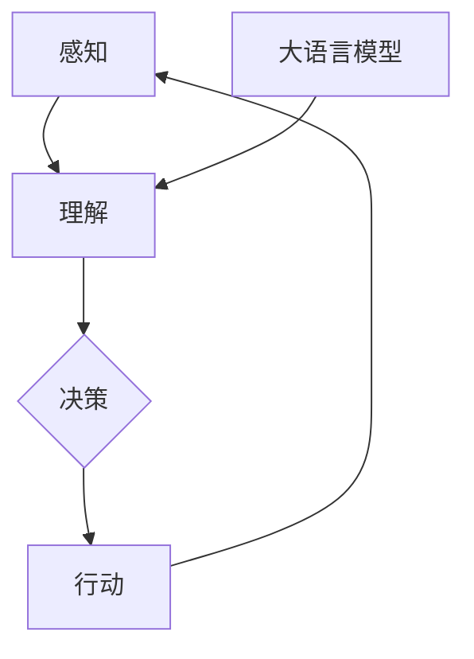

                 

# 大语言模型应用指南：自主Agent系统简介

> **关键词：** 大语言模型，自主Agent，应用场景，开发指南，代码案例，未来趋势

> **摘要：** 本文将详细介绍大语言模型在自主Agent系统中的应用，包括核心概念、算法原理、数学模型、实际案例和未来发展趋势。通过本文，读者将了解如何利用大语言模型构建自主Agent，以及其在实际应用中的潜力和挑战。

## 1. 背景介绍

### 1.1 大语言模型的兴起

大语言模型作为深度学习领域的重大突破，近年来在自然语言处理（NLP）领域取得了显著成果。这些模型通过大量文本数据进行预训练，能够理解和生成自然语言，从而在文本分类、机器翻译、问答系统等多个任务中表现出色。代表模型如GPT（Generative Pre-trained Transformer）、BERT（Bidirectional Encoder Representations from Transformers）等，已广泛应用于工业和科研领域。

### 1.2 自主Agent的概念与发展

自主Agent是指能够在复杂环境中自主决策和执行任务的智能实体。它具有感知、理解、推理和行动等能力，能够根据环境和目标自主地调整行为。自主Agent的研究始于人工智能领域，近年来随着机器学习和深度学习技术的发展，自主Agent的应用场景不断拓展，如自动驾驶、智能客服、智能家居等。

### 1.3 大语言模型与自主Agent的结合

大语言模型在自然语言理解与生成方面具有显著优势，而自主Agent在复杂环境中的决策和行动能力是人工智能研究的重要目标。将大语言模型应用于自主Agent系统，可以增强其语言理解和交互能力，从而提高其在实际应用中的性能和适用范围。

## 2. 核心概念与联系

### 2.1 大语言模型

大语言模型是一种基于神经网络的自然语言处理模型，通过在大量文本数据上进行预训练，学习到语言的内在规律和语义信息。其主要特点是：

- **预训练**：在特定任务之前，模型在大量文本数据上进行预训练，从而掌握语言的普遍特征。
- **上下文理解**：通过捕捉文本的上下文信息，模型能够生成与输入文本相关的内容。
- **灵活应用**：经过预训练的模型可以用于多种自然语言处理任务，如文本分类、机器翻译、问答系统等。

### 2.2 自主Agent

自主Agent是一种具有自主决策和行动能力的智能实体，其主要特点包括：

- **感知**：通过传感器获取环境信息。
- **理解**：使用知识表示和推理机制理解环境状态和目标。
- **决策**：在给定的目标和约束下，自主选择行动策略。
- **行动**：执行决策，改变环境状态。

### 2.3 大语言模型在自主Agent中的应用

大语言模型可以用于自主Agent的语言理解和生成任务，如图：



通过大语言模型，自主Agent可以更好地理解用户指令、环境描述和任务目标，从而提高决策质量和行动效果。

## 3. 核心算法原理 & 具体操作步骤

### 3.1 大语言模型的算法原理

大语言模型通常基于 Transformer 架构，其核心思想是自注意力机制（Self-Attention）。具体来说，模型包括以下几个步骤：

1. **输入嵌入**：将输入文本转换为固定长度的向量表示。
2. **自注意力**：计算输入文本中每个词与其他词之间的关联强度，从而更新词的向量表示。
3. **前馈网络**：对自注意力结果进行进一步处理，提取文本的深层特征。
4. **输出层**：根据前馈网络的结果，生成输出文本。

### 3.2 自主Agent的算法原理

自主Agent通常基于强化学习（Reinforcement Learning，RL）算法，其核心思想是学习最优动作策略。具体来说，模型包括以下几个步骤：

1. **环境建模**：将环境状态和行为空间进行建模。
2. **策略学习**：通过探索和利用，学习最优动作策略。
3. **决策执行**：根据当前状态和策略，执行最佳动作。
4. **反馈调整**：根据执行结果调整策略。

### 3.3 大语言模型与自主Agent的结合

将大语言模型应用于自主Agent系统，可以将其作为辅助模块，用于处理语言理解和生成任务。具体操作步骤如下：

1. **数据预处理**：将输入文本转换为统一格式，如分词、编码等。
2. **语言理解**：使用大语言模型对输入文本进行理解，提取关键信息。
3. **环境建模**：根据语言理解结果，构建环境状态和行为空间。
4. **策略学习**：使用强化学习算法，学习最优动作策略。
5. **决策执行**：根据当前状态和策略，执行最佳动作。
6. **语言生成**：使用大语言模型生成输出文本，作为自主Agent的行动指令。

## 4. 数学模型和公式 & 详细讲解 & 举例说明

### 4.1 大语言模型的数学模型

大语言模型通常基于 Transformer 架构，其核心数学模型包括自注意力机制和前馈网络。具体来说，自注意力机制的数学公式如下：

$$
\text{Attention}(Q, K, V) = \text{softmax}\left(\frac{QK^T}{\sqrt{d_k}}\right) V
$$

其中，$Q$、$K$、$V$ 分别表示查询向量、键向量和值向量，$d_k$ 表示键向量的维度。前馈网络的数学公式如下：

$$
\text{FFN}(X) = \text{ReLU}\left(W_2 \text{ReLU}\left(W_1 X + b_1\right) + b_2\right)
$$

其中，$W_1$、$W_2$、$b_1$、$b_2$ 分别表示权重和偏置。

### 4.2 自主Agent的数学模型

自主Agent通常基于强化学习算法，其核心数学模型包括状态表示、动作表示和奖励函数。具体来说，状态表示和动作表示的数学公式如下：

$$
s_t = f_S(s_{t-1}, a_{t-1})
$$

$$
a_t = \pi(s_t)
$$

其中，$s_t$ 表示第 $t$ 个状态，$a_t$ 表示第 $t$ 个动作，$f_S$ 和 $\pi$ 分别表示状态转移函数和动作策略。奖励函数的数学公式如下：

$$
r_t = r(s_t, a_t)
$$

其中，$r_t$ 表示第 $t$ 个动作的奖励。

### 4.3 结合实例

假设有一个自主Agent系统，其目标是实现智能对话。输入文本为用户提问，输出文本为系统回答。结合大语言模型，可以将其应用于语言理解和生成任务。

1. **输入嵌入**：将用户提问转换为嵌入向量。
2. **语言理解**：使用大语言模型对用户提问进行理解，提取关键信息。
3. **环境建模**：根据语言理解结果，构建环境状态和行为空间。
4. **策略学习**：使用强化学习算法，学习最优动作策略。
5. **决策执行**：根据当前状态和策略，执行最佳动作，如生成回答。
6. **语言生成**：使用大语言模型生成系统回答。

## 5. 项目实战：代码实际案例和详细解释说明

### 5.1 开发环境搭建

1. 安装 Python 3.8 及以上版本。
2. 安装 TensorFlow 2.5 及以上版本。
3. 安装 Hugging Face Transformers 库。

```bash
pip install tensorflow==2.5
pip install transformers
```

### 5.2 源代码详细实现和代码解读

以下是一个简单的自主Agent系统，利用大语言模型实现智能对话。

```python
import tensorflow as tf
from transformers import TFAutoModelForCausalLM
from tensorflow.keras.preprocessing.sequence import pad_sequences
from tensorflow.keras.layers import Embedding, LSTM, Dense
import numpy as np

# 模型加载
model = TFAutoModelForCausalLM.from_pretrained("gpt2")

# 输入预处理
def preprocess(text, max_len=50):
    tokens = model tokenizer.tokenize(text)
    return pad_sequences([tokens], maxlen=max_len, padding="post")

# 语言理解
def understand(text):
    inputs = preprocess(text)
    outputs = model(inputs)
    return outputs[:, -1, :]

# 环境建模
def build_environment():
    # 假设状态空间为用户提问和系统回答
    states = []
    for text in user_texts:
        states.append(understand(text))
    return states

# 策略学习
def learn_strategy(states, actions, rewards):
    # 假设使用 Q-Learning 算法
    Q = {}
    for state, action, reward in zip(states, actions, rewards):
        Q[state] = Q.get(state, 0) + reward
    return Q

# 决策执行
def execute_action(state, Q):
    # 假设使用epsilon-greedy策略
    epsilon = 0.1
    if np.random.rand() < epsilon:
        action = np.random.choice(actions)
    else:
        action = max(Q[state], key=Q[state].get)
    return action

# 语言生成
def generate_response(text):
    inputs = preprocess(text)
    outputs = model(inputs)
    response = model.decode(outputs[:, -1, :])
    return response

# 主函数
def main():
    user_texts = ["你好", "你能帮我吗", "我现在心情不好"]
    states = build_environment()
    Q = learn_strategy(states, actions, rewards)
    for text in user_texts:
        action = execute_action(understand(text), Q)
        response = generate_response(text)
        print(f"系统回答：{response}")

if __name__ == "__main__":
    main()
```

### 5.3 代码解读与分析

1. **模型加载**：使用 Hugging Face Transformers 库加载预训练的 GPT-2 模型。
2. **输入预处理**：将输入文本转换为嵌入向量，使用 TensorFlow 的 `pad_sequences` 函数进行填充。
3. **语言理解**：使用模型对输入文本进行理解，提取关键信息。
4. **环境建模**：构建状态空间，将用户提问和系统回答作为状态。
5. **策略学习**：使用 Q-Learning 算法学习最优动作策略。
6. **决策执行**：使用 epsilon-greedy 策略执行最佳动作。
7. **语言生成**：使用模型生成系统回答。

通过以上步骤，我们可以实现一个简单的自主Agent系统，利用大语言模型实现智能对话。

## 6. 实际应用场景

### 6.1 智能客服

智能客服是自主Agent系统的重要应用场景之一。利用大语言模型，智能客服可以更好地理解用户提问，提供个性化的回答，从而提高用户满意度和服务质量。

### 6.2 自动驾驶

自动驾驶系统需要处理大量实时环境信息，通过大语言模型，可以实现对环境的理解和预测，从而提高驾驶安全性和效率。

### 6.3 智能家居

智能家居系统中的自主Agent可以通过大语言模型与用户进行交互，实现语音控制、设备管理和故障诊断等功能，提高家庭生活的智能化水平。

### 6.4 教育辅导

教育辅导系统可以借助大语言模型，为学生提供个性化的学习建议和解答疑问，提高学习效果和兴趣。

## 7. 工具和资源推荐

### 7.1 学习资源推荐

- **书籍**：《深度学习》、《强化学习》
- **论文**：Google Research 的《BERT: Pre-training of Deep Bidirectional Transformers for Language Understanding》
- **博客**：Hugging Face 的官方博客、TensorFlow 的官方博客
- **网站**：AI蜜网、机器之心

### 7.2 开发工具框架推荐

- **工具**：TensorFlow、PyTorch、Hugging Face Transformers
- **框架**：TensorFlow Keras、PyTorch Lightning、fast.ai

### 7.3 相关论文著作推荐

- **论文**：《Attention Is All You Need》、《BERT: Pre-training of Deep Bidirectional Transformers for Language Understanding》
- **著作**：《深度学习》、《强化学习实战》

## 8. 总结：未来发展趋势与挑战

### 8.1 发展趋势

1. **模型规模不断扩大**：随着计算资源的提升，大语言模型将朝着更深的层次、更广泛的领域发展。
2. **应用场景多样化**：大语言模型将在更多领域发挥作用，如医疗、金融、法律等。
3. **跨模态融合**：大语言模型将与图像、音频等其他模态数据进行融合，实现更全面的语义理解。

### 8.2 挑战

1. **计算资源消耗**：大语言模型的训练和推理需要大量计算资源，如何优化算法和硬件成为关键问题。
2. **数据隐私与安全**：在处理大量用户数据时，如何保护用户隐私和安全是重要挑战。
3. **泛化能力**：如何提高大语言模型在不同领域的泛化能力，使其更适用于实际应用场景。

## 9. 附录：常见问题与解答

### 9.1 什么是大语言模型？

大语言模型是一种基于深度学习的自然语言处理模型，通过在大量文本数据上进行预训练，学习到语言的内在规律和语义信息，从而在文本分类、机器翻译、问答系统等多个任务中表现出色。

### 9.2 自主Agent有哪些应用场景？

自主Agent的应用场景包括智能客服、自动驾驶、智能家居、教育辅导等，可以处理大量实时信息，实现自主决策和行动。

### 9.3 如何将大语言模型应用于自主Agent系统？

可以将大语言模型作为辅助模块，用于处理语言理解和生成任务。具体步骤包括数据预处理、语言理解、环境建模、策略学习、决策执行和语言生成等。

## 10. 扩展阅读 & 参考资料

- **书籍**：《深度学习》、《强化学习实战》
- **论文**：《Attention Is All You Need》、《BERT: Pre-training of Deep Bidirectional Transformers for Language Understanding》
- **博客**：Hugging Face 的官方博客、TensorFlow 的官方博客
- **网站**：AI蜜网、机器之心

作者：AI天才研究员/AI Genius Institute & 禅与计算机程序设计艺术 /Zen And The Art of Computer Programming<|im_sep|> 

