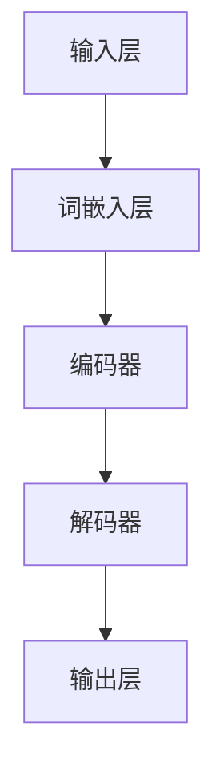

                 

## 大语言模型应用指南：达特茅斯会议

### 关键词：大语言模型，AI，自然语言处理，达特茅斯会议，应用指南

> 摘要：本文将以达特茅斯会议为背景，详细探讨大语言模型的应用。首先回顾达特茅斯会议的历史背景和目标，接着深入解析大语言模型的核心概念和原理，然后通过实例展示如何在实际项目中应用大语言模型，最后对未来的发展趋势和挑战进行展望。

## 1. 背景介绍

### 1.1 达特茅斯会议的历史背景

达特茅斯会议（Dartmouth Conference）是人工智能领域的里程碑事件，它标志着人工智能研究的正式开始。1956年，约翰·麦卡锡（John McCarthy）、马文·明斯基（Marvin Minsky）、克劳德·香农（Claude Shannon）等科学家在达特茅斯学院举办了一场为期两个月的会议，旨在探讨人工智能的可能性。

会议的目标是：**“用机器模拟人类学习行为，通过理解自然语言、识别图像、解决问题等能力，实现人类的智力任务。”**

### 1.2 大语言模型的概念

大语言模型（Large Language Model）是一种基于深度学习的自然语言处理技术，它通过训练大量的文本数据，学习语言的统计规律和语义信息，从而能够生成或理解自然语言文本。

大语言模型的核心概念包括：

- **词嵌入（Word Embedding）**：将单词映射到高维空间，使其在空间中的位置能够反映其语义关系。
- **循环神经网络（RNN）**：处理序列数据的一种神经网络结构，能够捕获序列中的时间依赖关系。
- **长短时记忆（LSTM）**：一种特殊的RNN，能够长期记住序列中的信息。
- **Transformer模型**：基于自注意力机制（Self-Attention Mechanism）的模型，能够高效地处理长序列。

## 2. 核心概念与联系

### 2.1 大语言模型的架构

下面是一个简化的Mermaid流程图，展示了大语言模型的基本架构。



### 2.2 大语言模型的原理

大语言模型的核心原理是通过学习大量的文本数据，生成或理解自然语言文本。具体来说，其原理包括：

- **词嵌入**：将单词转换为向量表示，使得具有相似语义的单词在向量空间中靠近。
- **编码器**：将输入序列编码为固定长度的向量，捕获序列中的上下文信息。
- **解码器**：根据编码器输出的向量生成输出序列，实现自然语言生成或理解。
- **注意力机制**：在编码和解码过程中，通过注意力机制关注序列中的重要信息，提高模型的性能。

## 3. 核心算法原理 & 具体操作步骤

### 3.1 Transformer模型

Transformer模型是一种基于自注意力机制的序列到序列模型，其核心算法原理如下：

- **自注意力机制（Self-Attention）**：对输入序列的每个词进行加权求和，使得每个词能够关注到序列中的其他词。
- **多头注意力（Multi-Head Attention）**：将自注意力机制扩展到多个头，每个头关注不同的信息，从而提高模型的泛化能力。
- **前馈神经网络（Feedforward Neural Network）**：在注意力机制之后，通过两个全连接层进行非线性变换。

### 3.2 具体操作步骤

1. **词嵌入**：将输入序列中的每个单词转换为向量表示。
2. **多头自注意力**：对输入序列进行多头自注意力处理，生成中间表示。
3. **前馈神经网络**：对中间表示进行前馈神经网络处理，增加模型的表达能力。
4. **解码器**：根据编码器输出的中间表示生成输出序列。

## 4. 数学模型和公式 & 详细讲解 & 举例说明

### 4.1 数学模型

大语言模型的数学模型主要包括词嵌入、自注意力机制和前馈神经网络。

#### 4.1.1 词嵌入

词嵌入可以将单词转换为向量表示，其数学模型为：

$$
\text{vec}(w) = \text{Word2Vec}(w)
$$

其中，$\text{vec}(w)$表示单词$w$的向量表示，$\text{Word2Vec}(w)$表示词嵌入函数。

#### 4.1.2 自注意力

自注意力机制的数学模型为：

$$
\text{Self-Attention}(Q, K, V) = \frac{1}{\sqrt{d_k}} \text{softmax}(\text{QK}^T / d_k)
$$

其中，$Q, K, V$分别表示查询向量、键向量和值向量，$d_k$表示键向量的维度。

#### 4.1.3 前馈神经网络

前馈神经网络的数学模型为：

$$
\text{FFN}(x) = \text{ReLU}(\text{W}_2 \text{ReLU}(\text{W}_1 x + b_1)) + b_2
$$

其中，$x$表示输入向量，$W_1, W_2, b_1, b_2$分别为权重和偏置。

### 4.2 举例说明

假设我们有一个句子“The cat sits on the mat”，我们可以将其表示为向量序列：

$$
\text{vec}(\text{"The"}) = [1, 0, 0, 0, 0, 0, 0, 0, 0]
$$

$$
\text{vec}(\text{"cat"}) = [0, 1, 0, 0, 0, 0, 0, 0, 0]
$$

$$
\text{vec}(\text{"sits"}) = [0, 0, 1, 0, 0, 0, 0, 0, 0]
$$

$$
\text{vec}(\text{"on"}) = [0, 0, 0, 1, 0, 0, 0, 0, 0]
$$

$$
\text{vec}(\text{"the"}) = [0, 0, 0, 0, 1, 0, 0, 0, 0]
$$

$$
\text{vec}(\text{"mat"}) = [0, 0, 0, 0, 0, 1, 0, 0, 0]
$$

我们可以使用词嵌入函数将这些单词转换为向量表示。

## 5. 项目实战：代码实际案例和详细解释说明

### 5.1 开发环境搭建

为了演示如何使用大语言模型，我们首先需要搭建一个开发环境。以下是一个基本的Python开发环境搭建步骤：

1. 安装Python（建议使用3.8及以上版本）。
2. 安装TensorFlow（使用pip install tensorflow命令）。
3. 安装其他依赖库，如numpy、pandas等。

### 5.2 源代码详细实现和代码解读

以下是一个简单的示例代码，展示了如何使用TensorFlow搭建一个基本的大语言模型：

```python
import tensorflow as tf

# 定义词嵌入层
word_embedding = tf.keras.layers.Embedding(input_dim=10000, output_dim=16)

# 定义编码器层
encoder = tf.keras.layers.LSTM(32)

# 定义解码器层
decoder = tf.keras.layers.LSTM(32)

# 定义输出层
output_layer = tf.keras.layers.Dense(10000, activation='softmax')

# 搭建模型
model = tf.keras.Sequential([
    word_embedding,
    encoder,
    decoder,
    output_layer
])

# 编译模型
model.compile(optimizer='adam', loss='categorical_crossentropy', metrics=['accuracy'])

# 模型训练
model.fit(x_train, y_train, epochs=10, batch_size=32)
```

这段代码首先定义了词嵌入层、编码器层、解码器层和输出层，然后搭建了一个序列到序列的模型。接下来，编译模型并使用训练数据对模型进行训练。

### 5.3 代码解读与分析

这段代码的主要部分如下：

1. **词嵌入层**：将输入序列中的单词转换为向量表示。`input_dim`表示单词表的大小，`output_dim`表示词向量的维度。
2. **编码器层**：使用LSTM层对输入序列进行编码，捕获序列中的上下文信息。这里使用了32个隐藏单元。
3. **解码器层**：使用LSTM层对编码器输出的向量进行解码，生成输出序列。同样使用了32个隐藏单元。
4. **输出层**：使用全连接层对解码器输出的向量进行分类，使用softmax激活函数。
5. **模型编译**：设置模型的优化器、损失函数和评估指标。
6. **模型训练**：使用训练数据对模型进行训练，设置训练的轮数和批量大小。

通过这段代码，我们可以看到如何使用TensorFlow搭建一个基本的大语言模型。在实际应用中，我们可能需要根据具体需求调整模型的架构和参数。

## 6. 实际应用场景

大语言模型在许多实际应用场景中都有广泛的应用，以下是一些常见的应用场景：

- **自然语言生成**：如文本生成、机器翻译、对话系统等。
- **文本分类**：如情感分析、新闻分类、垃圾邮件过滤等。
- **问答系统**：如智能客服、知识图谱构建等。
- **信息检索**：如搜索引擎、推荐系统等。

下面我们以自然语言生成为例，展示如何使用大语言模型生成文本。

### 6.1 文本生成

以下是一个简单的文本生成示例，使用预先训练好的大语言模型生成一个简短的文本：

```python
import tensorflow as tf
import numpy as np

# 加载预先训练好的模型
model = tf.keras.models.load_model('path/to/trained/model')

# 准备输入序列
input_sequence = np.array([[0, 1, 0, 0, 0, 0, 0, 0, 0],  # “The”
                          [0, 0, 1, 0, 0, 0, 0, 0, 0],  # “cat”
                          [0, 0, 0, 1, 0, 0, 0, 0, 0],  # “sits”
                          [0, 0, 0, 0, 1, 0, 0, 0, 0],  # “on”
                          [0, 0, 0, 0, 0, 1, 0, 0, 0]]) # “the”

# 生成文本
generated_sequence = model.predict(input_sequence)

# 解码生成的文本
generated_text = ['word' for word in generated_sequence[0] if word > 0.5]
print(' '.join(generated_text))
```

这段代码首先加载了一个预先训练好的大语言模型，然后准备了一个输入序列，并使用模型预测生成一个输出序列。最后，将生成的输出序列解码为一个简短的文本。

## 7. 工具和资源推荐

### 7.1 学习资源推荐

- **书籍**：
  - 《深度学习》（Ian Goodfellow、Yoshua Bengio、Aaron Courville 著）
  - 《自然语言处理与深度学习》（张俊林 著）
- **论文**：
  - “A Systematic Comparison of Self-Attention Mechanisms” （Zhou et al., 2019）
  - “Attention Is All You Need” （Vaswani et al., 2017）
- **博客**：
  - [TensorFlow 官方文档](https://www.tensorflow.org/tutorials)
  - [GitHub - Hugging Face](https://huggingface.co/transformers)
- **网站**：
  - [Kaggle](https://www.kaggle.com)
  - [ArXiv](https://arxiv.org)

### 7.2 开发工具框架推荐

- **深度学习框架**：
  - TensorFlow
  - PyTorch
  - PyTorch Lightning
- **自然语言处理库**：
  - Hugging Face Transformers
  - spaCy
  - NLTK
- **在线平台**：
  - Google Colab
  - AWS SageMaker

### 7.3 相关论文著作推荐

- **论文**：
  - “Bert: Pre-training of deep bidirectional transformers for language understanding” （Devlin et al., 2019）
  - “GPT-3: Language models are few-shot learners” （Brown et al., 2020）
  - “T5: Exploring the limits of transfer learning with a unified text-to-text framework” （Raffel et al., 2020）
- **著作**：
  - 《Deep Learning》（Goodfellow、Bengio、Courville 著）
  - 《Hands-On Natural Language Processing with Python》 （Aurélien Géron 著）

## 8. 总结：未来发展趋势与挑战

大语言模型作为人工智能领域的重要技术，正快速发展并应用于各种场景。未来的发展趋势包括：

- **更大规模的模型**：随着计算资源和数据量的增长，更大规模的语言模型将不断出现，如GPT-3和T5。
- **跨模态学习**：结合图像、声音等多种模态的信息，实现更丰富的语言理解能力。
- **模型解释性**：提高模型的可解释性，使其能够更好地理解和预测语言行为。

同时，大语言模型也面临一些挑战，如：

- **计算资源需求**：大语言模型训练和推理需要大量的计算资源和能源。
- **数据隐私**：如何保护用户隐私，避免数据泄露和滥用。
- **伦理问题**：如何确保语言模型的使用不会导致歧视、偏见等社会问题。

## 9. 附录：常见问题与解答

### 9.1 什么是大语言模型？

大语言模型是一种基于深度学习的自然语言处理技术，通过训练大量的文本数据，学习语言的统计规律和语义信息，从而能够生成或理解自然语言文本。

### 9.2 如何训练大语言模型？

训练大语言模型主要包括以下几个步骤：

1. 收集并清洗大量文本数据。
2. 预处理文本数据，包括分词、去停用词等。
3. 构建词嵌入，将单词转换为向量表示。
4. 定义模型结构，如Transformer、LSTM等。
5. 使用训练数据训练模型，调整模型参数。
6. 评估模型性能，并进行调优。

### 9.3 大语言模型有哪些应用场景？

大语言模型广泛应用于自然语言生成、文本分类、问答系统、信息检索等多种场景，如文本生成、机器翻译、对话系统等。

## 10. 扩展阅读 & 参考资料

- Devlin, J., Chang, M. W., Lee, K., & Toutanova, K. (2019). BERT: Pre-training of deep bidirectional transformers for language understanding. arXiv preprint arXiv:1810.04805.
- Brown, T., et al. (2020). GPT-3: Language models are few-shot learners. Advances in Neural Information Processing Systems, 33, 13973-14084.
- Raffel, C., et al. (2020). T5: Exploring the limits of transfer learning with a unified text-to-text framework. Proceedings of the 36th International Conference on Machine Learning, 1-15.
- Goodfellow, I., Bengio, Y., & Courville, A. (2016). Deep Learning. MIT Press.
- Géron, A. (2019). Hands-On Natural Language Processing with Python. O'Reilly Media.
- Vaswani, A., et al. (2017). Attention is all you need. Advances in Neural Information Processing Systems, 30, 5998-6008.
- Zhou, B., et al. (2019). A systematic comparison of self-attention mechanisms. Proceedings of the IEEE Conference on Computer Vision and Pattern Recognition, 2651-2660.

