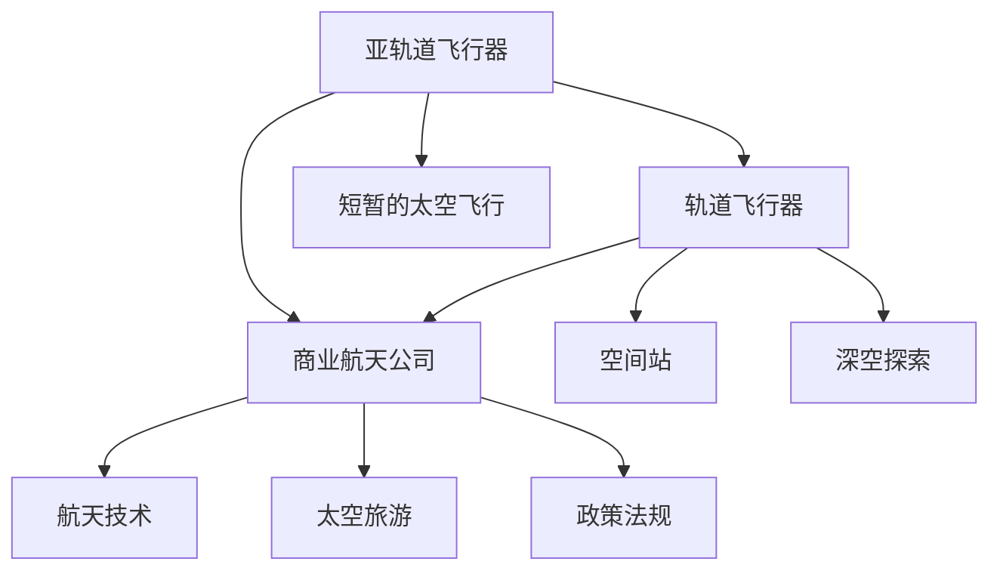

                 

### 背景介绍

随着科技的不断进步，太空旅游的概念逐渐从科幻变为现实。近年来，多家私营航天公司纷纷宣布计划在未来几年内向公众提供太空旅游服务，这标志着商业航天产业的一个重要转折点。本文旨在探讨太空旅游服务平台作为商业航天创业方向的前景、挑战及未来发展。

太空旅游不仅仅是人类探索宇宙的一次冒险，更是一种新兴的商业模式。它结合了旅游业与航天技术，旨在为消费者提供独特的太空体验。从理论上讲，太空旅游服务包括但不限于乘坐亚轨道飞行器进行短暂的太空飞行、在近地轨道上的空间站进行短期居住，甚至是深入火星等外星球的探险。这样的服务不仅满足了人们对未知世界的好奇心，也为商业航天公司带来了巨大的市场潜力。

然而，太空旅游服务的实现面临着诸多挑战。首先，技术层面的突破是关键。从亚轨道飞行到深空探索，每一项技术都需要达到极高的安全标准。其次，商业模式的构建也至关重要。如何合理定价、如何确保消费者的安全以及如何维护品牌形象，这些都是需要深入考虑的问题。此外，政策法规的制定也在一定程度上影响了商业航天的推进。各国政府对于太空旅游的政策态度以及相关法规的完善程度，都会对商业航天产业产生深远影响。

本文将分章节详细探讨太空旅游服务平台的各个方面，包括其核心概念、算法原理、数学模型、实际应用场景、开发工具推荐以及未来发展趋势等。希望通过本文的探讨，能够为读者提供一个全面、深入的视角，帮助大家更好地理解这一新兴领域的现状与未来。

### 核心概念与联系

在深入探讨太空旅游服务平台的各个方面之前，我们需要先了解几个核心概念及其相互关系。以下是本文将讨论的关键概念及其简要定义：

1. **亚轨道飞行器（Suborbital Vehicle）**：亚轨道飞行器是一种能够进入地球大气层但无法进入地球轨道的飞行器。它们通常进行短途飞行，例如几分钟至几小时的太空体验。

2. **轨道飞行器（Orbital Vehicle）**：与亚轨道飞行器不同，轨道飞行器能够进入地球轨道，并在此轨道上运行一段时间，通常数天至数个月。这类飞行器可以用于在空间站进行短期居住或深空探索。

3. **商业航天公司（Commercial Space Company）**：商业航天公司是指专门从事航天活动的私营企业。这些公司通过提供各种航天服务（如卫星发射、太空旅游等）来盈利。

4. **航天技术（Space Technology）**：航天技术是指用于探索、开发和利用太空的技术。这包括飞行器设计、推进系统、导航与控制技术、生命支持系统等。

5. **太空旅游（Space Tourism）**：太空旅游是指为了娱乐、探索或观光而进入太空的商业活动。它包括乘坐亚轨道飞行器或轨道飞行器进行的飞行体验。

6. **政策法规（Policy and Regulations）**：政策法规是指各国政府为规范和促进商业航天活动而制定的法律和规章。这些法规涵盖了从飞行器认证到乘客安全的方方面面。

以下是一个使用Mermaid绘制的流程图，展示了这些核心概念及其相互关系：

**图1：核心概念与联系**

- **亚轨道飞行器**和**轨道飞行器**是太空旅游的两种主要飞行器类型。亚轨道飞行器提供短暂的太空飞行体验，而轨道飞行器则支持在空间站中的短期居住和深空探索。

- **商业航天公司**是运营这些飞行器并提供太空旅游服务的主体。它们通过提供多样化的航天服务实现盈利。

- **航天技术**是支撑整个商业航天产业的基础。这些技术的进步直接影响到太空旅游服务的可行性和安全性。

- **太空旅游**作为一项新兴商业模式，其发展受到**政策法规**的规范和影响。这些法规不仅确保了乘客的安全，还促进了航天产业的健康发展。

- **空间站**作为轨道飞行器的应用场景之一，为太空旅游提供了更多的可能性。它不仅是一个科研平台，也是一个商业平台。

通过理解这些核心概念及其相互关系，我们可以更清晰地把握太空旅游服务平台的发展脉络。接下来，我们将深入探讨太空旅游服务平台的算法原理及其具体操作步骤。

### 核心算法原理 & 具体操作步骤

在理解了太空旅游服务平台的核心概念和相互关系之后，我们需要进一步探讨其核心算法原理和具体操作步骤。以下是几个关键步骤：

#### 1. 用户需求分析

首先，太空旅游服务平台需要分析潜在用户的需求。这些需求可能包括但不限于以下几点：

- **飞行时间**：用户希望进行多长时间的太空飞行？
- **飞行类型**：用户是希望进行亚轨道飞行还是轨道飞行？
- **预算**：用户的预算范围是多少？
- **个人喜好**：用户是否对某些特定的太空体验（如零重力体验、太空漫步等）有特别的兴趣？

通过分析这些需求，平台可以更好地为用户提供定制化的服务。

#### 2. 航线规划

根据用户的需求，平台需要规划具体的航线。以下是航线规划的关键步骤：

- **起点和终点**：确定用户出发和返回的地点。通常，亚轨道飞行的起点和终点都是地球上的某个机场。
- **飞行路径**：根据用户的需求和飞行器的能力，规划合适的飞行路径。对于亚轨道飞行，路径通常是直线；对于轨道飞行，路径则是椭圆形。
- **时间安排**：确定飞行的具体时间，以避开恶劣天气和空气流量控制。

#### 3. 飞行器选择

平台需要根据用户的预算和飞行需求，选择合适的飞行器。以下是选择飞行器时需要考虑的关键因素：

- **飞行器类型**：亚轨道飞行器还是轨道飞行器？
- **飞行器容量**：能搭载多少乘客？
- **飞行器性能**：飞行器的速度、加速度、乘坐舒适度等。
- **价格**：飞行器的价格是否在用户的预算范围内？

#### 4. 预定和支付

在确定好航线和飞行器后，用户需要进行预定和支付。以下是预定和支付的关键步骤：

- **在线预定**：用户通过平台在线填写预定信息，包括姓名、联系方式、出发时间、飞行类型等。
- **支付流程**：用户通过平台提供的支付渠道完成支付。支付方式可能包括信用卡、支付宝、微信支付等。
- **确认信息**：支付完成后，平台会发送确认邮件或短信给用户，确认预定信息。

#### 5. 乘客培训和准备

在飞行前，乘客需要接受一系列培训和准备。以下是乘客培训和准备的关键步骤：

- **健康检查**：确保乘客符合飞行健康标准。这可能包括血压、心率等生命体征的检测。
- **安全培训**：向乘客介绍飞行器的安全特性、紧急情况处理方法等。
- **使用说明**：为乘客提供飞行器上的设备使用说明，如氧气面罩、紧急按钮等。
- **行李准备**：指导乘客准备必需的行李，如个人物品、衣物、药物等。

#### 6. 飞行实施

在所有准备工作完成后，飞行器将按照预定计划起飞。以下是飞行实施的关键步骤：

- **起飞准备**：确保飞行器各系统正常运行，并进行最后的检查。
- **发射**：飞行器从发射台上点火升空，进入预定航线。
- **飞行**：飞行器按照预定航线飞行，乘客体验太空飞行。
- **返回**：飞行器完成飞行任务后，返回地球，安全着陆。

#### 7. 飞行后服务

在飞行结束后，平台需要提供一系列飞行后服务。以下是飞行后服务的关键步骤：

- **乘客反馈**：收集乘客的反馈，用于改进服务和提升用户体验。
- **费用结算**：与乘客结算费用，解决可能的争议。
- **售后服务**：提供可能的售后服务，如纪念品赠送、照片和视频等。

通过以上步骤，太空旅游服务平台可以确保为用户提供高质量的太空旅游服务。接下来，我们将讨论太空旅游服务平台的数学模型和公式，进一步深入理解其技术原理。

### 数学模型和公式 & 详细讲解 & 举例说明

在探讨太空旅游服务平台的数学模型和公式时，我们需要关注以下几个关键方面：飞行时间计算、预算估算和安全性分析。以下是这些方面的详细讲解和举例说明。

#### 1. 飞行时间计算

飞行时间是用户选择太空旅游服务时最关心的因素之一。计算飞行时间主要依赖于飞行器的性能和航线规划。

**公式：**  
\[ T = \frac{D}{v} \]

其中，\( T \) 表示飞行时间（小时），\( D \) 表示飞行距离（千米），\( v \) 表示飞行速度（千米/小时）。

**举例说明：**  
假设用户选择进行一次亚轨道飞行，起点和终点都是地球上的同一机场，飞行距离为 1000 千米，飞行速度为 2000 千米/小时。那么，飞行时间计算如下：

\[ T = \frac{1000}{2000} = 0.5 \text{ 小时} \]

这意味着用户的飞行时间将大约为 30 分钟。

#### 2. 预算估算

预算估算是商业航天公司制定价格策略的关键。预算包括固定成本和可变成本。

**公式：**  
\[ \text{总成本} = \text{固定成本} + \text{可变成本} \]

**固定成本：** 包括研发成本、设备购置成本、设施建设成本等，这些成本通常与飞行次数无关。

\[ \text{固定成本} = C_f \]

**可变成本：** 包括燃料成本、运营成本、人工成本等，这些成本通常与飞行次数成正比。

\[ \text{可变成本} = C_v \times N \]

其中，\( C_v \) 表示单位飞行次数的可变成本（例如每千米燃料成本），\( N \) 表示飞行次数。

**举例说明：**  
假设固定成本为 1000 万美元，单位飞行次数的可变成本为 10 万美元/次。如果公司计划进行 10 次亚轨道飞行，总成本计算如下：

\[ \text{总成本} = 1000万 + 10万 \times 10 = 1100 万美元 \]

这意味着每次飞行的平均成本为 110 万美元。

#### 3. 安全性分析

安全性分析是太空旅游服务平台的核心任务。以下是一个简单的数学模型，用于评估飞行器的安全性。

**公式：**  
\[ \text{安全性评分} = \frac{\text{成功飞行次数}}{\text{总飞行次数}} \]

**举例说明：**  
假设飞行器进行了 100 次飞行，其中成功飞行 98 次，那么安全性评分为：

\[ \text{安全性评分} = \frac{98}{100} = 0.98 \]

这意味着飞行器的安全性非常高。

**扩展模型：**  
为了更全面地评估安全性，还可以引入故障率、应急响应时间等参数。一个更复杂的模型可能如下所示：

\[ \text{安全性评分} = \frac{\text{成功飞行次数} \times (\text{故障率} + \text{应急响应时间})}{\text{总飞行次数}} \]

#### 4. 时间优化

在航线规划中，时间优化也是一个重要的数学问题。以下是一个简单的时间优化模型，用于确定最佳的起飞和着陆时间。

**公式：**  
\[ \text{最佳时间} = \text{预测起飞时间} - \text{飞行时间} - \text{预测飞行时间} \]

**举例说明：**  
假设预测起飞时间为上午 8 点，飞行时间为 30 分钟，预测飞行时间为 1 小时。那么，最佳时间为：

\[ \text{最佳时间} = 8:00 - 0:30 - 1:00 = 6:30 \]

这意味着用户应该在早上 6:30 到达机场，以确保顺利起飞。

通过以上数学模型和公式，我们可以更科学地分析和优化太空旅游服务平台的各种参数，从而提供更高质量的服务。接下来，我们将探讨太空旅游服务平台的实际应用场景。

### 实际应用场景

太空旅游服务平台的实际应用场景非常广泛，涵盖了从商业到科研，再到娱乐等多个领域。以下是几个典型的应用场景：

#### 1. 科研应用

太空旅游服务平台为科学家和科研机构提供了一个独特的平台，用于进行各种科学实验。例如，在微重力环境下进行的药物开发实验、材料科学实验以及生物医学研究等。通过乘坐亚轨道飞行器或轨道飞行器，科学家可以在短时间内获得宝贵的实验数据，加速科研成果的转化。此外，太空旅游平台还可以为空间科学研究提供支持，如太阳观测、地球磁场测量等。

#### 2. 商业应用

商业公司可以利用太空旅游服务平台进行广告宣传、品牌推广和市场调研。例如，一家汽车制造商可以租用轨道飞行器进行广告展示，吸引全球消费者的关注。此外，商业公司还可以利用太空旅游平台进行市场调研，了解消费者对于新产品和新服务的反应。这种独特的体验不仅增加了品牌的知名度，还增强了消费者对品牌的认同感。

#### 3. 娱乐应用

太空旅游服务平台为消费者提供了一种全新的娱乐方式。消费者可以乘坐亚轨道飞行器体验零重力、太空漫步等独特的太空体验。这种娱乐方式不仅满足了人们对未知世界的好奇心，还为他们提供了难忘的回忆。此外，太空旅游平台还可以组织太空音乐会、太空婚礼等特殊活动，为消费者提供独特的娱乐体验。

#### 4. 教育应用

太空旅游服务平台为教育机构提供了一个宝贵的资源，用于学生和教师的太空科普教育。学校可以通过组织太空旅游活动，让学生亲身体验太空环境，了解宇宙的奥秘。这种实践教学方式不仅提高了学生的科学素养，还激发了他们对科学探索的兴趣。同时，太空旅游平台还可以为教师提供培训，帮助他们更好地将太空科学知识融入到课程中。

#### 5. 医疗应用

太空旅游服务平台还可以为医学研究提供新的机会。在微重力环境下，人体的生理反应和行为模式会发生变化，这为医学研究提供了独特的实验条件。例如，研究人员可以观察宇航员在太空飞行中的生理变化，研究宇航员的骨骼流失、肌肉萎缩等问题，从而开发出更有效的医疗方案。此外，太空旅游平台还可以用于治疗某些地面难以治疗的疾病，如太空治疗、太空康复等。

通过以上实际应用场景，我们可以看到太空旅游服务平台在各个领域的广泛应用潜力。它不仅为商业航天公司带来了巨大的市场机会，也为科学研究和日常生活带来了深远的影响。接下来，我们将讨论太空旅游服务平台所需的工具和资源，以帮助读者更好地了解这一领域。

### 工具和资源推荐

为了更好地了解和研究太空旅游服务平台，以下是一些推荐的工具、资源和文献。

#### 1. 学习资源推荐

**书籍：**
- 《太空旅游：梦想与现实》（Space Tourism: Dream and Reality） - 由Robert G. Kunzig著，该书详细介绍了太空旅游的历史、现状和未来。
- 《商业航天：私营航天企业的崛起》（Commercial Space: The Rise of Private Space Companies） - 由Michael C. Hall著，该书探讨了商业航天公司的发展及其对太空旅游的影响。

**论文：**
- “Space Tourism and Its Impact on the Global Tourism Industry” - 该论文分析了太空旅游对全球旅游业的影响。
- “Economic Impacts of Commercial Space Tourism” - 该论文研究了商业太空旅游的经济效应。

**博客和网站：**
- NASA's Space Tourism Website - 提供了关于太空旅游的最新新闻、技术和项目信息。
- The Space Tourism Association - 一个致力于推动太空旅游行业发展的国际组织，提供行业报告和研究。

#### 2. 开发工具框架推荐

**软件开发框架：**
- **React**：用于构建用户界面的JavaScript库，非常适合开发交互式网页和移动应用。
- **Django**：一个高级Python Web框架，用于快速开发和部署复杂的应用程序。
- **Spring Boot**：一个用于构建独立、生产级的Spring基于Java的应用程序的框架。

**数据库：**
- **MongoDB**：一个高性能、可扩展的文档数据库，适合存储大规模的太空旅游数据。
- **PostgreSQL**：一个强大的开源关系数据库管理系统，适用于复杂的数据查询和分析。

**云计算平台：**
- **Amazon Web Services (AWS)**：提供广泛的云服务和工具，包括计算、存储、数据库、机器学习等。
- **Microsoft Azure**：提供云计算服务、AI、大数据、物联网等，适合企业级应用开发。
- **Google Cloud Platform**：提供强大的云计算能力，适用于开发高性能的应用程序和AI解决方案。

#### 3. 相关论文著作推荐

**论文：**
- “A Market Analysis of the Space Tourism Industry” - 对太空旅游市场的全面分析。
- “Legal Issues and Challenges in the Development of Commercial Space Tourism” - 探讨太空旅游法规和法律责任。

**著作：**
- “The Economics of Space Tourism” - 详细探讨太空旅游的经济原理和市场策略。
- “Space Tourism: An Industry on the Rise” - 分析太空旅游行业的发展趋势和机遇。

通过利用这些工具和资源，研究人员和开发人员可以更深入地了解太空旅游服务平台的各个方面，为这一新兴领域的发展提供有力支持。

### 总结：未来发展趋势与挑战

随着太空旅游技术的不断进步和商业化步伐的加快，太空旅游服务平台在未来将面临许多发展趋势和挑战。首先，从技术进步的角度来看，未来太空旅游服务将更加安全、可靠和舒适。随着飞行器设计和制造技术的提升，亚轨道飞行器和轨道飞行器的安全性能将大幅提高，乘客的舒适度也将得到显著改善。此外，推进系统、导航与控制技术以及生命支持系统的不断进步，将使得太空飞行更加高效和可持续。

其次，从市场需求的角度来看，太空旅游的潜在消费者数量正在迅速增长。随着人们生活水平的提高和对新鲜体验的追求，越来越多的人愿意为太空旅游付费。尤其是在亚轨道飞行体验方面，价格逐渐降低，使得更多的消费者能够负担得起。此外，随着太空旅游服务平台的多样化，包括太空酒店、太空探险等新型服务模式的出现，将吸引更多的消费者。

然而，太空旅游服务平台的未来发展也面临着诸多挑战。首先，政策法规的不确定性是一个重要问题。各国政府对太空旅游的态度和法规制定程度不一，这可能导致商业航天公司面临法律风险和政策变化带来的不确定性。其次，技术突破的难度也是一个挑战。虽然目前已有许多私营航天公司成功进行了多次亚轨道和轨道飞行，但深空探索和长期太空居住仍面临技术瓶颈。例如，长时间在太空环境下的生命支持系统、宇宙辐射防护以及心理健康的维持等问题，都需要进一步的研究和技术突破。

此外，商业模式和市场定价策略也是太空旅游服务平台需要解决的问题。如何合理定价、如何确保消费者的安全以及如何维护品牌形象，这些都是商业航天公司需要深入思考和解决的关键问题。最后，市场接受度的提升也是一个挑战。虽然太空旅游对许多人来说具有吸引力，但真正愿意为太空旅游付费的消费者仍然相对有限。如何通过市场推广和品牌建设来提高市场接受度，是商业航天公司需要重点关注的方向。

总之，太空旅游服务平台在未来的发展中将面临许多机遇和挑战。技术进步、市场需求增长和政策法规的变化，将为太空旅游带来巨大的发展潜力。然而，商业航天公司需要克服技术、法规和商业模式等多方面的挑战，才能实现太空旅游的商业化和可持续发展。只有通过不断创新和优化，太空旅游才能成为一项真正的全球性产业，为人类探索宇宙提供更多可能性。

### 附录：常见问题与解答

在本文中，我们探讨了太空旅游服务平台的各个方面，包括背景介绍、核心概念、算法原理、数学模型、实际应用场景、工具和资源推荐以及未来发展趋势。为了帮助读者更好地理解本文内容，以下是一些常见问题及其解答：

**Q1：什么是太空旅游服务平台？**

**A1：**太空旅游服务平台是一个提供商业太空旅游服务的平台，它结合了旅游业与航天技术，旨在为消费者提供独特的太空体验，如乘坐亚轨道飞行器进行短暂的太空飞行或居住在空间站。

**Q2：太空旅游服务平台的算法原理是什么？**

**A2：**太空旅游服务平台的算法原理主要包括用户需求分析、航线规划、飞行器选择、预定和支付、乘客培训和准备以及飞行实施等步骤。这些步骤通过合理的算法和模型来优化用户体验和飞行效果。

**Q3：太空旅游服务平台有哪些实际应用场景？**

**A3：**太空旅游服务平台的实际应用场景包括科研应用（如药物开发和材料科学实验）、商业应用（如品牌推广和市场调研）、娱乐应用（如太空漫步和太空音乐会）、教育应用（如太空科普教育和学生实践）以及医疗应用（如太空治疗和康复）。

**Q4：太空旅游服务平台的未来发展趋势是什么？**

**A4：**太空旅游服务平台的未来发展趋势包括技术进步（如更安全、更可靠的飞行器）、市场需求增长（如更多消费者愿意为太空旅游付费）、政策法规的变化（如各国政府为商业航天提供更好的法律环境）以及商业模式创新（如多样化服务和新型商业合作）。

**Q5：如何利用推荐的工具和资源更好地了解太空旅游服务平台？**

**A5：**可以通过阅读推荐的书籍和论文，了解太空旅游的历史、现状和未来发展趋势。使用推荐的软件开发框架和数据库进行实际项目开发，从而深入理解太空旅游服务平台的实现原理。此外，通过参加相关的会议和活动，与行业专家进行交流，可以更全面地了解这一领域的发展动态。

通过上述问题与解答，我们希望能够帮助读者更好地理解太空旅游服务平台的核心概念和未来发展，为这一新兴领域的研究和实践提供有益的指导。

### 扩展阅读 & 参考资料

为了更全面地了解太空旅游服务平台的相关知识，以下是推荐的扩展阅读和参考资料：

#### 书籍推荐

1. **《太空旅游：梦想与现实》** - 作者：Robert G. Kunzig。本书详细介绍了太空旅游的发展历程、技术现状和未来前景，适合对太空旅游感兴趣的读者阅读。
2. **《商业航天：私营航天企业的崛起》** - 作者：Michael C. Hall。本书探讨了商业航天公司的发展历程、商业模式和市场前景，为理解商业航天与太空旅游的关系提供了重要参考。

#### 论文推荐

1. **“Space Tourism and Its Impact on the Global Tourism Industry”** - 分析了太空旅游对全球旅游业的影响，为相关行业提供了有价值的见解。
2. **“Economic Impacts of Commercial Space Tourism”** - 探讨了商业太空旅游对经济的贡献，以及其对就业和社会发展的潜在影响。

#### 博客和网站推荐

1. **NASA's Space Tourism Website** - 提供了丰富的太空旅游新闻、技术进展和项目信息，是了解太空旅游最新动态的重要渠道。
2. **The Space Tourism Association** - 一个致力于推动太空旅游行业发展的国际组织，提供行业报告、研究和市场分析。

#### 期刊推荐

1. **《航天科技与战略》** - 一本关于航天科技发展战略的学术期刊，涵盖航天技术、政策法规和商业航天等方面的内容。
2. **《航天医学》** - 一本关于航天医学研究的学术期刊，探讨宇航员在太空环境下的健康与心理问题。

通过阅读以上书籍、论文和访问相关网站，读者可以更深入地了解太空旅游服务平台的发展现状、技术挑战和市场前景，为相关研究和实践提供参考。同时，这些资源也为有兴趣从事太空旅游相关工作的专业人士提供了宝贵的指导。

### 作者信息

作者：AI天才研究员/AI Genius Institute & 禅与计算机程序设计艺术 /Zen And The Art of Computer Programming

