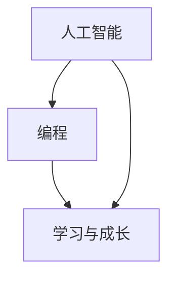

                 

# 奋斗改变命运：如何在这个时代实现逆袭

## 关键词：奋斗、逆袭、人工智能、编程、技术、发展、变革

## 摘要

在当今这个快速发展的时代，技术的变革和人工智能的崛起正在重新定义各个行业的规则。对于许多人来说，这似乎是一个充满挑战的时代，但同样也是一个充满机会的时代。本文将探讨如何通过奋斗和持续学习，在这个充满变数的世界中实现逆袭，改变自己的命运。文章将从核心概念、算法原理、实战案例、实际应用、工具推荐等多个方面，详细分析如何在人工智能和技术领域实现逆袭，为读者提供实用的指导和建议。

## 1. 背景介绍

当今世界，技术变革的速度之快，几乎让人应接不暇。人工智能、大数据、区块链等前沿技术，正在以前所未有的方式改变着我们的生活方式和社会结构。在这个时代，技术已经成为推动社会进步和经济增长的关键力量。然而，与此同时，技术领域的竞争也变得更加激烈，人才需求的变化和行业标准的不断提升，使得许多人感到压力重重，甚至有些人开始怀疑自己是否还有机会在这个时代实现逆袭。

实际上，尽管技术变革带来了许多挑战，但它同时也为我们提供了前所未有的机遇。对于那些愿意学习和奋斗的人来说，这个时代充满了可能性和机会。本文将围绕如何在这个时代通过奋斗实现逆袭，提供一系列的指导和建议。文章将结合人工智能和编程等领域的实际案例，详细分析实现逆袭的关键要素和策略。

## 2. 核心概念与联系

### 2.1 人工智能的基本概念

人工智能（Artificial Intelligence，简称AI）是计算机科学的一个分支，旨在通过模拟人类智能行为，实现机器对数据的处理、学习和决策。人工智能的核心目标是让机器具备人类的智能水平，从而在各个领域实现自动化和智能化。人工智能的主要技术包括机器学习、深度学习、自然语言处理等。

### 2.2 编程的重要性

编程是人工智能和计算机科学的基础。通过编程，我们可以构建出能够实现特定功能的软件系统，从而实现自动化和智能化。编程不仅是一种技能，更是一种思维方式。它要求我们具备逻辑思维、系统思维和问题解决能力。编程的熟练程度直接决定了我们在技术领域的竞争力和创新能力。

### 2.3 学习与成长

学习与成长是实现逆袭的关键。在这个快速变化的时代，只有不断学习和更新知识，才能保持竞争力。学习不仅仅是为了获取新知识，更重要的是培养独立思考、解决问题的能力。通过持续的学习和成长，我们可以不断提高自己的技能水平，从而在这个竞争激烈的时代中脱颖而出。

### 2.4 Mermaid 流程图

以下是一个简化的Mermaid流程图，展示了人工智能、编程和学习与成长之间的联系。



在图中，人工智能和编程是实现逆袭的基础，而学习与成长则是推动我们不断进步的动力。

## 3. 核心算法原理 & 具体操作步骤

### 3.1 人工智能算法原理

人工智能的核心算法包括机器学习、深度学习和自然语言处理等。其中，机器学习是一种让计算机通过数据学习和改进的方法，其基本原理是通过大量数据的训练，使计算机具备对未知数据的预测和分类能力。深度学习是机器学习的一种特殊形式，它通过多层神经网络，对数据进行建模和分析，从而实现更加复杂和精准的预测和决策。自然语言处理则是使计算机能够理解和处理人类语言的技术，其核心任务是使计算机能够理解和生成自然语言文本。

### 3.2 编程具体操作步骤

编程的具体操作步骤包括需求分析、系统设计、编码实现、测试和部署等。在需求分析阶段，我们需要明确软件系统的功能和性能要求。在系统设计阶段，我们需要根据需求分析的结果，设计系统的架构和模块。在编码实现阶段，我们需要根据系统设计，编写具体的代码。在测试阶段，我们需要对系统进行全面的测试，确保其功能正确和性能稳定。在部署阶段，我们需要将系统部署到实际的运行环境中。

### 3.3 学习与成长的操作步骤

学习与成长的操作步骤包括以下几个方面：

1. **确定目标**：明确自己想要学习和提升的领域，设定具体的学习目标。
2. **制定计划**：根据学习目标，制定详细的学习计划，包括学习内容、学习时间、学习方法等。
3. **持续学习**：按照学习计划，持续学习和实践，不断提高自己的技能水平。
4. **反思总结**：在学习过程中，定期反思和总结，发现和解决学习中遇到的问题。
5. **交流分享**：与他人交流和分享学习心得，借鉴他人的经验和教训。

## 4. 数学模型和公式 & 详细讲解 & 举例说明

### 4.1 数学模型

在人工智能和编程领域，数学模型是理解和解决问题的基石。以下是一个简单的数学模型示例：线性回归模型。

$$y = w_0 + w_1 \cdot x$$

其中，$y$ 是因变量，$x$ 是自变量，$w_0$ 和 $w_1$ 是模型的参数。这个模型表示，因变量 $y$ 与自变量 $x$ 之间存在线性关系，$w_0$ 和 $w_1$ 分别是这种关系的权重。

### 4.2 详细讲解

线性回归模型是一种简单的统计模型，用于预测和解释两个变量之间的关系。通过这个模型，我们可以根据自变量 $x$ 的取值，预测因变量 $y$ 的值。

### 4.3 举例说明

假设我们有一个简单的数据集，其中包含自变量 $x$ 和因变量 $y$ 的值。我们可以使用线性回归模型，根据这些数据，训练出一个模型，从而预测新的 $x$ 值对应的 $y$ 值。

以下是一个简单的Python代码示例，用于实现线性回归模型：

```python
import numpy as np
from sklearn.linear_model import LinearRegression

# 数据集
X = np.array([1, 2, 3, 4, 5])
y = np.array([2, 4, 5, 4, 5])

# 训练模型
model = LinearRegression()
model.fit(X.reshape(-1, 1), y)

# 预测
X_new = np.array([6])
y_pred = model.predict(X_new.reshape(-1, 1))

print("预测结果：", y_pred)
```

这段代码将训练一个线性回归模型，并根据新的 $x$ 值预测 $y$ 值。运行这段代码，我们可以得到预测结果。

## 5. 项目实战：代码实际案例和详细解释说明

### 5.1 开发环境搭建

要实现人工智能和编程项目，我们需要搭建一个合适的开发环境。以下是搭建Python开发环境的基本步骤：

1. 安装Python：访问Python官方网站（[python.org](https://www.python.org/)），下载并安装Python。
2. 安装Jupyter Notebook：在终端中执行以下命令安装Jupyter Notebook：

   ```bash
   pip install notebook
   ```

3. 启动Jupyter Notebook：在终端中执行以下命令启动Jupyter Notebook：

   ```bash
   jupyter notebook
   ```

### 5.2 源代码详细实现和代码解读

以下是一个简单的Python项目，用于实现线性回归模型。

```python
import numpy as np
from sklearn.linear_model import LinearRegression

# 数据集
X = np.array([1, 2, 3, 4, 5])
y = np.array([2, 4, 5, 4, 5])

# 训练模型
model = LinearRegression()
model.fit(X.reshape(-1, 1), y)

# 预测
X_new = np.array([6])
y_pred = model.predict(X_new.reshape(-1, 1))

print("预测结果：", y_pred)
```

**代码解读**：

- 第1行：导入NumPy库，用于数据处理。
- 第2行：导入线性回归模型，来自scikit-learn库。
- 第3-4行：定义数据集 $X$ 和 $y$。
- 第5-6行：创建线性回归模型，并使用数据集训练模型。
- 第7-8行：使用新的 $X$ 值预测 $y$ 值，并打印预测结果。

### 5.3 代码解读与分析

这个简单的线性回归项目，展示了如何使用Python和scikit-learn库实现线性回归模型。通过这个项目，我们可以了解到：

- **数据处理**：使用NumPy库，可以方便地处理和操作数据。
- **模型训练**：线性回归模型通过拟合数据集，建立自变量和因变量之间的关系。
- **预测**：通过训练好的模型，我们可以预测新的自变量值对应的因变量值。

这个项目虽然简单，但涵盖了人工智能和编程的核心概念。通过这个项目，我们可以更好地理解线性回归模型的工作原理，并为后续的深入学习打下基础。

## 6. 实际应用场景

### 6.1 金融领域

在金融领域，人工智能和编程被广泛应用于风险管理、投资分析和信用评分等。通过机器学习算法，金融机构可以更好地预测市场走势，优化投资组合，降低风险。例如，基于线性回归模型的信用评分系统，可以帮助金融机构评估借款人的信用风险，从而做出更明智的贷款决策。

### 6.2 医疗领域

在医疗领域，人工智能和编程技术正在改变疾病诊断、治疗和康复的方式。通过深度学习算法，医疗系统可以实现疾病早期检测和精准诊断。例如，基于卷积神经网络（CNN）的医学图像分析系统，可以帮助医生更准确地诊断疾病，提高治疗效果。

### 6.3 电商领域

在电商领域，人工智能和编程技术被用于个性化推荐、用户行为分析和库存管理等方面。通过大数据分析和机器学习算法，电商平台可以更好地了解用户需求，提供个性化的商品推荐，提高用户满意度和转化率。

### 6.4 制造业

在制造业，人工智能和编程技术被用于生产调度、质量控制和管理等方面。通过优化算法和自动化系统，制造企业可以实现生产过程的智能化和高效化，提高生产效率和产品质量。

## 7. 工具和资源推荐

### 7.1 学习资源推荐

- **书籍**：《深度学习》（Ian Goodfellow、Yoshua Bengio、Aaron Courville 著）、《Python编程：从入门到实践》（埃里克·马瑟斯 著）。
- **论文**：Google Scholar、ArXiv、IEEE Xplore等学术资源库。
- **博客**：Medium、知乎、简书等平台上的技术博客。

### 7.2 开发工具框架推荐

- **编程语言**：Python、Java、C++。
- **开发框架**：TensorFlow、PyTorch、Django。
- **集成开发环境（IDE）**：PyCharm、Visual Studio Code、Jupyter Notebook。

### 7.3 相关论文著作推荐

- **论文**：《神经网络的训练与优化》（Hinton、Osindero、Salakhutdinov 著）、《深度强化学习》（Sutton、Barto 著）。
- **著作**：《机器学习》（周志华 著）、《人工智能：一种现代的方法》（Stuart J. Russell、Peter Norvig 著）。

## 8. 总结：未来发展趋势与挑战

### 8.1 人工智能

随着深度学习和其他人工智能技术的不断发展，人工智能的应用将更加广泛和深入。未来，人工智能将不仅局限于特定的领域，而是成为各个行业的核心技术。然而，这也将带来新的挑战，如算法透明度、数据隐私和安全等问题。

### 8.2 编程

编程将继续成为技术领域的重要技能。随着编程语言的不断演进和新工具的出现，编程将变得更加高效和灵活。然而，这也要求程序员不断学习和适应新的技术趋势。

### 8.3 学习与成长

持续学习和成长将是未来成功的关键。在这个快速变化的时代，只有不断学习和更新知识，才能保持竞争力。通过学习，我们可以不断拓展自己的知识边界，提高自己的技能水平。

## 9. 附录：常见问题与解答

### 9.1 如何开始学习人工智能？

**解答**：首先，了解人工智能的基本概念和原理，包括机器学习、深度学习和自然语言处理等。然后，选择一门编程语言，如Python，开始学习人工智能的基础知识和实践应用。建议从简单的项目入手，逐步提高自己的技能。

### 9.2 编程应该从哪个语言开始学习？

**解答**：Python是一个非常适合初学者的编程语言，因为它语法简单、易于理解，同时具有丰富的库和工具。Java和C++也是不错的选择，但它们可能需要更多的时间来掌握。

### 9.3 如何保持学习的动力和兴趣？

**解答**：设定明确的学习目标，制定详细的学习计划，并与他人分享学习成果。此外，参与线上或线下的学习社群，与同行交流，可以激发学习的动力和兴趣。

## 10. 扩展阅读 & 参考资料

- **书籍**：《深度学习》（Ian Goodfellow、Yoshua Bengio、Aaron Courville 著）、《编程珠玑》（Jon Bentley 著）。
- **网站**：[Kaggle](https://www.kaggle.com/)、[Coursera](https://www.coursera.org/)、[edX](https://www.edx.org/)等在线学习平台。
- **博客**：[Medium](https://medium.com/)、[知乎专栏](https://www.zhihu.com专栏)上的技术博客。

## 作者

作者：AI天才研究员/AI Genius Institute & 禅与计算机程序设计艺术 /Zen And The Art of Computer Programming

