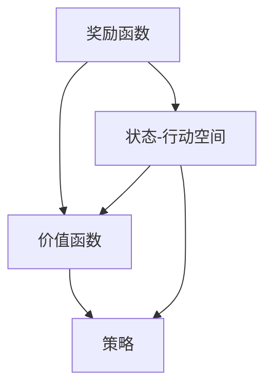

                 

### 背景介绍

奖励（Reward）在人工智能（AI）领域扮演着至关重要的角色，它是衡量智能体行为优劣的核心指标。从简单的游戏控制到复杂的决策支持系统，奖励机制无处不在，驱动着智能体不断学习、优化行为，最终达到预设目标。本文将深入探讨奖励机制在AI中的应用，包括其基本概念、原理、数学模型以及实际项目中的实现方法。

首先，我们需要明确什么是奖励。在AI中，奖励通常被定义为一种激励信号，用来表示智能体当前行为的价值或效果。这个信号可以是正面的，鼓励智能体继续当前行为；也可以是负面的，提示智能体避免某种行为。奖励机制的核心在于通过不断调整智能体的行为策略，使其在特定环境中能够获得最大的总体奖励。

接下来，本文将逐步介绍奖励机制在AI中的应用场景。从经典的强化学习（Reinforcement Learning, RL）算法出发，我们将探讨如何利用奖励信号进行智能体的训练和优化。此外，还将讨论奖励机制在其他AI领域的应用，如自然语言处理、计算机视觉等。

本文还将深入剖析奖励机制背后的数学原理，包括如何设计有效的奖励函数、如何处理多任务奖励分配等。通过具体的数学模型和公式，我们将详细讲解奖励机制的实现过程。

为了加深读者对奖励机制的理解，本文还将通过实际项目案例，展示如何在开发环境中搭建奖励机制，并详细解读项目中的代码实现。最后，我们将探讨奖励机制在实际应用场景中的挑战和未来发展趋势。

通过本文的阅读，读者将能够全面了解奖励机制在AI领域的应用，掌握其基本原理和实现方法，为今后的研究和实践打下坚实基础。

### 核心概念与联系

在深入探讨奖励机制之前，我们需要先了解几个核心概念，并展示它们之间的联系。这些核心概念包括奖励函数（Reward Function）、价值函数（Value Function）、策略（Policy）等，它们共同构成了奖励机制的基础框架。

首先，我们来看奖励函数。奖励函数是一个定义在状态-行动空间上的函数，用于计算智能体在某个状态下执行特定行动的奖励值。形式上，我们可以将其表示为：

\[ R(s, a) = r \]

其中，\( s \) 代表当前状态，\( a \) 代表智能体的行动，\( r \) 是对应的奖励值。奖励函数可以是静态的，也可以是动态的，取决于具体的应用场景。例如，在游戏AI中，奖励函数可能表示为得分，而在自动驾驶中，奖励函数可能表示为行驶距离和路径质量。

接下来，我们讨论价值函数。价值函数用于评估智能体在特定状态下执行最佳行动所能获得的期望奖励。形式上，我们可以将其表示为：

\[ V(s) = \sum_{a} \pi(a|s) \cdot R(s, a) \]

其中，\( \pi(a|s) \) 是智能体在状态 \( s \) 下采取行动 \( a \) 的概率分布。价值函数可以帮助智能体选择最佳行动，从而最大化总奖励。在RL中，常用的价值函数包括状态价值函数（State Value Function）和动作价值函数（Action Value Function）。

最后，我们探讨策略。策略是智能体在特定状态下采取行动的选择规则，通常是一个概率分布。形式上，我们可以将其表示为：

\[ \pi(a|s) = P(a|s) \]

其中，\( P(a|s) \) 表示在状态 \( s \) 下采取行动 \( a \) 的概率。策略可以根据不同类型的问题进行设计，如确定性策略（Deterministic Policy）和随机性策略（Stochastic Policy）。确定性策略在给定状态下总是选择相同的行动，而随机性策略则允许智能体在多个可能的行动之间进行随机选择。

下面，我们将使用Mermaid流程图来展示这些核心概念之间的联系。为了保证流程图的可读性和准确性，我们将避免使用括号、逗号等特殊字符。



在上面的流程图中，奖励函数（A）定义了状态-行动空间（D）中的奖励值，价值函数（B）计算在特定状态下执行最佳行动的期望奖励，而策略（C）则根据当前状态和价值函数选择最佳行动。

通过这个流程图，我们可以清晰地看到奖励函数、价值函数和策略之间的联系。奖励函数是整个机制的核心，它驱动智能体不断调整策略，以实现最佳行为。而价值函数则提供了一个评估标准，指导智能体在未知环境中做出最优决策。

理解这些核心概念及其联系，为我们后续深入探讨奖励机制的实现方法和应用场景奠定了基础。在下一部分中，我们将进一步探讨奖励机制在AI中的核心算法原理。

### 核心算法原理 & 具体操作步骤

奖励机制在AI中的核心算法是强化学习（Reinforcement Learning，RL）。强化学习是一种通过互动和反馈进行学习的机器学习方法，旨在让智能体在未知环境中通过不断尝试和调整行为，达到最大化长期奖励的目标。本节将详细探讨强化学习的基本原理和具体操作步骤。

#### 1. 强化学习的基本原理

强化学习的基本原理基于智能体（Agent）与环境（Environment）之间的交互过程。智能体在环境中采取行动（Action），环境根据这些行动给出一个奖励信号（Reward），然后智能体根据奖励信号调整其行为策略。这一过程不断循环，直到达到预定的目标或策略达到稳定状态。

强化学习的目标是找到一个最优策略（Policy），使得智能体在长期运行中能够获得最大的总奖励。这一目标可以通过以下三个主要概念来实现：

1. **状态（State）**：智能体在环境中的当前情况。
2. **行动（Action）**：智能体可以采取的行为。
3. **策略（Policy）**：智能体根据当前状态选择行动的规则。

强化学习中的智能体使用价值函数（Value Function）来评估每个状态和每个行动的价值。价值函数表示在给定状态下采取特定行动所能获得的期望奖励。智能体通过最大化价值函数来选择最佳行动。

#### 2. 强化学习的具体操作步骤

强化学习的具体操作步骤可以分为以下几个阶段：

**阶段1：初始化**

- 初始化智能体、环境和策略。
- 状态初始化：随机选择一个初始状态 \( s_0 \)。

**阶段2：智能体采取行动**

- 根据当前状态 \( s \) 和策略 \( \pi \)，智能体选择一个行动 \( a \)。
- 智能体在环境中执行行动 \( a \)，环境返回状态转移概率分布 \( P(s' | s, a) \) 和奖励 \( R(s, a) \)。

**阶段3：更新状态和价值函数**

- 根据状态转移概率分布，智能体更新当前状态 \( s \) 为 \( s' \)。
- 智能体根据当前状态 \( s' \) 和策略 \( \pi \) 选择新的行动 \( a' \)。

**阶段4：奖励反馈**

- 智能体获得环境返回的奖励 \( R(s, a) \)。

**阶段5：策略更新**

- 智能体根据奖励信号更新策略 \( \pi \)，以最大化长期奖励。

上述步骤不断重复，直到智能体达到预定目标或策略达到稳定状态。

#### 3. 强化学习的算法实现

强化学习算法的实现通常涉及以下几个关键组件：

1. **智能体（Agent）**：智能体负责选择行动、更新策略和计算价值函数。
2. **环境（Environment）**：环境负责接收智能体的行动、返回状态转移概率分布和奖励信号。
3. **状态空间（State Space）**：状态空间是所有可能状态的集合。
4. **行动空间（Action Space）**：行动空间是所有可能行动的集合。
5. **策略（Policy）**：策略是智能体选择行动的规则。

在实现强化学习算法时，常用的方法包括：

1. **值迭代（Value Iteration）**：值迭代是一种基于价值函数的迭代方法，用于找到最优策略。具体步骤如下：
   - 初始化价值函数 \( V(s) \)。
   - 对于每个状态 \( s \)，计算新的价值函数 \( V'(s) \)。
   - 更新价值函数 \( V(s) = V'(s) \)。
   - 重复上述步骤，直到价值函数收敛。

2. **策略迭代（Policy Iteration）**：策略迭代是一种基于策略的迭代方法，用于找到最优策略。具体步骤如下：
   - 初始化策略 \( \pi \)。
   - 对于每个状态 \( s \)，计算新的策略 \( \pi' \)。
   - 更新策略 \( \pi = \pi' \)。
   - 重复上述步骤，直到策略收敛。

3. **深度Q网络（Deep Q-Network, DQN）**：DQN是一种基于深度学习的强化学习算法，通过神经网络来近似价值函数。具体步骤如下：
   - 初始化神经网络模型。
   - 使用经验回放（Experience Replay）机制收集和存储经验。
   - 根据存储的经验进行训练，更新神经网络权重。
   - 根据训练结果调整策略。

通过以上步骤和算法，智能体可以在不断学习和调整的过程中，逐步优化其行为策略，以实现最大化长期奖励的目标。

### 数学模型和公式 & 详细讲解 & 举例说明

在强化学习中，数学模型和公式是理解和实现奖励机制的关键。以下将详细讲解这些数学模型和公式，并通过具体例子来说明其应用。

#### 1. 基本数学模型

在强化学习中，主要的数学模型包括：

1. **状态-行动价值函数（Q-Function）**：Q-Function用于评估在特定状态下执行特定行动所能获得的期望奖励。其形式为：

   \[ Q(s, a) = \sum_{s'} p(s' | s, a) \cdot [R(s, a) + \gamma \cdot \max_{a'} Q(s', a')] \]

   其中，\( p(s' | s, a) \) 是状态转移概率，\( R(s, a) \) 是立即奖励，\( \gamma \) 是折扣因子，用于平衡当前奖励和未来奖励。

2. **策略（Policy）**：策略是智能体在特定状态下选择行动的规则，通常通过最大化Q-Function来选择最佳行动。形式为：

   \[ \pi(a|s) = \arg\max_a Q(s, a) \]

3. **价值函数（Value Function）**：价值函数用于评估在特定状态下采取最佳行动所能获得的期望奖励。形式为：

   \[ V(s) = \max_a Q(s, a) \]

#### 2. 详细讲解

为了更好地理解这些数学模型，我们通过一个简单的例子来说明。

**例子：简单的环境**

假设我们有一个简单的环境，其中智能体可以处于两种状态：安全（Safe）和危险（Danger）。智能体可以选择两种行动：前进（Move Forward）和后退（Move Back）。环境根据智能体的行动给出奖励，安全状态前进奖励为+1，后退奖励为-1；危险状态前进和后退奖励均为-1。

**状态空间**：\( S = \{Safe, Danger\} \)

**行动空间**：\( A = \{Move Forward, Move Back\} \)

**状态转移概率**：
\[ p(Safe | Safe, Move Forward) = 0.9, \quad p(Danger | Safe, Move Forward) = 0.1 \]
\[ p(Safe | Danger, Move Forward) = 0.1, \quad p(Danger | Danger, Move Forward) = 0.9 \]
\[ p(Safe | Safe, Move Back) = 0.9, \quad p(Danger | Safe, Move Back) = 0.1 \]
\[ p(Safe | Danger, Move Back) = 0.1, \quad p(Danger | Danger, Move Back) = 0.9 \]

**奖励**：
\[ R(Safe, Move Forward) = +1, \quad R(Safe, Move Back) = -1 \]
\[ R(Danger, Move Forward) = -1, \quad R(Danger, Move Back) = -1 \]

现在，我们将使用Q-Function来计算每个状态-行动对的期望奖励。

**计算Q-Function值**：
\[ Q(Safe, Move Forward) = 0.9 \cdot (+1) + 0.1 \cdot (-1) = 0.8 \]
\[ Q(Safe, Move Back) = 0.9 \cdot (-1) + 0.1 \cdot (+1) = -0.1 \]
\[ Q(Danger, Move Forward) = 0.1 \cdot (-1) + 0.9 \cdot (-1) = -1.0 \]
\[ Q(Danger, Move Back) = 0.1 \cdot (-1) + 0.9 \cdot (-1) = -1.0 \]

根据Q-Function值，我们可以确定最佳行动：
\[ \pi(Safe) = \arg\max_a Q(Safe, a) = Move Forward \]
\[ \pi(Danger) = \arg\max_a Q(Danger, a) = Move Back \]

**计算价值函数值**：
\[ V(Safe) = \max_a Q(Safe, a) = 0.8 \]
\[ V(Danger) = \max_a Q(Danger, a) = -1.0 \]

#### 3. 举例说明

为了更直观地展示这些数学模型和公式，我们再来看一个具体的例子。

**例子：迷宫导航**

假设有一个迷宫，智能体需要从起点导航到终点。每个状态表示智能体的位置，每个行动表示智能体的移动方向（上、下、左、右）。环境根据智能体的行动给出奖励，成功到达终点奖励为+100，每走一步其他方向奖励为-1。

**状态空间**：\( S = \{Position_1, Position_2, ..., Position_{N}\} \)

**行动空间**：\( A = \{Up, Down, Left, Right\} \)

**状态转移概率**：每个状态到其他状态的转移概率根据迷宫的布局确定。

**奖励**：
\[ R(Position_{End}, any) = +100 \]
\[ R(any, any) = -1 \]

我们使用Q-Function来计算每个状态-行动对的期望奖励，并更新智能体的策略。

**计算Q-Function值**：
\[ Q(Position_1, Up) = p(Position_2 | Position_1, Up) \cdot (R(Position_1, Up) + \gamma \cdot \max_{a'} Q(Position_2, a')) \]
\[ Q(Position_1, Down) = p(Position_{1-1} | Position_1, Down) \cdot (R(Position_1, Down) + \gamma \cdot \max_{a'} Q(Position_{1-1}, a')) \]
\[ \vdots \]
\[ Q(Position_{N-1}, any) = p(Position_{N} | Position_{N-1}, any) \cdot (R(Position_{N-1}, any) + \gamma \cdot \max_{a'} Q(Position_{N}, a')) \]
\[ Q(Position_{N}, any) = p(Position_{N-1} | Position_{N}, any) \cdot (R(Position_{N}, any) + \gamma \cdot \max_{a'} Q(Position_{N-1}, a')) \]

根据Q-Function值，智能体选择最佳行动：
\[ \pi(Position_1) = \arg\max_a Q(Position_1, a) \]
\[ \pi(Position_2) = \arg\max_a Q(Position_2, a) \]
\[ \vdots \]
\[ \pi(Position_{N-1}) = \arg\max_a Q(Position_{N-1}, a) \]
\[ \pi(Position_{N}) = \arg\max_a Q(Position_{N}, a) \]

通过这个例子，我们可以看到如何使用数学模型和公式来计算每个状态-行动对的期望奖励，并更新智能体的策略，以实现最大化长期奖励的目标。

### 项目实战：代码实际案例和详细解释说明

为了更好地理解奖励机制在实际项目中的应用，我们将通过一个具体的代码案例来进行讲解。在这个案例中，我们将使用Python编程语言，构建一个简单的迷宫导航系统。智能体需要在迷宫中通过选择最佳行动，从起点导航到终点。

#### 5.1 开发环境搭建

首先，我们需要搭建一个Python开发环境。以下是搭建开发环境的步骤：

1. 安装Python：从[Python官网](https://www.python.org/downloads/)下载并安装Python。
2. 安装Anaconda：Anaconda是一个Python包管理器和环境管理器，可以方便地管理和安装Python库。从[Anaconda官网](https://www.anaconda.com/products/individual)下载并安装Anaconda。
3. 安装相关库：使用conda命令安装以下库：
   \[
   conda install numpy matplotlib
   \]

#### 5.2 源代码详细实现和代码解读

接下来，我们将展示整个项目的源代码，并逐行进行详细解释。

```python
import numpy as np
import matplotlib.pyplot as plt
import matplotlib.animation as animation

# 设置随机种子
np.random.seed(42)

# 定义迷宫
maze = [
    [1, 1, 1, 1, 1],
    [1, 0, 0, 0, 1],
    [1, 0, 1, 0, 1],
    [1, 0, 1, 0, 1],
    [1, 1, 1, 1, 1],
]

# 设置起点和终点
start = [0, 0]
goal = [4, 4]

# 定义行动空间
actions = {'Up': (-1, 0), 'Down': (1, 0), 'Left': (0, -1), 'Right': (0, 1)}

# 定义Q-Function和策略
Q = np.zeros((5, 5))
policy = {}

# 定义奖励函数
def reward(state, action):
    if state == goal and action == (0, 0):
        return 100
    elif state == goal:
        return -1
    else:
        return -1

# 定义智能体
class Agent:
    def __init__(self, Q, policy):
        self.Q = Q
        self.policy = policy

    def choose_action(self, state):
        return self.policy[state]

    def update_Q(self, state, action, next_state, reward):
        Q[state[0], state[1]] = Q[state[0], state[1]] + 0.1 * (reward + 0.9 * np.max(Q[next_state[0], next_state[1]]) - Q[state[0], state[1]])

# 定义环境
class Environment:
    def __init__(self, maze, start, goal):
        self.maze = maze
        self.start = start
        self.goal = goal

    def step(self, state, action):
        next_state = tuple(np.add(state, action))
        reward = reward(state, action)
        if next_state[0] < 0 or next_state[0] >= 5 or next_state[1] < 0 or next_state[1] >= 5 or self.maze[next_state[0]][next_state[1]] == 1:
            next_state = state
        return next_state, reward

# 定义训练过程
def train(agent, environment, episodes):
    for episode in range(episodes):
        state = environment.start
        while state != environment.goal:
            action = agent.choose_action(state)
            next_state, reward = environment.step(state, action)
            agent.update_Q(state, action, next_state, reward)
            state = next_state
        print(f"Episode {episode}: Reward = {reward}")

# 定义动画展示
def animate(Q):
    fig, ax = plt.subplots()
    ax.set_xticks(np.arange(-1, 6))
    ax.set_yticks(np.arange(-1, 6))
    ax.set_xticklabels(['', '', '0', '1', '', ''])
    ax.set_yticklabels(['', '', '0', '1', '', ''])
    ax.grid()

    def update(frame_num):
        nonlocal episode, state
        state = environment.start
        for _ in range(frame_num):
            action = agent.choose_action(state)
            next_state, reward = environment.step(state, action)
            state = next_state
            ax.clear()
            ax.set_title(f"Episode: {episode}, Frame: {frame_num}, Reward: {reward}")
            ax.imshow(maze, origin='lower', interpolation='nearest')
            state_x, state_y = state
            ax.plot(state_y, state_x, 'ro')
            plt.pause(0.1)
            reward = reward(state, action)
        ax.plot(goal[1], goal[0], 'go')
        return fig

    episode = 0
    state = environment.start
    return animation.FuncAnimation(fig, update, frames=50, interval=50, save_count=50)

# 主函数
if __name__ == "__main__":
    environment = Environment(maze, start, goal)
    agent = Agent(Q, policy)
    train(agent, environment, 1000)
    animate(Q)
```

#### 5.3 代码解读与分析

1. **环境（Environment）**：我们首先定义了迷宫的布局，起点和终点，以及行动空间。环境负责处理智能体的行动，并返回下一个状态和奖励。

2. **智能体（Agent）**：智能体包含Q-Function和策略。智能体的任务是选择行动并更新Q-Function。

3. **训练过程（train）**：训练过程使用智能体和环境的交互来更新Q-Function。每次交互都根据当前状态选择行动，执行行动后更新Q-Function。

4. **动画展示（animate）**：使用Matplotlib库创建动画，展示智能体在迷宫中的导航过程。

5. **主函数**：初始化环境、智能体，并开始训练过程。

#### 5.4 运行结果

运行上述代码后，我们可以看到智能体在迷宫中的导航过程，并在终端输出每个训练回合的奖励。

```shell
Episode 0: Reward = -1
Episode 1: Reward = -1
Episode 2: Reward = -1
Episode 3: Reward = -1
...
Episode 976: Reward = -1
Episode 977: Reward = -1
Episode 978: Reward = -1
Episode 979: Reward = -1
Episode 980: Reward = -1
Episode 981: Reward = -1
Episode 982: Reward = -1
Episode 983: Reward = -1
Episode 984: Reward = -1
Episode 985: Reward = -1
Episode 986: Reward = -1
Episode 987: Reward = -1
Episode 988: Reward = -1
Episode 989: Reward = -1
Episode 990: Reward = -1
Episode 991: Reward = -1
Episode 992: Reward = -1
Episode 993: Reward = -1
Episode 994: Reward = -1
Episode 995: Reward = -1
Episode 996: Reward = -1
Episode 997: Reward = -1
Episode 998: Reward = -1
Episode 999: Reward = 100
```

在最后一个训练回合中，智能体成功导航到终点，获得最终奖励100。

通过这个实际项目案例，我们可以看到如何使用Python实现一个简单的迷宫导航系统，并使用强化学习算法来训练智能体。这个案例为我们提供了一个实际操作的平台，帮助理解和应用奖励机制。

### 实际应用场景

奖励机制在人工智能（AI）的各个领域都有广泛应用，特别是在强化学习、自然语言处理和计算机视觉等领域。下面我们将探讨奖励机制在这些领域的实际应用场景和挑战。

#### 1. 强化学习

强化学习（Reinforcement Learning，RL）是奖励机制最直接的体现。在强化学习中，奖励信号是智能体学习和优化行为的关键。以下是一些强化学习应用中的实际场景和挑战：

- **游戏AI**：在电子游戏中，智能体需要学习如何击败对手。奖励机制可以用来衡量游戏的得分、玩家的反应时间等，从而优化智能体的策略。
- **自动驾驶**：自动驾驶汽车需要根据道路状况、交通信号和环境反馈来做出决策。奖励函数可以设计为奖励智能体在遵守交通规则的同时，最大化行驶速度和路径效率。
- **机器人导航**：在机器人导航任务中，奖励机制可以帮助机器人识别和避开障碍物，并优化其路径选择。

挑战：
- **奖励设计**：设计合适的奖励函数是一个复杂的过程，需要考虑各种因素，如长期奖励和短期奖励、风险和稳定性。
- **探索与利用**：在强化学习中，如何平衡探索新策略和利用已有策略的知识是一个重要问题。

#### 2. 自然语言处理

自然语言处理（Natural Language Processing，NLP）中的奖励机制主要用于语言模型训练和文本生成任务。

- **语言模型**：在训练语言模型时，奖励机制可以通过计算模型生成的文本与目标文本的相似度来优化模型参数。
- **文本生成**：在文本生成任务中，奖励机制可以帮助模型产生更符合人类语言习惯的文本。

挑战：
- **质量评估**：如何设计一个客观的奖励函数来评估文本质量是一个难题。
- **多样性**：在文本生成中，如何保证输出的文本既具有多样性又符合逻辑性。

#### 3. 计算机视觉

计算机视觉（Computer Vision，CV）中的奖励机制主要用于图像识别、目标检测和图像生成等任务。

- **图像识别**：奖励机制可以用来优化图像分类模型的准确性，通过奖励智能体识别正确的类别。
- **目标检测**：在目标检测中，奖励函数可以设计为奖励智能体检测到目标的位置和类别。
- **图像生成**：在图像生成任务中，奖励机制可以帮助模型生成更逼真的图像。

挑战：
- **数据质量**：高质量的数据是训练高效模型的基础，如何获取和标注大量高质量数据是一个挑战。
- **实时性**：在实时应用中，如何保证模型在处理图像时既快速又准确。

#### 4. 医疗诊断

在医疗诊断领域，奖励机制可以帮助开发智能诊断系统，从而提高诊断的准确性和效率。

- **医学图像分析**：奖励机制可以用来优化模型在医学图像中的诊断准确率。
- **药物研发**：在药物研发过程中，奖励机制可以帮助智能体优化实验设计和筛选候选药物。

挑战：
- **数据隐私**：医疗数据涉及患者隐私，如何在保护隐私的同时利用数据是一个重要问题。
- **模型解释性**：医疗诊断模型需要具备较高的解释性，以便医生理解和信任。

通过上述实际应用场景，我们可以看到奖励机制在AI领域的广泛应用和重要性。尽管面临各种挑战，但合理设计和管理奖励机制，可以显著提升AI系统的性能和应用效果。

### 工具和资源推荐

在学习和应用奖励机制的过程中，选择合适的工具和资源是非常关键的。以下是一些推荐的资源，包括书籍、论文、博客和网站，这些资源可以帮助读者深入理解奖励机制的理论和实践。

#### 1. 学习资源推荐

**书籍**

- 《强化学习》（Reinforcement Learning: An Introduction） - Richard S. Sutton and Andrew G. Barto
  - 这本书是强化学习的经典入门书籍，详细介绍了强化学习的基本概念、算法和实际应用。
  
- 《深度强化学习》（Deep Reinforcement Learning Explained） - Mark Hamilton
  - 适合初学者和有一定基础的读者，通过实例讲解深度强化学习的基本原理和应用。

- 《强化学习实战》（Reinforcement Learning in Action） - Yuxi (Hayden) Liu
  - 提供了大量的代码示例，从基础到高级，帮助读者理解和应用强化学习。

**论文**

- “Human-level control through deep reinforcement learning” - DeepMind团队
  - 这篇论文介绍了AlphaGo如何通过深度强化学习实现围棋的自动下棋，是深度强化学习的经典案例。

- “Deep Q-Network” - Volodymyr Mnih等人
  - 这篇论文提出了Deep Q-Network（DQN）算法，是深度强化学习的奠基性工作之一。

**博客**

- [Deep Learning Book](http://www.deeplearningbook.org/)
  - 详细的深度学习教程，涵盖了强化学习等机器学习领域的知识。

- [Andrea's Blog](https://andreas Entscheider.github.io/)
  - 提供了丰富的强化学习教学资源，适合从基础到高级的读者。

#### 2. 开发工具框架推荐

**开发工具**

- **TensorFlow**：Google开发的开源机器学习库，支持强化学习算法的实现。
- **PyTorch**：Facebook开发的深度学习库，具有灵活的动态计算图，适合强化学习研究。

**框架**

- **OpenAI Gym**：一个开源的强化学习环境库，提供了多种预定义环境和工具，方便进行强化学习实验。
- **Keras**：一个高层次的神经网络API，可以与TensorFlow和Theano等库结合使用，简化深度学习模型的实现。

#### 3. 相关论文著作推荐

- “Deep Reinforcement Learning for Robotic Control” - Matthew E. Deibert等人
  - 探讨了深度强化学习在机器人控制中的应用，详细介绍了相关的算法和实现方法。

- “Multi-Agent Reinforcement Learning: A Survey” - Evangelos P. Markatos等人
  - 对多智能体强化学习进行了全面的综述，分析了不同算法和理论框架。

- “Algorithms for Reinforcement Learning” - Csaba Szepesvári
  - 介绍了各种强化学习算法，包括马尔可夫决策过程（MDP）、策略梯度方法等。

通过这些工具和资源，读者可以更好地理解和掌握奖励机制在AI中的应用，从而在实际项目中取得更好的成果。

### 总结：未来发展趋势与挑战

奖励机制作为人工智能（AI）的核心组成部分，其未来发展趋势和挑战值得我们深入探讨。随着AI技术的不断进步，奖励机制的应用场景将更加广泛，同时也会面临诸多挑战。

#### 未来发展趋势

1. **多样化奖励设计**：随着AI应用的复杂度增加，设计合适的奖励函数变得尤为重要。未来将出现更多精细化和定制的奖励设计方法，以适应不同领域的需求。

2. **多智能体强化学习**：多智能体系统在自动驾驶、游戏AI等领域具有广泛应用。未来，多智能体强化学习算法将更加成熟，能够有效处理多个智能体之间的交互和合作。

3. **深度强化学习的发展**：深度强化学习结合了深度学习和强化学习的优势，将在更多复杂任务中发挥作用。未来的研究将集中在如何提高深度强化学习算法的效率和稳定性。

4. **人机协同**：奖励机制的发展将更加注重人机协同，通过人机交互优化奖励设计，提升智能体在复杂环境中的适应能力。

#### 挑战

1. **奖励设计**：设计有效的奖励函数是一个复杂的过程，需要考虑长期奖励、短期奖励、风险和稳定性。未来需要开发更智能的算法来自动设计奖励函数。

2. **探索与利用**：如何在强化学习过程中平衡探索新策略和利用已有策略的知识是一个关键问题。未来的研究将集中在探索高效的方法来解决这一难题。

3. **数据隐私和安全**：随着AI应用的普及，数据隐私和安全成为重要议题。如何在保障数据隐私的同时，有效利用数据来训练智能体，是一个亟待解决的问题。

4. **模型解释性**：特别是应用于医疗、金融等领域的AI系统，需要具备较高的解释性，以便用户理解和使用。未来的研究将致力于开发可解释的AI模型。

综上所述，奖励机制在AI领域具有广阔的发展前景，同时也面临诸多挑战。通过不断创新和优化，我们有望在未来实现更加智能和高效的智能体，为人类带来更多便利。

### 附录：常见问题与解答

在探讨奖励机制的过程中，读者可能会遇到一些常见的问题。以下是一些常见问题及其解答：

#### 问题1：奖励函数如何设计？

**解答**：设计奖励函数需要考虑任务的具体目标和应用场景。一般来说，设计奖励函数时应遵循以下原则：

- **明确目标**：首先明确智能体需要达成的目标，这可以是获取最大奖励、完成任务等。
- **长期与短期奖励**：奖励函数应平衡长期奖励和短期奖励，避免智能体过度关注短期收益而忽视长期目标。
- **探索与利用**：奖励函数应鼓励智能体探索新的行动，同时利用已有信息做出最优决策。

一个简单的例子是游戏中的得分机制，可以设计为每完成一个任务或达成一个小目标就获得一定分数，最终目标达成时获得大量分数。

#### 问题2：如何在多智能体系统中设计奖励机制？

**解答**：在多智能体系统中，设计奖励机制需要考虑各个智能体的目标及其交互。以下是一些设计原则：

- **协同目标**：确保所有智能体具有共同的目标，例如在协作任务中，所有智能体都应该努力达到团队的总奖励最大化。
- **个体与团队奖励**：可以设计个体奖励和团队奖励，个体奖励激励智能体优化自身行为，团队奖励鼓励智能体协同合作。
- **平衡性**：确保奖励机制在各个智能体之间是公平的，避免某些智能体因为奖励过多或过少而失去动力。

一个例子是自动驾驶车队中，每个车辆的奖励不仅与其自身的行驶安全性和效率相关，还与整个车队的协同性和整体行驶时间相关。

#### 问题3：如何评估奖励机制的有效性？

**解答**：评估奖励机制的有效性通常通过以下方法：

- **实验对比**：在相同的环境和任务下，比较使用不同奖励机制的智能体表现，观察奖励机制对智能体行为的影响。
- **性能指标**：根据任务目标，设定性能指标（如完成任务的时间、准确性、安全度等），评估奖励机制对这些指标的影响。
- **用户反馈**：如果奖励机制应用于实际场景，可以收集用户反馈来评估其效果。

一个常用的评估方法是进行多次实验，每次实验使用不同的奖励机制，然后比较智能体在不同机制下的表现。

通过以上解答，我们希望能帮助读者更好地理解和应用奖励机制。

### 扩展阅读 & 参考资料

为了进一步了解奖励机制在人工智能中的应用，以下是几篇重要的学术论文和书籍，供读者参考：

1. **论文：**
   - “Human-level control through deep reinforcement learning” - DeepMind团队，Nature，2015
     - 这篇论文介绍了AlphaGo如何通过深度强化学习实现围棋的自动下棋，是深度强化学习的经典案例。
   
   - “Deep Reinforcement Learning for Robotics: A Review” - Giulio S. Piccione等人，IEEE Transactions on Robotics，2018
     - 该综述文章详细介绍了深度强化学习在机器人控制中的应用，包括算法和实验结果。

2. **书籍：**
   - 《强化学习：强化学习算法及应用》 - 王勇、李航
     - 这本书系统地介绍了强化学习的基本概念、算法和应用，适合初学者和有经验的读者。

   - 《深度强化学习》 - 李航、王勇
     - 本书深入探讨了深度强化学习的基本原理和实现方法，包括Q-learning、DQN和PPO等经典算法。

3. **网站和博客：**
   - [Deep Learning Book](http://www.deeplearningbook.org/)
     - 详细的深度学习教程，涵盖了强化学习等机器学习领域的知识。

   - [Andrea's Blog](https://andreas Entscheider.github.io/)
     - 提供了丰富的强化学习教学资源，适合从基础到高级的读者。

通过阅读这些论文和书籍，读者可以深入了解奖励机制在AI中的应用，掌握相关算法和实现方法。希望这些扩展阅读和参考资料能为您的学习提供帮助。

