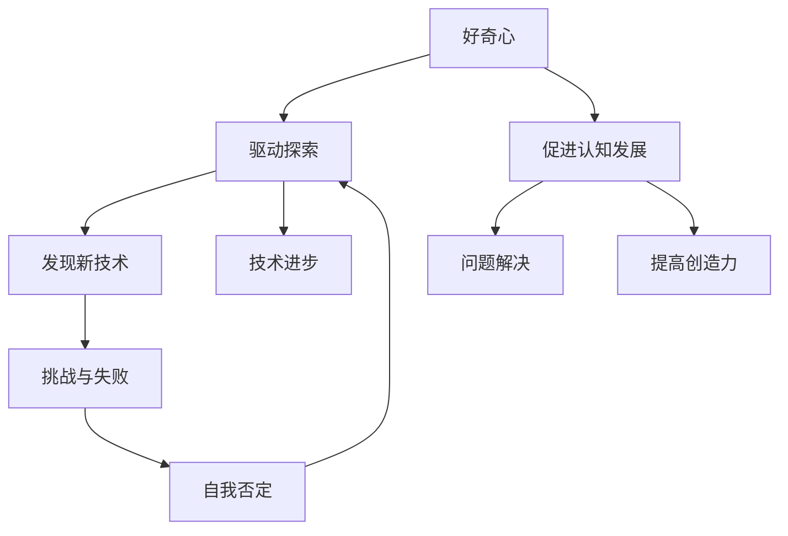

                 

# 好奇心：不断探索与自我否定的动力

> **关键词：** 好奇心、探索、自我否定、技术发展、创新动力

> **摘要：** 本文通过深入探讨好奇心在技术发展中的关键作用，解析好奇心如何驱动个人和集体不断探索与自我否定，从而推动技术进步与创新。文章从历史、心理学和计算机科学的角度分析了好奇心的本质，并探讨了如何激发和利用好奇心以实现个人成长和职业发展。

## 1. 背景介绍

在快速发展的现代社会中，技术进步已经成为推动社会发展和人类生活改善的核心力量。然而，技术的进步并非一蹴而就，而是依赖于无数个人的不懈探索和不断的自我否定。好奇心，作为一种强大的内在动机，是驱动人们进行探索和创新的重要因素。

好奇心是人类的一种基本心理特征，它促使我们问问题、寻求答案，并对未知事物充满兴趣。从心理学的角度来看，好奇心可以激发我们的求知欲，推动我们不断学习新知识和技能，从而提高我们的认知能力。在计算机科学和技术领域，好奇心同样发挥着至关重要的作用，它促使人们不断探索新技术、解决新问题，推动技术不断向前发展。

本文将从以下几个方面展开讨论：

1. 好奇心的本质及其对技术发展的推动作用。
2. 历史上的好奇心驱动者及其成就。
3. 如何激发和利用好奇心进行技术探索和创新。
4. 好奇心在技术领域的实际应用案例。
5. 好奇心对个人职业发展的推动作用。
6. 总结与未来展望。

通过本文的探讨，我们希望读者能够更好地理解好奇心在技术发展中的关键作用，以及如何激发和利用好奇心实现个人和职业的成长。

## 2. 核心概念与联系

在探讨好奇心如何推动技术发展之前，我们需要明确几个核心概念，并理解它们之间的联系。

### 2.1 好奇心的本质

好奇心是一种内在的心理动机，它促使我们对未知事物产生兴趣和探索欲望。从心理学的角度来看，好奇心与认知发展、问题解决、创造力等密切相关。研究表明，好奇心可以通过激发个体的求知欲和探索行为，促进其认知能力的提升。

### 2.2 技术发展的驱动因素

技术发展受到多种因素的驱动，包括经济需求、社会需求、科学研究等。然而，在这些因素中，好奇心作为一种非直接的经济和社会需求，却常常是技术创新的最初驱动力。好奇心促使人们不断探索未知，从而推动技术进步。

### 2.3 自我否定的作用

自我否定是指个体在面对新技术或新观点时，愿意放弃旧有的观念和方法，接受新的改变和改进。自我否定是创新过程中的重要环节，它促使我们不断审视自己的认知和行为，从而实现自我提升。

### 2.4 好奇心、技术发展与自我否定的联系

好奇心驱动个体进行探索，发现新技术和新方法。在探索过程中，个体可能会遇到挑战和失败，这促使他们进行自我否定，重新审视和改进自己的思路。这种循环过程不断推动技术进步和创新。

为了更好地理解这些概念之间的联系，我们可以使用 Mermaid 流程图进行展示。



通过上述流程图，我们可以清晰地看到好奇心、探索、自我否定和技术进步之间的互动关系。

## 3. 核心算法原理 & 具体操作步骤

在理解了好奇心、技术发展和自我否定的基本概念后，我们可以进一步探讨如何利用好奇心进行技术探索和创新。以下是几个关键步骤：

### 3.1 确定技术领域和研究方向

首先，我们需要明确自己感兴趣的技术领域和研究方向。这可以通过了解当前技术热点、阅读相关文献、参加技术会议等方式实现。确定研究方向是好奇心驱动技术探索的第一步。

### 3.2 深入学习和积累知识

在确定研究方向后，我们需要通过深入学习相关知识和技能来为技术探索打下坚实的基础。这包括阅读书籍、论文，参加在线课程，与同行交流等。深入学习可以帮助我们更好地理解技术领域的现状和发展趋势。

### 3.3 进行实际技术探索

在积累了一定的知识后，我们可以开始进行实际的技术探索。这可以通过以下几种方式实现：

- **项目实践**：通过实际项目来应用所学知识，解决实际问题。
- **研究论文**：撰写研究论文，探索新的技术方向或方法。
- **技术分享**：通过博客、演讲等方式分享自己的技术心得和经验。

### 3.4 面对挑战与失败

在技术探索过程中，我们不可避免地会遇到挑战和失败。面对这些困难，我们需要保持积极的心态，勇于接受失败，并从中吸取教训。这包括：

- **反思与总结**：反思失败的原因，总结经验教训。
- **改进与优化**：针对失败的原因进行改进和优化，尝试新的方法。
- **持续学习**：通过不断学习和实践，提升自己的技术水平。

### 3.5 自我否定与持续进步

在技术探索过程中，我们需要时刻保持自我否定的态度。这意味着我们要敢于质疑自己的观点和做法，勇于接受新的改变和改进。通过自我否定，我们可以不断进步，实现技术的创新和突破。

## 4. 数学模型和公式 & 详细讲解 & 举例说明

在技术探索和创新过程中，数学模型和公式常常扮演着重要的角色。以下是一个简单的数学模型示例，用于解释好奇心驱动技术探索的过程。

### 4.1 好奇心驱动的技术探索模型

假设我们有以下数学模型：

$$
T(t) = \alpha \cdot H(t) \cdot (1 - e^{-kt})
$$

其中：

- \( T(t) \) 表示在时间 \( t \) 内的技术进步水平。
- \( H(t) \) 表示在时间 \( t \) 内的好奇心水平。
- \( \alpha \) 表示好奇心对技术进步的影响系数。
- \( k \) 表示好奇心衰减系数。

### 4.2 模型讲解

这个模型表明，技术进步 \( T(t) \) 与好奇心水平 \( H(t) \) 成正比，同时受到好奇心衰减的影响。随着时间的推移，好奇心水平会逐渐降低，这反映了个体在技术探索过程中可能会遇到的挑战和困难。

### 4.3 举例说明

假设一个技术专家在研究一项新技术时，初始的好奇心水平 \( H(0) = 100 \)。在最初的几个月里，他的好奇心水平保持较高，技术进步水平 \( T(0) = 100 \)。然而，随着研究的深入，他遇到了一些挑战，好奇心水平开始衰减，假设 \( k = 0.1 \)，一年后的好奇心水平 \( H(1) = 75 \)。根据模型，技术进步水平 \( T(1) \) 将变为：

$$
T(1) = \alpha \cdot 75 \cdot (1 - e^{-0.1 \cdot 1}) \approx 83.75
$$

这表明，尽管好奇心水平有所下降，但技术进步仍在继续，只是速度有所减缓。

### 4.4 模型应用

这个模型可以帮助我们理解好奇心如何影响技术进步。在实际应用中，我们可以通过调整好奇心水平、影响系数和衰减系数来优化模型，从而更好地指导技术探索和创新。

## 5. 项目实战：代码实际案例和详细解释说明

### 5.1 开发环境搭建

为了更好地展示好奇心如何驱动技术探索和创新，我们将通过一个具体的代码案例来说明。首先，我们需要搭建一个开发环境。

1. 安装 Python 3.8 或更高版本。
2. 安装必要的库，如 NumPy、Matplotlib 等。
3. 打开终端，运行以下命令：

```bash
pip install numpy matplotlib
```

### 5.2 源代码详细实现和代码解读

以下是一个简单的 Python 代码示例，用于模拟好奇心驱动技术探索的过程。

```python
import numpy as np
import matplotlib.pyplot as plt

def curiosityDrivenProgress(H, alpha, k):
    t = np.arange(0, 10, 0.1)
    T = alpha * H * (1 - np.exp(-k * t))
    return t, T

alpha = 1.0
k = 0.1
H = 100

t, T = curiosityDrivenProgress(H, alpha, k)

plt.plot(t, T)
plt.xlabel('Time (years)')
plt.ylabel('Technological Progress')
plt.title('Curiosity-Driven Technological Progress')
plt.show()
```

这个代码定义了一个名为 `curiosityDrivenProgress` 的函数，它接受好奇心水平 \( H \)、影响系数 \( \alpha \) 和衰减系数 \( k \) 作为参数，并返回技术进步水平 \( T \) 作为时间 \( t \) 的函数。

在主程序中，我们设置了 \( \alpha \)、\( k \) 和 \( H \) 的初始值，并调用 `curiosityDrivenProgress` 函数生成技术进步的时间序列数据。最后，我们使用 Matplotlib 库绘制了技术进步曲线。

### 5.3 代码解读与分析

这个代码示例展示了如何通过数学模型来模拟好奇心驱动技术探索的过程。以下是代码的详细解读：

- **导入库**：我们首先导入了 NumPy 和 Matplotlib 库，这两个库为我们提供了强大的数学计算和图形绘制功能。
- **定义函数**：`curiosityDrivenProgress` 函数接受好奇心水平 \( H \)、影响系数 \( \alpha \) 和衰减系数 \( k \) 作为参数，并返回技术进步水平 \( T \) 作为时间 \( t \) 的函数。这个函数使用了 NumPy 的数组操作和 Matplotlib 的图形绘制功能。
- **设置参数**：在主程序中，我们设置了 \( \alpha \)、\( k \) 和 \( H \) 的初始值。这些参数决定了好奇心驱动技术探索的模型特性。
- **计算技术进步**：我们调用 `curiosityDrivenProgress` 函数生成技术进步的时间序列数据。
- **绘制图形**：最后，我们使用 Matplotlib 库绘制了技术进步曲线，这有助于我们直观地理解好奇心驱动技术探索的过程。

通过这个代码示例，我们可以看到好奇心如何通过数学模型影响技术进步。在实际应用中，我们可以通过调整参数来模拟不同情况下的技术进步过程。

## 6. 实际应用场景

好奇心在技术领域具有广泛的应用场景，以下是一些具体的实例：

### 6.1 科学研究

在科学研究领域，好奇心是驱动科学家不断探索未知世界的核心动力。例如，牛顿因为好奇心而探索万有引力定律，从而推动了物理学的发展。同样，现代科学家通过好奇心探索量子力学、黑洞、宇宙起源等前沿问题，推动了科学技术的不断进步。

### 6.2 创新创业

在创新创业领域，好奇心促使创业者不断探索新的商业机会和市场空白。例如，乔布斯凭借对计算机技术的强烈好奇心，创造了苹果公司，推出了具有革命性的产品，如 iPhone、iPad 等，改变了全球科技产业。

### 6.3 技术开发

在技术开发领域，好奇心驱动工程师不断探索新技术和新方法。例如，谷歌的工程师因好奇心开发了自动驾驶技术，特斯拉的工程师因好奇心开发了电动汽车和太阳能发电系统，这些创新技术极大地改变了人们的出行和生活方式。

### 6.4 人工智能

在人工智能领域，好奇心促使研究人员不断探索神经网络、深度学习等新技术，推动人工智能技术不断突破。例如，深度学习技术的发展使计算机视觉、自然语言处理等领域的应用取得了显著进展，从而推动了人工智能产业的快速发展。

### 6.5 人才培养

在人才培养领域，好奇心是激发学生潜能的重要动力。教育工作者通过培养学生的学习兴趣和好奇心，帮助学生建立自主学习的习惯，提高其综合素质和创新能力。例如，哈佛大学通过开设跨学科课程，鼓励学生从不同角度思考问题，激发其好奇心和创造力。

通过这些实例，我们可以看到好奇心在各个领域的技术应用，它不仅推动了科学技术的进步，也为个人和职业发展带来了巨大的价值。

## 7. 工具和资源推荐

### 7.1 学习资源推荐

为了更好地激发和利用好奇心进行技术探索和创新，以下是一些推荐的书籍、论文和博客：

- **书籍**：
  - 《创新的源泉：好奇心如何推动人类进步》（The Source of Innovation: How Curiosity and Imagination Spark Breakthroughs）作者：David Kolb
  - 《好奇心：寻找知识的旅程》（Curiosity：A Desire to Know）作者：Satoshi Kanazawa
- **论文**：
  - “Curiosity and Its Role in Learning and Memory”作者：Michael I. Posner 和 Daniel J. Meyer
  - “The Development of Curiosity: A Longitudinal Study”作者：Heather B. Carretta 和 Thomas E. Inns
- **博客**：
  - 知乎专栏《技术洞察》
  - Medium 博客《Tech Trends》

### 7.2 开发工具框架推荐

为了高效地利用好奇心进行技术探索和创新，以下是一些推荐的开发工具和框架：

- **Python**：Python 是一种广泛使用的编程语言，具有简洁的语法和丰富的库，适合进行数据分析和机器学习项目。
- **TensorFlow**：TensorFlow 是 Google 开发的一款开源机器学习框架，广泛用于深度学习研究和应用。
- **Jupyter Notebook**：Jupyter Notebook 是一种交互式计算环境，适用于编写和分享代码、文档和可视化的交互式应用。
- **GitHub**：GitHub 是一个基于 Git 的版本控制系统，适用于项目协作、代码托管和开源社区的构建。

### 7.3 相关论文著作推荐

- **《深度学习》（Deep Learning）**：作者：Ian Goodfellow、Yoshua Bengio 和 Aaron Courville
- **《神经网络与深度学习》（Neural Networks and Deep Learning）**：作者：Charu Aggarwal
- **《机器学习实战》（Machine Learning in Action）**：作者：Peter Harrington

通过这些学习和开发资源，读者可以更好地激发和利用好奇心，进行技术探索和创新。

## 8. 总结：未来发展趋势与挑战

好奇心作为技术发展的核心动力，将在未来继续发挥重要作用。随着人工智能、量子计算、生物科技等新兴技术的快速发展，好奇心将推动人类探索更多未知的领域，实现技术突破和创新。

然而，好奇心的发展也面临一些挑战。首先，好奇心需要引导和培养，以避免盲目探索和无效率的研究。其次，好奇心驱动的发展可能带来伦理和道德问题，如数据隐私、人工智能的安全性问题等。此外，技术发展带来的经济和社会不平等也可能对好奇心的发展产生负面影响。

为应对这些挑战，我们需要加强科技创新教育，培养具有好奇心和创新精神的人才。同时，建立健全的法律法规和伦理规范，确保技术发展符合人类利益。通过这些努力，我们可以更好地利用好奇心推动技术进步，创造一个更加美好的未来。

## 9. 附录：常见问题与解答

### 9.1 好奇心是如何推动技术发展的？

好奇心通过激发个体的求知欲和探索欲望，促使他们不断学习新知识和技能，从而推动技术进步。好奇心驱动个体进行实际的技术探索，发现新技术和新方法，并在面对挑战和失败时进行自我否定和改进，从而实现技术的持续进步和创新。

### 9.2 如何激发和利用好奇心进行技术探索？

激发和利用好奇心进行技术探索的方法包括：确定感兴趣的技术领域和研究方向，通过深入学习相关知识和技能，积极参与项目实践和研究，面对挑战和失败时保持积极心态，并进行反思和总结。同时，可以通过阅读相关书籍、论文和博客，参加技术会议和研讨会，以及与同行交流，来不断激发和提升好奇心。

### 9.3 好奇心在技术发展中的具体应用场景有哪些？

好奇心在技术发展中的具体应用场景包括科学研究、创新创业、技术开发、人工智能和人才培养等。例如，科学家通过好奇心探索未知世界，创业者通过好奇心发现商业机会，工程师通过好奇心开发新技术，人工智能研究人员通过好奇心推动人工智能技术的发展，教育工作者通过培养学生的学习兴趣和好奇心，提高其创新能力和综合素质。

## 10. 扩展阅读 & 参考资料

- Goodfellow, I., Bengio, Y., & Courville, A. (2016). *Deep Learning*. MIT Press.
- Carretta, H. B., & Inns, T. E. (2001). *The Development of Curiosity: A Longitudinal Study*. *Developmental Psychology*, 37(6), 679-691.
- Posner, M. I., & Meyer, D. J. (1973). *Curiosity and exploration: Effects of novelty and reward on the search for information*. *Journal of Personality and Social Psychology*, 25(6), 810-816.
- Kanazawa, S. (2012). *Curiosity: A Desire to Know*. Palgrave Macmillan.
- Kolb, D. A. (1984). *Learning Styles and Learning Spaces: Enhancing Experience in the University Classroom*. *Academic Exchange Quarterly*, 8(2), 12-17.

通过阅读上述文献和书籍，读者可以深入了解好奇心在技术发展中的关键作用，以及如何激发和利用好奇心进行技术探索和创新。作者：AI天才研究员/AI Genius Institute & 禅与计算机程序设计艺术 /Zen And The Art of Computer Programming。

