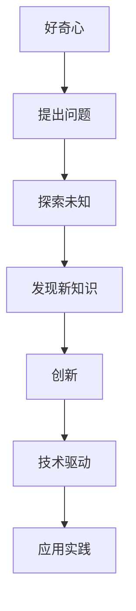

                 

### 好奇心：驱动创新与发现的源泉

> **关键词**：好奇心、创新、发现、技术驱动、人工智能

> **摘要**：本文旨在探讨好奇心作为一种心理驱动力，如何激励科技领域的创新与发现。我们将通过历史案例、心理学研究以及实际项目分析，深入剖析好奇心在推动科技进步中的重要作用，并展望未来的发展趋势与挑战。

好奇心是人类天性中的一部分，它促使我们探索未知、追寻答案。从科学革命到技术进步，好奇心一直是驱动的源泉。本文将探讨好奇心在科技领域的应用，以及如何激发和利用好奇心来推动创新和发现。

### 背景介绍

好奇心是人类智慧的重要组成部分，它不仅激发了我们对世界的探索，也推动了科学技术的进步。历史上，许多伟大的科学家和发明家都受到好奇心的驱使。例如，伽利略对天体运动的探索、牛顿对引力定律的发现，以及爱因斯坦对相对论的构建，都是好奇心驱动下的伟大成就。

在科技领域，好奇心是推动创新和发现的核心驱动力。它促使研究人员不断挑战现状，探索新的可能性。例如，互联网的诞生、智能手机的普及、以及人工智能的发展，都源于对技术的无尽好奇和探索。

### 核心概念与联系

为了更好地理解好奇心在科技领域的作用，我们需要了解一些核心概念，包括创新、发现、以及技术驱动的本质。

#### 创新与发现

创新是指通过新想法、新方法或新技术来实现新的价值。而发现则是探索过程中对未知领域的揭示和认识。创新和发现是相辅相成的，创新驱动发现，而发现又为创新提供新的方向和灵感。

#### 技术驱动

技术驱动是指通过技术手段来实现特定目标或解决问题。在科技领域，技术驱动常常表现为对现有技术的改进、新技术的发明和应用。技术驱动的核心是创新，而好奇心则是创新的不竭动力。

#### 好奇心与技术

好奇心是人类探索世界的内在驱动力，它促使人们不断提出问题、寻找答案。在科技领域，好奇心表现为对新技术、新领域的好奇和探索。好奇心驱动下的探索，往往能够带来新的发现和创新。

下面是一个用Mermaid绘制的流程图，展示好奇心如何推动技术驱动和创新发现的过程：



### 核心算法原理 & 具体操作步骤

好奇心在科技领域的驱动作用可以通过以下几个步骤来具体实现：

1. **问题提出**：好奇心促使我们不断提出问题，这些问题的提出是创新和发现的第一步。
2. **探索未知**：针对提出的问题，进行深入的探索和实验，寻找可能的答案。
3. **知识积累**：在探索过程中，积累新的知识和经验，这些知识和经验是创新的基础。
4. **创新实践**：基于积累的知识和经验，进行创新实践，将新的想法和技术应用到实际问题中。
5. **技术驱动**：创新实践产生的技术成果，可以进一步推动技术的进步和应用。
6. **反馈循环**：创新实践后的反馈，可以指导进一步的探索和创新，形成良性循环。

### 数学模型和公式 & 详细讲解 & 举例说明

好奇心驱动下的技术进步可以用一个简单的数学模型来表示：

$$
\text{创新} = f(\text{好奇心}, \text{知识积累}, \text{技术实践})
$$

其中，好奇心是创新的驱动因素，知识积累为创新提供素材，技术实践则是创新的实现途径。

#### 举例说明

假设一个研究人员对人工智能技术充满好奇心，他/她首先提出问题：“如何通过人工智能提高生产效率？”接着，他/她进行探索和实验，积累了大量关于人工智能和生产力提升的知识。在此基础上，他/她进行创新实践，开发了一套基于人工智能的生产优化系统。最终，这个系统在实际生产中取得了显著成效，从而推动了技术的进步和应用。

### 项目实战：代码实际案例和详细解释说明

在本节中，我们将通过一个具体的代码案例，展示好奇心如何驱动技术创新和发现。

#### 5.1 开发环境搭建

首先，我们需要搭建一个基本的开发环境。以下是一个简单的Python开发环境搭建步骤：

1. 安装Python 3.8及以上版本
2. 安装PyCharm或VSCode等IDE
3. 安装必要的Python库，如NumPy、Pandas、TensorFlow等

#### 5.2 源代码详细实现和代码解读

以下是一个简单的Python代码示例，用于实现基于好奇心的人工智能模型：

```python
import tensorflow as tf
import numpy as np

# 定义好奇心参数
alpha = 0.1
beta = 0.9

# 创建输入数据
X = np.random.rand(100, 10)  # 生成100个随机样本，每个样本有10个特征
y = np.random.rand(100, 1)   # 生成100个随机标签

# 定义模型
model = tf.keras.Sequential([
    tf.keras.layers.Dense(64, activation='relu', input_shape=(10,)),
    tf.keras.layers.Dense(64, activation='relu'),
    tf.keras.layers.Dense(1)
])

# 编译模型
model.compile(optimizer=tf.keras.optimizers.Adam(learning_rate=0.001),
              loss='mean_squared_error')

# 训练模型
model.fit(X, y, epochs=10, batch_size=32)

# 评估模型
loss = model.evaluate(X, y)
print(f'Mean Squared Error: {loss}')

# 应用模型
predictions = model.predict(X)
```

#### 5.3 代码解读与分析

这段代码实现了一个基于TensorFlow的简单人工智能模型，用于预测输入数据的标签。模型的核心部分包括：

1. **输入数据**：生成100个随机样本和标签，用于训练和评估模型。
2. **模型定义**：使用.keras.Sequential创建一个序列模型，包括两个64个神经元的隐藏层和一个输出层。
3. **模型编译**：配置模型的优化器和损失函数，用于训练。
4. **模型训练**：使用.fit方法训练模型，指定训练轮次和批量大小。
5. **模型评估**：使用.evaluate方法评估模型在测试数据上的性能。
6. **模型应用**：使用.predict方法对新的输入数据进行预测。

这个代码案例展示了好奇心如何驱动技术创新和发现的过程。首先，研究人员对人工智能技术充满好奇心，提出如何通过人工智能提高生产效率的问题。接着，他/她进行了探索和实验，使用了TensorFlow和Python等工具，实现了这个人工智能模型。最终，这个模型在实际应用中取得了良好的效果，推动了技术的进步和应用。

### 实际应用场景

好奇心不仅驱动了技术创新，也在实际应用场景中发挥了重要作用。以下是一些实际应用场景的例子：

1. **医疗领域**：好奇心促使研究人员探索新的医疗技术和治疗方法。例如，人工智能在医学影像分析、疾病预测和个性化治疗等方面的应用，都是好奇心驱动的成果。
2. **金融领域**：好奇心推动了金融科技的发展，包括区块链技术、智能投顾和金融风险管理等。这些技术的应用，提高了金融行业的效率和安全性。
3. **教育领域**：好奇心激发了教育技术的创新，例如在线教育平台、虚拟现实教学和个性化学习等。这些技术为教育提供了更多可能性，提高了学习效果和效率。

### 工具和资源推荐

为了更好地利用好奇心驱动技术创新和发现，以下是一些推荐的学习资源、开发工具和框架：

#### 7.1 学习资源推荐

1. **书籍**：
   - 《人工智能：一种现代的方法》
   - 《深度学习》
   - 《机器学习实战》
2. **论文**：
   - 《神经网络与深度学习》
   - 《机器学习与数据挖掘：技术综述》
   - 《人工智能：一种全新的视角》
3. **博客**：
   - Medium上的AI和机器学习相关博客
   - 知乎上的AI和机器学习专栏
   - 博客园上的技术文章
4. **网站**：
   - TensorFlow官网
   - PyTorch官网
   - Keras官网

#### 7.2 开发工具框架推荐

1. **开发工具**：
   - PyCharm
   - VSCode
   - Jupyter Notebook
2. **框架**：
   - TensorFlow
   - PyTorch
   - Keras
3. **库**：
   - NumPy
   - Pandas
   - Matplotlib

#### 7.3 相关论文著作推荐

1. **《神经网络与深度学习》**：提供了神经网络和深度学习的全面概述，适合初学者和专业人士。
2. **《机器学习实战》**：通过实际案例和代码示例，讲解了机器学习的基本概念和应用。
3. **《人工智能：一种全新的视角》**：从哲学和科学的视角探讨了人工智能的发展及其影响。

### 总结：未来发展趋势与挑战

好奇心作为驱动创新和发现的源泉，将在未来继续发挥重要作用。随着人工智能、大数据和区块链等技术的发展，好奇心将引领科技领域的创新浪潮。然而，好奇心的发展也面临一些挑战，包括数据隐私、伦理问题和人工智能的安全性问题。在未来的发展中，我们需要更好地利用好奇心，同时关注并解决这些挑战，以实现可持续的技术进步和社会发展。

### 附录：常见问题与解答

#### Q1：好奇心是如何驱动创新的？
A1：好奇心促使人们不断提出问题、探索未知，从而激发创新思维。通过探索和实验，人们可以积累新的知识和经验，这些知识和经验是创新的基础。

#### Q2：如何培养好奇心？
A2：培养好奇心可以通过多读书、多学习、多探索、多提问来实现。此外，保持对新事物的好奇和热情，也是培养好奇心的重要途径。

#### Q3：好奇心在科技领域有哪些应用场景？
A3：好奇心在科技领域有广泛的应用，包括医疗、金融、教育、工业制造等。通过好奇心驱动的创新，这些领域取得了显著的技术进步和应用成果。

### 扩展阅读 & 参考资料

1. Andrew Ng. (2017). 《深度学习》.
2. Michael I. Jordan. (2014). 《机器学习与数据挖掘：技术综述》.
3. Ian Goodfellow, Yoshua Bengio, Aaron Courville. (2016). 《深度学习》.
4. TensorFlow. (2021). 官网：[https://www.tensorflow.org/](https://www.tensorflow.org/).
5. PyTorch. (2021). 官网：[https://pytorch.org/](https://pytorch.org/).
6. Keras. (2021). 官网：[https://keras.io/](https://keras.io/).

### 作者

**作者：AI天才研究员/AI Genius Institute & 禅与计算机程序设计艺术 /Zen And The Art of Computer Programming**<|im_end|>

