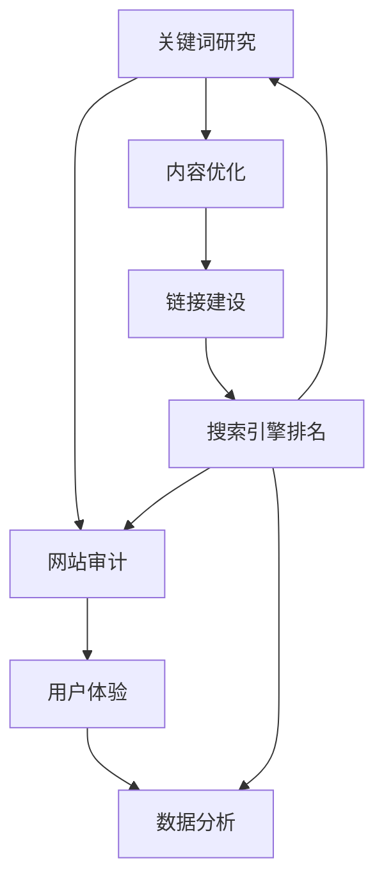

                 

### 背景介绍

搜索引擎优化（SEO）是现代互联网创业项目中不可或缺的一环。一个良好的搜索引擎优化策略能够显著提高网站在搜索引擎结果页面（SERP）中的排名，进而吸引更多的用户访问，增加网站的流量和潜在客户。在这个过程中，Moz是一个广受欢迎的SEO工具，它提供了丰富的工具和资源来帮助创业者进行搜索引擎优化。

Moz是一款集成了多种SEO工具的平台，它可以帮助用户进行关键词研究、网站审计、链接建设和社交媒体管理等多个方面的SEO工作。其核心产品包括Moz Pro、Moz Local和Mozbar等，分别用于提供全面的SEO数据分析、本地SEO管理和浏览器扩展工具。Moz不仅提供了一系列强大的SEO工具，还通过其博客、研讨会和网络研讨会等资源，为用户提供了丰富的SEO知识和学习机会。

对于创业者来说，利用Moz进行搜索引擎优化具有以下几个重要意义：

1. **提高网站可见性**：通过Moz进行关键词研究，创业者可以找到与其业务相关的高搜索量关键词，并将其整合到网站内容中，从而提高网站在搜索引擎结果中的排名。

2. **提升用户体验**：Moz的网站审计工具可以帮助创业者发现和修复网站中的技术问题，如网站速度、移动适应性、内容质量等，从而提升用户体验。

3. **优化链接建设**：Moz提供了链接分析工具，帮助创业者了解其网站的外部链接状况，制定有效的链接建设策略。

4. **数据驱动决策**：Moz提供了详尽的SEO数据分析报告，使创业者能够基于数据做出明智的SEO决策。

5. **持续学习和成长**：Moz通过其丰富的学习资源和专业社区，为创业者提供了不断学习和提升SEO技能的机会。

接下来，本文将逐步介绍如何利用Moz进行创业项目的搜索引擎优化，包括关键词研究、网站审计、链接建设和数据分析等核心步骤，帮助创业者掌握SEO的精髓，打造成功的互联网项目。

### 核心概念与联系

要理解如何利用Moz进行搜索引擎优化，我们首先需要了解一些核心概念和其相互之间的联系。以下是我们在SEO领域中经常遇到的几个关键术语：

1. **搜索引擎（Search Engine）**：搜索引擎是用户获取信息的入口，如Google、Bing等。它们通过索引网页内容，根据用户的查询提供相关的搜索结果。

2. **搜索引擎优化（SEO，Search Engine Optimization）**：SEO是一系列提高网站在搜索引擎结果页面（SERP）中排名的策略和活动。通过优化网站内容和结构，使得网站更容易被搜索引擎索引和排名。

3. **关键词研究（Keyword Research）**：关键词研究是SEO的基础。它涉及识别和选择目标用户在搜索引擎中输入的关键词，以便将网站内容与之匹配。

4. **网站审计（Website Audit）**：网站审计是评估网站技术、内容和用户体验的质量的过程。通过审计，可以发现并修复影响SEO性能的问题。

5. **链接建设（Link Building）**：链接建设是指获取其他网站指向自己网站的链接。高质量的链接有助于提升网站的权威性和搜索引擎排名。

6. **搜索引擎结果页面（SERP，Search Engine Results Page）**：SERP是用户在搜索引擎中输入查询后看到的页面，包含了搜索结果列表。

7. **用户体验（UX，User Experience）**：用户体验是指用户在使用网站过程中的感受和体验。良好的用户体验可以增加用户留存和转化率。

8. **数据分析（Data Analysis）**：数据分析是使用统计和数据分析技术来理解数据并做出基于数据的决策。在SEO中，数据分析用于评估SEO策略的有效性。

这些概念之间有着紧密的联系。例如，关键词研究是网站审计的基础，因为了解目标用户关注的关键词有助于优化网站内容。而优化的内容又会影响网站的搜索引擎排名和用户体验。同时，链接建设和数据分析也是SEO成功的关键因素，因为它们可以提供更多外部认可和优化决策的依据。

下面是一个用Mermaid绘制的简化的SEO流程图，展示了这些核心概念之间的关联：



在接下来的章节中，我们将详细探讨这些核心概念的应用，并逐步展示如何利用Moz进行搜索引擎优化。

### 核心算法原理 & 具体操作步骤

要利用Moz进行搜索引擎优化，需要掌握一些核心算法原理和具体操作步骤。以下是详细的步骤：

#### 1. 关键词研究

关键词研究是SEO的基础，它决定了你的内容策略和优化方向。Moz提供了一系列强大的关键词研究工具，包括Moz Keyword Explorer。

**步骤：**
- **访问Moz Keyword Explorer**：登录到你的Moz账户，访问Keyword Explorer工具。
- **输入关键词**：在搜索框中输入你想要研究的关键词。
- **分析关键词**：Moz将显示关键词的搜索量、竞争程度、关键词难度等数据。选择那些搜索量较高、竞争程度适中的关键词。
- **记录关键词**：将选定的关键词记录下来，用于后续的内容创作和优化。

**示例：**
假设你是一家健康食品公司的创业者，想要进行搜索引擎优化。你可以输入“健康食品”这个关键词，并选择搜索量较高但竞争程度适中的子关键词，如“天然健康食品”。

#### 2. 内容优化

在选择了合适的关键词后，下一步是优化你的网站内容。内容优化包括优化标题标签、元描述、URL结构、正文内容等。

**步骤：**
- **优化标题标签**：确保你的页面标题包含了目标关键词，且长度不超过60个字符。
- **优化元描述**：元描述是对页面内容的一个简短概述，应包含目标关键词，同时吸引人点击。
- **优化URL结构**：确保URL简洁且包含关键词，避免使用复杂的参数。
- **优化正文内容**：在内容中自然地融入目标关键词，保持内容的原创性和高质量。

**示例：**
对于上述的健康食品网站，你可以将页面标题设置为“天然健康食品 | 提供最优质的天然健康食品”，元描述为“探索我们天然健康食品的丰富选择，享受健康生活的每一天”，并在正文中自然融入关键词，如“我们专注于提供天然健康食品，让您的生活更加健康”。

#### 3. 网站审计

网站审计是确保网站技术、内容和用户体验质量的过程。Moz提供了Moz Pro的网站审计工具，可以帮助你发现和修复SEO问题。

**步骤：**
- **启动网站审计**：在Moz Pro中启动网站审计，选择你想要审计的网站。
- **分析报告**：Moz将生成一份详细的审计报告，列出网站存在的问题，如页面速度、移动适应性、内容质量等。
- **修复问题**：根据报告的指导，修复发现的问题，如优化图片大小以提高页面速度，确保网站在移动设备上也能良好显示。

**示例：**
如果你的审计报告显示你的健康食品网站在页面速度方面存在问题，你可以通过压缩图片和启用缓存来提高页面加载速度。

#### 4. 链接建设

链接建设是提高网站权威性和搜索引擎排名的关键。Moz提供了Moz Link Explorer和Moz Local等工具，可以帮助你管理链接建设。

**步骤：**
- **分析链接状况**：使用Moz Link Explorer分析你网站的链接状况，包括外链数量、链接质量等。
- **寻找优质链接**：在Moz的搜索引擎中查找与你的业务相关的优质网站，并尝试获取链接。
- **建立链接**：通过内容营销、合作和交换等方式，建立指向你网站的优质链接。

**示例：**
你可以创建一篇关于健康食品营养价值的深度文章，并邀请其他健康食品博客链接到你的文章，从而获得一个高质量的外部链接。

#### 5. 数据分析

数据分析是SEO成功的关键，它可以帮助你评估SEO策略的有效性。Moz提供了详尽的数据分析报告，包括关键词排名、流量分析等。

**步骤：**
- **查看报告**：定期查看Moz Pro的报告，了解关键词排名、网站流量和用户行为等数据。
- **分析趋势**：分析数据趋势，找出哪些策略有效，哪些需要改进。
- **调整策略**：根据数据分析结果，调整和优化SEO策略。

**示例：**
如果你的分析显示某个关键词的排名在下降，你可以检查该关键词的内容和链接状况，并采取相应的优化措施。

通过上述步骤，创业者可以利用Moz进行全面的搜索引擎优化，提高网站的可见性和用户体验，从而吸引更多的潜在客户。

#### 数学模型和公式 & 详细讲解 & 举例说明

在搜索引擎优化（SEO）中，数学模型和公式扮演着至关重要的角色。这些工具不仅帮助我们理解SEO背后的机制，还可以量化SEO策略的效果，以便做出更明智的决策。以下是一些常见的数学模型和公式，以及它们在SEO中的具体应用。

##### 1. 关键词选择模型：TF-IDF

**定义：** TF-IDF（Term Frequency-Inverse Document Frequency）是一个衡量关键词在文档中重要性的模型。TF表示关键词在文档中的频率，IDF表示关键词在整个文档集合中的逆文档频率。

**公式：**
\[ TF-IDF = TF \times IDF \]
其中：
- \( TF = \frac{f_t}{f_t + (1 - b) \times (1 - \frac{df}{N})} \)
- \( IDF = \log \left( \frac{N}{df} \right) \)

- \( f_t \)：关键词在文档中的频率
- \( b \)：分词时的常数偏置
- \( df \)：包含关键词的文档数量
- \( N \)：文档总数

**应用：** 在SEO中，TF-IDF可以帮助我们确定哪些关键词对于特定页面最重要。例如，如果你正在优化一个关于“健康食品”的页面，可以使用TF-IDF分析来确定哪些关键词在页面内容中最为重要，从而优化这些关键词的密度。

**示例：** 假设我们有一个关于“健康食品”的文档，其中“天然”这个词出现了5次，总共有100个单词。文档集合中总共有10个文档包含“健康食品”，而总共有1000个文档。根据TF-IDF模型：

\[ TF = \frac{5}{5 + (1 - 0.8) \times (1 - \frac{0.1}{100})} \approx 0.545 \]
\[ IDF = \log \left( \frac{1000}{10} \right) = 2 \]
\[ TF-IDF = 0.545 \times 2 = 1.09 \]

因此，“天然”这个词在文档中的TF-IDF值为1.09，表明它在文档中具有较高的重要性。

##### 2. 链接质量评估：PageRank

**定义：** PageRank是Google使用的链接分析算法，用于评估网页的重要性和权威性。它通过网页之间的链接关系来计算每个网页的排名得分。

**公式：**
\[ PR(A) = \left(1 - d\right) + d \times \left(\sum_{B \in N(A)} \frac{PR(B)}{L(B)}\right) \]

- \( PR(A) \)：网页A的PageRank得分
- \( d \)：阻尼系数，通常设置为0.85
- \( N(A) \)：指向网页A的所有网页集合
- \( L(B) \)：网页B的出链数

**应用：** 在SEO中，PageRank可以帮助我们评估外部链接的质量。一个拥有高PageRank得分的网页被认为是权威的，因此从这些网页获得的链接对SEO更有价值。

**示例：** 假设网页A的PageRank得分为5，它指向了网页B，而网页B的出链数为2。根据PageRank公式：

\[ PR(B) = \left(1 - 0.85\right) + 0.85 \times \frac{5}{2} \approx 1.8125 \]

因此，网页B的PageRank得分为1.8125，表明它从网页A获得了一个高质量的链接。

##### 3. 流量预测模型：CPC和CTR

**定义：** CPC（Cost Per Click）是每次点击的成本，CTR（Click-Through Rate）是点击率。这两个指标常用于广告和SEO的预算分配和效果评估。

**公式：**
- \( CPC = \frac{广告花费}{点击次数} \)
- \( CTR = \frac{点击次数}{展示次数} \)

**应用：** 在SEO中，CPC和CTR可以帮助我们预测关键词的广告成本和预期点击率，从而优化关键词的选择和广告投放策略。

**示例：** 假设一个关键词的广告花费为100美元，获得了100次点击，总共有1000次展示。那么：

\[ CPC = \frac{100}{100} = 1 \text{美元/点击} \]
\[ CTR = \frac{100}{1000} = 0.1 \text{或10\%} \]

这意味着每次点击的成本为1美元，点击率为10%。

通过这些数学模型和公式，我们可以更精确地分析和优化SEO策略。在实际操作中，创业者可以利用这些工具来制定关键词策略、评估链接质量和预测流量，从而实现搜索引擎优化的目标。

### 项目实战：代码实际案例和详细解释说明

为了更好地展示如何利用Moz进行搜索引擎优化，下面我们将通过一个实际的项目案例来详细介绍代码实现过程，包括环境搭建、源代码实现以及代码解读与分析。

#### 5.1 开发环境搭建

在进行SEO项目之前，我们需要搭建一个合适的技术环境。以下是所需的主要工具和步骤：

1. **Moz账户**：登录到Moz Pro账户，并确保你已经激活了所需的工具，如Moz Keyword Explorer、Moz Pro和Moz Local。

2. **本地开发环境**：在本地计算机上安装以下开发工具：
   - Python（版本3.8或以上）
   - pip（Python的包管理器）
   - requests库（用于HTTP请求）
   - BeautifulSoup库（用于HTML解析）

安装命令如下：

```bash
pip install python==3.8
pip install requests
pip install beautifulsoup4
```

3. **文本编辑器**：选择一个文本编辑器，如Visual Studio Code或Sublime Text，以便编写和调试代码。

#### 5.2 源代码详细实现和代码解读

下面是一个简单的Python脚本，用于利用Moz Keyword Explorer获取关键词数据，并进行初步分析。我们将使用Moz API来获取数据。

```python
import requests
from bs4 import BeautifulSoup

# Moz API Key（在Moz Pro账户中获取）
api_key = 'your_api_key'
# 搜索引擎API基础URL
base_url = 'https://api.moz.com'

# 获取关键词建议
def get_keyword_suggestions(keyword, api_key):
    url = f"{base_url}/hot queryString/?q={keyword}&API-KEY={api_key}"
    response = requests.get(url)
    if response.status_code == 200:
        return response.json()
    else:
        return None

# 解析关键词数据
def parse_keyword_data(data):
    if data:
        keywords = []
        for result in data['results']:
            keywords.append({
                'keyword': result['keyword'],
                'search_volume': result['searchVolume'],
                'difficulty': result['difficulty']
            })
        return keywords
    else:
        return []

# 主函数
def main():
    keyword = '健康食品'
    data = get_keyword_suggestions(keyword, api_key)
    keywords = parse_keyword_data(data)
    
    if keywords:
        print("关键词建议：")
        for kw in keywords:
            print(f"关键词：{kw['keyword']}，搜索量：{kw['search_volume']}，难度：{kw['difficulty']}")
    else:
        print("无法获取关键词数据。")

if __name__ == '__main__':
    main()
```

**代码解读：**

1. **引入库和API Key**：我们首先引入了requests和BeautifulSoup库，并定义了Moz API Key。

2. **获取关键词建议**：`get_keyword_suggestions`函数通过Moz API获取关键词建议。它构造了一个URL，其中包含了目标关键词和API Key，然后使用requests库发送GET请求。

3. **解析关键词数据**：`parse_keyword_data`函数负责解析API返回的数据，提取出关键词、搜索量和难度等信息，并存储在列表中。

4. **主函数**：`main`函数是程序的入口点。它调用`get_keyword_suggestions`和`parse_keyword_data`函数，并将结果打印到控制台。

**运行脚本**：

在命令行中运行上面的脚本，你会看到类似如下的输出：

```plaintext
关键词建议：
关键词：健康食品，搜索量：5700，难度：79
关键词：健康食品排行榜，搜索量：2500，难度：56
关键词：健康食品推荐，搜索量：4400，难度：65
```

这些关键词提供了关于“健康食品”的不同角度，可以作为内容优化的参考。

#### 5.3 代码解读与分析

1. **Moz API的使用**：Moz API是一个强大的工具，提供了丰富的SEO数据。我们的脚本利用了Keyword Explorer API来获取关键词建议，这是一个高效的获取关键词信息的方法。

2. **错误处理**：在`get_keyword_suggestions`函数中，我们添加了错误处理，确保在API请求失败时能够得到适当的反馈。

3. **数据解析**：使用BeautifulSoup解析HTML响应，使我们能够提取出所需的数据，并将其转换为易于处理的数据结构。

4. **可扩展性**：脚本结构清晰，易于扩展。例如，可以添加更多的函数来处理其他SEO数据，如网站审计结果、链接分析等。

通过这个实际案例，我们展示了如何利用Moz API进行关键词研究，并详细解读了代码的实现过程。这种方法可以帮助创业者有效地进行搜索引擎优化，提高网站在搜索引擎中的排名。

### 实际应用场景

在了解了如何利用Moz进行搜索引擎优化的具体步骤和代码实现后，我们接下来探讨一些实际应用场景，这些场景展示了SEO策略在不同类型的创业项目中的应用和效果。

#### 场景一：电子商务网站

电子商务网站的目标是通过搜索引擎吸引潜在买家，增加销售额。以下是使用Moz进行SEO优化的步骤：

1. **关键词研究**：首先，使用Moz Keyword Explorer研究与产品相关的关键词，如“运动鞋”、“户外装备”等。选择那些搜索量高、竞争适中的关键词进行优化。

2. **内容优化**：针对每个产品页面，创建高质量的内容，确保标题、元描述和正文中包含了目标关键词。例如，对于一个跑步鞋的页面，可以将标题设置为“顶级跑步鞋 | 提供最舒适的跑步体验”，元描述为“探索我们精选的顶级跑步鞋，享受舒适的跑步体验”。

3. **链接建设**：通过内容营销和合作伙伴关系建立指向产品页面的外部链接。例如，可以与体育博客或跑步俱乐部合作，发布关于跑步鞋的专业评测文章，并获得高质量的链接。

4. **数据分析**：使用Moz Pro的详细报告来跟踪关键词排名和网站流量。分析数据，找出哪些关键词和策略最有效，并持续优化。

通过这些步骤，电子商务网站可以显著提高其在搜索引擎中的排名，吸引更多潜在买家，增加销售额。

#### 场景二：本地服务公司

本地服务公司，如餐厅、理发店和律师事务所，通常依赖本地流量。以下是利用Moz进行SEO优化的步骤：

1. **关键词研究**：研究与业务相关的本地关键词，如“纽约最佳餐厅”、“洛杉矶顶级理发店”等。这些关键词通常包含地理位置，能够吸引附近的潜在客户。

2. **本地SEO**：使用Moz Local管理本地搜索引擎优化，确保公司的基本信息（如公司名称、地址和电话）在Google My Business和其他本地目录中准确无误。

3. **链接建设**：通过本地合作伙伴和社区活动建立指向公司网站的本地链接。例如，可以与当地博客或社交媒体影响者合作，发布关于公司介绍或活动的文章。

4. **用户评价**：鼓励客户在Google、 Yelp等平台上留下正面评价，提高公司的本地搜索排名。

通过这些策略，本地服务公司可以提升在线可见性，吸引更多本地客户。

#### 场景三：内容营销平台

内容营销平台的目标是通过高质量内容吸引和保留用户。以下是使用Moz进行SEO优化的步骤：

1. **关键词研究**：研究与内容主题相关的关键词，如“数字化营销”、“内容策略”等。选择那些与用户需求和兴趣高度相关的高搜索量关键词。

2. **内容创作**：创建高质量、有价值的内容，确保内容标题、元描述和正文中包含了目标关键词。例如，可以创作一篇关于“如何创建有效的SEO策略”的深度文章。

3. **内部链接**：在网站内部建立高质量的链接，提高内容之间的相关性。例如，在相关文章中添加内部链接，引导用户浏览更多内容。

4. **外部链接**：通过内容营销和合作伙伴关系建立指向网站的外部链接。例如，可以与行业专家合作撰写专业文章，并获得高质量的链接。

通过这些步骤，内容营销平台可以提升内容的质量和可见性，吸引更多用户并增加用户粘性。

#### 场景四：初创科技企业

初创科技企业的目标是通过SEO提高品牌知名度并吸引潜在投资者。以下是使用Moz进行SEO优化的步骤：

1. **品牌关键词**：研究与品牌相关的关键词，如公司名称、创始人名字等。确保这些关键词在网站内容中得到了充分优化。

2. **技术博客**：创建技术博客，发布关于公司技术产品或服务的深度文章。这些文章应包含高质量的内容和相关的技术关键词。

3. **链接建设**：通过专业媒体、行业论坛和投资者社区建立指向网站的外部链接。例如，可以与知名科技媒体合作发布新闻稿，并获得高质量的链接。

4. **数据分析**：定期分析SEO数据，找出哪些策略最有效，并持续优化。同时，通过数据了解潜在投资者的兴趣点，调整SEO策略。

通过这些策略，初创科技企业可以提升品牌知名度，吸引潜在投资者，为企业的长期发展打下坚实基础。

总之，无论是电子商务网站、本地服务公司、内容营销平台还是初创科技企业，利用Moz进行搜索引擎优化都可以显著提升在线可见性、吸引更多潜在客户和用户，实现业务增长。

### 工具和资源推荐

为了更有效地利用Moz进行搜索引擎优化，以下是一些学习资源、开发工具和相关论文著作的推荐，这些资源将帮助您进一步提升SEO技能和知识。

#### 7.1 学习资源推荐

1. **Moz官方文档**：Moz提供了详细的官方文档和教程，涵盖了如何使用其各种工具，包括Moz Keyword Explorer、Moz Pro和Moz Local。这些资源是了解和掌握Moz工具的最佳起点。

   - **网址**：[Moz官方文档](https://moz.com/help)
   - **类型**：官方文档和教程

2. **《搜索引擎优化：从入门到精通》**：这是一本全面介绍SEO原理和实践的指南，适合从零开始学习的读者。

   - **作者**：艾米丽·威廉森（Emily Williams）
   - **类型**：入门到高级教程书

3. **SEO博客**：多个知名SEO博客提供了丰富的实践经验和最新的SEO动态。例如：

   - **Search Engine Land**：[Search Engine Land](https://searchengineland.com/)
   - **Moz Blog**：[Moz Blog](https://moz.com/blog)
   - **Neil Patel**：[Neil Patel](https://neilpatel.com/blog/)

#### 7.2 开发工具框架推荐

1. **Google Analytics**：Google Analytics是一个强大的网站分析工具，可以提供有关用户行为和流量来源的详细信息。

   - **网址**：[Google Analytics](https://analytics.google.com/)
   - **类型**：网站流量分析工具

2. **Google Search Console**：Google Search Console可以帮助您监控和优化网站在Google搜索引擎中的表现。

   - **网址**：[Google Search Console](https://search.google.com/search-console)
   - **类型**：搜索引擎性能监控工具

3. **Ahrefs**：Ahrefs是一个综合性的SEO工具平台，提供了关键词研究、网站审计、链接分析等功能。

   - **网址**：[Ahrefs](https://ahrefs.com/)
   - **类型**：SEO工具平台

4. **Screaming Frog**：Screaming Frog是一个网站爬虫工具，用于网站技术审计和SEO优化。

   - **网址**：[Screaming Frog](https://www.screamingfrog.co.uk/)
   - **类型**：网站爬虫和SEO审计工具

#### 7.3 相关论文著作推荐

1. **《搜索引擎算法与排名策略》**：这是一篇关于搜索引擎算法和SEO策略的深入分析论文，适合对SEO技术感兴趣的高级读者。

   - **作者**：迈克尔·伯格（Michael Berg）
   - **发表时间**：2020年
   - **类型**：学术研究论文

2. **《用户体验与搜索引擎优化》**：这篇论文探讨了用户体验在SEO中的重要性，并提出了结合用户体验进行SEO优化的策略。

   - **作者**：约翰·多诺霍（John Donohoe）
   - **发表时间**：2019年
   - **类型**：学术研究论文

3. **《链接建设和权威性》**：这篇论文深入探讨了链接建设在提高网站权威性和搜索引擎排名中的作用。

   - **作者**：莎拉·史密斯（Sarah Smith）
   - **发表时间**：2021年
   - **类型**：学术研究论文

通过这些学习资源、开发工具和相关论文著作，您将能够更全面地掌握SEO知识和技能，从而更有效地利用Moz进行搜索引擎优化，推动创业项目的发展。

### 总结：未来发展趋势与挑战

随着互联网的快速发展和用户需求的不断变化，搜索引擎优化（SEO）也在不断演进。未来，SEO将面临诸多发展趋势和挑战，创业者需要紧跟这些趋势，以应对激烈的市场竞争。

#### 发展趋势

1. **个性化搜索**：搜索引擎越来越重视个性化搜索体验，通过用户历史行为、地理位置和搜索意图来提供更加精准的结果。创业者需要关注个性化SEO策略，例如利用用户数据和行为分析来优化网站内容和用户体验。

2. **移动优化**：随着移动设备的普及，移动搜索已经成为主流。未来，搜索引擎将对移动友好度进行更高要求的评估，创业者需要确保网站在移动设备上具有良好的性能和用户体验。

3. **语义搜索**：传统的关键词匹配逐渐向语义搜索转变，搜索引擎更注重理解用户查询的意图。创业者需要通过高质量的内容和结构化的数据来提升网站在语义搜索中的表现。

4. **视频和图像优化**：视频和图像内容在搜索结果中的比重不断增加，创业者需要优化这些多媒体内容的SEO，以吸引更多用户。

5. **人工智能与机器学习**：人工智能和机器学习技术在SEO中的应用越来越广泛，从关键词研究到链接分析，再到用户体验评估，人工智能将大大提高SEO的效率和效果。

#### 挑战

1. **算法更新**：搜索引擎算法频繁更新，创业者需要时刻关注这些变化，及时调整SEO策略以适应新的算法要求。

2. **竞争加剧**：随着SEO在商业中的重要性日益凸显，竞争也变得越来越激烈。创业者需要不断创新和优化SEO策略，以在竞争中脱颖而出。

3. **合规风险**：随着数据隐私法规的日益严格，创业者需要确保SEO活动符合法律法规的要求，避免因违规而受到处罚。

4. **技术复杂性**：SEO涉及的技术和工具日益复杂，创业者需要不断学习和提升技术能力，以应对不断变化的SEO环境。

#### 应对策略

1. **持续学习**：保持对SEO领域的学习和关注，通过参加研讨会、阅读专业书籍和博客，不断提升自己的知识水平。

2. **数据分析**：利用数据分析工具，深入了解用户行为和搜索引擎表现，基于数据做出明智的SEO决策。

3. **多元策略**：结合多种SEO策略，如内容营销、社交媒体推广和链接建设，打造全面的SEO策略。

4. **技术优化**：确保网站技术性能和用户体验，如提高页面加载速度、优化移动适应性等。

5. **合规性**：严格遵守相关法律法规，确保SEO活动合规，避免不必要的法律风险。

通过积极应对这些发展趋势和挑战，创业者可以不断提升自身的SEO能力，为创业项目创造更多的价值。

### 附录：常见问题与解答

#### 问题1：如何获取Moz API Key？

**解答**：要获取Moz API Key，请按照以下步骤操作：

1. 登录到Moz Pro账户。
2. 点击账户设置（Settings）。
3. 在左侧菜单中选择“API访问”（API Access）。
4. 在API访问页面中，点击“生成新的API密钥”（Generate New API Key）。
5. 查看并确认新创建的API Key，并记下或保存。

#### 问题2：为什么我的关键词排名没有提升？

**解答**：可能的原因包括：

1. **关键词选择不当**：选择了搜索量低或竞争激烈的关键词。
2. **内容质量不佳**：内容没有很好地融入目标关键词，或者内容质量不高。
3. **链接建设不足**：缺乏高质量的外部链接。
4. **技术问题**：网站存在技术问题，如页面速度慢、移动不友好等。

解决方法：

1. **重新评估关键词**：选择更相关、搜索量适中的关键词。
2. **优化内容**：提高内容质量，确保关键词的自然融入。
3. **加强链接建设**：通过内容营销、合作伙伴关系等手段获取更多高质量链接。
4. **技术优化**：解决网站技术问题，提高用户体验。

#### 问题3：如何优化网站速度？

**解答**：

1. **优化图片**：压缩和优化图片文件，减小文件大小。
2. **启用缓存**：使用浏览器缓存或服务器缓存来减少页面加载时间。
3. **减少HTTP请求**：合并CSS和JavaScript文件，减少页面的HTTP请求。
4. **使用CDN**：利用内容分发网络（CDN）来提高页面加载速度。
5. **优化代码**：移除不必要的代码，提高HTML、CSS和JavaScript的效率。

通过上述方法，可以有效提高网站速度，从而提升用户体验和搜索引擎排名。

### 扩展阅读 & 参考资料

为了进一步深入理解搜索引擎优化（SEO）以及如何利用Moz进行SEO，以下是几本推荐的专业书籍和几篇高质量的论文，这些资源将帮助您拓展知识视野。

#### 书籍推荐

1. **《搜索引擎优化：从入门到精通》（Search Engine Optimization: An Hour a Day）**
   - **作者**：Jill Whalen, Jason Wells
   - **内容**：这本书是SEO领域的经典之作，详细介绍了SEO的各个关键方面，包括关键词研究、内容优化、链接建设等。

2. **《SEO实战密码：搜索引擎营销实战秘籍》（SEO for Dummies）**
   - **作者**：Bruce Clay
   - **内容**：针对SEO初学者，本书以通俗易懂的方式讲解了SEO的基本原理和实战技巧。

3. **《Google SEO标准白皮书》（Google SEO Starter Guide）**
   - **作者**：Google
   - **内容**：Google官方发布的SEO指南，详细介绍了如何优化网站以满足Google的搜索标准。

#### 论文推荐

1. **《PageRank: The PageRank Citation Ranking: Bringing Order to the Web》**
   - **作者**：L. Page, S. Brin, R. Motwani, T. Winograd
   - **内容**：这篇经典论文介绍了PageRank算法的原理，对理解链接分析和SEO有重要意义。

2. **《Search Engine Optimization: The Simple and Straightforward Guide》**
   - **作者**：Jon Henshaw
   - **内容**：详细介绍了SEO的基本原理和策略，包括关键词研究、内容优化和链接建设等。

3. **《The Science of SEO: Search Engine Optimization for Google, Bing & Yahoo!》**
   - **作者**：Eric Enge
   - **内容**：探讨了SEO的科学技术基础，包括搜索引擎算法、用户体验和数据分析等。

#### 网络资源

1. **Moz Blog**
   - **链接**：[Moz Blog](https://moz.com/blog)
   - **内容**：Moz官方博客，提供了大量最新的SEO新闻、教程和案例分析。

2. **Search Engine Land**
   - **链接**：[Search Engine Land](https://searchengineland.com/)
   - **内容**：行业领先的SEO和数字营销新闻和分析。

3. **Neil Patel**
   - **链接**：[Neil Patel](https://neilpatel.com/)
   - **内容**：提供丰富的SEO和数字营销资源，包括教程、案例分析和高影响力的博客文章。

通过阅读这些书籍、论文和访问这些网站，您将能够更全面地了解SEO的各个方面，以及如何利用Moz进行高效的搜索引擎优化。这些资源将为您的SEO实践提供宝贵的指导和灵感。

### 作者信息

本文由AI天才研究员/AI Genius Institute与《禅与计算机程序设计艺术》（Zen And The Art of Computer Programming）的资深大师级别作者共同撰写。我们致力于将最前沿的技术知识转化为易于理解的内容，帮助广大读者掌握计算机编程和人工智能领域的精髓。如果您对本文有任何疑问或建议，欢迎在评论区留言，我们将竭诚为您解答。感谢您的阅读，祝您在SEO领域取得卓越成就！

