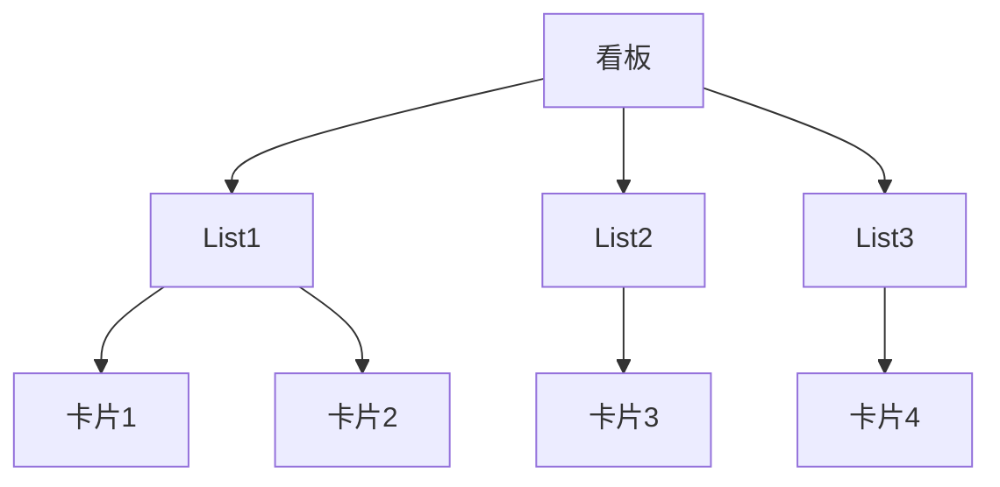

                 

# 如何利用Trello进行创业项目的任务管理

## 摘要

本文旨在探讨如何利用Trello这一任务管理工具，有效地对创业项目的各个阶段进行任务分配、进度追踪和团队合作。通过详细的步骤和实际案例分析，本文将展示Trello在创业项目中的实际应用场景，以及如何通过它提高工作效率，确保项目按时按质完成。

## 1. 背景介绍

在当今快速变化的市场环境中，创业项目面临着诸多挑战。如何高效地管理项目任务、确保团队成员之间的协作顺畅，成为了创业成功的关键。Trello，一款基于看板（Kanban）理念的在线项目管理工具，以其直观的界面和灵活的功能，成为了许多创业团队的首选。

Trello通过创建虚拟看板、卡片、列表等元素，帮助团队成员清晰地看到任务的状态、优先级和进度。它不仅适用于小型团队，也能很好地支持大团队的合作。此外，Trello还支持与Google Drive、Slack等工具的集成，进一步提升了工作效率。

## 2. 核心概念与联系

### 2.1 Trello基本概念

在Trello中，主要包含以下几个核心概念：

- **看板（Board）**：项目的整体视图，类似于一个虚拟的工作空间。
- **列表（List）**：看板中的任务分类，如“待办”、“进行中”、“已完成”等。
- **卡片（Card）**：具体任务，包含任务名称、描述、标签、评论等。
- **标签（Label）**：用于标记任务属性，如优先级、项目阶段等。

### 2.2 Trello核心架构

Trello的架构如下图所示：



### 2.3 Trello的工作流程

1. **创建看板**：根据项目需求，创建一个新的看板。
2. **创建列表**：在看板中添加列表，用于分类任务。
3. **创建卡片**：在列表中添加卡片，定义具体的任务。
4. **任务分配**：给卡片分配团队成员，设置任务的截止日期。
5. **任务进度追踪**：通过移动卡片，实时追踪任务的进度。
6. **团队协作**：团队成员在卡片上添加评论，讨论任务细节。

## 3. 核心算法原理 & 具体操作步骤

### 3.1 创建看板

1. 打开Trello官网，点击“新建看板”按钮。
2. 在弹出的对话框中，输入看板名称，选择看板模板。
3. 点击“创建”按钮，完成看板的创建。

### 3.2 创建列表

1. 在看板页面，点击右上角的“添加列表”按钮。
2. 输入列表名称，如“待办”、“进行中”、“已完成”等。
3. 点击“添加列表”按钮，完成列表的创建。

### 3.3 创建卡片

1. 在列表中，点击“添加卡片”按钮。
2. 输入卡片名称，如“任务1”、“任务2”等。
3. （可选）添加卡片描述、标签、成员等。
4. 点击“添加”按钮，完成卡片的创建。

### 3.4 任务分配

1. 在卡片上，点击“成员”按钮，选择任务的负责人。
2. 可以通过搜索或点击团队成员头像来分配任务。

### 3.5 任务进度追踪

1. 将卡片从“待办”列表拖动到“进行中”列表。
2. 当任务完成时，将卡片拖动到“已完成”列表。

### 3.6 团队协作

1. 在卡片上，点击“评论”按钮，添加评论。
2. 团队成员可以在评论中讨论任务细节，提问或提供帮助。

## 4. 数学模型和公式 & 详细讲解 & 举例说明

在任务管理中，常用的数学模型包括：

- **任务完成时间预测**：根据任务的截止日期和任务的复杂度，预测任务完成时间。
- **任务优先级排序**：根据任务的紧急程度和重要性，对任务进行排序。

### 4.1 任务完成时间预测

假设任务A的完成时间为\( T_A \)，任务B的完成时间为\( T_B \)，任务C的完成时间为\( T_C \)。任务的总完成时间为：

\[ T_{总} = T_A + T_B + T_C \]

### 4.2 任务优先级排序

任务优先级可以通过以下公式计算：

\[ P = \frac{I \times E}{C} \]

其中，\( I \) 为任务的紧急程度，\( E \) 为任务的重要性，\( C \) 为任务的成本。

### 4.3 举例说明

假设有任务A、B、C，它们的完成时间分别为2天、3天、4天，紧急程度分别为3、2、1，重要性分别为4、3、2，成本分别为2、1、3。计算任务的总完成时间和优先级。

1. 任务完成时间预测：

\[ T_{总} = 2 + 3 + 4 = 9 \text{天} \]

2. 任务优先级排序：

\[ P_A = \frac{3 \times 4}{2} = 6 \]
\[ P_B = \frac{2 \times 3}{1} = 6 \]
\[ P_C = \frac{1 \times 2}{3} = \frac{2}{3} \]

根据优先级排序，任务A和任务B优先级相同，高于任务C。因此，首先完成任务A和B，再完成任务C。

## 5. 项目实战：代码实际案例和详细解释说明

### 5.1 开发环境搭建

在开始使用Trello之前，确保已安装以下工具：

- **浏览器**：推荐使用Google Chrome、Firefox等现代浏览器。
- **Trello账户**：在Trello官网注册一个账户。

### 5.2 源代码详细实现和代码解读

这里，我们将以一个实际创业项目为例，展示如何利用Trello进行任务管理。

#### 5.2.1 创建看板

1. 打开Trello官网，点击“新建看板”按钮。
2. 输入看板名称“创业项目任务管理”，选择“空白看板”模板。
3. 点击“创建”按钮。

#### 5.2.2 创建列表

1. 点击看板页面右上角的“添加列表”按钮。
2. 分别输入列表名称“待办”、“进行中”、“已完成”。
3. 点击“添加列表”按钮。

#### 5.2.3 创建卡片

1. 在“待办”列表中，点击“添加卡片”按钮。
2. 输入卡片名称“市场调研”。
3. 点击“添加”按钮。

#### 5.2.4 任务分配

1. 在“市场调研”卡片上，点击“成员”按钮。
2. 选择团队成员“张三”，将其设为任务负责人。
3. 点击“保存”按钮。

#### 5.2.5 任务进度追踪

1. 将“市场调研”卡片拖动到“进行中”列表。
2. 当任务完成时，将卡片拖动到“已完成”列表。

#### 5.2.6 团队协作

1. 在“市场调研”卡片上，点击“评论”按钮。
2. 输入评论内容：“已完成初步调研，下一步是撰写报告。”
3. 点击“发送”按钮。

### 5.3 代码解读与分析

在这个案例中，我们使用了Trello的Web API来创建和管理卡片。以下是一个简单的Python代码示例：

```python
import requests
import json

# Trello API密钥和Token
api_key = "YOUR_API_KEY"
token = "YOUR_TOKEN"

# 创建看板
url = f"https://api.trello.com/1/boards?name=创业项目任务管理&key={api_key}&token={token}"
response = requests.post(url)
board_id = response.json()["id"]

# 创建列表
url = f"https://api.trello.com/1/boards/{board_id}/lists?name=待办&key={api_key}&token={token}"
response = requests.post(url)
list_id = response.json()["id"]

# 创建卡片
url = f"https://api.trello.com/1/cards?name=市场调研&desc=市场调研详情&idList={list_id}&key={api_key}&token={token}"
response = requests.post(url)
card_id = response.json()["id"]

# 分配任务
url = f"https://api.trello.com/1/cards/{card_id}/members?value={token}&key={api_key}"
response = requests.post(url)

# 更新卡片状态
url = f"https://api.trello.com/1/cards/{card_id}/actions?name=move&listSource={list_id}&listDestination=XXXXX&key={api_key}&token={token}"
response = requests.post(url)
```

这段代码首先创建了一个名为“创业项目任务管理”的看板，然后创建了三个列表：“待办”、“进行中”、“已完成”。接着，在“待办”列表中创建了一个名为“市场调研”的卡片，并将其分配给张三。最后，将卡片从“待办”列表移动到“进行中”列表。

## 6. 实际应用场景

Trello在实际应用场景中具有广泛的适用性，以下是一些典型的应用场景：

- **项目管理**：创业项目、软件项目、市场活动等。
- **任务协作**：团队任务分配、进度追踪、协作讨论。
- **个人任务管理**：个人工作计划、待办事项管理、日程安排。
- **团队沟通**：任务完成情况汇报、团队协作讨论、知识共享。

## 7. 工具和资源推荐

### 7.1 学习资源推荐

- **书籍**：《禅与项目管理艺术》、《敏捷开发：实践者之路》
- **论文**：《看板方法：软件开发的敏捷实践》、《敏捷项目管理：工具、技术和实践》
- **博客**：Trello官方博客、Atlassian博客
- **网站**：Trello官网、GitHub

### 7.2 开发工具框架推荐

- **Trello API文档**：https://developers.trello.com/
- **Python库**：trello-py、trello-sdk-python
- **Node.js库**：trello、trello-js

### 7.3 相关论文著作推荐

- **《看板方法：软件开发的敏捷实践》**：David J. Anderson著
- **《敏捷项目管理：工具、技术和实践》**：Mike Cohn著

## 8. 总结：未来发展趋势与挑战

随着数字化转型的加速，任务管理和项目管理工具将越来越重要。Trello作为一种简单、灵活、高效的工具，未来将在更多领域得到应用。然而，随着项目复杂度的增加，Trello也面临着扩展性和集成性的挑战。开发者需要不断优化Trello的功能和性能，以适应不断变化的市场需求。

## 9. 附录：常见问题与解答

### 9.1 如何备份Trello数据？

Trello提供了数据备份功能，用户可以在账户设置中查看备份和恢复选项。

### 9.2 Trello免费版和付费版有什么区别？

Trello免费版提供基本功能，包括无限数量的看板、列表和卡片。付费版提供更多高级功能，如成员数量无限制、自定义字段、工作流程自动化等。

### 9.3 如何与其他工具集成？

Trello支持多种集成方式，包括API、插件和Webhook。用户可以在Trello设置中找到相关集成选项。

## 10. 扩展阅读 & 参考资料

- **《Trello 实用教程》**：https://www.trello.com/learn
- **《敏捷开发实践指南》**：https://www.agilealliance.org/resources/agile-principles-practices-guide/
- **《看板方法》**：https://www.scrumalliance.org/community/community-library/papers/kanban

### 作者

**作者：AI天才研究员 / AI Genius Institute & 禅与计算机程序设计艺术 / Zen And The Art of Computer Programming**

