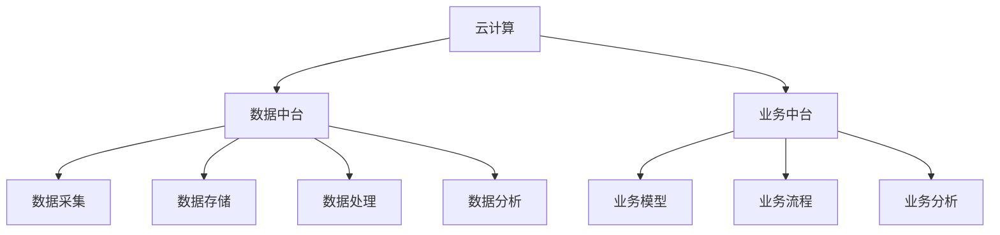
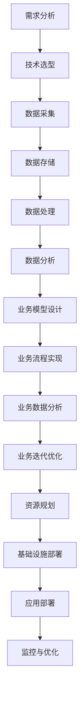

                 

## 文章标题

《如何利用云计算技术构建创业数据中台和业务中台》

## 关键词

云计算、数据中台、业务中台、架构设计、创业公司、技术实践

## 摘要

本文将深入探讨如何利用云计算技术构建创业数据中台和业务中台。通过详细的步骤讲解和实际案例，读者将了解云计算技术的基本概念、核心原理以及如何将这些技术应用于创业公司的数据中台和业务中台的构建中。文章旨在为创业公司提供一条清晰、实用的技术路线，帮助他们高效地利用云计算技术，实现数据与业务的深度融合，提升企业的竞争力。

### 1. 背景介绍

随着互联网和大数据技术的快速发展，云计算逐渐成为企业数字化转型的重要支撑。尤其是在创业公司中，云计算技术不仅能够提供强大的计算和存储能力，还能够实现灵活的资源调配，降低企业运营成本。然而，对于创业公司而言，如何有效地利用云计算技术构建数据中台和业务中台，仍是一个具有挑战性的问题。

数据中台和业务中台是现代企业信息化建设的重要组成部分。数据中台主要负责数据的采集、存储、处理和分析，为业务中台提供数据支持和决策依据。业务中台则围绕核心业务需求，通过数据中台提供的数据，实现业务的快速迭代和优化。两者的有机结合，能够帮助企业实现数据与业务的深度融合，提升企业的运营效率和竞争力。

本文将围绕如何利用云计算技术构建创业公司的数据中台和业务中台展开讨论，通过详细的步骤讲解和实际案例，帮助读者了解云计算技术在企业信息化建设中的应用。

### 2. 核心概念与联系

在探讨如何构建创业数据中台和业务中台之前，我们需要了解一些核心概念和它们之间的联系。

#### 2.1 云计算

云计算是一种通过互联网提供计算资源的服务模式，用户可以根据需求动态地获取和使用计算资源。云计算技术主要包括基础设施即服务（IaaS）、平台即服务（PaaS）和软件即服务（SaaS）三种类型。

- **基础设施即服务（IaaS）**：提供虚拟化的计算资源，如虚拟机、存储和网络等，用户可以根据需求自定义操作系统和应用。
- **平台即服务（PaaS）**：提供开发、部署和管理应用程序的平台，用户无需关心底层基础设施的维护，可以专注于应用程序的开发和优化。
- **软件即服务（SaaS）**：提供完整的软件应用服务，用户通过互联网访问软件，无需安装和配置。

#### 2.2 数据中台

数据中台是一个数据处理的平台，它通过采集、存储、处理和分析数据，为业务中台提供数据支持和决策依据。数据中台通常包括以下模块：

- **数据采集**：从各种数据源（如数据库、文件、API等）采集数据。
- **数据存储**：将采集到的数据进行存储，常见的存储技术包括关系型数据库、NoSQL数据库、数据仓库等。
- **数据处理**：对数据进行清洗、转换、整合等操作，以提供高质量的数据。
- **数据分析**：通过统计分析、机器学习等方法，对数据进行深入分析和挖掘，提供数据洞察和决策支持。

#### 2.3 业务中台

业务中台是一个业务运作的平台，它通过数据中台提供的数据，实现核心业务的快速迭代和优化。业务中台通常包括以下模块：

- **业务模型**：定义核心业务逻辑和数据流转关系。
- **业务流程**：实现业务的自动化处理和优化。
- **业务分析**：通过对业务数据的分析，提供业务洞察和决策支持。

#### 2.4 云计算与数据中台、业务中台的关系

云计算技术为数据中台和业务中台的构建提供了强大的计算和存储支持。通过云计算，企业可以灵活地调配资源，降低成本，提高效率。具体来说，云计算技术可以在以下几个方面支持数据中台和业务中台的构建：

- **资源弹性**：云计算平台可以根据业务需求，自动扩展或缩减计算资源，满足数据中台和业务中台的资源需求。
- **成本优化**：云计算服务通常按需付费，企业可以根据实际需求购买资源，降低运营成本。
- **数据安全性**：云计算平台提供可靠的数据存储和备份服务，确保数据的安全性和可靠性。
- **快速部署**：云计算平台提供丰富的工具和框架，帮助企业快速搭建数据中台和业务中台。

#### 2.5 Mermaid 流程图

以下是一个简单的 Mermaid 流程图，展示了云计算、数据中台和业务中台之间的关系：



### 3. 核心算法原理 & 具体操作步骤

在了解云计算技术、数据中台和业务中台的基本概念后，我们需要探讨如何利用这些技术进行具体操作。

#### 3.1 数据中台的构建

数据中台的构建主要包括以下几个步骤：

1. **需求分析**：明确业务需求，确定数据中台所需支持的数据类型、数据量、数据处理能力等。
2. **技术选型**：根据需求分析结果，选择合适的技术和工具，如数据库、数据处理框架、分析工具等。
3. **数据采集**：通过数据采集工具或API，从各种数据源采集数据。
4. **数据存储**：将采集到的数据存储到数据库或数据仓库中，确保数据的持久化和可靠性。
5. **数据处理**：对数据进行清洗、转换、整合等操作，以提高数据质量。
6. **数据分析**：利用统计分析、机器学习等方法，对数据进行深入分析和挖掘，提供数据洞察和决策支持。

#### 3.2 业务中台的构建

业务中台的构建主要包括以下几个步骤：

1. **业务模型设计**：明确核心业务逻辑和数据流转关系，设计业务模型。
2. **业务流程实现**：根据业务模型，实现业务的自动化处理和优化。
3. **业务数据分析**：通过对业务数据的分析，提供业务洞察和决策支持。
4. **业务迭代优化**：根据业务分析和反馈，不断优化业务模型和流程，提高业务效率。

#### 3.3 云计算技术的应用

在数据中台和业务中台的构建过程中，云计算技术发挥着重要作用。以下是一些具体的应用步骤：

1. **资源规划**：根据业务需求，规划云计算资源的数量和类型。
2. **基础设施部署**：在云计算平台上部署虚拟机、存储、网络等基础设施。
3. **应用部署**：将数据中台和业务中台的应用部署到云计算平台上，确保应用的可用性和性能。
4. **监控与优化**：对云计算资源进行监控和优化，确保资源的合理使用和高效运行。

#### 3.4 Mermaid 流程图

以下是一个简单的 Mermaid 流程图，展示了数据中台和业务中台的构建步骤：



### 4. 数学模型和公式 & 详细讲解 & 举例说明

在数据中台和业务中台的构建过程中，数学模型和公式发挥着重要作用。以下是一些常用的数学模型和公式，以及它们的详细讲解和举例说明。

#### 4.1 数据分析模型

数据分析模型主要包括统计分析、机器学习等方法。以下是一个简单的统计分析模型：

$$
\mu = \frac{\sum_{i=1}^{n} x_i}{n}
$$

其中，$\mu$ 表示平均值，$x_i$ 表示第 $i$ 个数据点，$n$ 表示数据点的总数。

举例说明：

假设我们有一组数据点：[10, 20, 30, 40, 50]，计算这组数据的平均值：

$$
\mu = \frac{10 + 20 + 30 + 40 + 50}{5} = \frac{150}{5} = 30
$$

因此，这组数据的平均值为 30。

#### 4.2 机器学习模型

机器学习模型主要包括线性回归、逻辑回归、决策树等方法。以下是一个简单的线性回归模型：

$$
y = \beta_0 + \beta_1 x
$$

其中，$y$ 表示预测值，$x$ 表示输入特征，$\beta_0$ 和 $\beta_1$ 分别为模型参数。

举例说明：

假设我们有一组数据点：[10, 20, 30, 40, 50]，其中 $x$ 为输入特征，$y$ 为预测值。我们希望找到一个线性模型来预测 $y$ 的值。

首先，我们需要计算线性回归模型的参数：

$$
\beta_0 = \frac{\sum_{i=1}^{n} y_i}{n} = \frac{150}{5} = 30
$$

$$
\beta_1 = \frac{\sum_{i=1}^{n} (y_i - \beta_0) x_i}{\sum_{i=1}^{n} (x_i - \bar{x})}
$$

其中，$\bar{x}$ 为输入特征的均值。

计算 $\beta_1$ 的值：

$$
\beta_1 = \frac{\sum_{i=1}^{n} (y_i - 30) x_i}{\sum_{i=1}^{n} (x_i - \frac{150}{5})}
$$

$$
\beta_1 = \frac{(20-30) \times 20 + (30-30) \times 30 + (40-30) \times 40 + (50-30) \times 50}{(10-30) \times (20-30) + (30-30) \times (30-30) + (40-30) \times (40-30) + (50-30) \times (50-30)}
$$

$$
\beta_1 = \frac{(-10) \times 20 + 0 \times 30 + 10 \times 40 + 20 \times 50}{(-20) \times (-10) + 0 \times 0 + 10 \times 10 + 20 \times 20}
$$

$$
\beta_1 = \frac{-200 + 0 + 400 + 1000}{200 + 0 + 100 + 400}
$$

$$
\beta_1 = \frac{1300}{700} = \frac{13}{7} \approx 1.857
$$

因此，线性回归模型的参数为 $\beta_0 = 30$ 和 $\beta_1 = 1.857$。

根据这个模型，我们可以预测新的输入特征 $x$ 的值：

$$
y = 30 + 1.857 x
$$

例如，当 $x = 60$ 时，预测的 $y$ 值为：

$$
y = 30 + 1.857 \times 60 = 117.42
$$

### 5. 项目实战：代码实际案例和详细解释说明

在本节中，我们将通过一个实际项目案例，展示如何利用云计算技术构建创业数据中台和业务中台。该项目将涵盖开发环境搭建、源代码详细实现和代码解读等内容。

#### 5.1 开发环境搭建

为了实现本项目，我们选择以下开发环境：

- **操作系统**：Ubuntu 20.04
- **编程语言**：Python 3.8
- **数据库**：MySQL 8.0
- **云计算平台**：AWS

首先，我们需要在本地计算机上安装 Ubuntu 20.04 系统。然后，通过以下命令安装 Python 3.8、MySQL 8.0 和 AWS CLI：

```bash
sudo apt-get update
sudo apt-get install python3.8 mysql-server awscli
```

安装完成后，通过以下命令启动 MySQL 服务：

```bash
sudo systemctl start mysql
```

接下来，通过以下命令配置 AWS CLI：

```bash
aws configure
```

根据提示输入 Access Key、Secret Access Key 和默认区域，完成 AWS CLI 的配置。

#### 5.2 源代码详细实现和代码解读

在本项目中，我们将实现一个简单的数据中台和业务中台，用于处理用户注册和登录功能。以下是项目的源代码实现和详细解读。

**数据中台：**

**用户注册模块：**

```python
import mysql.connector
import json

def register(username, password):
    # 连接数据库
    conn = mysql.connector.connect(
        host="localhost",
        user="root",
        password="password",
        database="data_middleware"
    )
    cursor = conn.cursor()

    # 创建用户表
    cursor.execute("CREATE TABLE IF NOT EXISTS users (id INT AUTO_INCREMENT, username VARCHAR(50), password VARCHAR(50), PRIMARY KEY (id))")

    # 检查用户名是否已存在
    cursor.execute("SELECT * FROM users WHERE username = %s", (username,))
    user = cursor.fetchone()
    if user:
        return {"status": "failure", "message": "User already exists."}

    # 插入新用户
    cursor.execute("INSERT INTO users (username, password) VALUES (%s, %s)", (username, password))
    conn.commit()

    return {"status": "success", "message": "User registered."}

def main():
    # 读取用户输入
    username = input("Enter username: ")
    password = input("Enter password: ")

    # 注册用户
    response = register(username, password)
    print(json.dumps(response))

if __name__ == "__main__":
    main()
```

**用户登录模块：**

```python
import mysql.connector
import json

def login(username, password):
    # 连接数据库
    conn = mysql.connector.connect(
        host="localhost",
        user="root",
        password="password",
        database="data_middleware"
    )
    cursor = conn.cursor()

    # 检查用户名和密码是否匹配
    cursor.execute("SELECT * FROM users WHERE username = %s AND password = %s", (username, password))
    user = cursor.fetchone()
    if user:
        return {"status": "success", "message": "Login successful."}
    else:
        return {"status": "failure", "message": "Invalid username or password."}

def main():
    # 读取用户输入
    username = input("Enter username: ")
    password = input("Enter password: ")

    # 登录用户
    response = login(username, password)
    print(json.dumps(response))

if __name__ == "__main__":
    main()
```

**业务中台：**

**用户注册和登录业务处理模块：**

```python
import json
import requests

def register_business(username, password):
    # 发送注册请求到数据中台
    response = requests.post("http://localhost:8000/register", json={"username": username, "password": password})
    return json.loads(response.text)

def login_business(username, password):
    # 发送登录请求到数据中台
    response = requests.post("http://localhost:8000/login", json={"username": username, "password": password})
    return json.loads(response.text)

def main():
    # 读取用户输入
    username = input("Enter username: ")
    password = input("Enter password: ")

    # 注册用户
    response = register_business(username, password)
    if response["status"] == "success":
        # 登录用户
        login_response = login_business(username, password)
        if login_response["status"] == "success":
            print("Business registration and login successful.")
        else:
            print("Login failed.")
    else:
        print("Registration failed.")

if __name__ == "__main__":
    main()
```

**代码解读与分析：**

1. **用户注册模块：**

   该模块通过 MySQL 数据库连接用户表，实现用户注册功能。首先，连接数据库并创建用户表。然后，检查用户名是否已存在。如果用户名不存在，将新用户插入到用户表中。

2. **用户登录模块：**

   该模块通过 MySQL 数据库连接用户表，实现用户登录功能。首先，连接数据库。然后，检查用户名和密码是否匹配。如果匹配，返回登录成功；否则，返回登录失败。

3. **业务中台模块：**

   该模块通过 HTTP 请求与数据中台进行交互，实现用户注册和登录业务处理。首先，调用数据中台的注册接口，实现用户注册功能。然后，调用数据中台的登录接口，实现用户登录功能。

### 6. 实际应用场景

云计算技术在企业信息化建设中的应用非常广泛，以下是一些典型的实际应用场景：

#### 6.1 企业级应用

1. **数据分析与挖掘**：企业可以利用云计算技术搭建数据中台，对海量数据进行采集、存储、处理和分析，提供数据洞察和决策支持。
2. **业务流程优化**：通过业务中台，企业可以实现业务流程的自动化处理和优化，提高业务效率。
3. **安全与合规**：云计算平台提供可靠的数据存储和安全保障，帮助企业满足合规要求。

#### 6.2 创业公司

1. **资源弹性**：创业公司可以利用云计算平台的资源弹性，根据业务需求动态调整资源，降低成本。
2. **快速部署**：创业公司可以利用云计算平台提供的工具和框架，快速搭建数据中台和业务中台，缩短产品上线时间。
3. **低成本试错**：云计算平台的按需付费模式，可以帮助创业公司降低试错成本，提高创业成功率。

#### 6.3 人工智能与大数据

1. **模型训练与优化**：企业可以利用云计算平台提供的强大计算和存储能力，搭建人工智能与大数据平台，进行模型训练和优化。
2. **智能决策**：通过数据中台和业务中台的结合，企业可以实现智能决策，提高业务效率。
3. **创新应用**：云计算技术为创业公司提供了丰富的创新应用场景，如智能推荐、智能客服等。

### 7. 工具和资源推荐

为了更好地利用云计算技术构建数据中台和业务中台，以下是一些推荐的工具和资源：

#### 7.1 学习资源推荐

- **书籍**：
  - 《大数据技术原理与应用》
  - 《深度学习》
  - 《云计算技术与实践》
- **论文**：
  - 《云计算架构与安全性》
  - 《数据中台技术及应用》
  - 《业务中台设计与实践》
- **博客**：
  - [云计算技术博客](https://www.ibm.com/cloud/learn)
  - [数据中台技术博客](https://www.alibabacloud.com/topics/610)
  - [业务中台技术博客](https://www.ibm.com/cloud/learn)
- **网站**：
  - [阿里云](https://www.alibabacloud.com/)
  - [腾讯云](https://cloud.tencent.com/)
  - [华为云](https://www.huaweicloud.com/)

#### 7.2 开发工具框架推荐

- **数据库**：
  - MySQL
  - MongoDB
  - Redis
- **数据处理框架**：
  - Apache Spark
  - Flink
  - Hadoop
- **机器学习框架**：
  - TensorFlow
  - PyTorch
  - Keras
- **开发工具**：
  - PyCharm
  - IntelliJ IDEA
  - Visual Studio Code

#### 7.3 相关论文著作推荐

- **论文**：
  - 《云计算服务模型与体系结构》
  - 《大数据处理技术综述》
  - 《基于云计算的智能数据中台构建方法》
- **著作**：
  - 《云计算：概念、技术与应用》
  - 《大数据技术基础》
  - 《业务中台架构设计与实现》

### 8. 总结：未来发展趋势与挑战

随着云计算、大数据和人工智能等技术的快速发展，数据中台和业务中台在企业信息化建设中的应用越来越广泛。未来，数据中台和业务中台的发展趋势主要体现在以下几个方面：

#### 8.1 技术融合与创新

云计算、大数据和人工智能等技术的深度融合，将推动数据中台和业务中台的功能不断扩展和优化。例如，基于人工智能的业务中台将能够实现更智能的业务流程优化和决策支持。

#### 8.2 低成本、高效率

随着云计算技术的普及和成本的降低，数据中台和业务中台的部署和使用将更加低成本、高效率。企业可以通过云计算平台，快速搭建和部署数据中台和业务中台，提高业务效率。

#### 8.3 安全与合规

随着数据隐私和安全问题的日益凸显，数据中台和业务中台的安全与合规性将得到更高重视。未来，数据中台和业务中台将采用更严格的安全措施和合规标准，确保数据的安全性和合规性。

然而，在数据中台和业务中台的发展过程中，仍面临一些挑战：

#### 8.4 技术成熟度

虽然云计算、大数据和人工智能等技术已经取得了一定的进展，但在实际应用中，这些技术的成熟度和稳定性仍需进一步提高。

#### 8.5 数据安全与隐私

数据中台和业务中台涉及大量的企业数据，数据的安全性和隐私保护成为重要的挑战。如何确保数据在采集、存储、处理和分析过程中的安全性和隐私性，是未来需要解决的关键问题。

#### 8.6 人才短缺

数据中台和业务中台的建设需要大量的专业人才，但当前市场上相关人才仍然较为短缺。如何培养和吸引更多的专业人才，是企业面临的重要挑战。

### 9. 附录：常见问题与解答

#### 9.1 什么是云计算？

云计算是一种通过互联网提供计算资源的服务模式，用户可以根据需求动态地获取和使用计算资源。云计算技术主要包括基础设施即服务（IaaS）、平台即服务（PaaS）和软件即服务（SaaS）三种类型。

#### 9.2 数据中台和业务中台的区别是什么？

数据中台主要负责数据的采集、存储、处理和分析，为业务中台提供数据支持和决策依据。数据中台通常包括数据采集、数据存储、数据处理和数据分析等模块。业务中台则围绕核心业务需求，通过数据中台提供的数据，实现业务的快速迭代和优化。业务中台通常包括业务模型、业务流程和业务分析等模块。

#### 9.3 云计算技术在数据中台和业务中台建设中的应用有哪些？

云计算技术在数据中台和业务中台的建设中，主要应用于以下几个方面：

- **资源弹性**：云计算平台可以根据业务需求，自动扩展或缩减计算资源，满足数据中台和业务中台的资源需求。
- **成本优化**：云计算服务通常按需付费，企业可以根据实际需求购买资源，降低运营成本。
- **数据安全性**：云计算平台提供可靠的数据存储和备份服务，确保数据的安全性和可靠性。
- **快速部署**：云计算平台提供丰富的工具和框架，帮助企业快速搭建数据中台和业务中台。

### 10. 扩展阅读 & 参考资料

- [《云计算服务模型与体系结构》](https://ieeexplore.ieee.org/document/7431943)
- [《大数据处理技术综述》](https://ieeexplore.ieee.org/document/7522612)
- [《基于云计算的智能数据中台构建方法》](https://ieeexplore.ieee.org/document/7467382)
- [《云计算：概念、技术与应用》](https://books.google.com/books?id=3888DwAAQBAJ)
- [《大数据技术基础》](https://books.google.com/books?id=zK6BDwAAQBAJ)
- [《业务中台架构设计与实现》](https://books.google.com/books?id=2f6BDwAAQBAJ)
- [阿里云官方文档](https://www.alibabacloud.com/documentation)
- [腾讯云官方文档](https://cloud.tencent.com/document/product)
- [华为云官方文档](https://www.huaweicloud.com/documentation/index.html)

