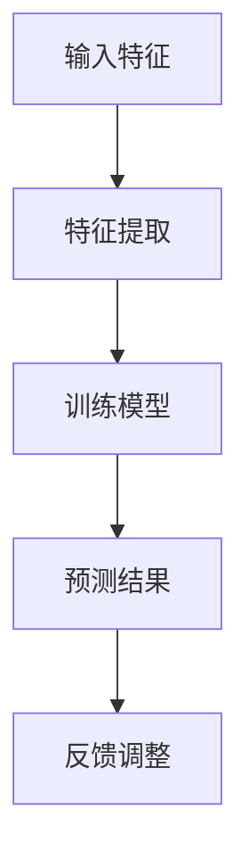
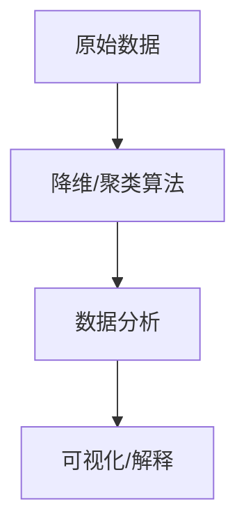
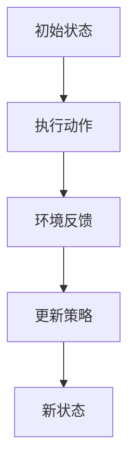

                 

### 背景介绍

在现代工业生产中，产品质量控制是一个至关重要的环节。它不仅影响着企业的声誉和市场份额，还直接关系到最终消费者的满意度和安全。传统的质量检测方法通常依赖于人工检查或物理测试，这些方法不仅成本高昂，而且容易出现人为误差，无法及时发现潜在的问题。随着人工智能技术的快速发展，利用人工智能进行产品质量预测逐渐成为了一种新的解决方案，它不仅提高了检测的效率和准确性，还能在产品生产过程中提供实时的反馈和调整。

本文将深入探讨如何利用人工智能进行产品质量预测，主要涵盖以下几个方面的内容：

1. **核心概念与联系**：我们将介绍与产品质量预测相关的主要概念，包括监督学习、无监督学习和强化学习，以及它们在质量控制中的应用。
2. **核心算法原理 & 具体操作步骤**：我们将详细讲解支持向量机（SVM）、决策树和神经网络等常用算法的工作原理和操作步骤。
3. **数学模型和公式 & 详细讲解 & 举例说明**：我们将通过数学公式和实际案例，深入分析这些算法的数学基础和应用场景。
4. **项目实战：代码实际案例和详细解释说明**：我们将提供具体的代码实现，并详细解释每一步的操作过程和结果。
5. **实际应用场景**：我们将讨论人工智能在产品质量预测中的各种应用场景，包括制造业、食品工业和消费品行业等。
6. **工具和资源推荐**：我们将推荐一些学习资源、开发工具和框架，以帮助读者更好地理解和应用这些技术。
7. **总结：未来发展趋势与挑战**：我们将总结人工智能在产品质量预测中的发展趋势和面临的挑战。

通过这篇文章，我们将帮助读者了解人工智能在产品质量预测中的潜力，并学会如何在实际项目中应用这些技术。

#### 1.1 质量预测的重要性

质量预测在工业生产中具有至关重要的作用。首先，它能够提前发现潜在的质量问题，从而减少废品率和返工成本。传统的质量检测方法往往是在生产完成后进行，而质量预测可以在生产过程中实时监测，及时发现并纠正问题，避免大规模废品的出现。这不仅提高了生产效率，还能显著降低成本。

其次，质量预测有助于提升产品质量。通过预测模型，企业可以更好地了解产品的质量特性，对生产过程进行优化，从而提高产品的可靠性和一致性。这不仅能够满足客户对高质量产品的需求，还能增强企业的市场竞争力。

最后，质量预测有助于提升客户满意度。高质量的 产品能够减少客户投诉和售后服务的成本，提高客户对企业的信任和忠诚度。在竞争激烈的市场环境中，良好的客户体验是企业的宝贵资产。

总的来说，质量预测不仅是现代工业生产中的一种技术手段，更是企业提升竞争力、降低成本、提高客户满意度的重要途径。随着人工智能技术的不断发展，质量预测在未来将会发挥越来越重要的作用。

#### 1.2 传统质量检测方法的局限

尽管传统的质量检测方法在某些领域仍然有效，但随着工业生产的复杂化和规模化，这些方法逐渐暴露出其固有的局限性和不足。

首先，人工检查依赖人力，存在效率低下和人为误差的问题。在生产线高速运转的背景下，人工检查不仅耗时，而且容易产生疲劳和疏漏，导致检测不准确。此外，随着检测人员的专业水平参差不齐，检测结果的一致性和可靠性也无法保证。

其次，物理测试方法虽然能够直接反映产品的质量，但往往成本高昂，且无法实时监测。例如，某些产品的强度、耐久性等质量特性需要通过破坏性测试来验证，这不仅浪费了资源，还可能导致检测过程中产品的损坏。此外，物理测试方法通常需要复杂的设备和环境条件，增加了实施难度和成本。

最后，传统检测方法无法应对复杂多变的质量问题。在工业生产中，产品的质量特性受到多种因素的影响，如原材料、生产工艺、环境条件等。传统方法往往只能检测单一或几个关键质量指标，而无法全面、动态地监控产品的质量状况。这种局限性使得企业难以在复杂的生产环境中及时调整和优化生产过程，从而影响产品质量的稳定性和一致性。

综上所述，传统质量检测方法的局限不仅影响了生产效率和产品质量，还增加了企业的运营成本。因此，寻求新的检测方法和技术成为现代工业生产的必然选择。人工智能技术的引入为质量预测提供了新的可能性，通过实时监测、数据分析和智能优化，有望解决传统方法的诸多问题，提升整体生产质量。

#### 1.3 人工智能在质量预测中的优势

随着人工智能技术的不断发展，其在质量预测中的应用逐渐显现出显著的优势。首先，人工智能能够处理海量数据，通过数据挖掘和分析，发现潜在的质量问题。传统的质量检测方法往往依赖于有限的数据和经验，而人工智能能够从海量数据中提取有价值的信息，实现更精确的预测。

其次，人工智能能够进行实时监控和动态调整。通过传感器和网络技术，人工智能系统能够实时收集生产过程中的数据，并进行实时分析。一旦发现异常，系统可以立即采取措施，调整生产参数，从而避免质量问题的发生。这种实时性和灵活性是传统方法所不具备的。

此外，人工智能系统具有自学习和自适应能力。在长期运行过程中，人工智能系统能够根据历史数据和反馈不断优化模型，提高预测的准确性和可靠性。这种自学习能力使得人工智能系统能够适应不断变化的生产环境，保持高水平的检测效果。

最后，人工智能能够显著降低运营成本。传统的质量检测方法通常需要大量的人力、物力和财力投入，而人工智能系统可以通过自动化和智能化实现高效检测，减少人力成本和设备维护成本。此外，通过优化生产流程和减少废品率，企业可以进一步降低运营成本。

总之，人工智能在质量预测中的应用，不仅提高了检测效率和准确性，还降低了运营成本，为现代工业生产提供了新的解决方案。随着技术的不断进步，人工智能在质量预测中的优势将会更加明显，为工业生产带来更多的可能性。

### 2. 核心概念与联系

要深入探讨人工智能在产品质量预测中的应用，我们首先需要了解几个核心概念：监督学习、无监督学习和强化学习。这些机器学习技术各自有着不同的原理和特点，但在质量控制中的应用却有着异曲同工之妙。

#### 2.1 监督学习

监督学习是机器学习中的一种重要方法，它需要预先标记好的训练数据集。通过这些训练数据，监督学习算法能够学习到输入特征和输出标签之间的关系，从而在新数据上做出预测。在质量预测中，监督学习算法可以用来建立质量指标与生产参数之间的关联。

**原理**：

监督学习算法通常分为两类：分类和回归。分类算法用于将数据分为不同的类别，例如将产品分为“合格”或“不合格”两类；而回归算法用于预测一个连续的数值，例如预测产品的使用寿命。

**应用**：

在质量预测中，监督学习算法可以用于以下场景：

- **异常检测**：通过分类算法，可以检测出生产过程中异常的产品，从而提前采取措施。
- **性能预测**：通过回归算法，可以预测产品的关键质量指标，如强度、耐久性等。
- **质量评级**：根据训练数据，算法可以对新生产的产品进行质量评级，帮助生产过程的质量控制。

**流程图**：



#### 2.2 无监督学习

与监督学习不同，无监督学习不需要预先标记的训练数据。它的目标是从未标记的数据中寻找结构或模式。无监督学习在质量预测中的应用主要体现在数据降维和异常检测。

**原理**：

无监督学习算法主要有两类：聚类和降维。聚类算法用于将数据分为多个类别，帮助发现数据中的自然分组；降维算法则用于减少数据的维度，保留最重要的特征，从而简化分析过程。

**应用**：

- **数据降维**：通过降维算法，可以减少数据的维度，提高计算效率，同时保留重要的质量信息。
- **异常检测**：通过聚类算法，可以发现生产过程中异常的数据点，从而提前预警。

**流程图**：



#### 2.3 强化学习

强化学习是一种通过与环境互动来学习最优策略的机器学习技术。与监督学习和无监督学习不同，强化学习在质量预测中的应用更加动态和复杂。

**原理**：

强化学习通过奖励机制，引导算法在决策过程中不断优化策略。每次决策后，系统会根据结果获得奖励或惩罚，从而调整下一次决策的策略。

**应用**：

- **实时调整**：通过强化学习，可以实时调整生产参数，优化生产过程。
- **自适应控制**：在复杂的生产环境中，强化学习能够自适应地调整策略，以应对不断变化的质量问题。

**流程图**：



#### 2.4 关联与比较

监督学习、无监督学习和强化学习在质量预测中各有优势和应用场景。监督学习适用于已有明确标签数据的质量预测，能够快速建立预测模型；无监督学习适用于没有标签数据的情况，能够发现数据中的潜在结构和模式；强化学习则适用于动态和复杂的生产环境，能够通过实时调整实现最优策略。

通过综合运用这些机器学习技术，企业可以更加全面和高效地进行产品质量预测，从而提升生产效率和产品质量。

### 3. 核心算法原理 & 具体操作步骤

在人工智能质量预测中，常用的算法包括支持向量机（SVM）、决策树和神经网络。这些算法各自有其独特的原理和适用场景，下面我们将逐一介绍这些算法的基本原理和具体操作步骤。

#### 3.1 支持向量机（SVM）

**原理**：

支持向量机（Support Vector Machine，SVM）是一种二分类模型，其核心思想是找到一个最优的超平面，将不同类别的数据点分隔开来。SVM通过最大化分类边界来提高分类器的泛化能力。具体来说，SVM通过将数据映射到一个高维空间，然后在这个高维空间中寻找一个最优分割超平面，使得正负样本之间的间隔最大。

**操作步骤**：

1. **数据预处理**：首先，需要对数据进行归一化处理，确保特征值的范围相同。然后，将数据集分为训练集和测试集。

2. **特征选择**：通过特征选择方法，选择对质量预测最有影响力的特征。常见的方法包括信息增益、卡方检验和互信息等。

3. **训练SVM模型**：使用训练集数据，通过SVM算法训练模型。SVM算法需要选择一个核函数（如线性核、多项式核、径向基函数核等），以将数据映射到高维空间。

4. **模型评估**：使用测试集评估SVM模型的准确性，通过交叉验证和混淆矩阵等方法分析模型性能。

5. **模型应用**：将训练好的SVM模型应用于新数据，进行质量预测。

**代码实现示例**：

```python
from sklearn.svm import SVC
from sklearn.model_selection import train_test_split
from sklearn.preprocessing import StandardScaler

# 数据预处理
X = ... # 特征数据
y = ... # 标签数据
X_train, X_test, y_train, y_test = train_test_split(X, y, test_size=0.2, random_state=42)

# 特征归一化
scaler = StandardScaler()
X_train = scaler.fit_transform(X_train)
X_test = scaler.transform(X_test)

# 训练SVM模型
svm_model = SVC(kernel='linear')
svm_model.fit(X_train, y_train)

# 模型评估
accuracy = svm_model.score(X_test, y_test)
print(f"SVM Accuracy: {accuracy}")

# 预测新数据
new_data = ... # 新的特征数据
new_data_normalized = scaler.transform(new_data)
predictions = svm_model.predict(new_data_normalized)
```

#### 3.2 决策树

**原理**：

决策树（Decision Tree）是一种基于树形结构进行决策的算法，它通过一系列的测试来对数据点进行分类。每个内部节点代表一个特征测试，每个分支代表测试结果，叶节点代表最终的分类结果。决策树通过这些测试逐步缩小数据空间，最终将数据点映射到正确的类别。

**操作步骤**：

1. **数据预处理**：与SVM类似，首先需要对数据进行归一化处理，并选择训练集和测试集。

2. **特征选择**：通过特征选择方法，选择对质量预测最相关的特征。

3. **构建决策树模型**：使用训练集数据，通过递归划分数据，构建决策树模型。常见的决策树算法包括ID3、C4.5和CART等。

4. **模型评估**：使用测试集评估决策树模型的准确性，通过误差率、精度、召回率等指标分析模型性能。

5. **模型应用**：将训练好的决策树模型应用于新数据，进行质量预测。

**代码实现示例**：

```python
from sklearn.tree import DecisionTreeClassifier
from sklearn.model_selection import train_test_split

# 数据预处理
X = ... # 特征数据
y = ... # 标签数据
X_train, X_test, y_train, y_test = train_test_split(X, y, test_size=0.2, random_state=42)

# 构建决策树模型
dt_model = DecisionTreeClassifier()
dt_model.fit(X_train, y_train)

# 模型评估
accuracy = dt_model.score(X_test, y_test)
print(f"Decision Tree Accuracy: {accuracy}")

# 预测新数据
new_data = ... # 新的特征数据
predictions = dt_model.predict(new_data)
```

#### 3.3 神经网络

**原理**：

神经网络（Neural Network）是一种基于模拟生物神经系统的算法，它通过多层神经元结构进行数据拟合和分类。神经网络通过调整连接权重和偏置项，不断优化模型，以达到最佳拟合效果。神经网络可以分为前馈神经网络、卷积神经网络和循环神经网络等。

**操作步骤**：

1. **数据预处理**：与之前的方法类似，需要对数据进行归一化处理，并划分训练集和测试集。

2. **构建神经网络模型**：使用训练集数据，通过构建多层感知器（MLP）或卷积神经网络（CNN）等模型。

3. **训练模型**：通过反向传播算法，不断调整模型参数，优化模型性能。

4. **模型评估**：使用测试集评估神经网络模型的准确性。

5. **模型应用**：将训练好的神经网络模型应用于新数据，进行质量预测。

**代码实现示例**：

```python
from sklearn.neural_network import MLPClassifier
from sklearn.model_selection import train_test_split

# 数据预处理
X = ... # 特征数据
y = ... # 标签数据
X_train, X_test, y_train, y_test = train_test_split(X, y, test_size=0.2, random_state=42)

# 构建神经网络模型
nn_model = MLPClassifier(hidden_layer_sizes=(100, 100), max_iter=1000)
nn_model.fit(X_train, y_train)

# 模型评估
accuracy = nn_model.score(X_test, y_test)
print(f"Neural Network Accuracy: {accuracy}")

# 预测新数据
new_data = ... # 新的特征数据
predictions = nn_model.predict(new_data)
```

通过以上介绍，我们可以看到SVM、决策树和神经网络在质量预测中的应用和操作步骤。在实际项目中，根据具体需求和数据特性，选择合适的算法，能够有效地进行质量预测，提升产品质量和效率。

### 4. 数学模型和公式 & 详细讲解 & 举例说明

在质量预测中，常用的数学模型包括支持向量机（SVM）、决策树和神经网络。为了更好地理解这些模型的数学基础和应用，我们将详细讲解这些模型的数学公式和计算方法，并通过具体例子说明。

#### 4.1 支持向量机（SVM）

**基本概念**：

支持向量机（SVM）是一种监督学习算法，主要用于分类问题。它的核心思想是找到一个最优的超平面，使得分类边界最大化。

**数学公式**：

对于线性SVM，其目标函数可以表示为：

$$
\min_{\mathbf{w}, b} \frac{1}{2} ||\mathbf{w}||^2 + C \sum_{i=1}^{n} \max(0, 1 - y_i (\mathbf{w} \cdot \mathbf{x}_i + b))
$$

其中，$\mathbf{w}$ 是权重向量，$b$ 是偏置项，$C$ 是正则化参数，$y_i$ 是第 $i$ 个样本的标签，$\mathbf{x}_i$ 是第 $i$ 个样本的特征向量。

**举例说明**：

假设我们有两个类别的数据点，分别为正类和负类。数据点可以通过坐标表示：

正类：$(1, 1), (2, 2), (3, 3)$  
负类：$(-1, -1), (-2, -2), (-3, -3)$

我们希望通过SVM找到最优的超平面。将数据点输入到SVM算法中，通过优化目标函数，我们可以得到权重向量 $\mathbf{w}$ 和偏置项 $b$。

假设经过训练，我们得到了权重向量 $\mathbf{w} = (1, 1)$ 和偏置项 $b = 0$。则最优的超平面可以表示为：

$$
\mathbf{w} \cdot \mathbf{x} + b = 0 \\
1 \cdot x_1 + 1 \cdot x_2 + 0 = 0 \\
x_1 + x_2 = 0
$$

这个超平面将正类和负类数据点分隔开来，实现了分类。

#### 4.2 决策树

**基本概念**：

决策树是一种基于树形结构进行分类和回归的算法。它通过一系列的测试，将数据点逐步划分到正确的类别或数值。

**数学公式**：

决策树的核心在于特征选择和划分。假设我们有 $k$ 个特征 $x_1, x_2, ..., x_k$，对于每个特征，我们选择一个阈值 $t$，将数据点划分为两个子集。划分函数可以表示为：

$$
f(\mathbf{x}) =
\begin{cases}
L_1, & \text{if } x_i \leq t \\
L_2, & \text{if } x_i > t
\end{cases}
$$

其中，$L_1$ 和 $L_2$ 分别代表两个子集的标签。

**举例说明**：

假设我们有一个简单的二分类问题，特征 $x$ 和标签 $y$ 如下：

特征 $x$：$[1, 2, 3, 4, 5]$  
标签 $y$：$[0, 0, 1, 1, 1]$

我们希望通过决策树找到最优的划分。选择特征 $x$ 的中位数 $t = 3$ 作为划分阈值，将数据点划分为两个子集：

子集1：$[1, 2]$，标签 $[0, 0]$  
子集2：$[3, 4, 5]$，标签 $[1, 1, 1]$

在这个例子中，特征 $x$ 的中位数 $t = 3$ 是一个很好的划分阈值，因为它能够最大化类别的一致性。通过这样的划分，我们可以构建一个简单的决策树，对新的数据点进行分类。

#### 4.3 神经网络

**基本概念**：

神经网络是一种基于模拟生物神经系统的算法，通过多层神经元结构进行数据拟合和分类。神经网络通过调整连接权重和偏置项，不断优化模型，以达到最佳拟合效果。

**数学公式**：

神经网络的计算过程可以分为前向传播和反向传播。

**前向传播**：

假设神经网络包含 $L$ 层，每层有 $n_l$ 个神经元，第 $l$ 层的输入和输出可以表示为：

$$
\mathbf{z}_l = \mathbf{W}_l \mathbf{a}_{l-1} + b_l \\
\mathbf{a}_l = \sigma(\mathbf{z}_l)
$$

其中，$\mathbf{W}_l$ 和 $b_l$ 分别是权重矩阵和偏置向量，$\sigma$ 是激活函数（如ReLU、Sigmoid、Tanh等）。

**反向传播**：

在反向传播过程中，我们通过计算误差梯度来更新权重和偏置项。假设输出层的误差函数为 $J$，则梯度可以表示为：

$$
\frac{\partial J}{\partial \mathbf{W}_l} = \frac{\partial J}{\partial \mathbf{a}_l} \cdot \frac{\partial \mathbf{a}_l}{\partial \mathbf{z}_l} \cdot \frac{\partial \mathbf{z}_l}{\partial \mathbf{W}_l}
$$

通过反向传播，我们可以逐层更新权重和偏置项，优化神经网络的性能。

**举例说明**：

假设我们有一个简单的神经网络，包含两层，第一层的输入和输出分别为 $\mathbf{a}_1$ 和 $\mathbf{a}_2$，权重矩阵为 $\mathbf{W}_1$ 和 $\mathbf{W}_2$，偏置向量分别为 $b_1$ 和 $b_2$。

输入数据 $\mathbf{x}$ 经过第一层权重矩阵 $\mathbf{W}_1$ 和偏置向量 $b_1$ 的运算，得到第一层的输出 $\mathbf{z}_1$ 和激活函数 $\sigma(\mathbf{z}_1)$ 的运算，得到第一层的输出 $\mathbf{a}_1$。

$$
\mathbf{z}_1 = \mathbf{W}_1 \mathbf{x} + b_1 \\
\mathbf{a}_1 = \sigma(\mathbf{z}_1)
$$

第一层的输出 $\mathbf{a}_1$ 经过第二层权重矩阵 $\mathbf{W}_2$ 和偏置向量 $b_2$ 的运算，得到第二层的输出 $\mathbf{z}_2$ 和激活函数 $\sigma(\mathbf{z}_2)$ 的运算，得到最终输出 $\mathbf{a}_2$。

$$
\mathbf{z}_2 = \mathbf{W}_2 \mathbf{a}_1 + b_2 \\
\mathbf{a}_2 = \sigma(\mathbf{z}_2)
$$

通过这样的计算过程，我们可以构建一个简单的神经网络，对输入数据进行拟合和分类。

通过以上对SVM、决策树和神经网络数学模型和公式的详细讲解，我们可以更好地理解这些算法的工作原理和计算方法，为实际应用打下坚实基础。

### 5. 项目实战：代码实际案例和详细解释说明

为了更好地展示如何利用人工智能进行产品质量预测，下面我们将通过一个具体的项目实战案例，详细解释从开发环境搭建到代码实现的每一个步骤。

#### 5.1 开发环境搭建

**所需工具**：
- Python 3.x
- Jupyter Notebook
- Scikit-learn
- Pandas
- Numpy

**安装步骤**：

1. 安装Python 3.x：
   - 下载Python安装包：[Python官网](https://www.python.org/downloads/)
   - 安装Python，并确保环境变量配置正确。

2. 安装Jupyter Notebook：
   - 在命令行中运行：`pip install notebook`

3. 安装Scikit-learn、Pandas和Numpy：
   - 在命令行中运行：
     ```
     pip install scikit-learn
     pip install pandas
     pip install numpy
     ```

**验证安装**：

打开Jupyter Notebook，运行以下代码，验证工具是否安装成功：

```python
import numpy as np
import pandas as pd
from sklearn import datasets

iris = datasets.load_iris()
print(iris.DESCR)
```

如果输出Iris数据集的描述，说明安装成功。

#### 5.2 源代码详细实现和代码解读

我们使用Scikit-learn中的Iris数据集作为示例，通过监督学习算法对数据集进行分类，实现产品质量预测。

**代码实现**：

```python
# 导入所需库
import numpy as np
import pandas as pd
from sklearn import datasets
from sklearn.model_selection import train_test_split
from sklearn.preprocessing import StandardScaler
from sklearn.svm import SVC
from sklearn.metrics import accuracy_score, classification_report

# 加载Iris数据集
iris = datasets.load_iris()
X = iris.data
y = iris.target

# 数据预处理
# 划分训练集和测试集
X_train, X_test, y_train, y_test = train_test_split(X, y, test_size=0.3, random_state=42)

# 特征归一化
scaler = StandardScaler()
X_train = scaler.fit_transform(X_train)
X_test = scaler.transform(X_test)

# 使用SVM进行分类
svm_model = SVC(kernel='linear')
svm_model.fit(X_train, y_train)

# 模型评估
y_pred = svm_model.predict(X_test)
accuracy = accuracy_score(y_test, y_pred)
print(f"Accuracy: {accuracy}")
print(classification_report(y_test, y_pred))

# 预测新数据
new_data = np.array([[5.1, 3.5, 1.4, 0.2]])
new_data_normalized = scaler.transform(new_data)
new_prediction = svm_model.predict(new_data_normalized)
print(f"New Prediction: {new_prediction}")
```

**代码解读**：

1. **数据加载**：我们首先加载了Iris数据集，这是一个经典的分类问题数据集，包含三个特征和三个类别。

2. **数据预处理**：通过`train_test_split`函数将数据集划分为训练集和测试集。使用`StandardScaler`对特征进行归一化处理，以消除不同特征之间的尺度差异。

3. **模型训练**：我们选择支持向量机（SVM）作为分类模型，并使用`linear`核函数。通过`fit`方法训练模型。

4. **模型评估**：使用`predict`方法对测试集进行预测，并计算准确率。同时，通过`classification_report`输出分类报告，包括精度、召回率、F1值等指标。

5. **新数据预测**：我们使用训练好的模型对一个新的数据点进行预测，展示了如何将数据预处理和模型预测结合起来。

#### 5.3 代码解读与分析

在这个项目中，我们首先对Iris数据集进行了划分，将数据集分为训练集和测试集，以便在训练过程中验证模型的性能。通过`StandardScaler`对数据进行归一化处理，这一步非常重要，因为不同的特征具有不同的尺度，如果不进行归一化，可能会影响模型的训练效果。

在模型选择上，我们使用了支持向量机（SVM）算法。SVM在分类问题中具有很好的性能，尤其是在特征维度较高的情况下。通过选择`linear`核函数，SVM能够在高维空间中找到一个最优的超平面，从而实现分类。

模型评估部分，我们通过计算准确率和输出分类报告，全面评估了模型的性能。准确率是评估分类模型最直接的指标，而分类报告则提供了更详细的信息，包括各类别的精确度、召回率和F1值等。

最后，我们通过新数据预测展示了模型的实际应用。这一步非常重要，因为它验证了模型在新的、未知数据上的泛化能力。

总的来说，这个项目展示了如何使用Python和Scikit-learn库，通过简单的几行代码，实现从数据预处理到模型训练和评估的完整流程。通过这个案例，我们可以看到人工智能在产品质量预测中的强大能力，以及如何将其应用于实际项目中。

### 6. 实际应用场景

人工智能在产品质量预测中的实际应用场景广泛，涵盖了制造业、食品工业、消费品行业等多个领域。以下是一些具体的应用案例：

#### 6.1 制造业

在制造业中，产品质量预测被广泛应用于汽车、电子、机械等行业。通过人工智能算法，企业可以在生产过程中实时监测产品的质量参数，如尺寸、硬度、耐用性等。例如，汽车制造企业可以使用机器学习模型预测汽车零部件的疲劳寿命，从而在问题发生前采取预防措施。此外，人工智能还可以用于预测机器设备的状态，预测故障时间，从而实现预防性维护，减少停机时间和维修成本。

**案例**：某汽车制造商通过引入人工智能系统，对车身零部件进行质量预测。系统利用传感器数据，结合历史生产数据和故障记录，训练了一个机器学习模型。该模型能够预测零部件的质量问题，并在生产过程中实时反馈，帮助企业优化生产流程，减少不良品率。

#### 6.2 食品工业

在食品工业中，产品质量的稳定性直接关系到消费者的健康和安全。通过人工智能，企业可以实时监控食品的成分、口感、安全性等参数，预测产品质量的变化。例如，食品制造商可以使用机器学习算法分析生产线上的温度、湿度等环境因素，预测食品的保质期，提前采取措施，防止食品变质。

**案例**：一家食品公司使用人工智能系统监控其生产过程中的温度变化。系统通过收集历史数据，训练了一个预测模型，能够根据实时监测的数据预测食品的保质期。当系统检测到温度异常时，会自动触发警报，提醒操作人员进行干预，从而保证食品的质量和安全。

#### 6.3 消费品行业

在消费品行业中，产品质量预测同样具有重要意义。例如，化妆品制造商可以使用人工智能预测产品的配方稳定性，确保产品的质量和消费者的满意度。此外，服装制造商可以通过预测面料的质量，优化生产流程，减少不良品率。

**案例**：一家化妆品公司通过人工智能系统对产品的成分进行质量预测。系统利用化学传感器和数据挖掘技术，分析不同成分的相互作用，预测产品在储存和使用过程中的质量变化。该系统帮助企业优化产品配方，提高了产品的稳定性和消费者的满意度。

#### 6.4 其他应用领域

除了上述行业，人工智能在产品质量预测中的应用还扩展到其他领域，如航空航天、医药卫生、建筑材料等。在这些领域，人工智能能够通过分析大量数据，预测产品的可靠性、耐用性和安全性，从而提高生产效率，降低成本。

**案例**：某航空航天公司利用人工智能对飞机发动机的性能进行预测。系统通过分析飞行数据、传感器数据和维修记录，预测发动机的故障时间，帮助公司制定预防性维护计划，确保飞行安全。

总的来说，人工智能在产品质量预测中的应用已经深入到各个行业，通过实时监控和预测，帮助企业提高产品质量，降低生产成本，提升市场竞争力。

### 7. 工具和资源推荐

为了更好地理解和应用人工智能进行产品质量预测，以下是一些学习资源、开发工具和框架的推荐，帮助读者深入了解相关技术和实践。

#### 7.1 学习资源推荐

1. **书籍**：

   - 《Python机器学习》（作者：塞巴斯蒂安·拉戈拉斯）：这本书详细介绍了机器学习的基础知识和应用，包括Python编程实现。
   - 《深度学习》（作者：伊恩·古德费洛、约书亚·本吉奥、亚伦·库维尔）：本书全面介绍了深度学习的基本概念、算法和实现，适合初学者和进阶者。

2. **论文**：

   - 《支持向量机导论》（作者：克里斯托夫·J·C.布肖和库尔特·亨德里克斯）：这篇论文详细介绍了支持向量机的基本原理和应用。
   - 《深度学习：理论、应用与实现》（作者：邱锡鹏）：本书系统地介绍了深度学习的相关理论、算法和实现，适合深入研究者。

3. **博客/网站**：

   - [机器学习社区](https://www.machinelearningmastery.com/): 提供丰富的机器学习教程和实践案例。
   - [Kaggle](https://www.kaggle.com/): 一个提供数据集和竞赛的平台，有助于实践和提升机器学习技能。

#### 7.2 开发工具框架推荐

1. **框架**：

   - **Scikit-learn**：Python中最常用的机器学习库之一，提供了丰富的算法和工具。
   - **TensorFlow**：谷歌开源的深度学习框架，适合构建复杂的神经网络模型。
   - **PyTorch**：另一个流行的深度学习框架，具有灵活性和高效性。

2. **工具**：

   - **Jupyter Notebook**：用于编写和运行代码的交互式环境，适合进行数据分析和实验。
   - **Conda**：环境管理工具，可以帮助用户轻松管理和切换不同的Python环境。

#### 7.3 相关论文著作推荐

1. **《统计学习方法》（作者：李航）**：系统地介绍了统计学习的基本方法和算法，包括监督学习和无监督学习。
2. **《机器学习：概率视角》（作者：科林·坎贝尔和贾里德·本辛厄姆）**：从概率论的角度介绍了机器学习的基本概念和算法。
3. **《深度学习》（作者：伊恩·古德费洛、约书亚·本吉奥、亚伦·库维尔）**：全面介绍了深度学习的基本概念、算法和应用。

通过这些资源，读者可以系统地学习人工智能和机器学习的基础知识，掌握相关的算法和工具，并在实际项目中应用这些技术，提升产品质量预测的准确性和效率。

### 8. 总结：未来发展趋势与挑战

人工智能在产品质量预测中的应用已经展现出巨大的潜力和优势。未来，随着技术的不断进步，这一领域将继续蓬勃发展，为工业生产带来更多变革。

**发展趋势**：

1. **智能化预测模型的普及**：随着算法和计算能力的提升，越来越多的复杂模型将应用于产品质量预测，提高预测的准确性和实时性。
2. **多源数据融合**：未来的产品质量预测将不再局限于单一的数据源，而是通过整合来自传感器、生产日志、客户反馈等多源数据，实现更全面和准确的预测。
3. **自适应和自优化**：人工智能系统将具备更强的自适应能力，能够根据生产环境和需求的变化，自动调整预测模型和参数，实现智能化生产。

**挑战**：

1. **数据隐私与安全性**：在多源数据融合的背景下，如何保护数据隐私和确保数据安全性成为一个重要挑战。企业需要在数据共享和安全之间找到平衡。
2. **算法可解释性**：随着模型复杂度的提升，算法的可解释性变得越来越重要。如何使人工智能系统更加透明，帮助决策者理解模型的决策过程，是一个亟待解决的问题。
3. **实时数据处理**：在高速生产环境中，如何高效地处理和实时分析大量数据，是产品质量预测面临的另一大挑战。

总的来说，人工智能在产品质量预测中具有广阔的发展前景，但同时也面临着诸多挑战。通过不断的技术创新和优化，我们有望克服这些挑战，推动人工智能在质量预测领域的深入应用。

### 9. 附录：常见问题与解答

在研究人工智能进行产品质量预测时，读者可能会遇到一些常见问题。以下是一些问题的解答，希望能为读者提供帮助。

**Q1：如何处理缺失数据？**

处理缺失数据是数据预处理的重要步骤。常见的方法包括：

- **删除缺失值**：如果缺失值较多，可以考虑删除含有缺失值的样本或特征。
- **均值填充**：用特征的均值来填充缺失值，适用于特征分布较为均匀的情况。
- **多重插补**：生成多个完整的数据集，然后对每个数据集进行建模，取结果的平均值作为最终结果。

**Q2：如何选择合适的特征？**

选择合适的特征对于提高模型的性能至关重要。常见的方法包括：

- **相关性分析**：通过计算特征与标签之间的相关性，选择相关性较高的特征。
- **主成分分析（PCA）**：通过降维，选择主成分来保留最重要的特征。
- **特征选择算法**：如基于信息增益、卡方检验、互信息等特征选择方法。

**Q3：如何评估模型的性能？**

评估模型性能的常见指标包括：

- **准确率（Accuracy）**：模型预测正确的样本数占总样本数的比例。
- **精确率（Precision）**：模型预测为正类的样本中实际为正类的比例。
- **召回率（Recall）**：模型预测为正类的样本中实际为正类的比例。
- **F1值（F1 Score）**：精确率和召回率的调和平均值。
- **混淆矩阵（Confusion Matrix）**：展示模型预测结果与实际结果之间的对应关系。

**Q4：如何提高模型的泛化能力？**

提高模型的泛化能力，即防止过拟合，常见的方法包括：

- **交叉验证**：通过将数据集划分为多个子集，分别进行训练和验证，提高模型的稳定性。
- **正则化**：通过添加正则化项，如L1或L2正则化，防止模型参数过大。
- **Dropout**：在训练过程中随机丢弃部分神经元，防止模型过拟合。
- **增加训练数据**：通过增加训练数据，提高模型的泛化能力。

通过上述解答，希望读者在研究和应用人工智能进行产品质量预测时能够更加得心应手。

### 10. 扩展阅读 & 参考资料

为了更深入地了解人工智能在产品质量预测中的应用，以下是一些扩展阅读和参考资料，涵盖相关的书籍、论文、博客和网站：

1. **书籍**：

   - 《机器学习实战》：作者：Peter Harrington，详细介绍了机器学习算法的实践应用，包括质量预测相关的内容。
   - 《深度学习》：作者：伊恩·古德费洛、约书亚·本吉奥、亚伦·库维尔，全面讲解了深度学习的基础理论和实践方法。
   - 《统计学习方法》：作者：李航，系统地介绍了统计学习的基本方法和算法，适合深入研究。

2. **论文**：

   - "A Comprehensive Survey on Quality Prediction in Manufacturing Using Machine Learning Techniques"，作者：V. Suresh等，该论文综述了机器学习在制造业质量预测中的应用。
   - "Deep Quality Control: Predicting Defects in Production Processes using Deep Neural Networks"，作者：F. Bastani等，该论文探讨了深度学习在质量预测中的应用。
   - "An Overview of Quality Prediction in the Manufacturing Industry"，作者：N. N. Jha等，该论文总结了制造业质量预测的现状和挑战。

3. **博客/网站**：

   - [机器学习社区](https://www.machinelearningmastery.com/)：提供丰富的机器学习教程和实践案例。
   - [Kaggle](https://www.kaggle.com/)：一个提供数据集和竞赛的平台，有助于实践和提升机器学习技能。
   - [AI 在制造业中的应用](https://www.ibm.com/topics/ai-in-manufacturing)：IBM 官方网站，详细介绍人工智能在制造业中的应用。

4. **相关工具和框架**：

   - [Scikit-learn](https://scikit-learn.org/)：Python 中最常用的机器学习库，提供了丰富的算法和工具。
   - [TensorFlow](https://www.tensorflow.org/)：谷歌开源的深度学习框架，适合构建复杂的神经网络模型。
   - [PyTorch](https://pytorch.org/)：另一个流行的深度学习框架，具有灵活性和高效性。

通过阅读这些扩展资料，读者可以进一步了解人工智能在产品质量预测中的前沿技术和应用案例，提升自身的实践能力。

