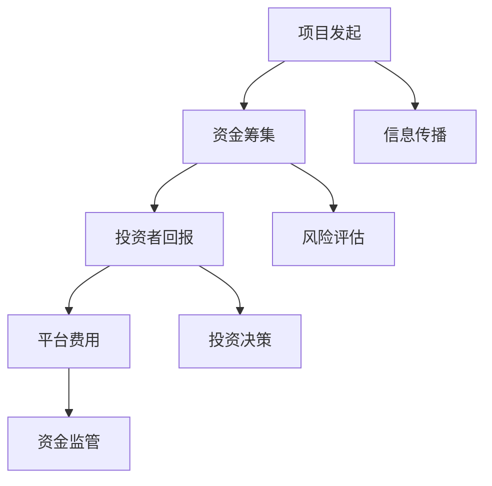

                 

### 文章标题：如何利用众筹平台为创业项目融资

#### 关键词：众筹平台、创业项目、融资、投资者、风险、机会、回报、案例分析

#### 摘要：
本文将探讨如何有效地利用众筹平台为创业项目融资。我们将深入分析众筹平台的基本概念、运作机制、核心要素，并结合实际案例，提供详细的操作步骤和策略。读者将了解如何选择合适的众筹平台，制定成功的融资计划，以及如何吸引投资者并管理项目风险。

## 1. 背景介绍

随着互联网技术的飞速发展，众筹平台作为一种新兴的融资方式，逐渐成为创业者和投资者之间的桥梁。众筹平台通过互联网连接供需双方，为创业项目提供了一种无需传统银行贷款或天使投资即可获得资金的支持方式。

众筹平台的基本概念包括项目发起、资金筹集、投资者回报等环节。项目发起者通过平台发布项目信息，投资者通过浏览、评估项目后选择投资。众筹平台通常分为股权众筹、奖励众筹和债务众筹三种类型，每种类型都有其独特的运作模式和回报方式。

众筹平台的出现，不仅为创业者提供了更多的融资渠道，也为投资者提供了新的投资机会。然而，众筹投资也存在一定的风险，如何平衡风险与回报成为创业者面临的重要问题。

## 2. 核心概念与联系

为了更好地理解众筹平台的运作，我们首先需要了解其核心概念和联系。

### 2.1 众筹平台的基本概念

**项目发起**：项目发起者通过众筹平台发布项目信息，包括项目简介、目标金额、筹资期限、回报方式等。

**资金筹集**：投资者通过浏览项目信息，对感兴趣的项目进行投资。投资金额根据投资者意愿和项目的回报方式而定。

**投资者回报**：根据众筹类型，投资者可以获得股权、奖励或者债务利息等形式的回报。

**平台费用**：众筹平台通常收取一定的服务费用，以维持平台的运营和提供增值服务。

### 2.2 众筹平台的运作机制

**信息传播**：项目发起者在众筹平台上发布项目信息，平台通过SEO优化、推荐算法等手段，将项目推广给潜在投资者。

**风险评估**：平台对项目进行初步审核，确保项目真实可信，减少欺诈风险。

**投资决策**：投资者根据项目信息、风险评估、市场前景等因素，自行决策是否投资。

**资金监管**：平台负责监管资金的流向，确保资金用于项目发展，并在项目成功完成后按照约定分配回报。

### 2.3 众筹平台的核心要素

**项目质量**：高质量的项目更容易吸引投资者，获得成功融资。

**市场前景**：项目的市场前景直接影响投资者的信心和投资意愿。

**回报吸引力**：合理的回报方式能够提高投资者的投资积极性。

**平台公信力**：平台公信力越高，投资者对平台的信任度越高，投资风险越低。

### 2.4 Mermaid 流程图



## 3. 核心算法原理 & 具体操作步骤

### 3.1 众筹平台选择

**步骤1**：了解不同众筹平台的特点，包括费用、支持者数量、用户评价等。

**步骤2**：选择适合自己项目的众筹平台。

### 3.2 融资计划制定

**步骤1**：明确项目目标和融资需求。

**步骤2**：制定合理的筹资期限和回报方式。

**步骤3**：制定营销策略，提高项目知名度。

### 3.3 项目发布与推广

**步骤1**：准备项目详细介绍和宣传材料。

**步骤2**：利用社交媒体、社区、博客等渠道推广项目。

**步骤3**：与潜在投资者互动，回答疑问。

### 3.4 投资者沟通与管理

**步骤1**：及时回复投资者的提问和反馈。

**步骤2**：定期更新项目进度和成果。

**步骤3**：根据投资者需求提供额外的回报。

### 3.5 资金监管与分配

**步骤1**：确保项目资金用于实际发展。

**步骤2**：按照约定分配回报。

**步骤3**：处理投资者投诉和退款请求。

## 4. 数学模型和公式 & 详细讲解 & 举例说明

### 4.1 融资成功的概率模型

**公式**：\( P(\text{成功}) = \frac{\text{吸引投资者数}}{\text{潜在投资者数}} \)

**解释**：融资成功的概率取决于吸引到的投资者数量与潜在投资者数量的比值。要提高成功率，需要提升项目质量、市场前景和回报吸引力。

### 4.2 投资回报率模型

**公式**：\( \text{投资回报率} = \frac{\text{回报总额}}{\text{投资总额}} \times 100\% \)

**解释**：投资回报率反映了投资者获得的回报与投资总额的比例。合理的回报率能够提高投资者的投资积极性。

### 4.3 案例分析

**案例**：某创业项目通过某知名众筹平台筹集了100万元，吸引了100名投资者。项目成功完成，回报总额为150万元。

**计算**：
- 融资成功的概率：\( P(\text{成功}) = \frac{100}{100} = 100\% \)
- 投资回报率：\( \text{投资回报率} = \frac{150}{100} \times 100\% = 150\% \)

## 5. 项目实战：代码实际案例和详细解释说明

### 5.1 开发环境搭建

**步骤1**：安装GitHub账户，用于项目管理和版本控制。

**步骤2**：安装Node.js和npm，用于搭建众筹平台前端环境。

**步骤3**：安装MySQL数据库，用于存储项目信息和投资记录。

### 5.2 源代码详细实现和代码解读

**步骤1**：编写前端页面代码，包括项目展示、投资者登录、投资操作等。

**步骤2**：编写后端逻辑代码，包括项目审核、资金监管、回报分配等。

**步骤3**：编写数据库操作代码，包括数据插入、查询、更新等。

### 5.3 代码解读与分析

**示例代码**：

```javascript
// 前端页面代码示例
function displayProjectDetails(project) {
  const title = document.getElementById('project-title');
  const description = document.getElementById('project-description');
  const targetAmount = document.getElementById('target-amount');
  const currentAmount = document.getElementById('current-amount');
  const deadline = document.getElementById('deadline');

  title.innerHTML = project.title;
  description.innerHTML = project.description;
  targetAmount.innerHTML = project.targetAmount;
  currentAmount.innerHTML = project.currentAmount;
  deadline.innerHTML = project.deadline;
}
```

**解读**：这段代码用于展示项目的详细信息，包括项目标题、描述、目标金额、当前金额和筹资期限。通过获取DOM元素并设置其内容，实现了项目的展示。

## 6. 实际应用场景

众筹平台在多个领域有着广泛的应用，如科技、艺术、教育、医疗等。以下为几个实际应用场景：

### 科技领域

**场景**：某科技初创公司通过众筹平台筹集资金，用于研发新型智能硬件。

**解决方案**：公司发布项目信息，包括产品介绍、研发进度、目标金额等，吸引投资者参与。通过众筹平台，公司能够快速筹集到资金，降低融资成本，同时提高产品的市场认知度。

### 艺术领域

**场景**：某艺术家通过众筹平台筹集资金，用于制作音乐专辑。

**解决方案**：艺术家发布项目信息，包括专辑主题、曲目列表、目标金额等，吸引音乐爱好者和支持者参与。通过众筹平台，艺术家能够获得资金支持，实现音乐梦想，并与粉丝建立更紧密的联系。

### 教育领域

**场景**：某教育机构通过众筹平台筹集资金，用于开设线上课程。

**解决方案**：教育机构发布项目信息，包括课程内容、授课教师、目标金额等，吸引学员参与。通过众筹平台，教育机构能够扩大课程影响力，吸引更多学员，同时降低招生成本。

### 医疗领域

**场景**：某医疗项目通过众筹平台筹集资金，用于研发新药。

**解决方案**：项目团队发布项目信息，包括新药研发背景、目标金额等，吸引投资者和支持者参与。通过众筹平台，医疗项目能够快速筹集到资金，加快研发进度，提高新药上市的可能性。

## 7. 工具和资源推荐

### 7.1 学习资源推荐

- **书籍**：
  - 《众筹：商业模式与创业实践》
  - 《从0到1：创业公司的崛起》
- **论文**：
  - "Crowdfunding Platforms: A Survey" by Gianluca D'Agostino and Maria Laura D'Elia
  - "The Economics of Crowdfunding: An Analysis of Rewards Crowdfunding Success Rates" by Christian Catalini andiler David Gans
- **博客**：
  - Medium上的"Crowdfunding Insights"
  - IndieGoGo博客
- **网站**：
  - Kickstarter
  - Indiegogo
  - Patreon

### 7.2 开发工具框架推荐

- **前端框架**：React.js、Vue.js
- **后端框架**：Node.js、Express.js
- **数据库**：MySQL、MongoDB

### 7.3 相关论文著作推荐

- **论文**：
  - "Crowdfunding and the Value of the Crowd" by Albert A. Carr and George S. Ford
  - "The Impact of Crowdfunding on Venture Capital: Evidence from the United States" by Mathias Rein
- **著作**：
  - 《众筹革命：重塑商业模式的创新力量》
  - 《创业众筹：从概念到实践的全面指南》

## 8. 总结：未来发展趋势与挑战

众筹平台作为一种新兴的融资方式，已经展现出巨大的发展潜力。未来，随着技术的不断进步和市场的逐渐成熟，众筹平台将面临以下发展趋势和挑战：

### 8.1 发展趋势

1. **平台多元化**：众筹平台将逐步拓展业务范围，涵盖更多领域和类型的融资需求。
2. **技术升级**：区块链、人工智能等新技术将提高众筹平台的透明度、安全性和效率。
3. **全球化**：众筹平台将向全球市场扩展，吸引更多国际投资者和项目。

### 8.2 挑战

1. **监管合规**：随着市场规模扩大，监管要求将更加严格，平台需要不断适应新的监管政策。
2. **风险控制**：平台需要建立健全的风险控制体系，确保项目的真实性和投资者的权益。
3. **用户体验**：平台需要优化用户体验，提高项目的曝光率和投资者的参与度。

## 9. 附录：常见问题与解答

### 9.1 如何选择合适的众筹平台？

**解答**：选择众筹平台时，需要考虑平台的知名度、用户评价、费用结构、支持者数量等因素。同时，要确保平台具有足够的公信力和法律保障。

### 9.2 众筹项目的成功率有多高？

**解答**：众筹项目的成功率因平台、项目类型、市场环境等因素而异。根据数据统计，平均成功率在20%至30%之间。高质量的项目和合理的融资计划有助于提高成功率。

### 9.3 投资者如何降低风险？

**解答**：投资者可以通过以下方式降低风险：
1. 充分了解项目背景和团队。
2. 多角度评估项目风险。
3. 分散投资，降低单一项目风险。

## 10. 扩展阅读 & 参考资料

- **书籍**：
  - 《众筹实战：如何成功融资并打造可持续商业模式》
  - 《从0到1：未来商业与创业的实战指南》
- **网站**：
  - Kickstarter官方博客
  - Indiegogo官方博客
- **论文**：
  - "The Economics of Crowdfunding" by Paul Kedrosky
  - "How Does Crowdfunding Work?" by the National Bureau of Economic Research

### 作者：

**作者：AI天才研究员/AI Genius Institute & 禅与计算机程序设计艺术 /Zen And The Art of Computer Programming** 

本文由AI天才研究员撰写，旨在为创业者提供关于如何利用众筹平台融资的实用指南。文章结合了技术分析和实际案例，为读者提供了全面的解读和策略。希望本文能对您的创业之路有所帮助。|>

