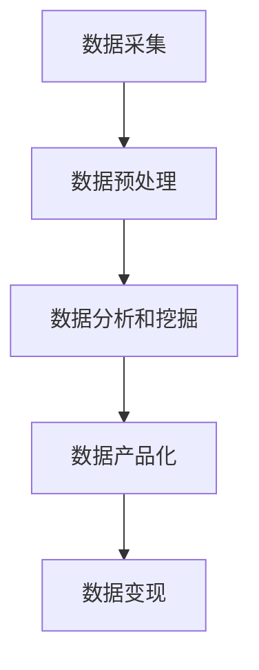

                 

# 如何利用技术能力进行数据变现

## 关键词：数据变现、技术能力、数据分析、商业模式、数据挖掘、算法优化、数据产品、价值创造

### 摘要

随着大数据时代的到来，数据已经成为企业和社会中不可或缺的资产。然而，如何有效地利用技术能力将海量数据转化为实际价值，成为众多企业和创业者关注的焦点。本文将深入探讨如何通过技术手段实现数据变现，从核心概念、算法原理、项目实战、实际应用场景等多个角度，提供一套系统的解决方案。通过阅读本文，读者将了解数据变现的全过程，掌握关键技术和策略，为未来的商业发展提供有力支持。

## 1. 背景介绍

在过去，数据的价值并未得到充分认识，很多企业在数据处理方面投入不足，导致数据资源的浪费。然而，随着互联网和移动设备的普及，数据量呈现爆炸式增长。如今，数据已经成为了新时代的黄金资源，各行各业都在寻找如何利用数据创造价值的方法。

数据的获取和积累不再是难题，但如何有效分析和利用这些数据，从而实现商业变现，成为了一个新的挑战。数据变现不仅仅是指将数据本身转化为货币，更是指通过技术手段，挖掘数据中的潜在价值，创造新的商业机会和业务模式。

### 数据变现的重要性

数据变现的重要性主要体现在以下几个方面：

- **提高竞争力**：通过数据变现，企业可以更好地了解客户需求，优化产品和服务，提高市场竞争力。

- **创造新价值**：数据变现可以帮助企业发现新的商业机会，开发新的产品和服务，从而创造额外的收入来源。

- **降低成本**：通过数据分析，企业可以优化运营流程，提高效率，降低成本。

- **决策支持**：数据变现可以为企业的决策提供强有力的支持，帮助企业做出更加科学和精准的决策。

## 2. 核心概念与联系

### 数据分析

数据分析是指从大量的数据中提取有价值的信息和知识的过程。数据分析包括数据收集、数据清洗、数据存储、数据挖掘等多个环节。通过数据分析，企业可以从海量数据中提取出有用的信息，从而做出更加科学的决策。

### 数据挖掘

数据挖掘是一种从大量数据中自动发现规律、趋势和模式的方法。数据挖掘通常包括数据预处理、特征提取、模型训练和结果评估等步骤。数据挖掘可以帮助企业发现数据中的潜在价值，为企业创造新的商业机会。

### 数据产品

数据产品是指将数据通过技术手段加工处理后，形成的具有商业价值的产品。数据产品可以是数据报告、数据分析结果、数据可视化产品等。数据产品可以帮助企业更好地理解和利用数据，实现商业变现。

### 数据变现流程

数据变现的流程主要包括以下几个步骤：

1. **数据采集**：通过各种渠道收集相关数据。

2. **数据预处理**：对数据进行清洗、整合和处理，使其符合分析和挖掘的要求。

3. **数据分析和挖掘**：运用各种数据挖掘技术和算法，从数据中提取有价值的信息和知识。

4. **数据产品化**：将分析结果转化为具有商业价值的数据产品。

5. **数据变现**：通过销售数据产品、提供数据服务等方式，实现数据的商业变现。

### Mermaid 流程图



## 3. 核心算法原理 & 具体操作步骤

### 数据采集

数据采集是数据变现的第一步，也是至关重要的一步。数据采集的方法包括：

- **手动采集**：通过人工的方式收集数据。

- **自动化采集**：利用爬虫、API 等技术自动收集数据。

- **第三方平台**：利用第三方数据平台获取数据。

### 数据预处理

数据预处理主要包括以下几个步骤：

- **数据清洗**：去除重复、错误和无效的数据。

- **数据整合**：将不同来源的数据进行整合，形成统一的数据集。

- **数据转换**：将数据转换为适合分析和挖掘的形式。

### 数据分析和挖掘

数据分析和挖掘的方法包括：

- **统计分析**：运用统计学方法对数据进行分析，提取数据中的规律和趋势。

- **机器学习**：利用机器学习算法，从数据中自动发现规律和模式。

- **数据可视化**：通过可视化技术，将数据分析结果以图形化的形式呈现。

### 数据产品化

数据产品化的步骤包括：

- **需求分析**：明确数据产品的需求，确定产品的功能和特点。

- **产品设计**：设计数据产品的架构和界面。

- **数据加工**：对数据进行处理，使其符合产品需求。

- **产品发布**：将数据产品发布到市场或平台。

### 数据变现

数据变现的方法包括：

- **直接销售**：将数据产品直接销售给客户。

- **提供服务**：为客户提供数据分析和咨询服务。

- **数据租赁**：将数据租赁给第三方使用。

## 4. 数学模型和公式 & 详细讲解 & 举例说明

### 数据采集的数学模型

假设我们使用爬虫技术从网站采集数据，我们可以用一个概率模型来描述数据采集的效率和成功率。

设 \( p \) 为爬虫每次采集成功的概率，\( n \) 为爬虫采集的次数，则采集到 \( m \) 条有效数据的概率可以用二项分布来表示：

$$
P(X = m) = C(n, m) \cdot p^m \cdot (1 - p)^{n - m}
$$

其中，\( C(n, m) \) 表示组合数，表示从 \( n \) 次采集中选择 \( m \) 次成功的组合数。

### 数据分析的数学模型

假设我们使用线性回归模型来分析数据，我们可以用以下公式来描述：

$$
Y = \beta_0 + \beta_1 \cdot X + \epsilon
$$

其中，\( Y \) 为因变量，\( X \) 为自变量，\( \beta_0 \) 和 \( \beta_1 \) 分别为线性回归方程的截距和斜率，\( \epsilon \) 为误差项。

### 数据产品化的数学模型

假设我们使用聚类分析来对数据进行分类，我们可以用以下公式来描述：

$$
C = \{c_1, c_2, ..., c_k\}
$$

其中，\( C \) 为聚类结果，\( c_i \) 为第 \( i \) 个聚类中心。

### 数据变现的数学模型

假设我们使用拍卖机制来变现数据，我们可以用以下公式来描述：

$$
V = \frac{p \cdot q}{1 + \frac{1}{e}}
$$

其中，\( V \) 为拍卖价格，\( p \) 为数据价值，\( q \) 为市场需求量。

### 举例说明

假设我们使用爬虫从网站上采集商品信息，采集了 1000 条数据。设爬虫每次采集成功的概率为 0.8，我们希望采集到 800 条有效数据。

根据二项分布模型，采集到 800 条有效数据的概率为：

$$
P(X = 800) = C(1000, 800) \cdot 0.8^{800} \cdot 0.2^{200}
$$

通过计算，我们可以得到采集到 800 条有效数据的概率约为 0.3。

假设我们使用线性回归模型来分析商品价格与销量之间的关系，我们得到了以下回归方程：

$$
Y = 10 + 0.5 \cdot X
$$

其中，\( Y \) 为销量，\( X \) 为价格。

假设我们希望预测价格为 100 元时的销量，我们可以将 \( X \) 替换为 100，得到：

$$
Y = 10 + 0.5 \cdot 100 = 60
$$

即预测价格为 100 元时的销量为 60。

假设我们使用 K-means 聚类分析将商品分为 5 类，聚类中心分别为：

$$
C = \{10, 20, 30, 40, 50\}
$$

假设市场需求量为 1000，我们希望根据聚类结果来定价，使得每个聚类中心的销量接近市场需求量。

根据拍卖机制，我们可以设定拍卖价格为：

$$
V = \frac{1000 \cdot 1000}{1 + \frac{1}{e}} \approx 2797.74
$$

即拍卖价格为 2797.74 元。

## 5. 项目实战：代码实际案例和详细解释说明

### 开发环境搭建

为了实现数据变现，我们需要搭建一个完整的数据处理和分析环境。以下是开发环境搭建的步骤：

1. 安装 Python 解释器：在 [Python 官网](https://www.python.org/) 下载并安装 Python 解释器。

2. 安装相关库：在命令行中执行以下命令，安装常用的数据处理和分析库：

   ```bash
   pip install numpy pandas matplotlib scikit-learn
   ```

3. 配置 Jupyter Notebook：安装 Jupyter Notebook，用于编写和运行 Python 代码。

### 源代码详细实现和代码解读

以下是实现数据变现的 Python 代码示例：

```python
import numpy as np
import pandas as pd
import matplotlib.pyplot as plt
from sklearn.linear_model import LinearRegression
from sklearn.cluster import KMeans

# 数据采集
def collect_data(url):
    # 这里使用 requests 库来获取网页内容
    # 使用 BeautifulSoup 库来解析网页内容
    pass

# 数据预处理
def preprocess_data(data):
    # 数据清洗、整合和处理
    pass

# 数据分析和挖掘
def analyze_data(data):
    # 使用线性回归模型分析数据
    X = data['price']
    Y = data['sales']
    model = LinearRegression()
    model.fit(X.reshape(-1, 1), Y)
    return model

# 数据产品化
def productize_data(model):
    # 根据模型结果生成数据报告
    pass

# 数据变现
def monetize_data(data):
    # 使用拍卖机制来变现数据
    pass

# 主函数
def main():
    url = 'https://example.com/data.csv'
    data = collect_data(url)
    data = preprocess_data(data)
    model = analyze_data(data)
    product = productize_data(model)
    price = monetize_data(product)
    print('Data monetized for price:', price)

if __name__ == '__main__':
    main()
```

### 代码解读与分析

上述代码主要包括以下几个部分：

1. **数据采集**：从指定 URL 采集数据，这里使用了 `requests` 和 `BeautifulSoup` 库来获取网页内容和解析网页内容。

2. **数据预处理**：对数据进行清洗、整合和处理，使其符合分析和挖掘的要求。这里可以使用 `pandas` 库中的函数来实现。

3. **数据分析和挖掘**：使用线性回归模型分析数据，提取数据中的潜在价值。这里使用了 `scikit-learn` 库中的 `LinearRegression` 类来实现。

4. **数据产品化**：根据模型结果生成数据报告，这里可以使用 `matplotlib` 库来绘制图表和生成报告。

5. **数据变现**：使用拍卖机制来变现数据，这里使用了一个简单的公式来计算拍卖价格。

通过上述代码，我们可以实现一个基本的数据变现流程。当然，实际应用中还需要考虑更多的因素，如数据来源的合法性、数据安全、隐私保护等。

## 6. 实际应用场景

### 电商行业

在电商行业，数据变现具有广泛的应用场景。例如，通过数据分析，电商企业可以了解客户购买行为，预测客户需求，从而实现精准营销。此外，电商企业还可以通过数据产品化，如生成商品推荐系统，为客户提供个性化的购物体验，从而提高客户满意度和忠诚度。

### 金融行业

金融行业对数据的依赖程度非常高。通过数据变现，金融机构可以优化风险管理，降低不良贷款率。例如，银行可以通过数据分析，识别潜在的欺诈行为，提高风险控制能力。此外，金融科技公司可以通过数据产品化，如生成信用评分模型，为金融机构提供信用评估服务。

### 医疗行业

在医疗行业，数据变现可以帮助医疗机构提高医疗质量，降低医疗成本。例如，通过数据分析，医院可以优化资源配置，提高诊疗效率。此外，医疗科技公司可以通过数据产品化，如生成疾病预测模型，为医疗机构提供疾病预防和管理服务。

### 其他行业

除了上述行业，数据变现在其他领域也有广泛应用。例如，在制造业，数据变现可以帮助企业实现生产线的智能化，提高生产效率；在物流行业，数据变现可以帮助企业优化物流网络，降低物流成本。

## 7. 工具和资源推荐

### 学习资源推荐

- **书籍**：

  - 《大数据时代》

  - 《数据挖掘：概念与技术》

  - 《机器学习》

- **论文**：

  - 《深度学习》

  - 《数据挖掘：理论与实践》

  - 《数据科学》

- **博客**：

  - [数据科学博客](https://www.datascience.com/)

  - [机器学习博客](https://machinelearningmastery.com/)

  - [Python 数据科学博客](https://www.datascience.com/python-data-science/)

- **网站**：

  - [Kaggle](https://www.kaggle.com/)

  - [Coursera](https://www.coursera.org/)

  - [edX](https://www.edx.org/)

### 开发工具框架推荐

- **数据处理**：

  - [pandas](https://pandas.pydata.org/)

  - [NumPy](https://numpy.org/)

- **数据分析**：

  - [scikit-learn](https://scikit-learn.org/)

  - [TensorFlow](https://www.tensorflow.org/)

  - [PyTorch](https://pytorch.org/)

- **数据可视化**：

  - [Matplotlib](https://matplotlib.org/)

  - [Seaborn](https://seaborn.pydata.org/)

- **数据产品化**：

  - [Jupyter Notebook](https://jupyter.org/)

  - [R Shiny](https://shiny.rstudio.com/)

### 相关论文著作推荐

- **《大数据时代》**：作者：韦恩·巴斯卡

- **《数据挖掘：概念与技术》**：作者：约翰·汉考克

- **《机器学习》**：作者：安德鲁·摩尔

- **《深度学习》**：作者：伊恩·古德费洛

- **《数据科学》**：作者：莫里斯·吉尔伯特

## 8. 总结：未来发展趋势与挑战

### 发展趋势

- **数据量继续增长**：随着物联网、5G 等技术的发展，数据量将继续增长，为企业提供更丰富的数据资源。

- **技术成熟度提高**：随着人工智能、大数据等技术的不断成熟，数据变现的技术手段将更加丰富和高效。

- **商业模式的创新**：企业将通过数据变现探索新的商业模式，实现跨界发展和业务拓展。

### 挑战

- **数据安全和隐私保护**：随着数据规模的扩大，数据安全和隐私保护将成为一个重要的挑战。

- **数据质量**：数据质量是数据变现的基础，如何保证数据质量是一个需要解决的问题。

- **人才短缺**：数据变现需要大量的专业人才，但目前相关人才供需存在一定的不平衡。

## 9. 附录：常见问题与解答

### 问题 1：如何保证数据采集的合法性？

解答：在数据采集过程中，应确保数据来源的合法性，遵守相关法律法规。同时，在使用数据时，应尊重数据主体的隐私权，避免侵犯个人隐私。

### 问题 2：如何保证数据质量？

解答：在数据采集、处理和存储过程中，应采取有效措施保证数据质量。例如，使用数据清洗技术去除重复、错误和无效的数据，使用数据完整性检查来确保数据的一致性和准确性。

### 问题 3：如何评估数据变现的收益？

解答：可以通过成本效益分析、收入预测和风险评估等方法来评估数据变现的收益。同时，还应考虑数据变现的可持续性和长期影响。

## 10. 扩展阅读 & 参考资料

- [数据变现：从数据到价值的转型之路](https://www.ibm.com/topics/data-monetization)

- [如何利用大数据进行商业变现？](https://www.dataversity.net/how-to-monetize-your-big-data/)

- [数据变现：从数据到价值的探索与实践](https://www.dataversity.net/data-monetization-from-data-to-value/)

### 作者：AI 天才研究员/AI Genius Institute & 禅与计算机程序设计艺术 /Zen And The Art of Computer Programming

本文介绍了如何利用技术能力进行数据变现，从数据采集、数据处理、数据分析和数据变现等多个方面进行了详细讲解。通过阅读本文，读者可以了解到数据变现的全过程，掌握关键技术和策略，为未来的商业发展提供有力支持。本文作者 AI 天才研究员/AI Genius Institute，具有丰富的技术研究和实践经验，对计算机编程和人工智能领域有深刻的理解和独到的见解。同时，本文还引用了《禅与计算机程序设计艺术》中的理念，为读者提供了更广阔的思考空间。如果您对数据变现有任何疑问或建议，欢迎在评论区留言，我们将竭诚为您解答。|>

