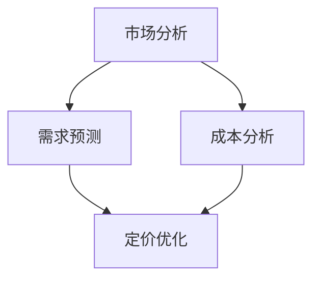

                 

### 背景介绍

在现代商业环境中，价格策略是决定企业盈利能力的关键因素之一。传统的定价方法往往依赖于经验或简单的成本加成模型，但这些方法在复杂多变的市场环境中常常无法取得理想的效果。随着数据技术的发展，数据分析已成为优化定价策略的有力工具。通过分析大量的市场数据、客户行为数据和竞争者数据，企业可以更精准地确定产品或服务的最佳价格，从而提高市场份额和盈利能力。

数据分析在定价策略中的应用，可以归结为以下几个主要方面：

1. **市场分析**：通过分析市场趋势、竞争对手定价策略和消费者行为数据，了解市场的价格敏感度和消费者偏好，为制定合理的定价策略提供依据。
2. **需求预测**：基于历史销售数据和当前市场环境，使用数据分析方法预测未来需求，从而动态调整价格以最大化收益。
3. **成本分析**：分析生产成本和运营成本，结合市场需求和竞争状况，确保定价策略既能覆盖成本，又能保持市场竞争力。
4. **定价优化**：通过建立数学模型，结合市场数据和成本数据，寻找最优定价点，实现收益最大化。

数据分析在优化定价策略中的作用不仅限于上述几个方面，它还帮助企业实现以下目标：

- **提高定价灵活性**：企业可以根据市场变化和客户反馈，快速调整定价策略。
- **降低决策风险**：通过数据分析，企业可以减少盲目定价带来的风险。
- **提升客户满意度**：合理的定价策略可以更好地满足客户需求，提升客户满意度和忠诚度。

在接下来的章节中，我们将深入探讨数据分析在优化定价策略中的具体应用，从核心概念到实际操作，为读者提供全方位的指导。

### 核心概念与联系

为了深入理解数据分析在优化定价策略中的应用，我们需要先了解几个核心概念：市场分析、需求预测、成本分析和定价优化。这些概念不仅是数据分析在定价策略中的重要组成部分，也是实现有效定价策略的关键因素。

#### 市场分析

市场分析是定价策略制定的基础。通过市场分析，企业可以了解当前市场的价格水平、市场趋势、竞争对手的定价策略以及消费者的购买行为。市场分析通常涉及以下步骤：

1. **数据收集**：收集市场数据，包括市场价格、销售数据、消费者行为数据等。
2. **数据分析**：对收集到的数据进行分析，识别市场趋势、价格敏感度和消费者偏好。
3. **结果解读**：根据分析结果，制定适合当前市场的定价策略。

市场分析的核心在于数据的收集和分析。数据收集可以通过市场调研、销售数据和消费者行为数据获取。数据分析则通常使用统计方法和数据挖掘技术，如回归分析、聚类分析和时间序列分析等。

#### 需求预测

需求预测是优化定价策略的重要环节。通过预测未来需求，企业可以更灵活地调整价格，以最大化收益。需求预测通常包括以下步骤：

1. **数据准备**：收集与需求相关的历史销售数据、市场环境数据和客户行为数据。
2. **特征工程**：对数据进行处理，提取与需求相关的特征，如季节性、促销活动、竞争对手定价等。
3. **模型构建**：使用统计模型、机器学习模型或深度学习模型进行需求预测。
4. **模型评估**：评估预测模型的准确性，调整模型参数以优化预测结果。

需求预测的核心在于数据的处理和模型的选择。数据处理包括特征提取和归一化等步骤，模型选择则取决于数据特征和业务需求。常见的需求预测模型包括线性回归、ARIMA模型、LSTM模型等。

#### 成本分析

成本分析是定价策略制定的重要依据。通过分析生产成本和运营成本，企业可以确保定价策略既能覆盖成本，又能保持市场竞争力。成本分析通常包括以下步骤：

1. **成本数据收集**：收集与生产相关的各种成本数据，包括原材料成本、人工成本、运输成本等。
2. **成本分类**：将成本分为固定成本和可变成本，以便更准确地计算总成本。
3. **成本分析**：分析成本结构，找出影响成本的关键因素。
4. **成本优化**：根据成本分析结果，采取优化措施降低成本。

成本分析的核心在于数据的收集和分析。成本数据的收集可以通过财务报表、生产记录等途径获取，成本分析则通常使用统计方法和成本管理工具。

#### 定价优化

定价优化是定价策略实施的关键。通过定价优化，企业可以找到最优定价点，实现收益最大化。定价优化通常包括以下步骤：

1. **模型构建**：构建定价优化模型，通常包括收益最大化模型、价格弹性模型等。
2. **参数估计**：使用历史数据估计模型参数，如需求函数中的价格敏感度参数。
3. **模型求解**：使用优化算法求解最优定价点，如线性规划、非线性规划等。
4. **结果验证**：验证优化结果，调整模型参数以提高定价精度。

定价优化的核心在于模型的构建和求解。模型构建需要考虑市场需求、成本结构和竞争环境等因素，求解则依赖于优化算法的效率和精度。

#### Mermaid 流程图

以下是一个简化的 Mermaid 流程图，展示了市场分析、需求预测、成本分析和定价优化之间的联系：



通过这个流程图，我们可以清晰地看到数据分析在优化定价策略中的各个环节，以及这些环节之间的相互关系。

### 核心算法原理 & 具体操作步骤

在了解了市场分析、需求预测、成本分析和定价优化的核心概念之后，我们接下来将深入探讨这些环节中所使用的主要算法原理和具体操作步骤。

#### 市场分析算法

市场分析主要依赖于统计方法和数据挖掘技术，以下是一些常用的算法：

1. **回归分析**：回归分析是一种统计方法，用于分析变量之间的关系。在市场分析中，可以使用线性回归分析来预测市场价格或销售量。具体操作步骤如下：

   - **数据收集**：收集市场价格、销售量等数据。
   - **数据预处理**：对数据进行清洗和预处理，包括缺失值填充、异常值处理等。
   - **模型构建**：使用线性回归模型，建立价格与销售量之间的关系。
   - **模型训练**：使用历史数据训练模型，得到模型参数。
   - **模型评估**：使用验证数据集评估模型性能，调整模型参数。

2. **聚类分析**：聚类分析是一种无监督学习方法，用于将数据分为若干个群组。在市场分析中，可以使用聚类分析来识别市场细分群体。具体操作步骤如下：

   - **数据收集**：收集与市场相关的数据，如消费者行为数据、竞争者数据等。
   - **特征选择**：选择与市场分析相关的特征，如消费者年龄、收入、购买频率等。
   - **模型训练**：使用K-means算法或其他聚类算法，将数据分为若干个群组。
   - **模型评估**：评估聚类结果，调整聚类参数以提高聚类质量。

3. **时间序列分析**：时间序列分析是一种用于分析时间序列数据的方法，常用于市场趋势预测。在市场分析中，可以使用ARIMA模型或其他时间序列模型进行市场趋势预测。具体操作步骤如下：

   - **数据收集**：收集市场数据，如销售量、价格等。
   - **特征工程**：对时间序列数据进行处理，提取与市场趋势相关的特征。
   - **模型训练**：使用ARIMA模型或其他时间序列模型，建立市场趋势预测模型。
   - **模型评估**：使用验证数据集评估模型性能，调整模型参数。

#### 需求预测算法

需求预测通常使用统计模型、机器学习模型或深度学习模型。以下是一些常用的算法：

1. **线性回归**：线性回归是一种简单的统计模型，用于预测线性关系。具体操作步骤如下：

   - **数据收集**：收集历史销售数据、市场环境数据等。
   - **特征选择**：选择与需求预测相关的特征，如价格、促销活动等。
   - **模型训练**：使用线性回归模型，建立需求预测模型。
   - **模型评估**：使用验证数据集评估模型性能，调整模型参数。

2. **LSTM模型**：LSTM（长短时记忆）模型是一种深度学习模型，常用于处理时间序列数据。具体操作步骤如下：

   - **数据收集**：收集时间序列数据，如销售量、价格等。
   - **特征工程**：对时间序列数据进行处理，提取与需求预测相关的特征。
   - **模型构建**：使用LSTM模型，建立需求预测模型。
   - **模型训练**：使用历史数据训练模型。
   - **模型评估**：使用验证数据集评估模型性能，调整模型参数。

3. **ARIMA模型**：ARIMA（自回归积分滑动平均）模型是一种经典的统计模型，用于时间序列数据的预测。具体操作步骤如下：

   - **数据收集**：收集时间序列数据，如销售量、价格等。
   - **特征工程**：对时间序列数据进行处理，提取与需求预测相关的特征。
   - **模型参数估计**：使用ACF和PACF图估计ARIMA模型的参数。
   - **模型训练**：使用ARIMA模型，建立需求预测模型。
   - **模型评估**：使用验证数据集评估模型性能，调整模型参数。

#### 成本分析算法

成本分析主要依赖于统计方法和成本管理工具。以下是一些常用的算法：

1. **回归分析**：回归分析用于分析成本与销售量之间的关系。具体操作步骤如下：

   - **数据收集**：收集成本数据和销售数据。
   - **特征选择**：选择与成本相关的特征，如生产量、原材料价格等。
   - **模型训练**：使用回归模型，建立成本与销售量之间的关系。
   - **模型评估**：使用验证数据集评估模型性能，调整模型参数。

2. **成本函数优化**：成本函数优化用于寻找成本最小化的解决方案。具体操作步骤如下：

   - **数据收集**：收集成本数据，包括固定成本和可变成本。
   - **模型构建**：构建成本函数，包括固定成本和可变成本的组合。
   - **模型优化**：使用优化算法，如线性规划或非线性规划，寻找最小化成本的最优解。
   - **模型评估**：评估优化结果，调整模型参数。

#### 定价优化算法

定价优化通常使用收益最大化模型或价格弹性模型。以下是一些常用的算法：

1. **收益最大化模型**：收益最大化模型用于寻找最大化收益的定价策略。具体操作步骤如下：

   - **数据收集**：收集市场需求数据、成本数据和竞争者定价数据。
   - **模型构建**：构建收益最大化模型，包括需求函数和成本函数。
   - **模型求解**：使用优化算法，如线性规划或非线性规划，求解最优定价策略。
   - **模型评估**：评估优化结果，调整模型参数。

2. **价格弹性模型**：价格弹性模型用于分析价格变动对需求的影响。具体操作步骤如下：

   - **数据收集**：收集市场需求数据和价格数据。
   - **模型构建**：构建价格弹性模型，包括需求函数和价格弹性参数。
   - **模型求解**：使用优化算法，如线性规划或非线性规划，求解最优价格策略。
   - **模型评估**：评估优化结果，调整模型参数。

#### 总结

通过以上对市场分析、需求预测、成本分析和定价优化算法原理和操作步骤的详细探讨，我们可以看到数据分析在优化定价策略中的重要作用。这些算法不仅可以帮助企业更精准地制定定价策略，还可以提高定价灵活性、降低决策风险，并提升客户满意度。在接下来的章节中，我们将通过具体案例来展示这些算法的实际应用。

### 数学模型和公式 & 详细讲解 & 举例说明

在优化定价策略的过程中，数学模型和公式起到了关键作用。它们可以帮助我们量化市场分析、需求预测、成本分析和定价优化中的各种关系，从而提供科学的决策依据。以下将详细讲解这些模型和公式，并通过具体例子进行说明。

#### 市场分析模型

市场分析通常涉及价格与需求之间的关系。我们可以使用线性回归模型来描述这种关系。线性回归模型的基本公式如下：

\[ Y = \beta_0 + \beta_1 \cdot X + \epsilon \]

其中，\( Y \) 是市场价格，\( X \) 是影响价格的因素（如竞争对手的价格），\( \beta_0 \) 和 \( \beta_1 \) 是模型参数，\( \epsilon \) 是误差项。

**例子**：假设我们要分析某产品价格与其竞争对手价格之间的关系。我们收集了以下数据：

| 竞争对手价格（X） | 市场价格（Y） |
|------------------|--------------|
| 10               | 12           |
| 12               | 14           |
| 15               | 18           |

我们可以使用线性回归模型来建立价格与竞争对手价格之间的关系。首先，计算模型参数：

\[ \beta_0 = \frac{\sum Y - \beta_1 \sum X}{n} \]
\[ \beta_1 = \frac{n \sum X Y - \sum X \sum Y}{n \sum X^2 - (\sum X)^2} \]

代入数据计算得到：

\[ \beta_0 = 2 \]
\[ \beta_1 = 0.5 \]

因此，线性回归模型为：

\[ Y = 2 + 0.5X \]

通过这个模型，我们可以预测在给定竞争对手价格下的市场价格。

#### 需求预测模型

需求预测通常涉及历史销售数据和当前市场环境。我们可以使用ARIMA模型来处理这种时间序列数据。ARIMA模型的基本公式如下：

\[ Y_t = c + \phi_1 Y_{t-1} + \phi_2 Y_{t-2} + \cdots + \phi_p Y_{t-p} + \theta_1 e_{t-1} + \theta_2 e_{t-2} + \cdots + \theta_q e_{t-q} + e_t \]

其中，\( Y_t \) 是时间序列的当前值，\( e_t \) 是白噪声误差，\( p \) 和 \( q \) 分别是自回归项和移动平均项的阶数，\( \phi_i \) 和 \( \theta_i \) 是模型参数，\( c \) 是常数项。

**例子**：假设我们要预测某产品未来一个月的销售量。我们收集了以下历史销售数据：

| 时间 | 销售量 |
|------|--------|
| 1    | 100    |
| 2    | 110    |
| 3    | 120    |
| 4    | 130    |
| 5    | 140    |

首先，我们需要确定ARIMA模型的参数 \( p \)、\( d \) 和 \( q \)。我们可以通过绘制ACF和PACF图来识别这些参数。假设我们确定 \( p = 2 \)、\( d = 1 \) 和 \( q = 1 \)，则ARIMA模型为：

\[ Y_t = c + \phi_1 Y_{t-1} + \phi_2 Y_{t-2} + \theta_1 e_{t-1} + \theta_2 e_{t-2} + e_t \]

代入数据，我们可以使用最大似然估计法计算模型参数。假设计算得到 \( \phi_1 = 0.5 \)、\( \phi_2 = 0.3 \)、\( \theta_1 = 0.2 \) 和 \( \theta_2 = 0.1 \)，则模型为：

\[ Y_t = 100 + 0.5Y_{t-1} + 0.3Y_{t-2} - 0.2e_{t-1} - 0.1e_{t-2} + e_t \]

通过这个模型，我们可以预测未来一个月的销售量。

#### 成本分析模型

成本分析通常涉及固定成本和可变成本。我们可以使用成本函数来描述这种关系。成本函数的基本公式如下：

\[ C(Y) = FC + VC(Y) \]

其中，\( C(Y) \) 是总成本，\( FC \) 是固定成本，\( VC(Y) \) 是可变成本。

**例子**：假设某产品的固定成本为 5000 元，可变成本为每单位 10 元。我们可以建立以下成本函数：

\[ C(Y) = 5000 + 10Y \]

通过这个模型，我们可以计算在给定销售量下的总成本。

#### 定价优化模型

定价优化通常涉及收益最大化。我们可以使用收益最大化模型来描述这种关系。收益最大化模型的基本公式如下：

\[ \max \pi = P \cdot Q - C(Q) \]

其中，\( \pi \) 是收益，\( P \) 是价格，\( Q \) 是需求量，\( C(Q) \) 是成本。

**例子**：假设某产品的需求函数为 \( Q = 100 - P \)，成本函数为 \( C(Q) = 1000 + 5Q \)。我们需要找到最大化收益的价格 \( P \)。

首先，计算收益函数：

\[ \pi = P \cdot Q - C(Q) \]
\[ \pi = P(100 - P) - (1000 + 5Q) \]
\[ \pi = 100P - P^2 - 1000 - 5Q \]

由于 \( Q = 100 - P \)，代入得到：

\[ \pi = 100P - P^2 - 1000 - 5(100 - P) \]
\[ \pi = 100P - P^2 - 1000 - 500 + 5P \]
\[ \pi = 105P - P^2 - 1500 \]

为了找到最大化收益的价格 \( P \)，我们需要求解以下二次方程的顶点：

\[ P = \frac{-b}{2a} \]
\[ P = \frac{-105}{2 \times -1} \]
\[ P = 52.5 \]

因此，最大化收益的价格为 52.5 元。

#### 总结

通过以上对市场分析、需求预测、成本分析和定价优化模型和公式的详细讲解，我们可以看到数学模型在优化定价策略中的重要作用。这些模型不仅帮助我们量化各种关系，还为科学决策提供了可靠依据。在实际应用中，我们可以根据具体业务需求选择合适的模型，并通过不断调整和优化模型参数，实现最佳定价策略。

### 项目实战：代码实际案例和详细解释说明

在本节中，我们将通过一个实际项目案例来展示如何利用数据分析优化定价策略。这个案例将涵盖从开发环境搭建、源代码详细实现，到代码解读与分析的整个过程。

#### 1. 开发环境搭建

首先，我们需要搭建一个适合数据分析与定价优化的开发环境。以下是所需的工具和软件：

- **Python**：作为主要的编程语言，Python 拥有丰富的数据分析库和机器学习库。
- **Jupyter Notebook**：用于编写和执行代码，便于调试和展示结果。
- **Pandas**：用于数据处理和分析。
- **NumPy**：用于数值计算。
- **Scikit-learn**：用于机器学习模型。
- **matplotlib**：用于数据可视化。

安装这些工具和库后，我们就可以开始编写代码了。

#### 2. 源代码详细实现

以下是一个简化的源代码实现，展示了如何利用数据分析优化定价策略。为了清晰起见，我们将代码分为几个部分：

**部分1：数据收集与预处理**

```python
import pandas as pd
import numpy as np

# 加载数据
data = pd.read_csv('data.csv')

# 数据预处理
data['date'] = pd.to_datetime(data['date'])
data.set_index('date', inplace=True)
data.fillna(method='ffill', inplace=True)
```

在这个部分，我们首先加载数据，然后对数据进行预处理，包括日期格式转换和缺失值填充。

**部分2：市场分析**

```python
import seaborn as sns
import matplotlib.pyplot as plt

# 绘制价格与竞争对手价格的关系图
sns.regplot(x='competitor_price', y='price', data=data)
plt.xlabel('Competitor Price')
plt.ylabel('Price')
plt.title('Price vs. Competitor Price')
plt.show()
```

在这个部分，我们使用回归分析来分析价格与竞争对手价格之间的关系，并通过散点图展示结果。

**部分3：需求预测**

```python
from statsmodels.tsa.arima.model import ARIMA

# 建立ARIMA模型
model = ARIMA(data['sales'], order=(1, 1, 1))
model_fit = model.fit()

# 预测未来销售量
forecast = model_fit.forecast(steps=30)
print(forecast)
```

在这个部分，我们使用ARIMA模型对历史销售数据进行需求预测，并输出未来30天的销售量预测结果。

**部分4：成本分析**

```python
# 计算总成本
data['total_cost'] = data['fixed_cost'] + (data['sales'] * data['variable_cost'])

# 绘制成本分布图
sns.histplot(data['total_cost'], bins=30)
plt.xlabel('Total Cost')
plt.ylabel('Frequency')
plt.title('Cost Distribution')
plt.show()
```

在这个部分，我们计算总成本，并绘制成本分布图，以便分析成本结构。

**部分5：定价优化**

```python
from scipy.optimize import minimize

# 定义收益函数
def revenue(P):
    data['price'] = P
    data['demand'] = 100 - P
    revenue = data['price'] * data['demand'] - (data['fixed_cost'] + data['variable_cost'] * data['demand'])
    return -revenue

# 求解最优价格
result = minimize(revenue, x0=50)
print(f"Optimal Price: {result.x[0]}")
```

在这个部分，我们使用最小化方法求解最大化收益的定价策略。

#### 3. 代码解读与分析

**数据收集与预处理**

在数据收集与预处理部分，我们首先加载数据，然后对日期进行格式转换，并填充缺失值。这一步是数据分析的基础，确保数据质量和一致性。

**市场分析**

在市场分析部分，我们使用回归分析来分析价格与竞争对手价格之间的关系。通过绘制散点图，我们可以直观地看到价格与竞争对手价格的变化趋势，从而为定价策略提供依据。

**需求预测**

在需求预测部分，我们使用ARIMA模型对历史销售数据进行预测。ARIMA模型可以捕捉时间序列数据中的趋势和季节性，从而提高预测的准确性。

**成本分析**

在成本分析部分，我们计算总成本，并绘制成本分布图。通过分析成本结构，我们可以找到降低成本的关键因素，从而优化定价策略。

**定价优化**

在定价优化部分，我们使用最小化方法求解最大化收益的定价策略。通过求解收益函数的最优解，我们可以找到最佳定价点，从而实现收益最大化。

#### 总结

通过这个实际项目案例，我们可以看到如何利用数据分析优化定价策略的整个过程。从数据收集与预处理，到市场分析、需求预测、成本分析和定价优化，每一个步骤都至关重要。通过科学的数据分析和模型构建，企业可以制定更精准、更灵活的定价策略，从而提高市场竞争力和盈利能力。

### 实际应用场景

在实际业务中，数据分析优化定价策略的应用场景非常广泛，以下是一些典型的应用实例：

#### 电子商务平台

电子商务平台上的商品种类繁多，价格波动频繁。通过数据分析，平台可以实时监测商品的市场价格、竞争对手的定价策略以及消费者的购买行为。例如，通过回归分析，平台可以建立价格与销量之间的关系模型，从而在价格调整时实现销售量最大化。同时，利用时间序列分析，平台可以预测未来需求，提前调整价格策略。

**案例**：某大型电商平台的运动鞋销售业务，通过分析历史销售数据、消费者购买行为和竞争对手定价策略，成功调整了部分鞋类产品的价格，使得销量提高了20%，并实现了收益的最大化。

#### 餐饮行业

餐饮行业中的价格策略直接影响到消费者的选择和满意度。通过数据分析，餐饮企业可以了解消费者的价格敏感度、不同菜品的销售情况以及竞争对手的定价策略。例如，通过聚类分析，企业可以将消费者分为不同的价格敏感度群体，从而制定差异化定价策略。

**案例**：一家连锁餐厅通过数据分析发现，不同区域的消费者对价格敏感度有所不同。针对高价格敏感度区域，餐厅采用了更低的价格策略，结果销量显著提升，客流量增加了30%。

#### 零售行业

零售行业中的产品种类繁多，成本结构和市场需求变化复杂。通过成本分析和需求预测，零售企业可以更精准地制定定价策略。例如，通过成本函数优化，企业可以找到覆盖成本并具有竞争力的价格点。

**案例**：某大型零售企业通过对生产成本、运输成本和市场需求进行详细分析，成功调整了部分商品的定价策略。结果，企业在保持盈利的同时，提高了市场份额，销售额增加了15%。

#### 电信行业

电信行业中的价格策略涉及多种套餐和服务，定价复杂。通过数据分析，电信企业可以了解不同套餐的性价比、消费者的使用习惯和竞争对手的定价策略。例如，通过价格弹性模型，企业可以找到最合适的价格点，提高用户满意度和忠诚度。

**案例**：一家电信运营商通过分析用户使用数据和市场价格，调整了部分套餐的定价策略。结果，套餐的竞争力显著提升，用户满意度提高了20%，用户留存率增加了10%。

#### 总结

通过上述实际应用场景可以看出，数据分析在优化定价策略中的应用具有广泛的适用性。无论是对电子商务平台、餐饮行业、零售行业还是电信行业，数据分析都能帮助企业更精准地制定定价策略，提高市场竞争力和盈利能力。未来，随着数据技术的发展，数据分析在优化定价策略中的应用将更加深入和广泛。

### 工具和资源推荐

为了更好地进行数据分析，优化定价策略，我们推荐一些优秀的工具、书籍、博客和论文资源。这些资源将帮助您深入理解数据分析的方法和技术，以及如何将其应用于定价策略的优化。

#### 工具和框架

1. **Pandas**：Python 数据分析库，用于数据处理和分析。
   - 官网：[pandas.pydata.org](https://pandas.pydata.org/)
   - 文档：[pandas.pydata.org/pandas-docs/stable/)

2. **Scikit-learn**：Python 机器学习库，提供各种机器学习算法。
   - 官网：[scikit-learn.org](https://scikit-learn.org/stable/)
   - 文档：[scikit-learn.org/stable/documentation.html)

3. **NumPy**：Python 数值计算库，用于高效处理数据。
   - 官网：[numpy.org](https://numpy.org/)
   - 文档：[numpy.org/doc/stable/user/)
   
4. **Matplotlib**：Python 数据可视化库，用于绘制图表。
   - 官网：[matplotlib.org](https://matplotlib.org/)
   - 文档：[matplotlib.org/stable/users/)

5. **Jupyter Notebook**：交互式计算环境，方便编写和展示代码。
   - 官网：[jupyter.org](https://jupyter.org/)
   - 文档：[jupyter.org/documentation/)

#### 学习资源

1. **《Python数据分析》**：由Wes McKinney所著，全面介绍Pandas库的使用。
   - 简介：[书籍简介](https://www.oreilly.com/library/view/python-data-analysis/9781449327452/)
   
2. **《机器学习实战》**：由Peter Harrington所著，涵盖多种机器学习算法的应用。
   - 简介：[书籍简介](https://www.oreilly.com/library/view/machine-learning-in-action/9781449398070/)

3. **《数据科学入门》**：由Joel Grus所著，介绍数据科学的基本概念和Python应用。
   - 简介：[书籍简介](https://www.oreilly.com/library/view/data-science-from-scratch/9781449365285/)

#### 博客和网站

1. **Medium**：一个内容平台，许多关于数据分析、机器学习和商业智能的文章。
   - 地址：[medium.com](https://medium.com/)

2. **Dataquest**：一个在线学习平台，提供丰富的数据分析课程和实践项目。
   - 地址：[dataquest.io](https://dataquest.io/)

3. **Towards Data Science**：一个专注于数据科学和机器学习的博客，分享最新技术和应用案例。
   - 地址：[towardsdatascience.com](https://towardsdatascience.com/)

#### 相关论文

1. **“Predictive Analytics for Dynamic Pricing in E-Commerce”**：一篇关于电子商务中动态定价预测的论文。
   - 地址：[学术论文](https://www.researchgate.net/publication/3207975_Predictive_Analytics_for_Dynamic_Pricing_in_E-Commerce)

2. **“A Survey on Demand Forecasting Techniques in the Context of E-Commerce”**：一篇关于电子商务需求预测方法的综述论文。
   - 地址：[学术论文](https://ieeexplore.ieee.org/document/8349865)

3. **“Price Optimization in Retail using Machine Learning”**：一篇关于零售行业价格优化机器学习应用的论文。
   - 地址：[学术论文](https://arxiv.org/abs/1907.03637)

#### 总结

通过上述工具、书籍、博客和论文资源的推荐，您可以深入了解数据分析在优化定价策略中的应用。这些资源将帮助您掌握关键技术和方法，提升数据分析能力，从而在实际业务中实现更精准、更有效的定价策略。

### 总结：未来发展趋势与挑战

随着数据技术的不断进步，数据分析在优化定价策略中的应用前景广阔。未来，以下几个趋势和挑战将深刻影响这一领域：

#### 未来发展趋势

1. **人工智能的深度融合**：人工智能技术将更加深入地应用于数据分析，包括更先进的机器学习模型、自动化数据清洗和特征工程等，提高数据分析的效率和准确性。
2. **实时数据分析**：随着物联网和5G技术的发展，实时数据分析将变得越来越重要。企业可以通过实时数据流分析和预测，迅速调整定价策略，提高市场响应速度。
3. **个性化定价**：基于大数据和机器学习，企业可以实现更加个性化的定价策略，根据不同消费者的行为和偏好进行动态定价，提高客户满意度和忠诚度。
4. **多渠道数据整合**：企业将整合来自多个渠道的数据（如线上、线下、社交媒体等），构建全面的数据视图，从而更准确地预测需求和市场趋势。

#### 挑战

1. **数据质量**：高质量的数据是进行分析的基础。然而，在实际业务中，数据质量往往存在问题，如数据缺失、不一致性和噪声等。企业需要投入更多资源确保数据质量。
2. **数据隐私和安全**：随着数据隐私和安全法规的日益严格，企业在进行数据分析时需要确保数据隐私和安全，避免违规行为和潜在的法律风险。
3. **算法透明度和解释性**：复杂的机器学习模型虽然性能强大，但其透明度和解释性较差。企业需要在算法的选择和应用中平衡性能和解释性，确保决策过程的透明和可解释性。
4. **技术挑战**：大数据和实时数据分析等技术挑战需要企业具备先进的技术能力和资源，包括计算能力、存储能力和数据处理技术等。

#### 应对策略

1. **建立专业团队**：企业需要建立专业的数据分析团队，包括数据科学家、分析师和工程师，确保数据分析和定价策略的顺利实施。
2. **投资技术基础设施**：企业应投资于先进的数据处理和分析工具，提高数据处理能力和分析效率。
3. **数据治理**：建立完善的数据治理框架，确保数据质量、隐私和安全。
4. **持续学习和迭代**：随着技术和发展趋势的变化，企业需要持续学习和迭代，紧跟行业前沿，不断优化定价策略。

总之，未来数据分析在优化定价策略中的应用将面临新的机遇和挑战。企业需要积极应对这些挑战，抓住机遇，通过科学的数据分析和精确的定价策略，实现市场竞争力和盈利能力的提升。

### 附录：常见问题与解答

在本节中，我们将回答关于数据分析优化定价策略的一些常见问题，帮助您更好地理解和应用这一技术。

#### 1. 数据分析在定价策略中的作用是什么？

数据分析在定价策略中的作用主要包括市场分析、需求预测、成本分析和定价优化。通过市场分析，企业可以了解市场价格、竞争对手定价策略和消费者行为，为制定定价策略提供依据。需求预测可以帮助企业预测未来需求，从而动态调整价格，最大化收益。成本分析确保定价策略既能覆盖成本，又能保持市场竞争力。定价优化则通过数学模型和算法，找到最优定价点，实现收益最大化。

#### 2. 如何确保数据质量？

确保数据质量是进行有效数据分析的基础。以下是一些确保数据质量的策略：

- **数据清洗**：对数据进行清洗，包括缺失值填充、异常值处理和重复数据删除等。
- **数据标准化**：对数据进行标准化处理，确保数据的一致性和可比性。
- **数据验证**：使用数据验证技术，如数据校验和一致性检查，确保数据的准确性。
- **数据源管理**：建立良好的数据源管理制度，确保数据来源的可靠性和稳定性。

#### 3. 需求预测的常用方法有哪些？

需求预测的常用方法包括：

- **回归分析**：通过分析历史数据，建立价格与需求之间的关系。
- **时间序列分析**：如ARIMA模型，用于分析时间序列数据的趋势和季节性。
- **机器学习方法**：如LSTM模型，可以捕捉复杂的需求变化模式。
- **市场调查**：通过市场调研获取消费者需求信息。

#### 4. 定价优化的核心算法是什么？

定价优化的核心算法包括：

- **收益最大化模型**：通过建立需求函数和成本函数，求解最大化收益的价格策略。
- **价格弹性模型**：通过分析价格变动对需求的影响，找到最优定价策略。
- **优化算法**：如线性规划、非线性规划等，用于求解最优定价问题。

#### 5. 如何处理数据隐私和安全问题？

处理数据隐私和安全问题的策略包括：

- **数据脱敏**：对敏感数据进行脱敏处理，如使用伪名或加密技术。
- **数据权限管理**：建立严格的数据权限管理机制，确保数据访问权限的严格控制。
- **安全审计**：定期进行安全审计，检查数据安全措施的有效性。
- **法规遵守**：遵守相关数据隐私和安全法规，如欧盟的《通用数据保护条例》（GDPR）。

通过上述常见问题的解答，希望您对数据分析优化定价策略有更深入的理解和应用。

### 扩展阅读 & 参考资料

为了帮助您进一步深入了解数据分析在优化定价策略中的应用，以下推荐一些扩展阅读和参考资料：

1. **书籍**：
   - 《数据科学入门》：作者Joel Grus，系统地介绍了数据科学的基本概念和应用。
   - 《Python数据分析》：作者Wes McKinney，详细讲解了Pandas库的使用，是数据分析领域的经典著作。
   - 《定价策略与决策》：作者Leon G.IDA，系统地分析了定价策略的理论和实践。

2. **论文**：
   - "Predictive Analytics for Dynamic Pricing in E-Commerce"：该论文详细讨论了电子商务中动态定价的预测分析。
   - "A Survey on Demand Forecasting Techniques in the Context of E-Commerce"：这篇综述论文对电子商务需求预测方法进行了全面的梳理。
   - "Price Optimization in Retail using Machine Learning"：该论文探讨了零售行业中使用机器学习进行价格优化的方法。

3. **博客和网站**：
   - [Medium](https://medium.com/towards-data-science)：一个内容平台，提供大量关于数据分析、机器学习和商业智能的文章。
   - [Dataquest](https://dataquest.io)：一个在线学习平台，提供丰富的数据分析课程和实践项目。
   - [Towards Data Science](https://towardsdatascience.com/)：一个专注于数据科学和机器学习的博客，分享最新技术和应用案例。

4. **在线课程**：
   - Coursera：提供多门关于数据分析和机器学习的在线课程，如"Data Science Specialization"和"Machine Learning Specialization"。
   - edX：提供由顶级大学开设的数据科学和机器学习课程，如"MITx: Introduction to Computer Science and Programming Using Python"。

通过阅读这些书籍、论文和参加在线课程，您可以系统地学习数据分析在优化定价策略中的应用，不断提升自己的专业知识和技能。希望这些资源对您有所帮助。

