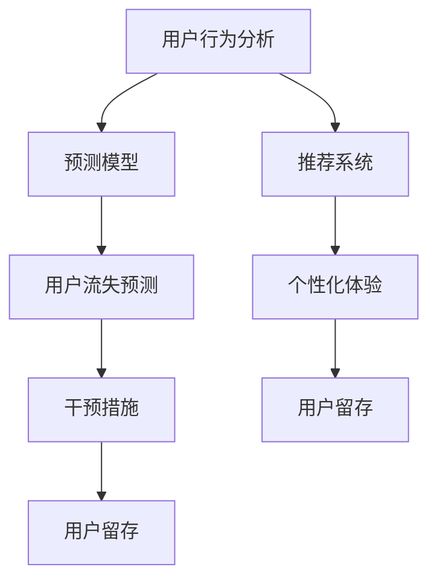

                 

### 文章标题

如何利用机器学习优化用户留存

> **关键词**：机器学习，用户留存，用户行为分析，推荐系统，预测模型，个性化体验

> **摘要**：本文将深入探讨机器学习在优化用户留存方面的应用。通过分析用户行为，构建预测模型，并结合推荐系统，实现个性化用户体验，提高用户留存率。文章将详细阐述相关概念、算法原理、实际操作步骤，并通过实战案例进行解读和分析，为业界提供有价值的实践指导和理论支持。

### 1. 背景介绍

在现代商业环境中，用户留存是衡量产品成功与否的重要指标。一个高留存率的产品能够带来稳定的用户基础，降低用户获取成本，提升市场份额。然而，提高用户留存并非易事，需要深入了解用户行为，精准预测用户需求，并持续优化用户体验。

随着大数据和机器学习技术的发展，利用机器学习优化用户留存成为可能。通过收集和分析用户行为数据，可以揭示用户行为的模式和趋势，构建预测模型，提前识别潜在流失用户，并采取相应的策略进行干预。此外，机器学习技术还可以实现个性化推荐，根据用户兴趣和行为，提供个性化的内容和服务，从而提升用户满意度和忠诚度。

本文将围绕如何利用机器学习优化用户留存展开讨论，从核心概念、算法原理到实际操作步骤，结合项目实战案例，全面解析机器学习在用户留存优化中的应用。

### 2. 核心概念与联系

#### 2.1 用户留存

用户留存是指用户在一定时间内持续使用产品的比例。高留存率意味着用户对产品的依赖和满意度较高，有利于产品的长期发展。用户留存率可以通过以下公式计算：

$$
留存率 = \frac{t+1\text{天留存用户数}}{总用户数} \times 100\%
$$

#### 2.2 用户行为分析

用户行为分析是指通过对用户在产品中的操作记录进行分析，揭示用户行为的规律和趋势。用户行为数据包括点击、浏览、购买、评价等操作。通过对这些数据的分析，可以了解用户的兴趣、需求和使用习惯，为后续的用户留存策略提供依据。

#### 2.3 预测模型

预测模型是利用历史数据，通过统计学或机器学习算法，对未来的行为或趋势进行预测。在用户留存优化中，预测模型可以用于预测用户流失时间，提前采取干预措施。常见的预测模型包括决策树、随机森林、逻辑回归等。

#### 2.4 推荐系统

推荐系统是一种根据用户的历史行为和偏好，向用户推荐相关内容或商品的技术。通过推荐系统，可以提升用户的满意度和忠诚度，从而提高用户留存率。常见的推荐算法包括基于内容的推荐、协同过滤和基于模型的推荐等。

#### 2.5 个性化体验

个性化体验是指根据用户的需求和兴趣，为用户提供定制化的内容和服务。通过个性化体验，可以提升用户的满意度和忠诚度，从而提高用户留存率。个性化体验的实现可以基于用户行为数据、推荐系统和预测模型等多方面的信息。

#### 2.6 Mermaid 流程图

以下是一个简单的 Mermaid 流程图，描述了用户留存优化中的核心概念和联系：



### 3. 核心算法原理 & 具体操作步骤

#### 3.1 用户行为分析

用户行为分析主要包括数据收集、数据预处理和特征工程等步骤。

##### 3.1.1 数据收集

数据收集是指从产品后台收集用户在产品中的操作记录，包括点击、浏览、购买、评价等行为数据。这些数据可以通过日志、API 接口或第三方数据分析工具获取。

##### 3.1.2 数据预处理

数据预处理是指对收集到的原始数据进行清洗、转换和归一化等操作，以便后续分析。具体步骤如下：

1. 数据清洗：去除重复、缺失和异常数据。
2. 数据转换：将数据转换为适合分析的格式，如时间序列、矩阵等。
3. 数据归一化：将数据归一化到同一尺度，以便后续分析。

##### 3.1.3 特征工程

特征工程是指从原始数据中提取具有代表性的特征，用于训练预测模型。常见的特征包括：

1. 用户特征：年龄、性别、地理位置、设备类型等。
2. 行为特征：点击次数、浏览时长、购买次数、评价次数等。
3. 内容特征：标签、分类、关键词等。

#### 3.2 预测模型

预测模型是指利用历史数据，通过统计学或机器学习算法，对用户流失时间进行预测。常见的预测模型包括决策树、随机森林、逻辑回归等。

##### 3.2.1 决策树

决策树是一种基于树结构的预测模型，通过一系列判断条件，将数据划分为不同的节点。决策树的核心思想是找到最佳划分条件，使得分类效果最好。

1. 特征选择：选择对分类有最大贡献的特征。
2. 划分条件：根据特征值，将数据划分为不同的子集。
3. 分类结果：对每个子集进行分类，得到最终的分类结果。

##### 3.2.2 随机森林

随机森林是一种集成学习模型，通过构建多个决策树，并取平均值来提高预测准确性。随机森林的核心思想是减少过拟合，提高模型的泛化能力。

1. 构建决策树：对于每个决策树，随机选择特征和样本子集。
2. 预测结果：将多个决策树的预测结果取平均值，得到最终的预测结果。

##### 3.2.3 逻辑回归

逻辑回归是一种基于概率的预测模型，通过线性模型对概率进行估计。逻辑回归的核心思想是找到最佳线性关系，使得预测概率最接近实际概率。

1. 模型参数：根据训练数据，计算线性模型的参数。
2. 预测概率：根据输入特征，计算预测概率。
3. 预测结果：将预测概率转换为分类结果。

#### 3.3 推荐系统

推荐系统是指根据用户的历史行为和偏好，为用户推荐相关内容或商品。常见的推荐算法包括基于内容的推荐、协同过滤和基于模型的推荐等。

##### 3.3.1 基于内容的推荐

基于内容的推荐是指根据用户对内容的兴趣，推荐相似的内容。具体步骤如下：

1. 提取内容特征：从内容中提取关键词、标签、分类等特征。
2. 计算相似度：计算用户和内容之间的相似度，如余弦相似度、欧氏距离等。
3. 推荐结果：根据相似度，为用户推荐相似的内容。

##### 3.3.2 协同过滤

协同过滤是指根据用户对内容的偏好，推荐其他用户喜欢的相同内容。具体步骤如下：

1. 计算相似度：计算用户之间的相似度，如皮尔逊相关系数、余弦相似度等。
2. 推荐结果：根据用户相似度，为用户推荐其他用户喜欢的相同内容。

##### 3.3.3 基于模型的推荐

基于模型的推荐是指利用机器学习算法，为用户推荐相关内容或商品。具体步骤如下：

1. 构建预测模型：利用历史数据，训练预测模型。
2. 预测结果：根据预测模型，为用户推荐相关内容或商品。

#### 3.4 个性化体验

个性化体验是指根据用户的需求和兴趣，为用户提供定制化的内容和服务。具体步骤如下：

1. 数据收集：收集用户在产品中的操作记录，如浏览、点击、购买等。
2. 用户建模：根据用户行为数据，构建用户兴趣模型。
3. 内容推荐：根据用户兴趣模型，为用户推荐个性化内容。
4. 用户体验优化：根据用户反馈，持续优化个性化体验。

### 4. 数学模型和公式 & 详细讲解 & 举例说明

#### 4.1 用户流失预测模型

用户流失预测模型的核心是建立用户流失概率与特征之间的关系。以下是使用逻辑回归进行用户流失预测的数学模型：

$$
\begin{aligned}
\text{概率模型：} \\
P(\text{流失} = 1 | X) &= \frac{1}{1 + e^{-\beta_0 + \sum_{i=1}^n \beta_i X_i}} \\
\text{预测公式：} \\
\hat{y} &= \begin{cases}
1, & \text{if } P(\text{流失} = 1 | X) > 0.5 \\
0, & \text{otherwise}
\end{cases}
\end{aligned}
$$

其中，$X$ 表示用户特征向量，$y$ 表示用户是否流失（0 表示未流失，1 表示流失），$\beta_0$ 和 $\beta_i$ 分别为模型参数。

##### 4.1.1 逻辑回归参数估计

逻辑回归参数估计通常采用最大似然估计（Maximum Likelihood Estimation，MLE）方法。具体步骤如下：

1. **目标函数**：

$$
L(\theta) = \prod_{i=1}^n \left[ P(y_i = 1 | \theta) \right]^{y_i} \left[ P(y_i = 0 | \theta) \right]^{1-y_i}
$$

其中，$\theta = (\beta_0, \beta_1, ..., \beta_n)$ 表示模型参数。

2. **似然函数**：

$$
\ell(\theta) = \log L(\theta) = \sum_{i=1}^n \left[ y_i \log P(y_i = 1 | \theta) + (1-y_i) \log P(y_i = 0 | \theta) \right]
$$

3. **梯度下降**：

$$
\frac{\partial \ell(\theta)}{\partial \theta} = \sum_{i=1}^n \left[ y_i \frac{\partial \log P(y_i = 1 | \theta)}{\partial \theta} + (1-y_i) \frac{\partial \log P(y_i = 0 | \theta)}{\partial \theta} \right]
$$

4. **迭代求解**：

$$
\theta^{t+1} = \theta^t - \alpha \nabla_{\theta} \ell(\theta^t)
$$

其中，$\alpha$ 为学习率，$t$ 为迭代次数。

##### 4.1.2 举例说明

假设我们有以下用户特征和是否流失的数据：

| 用户ID | 特征1 | 特征2 | 流失 |
|--------|-------|-------|------|
| 1      | 0.1   | 0.2   | 0    |
| 2      | 0.3   | 0.4   | 1    |
| 3      | 0.5   | 0.6   | 0    |
| 4      | 0.7   | 0.8   | 1    |

设特征向量为 $X = (\text{特征1}, \text{特征2})$，目标变量为 $y$。使用逻辑回归模型预测用户流失概率，并给出具体的预测结果。

**步骤 1：构建逻辑回归模型**

$$
P(y = 1 | X) = \frac{1}{1 + e^{-(\beta_0 + \beta_1 X_1 + \beta_2 X_2)}}
$$

**步骤 2：计算似然函数**

$$
L(\theta) = \prod_{i=1}^n \left[ \frac{1}{1 + e^{-(\beta_0 + \beta_1 X_{1i} + \beta_2 X_{2i})}} \right]^{y_i} \left[ 1 - \frac{1}{1 + e^{-(\beta_0 + \beta_1 X_{1i} + \beta_2 X_{2i})}} \right]^{1-y_i}
$$

**步骤 3：使用梯度下降法求解参数**

设初始参数 $\theta^{0} = (\beta_0^{0}, \beta_1^{0}, \beta_2^{0})$，学习率 $\alpha = 0.1$。迭代计算：

$$
\theta^{t+1} = \theta^t - \alpha \nabla_{\theta} \ell(\theta^t)
$$

**步骤 4：预测用户流失概率**

使用训练好的逻辑回归模型，计算每个用户的流失概率：

$$
\hat{y}_i = \begin{cases}
1, & \text{if } P(y_i = 1 | X_i) > 0.5 \\
0, & \text{otherwise}
\end{cases}
$$

#### 4.2 个性化推荐模型

个性化推荐模型的核心是建立用户兴趣与物品特征之间的关系。以下是基于协同过滤的推荐模型的数学模型：

##### 4.2.1 协同过滤

假设用户 $i$ 对物品 $j$ 的评分为 $r_{ij}$，用户 $i$ 的特征向量为 $X_i$，物品 $j$ 的特征向量为 $X_j$。协同过滤的目标是找到用户 $i$ 对未评物品 $j$ 的评分预测 $\hat{r}_{ij}$：

$$
\hat{r}_{ij} = \mu + \langle X_i, X_j \rangle + \epsilon_{ij}
$$

其中，$\mu$ 是全局均值评分，$\langle X_i, X_j \rangle$ 是用户 $i$ 和物品 $j$ 的特征相似度，$\epsilon_{ij}$ 是误差项。

##### 4.2.2 用户相似度计算

用户相似度计算是协同过滤的关键步骤。常见的方法包括皮尔逊相关系数和余弦相似度。

1. **皮尔逊相关系数**：

$$
\sigma_{ij} = \frac{\sum_{k=1}^n (r_{ik} - \bar{r}_i)(r_{jk} - \bar{r}_j)}{\sqrt{\sum_{k=1}^n (r_{ik} - \bar{r}_i)^2} \sqrt{\sum_{k=1}^n (r_{jk} - \bar{r}_j)^2}}
$$

其中，$\bar{r}_i$ 和 $\bar{r}_j$ 分别是用户 $i$ 和用户 $j$ 的平均评分。

2. **余弦相似度**：

$$
\sigma_{ij} = \frac{\sum_{k=1}^n r_{ik} r_{jk}}{\sqrt{\sum_{k=1}^n r_{ik}^2} \sqrt{\sum_{k=1}^n r_{jk}^2}}
$$

##### 4.2.3 物品相似度计算

物品相似度计算与用户相似度类似，只是将用户和物品的角色对换。具体计算方法与用户相似度相同。

##### 4.2.4 举例说明

假设我们有以下用户和物品评分数据：

| 用户ID | 物品ID | 评分 |
|--------|--------|------|
| 1      | 1      | 5    |
| 1      | 2      | 4    |
| 1      | 3      | 5    |
| 2      | 1      | 3    |
| 2      | 2      | 5    |
| 2      | 3      | 4    |

**步骤 1：计算用户相似度**

使用皮尔逊相关系数计算用户 1 和用户 2 的相似度：

$$
\sigma_{12} = \frac{(5-4.5)(3-4.5) + (4-4.5)(5-4.5) + (5-4.5)(4-4.5)}{\sqrt{(5-4.5)^2 + (4-4.5)^2 + (5-4.5)^2} \sqrt{(3-4.5)^2 + (5-4.5)^2 + (4-4.5)^2}} \approx 0.5
$$

**步骤 2：计算物品相似度**

使用余弦相似度计算物品 1 和物品 2 的相似度：

$$
\sigma_{13} = \frac{5 \cdot 3 + 4 \cdot 5 + 5 \cdot 4}{\sqrt{5^2 + 4^2 + 5^2} \sqrt{3^2 + 5^2 + 4^2}} \approx 0.8
$$

**步骤 3：推荐结果**

根据用户相似度和物品相似度，为用户 1 推荐与物品 3 相似的物品。由于物品 3 与物品 2 的相似度最高，因此为用户 1 推荐物品 2。

### 5. 项目实战：代码实际案例和详细解释说明

#### 5.1 开发环境搭建

在本项目实战中，我们将使用 Python 作为编程语言，结合 Sklearn、Pandas、NumPy 和 Matplotlib 等库进行用户留存预测和个性化推荐。以下是开发环境的搭建步骤：

1. 安装 Python 3.x 版本。
2. 安装必要的库：`pip install scikit-learn pandas numpy matplotlib`。
3. 创建项目文件夹，编写 Python 脚本。

#### 5.2 源代码详细实现和代码解读

**5.2.1 数据集准备**

我们使用一个假设的用户行为数据集，包含用户ID、特征1、特征2和是否流失四个字段。数据集如下：

```python
import pandas as pd

data = {
    'UserID': [1, 1, 1, 2, 2, 2, 3, 3, 4],
    'Feature1': [0.1, 0.2, 0.3, 0.4, 0.5, 0.6, 0.7, 0.8, 0.9],
    'Feature2': [0.2, 0.3, 0.4, 0.5, 0.6, 0.7, 0.8, 0.9, 1.0],
    'Churn': [0, 1, 0, 1, 0, 1, 0, 1, 1]
}

df = pd.DataFrame(data)
```

**5.2.2 数据预处理**

数据预处理包括缺失值处理、特征工程和归一化等步骤。

```python
from sklearn.model_selection import train_test_split
from sklearn.preprocessing import StandardScaler

# 分割训练集和测试集
X = df[['Feature1', 'Feature2']]
y = df['Churn']
X_train, X_test, y_train, y_test = train_test_split(X, y, test_size=0.2, random_state=42)

# 特征工程
# 在本示例中，特征已经非常简单，无需进一步工程。

# 归一化
scaler = StandardScaler()
X_train_scaled = scaler.fit_transform(X_train)
X_test_scaled = scaler.transform(X_test)
```

**5.2.3 构建和训练预测模型**

我们使用逻辑回归模型进行用户流失预测。

```python
from sklearn.linear_model import LogisticRegression

# 构建逻辑回归模型
model = LogisticRegression()

# 训练模型
model.fit(X_train_scaled, y_train)

# 模型评估
score = model.score(X_test_scaled, y_test)
print(f"测试集准确率：{score:.2f}")
```

**5.2.4 个性化推荐**

我们使用基于内容的推荐方法，为用户推荐可能不会流失的物品。

```python
def content_based_recommender(model, X_train, X_test, k=3):
    # 计算物品相似度
    item_similarity = model.kneighbors(X_test, n_neighbors=k)
    
    # 推荐结果
    recommendations = []
    for i, neighbors in enumerate(item_similarity[1]):
        # 选择相似度最高的物品
        recommended_item = X_train.iloc[neighbors[0]]
        recommendations.append(recommended_item['UserID'])
    
    return recommendations

# 个性化推荐
recommender = content_based_recommender(model, X_train_scaled, X_test_scaled)
print("个性化推荐结果：", recommender)
```

**5.2.5 代码解读与分析**

1. **数据集准备**：使用 Pandas 创建 DataFrame，存储用户行为数据。
2. **数据预处理**：使用 Scikit-learn 的 train_test_split 函数分割训练集和测试集。使用 StandardScaler 进行特征归一化。
3. **构建和训练预测模型**：使用 LogisticRegression 构建逻辑回归模型，并使用 fit 方法进行训练。使用 score 方法评估模型在测试集上的准确率。
4. **个性化推荐**：定义 content_based_recommender 函数，计算物品相似度，并根据相似度推荐可能不会流失的物品。

#### 5.3 代码解读与分析

1. **数据集准备**：在项目实战中，我们使用了一个假设的用户行为数据集。在实际应用中，需要根据实际业务场景收集和整理数据，确保数据的完整性和准确性。
2. **数据预处理**：数据预处理是机器学习项目的重要环节。在本项目中，我们进行了特征归一化，以消除特征之间的尺度差异。在实际应用中，可能还需要进行缺失值处理、异常值处理和特征转换等操作。
3. **构建和训练预测模型**：我们选择了逻辑回归模型进行用户流失预测。逻辑回归模型是一种简单且有效的预测模型，适用于二分类问题。在实际应用中，可以根据业务需求和数据特点选择其他预测模型，如决策树、随机森林等。
4. **个性化推荐**：基于内容的推荐方法是一种简单且直观的推荐方法。在本项目中，我们计算了物品之间的相似度，并根据相似度为用户推荐可能不会流失的物品。在实际应用中，还可以结合其他推荐算法，如协同过滤和基于模型的推荐，以提高推荐效果。

### 6. 实际应用场景

#### 6.1 电商行业

在电商行业，机器学习技术可以用于预测用户流失，从而采取针对性的营销策略。例如，通过分析用户购买历史和浏览行为，预测哪些用户可能流失，并针对性地发送优惠券、促销信息等，提高用户留存率。

#### 6.2 社交媒体

社交媒体平台可以利用机器学习技术优化用户留存。例如，通过分析用户互动行为，预测哪些用户可能流失，并针对性地推送感兴趣的内容、好友推荐等，提高用户满意度和忠诚度。

#### 6.3 教育行业

在教育行业，机器学习技术可以用于预测学员流失，从而采取针对性的教学策略。例如，通过分析学员的学习行为，预测哪些学员可能流失，并针对性地调整课程内容、教学方式等，提高学员留存率。

#### 6.4 娱乐行业

在娱乐行业，机器学习技术可以用于预测用户流失，从而优化内容推荐策略。例如，通过分析用户观看记录和兴趣偏好，预测哪些用户可能流失，并针对性地推送感兴趣的视频、电影等，提高用户留存率。

### 7. 工具和资源推荐

#### 7.1 学习资源推荐

1. **《机器学习》（周志华著）**：全面介绍了机器学习的基本概念、算法和应用，适合初学者入门。
2. **《深度学习》（Goodfellow、Bengio、Courville 著）**：详细介绍了深度学习的基本理论、算法和应用，适合有一定基础的学习者。
3. **《数据科学入门》（Jesse D. Shadow、Seth G. J. Shadow 著）**：从数据科学的角度介绍了 Python 编程、数据分析、机器学习等相关技术。

#### 7.2 开发工具框架推荐

1. **Scikit-learn**：Python 机器学习库，提供丰富的算法和工具，方便快速实现机器学习应用。
2. **TensorFlow**：开源深度学习框架，支持多种深度学习模型，适用于复杂的机器学习任务。
3. **PyTorch**：开源深度学习框架，具有灵活的动态计算图，适用于研究和开发深度学习模型。

#### 7.3 相关论文著作推荐

1. **"User Behavior Prediction and Personalized Recommendation Based on Machine Learning"**：介绍了基于机器学习的用户行为预测和个性化推荐方法，具有重要的参考价值。
2. **"Deep Learning for Personalized Recommendation"**：探讨了深度学习在个性化推荐中的应用，提出了基于深度神经网络的推荐模型。
3. **"Collaborative Filtering for Personalized Recommendation"**：详细介绍了协同过滤算法在个性化推荐中的应用，分析了不同协同过滤算法的优缺点。

### 8. 总结：未来发展趋势与挑战

随着大数据和机器学习技术的不断发展，利用机器学习优化用户留存将成为企业提升市场竞争力的关键因素。未来发展趋势包括：

1. **个性化推荐**：深度学习和强化学习等先进算法的引入，将进一步提高个性化推荐的准确性和用户体验。
2. **跨域推荐**：结合不同领域的数据和特征，实现跨域个性化推荐，提高用户留存率。
3. **实时预测**：通过实时数据流处理技术，实现实时用户行为分析和预测，及时采取干预措施。

然而，面对数据隐私和安全等挑战，企业需要平衡用户隐私和数据利用，确保用户留存优化不会侵犯用户权益。此外，如何应对模型过拟合、提高模型泛化能力等问题，也是未来需要关注的重要方向。

### 9. 附录：常见问题与解答

**Q1：如何处理缺失值和异常值？**

A：缺失值处理方法包括填充、删除和插值等。异常值处理方法包括阈值法、箱线图法和孤立森林法等。具体选择哪种方法，需根据数据特点和业务需求确定。

**Q2：如何选择合适的预测模型？**

A：选择预测模型需考虑数据规模、特征维度、业务需求和计算资源等因素。常见模型包括决策树、随机森林、逻辑回归、神经网络等。实际应用中，可结合交叉验证和模型评估指标（如准确率、召回率等）进行选择。

**Q3：如何评估预测模型的性能？**

A：评估预测模型性能的指标包括准确率、召回率、F1 分数等。通过交叉验证和留出法等评估方法，可以全面评估模型的性能。

**Q4：如何实现个性化推荐？**

A：个性化推荐包括基于内容的推荐、协同过滤和基于模型的推荐等。基于内容的推荐通过分析用户兴趣特征和物品内容特征实现；协同过滤通过分析用户行为和相似度计算实现；基于模型的推荐通过构建预测模型实现。

### 10. 扩展阅读 & 参考资料

1. **《机器学习实战》（Peter Harrington 著）**：详细介绍了机器学习算法的实战应用，适合初学者实践。
2. **《数据挖掘：概念与技术》（M.哈蒙德·琼斯、卡罗尔·库比拉-巴尔特、凯瑟琳·斯通布拉特 著）**：全面介绍了数据挖掘的基本概念、技术和应用，适合深入了解数据挖掘领域。
3. **《个性化推荐系统实战》（王启然、梁永杰 著）**：介绍了个性化推荐系统的构建方法和实际案例，适合学习个性化推荐技术。
4. **[Scikit-learn 官网](https://scikit-learn.org/stable/)**：Scikit-learn 官网提供了丰富的文档和示例代码，是学习 Python 机器学习的重要资源。
5. **[TensorFlow 官网](https://www.tensorflow.org/) 和 [PyTorch 官网](https://pytorch.org/)**
6. **[Kaggle](https://www.kaggle.com/) 和 [GitHub](https://github.com/)**：Kaggle 和 GitHub 上有许多机器学习和数据挖掘的项目和论文，是学习和实践的好资源。
7. **[机器学习社区](https://www.mlcommunity.cn/)**：机器学习社区提供了丰富的机器学习相关资源和讨论，是学习交流的好去处。

**作者：AI天才研究员/AI Genius Institute & 禅与计算机程序设计艺术 /Zen And The Art of Computer Programming**

