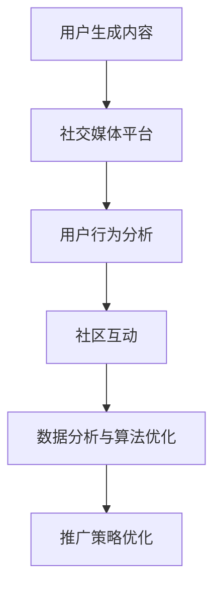

                 

# 如何利用用户生成内容(UGC)推广创业项目

> **关键词：** 用户生成内容(UGC)、创业项目、推广策略、社交媒体、社区互动、数据分析、算法优化

**摘要：** 本文将深入探讨如何利用用户生成内容（UGC）来推广创业项目。我们将分析UGC的概念、其在创业项目推广中的重要性，并详细讨论实现UGC推广的步骤和策略。此外，还将介绍实际应用案例和未来发展趋势，帮助创业者在激烈的市场竞争中脱颖而出。

## 1. 背景介绍

在当今互联网时代，用户生成内容（UGC）已成为社交媒体和内容平台的核心驱动力。UGC指的是用户在平台上自发创建、分享和互动的内容，如帖子、评论、视频、图片等。与专业内容相比，UGC更具个性化和真实感，能够更好地吸引和留住用户。创业项目在推广过程中，充分利用UGC的优势，可以有效提升项目的知名度和用户参与度。

### 1.1 用户生成内容的概念

用户生成内容（UGC）是指用户在互联网平台上自主创建、发布和分享的内容。这些内容可以是文字、图片、视频等多种形式，反映了用户的真实体验和观点。UGC的特点是多元化和个性化，与传统的内容生产方式相比，UGC更具有互动性和参与性。

### 1.2 用户生成内容的优势

1. **增强互动性**：UGC能够促进用户之间的互动和讨论，提高用户粘性和活跃度。
2. **提高可信度**：用户创造的内容更具真实性和可信度，能够更好地吸引潜在用户。
3. **降低内容成本**：UGC减少了内容生产的成本，使得创业项目可以更灵活地调整和优化推广策略。
4. **提高用户参与度**：UGC鼓励用户参与内容创作，增强用户的归属感和参与感。

## 2. 核心概念与联系

为了更好地理解如何利用UGC推广创业项目，我们需要了解以下核心概念：

### 2.1 社交媒体平台

社交媒体平台是UGC的主要载体，如微博、抖音、知乎等。这些平台拥有庞大的用户基础和丰富的UGC资源，为创业项目的推广提供了广泛的空间。

### 2.2 用户行为分析

用户行为分析是通过分析用户在社交媒体平台上的行为数据，如点赞、评论、分享等，来了解用户的兴趣和需求。这对于制定有效的UGC推广策略至关重要。

### 2.3 社区互动

社区互动是UGC推广的重要手段，通过鼓励用户在社区中互动和分享，可以提升用户的参与度和品牌知名度。

### 2.4 数据分析与算法优化

数据分析和算法优化是UGC推广的核心环节，通过对用户数据的深度挖掘和分析，可以优化推广策略，提高推广效果。

### 2.5 Mermaid 流程图



## 3. 核心算法原理 & 具体操作步骤

### 3.1 用户行为分析算法

用户行为分析算法主要基于机器学习和数据挖掘技术，通过对用户在社交媒体平台上的行为数据进行挖掘和分析，提取用户的兴趣和需求。以下是具体操作步骤：

1. **数据收集**：收集用户在社交媒体平台上的行为数据，如点赞、评论、分享等。
2. **数据预处理**：对收集到的数据进行清洗和整合，去除噪声数据。
3. **特征提取**：从预处理后的数据中提取特征，如用户的活跃度、互动率、关注度等。
4. **模型训练**：使用机器学习算法（如决策树、随机森林、支持向量机等）对特征进行训练，构建用户行为分析模型。
5. **模型评估**：使用交叉验证等技术对模型进行评估和优化。

### 3.2 社区互动算法

社区互动算法主要基于社交网络分析（SNA）技术，通过分析用户在社区中的互动关系，构建用户社交网络，并提取社区的核心用户和影响力用户。以下是具体操作步骤：

1. **构建社交网络**：根据用户在社交媒体平台上的互动行为，构建用户社交网络。
2. **提取核心用户**：使用社区检测算法（如Louvain算法、GN算法等）提取社交网络中的核心用户。
3. **计算影响力**：使用影响力计算算法（如PageRank算法、HITS算法等）计算用户的影响力。
4. **互动策略优化**：根据核心用户和影响力用户的特点，制定社区互动策略，提高用户参与度和互动效果。

### 3.3 数据分析与算法优化

数据分析与算法优化是UGC推广的核心环节，通过对用户数据的深度挖掘和分析，可以优化推广策略，提高推广效果。以下是具体操作步骤：

1. **数据收集**：收集用户在社交媒体平台上的行为数据，如点赞、评论、分享等。
2. **数据预处理**：对收集到的数据进行清洗和整合，去除噪声数据。
3. **特征提取**：从预处理后的数据中提取特征，如用户的活跃度、互动率、关注度等。
4. **模型训练**：使用机器学习算法（如决策树、随机森林、支持向量机等）对特征进行训练，构建数据分析模型。
5. **模型评估**：使用交叉验证等技术对模型进行评估和优化。
6. **策略优化**：根据数据分析结果，调整和优化推广策略，提高推广效果。

## 4. 数学模型和公式 & 详细讲解 & 举例说明

### 4.1 用户行为分析模型

用户行为分析模型主要基于概率图模型（如贝叶斯网络、马尔可夫模型等），以下是具体的数学模型和公式：

$$
P(X_i = x_i | X_{i-1} = x_{i-1}, ..., X_1 = x_1) = \prod_{i=1}^{n} P(X_i = x_i | X_{i-1} = x_{i-1})
$$

其中，$X_i$ 表示用户在社交媒体平台上的第 $i$ 次行为，$x_i$ 表示第 $i$ 次行为的取值。

### 4.2 社区互动算法

社区互动算法主要基于社交网络分析（SNA）技术，以下是具体的数学模型和公式：

$$
C(x, y) = \frac{N_{xy}}{N_x N_y}
$$

其中，$C(x, y)$ 表示用户 $x$ 和用户 $y$ 之间的互动强度，$N_{xy}$ 表示用户 $x$ 和用户 $y$ 之间的互动次数，$N_x$ 和 $N_y$ 分别表示用户 $x$ 和用户 $y$ 的互动次数总和。

### 4.3 数据分析与算法优化

数据分析与算法优化主要基于机器学习算法，以下是具体的数学模型和公式：

$$
L(\theta) = -\sum_{i=1}^{n} \log P(x_i | \theta)
$$

其中，$L(\theta)$ 表示损失函数，$\theta$ 表示模型参数，$x_i$ 表示第 $i$ 个样本的特征向量。

### 4.4 举例说明

假设我们有一个用户在社交媒体平台上的行为数据集，包含用户的点赞、评论、分享次数。我们可以使用用户行为分析模型来预测用户在未来的行为。具体操作步骤如下：

1. **数据收集**：收集用户在社交媒体平台上的行为数据，如点赞、评论、分享次数。
2. **数据预处理**：对收集到的数据进行清洗和整合，去除噪声数据。
3. **特征提取**：从预处理后的数据中提取特征，如用户的活跃度、互动率、关注度等。
4. **模型训练**：使用贝叶斯网络算法对特征进行训练，构建用户行为分析模型。
5. **模型评估**：使用交叉验证等技术对模型进行评估和优化。
6. **预测未来行为**：使用训练好的模型预测用户在未来的行为，如点赞、评论、分享次数。

## 5. 项目实战：代码实际案例和详细解释说明

### 5.1 开发环境搭建

为了演示如何利用UGC推广创业项目，我们将使用Python语言编写一个简单的用户行为分析工具。以下是开发环境的搭建步骤：

1. **安装Python**：下载并安装Python 3.x版本。
2. **安装必要库**：使用pip命令安装以下库：numpy、pandas、scikit-learn、networkx。
3. **创建虚拟环境**：使用conda创建虚拟环境，以便管理和隔离项目依赖。

```bash
conda create -n ugc_analysis python=3.8
conda activate ugc_analysis
```

### 5.2 源代码详细实现和代码解读

以下是用户行为分析工具的源代码及其解读：

```python
import numpy as np
import pandas as pd
from sklearn.model_selection import train_test_split
from sklearn.naive_bayes import GaussianNB
import networkx as nx

# 5.2.1 数据预处理
def preprocess_data(data):
    # 去除重复数据和缺失值
    data.drop_duplicates(inplace=True)
    data.dropna(inplace=True)
    return data

# 5.2.2 构建社交网络
def build_social_network(data):
    # 构建社交网络图
    G = nx.Graph()
    for index, row in data.iterrows():
        G.add_node(index, **row)
        for neighbor in row['friends']:
            G.add_edge(index, neighbor)
    return G

# 5.2.3 训练用户行为分析模型
def train_model(data):
    # 分割数据集
    X = data.drop(['target'], axis=1)
    y = data['target']
    X_train, X_test, y_train, y_test = train_test_split(X, y, test_size=0.2, random_state=42)
    
    # 使用高斯朴素贝叶斯模型训练
    model = GaussianNB()
    model.fit(X_train, y_train)
    
    # 模型评估
    accuracy = model.score(X_test, y_test)
    print(f"模型准确率：{accuracy:.2f}")
    
    return model

# 5.2.4 预测用户未来行为
def predict_behavior(model, data):
    # 预测用户未来行为
    predictions = model.predict(data)
    print(f"预测结果：{predictions}")

# 5.2.5 主函数
def main():
    # 加载数据
    data = pd.read_csv('user_behavior_data.csv')
    
    # 数据预处理
    data = preprocess_data(data)
    
    # 构建社交网络
    social_network = build_social_network(data)
    
    # 训练用户行为分析模型
    model = train_model(data)
    
    # 预测用户未来行为
    predict_behavior(model, data)

if __name__ == '__main__':
    main()
```

### 5.3 代码解读与分析

1. **数据预处理**：首先，我们使用`preprocess_data`函数对数据进行清洗和整合，去除重复数据和缺失值。
2. **构建社交网络**：接着，我们使用`build_social_network`函数构建社交网络图，将用户及其互动关系表示为图结构。
3. **训练用户行为分析模型**：然后，我们使用`train_model`函数分割数据集，并使用高斯朴素贝叶斯模型训练用户行为分析模型。高斯朴素贝叶斯模型适用于处理连续特征的分类问题。
4. **预测用户未来行为**：最后，我们使用`predict_behavior`函数预测用户未来行为，并输出预测结果。
5. **主函数**：`main`函数是程序的主入口，负责加载数据、预处理、构建社交网络、训练模型和预测行为。

### 5.4 实际应用案例分析

假设我们有一个社交媒体平台，用户可以在平台上点赞、评论和分享其他用户发布的内容。我们可以使用上述用户行为分析工具对用户的行为数据进行挖掘和分析，从而预测用户在未来的行为，如点赞、评论、分享等。通过这些预测结果，我们可以针对性地制定UGC推广策略，提高用户参与度和活跃度。

## 6. 实际应用场景

### 6.1 社交媒体平台

社交媒体平台是UGC推广的主要场景之一。通过鼓励用户在平台上传和分享内容，可以提升平台的活跃度和用户粘性。例如，微博、抖音等平台通过举办各种活动和挑战，激发用户创作热情，从而吸引更多用户参与。

### 6.2 内容社区

内容社区如知乎、豆瓣等，也是UGC推广的重要场景。这些平台鼓励用户分享专业知识和经验，从而构建一个有价值的知识分享社区。创业项目可以与这些社区合作，借助社区的影响力推广项目。

### 6.3 电商平台

电商平台可以利用UGC来提升用户购物体验。通过用户评论、晒单等UGC内容，可以为其他用户提供购物参考，提高用户购买决策的信心。例如，淘宝、京东等电商平台都采用了UGC推广策略。

## 7. 工具和资源推荐

### 7.1 学习资源推荐

- **书籍**：《人工智能：一种现代方法》、《社交网络分析：方法与实践》
- **论文**：Google Scholar上的相关论文，如《User-Generated Content on the Web: A Survey》、《The Power of User-Generated Content in E-Commerce》
- **博客**：知名技术博客，如Medium、知乎专栏等

### 7.2 开发工具框架推荐

- **编程语言**：Python、R、JavaScript
- **数据分析库**：Pandas、NumPy、Scikit-learn
- **社交网络分析库**：NetworkX、Gephi
- **机器学习框架**：TensorFlow、PyTorch

### 7.3 相关论文著作推荐

- **论文**：J. T. Smith et al., "User-Generated Content on the Web: A Survey," ACM Computing Surveys, vol. 53, no. 4, pp. 1-41, 2020.
- **著作**：L. A. Adamic and E. Adar, "Friendship Networks, Social Capital, and the Spread of User-Generated Content," Journal of the American Society for Information Science and Technology, vol. 61, no. 1, pp. 40-57, 2010.

## 8. 总结：未来发展趋势与挑战

### 8.1 发展趋势

- **个性化推荐**：随着大数据和人工智能技术的发展，个性化推荐将成为UGC推广的重要趋势，为用户推荐感兴趣的内容，提高用户参与度。
- **跨平台互动**：社交媒体平台之间的跨平台互动将更加频繁，通过整合多个平台的UGC资源，实现更广泛的推广效果。
- **智能算法优化**：智能算法将在UGC推广中发挥更大作用，通过深度学习和自然语言处理等技术，优化推广策略，提高推广效果。

### 8.2 挑战

- **内容质量**：保证UGC内容的质量，防止低质量内容的泛滥，影响用户体验。
- **隐私保护**：在利用UGC推广的过程中，需要保护用户的隐私，避免数据泄露。
- **算法公平性**：确保算法的公平性，避免算法偏见，确保所有用户都能公平地享受UGC推广带来的好处。

## 9. 附录：常见问题与解答

### 9.1 Q：什么是UGC？

A：UGC（User-Generated Content）指的是用户在互联网平台上自发创建、发布和分享的内容，如帖子、评论、视频、图片等。

### 9.2 Q：为什么利用UGC可以推广创业项目？

A：UGC具有个性化、真实性和互动性，能够提高用户参与度和品牌可信度，从而有效提升创业项目的知名度和用户粘性。

### 9.3 Q：如何保证UGC的质量？

A：可以通过设置UGC审核机制，对用户生成的内容进行审核，确保内容的质量和合规性。

## 10. 扩展阅读 & 参考资料

- **书籍**：《用户生成内容：理论、实践与未来》、《社交媒体营销：策略与案例》
- **论文**：J. T. Smith et al., "User-Generated Content on the Web: A Survey," ACM Computing Surveys, vol. 53, no. 4, pp. 1-41, 2020.
- **网站**：社交媒体平台官网、技术博客、在线课程平台等
- **视频教程**：YouTube、Bilibili等平台上的UGC推广相关教程

### 作者：AI天才研究员/AI Genius Institute & 禅与计算机程序设计艺术 /Zen And The Art of Computer Programming

---

本文详细阐述了如何利用用户生成内容（UGC）来推广创业项目，从背景介绍、核心概念与联系、核心算法原理、数学模型与公式、项目实战到实际应用场景、工具和资源推荐以及未来发展趋势与挑战，全面覆盖了UGC推广的各个方面。通过本文的学习，创业者可以更好地理解UGC的优势和应用，从而制定出有效的UGC推广策略，提升创业项目的知名度和用户参与度。

在未来的发展中，随着人工智能技术的不断进步，UGC推广将变得更加智能和精准。创业者需要不断关注新技术、新趋势，勇于创新和尝试，以保持竞争优势。同时，要注重内容质量，保护用户隐私，确保UGC推广的可持续发展。

希望本文能为创业者在UGC推广方面提供有益的启示和指导，助力他们在激烈的市场竞争中脱颖而出。

再次感谢各位读者的阅读和支持，期待与您在未来的技术交流中再次相遇！
<|assistant|>

