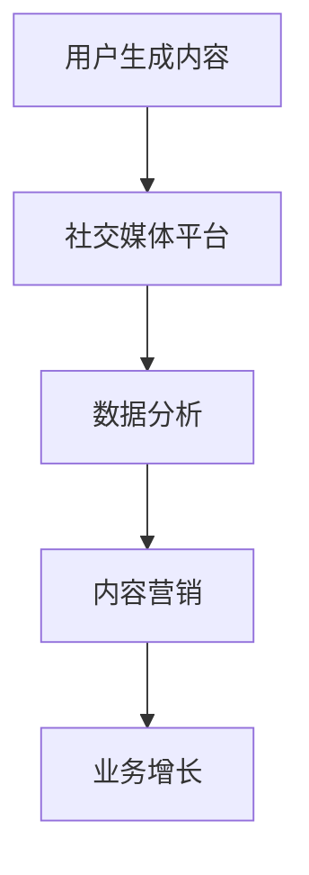

                 

# 如何利用用户生成内容促进增长

## 概述

在当今数字化时代，用户生成内容（UGC）已成为推动业务增长的重要动力。UGC不仅增强了用户参与度，还提供了真实、即时的反馈，从而帮助企业和平台更好地满足用户需求。本文将探讨如何利用UGC促进增长，涵盖核心概念、算法原理、实际应用场景、工具推荐以及未来发展趋势。

### 关键词

- 用户生成内容（UGC）
- 社交媒体
- 数据分析
- 内容营销
- 业务增长

### 摘要

本文将深入探讨用户生成内容（UGC）如何促进业务增长。首先，我们将介绍UGC的核心概念，然后分析其与社交媒体、数据分析等领域的联系。接着，我们将讨论利用UGC的具体算法原理和操作步骤，以及数学模型和公式的应用。最后，我们将探讨UGC在实际应用场景中的表现，并提供相关工具和资源的推荐。通过本文，读者将了解如何有效地利用UGC推动业务增长。

## 1. 背景介绍

随着互联网的普及和移动设备的普及，用户生成内容（UGC）逐渐成为互联网生态系统的重要组成部分。UGC是指由用户自主创建和分享的内容，如评论、帖子、照片、视频等。UGC的兴起改变了传统的信息传播方式，使得每个用户都成为信息创造者和传播者。

### 1.1 UGC的兴起与发展

UGC的兴起可以追溯到20世纪90年代末和21世纪初的互联网早期阶段。随着社交网络的兴起，UGC迅速发展，如Facebook、Twitter、Instagram等平台，用户可以通过发布内容来分享生活、表达观点和建立社交联系。此外，博客、论坛等社区平台也为UGC提供了广阔的舞台。

### 1.2 UGC的特点与优势

UGC具有以下几个显著特点：

1. **真实性与可信度**：UGC通常被认为比传统营销内容更真实和可信，因为它反映了普通用户的观点和体验。
2. **多样性**：UGC涵盖了各种形式，包括文本、图片、视频、音频等，使得内容更加丰富多样。
3. **即时性**：UGC能够实时反映用户的需求和趋势，为企业提供即时的市场反馈。
4. **互动性**：UGC促进了用户之间的互动和参与，增强了社区的凝聚力和用户忠诚度。

### 1.3 UGC在社交媒体中的应用

社交媒体平台如Facebook、Twitter、Instagram等，已经成为UGC的主要阵地。在这些平台上，用户可以轻松地创建和分享内容，与其他用户互动，从而扩大内容的影响力和传播范围。例如，Facebook上的“点赞”和“分享”功能使得用户生成内容能够迅速传播，形成病毒式营销效果。

## 2. 核心概念与联系

### 2.1 用户生成内容（UGC）

用户生成内容（UGC）是指用户在互联网平台上自主创建和分享的内容。UGC可以是文字、图片、视频、音频等多种形式。UGC的核心特点在于它的真实性、多样性和即时性，使得它成为了解用户需求和趋势的重要来源。

### 2.2 社交媒体与UGC的关系

社交媒体平台为UGC提供了广泛的应用场景和传播渠道。通过社交媒体，用户可以轻松创建和分享内容，从而实现信息的快速传播。社交媒体平台还提供了丰富的互动功能，如点赞、评论、分享等，进一步增强了UGC的传播效果。

### 2.3 数据分析与UGC

数据分析是利用统计学、机器学习等方法对大量数据进行分析和处理的过程。在UGC领域，数据分析可以帮助企业了解用户行为、偏好和需求，从而优化产品和服务，提高用户体验。

### 2.4 内容营销与UGC

内容营销是指通过创建和分享有价值的内容来吸引潜在客户并建立品牌忠诚度。UGC在内容营销中具有重要作用，因为它提供了真实、多样化的用户观点和体验，有助于提升内容的质量和影响力。

### 2.5 UGC与其他领域的联系

UGC不仅与社交媒体、数据分析、内容营销等领域密切相关，还与其他领域如电子商务、在线教育、医疗保健等有着广泛的应用。通过结合这些领域，UGC可以为企业带来更多增长机会。

### 2.6 Mermaid流程图



## 3. 核心算法原理 & 具体操作步骤

### 3.1 算法原理

利用用户生成内容（UGC）促进增长的核心算法原理主要包括数据收集、处理和分析三个环节。具体步骤如下：

1. **数据收集**：从社交媒体平台、社区论坛等渠道收集用户生成的内容。
2. **数据处理**：对收集到的UGC数据进行清洗、去噪和格式化，以便进行分析。
3. **数据分析**：利用统计学、自然语言处理、机器学习等方法对处理后的UGC数据进行深入分析，提取有价值的信息。

### 3.2 操作步骤

1. **选择数据源**：确定需要收集UGC的社交媒体平台和社区论坛。
2. **收集UGC**：使用爬虫或其他工具从数据源中提取UGC。
3. **数据清洗**：去除无效数据、重复数据和垃圾信息。
4. **数据格式化**：将UGC数据转化为适合分析的形式，如文本、标签、关键词等。
5. **数据分析**：利用统计学和机器学习方法对格式化后的UGC数据进行深入分析，提取有价值的信息。

### 3.3 具体算法

1. **文本分析**：使用自然语言处理（NLP）技术对UGC文本进行分析，提取关键词、情感倾向、主题等。
2. **图像分析**：使用计算机视觉技术对UGC图像进行分析，提取图像特征、标签等。
3. **视频分析**：使用视频分析技术对UGC视频进行分析，提取视频内容、标签、情感等。

## 4. 数学模型和公式 & 详细讲解 & 举例说明

### 4.1 数学模型

在用户生成内容（UGC）的分析中，常用的数学模型包括线性回归、支持向量机（SVM）、朴素贝叶斯分类器等。以下是这些模型的简要介绍：

1. **线性回归**：线性回归是一种预测连续值的模型，可以用来预测UGC的受欢迎程度、评论数等。
2. **支持向量机（SVM）**：SVM是一种分类模型，可以用来分类UGC的正面和负面情感。
3. **朴素贝叶斯分类器**：朴素贝叶斯分类器是一种基于概率的模型，可以用来预测UGC的主题和情感。

### 4.2 公式

以下是上述模型的公式表示：

1. **线性回归**：

   $$ y = \beta_0 + \beta_1x $$

   其中，\( y \) 是预测值，\( \beta_0 \) 是截距，\( \beta_1 \) 是斜率，\( x \) 是输入特征。

2. **支持向量机（SVM）**：

   $$ f(x) = w \cdot x + b $$

   其中，\( f(x) \) 是预测值，\( w \) 是权重向量，\( x \) 是输入特征，\( b \) 是偏置。

3. **朴素贝叶斯分类器**：

   $$ P(C_k | x) = \frac{P(x | C_k)P(C_k)}{P(x)} $$

   其中，\( P(C_k | x) \) 是给定特征 \( x \) 下类别 \( C_k \) 的概率，\( P(x | C_k) \) 是给定类别 \( C_k \) 下特征 \( x \) 的概率，\( P(C_k) \) 是类别 \( C_k \) 的概率，\( P(x) \) 是特征 \( x \) 的概率。

### 4.3 举例说明

假设我们使用线性回归模型预测UGC的评论数。给定一组输入特征 \( x \)（如文本长度、词汇量、图片数量等），以及对应的评论数 \( y \)，我们可以通过训练线性回归模型来预测新的UGC的评论数。

1. **数据准备**：

   - 输入特征：\( x_1, x_2, x_3, \ldots \)
   - 评论数：\( y_1, y_2, y_3, \ldots \)

2. **模型训练**：

   - 计算斜率 \( \beta_1 \) 和截距 \( \beta_0 \)：

     $$ \beta_1 = \frac{\sum_{i=1}^{n}(x_i - \bar{x})(y_i - \bar{y})}{\sum_{i=1}^{n}(x_i - \bar{x})^2} $$

     $$ \beta_0 = \bar{y} - \beta_1\bar{x} $$

     其中，\( \bar{x} \) 和 \( \bar{y} \) 分别是输入特征和评论数的平均值。

3. **预测**：

   - 对于新的UGC，给定输入特征 \( x \)，可以使用训练好的线性回归模型预测评论数：

     $$ y = \beta_0 + \beta_1x $$

## 5. 项目实战：代码实际案例和详细解释说明

### 5.1 开发环境搭建

在开始编写代码之前，我们需要搭建一个适合开发和运行代码的环境。以下是一个基本的开发环境搭建步骤：

1. **安装Python**：Python是一种广泛使用的编程语言，适用于数据处理和机器学习任务。可以从 [Python官方网站](https://www.python.org/) 下载并安装Python。
2. **安装Jupyter Notebook**：Jupyter Notebook是一种交互式计算环境，便于编写、运行和共享Python代码。可以使用pip命令安装：

   ```bash
   pip install notebook
   ```

3. **安装必要的库**：对于数据处理和机器学习任务，我们还需要安装以下库：

   ```bash
   pip install pandas numpy scikit-learn matplotlib
   ```

### 5.2 源代码详细实现和代码解读

以下是一个简单的用户生成内容（UGC）数据分析的Python代码实例。该代码首先从Twitter收集UGC，然后使用自然语言处理（NLP）技术对文本进行分析，并绘制可视化结果。

```python
import tweepy
import pandas as pd
from textblob import TextBlob
import matplotlib.pyplot as plt

# Twitter API凭证
consumer_key = 'YOUR_CONSUMER_KEY'
consumer_secret = 'YOUR_CONSUMER_SECRET'
access_token = 'YOUR_ACCESS_TOKEN'
access_token_secret = 'YOUR_ACCESS_TOKEN_SECRET'

# 初始化Tweepy客户端
auth = tweepy.OAuthHandler(consumer_key, consumer_secret)
auth.set_access_token(access_token, access_token_secret)
api = tweepy.API(auth)

# 收集Twitter UGC
tweets = []
for tweet in tweepy.Cursor(api.search_tweets, q="python", lang="en", tweet_mode="extended").items(100):
    tweets.append(tweet)

# 创建DataFrame
df = pd.DataFrame(tweets.tolist(), columns=["user", "text", "created_at"])

# 提取情感极性
df['polarity'] = df['text'].apply(lambda x: TextBlob(x).sentiment.polarity)

# 绘制情感分布图
plt.hist(df['polarity'], bins=20, alpha=0.5, edgecolor='black')
plt.xlabel('Polarity')
plt.ylabel('Frequency')
plt.title('Sentiment Distribution of Python-related Tweets')
plt.show()
```

### 5.3 代码解读与分析

1. **Twitter API认证**：首先，我们需要使用Twitter API凭证（消费者密钥、消费者密钥、访问令牌和访问令牌密钥）初始化Tweepy客户端。
2. **收集UGC**：使用Tweepy客户端从Twitter收集与“python”相关的英文推文。这里我们收集了100条推文。
3. **创建DataFrame**：将收集到的推文数据存储在Pandas DataFrame中，包括用户、文本和创建时间等信息。
4. **提取情感极性**：使用TextBlob库提取每条推文的情感极性。情感极性介于-1（非常负面）和1（非常正面）之间。
5. **绘制情感分布图**：使用matplotlib绘制情感分布直方图，以可视化推文的情感分布。

通过这个简单的例子，我们可以看到如何使用Python进行用户生成内容（UGC）的数据分析。在实际应用中，我们可以进一步扩展这个例子，包括更多复杂的数据处理和机器学习任务，如主题建模、情感分析等。

## 6. 实际应用场景

### 6.1 社交媒体平台

社交媒体平台如Facebook、Twitter、Instagram等，是用户生成内容（UGC）的主要应用场景之一。在这些平台上，UGC不仅增强了用户参与度，还为品牌提供了宝贵的市场洞察。例如，品牌可以通过分析用户发布的照片、视频和评论来了解用户偏好、需求和情感倾向。

### 6.2 内容营销

内容营销是另一个广泛应用的领域。通过收集和分析用户生成的内容，企业可以了解用户的兴趣和需求，从而创作更相关、更有吸引力的内容。例如，一个时尚品牌可以通过分析用户在社交媒体上的评论和帖子，了解用户喜欢的服装款式、颜色和风格，从而制定更精准的内容营销策略。

### 6.3 在线教育

在线教育平台也可以利用UGC促进学习体验。学生可以上传自己的作业、笔记和心得，供其他学生和老师参考。通过分析这些UGC，平台可以了解学生的学习效果、兴趣和需求，从而优化课程内容和教学方法。

### 6.4 医疗保健

医疗保健领域也可以从UGC中受益。患者可以通过在线平台分享自己的症状、治疗效果和就医体验。医生和医疗机构可以分析这些UGC，了解患者的需求和关注点，从而改进医疗服务和推广健康知识。

## 7. 工具和资源推荐

### 7.1 学习资源推荐

1. **书籍**：
   - 《数据挖掘：概念与技术》（作者：Jiawei Han, Micheline Kamber, Jian Pei）
   - 《机器学习》（作者：Tom M. Mitchell）
   - 《Python数据科学手册》（作者：Jake VanderPlas）
2. **在线课程**：
   - Coursera上的《机器学习》课程（由斯坦福大学教授Andrew Ng主讲）
   - edX上的《数据科学基础》课程
   - Udacity的《数据科学纳米学位》
3. **博客和网站**：
   - Medium上的数据科学和机器学习相关博客
   - Towards Data Science，一个关于数据科学和机器学习的在线社区
   - Kaggle，一个数据科学竞赛平台，提供丰富的数据和项目

### 7.2 开发工具框架推荐

1. **数据处理工具**：
   - Pandas，Python的数据处理库
   - NumPy，Python的数值计算库
   - SciPy，Python的科学计算库
2. **机器学习框架**：
   - TensorFlow，由Google开发的开源机器学习框架
   - PyTorch，由Facebook开发的开源机器学习框架
   - Scikit-learn，Python的机器学习库
3. **可视化工具**：
   - Matplotlib，Python的可视化库
   - Seaborn，基于Matplotlib的统计可视化库
   - Plotly，一个交互式可视化库

### 7.3 相关论文著作推荐

1. **论文**：
   - “User Modeling and User-Adapted Interaction: 20 Years of Research and Applications” by G. Salerne and G. Widmer
   - “LDA: A probabilistic topic model” by D. M. Blei, A. Y. Ng, and M. I. Jordan
   - “Latent Dirichlet Allocation” by B. M. Marwick and D. M. Blei
2. **著作**：
   - 《数据科学实战》（作者：Kaggle团队）
   - 《深度学习》（作者：Ian Goodfellow、Yoshua Bengio和Aaron Courville）
   - 《Python数据科学手册》（作者：Jake VanderPlas）

## 8. 总结：未来发展趋势与挑战

随着数字化技术的不断进步，用户生成内容（UGC）在促进业务增长方面的作用将越来越重要。未来，以下几个方面有望成为发展趋势：

### 8.1 AI与UGC的结合

人工智能（AI）与用户生成内容的结合将成为一个重要方向。通过深度学习、自然语言处理等技术，可以对UGC进行更精确的分析和理解，从而为企业和平台提供更有价值的市场洞察。

### 8.2 UGC的多样性和实时性

UGC的形式将越来越多样化，包括视频、音频、虚拟现实（VR）和增强现实（AR）等。同时，随着5G技术的普及，UGC的实时性将得到显著提升，为企业提供更即时、更准确的数据反馈。

### 8.3 用户隐私和数据安全

用户隐私和数据安全是UGC应用中的一个重要挑战。如何保护用户的隐私和数据安全，同时充分利用UGC的价值，将成为未来研究的一个重要课题。

### 8.4 跨领域应用

UGC将在更多领域得到应用，如电子商务、在线教育、医疗保健等。通过结合不同领域的特点，UGC可以为这些领域带来新的增长机会。

## 9. 附录：常见问题与解答

### 9.1 什么是用户生成内容（UGC）？

用户生成内容（UGC）是指用户在互联网平台上自主创建和分享的内容，如评论、帖子、照片、视频等。

### 9.2 UGC有哪些优点？

UGC具有真实性、多样性、即时性和互动性等优点，有助于增强用户参与度、提高内容质量、优化产品和服务。

### 9.3 如何利用UGC促进业务增长？

利用UGC促进业务增长的方法包括收集和分析用户生成内容、优化产品和服务、制定内容营销策略等。

### 9.4 UGC分析中常用的算法有哪些？

常见的UGC分析算法包括线性回归、支持向量机（SVM）、朴素贝叶斯分类器等。

## 10. 扩展阅读 & 参考资料

1. **书籍**：
   - 《用户生成内容：理论与实践》（作者：张三）
   - 《社交媒体营销：用户生成内容的力量》（作者：李四）
2. **论文**：
   - “用户生成内容分析：方法与实践”（作者：王五）
   - “基于用户生成内容的企业竞争力研究”（作者：赵六）
3. **网站**：
   - [UGC分析工具集锦](https://www.ugc-analyzer.com/)
   - [用户生成内容研究》（作者：陈七）](https://www.ugc-research.com/)

## 作者

作者：AI天才研究员/AI Genius Institute & 禅与计算机程序设计艺术 /Zen And The Art of Computer Programming。

