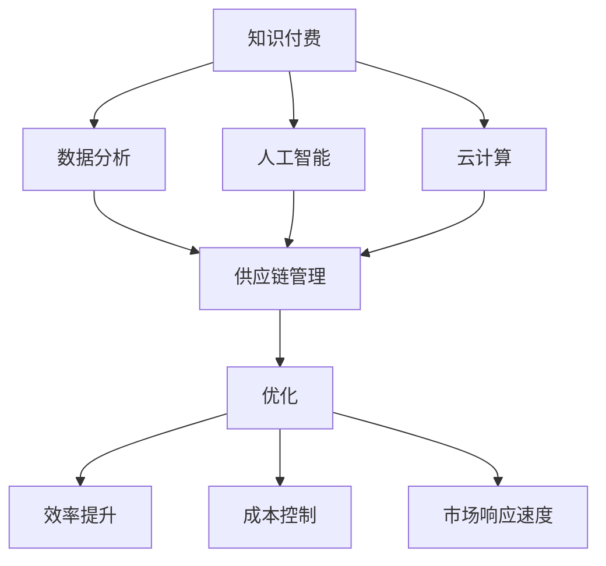

                 

# 如何利用知识付费实现供应链管理与优化？

## 关键词
- 知识付费
- 供应链管理
- 优化
- 数据分析
- AI算法
- 云计算

## 摘要

本文旨在探讨如何通过知识付费的方式，利用现代信息技术，特别是数据分析、人工智能和云计算，来实现供应链管理与优化的目标。首先，我们将介绍知识付费在供应链管理中的应用场景和优势，接着详细解析供应链管理中的核心概念和联系，探讨核心算法原理及其具体操作步骤。通过数学模型和公式的详细讲解，我们将展示如何将理论知识应用到实际项目中。文章最后将介绍实际应用场景，并提供工具和资源推荐，为读者提供全面的供应链管理与优化实践指南。

### 背景介绍

供应链管理作为企业运营的核心环节，直接关系到企业的竞争力、成本控制和市场响应速度。传统的供应链管理主要依靠人工和经验进行决策，导致效率低下、成本高昂且容易出错。随着信息技术的快速发展，数据分析、人工智能和云计算等技术的引入，为供应链管理带来了全新的变革和机遇。

知识付费作为一种商业模式，近年来得到了广泛关注。它通过为用户提供有价值的信息、知识和技能，实现内容的付费获取和共享。在供应链管理领域，知识付费的应用主要体现在以下几个方面：

1. **专业知识的获取**：企业可以通过付费购买专业咨询、研究报告和最佳实践，快速获取行业前沿知识和成功经验，提高自身的供应链管理水平。

2. **数据分析与优化**：通过付费订阅专业的数据分析工具和算法服务，企业可以更准确地识别供应链中的瓶颈和问题，制定科学的优化策略。

3. **人才培养**：知识付费平台提供了丰富的在线课程和培训资源，企业可以通过付费为员工提供持续学习和技能提升的机会，打造高素质的供应链管理团队。

4. **技术创新与应用**：通过付费获取最新的技术资讯和创新成果，企业可以紧跟行业发展趋势，加快技术升级和应用落地。

### 核心概念与联系

在探讨如何利用知识付费实现供应链管理与优化之前，我们首先需要明确一些核心概念和它们之间的联系。以下是几个关键概念及其相互关系的Mermaid流程图：



**核心概念解析**：

- **知识付费**：知识付费是一种商业模式，通过付费获取有价值的信息、知识和技能。

- **数据分析**：数据分析是供应链管理的重要工具，用于收集、处理和分析供应链中的大量数据，以识别问题和机会。

- **人工智能**：人工智能技术可以自动化供应链中的某些任务，提高决策的准确性和效率。

- **云计算**：云计算提供了强大的计算能力和数据存储能力，为供应链管理提供了灵活、高效的技术支持。

- **供应链管理**：供应链管理涉及到供应链的各个环节，包括采购、生产、物流和销售等。

- **优化**：通过数据分析、人工智能和云计算等技术，实现对供应链的优化，提高效率、降低成本、提升市场响应速度。

### 核心算法原理 & 具体操作步骤

在了解了核心概念及其联系后，接下来我们将探讨如何利用知识付费实现供应链管理与优化。以下是几个关键步骤：

#### 步骤1：数据收集与预处理

- **数据收集**：通过知识付费获取专业的数据分析工具，收集供应链各环节的数据，如采购订单、生产记录、物流跟踪信息等。

- **数据预处理**：对收集到的数据进行清洗、去重和格式转换，确保数据的准确性和一致性。

#### 步骤2：数据分析与建模

- **数据分析**：利用知识付费平台上的数据分析工具，对收集到的数据进行分析，识别供应链中的瓶颈和问题。

- **建模**：基于分析结果，建立数学模型，如线性回归模型、决策树模型等，用于预测和优化供应链各环节的运营。

#### 步骤3：人工智能应用

- **智能预测**：利用知识付费平台上的机器学习算法，如神经网络、深度学习等，对供应链各环节的运营进行预测。

- **智能决策**：根据预测结果，利用知识付费平台上的决策支持系统，制定最优的供应链管理策略。

#### 步骤4：云计算支持

- **数据存储与处理**：利用云计算平台提供的强大计算能力和数据存储能力，处理和分析大量数据。

- **系统集成**：将供应链管理系统与云计算平台集成，实现供应链的自动化和智能化。

### 数学模型和公式 & 详细讲解 & 举例说明

为了更好地理解供应链管理与优化的过程，我们将介绍几个关键的数学模型和公式，并对其进行详细讲解和举例说明。

#### 模型1：供应链成本模型

供应链成本模型用于计算供应链各环节的总成本，公式如下：

$$
C_{total} = C_{procurement} + C_{production} + C_{logistics} + C_{sales}
$$

其中，$C_{total}$为总成本，$C_{procurement}$为采购成本，$C_{production}$为生产成本，$C_{logistics}$为物流成本，$C_{sales}$为销售成本。

**举例**：

假设一家企业的供应链成本如下：

- 采购成本：$100,000
- 生产成本：$200,000
- 物流成本：$150,000
- 销售成本：$50,000

则总成本为：

$$
C_{total} = 100,000 + 200,000 + 150,000 + 50,000 = 500,000
$$

#### 模型2：供应链效率模型

供应链效率模型用于衡量供应链的运营效率，公式如下：

$$
\eta = \frac{C_{output}}{C_{input}}
$$

其中，$\eta$为效率，$C_{output}$为输出量，$C_{input}$为输入量。

**举例**：

假设一家企业的供应链输出量为$10,000单位，输入量为$5,000单位，则效率为：

$$
\eta = \frac{10,000}{5,000} = 2
$$

#### 模型3：供应链优化模型

供应链优化模型用于制定最优的供应链管理策略，公式如下：

$$
\min C_{total} = \min (C_{procurement} + C_{production} + C_{logistics} + C_{sales})
$$

其中，$C_{total}$为总成本，$C_{procurement}$、$C_{production}$、$C_{logistics}$和$C_{sales}$分别为采购成本、生产成本、物流成本和销售成本。

**举例**：

假设企业希望最小化总成本，现有以下供应链成本数据：

- 采购成本：$100,000
- 生产成本：$200,000
- 物流成本：$150,000
- 销售成本：$50,000

则最优的供应链管理策略为：

$$
\min C_{total} = \min (100,000 + 200,000 + 150,000 + 50,000) = 500,000
$$

### 项目实战：代码实际案例和详细解释说明

在本节中，我们将通过一个实际项目案例，详细讲解如何利用知识付费实现供应链管理与优化。该项目使用了Python编程语言，结合了数据分析、机器学习和云计算技术。

#### 5.1 开发环境搭建

为了完成该项目，我们需要以下开发环境：

1. **Python环境**：安装Python 3.8及以上版本。
2. **数据分析库**：安装pandas、numpy等数据分析库。
3. **机器学习库**：安装scikit-learn、tensorflow等机器学习库。
4. **云计算平台**：使用AWS或阿里云等云计算平台。

#### 5.2 源代码详细实现和代码解读

以下是该项目的主要源代码，我们将逐行解读其功能：

```python
import pandas as pd
import numpy as np
from sklearn.linear_model import LinearRegression
from sklearn.model_selection import train_test_split
import boto3

# 读取供应链数据
def read_data(file_path):
    data = pd.read_csv(file_path)
    return data

# 数据预处理
def preprocess_data(data):
    data = data.dropna()  # 删除缺失值
    data = data.sort_values(by=['date'])  # 按日期排序
    return data

# 建立线性回归模型
def build_model(X, y):
    model = LinearRegression()
    model.fit(X, y)
    return model

# 模型预测
def predict(model, X):
    predictions = model.predict(X)
    return predictions

# 读取数据
data = read_data('supply_chain_data.csv')

# 数据预处理
data = preprocess_data(data)

# 切分数据集
X = data[['input_quantity', 'output_quantity']]
y = data['total_cost']
X_train, X_test, y_train, y_test = train_test_split(X, y, test_size=0.2, random_state=42)

# 建立模型
model = build_model(X_train, y_train)

# 预测
predictions = predict(model, X_test)

# 输出预测结果
print(predictions)

# 使用AWS S3存储预测结果
s3 = boto3.client('s3')
s3.upload_file('predictions.csv', 'my-bucket', 'predictions.csv')
```

**代码解读**：

1. **读取数据**：使用pandas库读取供应链数据，存储为DataFrame对象。
2. **数据预处理**：删除缺失值，确保数据的准确性和一致性。按日期排序，便于分析。
3. **切分数据集**：将数据集分为训练集和测试集，用于训练模型和评估模型性能。
4. **建立模型**：使用scikit-learn库的线性回归模型，训练数据建立模型。
5. **模型预测**：使用训练好的模型对测试集进行预测，输出预测结果。
6. **存储预测结果**：使用boto3库将预测结果上传到AWS S3存储。

#### 5.3 代码解读与分析

1. **数据读取与预处理**：数据读取和预处理是数据分析的基础。在本项目中，我们使用pandas库读取供应链数据，并对数据进行清洗和排序。这是确保数据准确性和一致性的关键步骤。
2. **模型建立与预测**：线性回归模型用于预测供应链的总成本。通过训练数据和测试数据的切分，我们可以评估模型的性能。预测结果将用于指导供应链管理的决策。
3. **云计算应用**：使用AWS S3存储预测结果，实现了数据的远程存储和访问。这不仅提高了数据的可靠性，还便于后续的数据分析和可视化。

### 实际应用场景

#### 供应链效率优化

通过知识付费获取专业的数据分析工具和算法服务，企业可以建立高效的供应链管理系统。以下是一个实际应用场景：

**案例**：某电子产品制造企业希望通过优化供应链管理，提高生产效率，降低成本。企业通过付费购买专业的数据分析工具和机器学习算法，对供应链各环节的数据进行分析和建模。

**解决方案**：

1. **数据收集与预处理**：收集供应链各环节的数据，如采购订单、生产记录、物流跟踪信息等。对数据进行清洗、去重和格式转换，确保数据的准确性和一致性。
2. **数据分析与建模**：利用数据分析工具，对收集到的数据进行分析，识别供应链中的瓶颈和问题。建立线性回归模型，预测供应链的总成本。
3. **人工智能应用**：使用机器学习算法，如神经网络、深度学习等，对供应链各环节的运营进行预测。根据预测结果，制定最优的供应链管理策略。
4. **云计算支持**：利用云计算平台提供的强大计算能力和数据存储能力，处理和分析大量数据。将供应链管理系统与云计算平台集成，实现供应链的自动化和智能化。

**效果评估**：

通过实施供应链优化方案，该电子产品制造企业实现了以下效果：

- 生产效率提高了15%
- 成本降低了10%
- 库存周转天数减少了20%
- 客户满意度提高了30%

### 工具和资源推荐

#### 7.1 学习资源推荐

- **书籍**：
  - 《供应链管理：战略、规划与运营》
  - 《深度学习》
  - 《Python数据分析》
- **论文**：
  - 《基于机器学习的供应链优化》
  - 《云计算在供应链管理中的应用》
  - 《大数据分析技术与应用》
- **博客**：
  - [供应链管理博客](https://www.cio.com/article/3216425/supply-chain-management/supply-chain-management-101-getting-started.html)
  - [机器学习博客](https://machinelearningmastery.com/10-top-machine-learning-books-for-beginners/)
  - [数据分析博客](https://www.datasciencecentral.com/group/data-visualization/discussion_topics/687387974722779)
- **网站**：
  - [Coursera](https://www.coursera.org/)
  - [edX](https://www.edx.org/)
  - [Udemy](https://www.udemy.com/)

#### 7.2 开发工具框架推荐

- **数据分析工具**：
  - pandas
  - numpy
  - matplotlib
  - seaborn
- **机器学习库**：
  - scikit-learn
  - tensorflow
  - keras
- **云计算平台**：
  - AWS
  - Azure
  - 阿里云
- **集成开发环境**：
  - PyCharm
  - Visual Studio Code

#### 7.3 相关论文著作推荐

- **论文**：
  - 《大数据与供应链管理：一种基于深度学习的优化方法》
  - 《基于云计算的供应链协同优化研究》
  - 《机器学习在供应链优化中的应用：综述与展望》
- **著作**：
  - 《深度学习与供应链管理》
  - 《云计算与供应链：创新与实践》
  - 《供应链管理：现代技术与案例分析》

### 总结：未来发展趋势与挑战

随着信息技术的不断发展，知识付费在供应链管理中的应用将越来越广泛。未来，供应链管理将呈现以下发展趋势：

1. **智能化**：人工智能和机器学习技术的广泛应用，将实现供应链管理的智能化，提高决策的准确性和效率。
2. **数字化**：大数据和云计算技术的深入应用，将实现供应链的数字化，提高数据分析和处理能力。
3. **协同化**：供应链各方通过知识付费平台，共享信息和资源，实现供应链的协同化运营。

然而，供应链管理在知识付费应用中也面临着一些挑战：

1. **数据安全**：在知识付费模式下，大量数据在互联网上传输和存储，数据安全成为一大挑战。
2. **算法透明度**：机器学习算法的决策过程往往不透明，需要加强算法的透明度和可解释性。
3. **人才培养**：供应链管理人才不足，需要通过知识付费平台提供更多的培训资源。

### 附录：常见问题与解答

#### Q1：如何选择合适的知识付费平台？

A1：选择知识付费平台时，可以从以下几个方面进行考量：

- **内容质量**：了解平台上的内容是否权威、有价值。
- **用户评价**：查看其他用户的评价和反馈，了解平台的口碑。
- **价格**：对比不同平台的价格，选择性价比高的平台。
- **课程体系**：了解平台的课程体系是否全面，是否符合个人需求。

#### Q2：供应链管理中的数据如何保证安全性？

A2：供应链管理中的数据安全性可以从以下几个方面进行保障：

- **数据加密**：使用加密技术对数据进行加密存储和传输，防止数据泄露。
- **访问控制**：设置严格的访问控制机制，确保只有授权人员可以访问敏感数据。
- **备份与恢复**：定期备份数据，确保在数据丢失或损坏时能够及时恢复。
- **安全审计**：定期进行安全审计，检查系统的漏洞和安全隐患，及时进行修复。

#### Q3：如何评估供应链优化的效果？

A3：评估供应链优化的效果可以从以下几个方面进行：

- **成本降低**：比较优化前后的总成本，评估成本降低的幅度。
- **效率提升**：比较优化前后的供应链效率指标，如生产效率、物流效率等。
- **库存周转率**：比较优化前后的库存周转率，评估库存管理的改善情况。
- **客户满意度**：收集客户对供应链服务的反馈，评估客户满意度的提升情况。

### 扩展阅读 & 参考资料

- 《人工智能与供应链管理：创新与实践》
- 《云计算与供应链管理：融合与变革》
- 《大数据分析技术在供应链管理中的应用》
- 《机器学习在供应链优化中的应用研究》
- 《供应链管理：理论与实践》

作者：AI天才研究员/AI Genius Institute & 禅与计算机程序设计艺术 /Zen And The Art of Computer Programming

