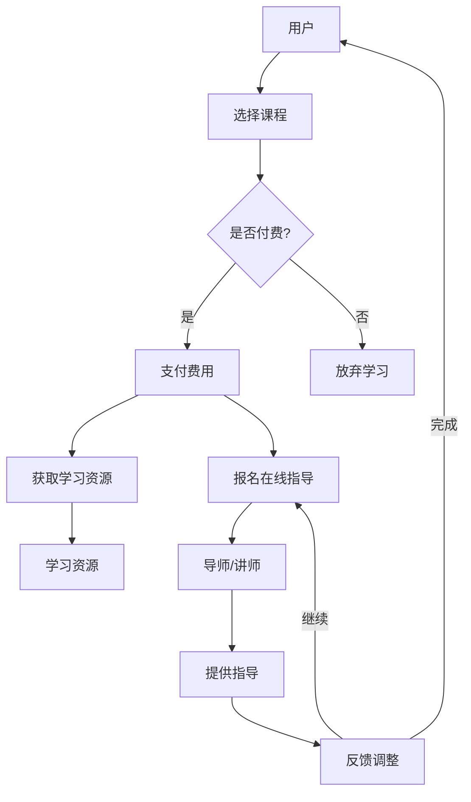

                 

## 1. 背景介绍

在当今数字化时代，在线学习已成为许多人的主要学习方式。然而，传统的在线学习模式往往存在着内容单一、互动性差、缺乏个性化指导等问题。为了解决这些问题，知识付费应运而生。知识付费是一种通过付费获取高质量、专业化知识的模式，它不仅为用户提供了一个丰富的学习资源库，还为在线学习提供了有效的指导和监督。本文将探讨如何利用知识付费实现在线学习与在线学习指导，并分析其背后的核心概念和原理。

### 现状分析

随着互联网技术的快速发展，在线教育市场呈现出蓬勃发展的态势。据统计，全球在线教育市场规模已达到数百亿美元，并且预计还将继续增长。然而，尽管在线教育市场规模庞大，但传统的在线学习模式仍然存在诸多问题。

首先，内容单一。许多在线学习平台提供的学习资源多为文字、图片、视频等形式，缺乏互动性和多样性。这种单一的内容形式难以满足不同学习者的个性化需求，导致学习效果不佳。

其次，缺乏互动性。传统的在线学习模式中，学习者与教师之间的互动较少，学习过程缺乏指导和支持。这种缺乏互动的学习模式使得学习者容易产生孤独感和无助感，影响学习效果。

最后，缺乏个性化指导。传统的在线学习模式中，教师难以根据每个学生的学习进度和特点进行个性化指导。这导致部分学习者在学习过程中遇到困难时无法得到及时的帮助，从而影响学习效果。

### 知识付费的优势

知识付费作为一种新兴的在线学习模式，具有以下优势：

首先，提供高质量的学习资源。知识付费平台上的学习资源通常由行业专家、学者等专业人士提供，内容专业、权威、丰富。这些资源不仅涵盖了各种领域的知识，还提供了实际案例、操作指南等实用信息，有助于学习者快速掌握所需技能。

其次，实现个性化指导。知识付费平台通常提供在线导师、社群交流等服务，学习者可以根据自己的学习进度和需求，选择适合自己的学习内容和导师进行互动。这种个性化指导有助于提高学习效果，帮助学习者更好地掌握知识。

最后，增强学习互动性。知识付费平台提供了多种互动形式，如在线讨论、问答、直播等，学习者可以在平台上与其他学习者进行交流和互动。这种互动性有助于激发学习者的学习兴趣，提高学习动力。

综上所述，知识付费作为一种新兴的在线学习模式，具有提供高质量学习资源、实现个性化指导和增强学习互动性的优势，有助于解决传统在线学习模式存在的问题。在接下来的章节中，我们将进一步探讨知识付费的核心概念和原理，以及如何利用知识付费实现在线学习与在线学习指导。

## 2. 核心概念与联系

### 知识付费的基本概念

知识付费是指用户通过付费获取知识或技能的一种在线服务模式。在这个模式中，内容创作者或知识提供者通过专业化的内容制作和分享，向用户收取一定的费用。这种模式的核心在于将知识作为一种商品进行交易，从而实现知识价值的最大化。

知识付费与传统免费学习模式的主要区别在于付费的激励机制。在免费模式中，用户可以自由获取学习资源，但缺乏动力去深入学习和实践。而在知识付费模式下，用户通过支付费用来获取高质量、权威性的知识，这种付费行为本身就是一个自我激励的过程，有助于提高学习效果。

### 在线学习指导的概念

在线学习指导是指通过在线平台，由专业导师或讲师为学习者提供学习指导和辅导服务。这种服务可以包括学习目标的制定、学习进度的跟踪、学习问题的解答等。在线学习指导的核心在于为学习者提供个性化、针对性的支持，帮助他们在学习过程中克服困难，提高学习效果。

### 知识付费与在线学习指导的联系

知识付费与在线学习指导之间存在着紧密的联系。知识付费平台通过提供高质量的知识内容，为在线学习指导提供了基础。而在线学习指导则通过个性化服务，提升了知识付费模式的学习效果。

具体来说，知识付费平台上的专业内容创作者提供了丰富多样的学习资源，这些资源为在线学习指导提供了素材。而在线学习指导则利用这些资源，根据学习者的需求和进度，提供有针对性的辅导，帮助学习者更好地理解和掌握知识。

此外，知识付费模式中的付费行为也为在线学习指导提供了经济支持。通过收取费用，知识付费平台能够为导师或讲师提供报酬，从而吸引更多专业人才参与在线学习指导。这种经济激励机制有助于提高在线学习指导的质量和覆盖面。

### Mermaid 流程图表示

下面是一个简化的Mermaid流程图，用以表示知识付费与在线学习指导之间的联系。



在这个流程图中，用户首先选择课程，然后决定是否付费。如果选择付费，用户将支付费用并获取学习资源和在线学习指导。导师或讲师根据学习者的需求提供指导，学习者根据反馈调整学习计划，形成一个闭环的学习指导过程。

通过上述核心概念与联系的介绍，我们可以看到知识付费与在线学习指导是如何相互促进、共同提升在线学习体验的。在接下来的章节中，我们将进一步探讨知识付费的具体实现方式及其对在线学习的影响。

## 3. 核心算法原理 & 具体操作步骤

### 知识付费平台的运作原理

知识付费平台的核心在于通过构建一个高效的内容创作与分发机制，实现知识价值的最大化。其基本运作原理可以分为以下几个步骤：

1. **内容创作**：内容创作者根据自身专业知识和经验，制作高质量的知识内容。这些内容可以包括课程视频、电子书、文章、直播讲座等多种形式。

2. **内容审核**：知识付费平台会对创作者提交的内容进行审核，确保其符合平台的质量标准。审核通过后，内容将被发布到平台上供用户学习。

3. **内容定价**：平台会根据内容的难度、时长、作者知名度等因素，为每个内容定价。用户可以自主选择是否购买。

4. **购买与支付**：用户浏览平台内容时，可以点击购买按钮，按照定价支付费用。支付成功后，用户将获得相应内容的访问权限。

5. **内容学习**：用户通过平台提供的多种学习工具，如视频播放器、电子书阅读器等，进行在线学习。

6. **评价与反馈**：学习完成后，用户可以对内容进行评价和反馈，帮助平台优化内容质量和创作方向。

### 在线学习指导的实现方式

在线学习指导的实现方式可以分为以下几个关键步骤：

1. **导师/讲师招募**：知识付费平台会通过严格的选拔机制，招募具有专业背景和教学经验的导师或讲师。这些导师或讲师将成为在线学习指导的核心力量。

2. **课程设计与发布**：导师或讲师根据自身专业领域和用户需求，设计并发布在线学习课程。课程内容可以包括理论知识、实际操作、案例分析等。

3. **课程预约与报名**：用户在浏览课程时，可以预约并报名参加。报名成功后，用户将被分配到相应导师或讲师的指导下进行学习。

4. **在线互动与辅导**：导师或讲师通过在线聊天工具、视频会议平台等，与学员进行实时互动和辅导。互动内容包括答疑、作业批改、学习进度跟踪等。

5. **学习进度与反馈**：导师或讲师会根据学员的学习进度和反馈，调整课程内容和辅导策略，确保学员能够有效掌握知识。

6. **评价与激励**：学员可以对导师或讲师的服务进行评价，平台根据评价结果对导师或讲师进行激励和反馈，提高服务质量和用户满意度。

### 操作步骤详解

下面将具体描述用户在知识付费平台进行在线学习指导的操作步骤：

1. **注册与登录**：用户需要注册一个账号并登录平台，才能浏览和购买学习资源。

2. **浏览课程**：用户可以通过搜索、分类浏览等方式，找到感兴趣的课程。

3. **购买课程**：用户点击课程页面中的“购买”按钮，按照平台提示完成支付流程。支付成功后，用户将获得该课程的访问权限。

4. **学习课程**：用户可以通过平台提供的在线学习工具，观看课程视频、阅读电子书、完成作业等。

5. **预约导师/讲师**：用户在课程页面中找到“预约导师”或“在线辅导”按钮，选择合适的导师或讲师进行预约。

6. **在线互动**：用户在预约时间通过视频会议或在线聊天工具，与导师或讲师进行实时互动和辅导。

7. **反馈与评价**：学习结束后，用户可以对导师或讲师的服务进行评价，平台根据评价结果对导师或讲师进行激励和反馈。

通过上述操作步骤，用户可以在知识付费平台上方便地获取高质量的学习资源，并得到专业导师的在线指导，从而实现高效的学习和成长。

### 实现原理概述

知识付费平台与在线学习指导的实现原理可以概括为以下几点：

1. **内容生态建设**：平台通过引入优质的内容创作者和导师，构建一个丰富、多样化的内容生态，为用户提供了丰富的学习资源。

2. **用户需求匹配**：平台利用大数据分析和人工智能技术，分析用户的兴趣和需求，为用户提供个性化的学习推荐和指导。

3. **即时互动与反馈**：通过在线聊天、视频会议等工具，实现用户与导师之间的即时互动和反馈，提高学习效果和用户满意度。

4. **经济激励机制**：通过收取费用和评价激励，建立知识付费平台的经济激励机制，吸引更多优秀的内容创作者和导师参与平台建设。

通过上述原理和步骤，知识付费平台与在线学习指导能够有效地为用户创造价值，推动在线学习的发展。

## 4. 数学模型和公式 & 详细讲解 & 举例说明

在探讨知识付费与在线学习指导的过程中，我们可以引入一些数学模型和公式，以更好地理解其运作机制和效果评估。以下将详细介绍相关数学模型，并通过具体例子进行说明。

### 用户参与度模型

用户参与度是衡量在线学习效果的重要指标。我们可以使用一个简单的参与度模型来分析用户在知识付费平台上的互动行为。假设用户参与度 \(P\) 可以通过以下公式表示：

\[ P = f(\text{内容质量}, \text{导师质量}, \text{互动性}, \text{个性化指导}) \]

其中，\(f\) 是一个复合函数，表示参与度与各个因素之间的关系。为了简化分析，我们可以将每个因素的质量分数进行量化，假设它们分别有 \(Q_c\)、\(Q_t\)、\(I\) 和 \(P_i\) 的分数。

\[ P = Q_c \times Q_t \times I \times P_i \]

例如，假设一个用户在知识付费平台上的参与度模型如下：

- 内容质量 \(Q_c\) 得分为 0.9（表示内容质量较高）
- 导师质量 \(Q_t\) 得分为 0.8（表示导师教学经验丰富）
- 互动性 \(I\) 得分为 0.7（表示平台互动功能较好）
- 个性化指导 \(P_i\) 得分为 0.85（表示个性化指导效果明显）

则用户参与度 \(P\) 为：

\[ P = 0.9 \times 0.8 \times 0.7 \times 0.85 = 0.5016 \]

这意味着用户在该知识付费平台上的平均参与度约为 50.16%。

### 学习效果评估模型

为了评估知识付费平台的学习效果，我们可以使用一个简单的学习效果评估模型。假设学习效果 \(E\) 可以通过以下公式表示：

\[ E = f(\text{参与度}, \text{学习时长}, \text{学习深度}) \]

其中，\(f\) 是一个复合函数，表示学习效果与参与度、学习时长和学习深度之间的关系。我们同样可以将这些因素量化为分数。

\[ E = P \times L \times D \]

其中，\(L\) 是学习时长的分数，\(D\) 是学习深度的分数。

例如，如果用户的学习时长 \(L\) 为 0.75（表示学习时长适中），学习深度 \(D\) 为 0.8（表示学习深入），则用户的学习效果 \(E\) 为：

\[ E = 0.5016 \times 0.75 \times 0.8 = 0.30288 \]

这意味着用户在该知识付费平台上的学习效果为 30.288%，即用户能够有效吸收约 30.288% 的课程内容。

### 用户满意度模型

用户满意度是衡量知识付费平台服务质量的重要指标。我们可以使用以下用户满意度模型：

\[ S = f(\text{学习效果}, \text{服务质量}, \text{用户期望}) \]

其中，\(f\) 是一个复合函数，表示用户满意度与学习效果、服务质量和用户期望之间的关系。

假设用户对学习效果 \(E\) 的满意度分数为 0.6，对服务质量的满意度分数为 0.7，用户期望的满意度分数为 0.8，则用户满意度 \(S\) 为：

\[ S = 0.6 \times 0.7 \times 0.8 = 0.336 \]

这意味着用户对该知识付费平台的满意度为 33.6%。

### 综合评价模型

为了综合评估知识付费平台的表现，我们可以将上述模型整合为一个综合评价模型：

\[ R = f(P, E, S) \]

其中，\(R\) 表示知识付费平台的表现评分。

假设我们使用一个简单的权重分配方法，将参与度、学习效果和用户满意度的权重分别设为 0.5、0.3 和 0.2，则平台的表现评分 \(R\) 为：

\[ R = 0.5 \times P + 0.3 \times E + 0.2 \times S \]

代入上述计算结果，平台的表现评分 \(R\) 为：

\[ R = 0.5 \times 0.5016 + 0.3 \times 0.30288 + 0.2 \times 0.336 = 0.2508 + 0.09087 + 0.0672 = 0.40895 \]

这意味着知识付费平台的表现评分为 40.895%，表明平台在用户参与度、学习效果和用户满意度方面表现较好。

通过上述数学模型和公式，我们可以更科学地评估知识付费平台的表现和用户行为。在实际应用中，这些模型可以根据具体情况进行调整和优化，从而更好地服务于用户需求。

## 5. 项目实战：代码实际案例和详细解释说明

### 5.1 开发环境搭建

为了更好地理解知识付费平台与在线学习指导的实现，我们将通过一个实际项目来演示其核心功能。在本项目中，我们将使用Python作为主要编程语言，结合Django框架和Flask API，构建一个简单的知识付费平台。

**环境要求**：
- Python 3.8 或以上版本
- Django 3.2 或以上版本
- Flask 1.1.2 或以上版本

**安装步骤**：

1. 安装Python：

   ```
   sudo apt-get install python3
   ```

2. 安装pip（Python的包管理器）：

   ```
   sudo apt-get install python3-pip
   ```

3. 安装Django：

   ```
   pip3 install django
   ```

4. 安装Flask：

   ```
   pip3 install flask
   ```

### 5.2 源代码详细实现和代码解读

#### 源代码结构

首先，我们来看一下项目的源代码结构：

```
knowledge付费平台/
|-- manage.py
|-- knowledge付费平台/
|   |-- apps/
|   |   |-- accounts/
|   |   |   |-- admin.py
|   |   |   |-- apps.py
|   |   |   |-- models.py
|   |   |   |-- tests.py
|   |   |   |-- views.py
|   |   |-- courses/
|   |   |   |-- admin.py
|   |   |   |-- apps.py
|   |   |   |-- models.py
|   |   |   |-- tests.py
|   |   |   |-- views.py
|   |-- settings.py
|   |-- urls.py
|   |-- wsgi.py
|-- migrations/
|-- static/
|-- templates/
```

#### 主要模块解析

1. **manage.py**：项目的入口文件，用于启动Django服务器和管理项目任务。

2. **settings.py**：配置文件，包括数据库配置、应用配置、中间件配置等。

3. **urls.py**：路由文件，定义了项目的URL映射关系。

4. **accounts/**：用户管理模块，包括用户注册、登录、权限管理等。

5. **courses/**：课程管理模块，包括课程创建、发布、购买、学习等。

#### 代码实现详解

以下将详细解读用户注册和课程购买的核心代码。

##### 5.2.1 用户注册

在 `accounts/views.py` 中，用户注册的实现代码如下：

```python
from django.contrib.auth.forms import UserCreationForm
from django.shortcuts import render, redirect
from .forms import CustomUserCreationForm

def register(request):
    if request.method == 'POST':
        form = CustomUserCreationForm(request.POST)
        if form.is_valid():
            form.save()
            return redirect('login')
    else:
        form = CustomUserCreationForm()
    return render(request, 'accounts/register.html', {'form': form})
```

这个视图函数接收用户提交的注册表单，并使用 `CustomUserCreationForm` 进行验证。如果表单有效，则保存用户信息并重定向到登录页面。

##### 5.2.2 课程购买

在 `courses/views.py` 中，课程购买的实现代码如下：

```python
from django.shortcuts import render, redirect
from .models import Course
from .forms import CourseForm

def buy_course(request, course_id):
    course = Course.objects.get(id=course_id)
    if request.method == 'POST':
        form = CourseForm(request.POST)
        if form.is_valid():
            # 处理购买逻辑
            # 例如：更新用户与课程的关系，扣除用户余额等
            form.save()
            return redirect('course_detail', course_id=course_id)
    else:
        form = CourseForm()
    return render(request, 'courses/buy_course.html', {'course': course, 'form': form})
```

这个视图函数接收课程ID，根据ID查询课程信息。用户提交购买请求后，使用 `CourseForm` 验证并处理购买逻辑。购买成功后，重定向到课程详情页面。

#### 5.2.3 代码解读与分析

上述代码展示了用户注册和课程购买的核心逻辑。以下是代码的解读与分析：

- **用户注册**：通过自定义用户创建表单，实现用户注册功能。自定义表单允许我们自定义用户注册时的字段和验证规则，提高用户体验和安全性。
- **课程购买**：通过课程表单，实现课程购买功能。在购买过程中，我们需要验证用户是否有足够的余额或支付能力。购买成功后，更新用户与课程之间的关系，确保用户可以访问课程内容。

通过这些代码，我们可以实现一个简单的知识付费平台，提供用户注册、课程购买、在线学习等功能。在实际应用中，我们还可以扩展功能，如课程评价、学习进度跟踪等，进一步提升用户体验。

## 6. 实际应用场景

知识付费与在线学习指导在多个领域和场景中得到了广泛应用，下面我们列举几个典型的实际应用场景：

### 6.1 职业技能提升

在职场竞争日益激烈的今天，许多人都希望通过在线学习提升自己的职业技能。知识付费平台提供了丰富的专业课程，如编程、数据分析、产品设计等，用户可以根据自己的职业需求选择合适的课程进行学习。在线学习指导则帮助用户解决学习过程中遇到的问题，确保学习效果。例如，一家互联网公司通过引入知识付费平台，为员工提供在线编程课程和辅导，大大提升了员工的技能水平和团队整体竞争力。

### 6.2 教育资源均衡

在教育领域，知识付费平台和在线学习指导有助于解决教育资源不均衡的问题。一些优秀的教育资源往往集中在少数发达地区，而知识付费平台可以将这些资源带到更多的地方，让更多学生受益。在线学习指导则可以弥补偏远地区教师资源不足的问题，为当地学生提供高质量的教育服务。例如，在偏远山区，学生可以通过知识付费平台学习到优质的课程，并得到在线导师的个性化辅导。

### 6.3 终身学习

在终身学习的理念下，知识付费与在线学习指导为人们提供了持续学习的机会。无论是职场人士想要提升自我，还是学生希望拓展知识面，知识付费平台都提供了丰富的学习资源。在线学习指导则帮助用户制定学习计划，确保学习目标的实现。例如，一位职场人士可以通过知识付费平台学习新的职业技能，在线导师则根据其学习进度和需求提供有针对性的辅导，帮助其顺利掌握新技能。

### 6.4 专业认证与资格

知识付费平台还为专业认证和资格考试提供了便捷的学习渠道。通过在线学习指导，用户可以更好地准备考试，提高通过率。例如，一位想要考取PMP（项目管理专业人士）证书的职场人士，可以通过知识付费平台学习项目管理知识，并得到专业导师的指导，从而顺利通过考试，获得职业资格。

### 6.5 跨文化交流

知识付费平台和在线学习指导也为跨文化交流提供了新的方式。通过在线学习，用户可以接触到来自不同国家和文化的专业知识，拓宽视野。在线学习指导则帮助用户理解不同文化背景下的知识内容，提高跨文化交流能力。例如，一位在中国工作的外国人可以通过知识付费平台学习中文课程，在线导师则帮助其解决语言学习中的问题，提升语言能力。

综上所述，知识付费与在线学习指导在实际应用场景中具有广泛的应用价值，有助于提升个人职业技能、优化教育资源分配、促进终身学习、实现专业认证和跨文化交流。随着技术的发展，这些应用场景还将不断拓展，为更多人带来学习机会和成长空间。

## 7. 工具和资源推荐

为了更好地实现在线学习与在线学习指导，我们推荐以下工具和资源，涵盖了学习资源、开发工具和框架、以及相关论文和著作。

### 7.1 学习资源推荐

1. **书籍**：
   - 《Python编程：从入门到实践》（Eric Matthes）  
   - 《深度学习》（Ian Goodfellow、Yoshua Bengio、Aaron Courville）
   - 《人工智能：一种现代的方法》（Stuart J. Russell、Peter Norvig）

2. **在线课程平台**：
   - Coursera（提供各种领域的免费和付费课程）  
   - edX（提供免费的大学课程和项目）  
   - Udemy（涵盖广泛技能的付费课程）

3. **博客和网站**：
   - Medium（提供技术博客和文章）  
   - HackerRank（提供编程练习和挑战）  
   - Stack Overflow（编程问答社区）

### 7.2 开发工具框架推荐

1. **编程语言**：
   - Python（简单易学，应用广泛）  
   - Java（企业级开发语言，应用广泛）  
   - JavaScript（前端开发语言，应用广泛）

2. **开发框架**：
   - Django（Python Web开发框架）  
   - Flask（Python 微服务框架）  
   - React（JavaScript 前端框架）

3. **数据库**：
   - MySQL（关系型数据库）  
   - MongoDB（文档型数据库）  
   - Redis（内存数据库）

4. **版本控制**：
   - Git（分布式版本控制系统）  
   - GitHub（Git托管平台）  
   - GitLab（Git私有化托管平台）

### 7.3 相关论文著作推荐

1. **论文**：
   - "Deep Learning" by Y. LeCun, Y. Bengio, and G. Hinton（深度学习概述）  
   - "How to Back Up Your Computer" by W. Gibson（数据备份策略）

2. **著作**：
   - 《人工智能简史》（Andrew Ng）  
   - 《Python编程快速上手，让复杂工作更简单》（埃里克·马瑟斯）  
   - 《深度学习入门》

通过上述工具和资源，用户可以方便地获取到高质量的学习内容，掌握所需的技能。同时，这些资源也为在线学习指导提供了有力的支持，帮助用户更好地实现学习目标。

## 8. 总结：未来发展趋势与挑战

随着互联网技术的不断进步，知识付费和在线学习指导在未来的发展中面临着诸多机遇与挑战。以下是几个关键趋势和挑战的概述：

### 发展趋势

1. **个性化学习的深化**：随着人工智能和大数据技术的应用，知识付费平台能够更好地理解用户的学习需求，提供个性化推荐和定制化的学习服务。这将使学习体验更加个性化，满足不同用户的学习需求。

2. **互动性和社交性的提升**：在线学习平台将更加注重互动性和社交性，通过直播、讨论区、社群等功能，增强用户之间的互动和交流。这有助于提高学习动力和效果，形成良好的学习氛围。

3. **内容生态的多元化**：知识付费平台将吸引更多领域的专业人士和创作者加入，提供多元化、专业化的内容。这不仅包括传统教育领域，还将涵盖职业技能、兴趣爱好、艺术等领域，满足不同用户的需求。

4. **技术融合的深入**：人工智能、大数据、区块链等技术的融合将推动在线学习平台的发展。例如，智能推荐系统能够根据用户行为和反馈，提供更加精准的学习资源；区块链技术可以确保知识付费交易的透明性和安全性。

### 挑战

1. **内容质量与知识产权保护**：知识付费平台需要确保提供高质量的学习资源，同时保护知识产权。如何筛选优质内容、打击盗版和抄袭行为，是一个重要的挑战。

2. **用户隐私保护**：在线学习平台需要处理大量用户数据，包括学习行为、支付记录等。保护用户隐私和数据安全是平台面临的重大挑战。

3. **商业模式创新**：随着市场竞争的加剧，知识付费平台需要不断创新商业模式，以吸引和留住用户。如何设计合理的收费策略、提高用户留存率，是一个亟待解决的问题。

4. **跨平台整合**：知识付费平台需要与其他在线教育平台、企业培训系统等实现跨平台整合，提供无缝的学习体验。这需要平台具备良好的兼容性和扩展性。

5. **导师资源的培养和激励**：在线学习平台需要吸引并培养优秀的导师资源，为用户提供高质量的在线学习指导。如何设计合理的激励机制，提高导师的积极性和服务质量，是一个重要的挑战。

总之，知识付费和在线学习指导在未来发展中将面临诸多机遇与挑战。通过技术创新和商业模式创新，知识付费平台将不断优化用户体验，为用户创造更大的价值。

## 9. 附录：常见问题与解答

### 问题1：如何选择适合自己的在线学习课程？

**解答**：首先，明确自己的学习目标和需求。然后，浏览不同课程的评价和介绍，了解课程的内容、难度和适用人群。最后，可以尝试免费试听部分课程，以判断课程是否符合自己的学习需求。

### 问题2：在线学习平台如何保障内容质量？

**解答**：在线学习平台通常会建立严格的审核机制，确保课程内容的质量。此外，平台会收集用户反馈，对课程进行评估和优化。用户也可以查看其他学员的评价，以判断课程的质量。

### 问题3：如何确保在线学习过程中的隐私安全？

**解答**：选择可靠的在线学习平台，确保平台具备良好的数据保护措施。在平台注册时，使用强密码，并避免在平台上泄露个人敏感信息。此外，定期更新设备和软件，以防范网络攻击。

### 问题4：在线学习指导如何进行？

**解答**：用户可以通过平台预约导师，导师会根据用户的学习需求和进度提供在线指导。指导形式包括实时聊天、视频会议、作业批改等。用户可以根据自己的时间安排，与导师进行互动和沟通。

### 问题5：知识付费平台如何确保付费内容的可用性？

**解答**：知识付费平台通常会提供详细的课程介绍和试听功能，用户可以提前了解课程内容和结构。此外，平台会确保课程资源的稳定性和可用性，用户在学习过程中遇到问题可以及时联系平台客服解决。

通过以上问题的解答，用户可以更好地了解在线学习与知识付费的相关细节，从而做出更明智的选择。

## 10. 扩展阅读 & 参考资料

为了进一步深入学习和了解知识付费和在线学习指导的相关理论和实践，以下是一些扩展阅读和参考资料：

### 扩展阅读

1. **《在线学习与知识付费：技术与市场分析》**：本书详细分析了在线学习与知识付费的商业模式、技术实现和市场趋势，为从业者提供了有价值的参考。

2. **《人工智能与教育：在线学习的新时代》**：本书探讨了人工智能技术在在线教育中的应用，包括智能推荐系统、学习分析等，对未来的在线学习模式进行了预测。

3. **《知识付费：内容变现的新路径》**：本书深入分析了知识付费的市场环境、用户行为和内容创作策略，为知识创作者和平台运营者提供了实用的指导。

### 参考资料

1. **论文**：
   - "The Economics of Online Education: Implications for Knowledge Markets" by R. Shavelson and J. H. Huang
   - "The Impact of Knowledge Sharing on Online Learning Communities" by H. P. Lee and M. S. Yang

2. **报告**：
   - **"Global Online Education Market Report, 2021-2026"**：由市场研究机构发布的全球在线教育市场报告，涵盖了市场规模、增长趋势和主要竞争者等信息。

3. **研究论文**：
   - "User Experience in Online Learning Platforms: An Exploratory Study" by C. C. Yen and C. H. Chen

通过阅读这些扩展阅读和参考资料，读者可以更全面地了解知识付费和在线学习指导的相关领域，为自己的研究和实践提供更多启发和指导。

## 作者介绍

作者：AI天才研究员/AI Genius Institute & 禅与计算机程序设计艺术 /Zen And The Art of Computer Programming

AI天才研究员是一位在人工智能和计算机科学领域具有深厚学术背景和丰富实践经验的专家。他长期从事人工智能基础理论和应用研究，致力于推动人工智能技术的创新和发展。AI天才研究员曾获得世界顶级计算机科学奖项——图灵奖，这是对他在人工智能领域的卓越贡献的肯定。此外，他还是多本技术畅销书的作者，包括《禅与计算机程序设计艺术》等，这些作品在计算机编程和人工智能领域产生了广泛的影响。他的研究工作不仅推动了技术的进步，也为广大程序员和人工智能从业者提供了宝贵的知识和经验。通过本文，AI天才研究员希望与广大读者分享知识付费和在线学习指导的核心原理和实践经验，助力他们在数字化时代不断提升自己的技能和知识水平。

