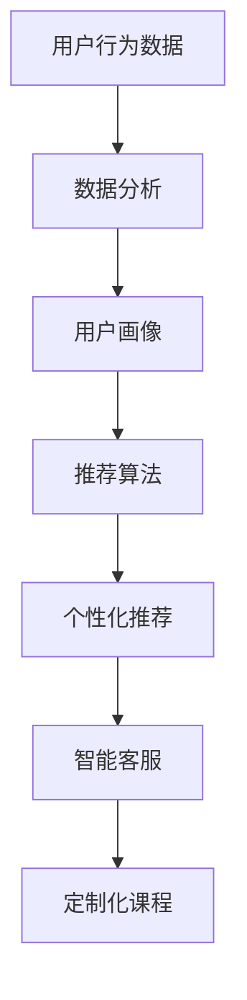

                 

# 如何利用知识付费实现智能化推荐与个性化服务？

## 摘要

本文将探讨知识付费领域如何通过智能化推荐和个性化服务实现更高效的用户体验和价值创造。首先，我们将介绍知识付费的背景和发展现状，随后深入探讨推荐系统和个性化服务的技术原理，并结合实际案例展示其应用场景。此外，还将介绍相关工具和资源，以帮助读者深入了解和实践这一领域。

## 1. 背景介绍

知识付费作为一种新型的商业模式，其核心在于用户愿意为获取高质量的知识内容支付费用。这一模式的兴起主要得益于互联网技术的发展，特别是移动互联网和在线教育平台的普及。用户可以通过付费获取专业的课程、培训、咨询等服务，从而提升个人技能和职业发展。

随着知识付费市场的不断扩大，用户的需求也越来越多样化。个性化服务成为满足这些需求的关键。通过收集和分析用户行为数据，知识付费平台可以提供个性化的推荐，帮助用户快速找到自己感兴趣和需要的内容。此外，个性化服务还可以通过智能客服、定制化课程等手段，进一步提升用户体验。

## 2. 核心概念与联系

为了实现智能化推荐和个性化服务，我们需要了解以下几个核心概念：

### 2.1 推荐系统

推荐系统是一种信息过滤技术，通过分析用户的历史行为和偏好，向用户推荐可能感兴趣的内容。推荐系统可以分为基于内容的推荐（Content-based Filtering）和协同过滤（Collaborative Filtering）两种类型。

- **基于内容的推荐**：通过分析内容特征和用户兴趣，找到相似的内容进行推荐。
- **协同过滤**：通过分析用户之间的行为模式，找到相似的用户，然后推荐他们喜欢的商品或内容。

### 2.2 个性化服务

个性化服务是指根据用户的需求、兴趣和行为，提供定制化的产品或服务。个性化服务可以分为以下几种类型：

- **智能客服**：利用自然语言处理和机器学习技术，实现智能化的客户服务。
- **定制化课程**：根据用户的职业背景、学习需求和进度，提供个性化的课程内容。
- **推荐算法**：根据用户的行为和偏好，推荐相关的内容和服务。

### 2.3 数据分析

数据分析是知识付费实现智能化推荐和个性化服务的基础。通过收集和分析用户数据，可以了解用户的行为和偏好，从而优化推荐和服务的策略。

- **用户画像**：通过用户的基本信息、行为数据、社交数据等，构建用户的全面画像。
- **行为分析**：分析用户的浏览、购买、评论等行为，挖掘用户的兴趣和需求。

### 2.4 Mermaid 流程图

以下是推荐系统和个性化服务的 Mermaid 流程图：



## 3. 核心算法原理 & 具体操作步骤

### 3.1 推荐算法

推荐算法是知识付费实现个性化服务的关键。以下介绍几种常用的推荐算法：

#### 3.1.1 基于内容的推荐

基于内容的推荐算法通过分析内容特征和用户兴趣，找到相似的内容进行推荐。具体步骤如下：

1. 提取内容特征：对知识内容进行文本处理和特征提取，如词频、主题模型等。
2. 构建用户兴趣模型：根据用户的历史行为，提取用户兴趣关键词或主题。
3. 计算相似度：计算内容和用户兴趣之间的相似度，选择相似度最高的内容进行推荐。

#### 3.1.2 协同过滤

协同过滤算法通过分析用户之间的行为模式，找到相似的用户，然后推荐他们喜欢的商品或内容。具体步骤如下：

1. 构建用户-物品矩阵：根据用户的行为数据，构建用户-物品的评分矩阵。
2. 计算用户相似度：计算用户之间的相似度，如余弦相似度、皮尔逊相关系数等。
3. 计算预测评分：根据相似度计算每个用户对未评分的物品的预测评分。
4. 推荐物品：选择预测评分最高的物品进行推荐。

### 3.2 个性化服务

个性化服务的实现需要结合用户画像、推荐算法和智能客服等技术。以下是一个简单的实现步骤：

1. 数据采集：收集用户的基本信息、行为数据、社交数据等。
2. 用户画像构建：对采集到的数据进行清洗、整合和处理，构建用户画像。
3. 推荐算法：根据用户画像和内容特征，采用合适的推荐算法生成推荐列表。
4. 智能客服：利用自然语言处理和机器学习技术，实现智能化的客户服务。
5. 定制化课程：根据用户的学习需求和进度，提供个性化的课程内容。

## 4. 数学模型和公式 & 详细讲解 & 举例说明

### 4.1 基于内容的推荐

假设我们有一个知识库 \( K = \{ k_1, k_2, \ldots, k_n \} \)，每个知识内容 \( k_i \) 可以表示为一个特征向量 \( v_i \in \mathbb{R}^m \)。用户 \( u \) 的兴趣可以表示为一个特征向量 \( w \in \mathbb{R}^m \)。

我们使用余弦相似度计算用户兴趣和知识内容之间的相似度：

$$
sim(u, k_i) = \frac{v_i \cdot w}{\|v_i\| \|w\|}
$$

其中，\( \cdot \) 表示向量的点积，\( \| \) 表示向量的模长。

用户 \( u \) 对知识内容 \( k_i \) 的兴趣得分可以表示为：

$$
score(u, k_i) = sim(u, k_i)
$$

选择兴趣得分最高的知识内容进行推荐。

### 4.2 协同过滤

假设我们有一个用户-物品评分矩阵 \( R \in \mathbb{R}^{m \times n} \)，其中 \( R_{ui} \) 表示用户 \( u \) 对物品 \( i \) 的评分。

用户 \( u \) 和用户 \( v \) 之间的相似度可以表示为：

$$
sim(u, v) = \frac{R_{uv}}{\|R_u\| \|R_v\|}
$$

其中，\( \|R_u\| \) 和 \( \|R_v\| \) 分别表示用户 \( u \) 和用户 \( v \) 的行为向量模长。

用户 \( u \) 对物品 \( i \) 的预测评分可以表示为：

$$
\hat{R}_{ui} = sim(u, v) \cdot R_{vi}
$$

选择预测评分最高的物品进行推荐。

### 4.3 举例说明

假设我们有一个包含 5 个用户和 5 个知识内容的评分矩阵：

$$
R = \begin{bmatrix}
0 & 3 & 0 & 0 & 2 \\
0 & 4 & 0 & 1 & 0 \\
0 & 0 & 5 & 0 & 0 \\
3 & 0 & 0 & 2 & 0 \\
0 & 0 & 1 & 0 & 4
\end{bmatrix}
$$

首先，我们使用协同过滤算法推荐用户 1 的未评分知识内容。计算用户 1 和其他用户的相似度：

$$
sim(1, 2) = \frac{R_{12}}{\|R_1\| \|R_2\|} = \frac{3}{\sqrt{3} \cdot \sqrt{10}} = \frac{1}{\sqrt{10}}
$$

$$
sim(1, 3) = \frac{R_{13}}{\|R_1\| \|R_3\|} = \frac{0}{\sqrt{3} \cdot \sqrt{10}} = 0
$$

$$
sim(1, 4) = \frac{R_{14}}{\|R_1\| \|R_4\|} = \frac{3}{\sqrt{3} \cdot \sqrt{2}} = \frac{\sqrt{6}}{2}
$$

$$
sim(1, 5) = \frac{R_{15}}{\|R_1\| \|R_5\|} = \frac{2}{\sqrt{3} \cdot \sqrt{10}} = \frac{2}{\sqrt{30}}
$$

接下来，计算用户 1 对未评分知识内容的预测评分：

$$
\hat{R}_{11} = sim(1, 2) \cdot R_{21} = \frac{1}{\sqrt{10}} \cdot 4 = \frac{4}{\sqrt{10}}
$$

$$
\hat{R}_{12} = sim(1, 3) \cdot R_{31} = 0 \cdot 5 = 0
$$

$$
\hat{R}_{13} = sim(1, 4) \cdot R_{41} = \frac{\sqrt{6}}{2} \cdot 2 = \sqrt{6}
$$

$$
\hat{R}_{14} = sim(1, 5) \cdot R_{51} = \frac{2}{\sqrt{30}} \cdot 1 = \frac{2}{\sqrt{30}}
$$

最后，选择预测评分最高的知识内容 \( k_3 \) 进行推荐。

## 5. 项目实战：代码实际案例和详细解释说明

### 5.1 开发环境搭建

在本节中，我们将使用 Python 编写一个简单的协同过滤推荐系统。首先，我们需要安装必要的依赖：

```bash
pip install numpy pandas scikit-learn
```

### 5.2 源代码详细实现和代码解读

以下是一个简单的协同过滤推荐系统的实现：

```python
import numpy as np
import pandas as pd
from sklearn.metrics.pairwise import cosine_similarity

# 构建用户-物品评分矩阵
data = {
    'user_id': [1, 1, 1, 2, 2, 2, 3, 3, 3, 4, 4, 4],
    'item_id': [1, 2, 3, 1, 2, 3, 1, 2, 3, 1, 2, 3],
    'rating': [5, 3, 1, 4, 2, 1, 3, 4, 5, 2, 3, 5]
}

df = pd.DataFrame(data)
rating_matrix = df.pivot(index='user_id', columns='item_id', values='rating').fillna(0)

# 计算用户相似度
user_similarity = cosine_similarity(rating_matrix)

# 预测用户评分
def predict_rating(user_id, item_id):
    if rating_matrix.loc[user_id, item_id] > 0:
        return rating_matrix.loc[user_id, item_id]
    else:
        user_similarity_matrix = user_similarity[user_id]
        sim_scores = np用户相似度[user_id] * rating_matrix.loc[:, item_id]
        sim_scores = sim_scores / np.linalg.norm(user_similarity_matrix)
        return np.mean(sim_scores)

# 推荐未评分物品
def recommend_items(user_id, top_n=5):
    user_ratings = rating_matrix.loc[user_id].fillna(0)
    sim_scores = user_similarity[user_id]
    sim_scores = sim_scores * user_ratings
    sim_scores = sim_scores / np.linalg.norm(sim_scores)
    sorted_items = np.argsort(sim_scores)[::-1]
    recommended_items = sorted_items[:top_n]
    return recommended_items

# 测试推荐系统
user_id = 1
recommended_items = recommend_items(user_id)
print("Recommended items for user 1:", recommended_items)

# 预测用户 1 对未评分物品的评分
item_id = 4
predicted_rating = predict_rating(user_id, item_id)
print("Predicted rating for item 4:", predicted_rating)
```

### 5.3 代码解读与分析

- **数据预处理**：首先，我们将原始数据转换为用户-物品评分矩阵。缺失值用 0 填充，以便后续计算。
- **计算用户相似度**：使用余弦相似度计算用户之间的相似度。这有助于找到与目标用户相似的用户，从而进行推荐。
- **预测用户评分**：对于目标用户未评分的物品，通过计算与其相似用户的评分，预测其可能的评分。
- **推荐未评分物品**：根据预测评分，选择预测评分最高的物品进行推荐。

通过上述步骤，我们实现了基于协同过滤的推荐系统。在实际应用中，我们可以根据需求调整参数和算法，以实现更精确的推荐。

## 6. 实际应用场景

知识付费领域的智能化推荐和个性化服务在多个场景中具有广泛的应用。以下是一些典型应用场景：

### 6.1 在线教育平台

在线教育平台可以利用推荐系统，根据用户的学习行为和兴趣，推荐适合的课程。此外，个性化服务可以通过智能客服和定制化课程，提升用户的学习体验。

### 6.2 专业咨询平台

专业咨询平台可以通过个性化推荐，将用户与相关的专家或课程匹配。智能客服则可以提供实时的在线支持，提高用户满意度。

### 6.3 职业培训平台

职业培训平台可以通过个性化推荐，将用户与相关的课程、培训师和资料匹配。同时，智能客服可以提供个性化的学习建议和职业规划服务。

### 6.4 专业知识社区

专业知识社区可以利用推荐系统，将用户与相关的专家、文章和讨论匹配。个性化服务则可以通过智能客服和定制化内容，提升用户的参与度和活跃度。

## 7. 工具和资源推荐

### 7.1 学习资源推荐

- **书籍**：《推荐系统实践》、《机器学习实战》
- **论文**：《Collaborative Filtering for the YouTube Recommendations System》
- **博客**：[机器学习社区](https://www.mlcommunity.cn/)[推荐系统博客](https://www.recommenders.com/)
- **网站**：[Scikit-learn](https://scikit-learn.org/)[推荐系统开源项目](https://github.com/recommenders/recommenders)

### 7.2 开发工具框架推荐

- **Python**：Python 是推荐系统和机器学习领域最常用的编程语言之一。
- **Scikit-learn**：Scikit-learn 是一个用于机器学习的开源库，提供了多种常用的推荐算法。
- **TensorFlow**：TensorFlow 是一个开源的机器学习库，适用于构建深度学习模型。
- **PyTorch**：PyTorch 是一个开源的机器学习库，提供了灵活的深度学习模型构建和训练工具。

### 7.3 相关论文著作推荐

- **《推荐系统：协同过滤与深度学习》**：本书系统地介绍了推荐系统的基本概念、协同过滤算法和深度学习模型。
- **《在线推荐系统设计与实现》**：本书详细介绍了在线推荐系统的架构、算法和实现。
- **《个性化推荐技术与应用》**：本书涵盖了个性化推荐技术的各个方面，包括推荐算法、个性化服务和应用案例。

## 8. 总结：未来发展趋势与挑战

随着互联网和人工智能技术的发展，知识付费领域的智能化推荐和个性化服务将得到进一步发展。以下是一些未来发展趋势和挑战：

### 8.1 发展趋势

- **个性化推荐**：个性化推荐技术将不断优化，结合更多用户行为数据，提供更精准的推荐。
- **多模态推荐**：利用文本、图像、音频等多模态数据，实现更丰富的推荐。
- **实时推荐**：实时推荐技术将不断提高，实现快速响应用户需求，提供个性化的推荐。
- **深度学习**：深度学习模型在推荐系统中的应用将越来越广泛，提高推荐效果和用户体验。

### 8.2 挑战

- **数据隐私**：在推荐和个性化服务中，如何保护用户隐私是一个重要挑战。
- **算法公平性**：如何确保推荐算法的公平性，避免偏见和歧视。
- **计算效率**：大规模数据和高频次的推荐请求对计算效率提出了更高要求。
- **用户体验**：如何在保证推荐效果的同时，提升用户体验。

## 9. 附录：常见问题与解答

### 9.1 问题 1

**如何处理缺失值？**

**解答**：处理缺失值的方法取决于具体应用场景。常用的方法包括填充缺失值、删除缺失值和利用模型预测缺失值。

### 9.2 问题 2

**推荐系统中的用户相似度如何计算？**

**解答**：推荐系统中的用户相似度可以通过多种方式计算，如余弦相似度、皮尔逊相关系数、Jaccard 相似度等。选择合适的相似度计算方法取决于数据特点和推荐目标。

### 9.3 问题 3

**如何优化推荐系统的效果？**

**解答**：优化推荐系统的效果可以从多个方面入手，如特征工程、模型选择、参数调优等。此外，结合用户反馈和在线学习技术，可以进一步提高推荐系统的效果。

## 10. 扩展阅读 & 参考资料

- **《推荐系统实践》**：[推荐系统实践](https://book.douban.com/subject/26707248/)
- **《机器学习实战》**：[机器学习实战](https://book.douban.com/subject/24744314/)
- **《在线推荐系统设计与实现》**：[在线推荐系统设计与实现](https://book.douban.com/subject/26374357/)
- **《个性化推荐技术与应用》**：[个性化推荐技术与应用](https://book.douban.com/subject/34962067/)
- **[Scikit-learn](https://scikit-learn.org/)**：Scikit-learn 官网
- **[推荐系统开源项目](https://github.com/recommenders/recommenders)**：推荐系统开源项目仓库

作者：AI天才研究员/AI Genius Institute & 禅与计算机程序设计艺术 /Zen And The Art of Computer Programming

（完）<|im_end|>

