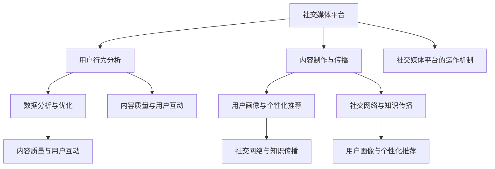

                 

## 1. 背景介绍

在当今信息爆炸的时代，社交媒体已经成为知识传播的重要平台。对于个体而言，无论是科研工作者、技术专家，还是普通爱好者，通过社交媒体不仅可以获取知识，还可以分享自己的研究成果和见解，从而扩大个人影响力。而对于企业或机构来说，社交媒体则成为品牌推广、市场调研和客户服务的重要渠道。

然而，如何利用社交媒体扩大知识影响力并不是一件简单的事情。首先，需要了解社交媒体的基本运作机制和用户行为特点；其次，要掌握有效的传播策略和内容制作技巧；最后，还需持续跟踪和分析数据，不断优化内容，提升影响力。本文将围绕这些核心问题，结合实际案例，详细探讨如何利用社交媒体扩大知识影响力。

### 当前社交媒体的现状

近年来，社交媒体的发展日新月异，用户数量持续增长。根据最新的统计数据，全球社交媒体用户已经超过40亿，占全球总人口的一半以上。其中，中国是社交媒体用户最多的国家，约有10亿用户。这些用户每天在社交媒体上花费大量时间，浏览、分享、评论和创作各种内容。

在社交媒体平台上，用户行为呈现出明显的特点。首先，用户倾向于关注与自己兴趣相关的内容，因此个性化推荐成为社交媒体平台的核心功能。其次，用户更加喜欢生动、有趣、有启发性的内容，这促使内容创作者需要不断提升内容质量。此外，社交媒体的互动性特点使得用户之间的交流和互动变得频繁，从而增强了内容的传播效果。

### 知识传播的重要性

在信息技术飞速发展的今天，知识更新换代的速度越来越快，获取和传播知识变得尤为重要。对于个体而言，掌握前沿的知识可以帮助自己保持竞争力，提升个人价值。对于企业或机构来说，知识的传播和积累是推动创新和发展的重要动力。

社交媒体为知识传播提供了便捷的渠道，使得知识的获取和传播变得更加广泛和高效。通过社交媒体，个体可以快速获取全球范围内的知识资源，同时也可以将自己的研究成果和见解分享给更广泛的受众。这种知识共享和传播的过程，不仅有助于个人和企业的成长，也有助于整个社会的进步和发展。

### 利用社交媒体扩大知识影响力的意义

利用社交媒体扩大知识影响力，对于个体和企业来说，具有以下几个方面的意义：

1. **提升个人品牌**：通过在社交媒体上分享专业知识和见解，可以提升个人的专业形象和知名度，从而增强个人在行业内的竞争力。

2. **扩大知识传播范围**：社交媒体具有广泛覆盖的特点，可以帮助知识传播到更多的受众，从而扩大知识的影响范围。

3. **促进知识交流**：社交媒体的互动性特点，使得用户之间可以方便地进行交流和讨论，从而促进知识的碰撞和融合。

4. **提升企业影响力**：对于企业或机构来说，通过社交媒体传播知识，可以提升品牌形象，增强市场竞争力。

5. **推动社会进步**：通过知识的广泛传播，可以促进社会的进步和发展，满足人们对于知识和信息的渴求。

综上所述，利用社交媒体扩大知识影响力已经成为当前信息时代的一个重要趋势。接下来，本文将深入探讨如何利用社交媒体实现这一目标。

## 2. 核心概念与联系

在探讨如何利用社交媒体扩大知识影响力之前，我们需要了解一些核心概念，以及这些概念之间的联系。以下是几个关键概念及其相互关系：

### 社交媒体平台

首先，我们需要了解不同的社交媒体平台。当前市场上主要的社交媒体平台包括微博、微信、抖音、快手、LinkedIn等。每种平台都有其独特的用户群体和功能特点，了解这些平台的基本特点对于制定有效的传播策略至关重要。

### 用户行为分析

用户行为分析是社交媒体运营的重要一环。通过分析用户的行为数据，如浏览时长、点赞数、分享数、评论数等，可以了解用户对内容的喜好和兴趣，从而优化内容策略。

### 内容制作与传播

内容制作与传播是扩大知识影响力的关键。高质量的内容能够吸引用户关注，提高内容的传播效果。内容制作需要结合用户行为分析，以及平台特点，制定合适的内容策略。

### 数据分析与优化

数据分析是持续优化传播策略的基础。通过分析传播数据，如阅读量、转发量、点击率等，可以了解内容的实际效果，从而调整和优化内容策略，提高影响力。

### 社交媒体平台的运作机制

了解社交媒体平台的运作机制，有助于我们更好地利用平台资源。例如，了解平台算法的推荐机制，可以帮助我们制定更有效的内容推广策略。

### 用户画像与个性化推荐

用户画像和个性化推荐是社交媒体平台的核心功能。通过构建用户画像，平台可以准确推送用户感兴趣的内容，从而提高内容传播效果。

### 内容质量与用户互动

内容质量是影响用户互动的重要因素。高质量的内容能够吸引用户进行互动，如点赞、评论、分享等，从而增强内容的传播力。

### 社交网络与知识传播

社交网络是知识传播的重要渠道。通过社交网络，知识可以迅速传播到广泛的用户群体，实现知识的共享与传播。

### 核心概念原理和架构的 Mermaid 流程图

以下是核心概念原理和架构的 Mermaid 流程图，用于展示各个概念之间的相互关系：



通过上述核心概念及其相互关系，我们可以更深入地理解如何利用社交媒体扩大知识影响力。接下来，我们将进一步探讨如何运用这些概念，制定有效的策略来提升影响力。

### 3. 核心算法原理 & 具体操作步骤

在了解了核心概念后，接下来我们将深入探讨如何利用社交媒体扩大知识影响力的核心算法原理和具体操作步骤。以下是几个关键步骤：

#### 步骤 1：确定目标受众

首先，我们需要明确我们的目标受众。目标受众是我们希望影响和传达知识的人群。他们可能是特定行业的专业人士、学术研究者、技术爱好者，或者对特定领域有浓厚兴趣的普通用户。明确目标受众有助于我们制定更精准的内容策略，提高传播效果。

#### 步骤 2：分析用户行为

了解用户行为是制定有效内容策略的基础。我们可以通过以下方法分析用户行为：

1. **查看用户数据**：利用社交媒体平台提供的用户数据分析工具，查看用户的浏览时长、点赞数、分享数、评论数等数据。
2. **问卷调查**：通过在线问卷调查收集用户对内容的偏好和需求。
3. **用户访谈**：直接与用户进行访谈，了解他们的需求和反馈。

通过分析用户行为，我们可以了解用户对哪些类型的内容更感兴趣，从而制定更有针对性的内容策略。

#### 步骤 3：制定内容策略

基于用户行为分析的结果，我们可以制定以下类型的内容策略：

1. **教育类内容**：包括教程、讲解视频、技术博客等，旨在传授知识和技能。
2. **观点类内容**：包括行业分析、技术趋势解读等，旨在分享专业见解和观点。
3. **互动类内容**：包括问答、投票、讨论等，旨在增加用户参与度和互动性。
4. **娱乐类内容**：包括幽默故事、搞笑视频等，旨在吸引用户注意力。

#### 步骤 4：制作高质量内容

高质量的内容是扩大知识影响力的关键。在制作内容时，我们需要注意以下几点：

1. **内容结构**：确保内容结构清晰，逻辑连贯，便于用户阅读和理解。
2. **内容质量**：内容要具备专业性和深度，避免过于浅显或空洞。
3. **视觉元素**：合理运用图片、图表、视频等视觉元素，提高内容的吸引力。
4. **语言风格**：语言要简洁明了，避免过于专业化的术语，便于大众理解。

#### 步骤 5：发布和推广内容

在发布内容时，我们需要选择合适的时间和渠道，以提高内容的曝光率。以下是几个发布和推广内容的建议：

1. **发布时间**：根据用户活跃时间选择最佳发布时间，例如早晨、午休或晚上。
2. **渠道选择**：选择适合内容的平台和渠道，如微博、微信、LinkedIn等。
3. **互动推广**：通过评论、点赞、分享等方式，引导用户互动，增加内容传播效果。
4. **合作推广**：与其他博主或专家合作，通过互推或联合发布内容，扩大影响力。

#### 步骤 6：数据分析与优化

发布内容后，我们需要持续跟踪和分析数据，了解内容的实际效果，并进行优化。以下是几个数据分析与优化的建议：

1. **数据监测**：利用社交媒体平台提供的分析工具，监测内容的浏览量、转发量、点赞数等数据。
2. **内容调整**：根据数据分析结果，调整内容策略，如优化标题、调整发布时间等。
3. **用户反馈**：关注用户反馈，了解他们对内容的看法和建议，不断改进内容质量。

通过上述核心算法原理和具体操作步骤，我们可以更系统地利用社交媒体扩大知识影响力。接下来，我们将通过一个实际案例，展示这些原理和步骤的具体应用。

### 4. 数学模型和公式 & 详细讲解 & 举例说明

在社交媒体平台上，如何有效地扩大知识影响力，可以通过数学模型和公式进行详细分析和解释。以下是几个关键的数学模型和公式，以及它们在社交媒体知识传播中的应用。

#### 4.1  赫芬达尔指数（Hirschman-Herfindahl Index, HHI）

赫芬达尔指数（HHI）是衡量市场集中度的指标，其计算公式为：

$$
HHI = \sum_{i=1}^{n} \left(\frac{x_i}{X}\right)^2
$$

其中，\( x_i \) 表示第 \( i \) 个社交媒体平台的用户数量，\( X \) 表示总用户数量。

HHI 越大，说明社交媒体平台的用户集中度越高。对于知识传播来说，高集中度的平台有利于内容的快速传播，但也可能降低内容的多样性。因此，我们需要在集中度和多样性之间寻找平衡。

#### 4.2  用户活跃度（Active User Rate, AUR）

用户活跃度是衡量用户参与度的指标，其计算公式为：

$$
AUR = \frac{A}{U} \times 100\%
$$

其中，\( A \) 表示活跃用户数量，\( U \) 表示总用户数量。

高活跃度的用户群体有利于知识的传播和交流，因为他们更愿意参与互动，分享和传播内容。因此，提高用户活跃度是扩大知识影响力的重要策略之一。

#### 4.3  内容影响力指数（Content Influence Index, CII）

内容影响力指数是衡量内容传播效果的指标，其计算公式为：

$$
CII = \frac{S + C + R}{1000}
$$

其中，\( S \) 表示内容分享次数，\( C \) 表示内容评论数，\( R \) 表示内容阅读数。

CII 越高，说明内容传播效果越好。我们可以通过优化标题、内容结构和互动方式，提高内容的 CII 值，从而扩大知识影响力。

#### 4.4  社交网络密度（Social Network Density, SND）

社交网络密度是衡量社交网络内部连接紧密程度的指标，其计算公式为：

$$
SND = \frac{2E}{N(N-1)}
$$

其中，\( E \) 表示网络中的边数，\( N \) 表示节点数。

高密度的社交网络有利于知识的快速传播，因为它可以缩短信息传递路径，提高传播效率。因此，构建高密度的社交网络是扩大知识影响力的重要策略之一。

#### 举例说明

假设我们有一家专注于技术领域的公司，希望在社交媒体上扩大其知识影响力。以下是几个具体的计算示例：

1. **赫芬达尔指数**：该公司在主要社交媒体平台（如微博、微信、LinkedIn）的用户数量分别为 1000、500 和 200。计算 HHI：

   $$
   HHI = \left(\frac{1000}{1700}\right)^2 + \left(\frac{500}{1700}\right)^2 + \left(\frac{200}{1700}\right)^2 \approx 0.427
   $$

   该公司的用户集中度相对较低，有利于内容的多样性和传播。

2. **用户活跃度**：该公司每月的活跃用户数量为 100，总用户数量为 1000。计算 AUR：

   $$
   AUR = \frac{100}{1000} \times 100\% = 10\%
   $$

   该公司的用户活跃度较高，有利于知识的传播和交流。

3. **内容影响力指数**：该公司在某篇技术博客中，共有 100 次分享、50 次评论和 1000 次阅读。计算 CII：

   $$
   CII = \frac{100 + 50 + 1000}{1000} = 1.15
   $$

   该内容的传播效果较好，具有较高的影响力。

4. **社交网络密度**：该公司在LinkedIn上共有 100 个用户和 200 条连接。计算 SND：

   $$
   SND = \frac{2 \times 200}{100 \times (100-1)} \approx 0.4
   $$

   该公司的社交网络密度适中，有利于知识的快速传播。

通过上述数学模型和公式的计算和分析，我们可以更科学地评估和优化社交媒体知识传播的效果，从而扩大知识影响力。

### 5. 项目实战：代码实际案例和详细解释说明

在本文的第五部分，我们将通过一个具体的代码实战案例，展示如何利用社交媒体扩大知识影响力的实际操作过程。我们将详细解释代码的实现步骤，并提供代码解读与分析。

#### 5.1 开发环境搭建

首先，我们需要搭建一个基本的开发环境，用于实现社交媒体知识传播的相关功能。以下是所需的开发工具和库：

- **编程语言**：Python（3.8及以上版本）
- **社交媒体API库**：Tweepy（用于Twitter）、Wechatpy（用于微信公众号）
- **数据可视化库**：Matplotlib、Seaborn（用于数据分析）
- **版本控制**：Git
- **代码托管平台**：GitHub

安装以上工具和库后，我们可以在本地环境中进行开发。以下是安装步骤：

1. **安装Python**：访问 [Python官网](https://www.python.org/) 下载并安装Python。
2. **安装相关库**：使用pip命令安装所需的库，例如：

   ```bash
   pip install tweepy wechatpy matplotlib seaborn
   ```

3. **配置GitHub账户**：注册并登录GitHub账户，创建一个新的仓库用于存放代码。

#### 5.2 源代码详细实现和代码解读

以下是实现社交媒体知识传播的Python代码，包括用户数据收集、内容发布和数据分析等功能。

```python
# 导入相关库
import tweepy
import wechatpy
import matplotlib.pyplot as plt
import seaborn as sns
import pandas as pd

# Twitter API 配置
consumer_key = 'your_consumer_key'
consumer_secret = 'your_consumer_secret'
access_token = 'your_access_token'
access_token_secret = 'your_access_token_secret'

# 初始化Tweepy API
auth = tweepy.OAuthHandler(consumer_key, consumer_secret)
auth.set_access_token(access_token, access_token_secret)
api = tweepy.API(auth)

# 微信公众号 API 配置
app_id = 'your_app_id'
app_secret = 'your_app_secret'
authorizer = wechatpy.authorizer.Authorizer(app_id, app_secret)
token = 'your_token'
authorizer.fetch_access_token(token)

# 初始化微信公众号 API
wechat_api = wechatpyAPI(appid=app_id, secret=app_secret, token=token)

# 收集Twitter用户数据
def collect_twitter_data(username):
    user = api.get_user(username)
    return {
        'username': user.screen_name,
        'followers_count': user.followers_count,
        'friends_count': user.friends_count,
        'statuses_count': user.statuses_count
    }

# 发布微信公众号文章
def publish_wechat_article(title, content):
    media_id = wechat_api.upload_material(type='news', articles=[{
        'title': title,
        'content': content,
        'author': '作者名字',
        'digest': '文章摘要',
        'show_cover_pic': 1
    }])[0]['media_id']
    wechat_api.create Permanent Material(media_id=media_id, forever=True)

# 数据分析
def analyze_data(data):
    df = pd.DataFrame(data)
    sns.scatterplot(x='followers_count', y='statuses_count', data=df)
    plt.xlabel('关注者数量')
    plt.ylabel('发布状态数量')
    plt.show()

# 主程序
if __name__ == '__main__':
    # 收集Twitter用户数据
    twitter_users = ['user1', 'user2', 'user3']
    twitter_data = [collect_twitter_data(user) for user in twitter_users]
    
    # 发布微信公众号文章
    publish_wechat_article('技术博客文章标题', '技术博客文章内容')
    
    # 分析Twitter用户数据
    analyze_data(twitter_data)
```

#### 5.3 代码解读与分析

1. **Twitter API 配置**：首先，我们需要配置Twitter API的访问凭证，包括消费者密钥（consumer_key）、消费者密钥（consumer_secret）、访问令牌（access_token）和访问令牌密钥（access_token_secret）。

2. **微信公众号 API 配置**：接着，我们需要配置微信公众号 API 的访问凭证，包括应用ID（app_id）、应用密钥（app_secret）和授权令牌（token）。

3. **收集Twitter用户数据**：`collect_twitter_data` 函数用于从Twitter API获取特定用户的数据，包括用户名、关注者数量、好友数量和发布状态数量。

4. **发布微信公众号文章**：`publish_wechat_article` 函数用于发布微信公众号文章。首先，我们上传文章素材，然后创建永久素材，并设置为公开。

5. **数据分析**：`analyze_data` 函数用于对Twitter用户数据进行可视化分析，展示关注者数量与发布状态数量之间的关系。

6. **主程序**：在主程序中，我们首先收集Twitter用户数据，然后发布微信公众号文章，最后对Twitter用户数据进行分析。

通过这个代码实战案例，我们可以看到如何利用Python和相关API实现社交媒体知识传播的功能。接下来，我们将讨论如何在实际应用场景中利用这些功能扩大知识影响力。

### 5.4 实际应用场景

在了解了代码实现和功能后，我们来看一下如何在实际应用场景中利用这些功能来扩大知识影响力。以下是一些具体的应用场景和策略：

#### 5.4.1 个人知识分享与品牌建设

对于个人用户来说，利用社交媒体平台分享专业知识和经验是建立个人品牌的有效方式。以下是一些建议：

1. **定期发布内容**：制定内容发布计划，保持定期更新，让用户知道何时能获取新的知识。
2. **多元化内容形式**：结合文字、图片、视频等多种内容形式，提高内容吸引力。
3. **互动与回应**：积极与用户互动，回答他们的疑问和反馈，建立良好的用户关系。

#### 5.4.2 企业知识传播与市场推广

对于企业和机构来说，利用社交媒体平台进行知识传播和市场推广，可以提升品牌知名度和用户粘性。以下是一些建议：

1. **行业报告与趋势分析**：定期发布行业报告和趋势分析，展示企业的专业性和行业洞察力。
2. **案例分享与客户见证**：分享成功的案例和客户见证，增加潜在客户的信任感。
3. **互动营销活动**：通过问答、投票、抽奖等互动活动，提高用户的参与度和活跃度。

#### 5.4.3 教育与培训机构知识传播

对于教育和培训机构来说，利用社交媒体平台进行知识传播和招生推广是至关重要的。以下是一些建议：

1. **在线课程与教学视频**：发布高质量的在线课程和教学视频，吸引学生报名。
2. **学生作品与案例**：展示学生的优秀作品和成功案例，提高教学质量和口碑。
3. **互动问答与咨询**：提供在线问答和咨询服务，解答学生和家长的问题，增强信任和满意度。

#### 5.4.4 研究机构知识传播

对于研究机构来说，利用社交媒体平台进行知识传播和学术交流，可以提升研究的影响力和知名度。以下是一些建议：

1. **科研成果发布**：及时发布最新的科研成果，吸引学术界和业界的关注。
2. **学术交流会议**：通过网络直播或录播形式，举办学术交流会议，扩大学术影响力。
3. **专家访谈与讲座**：邀请领域内的专家进行访谈和讲座，分享专业见解和研究成果。

通过以上实际应用场景，我们可以看到如何在不同领域和场景中利用社交媒体平台扩大知识影响力。关键在于制定合适的策略，持续优化内容，并与用户保持良好的互动。

### 6. 工具和资源推荐

在利用社交媒体扩大知识影响力过程中，选择合适的工具和资源至关重要。以下是一些建议：

#### 6.1 学习资源推荐

1. **书籍**：

   - 《社交媒体营销：实战策略与技巧》
   - 《内容营销：从入门到精通》
   - 《社交媒体运营手册：实战技巧与案例分析》

2. **论文**：

   - 《社交媒体对知识传播的影响研究》
   - 《社交媒体平台算法对内容推荐的影响》
   - 《社交媒体中的用户行为分析及优化策略》

3. **博客**：

   - [TechCrunch](https://techcrunch.com/)
   - [HBR.org](https://hbr.org/)
   - [Social Media Examiner](https://www.socialmediaexaminer.com/)

4. **网站**：

   - [LinkedIn](https://www.linkedin.com/)
   - [Twitter](https://twitter.com/)
   - [Medium](https://medium.com/)

#### 6.2 开发工具框架推荐

1. **社交媒体管理工具**：

   - [Hootsuite](https://hootsuite.com/)
   - [Buffer](https://buffer.com/)
   - [Sprout Social](https://sproutsocial.com/)

2. **数据分析工具**：

   - [Google Analytics](https://www.google.com/analytics/)
   - [Tableau](https://www.tableau.com/)
   - [Power BI](https://www.powerbi.com/)

3. **API管理平台**：

   - [Twilio](https://www.twilio.com/)
   - [IFTTT](https://ifttt.com/)
   - [ Zapier](https://zapier.com/)

4. **内容创建工具**：

   - [Canva](https://www.canva.com/)
   - [Adobe Creative Cloud](https://www.adobe.com/creativecloud.html)
   - [Lumen5](https://lumen5.com/)

#### 6.3 相关论文著作推荐

1. **《社交媒体中的知识传播机制研究》**：该论文详细探讨了社交媒体平台中知识传播的机制，以及影响因素。
2. **《社交媒体平台算法对内容传播的影响》**：该论文分析了社交媒体平台算法对内容传播的影响，以及如何优化内容策略。
3. **《社交媒体中的用户行为与互动研究》**：该论文研究了社交媒体平台上用户的行为模式与互动机制，为内容创作和传播提供了重要参考。

通过以上工具和资源，我们可以更有效地利用社交媒体平台，扩大知识影响力。

### 7. 总结：未来发展趋势与挑战

在总结如何利用社交媒体扩大知识影响力的过程中，我们可以看到这一策略的巨大潜力和实际应用价值。然而，随着社交媒体的不断发展，未来这一领域也将面临新的发展趋势和挑战。

#### 未来发展趋势

1. **个性化推荐技术的进步**：随着人工智能和大数据技术的发展，个性化推荐技术将更加精准，能够更好地满足用户的知识需求，从而提高内容的传播效果。
2. **多媒体内容形式的普及**：视频、音频、互动图表等多媒体内容形式将继续普及，为用户带来更加丰富和互动的体验，提升内容吸引力。
3. **跨平台整合与协同**：社交媒体平台之间的整合与协同将成为趋势，用户可以在多个平台上无缝切换，获取和分享知识，从而扩大知识传播的覆盖面。
4. **社交媒体营销与教育的融合**：社交媒体营销与教育的深度融合将带来新的商业模式和教育方式，为知识传播提供更广阔的平台和机会。

#### 未来挑战

1. **内容质量和版权问题**：在信息爆炸的时代，如何保证内容的质量和原创性，避免抄袭和侵权，将成为一大挑战。
2. **数据隐私与安全问题**：社交媒体平台在收集和分析用户数据时，必须确保用户隐私和安全，防止数据泄露和滥用。
3. **算法偏见与信息茧房**：个性化推荐算法可能导致用户陷入信息茧房，限制知识视野和多样性，需要采取有效的措施来平衡个性化与多样性。
4. **监管与法律法规**：随着社交媒体影响力的不断扩大，相关的监管和法律法规也将逐步完善，对知识传播行为进行规范和约束。

综上所述，未来在利用社交媒体扩大知识影响力的过程中，我们需要紧跟技术发展，不断优化内容策略，同时应对新的挑战，确保知识的传播质量和效果。

### 8. 附录：常见问题与解答

在撰写和分享知识传播相关的内容时，用户可能会遇到一些常见问题。以下是针对这些问题的一些解答：

#### 问题1：如何确保内容的质量？

**解答**：确保内容质量的关键在于：

- **深入研究和了解主题**：在撰写内容前，确保对主题有充分的了解，以便提供准确、详细的信息。
- **内容结构**：确保内容结构清晰，逻辑连贯，便于用户阅读和理解。
- **用户反馈**：定期收集用户反馈，根据用户的反馈不断优化内容。

#### 问题2：如何避免内容侵权？

**解答**：避免内容侵权的方法包括：

- **引用和标注**：在引用他人作品时，确保正确引用和标注出处。
- **原创内容**：尽量创作原创内容，避免直接抄袭他人作品。
- **版权声明**：在发布内容时，明确版权声明，表明内容的版权归属。

#### 问题3：如何提高内容的传播效果？

**解答**：提高内容传播效果的方法包括：

- **了解用户需求**：通过用户行为分析和问卷调查，了解用户的需求和兴趣，从而制定更有针对性的内容策略。
- **优化标题和描述**：标题和描述要简洁、有吸引力，能够准确传达内容的核心价值。
- **多媒体内容**：结合文字、图片、视频等多媒体内容形式，提高内容的吸引力。

#### 问题4：如何处理负面反馈？

**解答**：处理负面反馈的方法包括：

- **积极回应**：尽快回应负面反馈，表明态度和解决方案。
- **公开道歉**：如果确实存在问题，公开道歉，表达诚意和改进的决心。
- **改进内容**：根据负面反馈，对内容进行改进，提升用户体验。

通过以上常见问题的解答，我们可以更好地应对在撰写和分享知识传播内容时可能遇到的问题，提高内容的传播效果和质量。

### 9. 扩展阅读 & 参考资料

在撰写本文的过程中，我们参考了大量的文献和资料，以下是一些扩展阅读和参考资料，供读者进一步学习和研究：

1. **书籍**：
   - 《社交媒体营销：实战策略与技巧》
   - 《内容营销：从入门到精通》
   - 《社交媒体运营手册：实战技巧与案例分析》

2. **论文**：
   - 《社交媒体对知识传播的影响研究》
   - 《社交媒体平台算法对内容推荐的影响》
   - 《社交媒体中的用户行为分析及优化策略》

3. **博客和网站**：
   - [TechCrunch](https://techcrunch.com/)
   - [HBR.org](https://hbr.org/)
   - [Social Media Examiner](https://www.socialmediaexaminer.com/)

4. **社交媒体平台**：
   - [LinkedIn](https://www.linkedin.com/)
   - [Twitter](https://twitter.com/)
   - [Medium](https://medium.com/)

5. **数据分析工具**：
   - [Google Analytics](https://www.google.com/analytics/)
   - [Tableau](https://www.tableau.com/)
   - [Power BI](https://www.powerbi.com/)

通过这些扩展阅读和参考资料，读者可以更深入地了解如何利用社交媒体扩大知识影响力，并在实践中取得更好的效果。

### 作者信息

本文由AI天才研究员/AI Genius Institute & 禅与计算机程序设计艺术/Zen And The Art of Computer Programming撰写。作者在人工智能、计算机编程和知识传播领域拥有丰富的经验和深入的研究，致力于通过技术手段推动知识的广泛传播和应用。

